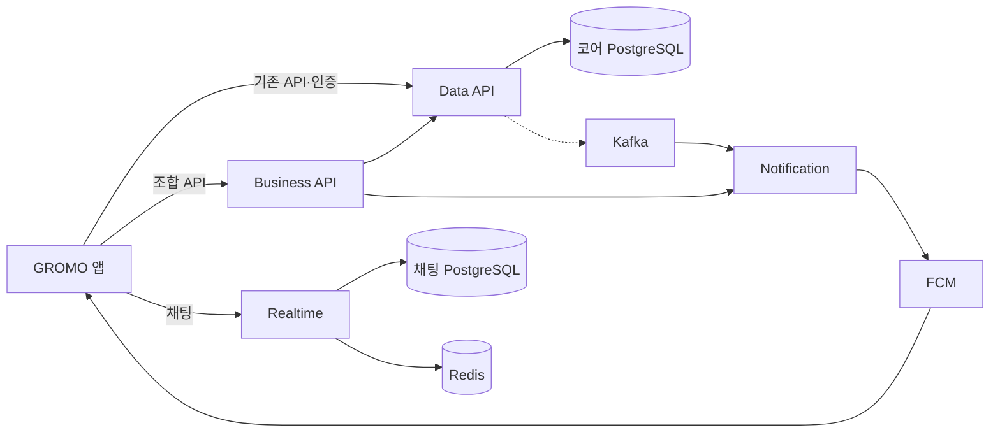

# GROMO

집중한 시간을 캐릭터의 성장과 섬 활동으로 이어 주는 시간 관리 앱입니다.
React Native(Expo) 앱과 네 개의 Spring Boot 서버를 한 저장소에서 관리합니다.

| 바로 시작하기 | 문서 |
| --- | --- |
| 앱을 실행하고 싶어요 | [앱 시작하기](app/app-dev/README.md#로컬-실행) |
| 서버 구성을 알고 싶어요 | [서버 전체 문서](server/README.md) |
| 기능 정책·설계를 찾고 싶어요 | [문서 인덱스](docs/README.md) |
| 시스템의 목표 구조를 보고 싶어요 | [서비스 아키텍처](docs/architecture/service-architecture.md) |
| 개발 규칙을 확인하고 싶어요 | [개발 가이드](CLAUDE.md) · [리뷰 규칙](AGENTS.md) |

## 제품과 시스템

GROMO는 집중 세션과 스크린타임을 기록하고 캐릭터·아이템·재화·친구·그룹 활동을 연결합니다. 기존 앱 API와 인증은 Data API가 담당하며, 서비스 분리에 따라 Business API, Notification, Realtime이 각자의 역할을 나눠 맡습니다.



현재 구현과 Target-1 목표 구조의 차이, 데이터 소유권, 서비스별 실행 방법은 [서버 전체 문서](server/README.md)에서 확인합니다.

## 저장소 지도

| 경로 | 역할 | 상세 문서 |
| --- | --- | --- |
| `app/app-dev/` | React Native·Expo 앱, iOS 확장, Android 네이티브 프로젝트 | [앱 README](app/app-dev/README.md) |
| `server/` | Business·Data·Notification·Realtime와 실행·관측 도구 | [서버 README](server/README.md) |
| `docs/` | 기능 정책·설계, 아키텍처, 팀 규약 | [문서 인덱스](docs/README.md) |
| `loadtest/` | k6 부하 테스트 하네스와 결과 해석 | [부하 테스트 README](loadtest/README.md) |
| `.github/workflows/` | 앱·서버 CI/CD와 문서 생성 | [워크플로 목록](.github/workflows/) |

## 로컬에서 시작하기

자주 쓰는 첫 실행 명령만 접어 두었습니다. 환경별 설정과 문제 해결은 각 상세 문서를 따릅니다.

<details>
<summary><strong>앱 실행 명령 보기</strong></summary>

```bash
cd app/app-dev
npm install
cp .env.example .env
npm start
```

네이티브 빌드, 백엔드 연결, TestFlight·Android 배포는 [앱 README](app/app-dev/README.md)를 참고합니다.

</details>

<details>
<summary><strong>Data API 실행 명령 보기</strong></summary>

```bash
docker compose -f server/scripts/docker-compose.local.yml up -d db redis
cd server/data-api
test -f src/main/resources/application-local.yml || cp src/main/resources/application-local.yml.example src/main/resources/application-local.yml
./gradlew bootRun --args='--spring.profiles.active=local'
```

API는 `http://localhost:8080`, Swagger UI는 `http://localhost:8080/swagger-ui/index.html`에서 확인합니다. 다른 서버의 실행 조건은 [서버 README](server/README.md)에 연결되어 있습니다.

</details>

## 문서 찾아가기

| 알고 싶은 것 | 문서 |
| --- | --- |
| 서버 전체 연결·현재 상태 | [server/README.md](server/README.md) |
| Business API | [server/business-api/README.md](server/business-api/README.md) |
| Data API | [server/data-api/README.md](server/data-api/README.md) |
| Notification | [server/notification/README.md](server/notification/README.md) |
| Realtime | [server/realtime/README.md](server/realtime/README.md) |
| 관측·배포 | [Observability](server/observability/README.md) · [Scripts](server/scripts/README.md) |
| 앱 구조·실행·배포 | [app/app-dev/README.md](app/app-dev/README.md) |
| 목표 아키텍처·결정 장부 | [docs/architecture/README.md](docs/architecture/README.md) |
| 기능별 PRD·정책·설계 | [docs/README.md](docs/README.md) |
| 백엔드 계층·오류·날짜 규약 | [docs/conventions/](docs/conventions/) |

## 변경에 참여하기

브랜치 이름과 커밋·PR 형식은 [CLAUDE.md](CLAUDE.md), 리뷰 언어와 심각도 표기는 [AGENTS.md](AGENTS.md)를 따릅니다. 앱과 서버는 툴링을 공유하지 않으므로 변경한 서비스 디렉터리에서 해당 검증 명령을 실행합니다.
