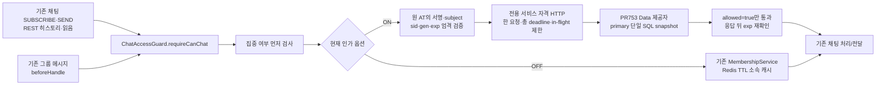
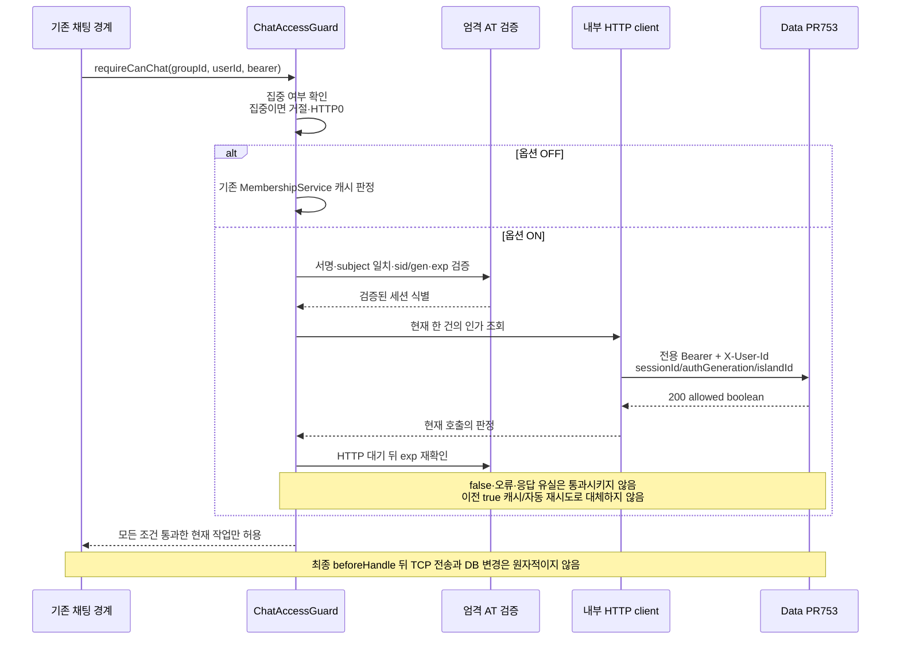

# 기존 채팅에서 현재 멤버십을 다시 확인하기

이 작업은 기존 채팅의 `ChatAccessGuard.requireCanChat`에 **선택적으로 Data의 현재 인가 조회를 연결**한다. 기본값은 OFF다. 서비스 개명 PR739 기반이며 Data 제공자는 [PR753](https://github.com/OneOrThree/phone/pull/753)으로 main에 머지돼 있다(기본 비활성). 켤 때는 **Data 제공자를 먼저 활성화하고 Realtime 스위치를 나중에** 켠다 — [켜기 전 조건](#켜기-전-조건). 최신 검증(2026-09-15)은 `server/realtime/norm.sh` exit 0 — CheckstyleMain·SpotBugsMain·테스트 **205개(기존141+신규64)·실패0·오류0·skip0**이다. Realtime Docker 이미지 빌드는 첫 구현 시점에 통과했다(로컬 검증, 게시·배포 없음).

학교 반 명단을 복사해 두면 조회는 빠르지만, 전학한 학생이 잠시 남을 수 있다. 기존 채팅은 Redis에 보관한 소속 명단을 사용한다. 새 옵션을 켜면 특정 섬의 채팅을 이용하거나 전달할 때 Data에 “이 학생증과 이 반 소속이 지금도 맞나요?”를 묻는다. 전에 받은 허용 답변을 다음 메시지의 허가증으로 재사용하지 않는다.

## 아키텍처와 범위



이 경로에서 집중 차단이 먼저다. 집중 중이면 멤버십 HTTP를 호출하지 않는다. OFF이면 기존 캐시 조회·토큰 호환 경로를 유지한다. ON이면 JWT를 엄격히 읽고 검증된 subject/sid/gen과 해당 섬 ID만 Data에 보낸다. 외부 `X-User-Id`나 클라이언트가 임의로 준 세션 ID를 인증 자료로 신뢰하지 않는다.

| 경계 | 이번 현재 인가 연결 |
| --- | --- |
| 기존 그룹 STOMP SUBSCRIBE | `requireCanChat`을 통해 연결 |
| 기존 그룹 SEND 서비스 | 메시지 처리 전에 `requireCanChat`을 통해 연결 |
| 기존 그룹 히스토리 GET | `requireCanChat`을 통해 연결 |
| 기존 그룹 읽음 POST | 기존 메시지 소속 검증/커서 쓰기 전에 `requireCanChat`을 통해 연결 |
| 기존 그룹 메시지 outbound | executor 큐 진입 시점 대신 socket handler 직전 `beforeHandle`에서 연결 |
| CONNECT | 기존 JWT 연결 인증. 이번 특정 섬의 현재 인가 조회 대상 아님 |
| 방 목록 GET | 기존 소속 목록·집중 검사. 이번 현재 인가 조회 대상 아님 |
| duplicates·개인 오류/기타 개인큐 | 기존 규칙 유지. 이번 특정 섬 조회로 자동 보호됐다고 주장하지 않음 |
| 새14종 이벤트·시설·snapshot·재연결·새 transport | 계속 비활성/후속. 이 API 연결만으로 개방하지 않음 |

정확한 새 보호 범위는 **groupId가 있는 requireCanChat 경로**다. rooms 목록과 개인 duplicates의 오래된 재전송 응답은 이번 현재 세션 조회를 수행하지 않으므로 “로그아웃 후 채팅 전체 즉시 차단” 또는 “Realtime 전체 세션 철회 완료”라고 표현하지 않는다.

ON이어도 CONNECT에서 토큰을 통과시켰다는 사실만으로 이후 그룹 메시지를 허용하지 않는다. 그룹을 지목하는 실제 경계마다 원 AT와 Data 정본을 다시 확인한다. 같은 사용자라도 서로 다른 sid를 같은 세션으로 취급하지 않는다.

## 한 번의 검사 흐름



Data는 사용자 활성·authGeneration·세션 소유/폐기·섬 활성·소속을 **한 SQL의 같은 MVCC snapshot**에서 판정한다. Realtime이 여러 HTTP로 세션/소속 상태를 따로 모아 조합하지 않는다. Data의 schema·writer·주민 목록 version을 이 client가 바꾸지 않는다.

구현 책임은 `JwtValidator.extractSessionProof(raw)`와 `VerifiedAccessIdentity(userId,sessionId,authGeneration,expiresAt)`, `CurrentMembershipVerifier`, `RealtimeMembershipAuthorizationClient`로 나뉜다. 설정은 `RealtimeAuthorizationProperties`·`RealtimeAuthorizationConfig`가 소유한다. ON일 때 client/verifier bean을 만들며 OFF에서는 ChatAccessGuard의 optional provider 없이 기존 MembershipService를 사용한다.

엄격 AT 검증은 원 서명·access 타입·만료와 UUID subject/sid, 안전한 정수 gen을 확인한다. subject는 현재 처리 주체와 같아야 한다. sid/gen 누락 자격을 DB의 현재 값으로 보충하지 않는다. HTTP가 진행되는 동안 토큰이 만료될 수 있으므로 응답 뒤 exp를 다시 확인한다.

Data `allowed:false`는 세션·사용자·소속 중 어느 조건이 실패했는지 공개하지 않는다. 따라서 이를 보고 “로그아웃됐다” 또는 “강퇴됐다”라고 추측해 다른 오류로 바꾸지 않는다.

## HTTP 계약과 실패 처리

- 경로: `POST /internal/realtime/membership-authorization`.
- Authorization: Realtime→Data 전용 서비스 토큰. 앱 AT를 Data에 재전송하지 않는다.
- X-User-Id: 엄격히 검증한 AT subject.
- body: `sessionId`, `authGeneration`, `islandId` 세 필드.
- 정상 응답: 평평한 `{"allowed":true}` 또는 `{"allowed":false}`. 공개 Business의 data 봉투가 아니다.

```json
{
  "sessionId": "01991930-0000-7000-8000-000000000002",
  "authGeneration": 3,
  "islandId": "01991930-0000-7000-8000-000000000003"
}
```

| 결과 | 기존 채팅 경계의 처리 |
| --- | --- |
| 로컬 AT 형식·서명·subject/sid/gen·만료 오류 | 401 UNAUTHORIZED |
| 정상 Data200 + allowed=true + 최종 exp 유효 | 현재 검사 통과 |
| 정상 Data200 + allowed=false | NOT_A_MEMBER. 세션/소속 거절 원인을 추측하지 않음 |
| 내부 서비스401/403/404·5xx·기타 비정상 status | 503 상류 이용 불가. 사용자 재로그인 오류로 오분류하지 않음 |
| malformed 응답·본문 초과·timeout·네트워크 오류·용량 초과 | 503 상류 이용 불가. 전달 금지 |

STOMP/outbound에서 HTTP 상태를 그대로 소켓에 전송한다는 뜻은 아니다. 기존 예외·STOMP 오류 처리 계약을 사용하며, `beforeHandle`의 거절/장애는 해당 본문을 전달하지 않는다. 기존 JWT 만료 처리와 소켓 종료 규칙은 관련 코드의 소유다. 이 작업의 모든 거절이 새 소켓 강제 종료를 의미하지 않는다.

응답은 정확히 `allowed:boolean` 한 필드만 허용한다. unknown 필드·중복·후행 JSON·빈본문·타입 오류는503이며 임의 기본값을 넣지 않는다. 응답은 최대1KiB로 제한하고 in-flight 수와 총 요청 deadline을 제한한다. redirect를 따라가지 않으며 application-level 자동 재시도도 하지 않는다. 한 검사에 정상 HTTP 요청 한 번만 사용한다. caller가 timeout/실패 시 이전 true를 재사용하거나 캐시의 허용 값으로 fallback하는 것은 금지다. 기존 캐시 fallback은 옵션 OFF의 선택이지 ON의 장애 복구 동작이 아니다.

새 코드에서 서비스 토큰·원 AT·사용자 body·상류 응답 본문을 로그에 기록하지 않는다. 기존 시스템 전체의 PII 로깅/외부 sink 파기 완료까지 이 작업으로 주장하지 않는다. 새 응답 제한·deadline은 관련 HTTP client35개 회귀에 포함해 검증했다. 운영 부하·실제 두 서비스 배포 연동 검증의 완료를 뜻하지 않는다.

## 설정과 운영 활성화 조건

| `realtime.authorization-client` 하위 키 | 역할 |
| --- | --- |
| enabled | 기본 false. true일 때 엄격 AT + 현재 Data 인가 경로 선택 |
| base-url | 배포된 Data 내부 제공자의 origin |
| service-token | 전용 Realtime→Data 비밀. 앱 JWT/Business 토큰과 구분 |
| connect-timeout | 기본500ms, 1ms~10초의 연결 단계 제한 |
| request-timeout | 기본1,500ms, 1ms~10초의 요청 전체 deadline |
| max-in-flight | 기본16, 양수·최대64의 동시 인가 HTTP 수 상한 |

환경 변수는 `REALTIME_AUTHORIZATION_CLIENT_ENABLED`, `REALTIME_AUTHORIZATION_DATA_URL`, `SVC_TOKEN_REALTIME_TO_DATA`, `REALTIME_AUTHORIZATION_CONNECT_TIMEOUT`, `REALTIME_AUTHORIZATION_REQUEST_TIMEOUT`, `REALTIME_AUTHORIZATION_MAX_IN_FLIGHT`다. [application.yml](../../server/realtime/src/main/resources/application.yml)의 기본값과 일치시키며 부하 검증을 끝낸 운영 용량으로 오해하지 않는다. OFF에서는 새 서비스 자격을 요구하지 않지만 ON에서는 유효한 origin·전용 자격이 필수다. 비밀값 자체는 예시나 저장소에 넣지 않는다.

스위치 이름 `REALTIME_AUTHORIZATION_CLIENT_ENABLED`는 Data 제공자의 `REALTIME_MEMBERSHIP_AUTHORIZATION_ENABLED`(`internal.realtime.authorization.enabled`)와 **일부러 다르다**. 이름이 같으면 두 서비스가 공유하는 env 한 줄로 동시에 켜져 아래의 「Data 먼저」 순서가 깨진다. **자리표시자 이름만 다르게 두는 것으로는 부족하다.** Spring 완화 바인딩은 env 이름을 속성 키로 직접 읽고(`REALTIME_MEMBERSHIP_AUTHORIZATION_ENABLED` → `realtime.membership-authorization.enabled`) 그 값이 yml 자리표시자보다 우선한다. 옛 prefix `realtime.membership-authorization`은 `REALTIME_AUTHORIZATION_CLIENT_ENABLED=false`를 명시해도 Data의 env로 켜졌고, URL·토큰이 없으면 부팅이 실패했다. 그래서 prefix를 `realtime.authorization-client`로 옮겼다. 새 키의 env 형태는 `REALTIME_AUTHORIZATION_CLIENT_*`뿐이다. 위 여섯 자리표시자 env 중 새 키와 겹치는 것은 의도한 `REALTIME_AUTHORIZATION_CLIENT_ENABLED` 하나이고, Data의 `internal.realtime.authorization.enabled`·`internal.api.callers.realtime.token`과 겹치는 env는 없다. 회귀는 `RealtimeAuthorizationConfigTest`가 두 env를 함께 둔 실제 `application.yml` 우선순위로 검사한다. 서비스 토큰 `SVC_TOKEN_REALTIME_TO_DATA`는 양쪽이 같은 값을 가져야 하므로 이름을 공유한다.

### 켜기 전 조건

순서가 핵심이다. **Data를 먼저, Realtime을 나중에** 켠다. Data 경로가 꺼진 채 Realtime만 켜면 Data가 404를 주고 Realtime은 이를 503으로 처리하므로, 그룹 채팅 경계가 전부 막힌다(ON에는 기존 캐시 fallback이 없다).

1. **Data 제공자 활성화.** PR753 제공자는 main에 있지만 기본 비활성이다. Data에 `realtime-authorization` 프로필([application-realtime-authorization.yml](../../server/data-api/src/main/resources/application-realtime-authorization.yml))을 추가하고 `REALTIME_MEMBERSHIP_AUTHORIZATION_ENABLED=true`와 `SVC_TOKEN_REALTIME_TO_DATA`를 주입한다. realtime caller 최소 허용목록은 그 프로필이 소유한다. Realtime의 client 옵션만 켜서는 Data 경로가 생기지 않는다.
2. **Realtime client 주입.** 같은 `SVC_TOKEN_REALTIME_TO_DATA`, `REALTIME_AUTHORIZATION_DATA_URL`(Data 내부 origin), timeout·용량을 실제 배포에 넣는다. 이 단계까지 `REALTIME_AUTHORIZATION_CLIENT_ENABLED`는 켜지 않는다. Data와 이 브랜치는 코드를 공유하지 않고 HTTP 계약으로만 호환한다.
3. **sid/gen 없는 AT 소진 확인.** 옵션 ON에서 sid/gen이 없는 AT는 그룹 채팅 경계에서 401이다. 누가 그런 AT를 들고 있는지는 아래 조사에 적었다. 가짜 sid·현재 authGeneration 보충이나 자동 신규 계정 생성으로 우회하지 않는다. 게스트/기존 사용자 복구 정책을 임의로 확정하지 않는다.
4. **부하 검증.** 메시지 수×수신 소켓 수에 따른 실제 요청량·Data 부하·지연·in-flight 포화·연결 종료를 검증한다. 캐시를 없앤 경로의 비용을 코드가 존재한다는 이유로 운영에 충분하다고 선언하지 않는다.
5. **Realtime 스위치 ON.** 그 뒤에 `REALTIME_AUTHORIZATION_CLIENT_ENABLED=true`로 켠다. host-transfer flag와 신규14종 전달/시설/snapshot/reconnect/transport를 함께 켜지 않는다. 이번 검증 범위는 기존 그룹 채팅의 지정된 경계다.

### sid/gen 없는 AT는 누가 들고 있나

2026-09-15에 Data 코드를 읽어 조사했다(Data 코드는 바꾸지 않았다). **main의 운영 AT 발급 경로는 전부 sid/gen을 싣는다.** sid/gen 없는 2인자 [`JwtProvider.generateAccessToken(userId, isGuest)`](../../server/data-api/src/main/java/com/oneorthree/phone/auth/support/JwtProvider.java)(:95)를 부르는 운영 코드는 없다. 4인자 발급(:113)의 `sessionId`는 모두 방금 저장한 `auth_sessions` 행 id라 null이 아니고, `User.authGeneration`은 원시 `long`이다.

| 발급 지점 ([AuthService.java](../../server/data-api/src/main/java/com/oneorthree/phone/auth/service/AuthService.java)) | 사용자 흐름 | sid/gen |
| --- | --- | --- |
| `:354` (`loginOrRegister`) | 소셜 로그인·재가입·게스트→소셜 승격 | 실음 — `authSessionService.open`의 sessionId |
| `:400` (`guestLogin`) | 게스트 가입 | 실음 — `open`의 sessionId |
| `:572` `issueAccessToken` ← `:500`·`:524` (`refreshOnSession`) | 세션 행이 있는 RT 갱신(회전 안 함·회전) | 실음 — 기존/회전된 세션 id |
| `:572` `issueAccessToken` ← `:561` (`refreshLegacy`) | 세션 행이 없는 구 RT 갱신 | 실음 — `promoteLegacy`로 세션 행을 만든 뒤 발급 |
| `JwtProvider.java:95` (2인자) | **운영 호출 없음.** 테스트 헬퍼만 쓴다(`InviteLinkTestSupport:131`, `GroupChallengeWindowTimeWireTest:97`, `JwtProviderTest`, `SessionLogoutIntegrationTest:167·168·198`) | 없음 |
| `loadtest/seed/50_mint_jwt.mjs:35` | 부하 시험 토큰 사전 발급(`{sub,type,iat,exp}`, 기본 30일) | 없음 — 현재 부하 시나리오는 Realtime을 호출하지 않는다 |

그래서 옵션 ON에서 401을 받는 쪽은 **새 발급 흐름이 아니라 이미 들고 있는 옛 AT**다.

- **sid/gen 발급이 배포되기 전에 받은 AT.** 갱신하면 새 AT에 sid/gen이 실린다. 구 RT도 `refreshLegacy`가 세션 행을 만든 뒤 발급하므로 갱신 한 번이면 된다. 각 환경에 sid/gen 발급이 배포된 시점은 이 조사에서 확인하지 않았다.
- **남는 기간은 AT 수명이 정한다.** prod는 `jwt.access-expiration: 3600`(1시간, `application-prod.yml:31`)이지만 **dev는 `2592000`(30일, `application-dev.yml:28`)이다.** dev에서는 발급 배포 뒤 최대 30일 동안 옛 AT가 유효하므로, 그 전에 켜면 그 사용자의 그룹 채팅 경계가 401이 된다.
- CONNECT 주체의 토큰이 sid 없는 AT이면 outbound `beforeHandle`도 그 토큰으로 검사하므로 재연결 전까지 그룹 메시지를 받지 못한다. 앱이 이 401을 받고 갱신→재연결하는지는 앱 쪽 확인 대상이며 이 문서에서 검증하지 않았다.
- 부하 시험 mint 토큰을 Realtime 채팅 시나리오에 재사용하면 전부 401이다. 시나리오를 추가할 때는 sid/gen을 싣거나 로그인 API로 발급한다.

## 남는 경계와 검증 계획

`beforeHandle`은 큐 대기 이후 실제 handler 직전의 검사다. 그래도 HTTP의 DB snapshot 뒤 탈퇴/강퇴가 commit되거나 handler 이후 TCP로 이미 전송한 프레임이 있을 수 있다. HTTP 뒤 exp를 한 번 더 확인해도 이 DB→TCP 간극이 없어지는 것은 아니다. DB 변경과 소켓 송신의 분산 원자성, 이미 보낸 프레임의 회수까지 약속하지 않는다. 이번 client가 chat 커서 writer의 탈퇴 파기나 전체 실시간 재연결 snapshot을 완성하는 것도 아니다.

신규64개(HTTP client35·CurrentMembershipVerifier10·JWT11·Config6·전달 가드2)를 포함한 전체 Realtime build는 `norm.sh` exit 0이며 205개(기존141+신규64)·실패0·오류0·skip0이다(2026-09-15). 실제 PostgreSQL·Redis를 사용하는 기존 전체 회귀를 포함한다. CheckstyleMain·SpotBugsMain은 전체 build에서 실행돼 통과했고, 테스트 소스 정적 검사는 기존 설정대로 skip이다. 테스트 자체의 skip0과 정적 검사 task skip을 구분한다. Realtime Docker 이미지 빌드도 통과했다(로컬 검증, 게시·배포 없음). 조정자가 확인한 실행 결과를 반영했으며 문서 작성자가 테스트를 재실행한 것은 아니다.

`beforeHandle` 검증은 실제 interceptor와 실제 TCP로 응답하는 가짜 Data 서버를 사용한다. 운영 Data 서버와 Realtime 서버 두 노드의 production 연동 시험은 아니다. Data 제공자 자체의 PR753 검증과 client 회귀가 각각 있어도 실제 배포·서비스 자격·네트워크의 운영 연결 검증을 대신하지 않는다.

조정자가 Mermaid CLI11.17.0으로 이 문서의 architecture/sequence 두 그림을 실제 SVG 렌더하여 모두 exit0을 확인했다. 근거는 배치 작업 기록의 `realtime-client-focused-results.json`·`realtime-client-full-results.json`/실행 로그와 `mermaid-realtime-membership-client/render-results.json`에 보존한다. 이 개인 작업 기록은 저장소에 없는 상대 링크로 연결하지 않는다.

관련 회귀와 후속 활성화 검증의 경계는 다음과 같다.

- focus가 먼저 거절하면 Data HTTP0, OFF이면 기존 MembershipService만 사용.
- ON에서 sid/gen 없는 AT·다른 subject·만료·위조 자격은401, 검증된 자격만 전용 서비스 토큰과 올바른 body로 전달.
- Data true/false, 서비스401/403/404/5xx, malformed/중복/본문 초과/timeout의 구분. 허용 캐시·redirect·application retry가 없어야 함.
- Data 대기 중 AT가 만료되면 true 응답을 받아도 거절.
- SUBSCRIBE·SEND 서비스·히스토리·읽음·기존 그룹 beforeHandle의 실제 연결. 방 목록·duplicates·개인큐를 새 보호 완료로 과장하지 않음.
- 총 deadline·in-flight 포화·스트리밍 응답 제한과 회수. 정상 그룹 메시지 재전달/기존 Redis fanout·집중 차단 회귀 보존.

## 정본과 관련 코드

- [Realtime 개발 계약](../../server/realtime/CLAUDE.md)
- [원 AT 세션 proof](../../server/realtime/src/main/java/com/oneorthree/realtime/auth/JwtValidator.java)
- [검증된 식별값](../../server/realtime/src/main/java/com/oneorthree/realtime/auth/VerifiedAccessIdentity.java)
- [현재 멤버십 verifier](../../server/realtime/src/main/java/com/oneorthree/realtime/membership/CurrentMembershipVerifier.java)
- [제한된 HTTP client](../../server/realtime/src/main/java/com/oneorthree/realtime/membership/client/RealtimeMembershipAuthorizationClient.java)
- [옵션 검증](../../server/realtime/src/main/java/com/oneorthree/realtime/config/RealtimeAuthorizationProperties.java)
- [조건부 빈 설정](../../server/realtime/src/main/java/com/oneorthree/realtime/config/RealtimeAuthorizationConfig.java)
- [채팅 공통 관문](../../server/realtime/src/main/java/com/oneorthree/realtime/message/service/ChatAccessGuard.java)
- [실제 전달 직전 검사](../../server/realtime/src/main/java/com/oneorthree/realtime/config/ChatOutboundChannelInterceptor.java)
- [Data HTTP 정본 (PR753)](../contracts/realtime-authorization-api.yaml)
- [Data 단일 snapshot 설명 (PR753)](realtime-membership-authorization.md)
- [Data 제공자 프로필 (PR753)](../../server/data-api/src/main/resources/application-realtime-authorization.yml)

공개 API66종 완료 수·14개 이벤트 수를 이 내부 client 때문에 추가하지 않는다.
