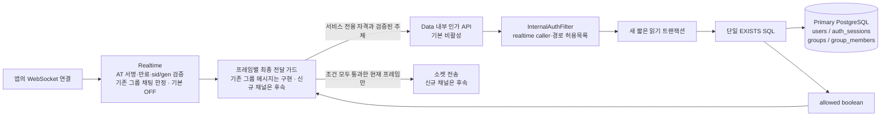
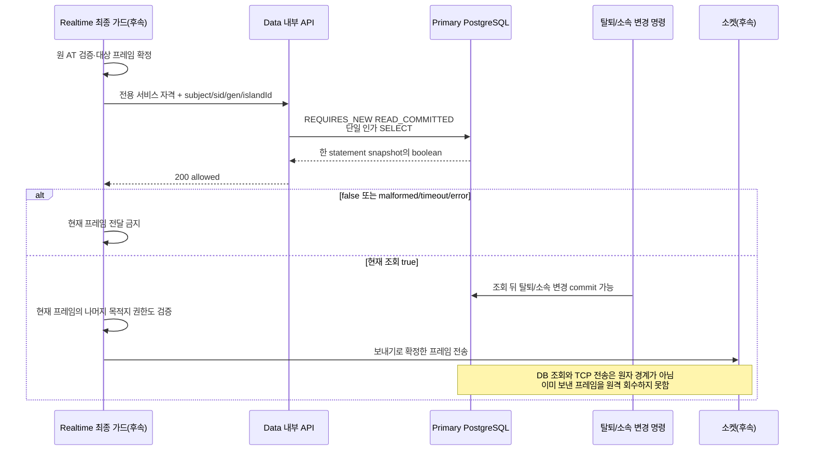

# 실시간 멤버십 인가 — 보내기 전에 같은 장부에서 확인하기

이 문서는 PR752의 `9e716680f9be383f7ee5b0c634c09d4b655a63cb` 위에 추가한 Data 내부 인가 조회 기반을 설명한다. 관련 실제 PostgreSQL HTTP 회귀19건과 전체 Data2,449건(실패0·오류0·기존skip8), Checkstyle·SpotBugs·build가 통과했다. 전체 실행은3분40초이며 아래 Mermaid2개도 CLI11.17.0으로 SVG 렌더링했다. 이 검증이 신규 실시간 채널 공개나 운영 배포를 뜻하지는 않는다.

학교 방송기가 학생에게 소식을 보내기 전에 학생증과 반 명단을 확인한다고 생각하면 된다. 학생증은 진짜인데 이미 전학했거나, 반에는 남아 있지만 학생증을 폐기했을 수 있다. 따라서 “전에 통과했으니 계속 허용”하지 않고 **같은 순간의 장부에서 사용자·세션·섬·소속을 함께 확인**한다.

이 API의 `allowed:true`는 그 DB 조회 시점에 이 조건들이 맞았다는 뜻이다. 방장 권한·개인 우편함·시설 조건·집중 중 채팅 허용까지 승인하는 만능 허가증은 아니다. 조회 뒤 네트워크로 전송하기까지 DB와 소켓을 한 트랜잭션으로 묶는다는 약속도 아니다.

## 1. 누가 누구에게 묻는가



앱은 이 내부 API를 직접 호출하지 않는다. Realtime은 앱의 AT를 검증한 뒤 서명으로 확인한 subject·sid·gen을 내부 요청으로 바꾼다. 클라이언트가 보낸 임의 `X-User-Id`, sessionId, authGeneration을 그대로 신뢰하지 않는다. Data가 받는 Authorization은 앱 AT가 아니라 **Realtime→Data 전용 서비스 자격**이다.

현재 브랜치는 Data 제공자를 준비한다. Realtime의 AT 파서와 이 API 호출 코드는 `realtime.membership-authorization.enabled`(기본 false) 뒤에 구현됐으며, 기존 그룹 채팅의 `requireCanChat` 경계와 기존 그룹 메시지 `beforeHandle`에 한정된다([현재 멤버십 client](realtime-current-membership-client.md)). 신규 채널의 최종 프레임 가드는 후속이다. 기존 chat의 인증/집중 차단이나 새 realtime 경로가 이 제공자로 자동 전환됐다고 해석하지 않는다.

## 2. 내부 HTTP 계약

`POST /internal/realtime/membership-authorization`

| 위치 | 값 | 의미 |
| --- | --- | --- |
| Authorization | `Bearer <SVC_TOKEN_REALTIME_TO_DATA>` | 서비스별 자격. 앱 AT·Business용 토큰으로 대체하지 않음 |
| X-User-Id | 검증된 AT subject의 UUID | 조회 대상 사용자. 사용자 입력으로 위임하지 않음 |
| Content-Type | `application/json` | 아래 객체 하나 |
| body.sessionId | UUID 문자열 | 검증된 AT의 sid |
| body.authGeneration | 0~9,007,199,254,740,991 정수 | 검증된 AT의 gen. users의 현재 세대와 같아야 함 |
| body.islandId | UUID 문자열 | 현재 프레임/구독이 지목한 섬 |

요청 예시는 실자격이 없는 설명용이다.

```json
{
  "sessionId": "01991930-0000-7000-8000-000000000002",
  "authGeneration": 3,
  "islandId": "01991930-0000-7000-8000-000000000003"
}
```

정상 판단의 응답은 HTTP200과 `Cache-Control: no-store`, 평평한 내부 JSON이다. 공개 Business API의 `{data:...}` 봉투를 덧붙이지 않는다.

```json
{"allowed": true}
```

```json
{"allowed": false}
```

- body는 최대1,024바이트다. 선언 길이를 먼저 확인하고 길이를 알 수 없는 본문도 최대1,025바이트만 읽어 초과를 거절한다. 초과는 빈본문413이며 `Cache-Control: no-store`다.
- `X-User-Id`는 정확히 하나여야 하고 body와 같은 엄격한 UUID36 형식으로 검증한다.
- 요청 body는 알려진 세 필드만 받는다. 필수 필드 누락·null·중복·알 수 없는 필드·후행 JSON을 거절한다. UUID는 하이픈 포함36자이며 대소문자 정규화는 허용하고 축약 UUID는 거절한다. gen의 소수·문자열·boolean을 정수로 강제 변환하지 않는다.
- 잘못된 입력은400 `ILLEGAL_ARGUMENT`와 고정 메시지다. 원 요청/자격/파서 원문을 오류 메시지에 섞지 않는다. 공통 내부 인증 필터에서 먼저 거절하는 서비스 자격·헤더 오류와 구분한다.
- 서비스 토큰 오류·허용목록 밖 요청은 기존 내부 인증 필터에서 거절한다. controller도 caller가 `realtime`인지 확인하며 다른 서비스 caller는 `Cache-Control: no-store`의 코드 없는403으로 거절한다. 다른 caller를 허용목록에 잘못 추가했어도 그것만으로 인가 조회를 열지 않는다.
- `false`는 올바른 요청을 한 SQL로 판정했으나 사용자/세대/세션/섬/소속 조건을 만족하지 못한 경우다. 내부 실패를 false로 숨기지 않는다. DB 오류는 예외로 전파한다.
- 호출자는 malformed 응답, boolean이 아닌 allowed, timeout, 네트워크/HTTP 오류를 **전달 금지**로 처리한다. 이전 true로 대체하거나 실패를 true로 추정하지 않는다. 운영 장애와 정상 false는 관측상 구분하되 둘 다 프레임을 보내지 않는다.

## 3. 한 SQL로 같은 순간을 읽는다

| 장부 | 동시에 만족해야 하는 조건 |
| --- | --- |
| users | 해당 사용자 존재·활성, 현재 auth_generation과 요청 값 일치 |
| auth_sessions | 요청 sessionId가 그 사용자의 세션이며 revoked_at이 null |
| groups | 해당 섬 존재·deleted_at이 null·status가 WAITING 또는 ACTIVE |
| group_members | 그 사용자와 섬의 소속이 존재하고 is_left=false·left_reason이 null 또는 KICKED가 아님 |

그룹은 기존 Data 용어이고 islandId는 이 그룹 ID에 대응한다. 초대장을 가졌거나 가입신청이 있다는 사실은 주민 소속을 대신하지 않는다. 방장인지 여부는 이 조회의 조건이 아니므로 이 결과만으로 방장 전용 개인큐나 관리 명령을 허용할 수 없다.

구현 흐름은 `InternalRealtimeMembershipAuthorizationController` → `InternalRealtimeMembershipAuthorizationService.isAllowed` → `RealtimeMembershipAuthorizationQuery.isAllowed`다. Query는 사용자·세션·섬·소속을 합친 **단일 scalar SQL**로 판정한다. 기존 세션 verify를 부른 다음 별도 SQL로 멤버십을 읽는 방식으로 조립하지 않는다.

서비스는 짧은 `REQUIRES_NEW`, `READ_COMMITTED`, readOnly 트랜잭션을 사용한다. PostgreSQL은 한 statement 안에서 같은 MVCC snapshot을 읽는다. 따라서 “사용자는 탈퇴 전 상태, 세션은 탈퇴 후 상태”처럼 서로 다른 statement의 결과를 합치지 않는다. 바깥 트랜잭션이 있다면 잠시 분리된 새 읽기 경계에서 판정한다.

인가 hot path에는 `FOR UPDATE`/`FOR SHARE` 같은 사용자·세션·그룹 행 잠금을 추가하지 않는다. 기존 탈퇴·멤버 변경 writer의 잠금 규약은 그대로다. 새 schema나 인가 캐시 테이블도 만들지 않는다.

**Primary DB가 전제다.** 현재 DataSource에 읽기 replica 라우팅이 없는 구성을 사용한다. `readOnly=true`가 primary를 자동 보장하는 것은 아니다. 향후 replica 라우팅을 도입하면 이 인가 query는 primary에 고정해야 하며, 복제 지연이 있는 replica나 과거 snapshot으로 대체하면 안 된다. 별도 primary 라우터가 이미 구현됐다고 주장하지 않는다.

현재 auth_sessions의 세션 활성 조건은 폐기 여부다. 이 API가 AT의 서명·exp를 검증하거나 세션에 없는 만료 필드를 만들어 검사하는 것은 아니다. Realtime이 원 AT의 서명·타입·만료·sid/gen 형식을 확인한 뒤 이 조회를 호출해야 한다. sid/gen이 없는 자격을 현재 DB 값으로 보충하거나 가짜 sid로 승격하지 않는다.

## 4. 탈퇴와 프레임이 겹치면



변경 commit이 SELECT 시작보다 먼저라면 그 이후 조회는 변경된 사용자·세션·소속을 판정한다. SELECT snapshot 뒤 commit된 변경까지 과거 결과에 소급 반영할 수는 없다. `allowed:true`에 TTL을 붙여 다음 프레임·다른 세션·다른 섬으로 재사용하지 않는다. 외부 공용 캐시나 Realtime 로컬 승인 캐시에도 저장하지 않는다.

이 조회를 추가한 것만으로 즉각적인 모든 소켓 차단이 끝나지 않는다. 최종 프레임 가드, 권한철회 제어 전달, 구독 해제·다중 인스턴스 처리·재연결이 함께 필요하다. 관련 동작을 검증하기 전에는 새 채널을 열지 않는다. 권한 상실 후 이미 나간 네트워크 프레임을 회수한다고 설명하지 않는다.

## 5. 설정은 준비하고 활성화는 따로 한다

| 설정 | 기본/역할 |
| --- | --- |
| internal.realtime.authorization.enabled | 기본 false. 환경 변수 REALTIME_MEMBERSHIP_AUTHORIZATION_ENABLED로 연결. 미설정/false이면 controller 미등록(정상 내부 인증을 통과해도 해당 route404) |
| application-realtime-authorization.yml | 명시적으로 선택하는 추가 프로필. 기존 환경이 자동으로 이 기능을 켜지 않음 |
| SVC_TOKEN_REALTIME_TO_DATA | Realtime 전용 비밀. 실제 배포 주입은 후속 작업이며 문서에 값을 기록하지 않음 |
| internal.api.enabled | 기존 내부 표면 인증 설정. 이것만 켠다고 새 인가 제공자가 열리는 것은 아님 |
| island-management.host-transfer-enabled | 기존 false 유지. 인가 제공자만 준비됐다고 true로 바꾸지 않음 |

프로필의 최소 허용목록은 realtime caller의 정확한 `POST /internal/realtime/membership-authorization` 하나다. Business·Notification 토큰을 재사용하거나 `/internal/**`를 넓게 허용하지 않는다. 이 선택 프로필 자체는 `internal.api.enabled`를 켜지 않는다. 다만 활성 내부 표면과 함께 로드하면 feature가 false여도 기존 `validateWhenEnabled`가 등록된 realtime caller의 고유 토큰을 요구한다. `SVC_TOKEN_REALTIME_TO_DATA`를 실제 주입해야 하며 편의상 빈 토큰·다른 caller 토큰을 허용하지 않는다. 서비스/query bean이 있어도 controller가 비활성이면 내부 HTTP 진입점은 열리지 않는다. 프로필·서비스별 자격·feature 스위치·caller 구현의 배포 준비를 각각 확인한다. 비밀을 저장소/로그에 넣거나 이 문서 작성만으로 운영 환경에 주입하지 않는다.

새 코드는 서비스 토큰·AT 원문·전체 헤더/body를 직접 기록하지 않고 DTO의 toString도 식별 필드를 가린다. parser가 원 body를 담는 예외 메시지·원인도 고정 문구로 대체한다. 후속 운영 지표에는 결과 종류·처리 시간·추적 ID 등 필요한 자료만 사용한다. 기존 P6Spy·활동 로그 및 외부 sink 전체의 PII 파기/수집 제한까지 이 PR에서 완료됐다고 해석하지 않는다. allowed=false의 세부 원인을 개인 정보 응답으로 확장하지 않는다. 정상 거절과 장애는 운영 지표로 구분한다.

## 6. 이번 기반과 남은 작업

| 범위 | 이 문서의 상태 |
| --- | --- |
| Data 단일 snapshot 인가 제공자·엄격 DTO·caller 경계 | 실제 HTTP/PG19건 및 전체 Data2,449건·build/static PASS |
| 기존 Data schema·도메인 명령 의미 | 변경 없음 |
| Realtime의 원 AT 서명/exp/sid/gen 파서·내부 호출 | 구현됨 — `realtime.membership-authorization.enabled`(기본 false) 뒤, 기존 그룹 채팅 경계 한정. [현재 멤버십 client](realtime-current-membership-client.md) |
| 프레임 최종 가드·목적지별 추가 권한·구독 철회 | 후속, 모든14개 이벤트 허용 아님 |
| 주민 snapshot·fanout·재연결 race 복구 | 후속 |
| 운영 서비스 자격 주입·primary 연결 확인·부하 검증 | 후속 |
| 공개 API66종 | 이 내부 API로 추가 완료 계수0. host 기본 비활성 유지 |

인가 응답에는 목록 version이나 주민 snapshot이 없다. `island.members.updated`의 사건 봉투/aggregate version을 대신하지 않으며 새15번째 공개 이벤트도 추가하지 않는다. 기존 `/ws/chat`·`/api/v1/chat` 호환 경로가 자동 개명되거나 신규 채널이 개방되는 것도 아니다.

## 7. 검증한 경계와 남은 실패 사례

관련19건은 실제 Servlet→PostgreSQL 경로의 정상/부정 판정, 생산 logout·withdraw·kick·leave 이후 거절, 주체/세션 혼합 방지, 엄격 입력, 기본 비활성, 무쓰기, 오래된 외부 RR TX에서도 새 폐기 확인, 권위4행의 FOR UPDATE 중 읽기 완료를 검증했다. 전체 Data2,449건도 실패·오류 없이 통과했다(기존skip8). CheckstyleMain·SpotBugsMain과 build가 통과했으며 저장소 설정상 test용 정적 검사 task는 제외돼 있다.

아래 목록의 Realtime 소비자·프레임·장애 주입·배포 부분은 후속 검증이다. 이번 결과를 실제 소켓 전송이나 DB 장애 주입 검증으로 확대하지 않는다.

1. 기본 비활성·잘못된 서비스 토큰·다른 caller·허용목록 밖 경로가 열리지 않는다. 중복 사용자 헤더나 subject와 맞지 않는 body sessionId로 타인의 세션/소속을 이용할 수 없다.
2. UUID 축약·잘못된 형식·누락/null·unknown·duplicate·trailing JSON 및 소수/문자열/음수/상한 초과 gen은 거절한다. 정상 입력을 실제 controller serializer로 검증한다.
3. 활성 주민 true, 탈퇴/세대 불일치/없는 세션/타인 세션/폐기된 세션/종료·삭제된 그룹/이탈·비소속 false를 실제 PostgreSQL에서 검증한다.
4. 사용자/세션/소속 변경 commit과 SELECT의 양방향 경합에서 단일 snapshot 의미를 검증한다. statement 시작 뒤 변경을 실시간으로 소급 감지하는 테스트로 바꾸지 않는다.
5. Data 호출이 기존 바깥 트랜잭션의 오래된 snapshot을 재사용하지 않고 새 READ_COMMITTED 경계를 갖는지 확인한다. 행 잠금 검증/상류 HTTP 대기로 hot path를 늘리지 않는다.
6. DB 실패는 false 성공으로 숨기지 않는다. 후속 Realtime 소비자는 false·malformed·timeout·오류 모두 전달0, true 재사용0을 검증한다.
7. 프레임 가드·철회·snapshot·재연결·실제 배포 검증 전 host flag와 신규 채널은 계속 닫힌다.

## 참고

- [내부 인가 HTTP 정본 계약](../contracts/realtime-authorization-api.yaml)
- [기존 서비스 아키텍처](service-architecture.md)
- [내부 인가 Controller](../../server/data-api/src/main/java/com/oneorthree/phone/internal/InternalRealtimeMembershipAuthorizationController.java)
- [단일 조회 서비스](../../server/data-api/src/main/java/com/oneorthree/phone/internal/service/InternalRealtimeMembershipAuthorizationService.java)
- [한 statement Query](../../server/data-api/src/main/java/com/oneorthree/phone/internal/repository/RealtimeMembershipAuthorizationQuery.java)
- [엄격 입력 DTO](../../server/data-api/src/main/java/com/oneorthree/phone/internal/dto/RealtimeMembershipAuthorizationRequest.java)
- [선택 프로필](../../server/data-api/src/main/resources/application-realtime-authorization.yml)
- [기존 내부 인증 필터](../../server/data-api/src/main/java/com/oneorthree/phone/config/InternalAuthFilter.java)
- [기존 세션 엔티티](../../server/data-api/src/main/java/com/oneorthree/phone/auth/repository/domain/AuthSession.java)
- [기존 그룹 엔티티](../../server/data-api/src/main/java/com/oneorthree/phone/group/repository/domain/Group.java)
- [기존 그룹 소속 엔티티](../../server/data-api/src/main/java/com/oneorthree/phone/group/repository/domain/GroupMember.java)

별도 실시간 계약 문서는 다른 PR에서 검토 중이므로 main에 없는 상대경로를 연결하지 않는다. 구현 범위는 이 내부 제공자이며 실시간 도메인 전체가 아니다.
