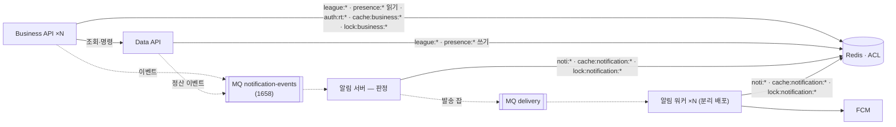

# gromo 서비스 아키텍처 (논리) — Target-1 · Target-2

> 정본(2026-09-10 승격). 결정 근거는 `decisions.md` A1~A19 · 알림 서버 설계 결정 D1~D20(`docs/prd/notification-server/policy.md`, 승격 예정) · 링크·어트리뷰션 설계 장부 v3(승격 예정).
> **Target-1** = 이번 분리 라운드(에픽 1643 + 알림 서버 + 링크 서버) 종료 시점. **MQ = Kafka 단일 노드 컨테이너(A12 확정)** · Redis 없음. **Target-2** = 관리형 MQ · Redis · 워커 분리.

## 0. 한 문장

**앱은 Business API 하나만 본다. 데이터는 Data API 만 만진다. 알림과 링크는 자기 데이터만 갖고, 코어를 부르지 않는다.**

## 1. Target-1 구도


실선 = 동기 HTTP, 점선 = 이벤트(Kafka). `POST /internal/events` 는 **수동 재전송·리컨실용 입구**다 — 브로커 다운 시 이걸 자동 폴백으로 쓸지는 **A18(보류)** 이 정한다. 링크 서버(Vercel)는 브로커에 붙지 않는다.

## 2. 컴포넌트 책임

| 컴포넌트 | 소유 데이터 | 하는 일 | **안 하는 일** |
|---|---|---|---|
| **Business API** (신규, `server/services/business-api`) | 없음 (stateless) | 앱 진입점. **인증**(IdP 검증·게스트·AT 서명·refresh·logout, A7) · 화면 단위 BFF(`/bff/*`) · 아직 BFF 가 없는 엔드포인트 **패스스루**(A8) · 요청형 유스케이스 조합 · 요청형 이벤트 발행(친구·챌린지 개설·내기 승리 등) · 링크 발급 호출 | DB 접근 · 트랜잭션 · 크론 · 정산 |
| **Data API** (현 `server/services/data-api`) | `gromo` database 전체 | 데이터 서빙(`/internal/*` 조회·명령, A9) · **트랜잭션 경계·쓰기 불변식** · Flyway · **정산·정리 크론**(내기 3 · 리그 주간 · orphan sweep, A4) · 정산형 이벤트 발행(D10) · RT 저장·대조·회전·탈퇴 검사(A7) | 공인 노출 · JWT 검증 · FCM · 문구 · 알림 크론 |
| **알림 서버** (신규, `server/services/notification`) | `gromo_notification` database (templates · kinds · jobs · deeplinks · deliveries · device_tokens · settings · snapshots) | 이벤트 소비 · 스냅샷 · 등록부 크론 22 · 판정(quiet hours·쿨다운·dedup) · 템플릿 렌더(ICU, 4 locale) · FCM 발송·재시도·이력 · `/internal/admin/*` | 도메인 테이블 읽기(D4) · Data API 쓰기 · 화면 |
| **링크 서버** (별도 레포 `oneorthree/link`, Vercel + Neon) | `links` · `link_clicks` · SKAN·Referrer 원장 · 캠페인 비용 | 랜딩 · 지문 매치 · claim 귀속 · SKAN 포스트백 · Install Referrer · 캠페인 링크 대시보드 · **알림 콘솔 화면**(D17) | 코어 호출(단방향) · 유저 인증(콘솔 비밀번호 2겹은 별개, D18) |
| **앱** | 로컬 설정 · 토큰(SecureStore) | Business API 만 호출 · link 서버엔 match/referrer 만 · 언어 설정을 서버에 보고(**`users.language`** — V50, 알림 D11. 이벤트 봉투 키만 `locale`) | — |

## 3. 의존 방향 — 단방향 규칙

```
앱 → Business API → Data API
        │               │
        ├──이벤트──▶ 알림 서버 ◀──이벤트──┘        알림 서버 → Data API : 리컨실 1종만
        └──발급────▶ 링크 서버 ◀──relay 재전달──┘  링크 서버 → (아무도 부르지 않음)
                     ▲
              콘솔 → 알림 서버 admin API
```

| 허용 | 금지 |
|---|---|
| Business → Data (조회·명령·패스스루) | Data → Business |
| Business / Data → 알림 (이벤트, 발행 주체 = 그 유스케이스를 완료한 프로세스) | 알림 → `gromo` database 직접 읽기 |
| **Business → 알림 (동기 명령·조회)** — 앱의 기존 계약 `PUT/DELETE /users/me/device-token` · `PUT`·**`GET`** `/users/me/notification-settings` 가 패스스루로 오면 `POST/DELETE /internal/devices` · `PUT`·**`GET`** `/internal/users/{id}/notification-settings` 로 전달(서비스 토큰 + `X-User-Id`). 설정 정본이 `gromo_notification` 이라 **GET 도 알림 서버에서 읽어야 한다** — Data API 패스스루로는 정본을 못 읽는다. 데이터가 `gromo_notification` 소유라 이벤트로는 못 쓴다 | 알림 → Business |
| 알림 → Data (`GET /internal/users/notification-snapshot` 하나) | 알림 → Data 쓰기 |
| Business → 링크 (발급 · **claim** · joined · revoke · **withdraw**, 표시정보 스냅샷 동봉) — 링크 서버는 Kafka 에 붙지 않으므로 `user.withdrawn` 을 받을 방법이 없다. 탈퇴 tombstone 은 **Business → 링크 `POST /internal/users/{id}/withdraw`(서비스 토큰, 멱등·재시도 가능)** 로 전달한다 — 앱의 기존 계약 `POST /api/v1/invite-links/claim` 이 패스스루로 오면 `POST /internal/links/{slug}/claim {userId}`(서비스 토큰)로 전달한다. `link_clicks` 에 유저를 붙이는 일이라 링크 서버만 할 수 있고, 이 경로가 없으면 **설치 매치는 성공해도 최종 귀속이 기록되지 않는다** | 링크 → 코어 어떤 것도 |
| **Data → 링크 (relay 재전달 1종)** — A21 outbox 의 링크 대상 미전달분(`user.withdrawn`)을 relay 잡이 `POST /internal/users/{id}/withdraw` 로 재호출한다. Business 는 크론이 없고(§6) 링크는 Kafka 를 안 쓰므로 **outbox 와 같은 DB 를 가진 Data API 만 재시도할 수 있다**. 이것 외의 Data → 링크 호출은 금지 | Data → 링크 (relay 재전달 외 전부) |
| 링크(콘솔) → 알림 admin API | 알림 → 링크 (Target-1; `type=push` 링크가 필요해지면 알림 → 링크 호출만, 폴백 스킴) |
| 앱 → Business, 앱 → 링크(match·referrer) | 앱 → Data · 앱 → 알림 |

원칙: **위성(알림·링크)은 코어를 부르지 않고, 코어가 위성에 밀어준다.** 위성이 코어의 사실을 알아야 하면 이벤트/발급 시 **동봉**하고, 정합은 리컨실/PATCH 로 맞춘다.

## 4. 통신 방식

| 방식 | Target-1 | Target-2 |
|---|---|---|
| 동기 내부 HTTP | 서비스 토큰(Bearer) + `X-User-Id`. 타임아웃·재시도·서킷을 **공통 RestClient 팩토리**에 처음부터. **재시도 대상 = 멱등 GET + 멱등이 보장된 명령**(전체 교체 `PUT`, `DELETE /internal/devices`, `POST …/withdraw`) — GET 만 재시도하면 로그아웃의 기기 토큰 삭제가 일시 오류 한 번에 영구 실패한다. 앱은 그 실패를 무시하고 로컬 토큰을 지워 **사용자가 재시도할 방법이 없고**, 알림 DB 에 남은 이전 계정 토큰으로 푸시가 계속 간다. 재시도까지 실패한 삭제는 **A21 outbox 에 적재해 relay 가 이어받는다**(§6) | 동일 |
| 이벤트 | **A21**: Data API 명령 트랜잭션이 이벤트 레코드를 함께 저장하고 결정적 `eventId` 를 돌려준다 — 발행은 그 레코드에서. **Kafka 단일 노드 컨테이너**(A12) — 토픽 `notification-events`(파티션 3, 키 = userId) + `.dlq`, 봉투 = `eventId` · `type` · `occurredAt` · `scheduledAt` · `userId` · `locale` · `subjectId` · `params`. 소비 측 `eventId` UNIQUE 멱등 + Spring Kafka 재시도·DLQ + 1일 1회 리컨실 (D7·D19). `POST /internal/events` 는 **수동 재전송·리컨실 입구**(자동 폴백 채택 여부는 A18 보류) | 관리형 브로커(MSK 등)로 승격 또는 그대로. 봉투·어댑터 동일 |
| 공유 저장소 | 없음 | Redis — **A19 네임스페이스 표 + ACL**: `league:*`·`presence:*`(Data 쓰기 · Business 읽기) · `noti:*`(알림) · `auth:rt:*`(Business) · `cache:<svc>:*`·`lock:<svc>:*`(각자, 공유 금지) |
| 앱 ↔ 서버 | REST `/api/v1`(패스스루) + `/bff/*` + `/auth/*` | 동일 |

## 5. 인증 경계 (A7 · A8)

- **AT**: Business API 가 HS256 `JWT_SECRET` 으로 서명·검증. 다른 서비스는 키를 갖지 않는다.
- **RT**: Data API **`users.refresh_token_hash`** 에 **해시로** 저장한다(V16 이 `refresh_token` 을 rename 하며 평문을 폐기했다 — 평문 저장으로 되돌리지 않는다). refresh 요청 → Business API → Data API `/internal/auth/refresh`(해시 대조·회전·탈퇴 검사) → Business API 가 새 AT 서명.
- **탈퇴·무효 유저**: 매 요청 검사는 없다(stateless). Data API 가 `/internal/*` 호출마다 `X-User-Id` 활성 검사(현 `JwtFilter` 로직 이관). **단 위성(알림·링크)으로 직행하는 쓰기는 그 검사를 안 거친다** — 기기 토큰 등록·알림 설정·초대 claim 은 Business → 위성 직접 호출이라, 탈퇴 직전 발급된 AT 로 최대 3600초 동안 토큰을 재등록할 수 있다. 따라서 **위성 쓰기 전에 Business API 가 Data API 활성 검사를 먼저 통과시킨다**(조회 1회 또는 같은 유스케이스의 Data 호출에 편승). 읽기 전용 경로는 AT 3600s 창 수용.
- **내부**: 서비스 토큰 5종(A11 ⑥). 호출은 두 종류 — **사용자 위임**(서비스 토큰 + `X-User-Id`)과 **서비스 전용**(토큰만: `/internal/auth/*` · 배치 트리거 · 리컨실). 콘솔 사람 인증은 링크 대시보드의 비밀번호 2겹(D18), 알림 서버는 사람을 모른다.
- **로그아웃 시 기기 토큰 삭제**는 Business → 알림 `DELETE /internal/devices` 로 반드시 전달한다 — 빠지면 로그아웃한 이전 계정의 푸시가 같은 기기로 계속 간다.
- **탈퇴 시 알림 DB 정리**: `settings`·`device_tokens`·`user_snapshot`·`bet_participations` 는 `gromo_notification` 소유라 Data API 트랜잭션으로 못 지운다. 탈퇴 커밋 후 **`user.withdrawn` 이벤트 + 알림 서버의 멱등 삭제**(같은 userId 로 여러 번 와도 안전)로 처리하고, **미처리분은 새벽 리컨실이 잡는다**(스냅샷에 있는데 Data API 에 없는 유저 = 삭제 대상). 이 경로가 없으면 탈퇴 후에도 푸시가 계속 간다.
- **탈퇴 경합 차단(tombstone)**: 활성 검사와 위성 쓰기 사이에 탈퇴가 커밋되면, 지연 도착한 기기 토큰 등록·claim 이 **삭제된 유저 데이터를 되살린다**(다음 새벽까지 푸시 가능). 그래서 위성은 삭제 시 **tombstone(`user_id` + `withdrawn_at`)을 남기고, 그 이후 도착한 같은 유저의 쓰기를 거부**한다. 링크 서버도 같은 tombstone 을 갖는다(링크엔 리컨실 경로가 없어 이게 유일한 방어) — **전달은 Kafka 가 아니라 Business → 링크 `POST /internal/users/{id}/withdraw`** 다(링크는 브로커에 붙지 않는다). 실패 시 재시도하고, **미전달분은 Data API 의 relay 잡이 재호출한다**(§6) — Business API 는 크론을 갖지 않고(§6) 링크 서버는 Kafka 를 소비하지 않으므로, 전달을 되살릴 수 있는 주체는 **탈퇴 트랜잭션과 같은 DB 에 outbox 행을 가진 Data API** 뿐이다. outbox 행은 대상별 전달 표시(`kafka_published_at` · `link_delivered_at`)를 따로 갖고 relay 는 **비어 있는 쪽만** 재시도한다(링크의 withdraw 는 멱등이라 중복 호출이 안전). 탈퇴 이벤트가 늦게 와도 tombstone 이 먼저 도착한 쓰기를 되돌린다 — 순서 보장이 아니라 **거부 규칙**으로 푼다.

## 6. 배치의 자리 (A4 · A5)

| 잡 | Target-1 프로세스 | 락 |
|---|---|---|
| 내기 정산 3종 · 리그 주간 정산 · orphan sweep | **Data API** (ShedLock, `gromo`) | 그대로 |
| 알림 22 잡 (상태 조회형 6 + 예약·묶음 flush) | **알림 서버** 등록부 (`notification_jobs` + ShedLock, `gromo_notification`) | 그대로 |
| 봇 틱 · 순위 추월 | **폐기** (A5 · D6) | — |
| 탈퇴·이벤트 전달 relay (A21 outbox → Kafka 발행 + 링크 `POST /internal/users/{id}/withdraw`) | **Data API** (lease + ShedLock, `gromo`) | 그대로 |
| 리컨실 (스냅샷 대조) | 알림 서버, 새벽 04:00 | — |
| 링크 집계 | 링크 서버 (Vercel Cron) | — |

Business API 는 크론을 갖지 않는다 → 단일/다중 인스턴스 무관.

## 7. 데이터 소유 (A10)

| 저장소 | 소유자 | 내용 |
|---|---|---|
| RDS `gromo` | Data API | 도메인 전체 (users · focus · league · group · currency · …). 다른 서비스 직접 접근 금지 |
| RDS `gromo_notification` | 알림 서버 | 알림 HLD §5 의 14 테이블. 별도 DB 유저·Flyway |
| Neon (link) | 링크 서버 | links · link_clicks · skan · referrer · spend |
| 앱 로컬 | 앱 | 설정 · 토큰 |

교차 조회는 **없다** — 필요한 사실은 이벤트·발급에 동봉하거나(위성), Data API 조회 API 로(코어).

### 7.1 기존 데이터 이관 (소유권만 옮기면 데이터가 사라진다)

`users.device_token` · `user_notification_settings` · `group_invite_links` · `invite_link_clicks` 는 **이미 운영 데이터가 들어 있다**. 스키마만 새로 만들고 전환하면 기기 토큰·수신 설정이 사라져 푸시가 멈추거나 opt-out 이 기본값으로 되돌아가고, 이미 공유된 초대 slug 가 새 링크 서버에서 조회되지 않는다. 이관 절차를 배포 계획에 넣는다:

**순서가 핵심이다 — 이중 쓰기를 먼저 켠다.** 백필을 먼저 돌리면 *백필 완료 시점 ~ 이중 쓰기 활성화 시점* 사이의 토큰 변경·수신 설정 변경·링크 발급이 **구 저장소에만 남고 새 저장소엔 영영 안 들어간다**(그 창은 배포 한 번만큼 벌어진다). 그래서 쓰기를 먼저 양쪽으로 흘려 두고, 백필은 그 뒤에 **과거분만** 채운다.

| 단계 | 내용 |
|---|---|
| ① 이중 쓰기 | 전환 창 동안 구·신 양쪽에 쓴다(읽기는 아직 구). 롤백이 데이터 손실이 되지 않게 하는 유일한 장치이자, ②의 누락 창을 없애는 장치. **단 `invite_link_clicks` 는 예외** — 새 클릭은 앱·브라우저가 Vercel 로 **직접** 보내 Neon 에 쌓이는데 링크 서버는 코어를 부를 수 없어 구 테이블에 같이 쓸 방법이 없다. 이 리소스만 **원자적 전환**으로 간다(아래 §7.2) |
| ② 백필 | 구 저장소 → 새 저장소 과거분 복사(`device_token`·설정 → `gromo_notification`, 링크 2테이블 → Neon). slug·user_id 는 **불변**이라 키 변환 없음. **이중 쓰기가 이미 넣은 최신 행을 덮지 않도록 `ON CONFLICT DO NOTHING`**(또는 원본이 더 최신일 때만 갱신)으로 넣는다 |
| ②′ 투영 부트스트랩 | 알림 서버는 코어 DB 를 안 읽고 **자체 `user_snapshot`·`bet_participations` 로 판정**한다. 이벤트는 소비 시작 이후 것만 오고 새벽 리컨실은 **유저 스냅샷만** 다루므로, 부트스트랩 없이 켜면 **전환 당시 진행 중이던 내기가 나중에 정산돼도 참가자 투영이 없어 결과 알림이 안 나간다**. 소비자·잡을 켜기 **전에** ⓐ 전 유저 스냅샷(표시명·언어·설정) ⓑ **진행 중·미정산 내기의 참가 상태**를 DB 스냅샷으로 초기 적재하고, 그 스냅샷 시각을 이벤트 watermark 로 삼아 이후 이벤트와 이어 붙인다 |
| ③ 검증 | 건수·체크섬 대조 — 유저별 토큰 유무, **설정 5필드 전량**(`notification_enabled` · `sound_enabled` · `night_mode_enabled` · **`night_start_time`** · **`night_end_time`**, `V1__baseline.sql`), 링크 slug 집합, ②′ 투영 건수. 심야 두 시각은 **nullable 이라 null 상태 자체를 대조 대상에 포함**한다 — 플래그 3개만 보면 시각이 누락·오변환돼도 「불일치 0」을 통과해 심야 사용자 푸시가 엉뚱한 시각에 나간다. 불일치 0 이 전환 조건 |
| ④ 읽기 전환 | 새 저장소로 읽기 이동. 여기까지가 되돌릴 수 있는 마지막 지점 |
| ⑤ 구 저장소 제거 | 관찰 기간(최소 1 릴리즈) 뒤 컬럼·테이블 드롭 — **롤백 창을 벗어난 뒤**(§3 expand/contract) |

#### 7.2 `invite_link_clicks` 만은 원자적 전환

클릭 쓰기의 주체가 **코어가 아니라 방문자 → Vercel** 이라 이중 쓰기가 성립하지 않는다. 순서를 이렇게 고정한다:

**백필이 라우팅 전환보다 먼저다.** 링크 서버는 코어를 부를 수 없어 구 `invite_link_clicks` 를 대신 조회할 수단이 없으므로, 전환 순간 Neon 에 없는 클릭은 그대로 `matched:false` 가 되고 **뒤늦은 백필은 이미 나간 응답을 되돌리지 못한다**. 매치 창이 3시간이라 위험 구간은 「전환 직전 3시간의 클릭」 전부다.

1. **구 클릭을 Neon 으로 백필**(§7.1 ②) — 여기까지는 라우팅을 안 건드리므로 언제 해도 안전하다.
2. **전환 직전 증분 백필을 짧은 주기로 반복**해 미반영 창을 분 단위 → 초 단위까지 좁힌다(`clicked_at > 마지막 커서`, 멱등 upsert).
3. **그다음** 링크 서버 배포 + 라우팅 전환 — 랜딩·클릭 적재와 **매치를 같은 배포에서 함께** 넘긴다(둘을 쪼개면 새 클릭을 구 `/l/match` 가 못 찾는다).
4. **전환 후에도 매치 창(3시간) 동안 증분 백필을 계속 돌린다** — 전환 순간의 초 단위 갭에 들어온 클릭도 앱이 설치·매치를 부르기 전에 Neon 에 도착한다. 3시간이 지나면 커서가 더 안 움직이는 걸 확인하고 중단한다.
5. 그 뒤로 **구 테이블은 읽지 않는다**.
6. **롤백하면 전환 창의 클릭은 유실된다** — 되돌릴 수 있는 지점은 3 이전뿐이고, 이후는 roll-forward. 손실 범위는 매치 창과 같은 3시간으로 한정된다(그 사실을 감수하고 전환한다).


## 8. Target-2 에서 달라지는 것



- **MQ**: 이벤트 어댑터 교체(HTTP → 브로커), at-least-once 는 이미 `eventId` 멱등으로 준비됨. DLQ·재시도는 1658 범위.
- **Redis**: 리그 랭킹 ZSET — **완료분만** 담고 진행 중 세션은 `presence:*` 로 조회 시 가산한다(A20). 후보는 **ZSET 상위 N + presence 활성 유저 전원**이며 가산 후 재정렬한다(상위 100 으로 먼저 자르면 101위 이하의 긴 세션이 누락). ZSET 은 DB 정본과 주기 대조·재구축한다. 리그 BFF 의 50페이지 클라 합산 제거, "지금 N위" 정확도 — D9 해소 · 프레즌스 리스 · RT 블랙리스트(강제 로그아웃) · Business API 다중 인스턴스 락 · 알림 카운터.
- **알림 워커 분리 배포**: 판정과 워커 사이에 큐가 있으므로 코드 무변경으로 워커만 스케일.
- **알림 DB 별도 인스턴스**: 부하가 보이면 (A10).
- **공유 저장소 규칙(A19)**: Redis 키는 네임스페이스 표(`decisions.md` A19)에 있는 것만 — `league:*`·`presence:*` 는 Data 가 쓰고 Business 가 읽으며, `noti:*`·`auth:rt:*` 는 소유자 전용, `cache:<svc>:*`·`lock:<svc>:*` 는 각 서비스 자기 것만(서비스 간 공유 캐시·락 금지). **Redis ACL** 로 서비스별 유저에 키 패턴·명령 권한을 주어 강제한다. 사본이므로 소유자가 재구축 가능해야 한다 — 단방향 규칙의 저장소 판.

## 9. 08-25 시안 대비 변경 요약

| 시안 | 이 문서 |
|---|---|
| 알림 서버가 Data API 로 템플릿·이력·토큰 왕복 | 알림 DB 별도, 코어 호출은 리컨실 1종 |
| 이벤트 발행 = Data API | 발행 = 유스케이스를 완료한 프로세스(요청형 Business · 정산형 Data) |
| MQ(Kafka/SQS)·Redis 첫날부터 | Target-1 = **Kafka 단일 노드 컨테이너**만, Redis 는 Target-2 |
| `/bff/*` 만 Business, 나머지 133 직행 | **전량 Business 경유**, Data API 공인 노출 0 |
| 인증 = 기존 서버 직행 | 인증 = Business API, 상태(RT)는 Data API |
| 링크·콘솔 없음 | 링크 서버(별도 레포·Vercel·단방향) + 콘솔 동거·비밀번호 2겹 |
| 크론 15종 → 알림 서버 | 알림 22 → 알림 서버, 정산·정리 → Data API, 봇·추월 폐기 |

## 10. 열린 점

- D9 만 잠정. (A12 Kafka 확정 · A14 EC2 사이즈업 · A17 서버 모노 확정)
- **레포(A17)**: 앱 `OneOrThree/app` · 링크 `oneorthree/link` · docs 사이트 · **JVM 서비스 5개 = `oneorthree/server`**(`services/data-api|business-api|notification|chat|file-upload` + `deploy/` + `docs/`). 이력서·팀 사이트는 허브 1장(`docs/architecture` 승격본)으로.
