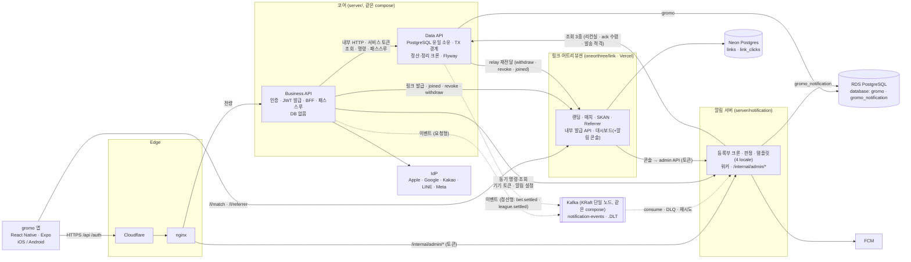
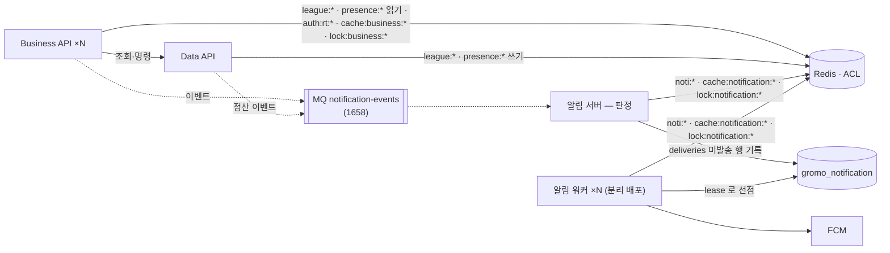

# gromo 서비스 아키텍처 (논리) — Target-1 · Target-2

> 정본(2026-09-10 승격). 결정 근거는 `decisions.md` A1~A19 · 알림 서버 설계 결정 D1~D20(`docs/prd/notification-server/policy.md`, 승격 예정) · 링크·어트리뷰션 설계 장부 v3(승격 예정).
> **Target-1** = 이번 분리 라운드(에픽 1643 + 알림 서버 + 링크 서버) 종료 시점. **MQ = Kafka 단일 노드 컨테이너(A12 확정)** · Redis 없음. **Target-2** = 관리형 MQ · Redis · 워커 분리.

## 0. 한 문장

**앱은 Business API 하나만 본다. 데이터는 Data API 만 만진다. 알림과 링크는 자기 데이터만 갖고, 코어를 부르지 않는다.**

## 1. Target-1 구도



실선 = 동기 HTTP, 점선 = 이벤트(Kafka). `POST /internal/events` 는 **수동 재전송·리컨실용 입구**다 — 브로커 다운 시 이걸 자동 폴백으로 쓸지는 **A18(보류)** 이 정한다. 링크 서버(Vercel)는 브로커에 붙지 않는다.

## 2. 컴포넌트 책임

| 컴포넌트 | 소유 데이터 | 하는 일 | **안 하는 일** |
|---|---|---|---|
| **Business API** (신규, `server/services/business-api`) | 없음 (stateless) | 앱 진입점. **인증**(IdP 검증·게스트·AT 서명·refresh·logout, A7) · 화면 단위 BFF(`/bff/*`) · 아직 BFF 가 없는 엔드포인트 **패스스루**(A8) · 요청형 유스케이스 조합 · 요청형 이벤트 발행(친구·챌린지 개설 등 — **Business 가 유스케이스를 완료하는 것만**. `내기 승리`는 제외: 현행 `GroupBetEarlyWinConfirmer.confirmWins` 가 집중 세션 저장 **트랜잭션 안에서** `GroupBetWonEvent` 를 발행하고 응답엔 어떤 참가자가 확정됐는지도 없어 Business 는 발생 사실을 알 수 없다 → **Data API 가 그 트랜잭션의 outbox 에 기록·발행**한다, A4·A21) · 링크 발급 호출 | DB 접근 · 트랜잭션 · 크론 · 정산 |
| **Data API** (현 `server/services/data-api`) | `gromo` database 전체 | 데이터 서빙(`/internal/*` 조회·명령, A9) · **트랜잭션 경계·쓰기 불변식** · Flyway · **정산·정리 크론**(내기 3 · 리그 주간 · orphan sweep, A4) · 정산형 이벤트 발행(D10) · RT 저장·대조·회전·탈퇴 검사(A7) | 공인 노출 · JWT 검증 · FCM · 문구 · 알림 크론 |
| **알림 서버** (신규, `server/services/notification`) | `gromo_notification` database (templates · kinds · jobs · deeplinks · deliveries · device_tokens · settings · snapshots) | 이벤트 소비 · 스냅샷 · 등록부 크론 22 · 판정(quiet hours·쿨다운·dedup) · 템플릿 렌더(ICU, 4 locale) · FCM 발송·재시도·이력 · `/internal/admin/*` | 도메인 테이블 읽기(D4) · Data API 쓰기 · 화면 |
| **링크 서버** (별도 레포 `oneorthree/link`, Vercel + Neon) | `links` · `link_clicks` · SKAN·Referrer 원장 · 캠페인 비용 | 랜딩 · 지문 매치 · claim 귀속 · SKAN 포스트백 · Install Referrer · 캠페인 링크 대시보드 · **알림 콘솔 화면**(D17) | 코어 호출(단방향) · 유저 인증(콘솔 비밀번호 2겹은 별개, D18) |
| **앱** | 로컬 설정 · 토큰(SecureStore) | Business API 만 호출 · link 서버엔 match/referrer 만 · 언어 설정을 서버에 보고(**`users.language`** — V50, 알림 D11. 이벤트 봉투 키만 `locale`) | — |

## 3. 의존 방향 — 단방향 규칙

```
앱 → Business API → Data API
        │               │
        ├──이벤트──▶ 알림 서버 ◀──이벤트──┘        알림 서버 → Data API : 조회 3종만
        └──발급────▶ 링크 서버 ◀──relay 재전달──┘  링크 서버 → (아무도 부르지 않음)
                     ▲
              콘솔 → 알림 서버 admin API
```

| 허용 | 금지 |
|---|---|
| Business → Data (조회·명령·패스스루) | Data → Business |
| Business / Data → 알림 (이벤트, 발행 주체 = 그 유스케이스를 완료한 프로세스) | 알림 → `gromo` database 직접 읽기 |
| **Business → 알림 (동기 명령·조회)** — 앱의 기존 계약 `PUT/DELETE /users/me/device-token` · `PUT`·**`GET`** `/users/me/notification-settings` 가 패스스루로 오면 `POST/DELETE /internal/devices` · `PUT`·**`GET`** `/internal/users/{id}/notification-settings` 로 전달(서비스 토큰 + `X-User-Id`). 설정 정본이 `gromo_notification` 이라 **GET 도 알림 서버에서 읽어야 한다** — Data API 패스스루로는 정본을 못 읽는다. 데이터가 `gromo_notification` 소유라 이벤트로는 못 쓴다 | 알림 → Business |
| 알림 → Data (**조회 3종**: `GET /internal/users/notification-snapshot`(리컨실) · `GET /internal/users/{id}/result-ack?sessionId=`(`NEEDS_CONFIRM` 수렴) · `POST /internal/notifications/eligibility`(상태 의존형 알림의 발송 직전 일괄 확인)) | 알림 → Data 쓰기 · 그 밖의 조회 |
| Business → 링크 (발급 · **claim** · joined · revoke · **withdraw**, 표시정보 스냅샷 동봉) — 링크 서버는 Kafka 에 붙지 않으므로 `user.withdrawn` 을 받을 방법이 없다. 탈퇴 tombstone 은 **Business → 링크 `POST /internal/users/{id}/withdraw`(서비스 토큰, 멱등·재시도 가능)** 로 전달한다 — 앱의 기존 계약 `POST /api/v1/invite-links/claim` 이 패스스루로 오면 `POST /internal/links/{slug}/claim {userId}`(서비스 토큰)로 전달한다. `link_clicks` 에 유저를 붙이는 일이라 링크 서버만 할 수 있고, 이 경로가 없으면 **설치 매치는 성공해도 최종 귀속이 기록되지 않는다**. **비공개 그룹 가입은 여기서 한 겹 더 필요하다** — 그룹 HLD `01-acquisition/high-level-design.md:70` 은 「가입 가능한 그룹·그룹 일치·미폐기·**발급자 활성 멤버십**을 모두 확인할 때만 허용」을 요구하는데, 트랜잭션을 가진 Data 는 Neon 을 못 읽고 Business 는 링크 확인과 가입을 **별도 호출로 조합**할 수밖에 없어, 그 사이에 발급자가 탈퇴하거나 revoke 가 처리되면 **Data 는 모른 채 멤버십을 만든다**. 그래서 링크 서버가 **서명한 자격**(`slug` · `groupId` · `inviterId` · `membershipVersion` · 만료)을 돌려주고 Business 가 그것을 Data 가입 명령에 실어 보내며, **Data 가 커밋 안에서 현재 그룹 상태·멤버십 버전과 대조**한다 — 검증 결과를 트랜잭션 경계까지 끌고 오는 계약이다. **대조만으로는 부족하고 판독과 커밋 사이를 탈퇴·강퇴와 직렬화해야 한다** — 현 `GroupMember` 에는 `@Version` 이 없고 멤버십 조회도 무락이라, 가입이 활성 버전을 읽은 **직후** 동시 탈퇴가 커밋돼도 가입 트랜잭션은 그대로 멤버십을 만든다. 그래서 ⓐ `GroupMember` 에 **`membershipEpoch` 를 두되 일반 낙관락 `version` 과 분리한다** — epoch 는 **탈퇴·강퇴·재가입 때만** 오르고 그 밖의 갱신으로는 안 오른다. ⓑ 가입 트랜잭션은 **초대자 멤버십 행과 그룹 상태를 공유 락으로 잡고 epoch 를 대조**한다(불일치면 가입 실패). **직렬화에 낙관락 `version` 증가를 쓰면 안 된다** — 그룹 HLD 는 같은 active slug 를 **반복 발급·재사용**하는데, 첫 수신자의 가입이 초대자 행의 `version` 을 올리는 순간 링크 서버가 들고 있는 자격 버전이 낡아, **초대자가 멀쩡히 활성인데도 이후 수신자가 전부 가입에 실패**한다. epoch 를 분리하면 링크 자격은 「초대자가 그 그룹에 계속 있는가」만 표현하고 다른 갱신에 영향받지 않는다 | 링크 → 코어 어떤 것도 |
| **Data → 링크 (relay 재전달)** — A21 outbox 의 링크 대상 미전달분을 relay 잡이 재호출한다: `user.withdrawn` → `POST /internal/users/{id}/withdraw`, **`link.revoked` → `POST /internal/links/revoke {groupId, inviterId, membershipVersion}`** — **slug 로 지정할 수 없다**: 구 `group_invite_links` 를 제거한 뒤 Data API 는 Neon 을 못 읽어 멤버십 전이 트랜잭션에서 slug 를 알 방법이 없고, 그러면 outbox 행 자체를 만들 수 없어 폐기가 영영 전달되지 않는다. **Data 가 아는 키로 보내고 대상 링크는 링크 서버가 찾는다**(아래 멤버십 버전과 같은 키라 순서 역전 방어와도 맞물린다), **`link.joined` → `POST /internal/links/{slug}/joined`**. joined 를 포함하는 이유는 현 `GroupService.publishJoinAttribution` 이 **커밋 후 fire-and-forget** 으로 발행하기 때문이다 — 가입이 Data 에서 커밋된 직후 응답이 유실되거나 Business 가 죽으면 보낼 주체가 사라져 **가입 귀속·캠페인 전환 데이터가 영구 누락**된다(A21 의 요청형 내구성이 그대로 적용된다). 그래서 멤버십 트랜잭션에서 `link.joined` outbox 행을 함께 만든다. 폐기를 포함하는 이유는 **그룹 탈퇴·강퇴가 Data 트랜잭션에서 커밋된 뒤 Business 의 revoke 호출만 재시도 한도를 넘겨 실패하면 예전 slug 가 계속 살아 있기 때문**이다 — 그룹 HLD(`docs/prd/group/features/01-acquisition/high-level-design.md:83`)는 발급자 탈퇴·강퇴 시 active 링크를 **멤버십 전이와 함께** 폐기하도록 요구하고, 같은 문서 70행대로 비공개 그룹 가입이 slug 유효성에 걸려 있어 폐기 누락은 **비공개 그룹 무단 가입**으로 이어진다. 그래서 **멤버십 전이 트랜잭션에서 `link.revoked` outbox 행을 함께 만든다**. **다만 내구성만으로는 순서 역전을 못 막는다** — 발급자가 멤버십 검사를 통과한 뒤 강퇴되고 `link.revoked` 가 **먼저** 도착하면 폐기할 링크가 없어 멱등 no-op 이 되고, **뒤늦게 도착한 발급이 새 active slug 를 만들어** 이후엔 폐기할 사건조차 없다. 그래서 링크 서버는 **`(groupId, inviterId)` 별 멤버십 최대 버전**을 두고 **그보다 오래된 명령을 「발급·폐기 가릴 것 없이 전부」 거부**한다. **발급만 막으면 반대 방향이 남는다**: 이탈로 만들어진 revoke(N)가 지연된 사이 **재가입 후 발급(N+1)이 먼저 처리**되면, 뒤늦게 도착한 `POST /internal/links/revoke {… membershipVersion=N}` 이 `(groupId, inviterId)` 로 찾은 **새 active slug 까지 폐기**한다. 그래서 ⓐ 최대 버전보다 오래된 revoke 는 거부하고 ⓑ 폐기 대상도 **요청 버전과 정확히 일치하는 링크로 한정**한다(둘 다 적용). 기기 토큰 세대(㉴)와 같은 **양방향 거부** 패턴이다. Business 는 크론이 없고(§6) 링크는 Kafka 를 안 쓰므로 **outbox 와 같은 DB 를 가진 Data API 만 재시도할 수 있다**. 이것 외의 Data → 링크 호출은 금지 | Data → 링크 (relay 재전달 외 전부) |
| 링크(콘솔) → 알림 admin API | 알림 → 링크 (Target-1; `type=push` 링크가 필요해지면 알림 → 링크 호출만, 폴백 스킴) |
| 앱 → Business, 앱 → 링크(match·referrer) | 앱 → Data · 앱 → 알림 |

원칙: **위성(알림·링크)은 코어를 부르지 않고, 코어가 위성에 밀어준다.** 위성이 코어의 사실을 알아야 하면 이벤트/발급 시 **동봉**하고, 정합은 리컨실/PATCH 로 맞춘다.

## 4. 통신 방식

| 방식 | Target-1 | Target-2 |
|---|---|---|
| 동기 내부 HTTP | 서비스 토큰(Bearer) + `X-User-Id`. 타임아웃·재시도·서킷을 **공통 RestClient 팩토리**에 처음부터. **재시도 대상 = 멱등 GET + 멱등이 보장된 명령**(전체 교체 `PUT`, `DELETE /internal/devices`, `POST …/withdraw`) — GET 만 재시도하면 로그아웃의 기기 토큰 삭제가 일시 오류 한 번에 영구 실패한다. 앱은 그 실패를 무시하고 로컬 토큰을 지워 **사용자가 재시도할 방법이 없고**, 알림 DB 에 남은 이전 계정 토큰으로 푸시가 계속 간다. **이 내구화는 명시적 로그아웃뿐 아니라 계정 전환에도 적용된다** — 현행 `App.tsx:528` 은 계정 전환 시 이전 AT 로 `deleteDeviceToken(...).catch(() => {})` 를 불러 **실패를 삼키므로**, 이 경로가 Data API 를 안 거치면 outbox 행 자체가 안 생긴다. 계정 전환도 이전 AT 로 같은 로그아웃 계약을 타게 한다. 여기에 더해 **알림 서버는 기기 토큰 등록 시 같은 FCM 토큰을 쓰던 다른 `userId` 행을 제거**한다(토큰은 기기 단위 유일) — 전달이 통째로 유실돼도 새 계정 로그인이 이전 계정 토큰을 자동 회수하는 두 번째 방어선이다. **그리고 등록·삭제를 같은 세대 값으로 태깅한다 — 그 값은 Data 가 소유한다.** 세대를 알림 서버가 발급하면 Data 가 그것을 알 길이 없어(등록은 Business → 알림 직행이고 Business 는 무상태다) outbox 에 실을 수 없다. 그래서 **Data 가 유저별 `authGeneration` 을 갖고 로그아웃·탈퇴 때만 증가**시킨다 — **로그인에서는 올리지 않는다.** 로그인마다 올리면 **다른 기기의 로그인이 세대를 올린 뒤, 아직 유효한 이전 AT 의 `onTokenRefresh` 등록이 「오래된 것」으로 거부**되어 멀쩡한 세션의 푸시가 끊긴다. 로그인 시점의 fencing 은 세대가 아니라 **토큰 행의 `ownershipVersion`**(아래 소유권 장벽)이 담당하므로 이중으로 둘 이유가 없다. 다중 로그인·재로그인에서는 **기존 AT 와 기기 토큰을 그대로 유지**한다 — **Business 가 AT 를 서명할 때 `gen` claim 으로 넣고**, 이후 **임의 시점의 등록도 그 AT 의 claim 값을 그대로 싣는다**. **활성화는 롤아웃 절차를 밟는다** — 현 `JwtProvider` 의 AT 에는 `type`·`guest` 만 있고 `gen` 이 없어서(`:228-229`), 배포 직후에도 **구 AT 가 최대 3600초 동안 정상 사용**된다. 그때 `gen` 을 곧장 필수화하면 기존 세션의 `onTokenRefresh` 등록이 실패하고, 반대로 **없는 값을 Data 의 현재 세대로 채우면 로그아웃 전에 발급된 옛 AT 가 최신 세대로 태깅돼 tombstone 을 우회**한다(둘 다 나쁘다). 그래서 **① `gen` 을 싣는 Business 를 먼저 배포 → ② AT 최대 수명(3600초)만큼 대기 → ③ 그 뒤에 세대 검사를 필수화**한다. 대기 창 동안 `gen` 없는 등록은 **채우지 말고 세대 검사 없이 수락**한다(창이 AT 수명으로 한정되므로 노출이 유한하다) — AT 판 expand/contract 다. — 앱은 로그인과 무관하게 `PUT /api/v1/users/me/device-token` 을 부르고 FCM `onTokenRefresh` 도 나중에 토큰만 다시 보내므로(`push.ts:261`), 「로그인 응답으로 전달」만으로는 **그 시점의 세대를 알 방법이 없다**(세대 없이 받으면 오래된 등록이 tombstone 을 되살리고, 거부하면 정상 재등록이 막힌다). 세대는 로그아웃 때만 오르고 AT 는 refresh 로 갱신되므로 claim 이 낡을 창은 AT 수명 이내다. 로그아웃 outbox 행도 **그 시점의 값**을 싣는다. 알림 서버는 두 경로에서 같은 축의 값을 받으므로 비교가 성립한다. **삭제에는 그 세대를 실어 보낸다** — relay 가 지연된 사이 **같은 사용자가 다시 로그인해 토큰을 등록**하면, 뒤늦게 도착한 유저 단위 `DELETE` 가 그 새 등록까지 지워 다음 갱신·재등록 때까지 푸시가 끊긴다(새 등록은 Business → 알림 직접 호출이라 outbox 의 순서·version 을 공유하지 않고, 위의 「다른 `userId` 행 제거」 방어도 **같은 사용자의 재로그인에는 무력**하다). 알림 서버는 **양방향으로 거부한다** — 유저별 **최대 세대를 삭제 시에도 tombstone 으로 보존**하고, **등록·삭제 어느 쪽이든 그보다 오래된 명령을 거부**한다. **세대만으로는 「유저 간」 순서를 못 가린다** — 세대는 유저별 값이라 A 와 B 의 명령을 비교할 수 없다: A 등록(gen N)이 지연된 사이 A 로그아웃(N+1)과 **B 등록**이 처리되면, 늦게 온 A 등록은 **A 기준으로는 최신이라 수락**돼 B 행을 밀어내고, 뒤이어 A 삭제가 오면 그 행마저 지워져 **전환 중엔 A 알림이 B 기기로 가고 결국 B 푸시가 끊긴다**. 그래서 토큰 행에 **전역 소유권 장벽**을 둔다: 행 키는 **FCM 토큰**이고 `(ownerUserId, ownerGen, ownershipVersion)` 을 갖는다. **소유자가 바뀌는 등록은 `ownershipVersion` 을 올리며 소유권을 이전**한다. **그리고 그 값을 요청에도 실어야 순서를 판별할 수 있다** — 서버 쪽 행에만 두면, B 가 인수한 뒤 **늦게 도착한 A 등록**과 **정상적인 B→A 재이관**이 입력이 같아져 거부하면 실제 계정 전환이 막히고 수락하면 지연 요청이 토큰을 도로 빼앗는다. 그래서 **알림 서버가 등록 응답마다 새 `ownershipToken`(그 시점 `ownershipVersion` 에 묶인 opaque 값)을 돌려주고, 앱이 보관했다가 이후 등록·삭제 요청에 실어 보내 CAS** 한다 — 지연된 A 요청은 **낡은 토큰**을 들고 오므로 거부되고, 정상 재이관은 A 가 **새 로그인에서 받은 최신 토큰**을 들고 오므로 통과한다. **전달 자리**: 등록은 본문, **삭제는 본문이 없으므로 헤더**(`X-Device-Ownership`)로 싣는다(`deleteDeviceToken` 은 bare axios 로 헤더만 보낸다 — `userApi.ts:91-94`). **즉시 필수화하면 안 된다** — 현 앱은 등록에 `{deviceToken}` 만 보내고(`userApi.ts:81-83`) 삭제엔 본문이 아예 없어서, 곧장 요구하면 **구 앱의 등록·로그아웃이 전부 거부돼 푸시가 끊긴다**. 반대로 누락을 무기한 허용하면 이 장벽을 도입한 경합이 그대로 남는다. 그래서 `gen` 과 같은 롤아웃을 밟는다: **① 토큰을 싣는 앱 배포 → ② 누락은 「검사 없이 수락」으로 허용(그 기간엔 경합이 남는다고 인정) → ③ 최소 지원 버전을 그 앱으로 올린 뒤 필수화.** **③에는 부트스트랩 예외가 필요하다** — 최소 지원 버전은 「토큰을 보낼 코드가 있다」만 보장하지 **그 설치가 ② 기간에 등록 응답을 받아 값을 저장했음은 보장하지 않는다**(그동안 앱을 한 번도 안 켠 사용자). 그때 누락을 거부하면 **등록에 성공해야 토큰을 받는 순환** 때문에 그 설치의 푸시가 영구 중단된다. 그래서 **토큰이 없는 요청이라도 「그 유저가 현재 소유자임을 증명한 경우」(유효 AT + 그 토큰 행의 `ownerUserId` 가 같거나 행이 아예 없음)에는 한 번 수락하고 새 `ownershipToken` 을 발급**한다 — 소유권 **이전**만 토큰을 요구하므로 이 예외로 남의 토큰을 빼앗을 수는 없다. 같은 소유자 안에서는 위의 세대 비교가 그대로 적용된다. 한쪽만 막으면 반대 순서가 남는다: 세대 N 의 **등록이 지연된 사이 세대 N+1 의 `DELETE` 가 먼저 처리**되면 토큰이 지워지는데, 뒤늦게 도착한 등록 N 은 「오래된 삭제 거부」 규칙에 안 걸려 **로그아웃한 계정의 토큰을 되살린다**. 여기서도 순서 보장이 아니라 거부 규칙으로 푼다. 재시도까지 실패한 삭제는 **Data API 의 outbox 에 적재해 relay 가 이어받는다** — Business API 는 DB 가 없어 스스로 내구화할 수 없으므로, 로그아웃이 RT 폐기를 위해 어차피 부르는 **Data API `/internal/auth/logout` 트랜잭션에서 `device.token.deleted` outbox 행을 함께 만든다**. **단 outbox 기록이 RT 해시 폐기의 성공에 매달리면 안 된다** — 현 `AuthService.logout` 은 `findByRefreshTokenHash(...).orElseThrow(InvalidTokenException)` 이라 **다른 기기의 로그인이 먼저 해시를 교체했으면 그 유저를 못 찾고 예외로 빠져 outbox 를 만들 트랜잭션에 도달조차 못 한다**. 그 앞의 직접 삭제도 앱이 실패를 삼키므로(`App.tsx:293-306`), 알림 서버 장애가 겹치면 **둘 다 사라져 로그아웃한 기기로 푸시가 계속 간다**. 그래서 **삭제 outbox 는 Business 가 검증한 RT 의 subject(또는 AT 로 인증된 별도 Data 명령)로 기록하고 새 RT 해시는 건드리지 않는다** — 「이 기기의 토큰을 지운다」와 「이 유저의 RT 를 폐기한다」는 별개 사건이다(A21 과 같은 모양). 그리고 relay 의 전달 표시에 **`noti_delivered_at` 을 추가**한다 — 기존 `kafka_published_at`·`link_delivered_at` 만으로는 알림 서버 직접 호출분을 표시할 칸이 없다 | 동일 |
| 이벤트 스키마 | **`schemaVersion` 을 봉투에 따로 둔다**(순서용 `version` 과 다른 값이다). 서비스별 이미지를 독립 배포·롤백하므로 producer 가 필수 필드·타입을 먼저 바꾸거나 notification 만 이전 digest 로 롤백하면 **구 consumer 가 역직렬화에 실패해 재시도 끝에 DLQ 로 밀리고 알림이 멈춘다**. 규칙은 스키마의 expand/contract 다 — ⓐ **additive-only**(필드 추가만, 필수화·삭제·타입 변경 금지) ⓑ **소비자 선배포**(새 필드를 읽는 쪽을 먼저 올린 뒤 producer 배포) ⓒ 제거는 **다음 릴리즈에서**(롤백 창을 벗어난 뒤 — §3 의 DB expand/contract 와 같은 규칙) ⓓ **소비자는 모르는 필드를 무시**하고 `schemaVersion` 별 reader 로 읽는다 ⓔ 봉투·페이로드 **계약 테스트를 양쪽 CI 에** 둔다 | 동일 |
| 이벤트 | **A21**: Data API 명령 트랜잭션이 이벤트 레코드를 함께 저장하고 결정적 `eventId` 를 돌려준다 — 발행은 그 레코드에서. **수신자가 여럿인 이벤트는 트랜잭션 안에서 수신자별로 펼친다** — 봉투에는 `userId`·`locale` 이 **하나씩만** 들어가고 알림 서버엔 그룹 멤버십 투영이 없으며 `eligibility` 조회도 *이미 아는 대상*의 가부만 돌려주므로, `CHALLENGE_CREATED`(현 `ChallengeCreatedNotificationService:115-119` 는 **생성자를 뺀 현재 그룹원 전원**에게 보낸다) 같은 fan-out 을 **이벤트 한 건으로 보내면 알림 서버가 수신자를 알아낼 방법이 없어 그룹원 푸시가 통째로 누락**된다. 그래서 **생성 트랜잭션에서 수신자별 outbox 행을 만들고 각 행에 안정적인 `eventId`**(예: `<사건키>:<userId>`)를 부여한다 — 수신자 판정이 코어에서 끝나 단방향 규칙도 지켜진다. **Kafka 단일 노드 컨테이너**(A12) — 토픽 `notification-events`(파티션 3, 키 = userId) + `.DLT`, 봉투 = `eventId` · **`schemaVersion`**(스키마 호환용 — 위 「이벤트 스키마」 행. 순서용 `version` 과 **다른 값**이며 **둘 다 필수**다) · `type` · `occurredAt` · `scheduledAt` · `userId` · `locale` · `subjectId` · **`version`**(outbox 시퀀스의 단조 증가 값 — 소비자가 투영별 역순 적용을 거부하는 데 쓴다, A21. **필수 필드다** — 이게 없으면 소비자에게 비교할 값이 없어 재시도된 과거 이벤트가 투영을 다시 덮는다) · `params`. 소비 측 `eventId` UNIQUE 멱등 + Spring Kafka 재시도·DLQ + 1일 1회 리컨실 (D7·D19). `POST /internal/events` 는 **수동 재전송·리컨실 입구**(자동 폴백 채택 여부는 A18 보류) | 관리형 브로커(MSK 등)로 승격 또는 그대로. 봉투·어댑터 동일 |
| 공유 저장소 | 없음 | Redis — **A19 네임스페이스 표 + ACL**: `league:*`·`presence:*`(Data 쓰기 · Business 읽기) · `noti:*`(알림) · `auth:rt:*`(Business) · `cache:<svc>:*`·`lock:<svc>:*`(각자, 공유 금지) |
| 앱 ↔ 서버 | REST `/api/v1`(패스스루) + `/bff/*` + `/auth/*` | 동일 |

## 5. 인증 경계 (A7 · A8)

- **AT**: Business API 가 HS256 `JWT_SECRET` 으로 서명·검증. 다른 서비스는 키를 갖지 않는다.
- **RT**: Data API **`users.refresh_token_hash`** 에 **해시로** 저장한다(V16 이 `refresh_token` 을 rename 하며 평문을 폐기했다 — 평문 저장으로 되돌리지 않는다). **RT 도 `JWT_SECRET` 으로 서명된 JWT 라(`AuthService:424` → `JwtProvider.generateRefreshToken`) 서명 주체와 저장 주체가 갈린다** — 키는 Business 만 갖고 해시는 Data 가 갖는다. 그래서 회전은 **Business 가 새 RT 후보를 먼저 서명해 넘기고, Data 가 「기존 해시 조건부 대조 + 새 해시 저장」을 한 번에**(`UPDATE … SET refresh_token_hash = :new WHERE id = :id AND refresh_token_hash = :old`) 수행한다. 이 한 번의 조건부 갱신이 ⓐ **동시 refresh 를 한쪽만 성공**시키고 ⓑ Data 가 토큰을 만들 필요를 없앤다(키를 안 가져도 된다). **갱신 0행은 「회전 안 함」이 아니라 「세션 종료」다** — 저장 해시가 이미 다른 값이거나 지워졌다는 뜻이고, 원인은 동시 refresh·로그아웃·다른 기기 로그인·탈퇴다. 그러니 구 RT 는 **더 이상 유효하지 않다**. 현행 `AuthService:430` 도 이 경우 `InvalidTokenException` 을 던지며 주석에 「끊긴 세션은 되살리지 않는다」고 못 박아 뒀다 — **분리 후에도 그 판정을 그대로 유지한다**(0행 → 401 → 재로그인). 세션을 늘리는 장치는 따로 있다: 현행은 `isRefreshRotationDue` 가 **회전 시점이 아닐 때 회전 자체를 건너뛰고** `refreshToken=null` 로 응답해 클라이언트가 저장소를 건드리지 않게 한다. 이 「회전 안 함」 경로와 「0행」을 **섞어 쓰지 않는다**. 흐름: refresh 요청 → Business(구 RT 검증 · 새 RT 후보 서명) → Data `/internal/auth/refresh`(조건부 대조·저장 · 탈퇴 검사) → 성공 시 Business 가 새 AT 서명.
- **최초 로그인의 RT 순서**: RT 는 **내부 `userId` 를 subject 로 갖는 JWT** 라, 신규 소셜·게스트 로그인에서는 **Data upsert 전에 Business 가 `userId` 를 모르므로 RT 를 미리 만들 수 없고**, Data 는 서명되지 않은 RT 의 해시를 저장할 수 없다. 그래서 **2단계 + 멱등 재개**로 간다: **① Data `loginOrRegister`(멱등 키 포함, A21)가 upsert 하고 `userId` 를 반환 → ② Business 가 그 `userId` 로 RT·AT 를 서명 → ③ Data 가 ①이 준 CAS 값으로 조건부 교체.** — **`= :기존` 은 쓸 수 없다**: 기존 소셜 사용자가 다시 로그인하면 `refresh_token_hash` 가 이미 non-null 인데 로그인 요청에는 구 RT 도 해시도 없어 넣을 값이 없다(그대로면 0행이라 정상 로그인이 실패하고, 무시하고 새 RT 를 주면 다음 refresh 에서 즉시 401 이다). 그래서 **①이 그 로그인 시도에 묶인 opaque CAS 토큰(예약 nonce)을 함께 반환**하고 ③은 **그 CAS 가 유효할 때만** 새 해시로 교체한다 — 동시 로그인 두 건 중 하나만 성공한다. **패배한 쪽은 같은 키로 ①을 재시도해도 못 살아난다** — A21 은 같은 `Idempotency-Key` 의 ① 응답을 그대로 재생하므로 **이미 무효화된 예약 nonce 를 다시 받아 ③이 계속 실패**한다. 그래서 **CAS 충돌 응답에는 새 예약을 발급**한다(성공 응답 재생 계약은 유지 — **성공은 재생, 충돌은 재발급**). ②·③ 사이에 죽으면 클라이언트는 **같은 멱등 키로 ①을 재시도**해 같은 `userId` 를 받아 이어서 재개한다(중복 유저가 안 생긴다). **③이 성공한 뒤 앱 응답만 유실되는 구간도 멱등해야 한다** — 그때 같은 키로 재시도하면 A21 이 ①의 기존 응답과 **이미 소비된 CAS** 를 재생하는데, Business 는 무상태라 이전 RT 원문이 없어 **새 후보를 서명하고 CAS 실패로 로그인을 못 끝내거나 저장 해시를 또 바꾼다**. 그래서 **①의 저장 응답에 「RT 서명 재료」(고정 `jti`·발급 시각)를 함께 담고**, 재시도 시 Business 가 **그 재료로 같은 RT 를 결정적으로 재생성**해 돌려준다 — 평문을 저장하지 않으면서 **최종 발급 결과가 재생**된다(③은 이미 반영돼 있으므로 다시 쓰지 않는다).
- **소셜 로그인은 「무인증」이 아니라 「선택적 인증」이다.** 현 `AuthService.socialLogin` 은 화이트리스트 경로인데도 **선택적 `Authorization` AT 를 파싱해 `currentUserId` 로 넘기고**, 그 값이 게스트면 **같은 사용자 행에서 소셜 계정으로 승격**한다(`:137`·`:201-243`, GROMO-585). 이걸 순수 익명 로그인으로 구현하면 게스트가 소셜을 연결할 때 **새 `User` 가 생겨 기존 집중 기록·지갑·그룹 상태를 통째로 잃는다.** 그래서 Business 는 `/auth/social/*` 에 한해 **AT 가 있으면 `access` 타입인지 검증하고 그 `userId` 를 Data 의 로그인 명령에 전달**한다(없으면 그대로 신규 가입 분기). §5 의 「외부 `X-User-Id` 폐기」 규칙과 충돌하지 않는다 — **전달값은 헤더가 아니라 Business 가 검증한 AT 의 subject** 다.
- **탈퇴·무효 유저**: 매 요청 검사는 없다(stateless). Data API 가 `/internal/*` 호출마다 `X-User-Id` 활성 검사(현 `JwtFilter` 로직 이관). **단 위성(알림·링크)으로 직행하는 쓰기는 그 검사를 안 거친다** — 기기 토큰 등록·알림 설정·초대 claim 은 Business → 위성 직접 호출이라, 탈퇴 직전 발급된 AT 로 최대 3600초 동안 토큰을 재등록할 수 있다. 따라서 **위성 쓰기 전에 Business API 가 Data API 활성 검사를 먼저 통과시킨다**(조회 1회 또는 같은 유스케이스의 Data 호출에 편승). 읽기 전용 경로는 AT 3600s 창 수용.
- **`X-User-Id` 는 Business 가 폐기하고 다시 설정한다.** Data API 는 `JwtFilter` 를 떼고 **서비스 토큰 + `X-User-Id` 를 신뢰**하게 되므로, 앱이 보낸 동명 헤더가 그대로 흘러가면 **정상 AT 를 가진 사용자가 임의의 `X-User-Id` 로 남의 데이터를 읽고 쓴다**. 범용 프록시는 인바운드 헤더를 복사하기 쉬워 실수가 나기 딱 좋은 자리다. 규칙: **Business 는 외부에서 온 `X-User-Id` 를 무조건 제거하고, 검증한 AT 의 subject 로 정확히 한 번 다시 설정한다**(패스스루·BFF·위성 호출 **전부** 동일). 수신 측(Data·알림·링크)은 서비스 토큰이 없는 요청의 `X-User-Id` 를 **절대 신뢰하지 않는다**.
- **내부**: 서비스 토큰 7종(A11 ⑥). 호출은 두 종류 — **사용자 위임**(서비스 토큰 + `X-User-Id`)과 **서비스 전용**(토큰만: `/internal/auth/*` · 배치 트리거 · 리컨실). 콘솔 사람 인증은 링크 대시보드의 비밀번호 2겹(D18), 알림 서버는 사람을 모른다.
- **로그아웃 시 기기 토큰 삭제**는 Business → 알림 `DELETE /internal/devices` 로 반드시 전달한다 — 빠지면 로그아웃한 이전 계정의 푸시가 같은 기기로 계속 간다.
- **탈퇴 시 알림 DB 정리**: `settings`·`device_tokens`·`user_snapshot`·`bet_participations` 는 `gromo_notification` 소유라 Data API 트랜잭션으로 못 지운다. 탈퇴 커밋 후 **`user.withdrawn` 이벤트 + 알림 서버의 멱등 삭제**(같은 userId 로 여러 번 와도 안전)로 처리하고, **미처리분은 새벽 리컨실이 잡는다**(스냅샷에 있는데 Data API 에 없는 유저 = 삭제 대상). 이 경로가 없으면 탈퇴 후에도 푸시가 계속 간다.
- **발송 직전 상태 재확인이 필요한 알림은 따로 분류한다.** 현행 코드에는 「큐 지연 사이에 상태가 바뀌었으면 안 보낸다」가 여러 곳에 있다 — `ChallengeCreatedNotificationService:109-113`(재조회해 `ACTIVE` 가 아니거나 삭제됐으면 스킵 + 현재 그룹원만 수신자로) · `FriendNotificationService`(아래) 등. **투영과 순서만으로는 이걸 못 대체한다**: 같은 파티션에 `resolved` 가 뒤이어 밀려 있어도 **지연된 소비자는 첫 레코드를 처리하는 시점에 투영이 아직 `PENDING`** 이라 거짓 푸시를 보낸 뒤에야 후속을 적용한다. 그래서 알림 종류를 **ⓐ 상태 무관형**(발생 사실만으로 유효 — 예약·묶음 등)과 **ⓑ 상태 의존형**으로 나누고, ⓑ 는 **발송 직전 Data 에 일괄 확인**한다(`POST /internal/notifications/eligibility` — §3 허용 표의 알림 → Data **세 번째 조회**. 대상·종류 목록을 보내고 발송 가능 여부만 받는다). 코어 상태를 알림 DB 로 복제하지 않으면서 현행 억제 동작을 보존하는 방법이다.
- **처리된 친구 요청 억제**: 현행 `FriendNotificationService` 는 **발송 직전에 `friendships` 를 다시 조회해** 이미 수락·거절된 요청이면 보내지 않는다(「눌러도 목록이 비어 있는 푸시」를 막는 장치). 알림 DB 를 분리하면 그 조회가 사라지고 허용된 Data 조회는 2종뿐이라, `friend.requested` 가 Kafka 재시도 등으로 늦게 소비되면 **이미 처리한 사용자에게 거짓 푸시**가 나간다. 그래서 **`friend.request.resolved`(수락·거절·취소)를 이벤트로 함께 보내 알림 서버가 `requestId` 별 상태를 투영**하고, 발송 직전 그 투영을 확인한다 — 현행 억제 동작을 코어 조회 없이 재현하는 방식이다.
- **결과 확인(ack) ↔ 대기 중 푸시 직렬화**: 현행 `ChallengeResultAckService.acknowledge` 는 **확인 트랜잭션 안에서** `BetResultAcknowledgedEvent` 의 동기 리스너(`BetResultAckSuppressionListener`)가 대기 중인 알림 클레임·tombstone 을 함께 갱신해, 5분 flush 가 **이미 본 결과를 뒤늦게 보내지 못하게** 막는다. 알림 DB 를 분리하면 그 갱신 대상이 `gromo_notification` 으로 넘어가 **같은 트랜잭션에 담을 수 없고**, ack 를 Kafka 이벤트로만 보내면 Data 커밋과 알림 소비 사이에 flush 가 끼어들어 **사용자가 이미 확인한 결과 푸시를 다시 받는다**. 두 DB 를 한 트랜잭션에 못 넣으므로 **prepare/commit 2단계**로 순서 경계를 만든다: ⓐ **prepare** — Data ack 를 커밋하기 **전에** 알림 서버에 `POST /internal/users/{id}/result-ack/prepare {sessionId}` 를 보내 **`(userId, BET_RESULT, sessionId)` 행을 원자적으로 insert-or-transition** 한다. **「대기 클레임을 `HELD` 로 바꾼다」만으로는 부족하다** — 사용자의 ack 가 Kafka 소비·재훑기보다 **먼저** 오면 잠글 행이 아직 없어 **no-op** 이 되고, 나중에 생긴 `PENDING` 클레임이 그대로 발송된다. 현 구현도 같은 경합을 `BetEventNotificationService` 가 **「INSERT 를 먼저, 소비를 나중에」**(javadoc 명시) 로 풀고 있으므로, 분리 후 prepare 도 **클레임 부재 자체를 tombstone 으로 선점**한다. flush 는 `HELD` 를 건너뛰므로 이 순간부터 발송이 막힌다. ⓑ **Data ack 커밋.** ⓒ **commit** — `.../result-ack/commit` 으로 클레임을 종결한다. 재시도까지 실패하면 `noti_delivered_at` 미표시로 relay 가 이어받는다(멱등). **단순 「동기 종결 1회」로는 안 된다** — Data ack 를 먼저 커밋하면 명령이 나가기 전에 flush 가 발송할 수 있고, 알림 종결을 먼저 하면 뒤이은 Data ack 실패 때 푸시가 **영구 억제**된다. **`HELD` 의 만료는 「발송 재개」가 아니라 「확인 대기」다(fail-closed).** 리스가 지나면 자동 해제되게 두면, prepare 성공 → **Data ack 는 커밋됐는데** 알림 서버 장애로 commit 전달만 리스보다 늦어진 경우 **복구 직후 flush 가 relay 보다 먼저 돌아 이미 확인한 결과를 발송**한다. 그래서 만료된 `HELD` 는 `NEEDS_CONFIRM` 으로 넘어가 **flush 가 계속 건너뛰고**, 해제는 세 경로다 — ⓒ **commit 도착**(정상 종결), **Data ack 가 롤백됐을 때 오는 `result-ack/abort`**(같은 outbox 로 내구화), 그리고 **어느 것도 오지 않을 때의 자기 수렴**: `NEEDS_CONFIRM` 인 클레임은 알림 서버가 **Data 정본에 ack 여부를 조회해**(§3 허용 표의 알림 → Data 두 번째 경로) commit 또는 해제로 스스로 수렴한다. **이 세 번째 경로가 없으면 영구 억제가 실재한다** — Data ack 트랜잭션이 롤백되면 abort 행을 **같은 트랜잭션에 담을 수 없고**, 보상 트랜잭션을 써도 롤백 직후 프로세스가 죽는 구간에서는 행이 아예 안 생긴다. 그러면 ack 는 반영되지도 않았는데 클레임만 영구 제외돼 **사용자가 받아야 할 결과 푸시가 사라진다**. 조회로 수렴하면 어느 쪽으로 죽어도 정본이 답을 준다. 잠깐 늦게 보내는 것보다 **이미 본 결과를 다시 보내는 쪽이 나쁘다**는 판단이다.
- **탈퇴 경합 차단(tombstone)**: 활성 검사와 위성 쓰기 사이에 탈퇴가 커밋되면, 지연 도착한 기기 토큰 등록·claim 이 **삭제된 유저 데이터를 되살린다**(다음 새벽까지 푸시 가능). 그래서 위성은 삭제 시 **tombstone(`user_id` + `withdrawn_at`)을 남기고, 그 이후 도착한 같은 유저의 쓰기를 거부**한다. 링크 서버도 같은 tombstone 을 갖는다(링크엔 리컨실 경로가 없어 이게 유일한 방어). **tombstone 은 이후 쓰기만 막으므로 그 전에 이미 수락된 claim 은 따로 되돌려야 한다** — 탈퇴 커밋 뒤 지연된 claim 이 withdraw 보다 **먼저** 도착하면 정상 수락되고, `invite_link_clicks.claimed_user_id` 는 현행 계약상 **최초 1회만 기록**이라 나중에 온 withdraw 가 그냥 두면 탈퇴 유저의 귀속이 남는다. 따라서 **withdraw 는 한 트랜잭션에서 ⓐ 그 유저의 기존 claim 을 제거·익명화하고 ⓑ tombstone 을 기록한다**(순서 역전에 무관하게 수렴) — **전달은 Kafka 가 아니라 Business → 링크 `POST /internal/users/{id}/withdraw`** 다(링크는 브로커에 붙지 않는다). 실패 시 재시도하고, **미전달분은 Data API 의 relay 잡이 재호출한다**(§6) — Business API 는 크론을 갖지 않고(§6) 링크 서버는 Kafka 를 소비하지 않으므로, 전달을 되살릴 수 있는 주체는 **탈퇴 트랜잭션과 같은 DB 에 outbox 행을 가진 Data API** 뿐이다. outbox 행은 대상별 전달 표시(`kafka_published_at` · `link_delivered_at`)를 따로 갖고 relay 는 **비어 있는 쪽만** 재시도한다(링크의 withdraw 는 멱등이라 중복 호출이 안전). 탈퇴 이벤트가 늦게 와도 tombstone 이 먼저 도착한 쓰기를 되돌린다 — 순서 보장이 아니라 **거부 규칙**으로 푼다.

## 6. 배치의 자리 (A4 · A5)

| 잡 | Target-1 프로세스 | 락 |
|---|---|---|
| 내기 정산 3종 · 리그 주간 정산 · orphan sweep · **판돈 동결 감지(`GroupBetFreezeMonitor.detectFrozenBets`)** | **Data API** (ShedLock, `gromo`) | 그대로 |
| **코어 이력 의존 판정 잡** — 비활성 복귀(`InactiveReturnNotificationService`, `users.last_active_at` D+3/7/14) · 리그 리인게이지먼트(`LeagueReengagementNotificationService`, 주간 집중 통계·스트릭·진행 중 세션) · **내기 결과 재훑기(`BetEventNotificationService.rescanAndFlush` — `findByStatusInAndSettledAtSince` 로 최근 48시간 종료 회차를 다시 훑어 **이벤트 유실을 복구**하는 경로다. A18 이 비요청형 유실을 아직 허용할 수 있어 이 복구를 잃으면 결과·환불 푸시가 영구 누락된다. 경계: **Data 가 재훑어 결정적 키로 발송 명령(outbox)만 만들고, claim·flush 는 알림 서버가 자기 DB 에서 한다** — Data 는 `gromo_notification.deliveries` 를 직접 쓸 수 없다)** · **챌린지 창 종료(`ChallengeWindowEndNotificationService`) · 챌린지 기간 종료(`ChallengeDurationEndNotificationService`) · 회차 오픈(`SessionOpenNotificationService`) · 무음 flush(`SilentFlushPushService`)** — 넷 다 챌린지·창·회차·참가자 도메인 리포지토리를 조회해 **대상과 발송 시각 자체를 찾는다**(발송 적격 API 는 *이미 아는 대상*의 boolean 만 돌려주므로 **후보 탐색을 대신하지 못한다**) · **리그 알림 5잡(`LeagueNotificationService` — 주간 결과·마감 리마인더·최종 마감 등, `LeagueWeeklyResultRepository`·`LeagueRankingQueryRepository`·`LeagueTierConfigRepository` 를 읽는다)** | **Data API 에 남긴다** — 판정만 코어에서 하고 알림 서버엔 **발송 명령**만 보낸다. **그 명령은 동기 호출로 끝내지 않고 판정 결과를 결정적 키(`userId` + 종류 + **도메인 사건 식별자** + 판정일)와 함께 outbox 에 기록해 — **사건 식별자가 빠지면 안 된다**: 같은 사용자가 같은 날 **여러 그룹·챌린지의 `SessionOpen`·종료 알림 대상**이 되면 서로 다른 사건이 한 키로 충돌해 **먼저 저장된 한 건 말고는 통째로 누락**된다. 현 파이프라인이 `(user_id, kind, subject_id)` 를 사건 키로 쓰는 것과 같은 이유이므로 **`sessionId`·`challengeId`·`groupId` 등 잡별 식별자를 그대로 `subjectId` 자리에 넣어** 동일 사건의 재시도만 접는다. 그렇게 기록한 뒤 `noti_delivered_at` relay 가 재전달한다** — `InactiveReturnNotificationService` 는 `last_active_at` 의 **정확히 그 하루만** 조회하고 주석에도 「그날 배치가 못 돌면 그 창의 유저는 빠진다」고 적혀 있어, 알림 서버가 잠깐 죽어 HTTP 재시도를 넘기면 그 단계 알림은 **영구히 복구되지 않는다** | 그대로 |
| 알림 22 잡 (예약·묶음 flush + 자체 투영으로 판정 가능한 것) | **알림 서버** 등록부 (`notification_jobs` + ShedLock, `gromo_notification`) | 그대로 |
| 봇 틱 · 순위 추월 | **폐기** (A5 · D6) | — |
| 탈퇴·이벤트 전달 relay (A21 outbox → Kafka 발행 + 링크 `POST /internal/users/{id}/withdraw`) | **Data API** (lease + ShedLock, `gromo`) | 그대로 |
| 리컨실 (스냅샷 대조) | 알림 서버, 새벽 04:00 | — |
| 링크 집계 | 링크 서버 (Vercel Cron) | — |

Business API 는 크론을 갖지 않는다 → 단일/다중 인스턴스 무관.

**판정 잡의 분류 기준**: ②′ 투영으로 판정이 성립하면 알림 서버, **코어 이력을 읽어야 하면 Data API 에 남긴다.** `last_active_at` 같은 값은 전환 시점에 **이미 비활성인 유저가 이후 이벤트를 만들지 않아** 투영으로 복구되지 않고, 그 잡의 창(D+3/7/14 단일 KST 날짜)은 한 번 놓치면 다음 단계까지 대상에서 빠진다. 마찬가지로 **판돈 동결 감지는 `GroupChallengeBetSessionRepository` 를 읽어야 해서** 알림 서버로 옮기면 단방향 규칙 위반이고, 표에서 빠뜨리면 **정산 배치가 조용히 멈춘 경우 묶인 참가비를 탐지할 경로가 사라진다.**

## 7. 데이터 소유 (A10)

| 저장소 | 소유자 | 내용 |
|---|---|---|
| RDS `gromo` | Data API | 도메인 전체 (users · focus · league · group · currency · …). 다른 서비스 직접 접근 금지 |
| RDS `gromo_notification` | 알림 서버 | 알림 HLD §5 의 14 테이블. 별도 DB 유저·Flyway |
| Neon (link) | 링크 서버 | links · link_clicks · skan · referrer · spend |
| 앱 로컬 | 앱 | 설정 · 토큰 |

교차 조회는 **없다** — 필요한 사실은 이벤트·발급에 동봉하거나(위성), Data API 조회 API 로(코어).

### 7.1 기존 데이터 이관 (소유권만 옮기면 데이터가 사라진다)

`users.device_token` · `user_notification_settings` · **`notification_sent_logs`** · `group_invite_links` · `invite_link_clicks` 는 **이미 운영 데이터가 들어 있다**. 스키마만 새로 만들고 전환하면 기기 토큰·수신 설정이 사라져 푸시가 멈추거나 opt-out 이 기본값으로 되돌아가고, 이미 공유된 초대 slug 가 새 링크 서버에서 조회되지 않는다. 이관 절차를 배포 계획에 넣는다:

**순서가 핵심이다 — 이중 쓰기를 먼저 켠다.** 백필을 먼저 돌리면 *백필 완료 시점 ~ 이중 쓰기 활성화 시점* 사이의 토큰 변경·수신 설정 변경·링크 발급이 **구 저장소에만 남고 새 저장소엔 영영 안 들어간다**(그 창은 배포 한 번만큼 벌어진다). 그래서 쓰기를 먼저 양쪽으로 흘려 두고, 백필은 그 뒤에 **과거분만** 채운다.

| 단계 | 내용 |
|---|---|
| ① 이중 쓰기 | 전환 창 동안 구·신 양쪽에 쓴다(읽기는 아직 구). 롤백이 데이터 손실이 되지 않게 하는 유일한 장치이자, ②의 누락 창을 없애는 장치. **단 `invite_link_clicks` 는 예외** — 새 클릭은 앱·브라우저가 Vercel 로 **직접** 보내 Neon 에 쌓이는데 링크 서버는 코어를 부를 수 없어 구 테이블에 같이 쓸 방법이 없다. 이 리소스만 **원자적 전환**으로 간다(아래 §7.2) |
| ②″ 토큰 중복 정리 | **백필 전에 `device_token` 의 토큰 단위 중복을 먼저 끊는다.** 현 `users.device_token` 에는 **UNIQUE 제약이 없고**(`V1__baseline.sql:540`) 로그아웃 삭제 실패를 앱이 삼키므로(`App.tsx:293-296`), **같은 FCM 토큰이 이전·현재 계정 양쪽에 남아 있을 수 있다**. 그대로 백필하면 「등록 시 타 유저 행 제거」 방어는 **그 앱이 다시 등록할 때까지 안 돌아** 그 사이 이전 계정 알림이 현재 사용자 기기로 계속 간다. 토큰별 중복을 검출해 **최신 소유자만 남기고(판정 불가면 무효화)** 옮긴다 |
| ② 백필 | 구 저장소 → 새 저장소 과거분 복사(`device_token`·설정·**`notification_sent_logs` → `deliveries`**, 링크 2테이블 → Neon). **발송 이력은 상태(`SENT`·`PENDING`·`DEFERRED`)와 사건 키까지 매핑해 옮긴다 — 종류별로 키 모양이 다르다.** `BET_RESULT` 처럼 `subject_id` 를 쓰는 종류는 그대로 옮기면 되지만, **`CHALLENGE_WINDOW_END`·`CHALLENGE_ENDED` 는 매일 반복되는 알림이라 `V45` 가 `subject_id` 를 의도적으로 NULL 로 두고 `target_user_id`(= `challengeId`) + 당일 `sent_at` 으로 중복을 판정**한다. 이걸 `subject_id` 기준으로만 매핑하면 **새 발송 명령 키(`userId` + 종류 + 사건 식별자 + 판정일)와 충돌하지 않아**, ④‴에서 새 스케줄러가 켜질 때 **같은 날 종료 푸시를 다시 보낸다**. 그래서 이 종류들은 **`target_user_id` 와 `sent_at` 의 KST 판정일을 새 결정적 키로 변환**해 옮긴다 — `deliveries` 가 빈 채로 시작하면 `BetEventNotificationService.rescanAndFlush` 가 최근 48시간 회차를 새 사건으로 다시 선점해 **결과 푸시가 재발송**되고(`V45__notification_claim_pipeline_shedlock.sql:53-61` 이 같은 위험을 명시한다), 반대로 `PENDING`·`DEFERRED` 행은 유실되어 나가야 할 푸시가 사라진다. slug·user_id 는 **불변**이라 키 변환 없음. **단 링크는 그대로 복사하면 안 된다** — 현 `group_invite_links` 에는 폐기 컬럼이 없고(`V21`), 종료·삭제된 그룹의 링크는 `InviteLinkService.resolveLanding`·`InviteLinkMatchService` 가 **코어 DB 를 런타임 조회해 만료**시킨다. Target-1 링크 서버는 코어를 못 부르므로 그대로 옮기면 **이미 죽은 slug 가 새 저장소에서 되살아난다**. 백필 시 **그룹 상태와 발급자 멤버십을 함께 스냅샷해 해당 행을 폐기 상태로 확정**한다. 충돌 시 **행의 수정 버전·시각을 비교해 구 저장소 값이 더 최신이면 `UPDATE`** 한다. **`ON CONFLICT DO NOTHING` 은 쓰면 안 된다** — 이중 쓰기로 신 DB 에 행이 한 번 생긴 뒤 **후속 opt-out 이 구 DB 에만 성공한 경우** 백필이 그 최신 변경을 **영구히 건너뛰고**, 다시 백필해도 같은 이유로 안 반영돼 **사용자가 끈 알림이 신 저장소에선 계속 켜진 채** 남는다. 검증도 존재 여부가 아니라 **필드 단위**로 대조한다 |
| ②′ 투영 부트스트랩 | 알림 서버는 코어 DB 를 안 읽고 **자체 `user_snapshot`·`bet_participations` 로 판정**한다. 이벤트는 소비 시작 이후 것만 오고 새벽 리컨실은 **유저 스냅샷만** 다루므로, 부트스트랩 없이 켜면 **전환 당시 진행 중이던 내기가 나중에 정산돼도 참가자 투영이 없어 결과 알림이 안 나간다**. 소비자·잡을 켜기 **전에** ⓐ 전 유저 스냅샷(표시명·언어·설정) ⓑ **진행 중·미정산 내기의 참가 상태**를 DB 스냅샷으로 초기 적재하고, **컷은 시각이 아니라 커서로 잡는다** — 「스냅샷 시각」을 watermark 로 쓰면 스냅샷을 읽은 뒤 커밋됐는데 `occurredAt` 이 그 시각보다 이른 변경이 **스냅샷에도 없고 이후 적용에서도 빠져** 영구 누락된다. 둘 중 하나를 쓴다: ⓐ **같은 DB 스냅샷에서 outbox 의 단조 증가 커서를 함께 확정**하고 그 커서 이후만 적용하거나, ⓑ **소비를 먼저 시작해 이벤트를 버퍼링한 뒤** 스냅샷을 뜨고 `eventId` 로 중복 제거한다 |
| ③ 검증 | 건수·체크섬 대조 — 유저별 토큰 유무, **설정 5필드 전량**(`notification_enabled` · `sound_enabled` · `night_mode_enabled` · **`night_start_time`** · **`night_end_time`**, `V1__baseline.sql`), 링크 slug 집합과 **active/revoked 건수**, 발송 이력의 상태별·사건 키별 건수, ②′ 투영 건수. **기기 토큰은 유저별 유무가 아니라 「토큰 단위 유일성」으로 검증한다**(②″ 의 중복이 남아 있으면 여기서 걸려야 한다). 심야 두 시각은 **nullable 이라 null 상태 자체를 대조 대상에 포함**한다 — 플래그 3개만 보면 시각이 누락·오변환돼도 「불일치 0」을 통과해 심야 사용자 푸시가 엉뚱한 시각에 나간다. 불일치 0 이 전환 조건 |
| ④′ 스케줄러 컷오버 | **저장소 전환과 별개로 「누가 잡을 도는가」의 경계를 따로 끊는다.** 구 `NotificationScheduler` 의 ShedLock 은 `gromo` 에, 새 알림 서버의 락은 `gromo_notification` 에 있어 **같은 락 이름이어도 서로 배제하지 못한다** — 둘이 함께 떠 있으면 예약·묶음 잡이 **같은 푸시를 중복 발송**한다. 반대로 구 잡을 너무 일찍 끄면 정시 창이 짧은 잡이 누락된다. **단 구 스케줄러를 통째로 끄면 안 된다** — 현 `NotificationScheduler` 하나에 `@Scheduled` 17개가 모여 있고 **Data 에 남겨야 할 판정 잡(`LeagueNotificationService`·`InactiveReturnNotificationService`·`SessionOpenNotificationService`·`GroupBetFreezeMonitor` …)까지 같은 빈에 등록**돼 있다. 전체를 정지·제거하면 그 잡들도 함께 사라지고 알림 서버는 코어를 못 읽어 해당 푸시가 **영구 중단**된다. 순서: **① 트리거를 「Data 잔류용」과 「이관용」 두 벌로 분리(코드 변경) → ② 이관용 트리거만 정지 → ③ 진행 중 실행 drain 확인.** **새 스케줄러 활성화는 여기서 하지 않는다** — ④″ 재동기화가 끝나기 전에 켜면 ③ 이후 구 스케줄러가 만든 `SENT` 이력이 아직 신 DB 에 없어 **새 `rescanAndFlush` 가 같은 사건을 재선점해 중복 푸시**를 보낸다. 활성화는 ④‴ 다 |
| ④″ 최종 재동기화 | **④′ drain 직후 「이중 쓰기 중인 리소스 전부」의 증분 백필과 검증을 한 번 더 돌린다 — 발송 이력만이 아니다.** `device_token`·알림 설정도 ③ 검증 이후 ④ 전까지 계속 이중 쓰기되는데, **두 database 는 한 트랜잭션이 아니라** opt-out 변경이 구 `gromo` 에는 성공하고 신 DB 호출만 재시도 끝에 실패할 수 있다 — ③ 은 이미 통과했으니 아무도 못 잡고, **읽기 전환 뒤 사용자가 거부한 푸시가 계속 나간다**. 그래서 이 단계는 **쓰기 경로를 잠시 정지·drain 한 뒤 토큰·설정·발송 이력·링크 원장을 모두 마지막 증분 백필하고 재검증**한다(토큰은 ②″ 의 **토큰 단위 유일성**, 설정은 **5필드 + null 상태**, 이력은 상태·사건 키, **링크는 slug 집합 + active/revoked 상태**). **링크 원장을 빼면 안 된다** — ① 이중 쓰기 대상에 `group_invite_links` 발급이 들어 있어, ③ 검증 뒤 구 쪽 쓰기만 성공한 발급이 생기면 **새 링크 서버에 그 slug 가 없어 이미 공유된 초대가 전환 직후 실패**한다. **정지 창에 들어온 쓰기 자체도 보존한다** — 앱은 설정 저장 실패를 삼키고 **다음 변경 때만** 재시도하며 토큰 등록 실패도 흡수하므로, 그냥 거절하면 **사용자는 알림을 껐다고 보는데 서버는 계속 보내거나** 푸시 등록이 다음 앱 실행까지 끊긴다. §7.2 의 match·claim 처럼 **요청을 신 경로가 열릴 때까지 대기·큐잉**하거나 **그 쓰기를 outbox 에 기록한 뒤 재동기화**한다. 정지가 불가능한 리소스는 **신 DB 전달 자체를 outbox 로 내구화**해 실패가 남지 않게 한다. ②·③ 이 끝난 뒤에도 구 스케줄러는 ④′ 까지 계속 `notification_sent_logs` 를 쓰는데, `gromo` 와 `gromo_notification` 은 권한이 격리된 별도 database 라 **이중 쓰기를 한 트랜잭션으로 커밋할 수 없다** — 구 기록만 성공하고 신 DB 쓰기가 실패하면 ③ 의 「불일치 0」은 이미 통과한 뒤라 아무도 못 잡고, **누락된 `SENT` 사건이 전환 후 재훑기에 다시 선점돼 중복 푸시**가 나간다. 이 재동기화가 끝난 뒤에만 신 스케줄러와 읽기를 연다 |
| ④‴ 스케줄러 활성화 | **④″ 가 끝난 뒤에만** 새 스케줄러를 켜고 **이관용 legacy 빈 제거를 확인**한다(잔류용은 남는다) |
| ④ 읽기 전환 | 새 저장소로 읽기 이동. 되돌릴 수 있는 마지막 지점 — **단 알림 발송 이력은 예외로 여기부터 roll-forward 전용이다.** 읽기 전환 후 알림 서버가 만든 `deliveries` 를 구 `notification_sent_logs` 로 되돌릴 경로가 **없다**(알림 → Data 쓰기는 §3 금지이고 두 database 계정도 격리). 그 상태로 구 파이프라인에 롤백하면 그 이력이 안 보여 `rescanAndFlush` 가 최근 48시간 회차를 다시 선점해 **같은 푸시를 재발송**한다. 굳이 되돌려야 하면 **알림 잡을 먼저 정지하고 `deliveries` 증분을 구 이력으로 역백필·검증**한 뒤에만 한다 |
| ⑤ 구 저장소 제거 | 관찰 기간(최소 1 릴리즈) 뒤 컬럼·테이블 드롭 — **롤백 창을 벗어난 뒤**(§3 expand/contract) |

#### 7.2 `invite_link_clicks` 만은 원자적 전환

클릭 쓰기의 주체가 **코어가 아니라 방문자 → Vercel** 이라 이중 쓰기가 성립하지 않는다. 순서를 이렇게 고정한다:

**백필이 라우팅 전환보다 먼저다.** 링크 서버는 코어를 부를 수 없어 구 `invite_link_clicks` 를 대신 조회할 수단이 없으므로, 전환 순간 Neon 에 없는 클릭은 그대로 `matched:false` 가 되고 **뒤늦은 백필은 이미 나간 응답을 되돌리지 못한다**. 매치 창이 3시간이라 위험 구간은 「전환 직전 3시간의 클릭」 전부다.

1. **구 클릭을 Neon 으로 백필**(§7.1 ②) — 여기까지는 라우팅을 안 건드리므로 언제 해도 안전하다.
2. **전환 직전 증분 백필을 짧은 주기로 반복**해 미반영 창을 분 단위 → 초 단위까지 좁힌다. **커서는 `clicked_at` 단독이 아니라 `GREATEST(clicked_at, matched_at, claimed_at)`** 로 잡는다 — `invite_link_clicks` 에는 `updated_at` 이 없고(`V21`), ①~④ 동안 구 `/l/match`·claim 이 **이미 복사된 행의 `matched`·`matched_device_id`·`claimed_user_id` 를 계속 갱신**한다. 새 행만 다시 집으면 Neon 에는 그 행들이 **미매치·미귀속으로 남아** 다른 기기에 재매치되거나 가입 귀속이 유실된다. 멱등 upsert 로 상태 전이까지 덮어쓴다.
3. **구 랜딩과 함께 구 match·claim 쓰기도 멈춘다(302 아님)** — 구 `/l/{slug}` 를 **짧은 점검 응답으로 세우고**, 같은 창에서 구 `/l/match`·claim 도 함께 세워 **진행 중 트랜잭션이 비워질 때까지 기다린다**. 랜딩만 막으면 새 행은 안 생겨도 **기존 행의 상태 전이는 계속 일어나** 마지막 동기화가 또 뒤처진다. **302 로 바꾸면 안 된다** — 리다이렉트된 클릭은 Neon 에만 쌓이는데 구 `/l/match` 는 아직 구 저장소를 읽으므로, 그 사이 링크를 열고 곧바로 앱으로 돌아온 사용자가 **즉시 `matched:false`** 를 받고 그 응답은 복구되지 않는다. 랜딩이 잠깐 안 열리는 건 사용자가 다시 누르면 되지만, `matched:false` 는 **되돌릴 수 없는 오답**이다(fail-closed 를 택한다).
4. **쓰기가 전부 멎고 진행 중 트랜잭션이 비워진 뒤 마지막 동기화를 돌린다** — 새 클릭도 상태 전이도 없으므로 유한하게 종료되고, 이 시점의 Neon 이 구 저장소와 **행 단위로 같다**.
5. **랜딩·매치·claim 을 한 컷에 전환한다.** **랜딩을 DNS 로 넘기는 것과 섞으면 안 된다** — 최종 형태의 `/l/**` 는 `link.oneorthree.world` **DNS** 로 Vercel 에 가는데(시스템 §2.1), DNS 는 캐시·전파 때문에 원자적이지 않아 그 기간 동안 일부 사용자의 클릭은 Neon 에 쌓이고 legacy `/l/match` 는 아직 구 저장소를 읽어 `matched:false` 가 난다. 그래서 컷에서는 **랜딩도 일단 nginx 프록시로 링크 서버에 붙여** 매치와 **한 설정 변경 + 한 reload** 로 동시에 넘기고, **DNS 이전은 그 뒤에 따로** 한다(그 시점엔 양쪽 경로가 모두 Neon 을 보므로 전파 지연이 무해하다). **claim 도 같은 컷에 포함한다** — 앱의 claim 은 `POST /api/v1/invite-links/claim` 으로 **Business API 를 거치는 별도 경로**라 nginx reload 만으로 안 바뀌고, 3단계에서 막아 둔 채 두면 컷 직후 가입자가 **차단되거나 이후 읽지 않는 구 테이블에 귀속**돼 `claimed_user_id` 와 캠페인 전환이 영구 누락된다. 따라서 **Business 의 claim 목적지 전환도 같은 정지 창 안에서 함께 연다**. 3~5 는 수십 초 규모의 **한 정지 창**이고, 이 창 안에는 구·신 어느 쪽에도 새 클릭·전이가 없으므로 순서 역전이 성립하지 않는다. **정지 창에서 `/l/match`·claim 은 「거절」이 아니라 「대기」다** — 앱은 이 실패를 재시도해 주지 않는다: `deferredInvite.ts:93-105` 의 match 실패는 **다음 앱 실행에서만** 재시도되어 그때 3시간 창이 지났으면 클릭을 잃고, `claimStoredInviteAttribution:148-164` 는 오류를 삼킨 뒤 **다음 로그인까지 재시도하지 않아** 이미 로그인한 사용자의 귀속이 사실상 영구 누락된다. 그래서 이 두 경로는 **점검 응답 대신 신 경로가 열릴 때까지 요청을 붙들었다가(또는 큐잉했다가) 처리**한다. **단 `/l/match` 는 붙들 수 있는 시간이 5초뿐이다** — 현 앱이 `MATCH_TIMEOUT_MS = 5000` 으로 끊고(`deferredInvite.ts:25,100`) 그 `catch` 에서 조용히 끝낸 뒤 **다음 실행까지 재시도하지 않아**, 그때 3시간 창이 만료되면 귀속이 그대로 유실된다. 그래서 **구 앱이 남아 있는 동안 `/l/match` 는 붙들기가 아니라 「양쪽을 보되 쓰기 원장은 하나」로 처리한다**. **매치는 읽기가 아니다** — 현 `InviteLinkMatchService` 는 후보를 잠근 뒤 `matched`·기기 식별자를 기록해 **클릭을 소진**한다. ⓐ 구 DB 에서만 소진하면 **마지막 동기화 이후 변경이 Neon 에 없어 같은 클릭이 또 매치**되고, ⓑ 양쪽에서 각각 소진하면 **잠금이 공유되지 않아 동시 요청이 같은 클릭을 다른 기기에 배정**한다. 규칙: **정지 창 동안 소진(쓰기)은 신 원장(Neon) 한 곳에서만 하고 구 DB 는 후보 조회용으로만 읽는다** — 구 DB 에만 있는 클릭은 **그 자리에서 Neon 으로 옮긴 뒤 거기서 소진**한다(5초 안에 끝난다). 붙들기는 **claim 처럼 타임아웃이 넉넉한 경로**에만 쓴다. 랜딩만 즉시 응답으로 닫는다(랜딩은 사용자가 다시 누르면 되고, 새 클릭 행을 막는 게 목적이다). 붙들기가 불가능한 구간이 남으면 차선으로 **그 구간의 매치가 양쪽 저장소를 함께 조회**하게 한다.
6. 그 뒤로 **구 테이블은 읽지 않는다**.
7. **컷 이후는 엄격한 roll-forward 전용이다.** 되돌릴 수 있는 지점은 3(랜딩 정지) 이전뿐이다. 「손실 범위는 3시간」은 **틀린 계산이었다** — 3시간은 *아직 매치 후보로 쓰이는 클릭*의 시간창일 뿐이고, 컷 이후 새 클릭과 **match·claim 상태 전이·캠페인 귀속 감사 이력은 전부 Neon 에만** 쌓인다. 며칠 뒤 구 경로로 롤백하면 **그 며칠치가 통째로 없다**. 굳이 되돌려야 하면 **Neon 증분과 상태 전이를 구 저장소로 역백필한 뒤에만** 한다(알림 발송 이력 §7.1 ④와 같은 성격의 제약).


## 8. Target-2 에서 달라지는 것



- **MQ**: **Target-1 이 이미 Kafka 다**(A12) — Target-2 의 변경점은 어댑터 교체가 아니라 **자체 호스팅 단일 노드 → 관리형 브로커(MSK 등)로의 접속·운영 전환**이다(부트스트랩 주소·인증·복제 계수·모니터링·업그레이드 주체가 바뀔 뿐, 프로듀서·컨슈머 코드와 봉투는 그대로). **단 주소만 바꾸면 구 브로커의 미소비 `notification-events` 와 `.DLT` 가 그대로 버려진다** — 승격 조건 자체가 「브로커 장애로 30분 이상 발송 지연」을 포함하므로 **전환 시점에 backlog 가 남아 있을 가능성이 오히려 높고**, 프로듀서·컨슈머 전환 순서가 갈리면 추가 누락·역순까지 난다. 컷오버 절차를 고정한다: **① 프로듀서 정지 — **다만 「outbox 에 쌓이니 안전」은 요청형에만 참이다**: A21 은 요청형에만 outbox 를 강제하고 A18(보류)은 정산형·상태 조회형의 발행 실패 정책을 아직 안 정했다. 컷오버 중 정산 배치나 상태 변경이 계속되면 그 이벤트들은 **outbox 에도 없고 어느 브로커에도 안 가서 그냥 사라진다**. 그래서 컷오버 창에는 **ⓐ 이벤트를 만드는 도메인 잡(정산 배치 등)까지 함께 정지**하거나 **ⓑ 그 기간만 비요청형도 임시 outbox·이중 발행으로 보존**한다 — 둘 중 하나를 반드시 고른다 → ② 구 브로커를 컨슈머가 drain(랙 0 + DLQ 처리 완료 확인) → ③ 확정된 offset/watermark 에서 컨슈머·프로듀서를 함께 새 클러스터로 전환 → ④ relay 재개.** DLQ 에 사람 개입 대기 건이 남아 있으면 그 건들은 **복제하거나 처리 후에 전환**한다. at-least-once 는 이미 `eventId` 멱등으로 준비됨.
- **`score-events`(랭킹 전용 스트림)**: **세션 종료만으로는 부족하다 — 탈퇴와 `occupation` 변경도 같은 스트림으로 발행한다.** 현 정본 쿼리는 **탈퇴·온보딩 미완료 사용자를 즉시 제외**하고 **현재 `occupation` 으로 모수를 가르는데**, Target-2 의 Business 는 Redis 를 읽으므로 이 전이를 안 보내면 **다음 전체 재구축 전까지 탈퇴 사용자가 랭킹에 노출되고 직군별 순위가 틀어진다**. 그래서 **「랭킹 적격성이 바뀌는 전이」를 하나의 계약으로 묶어 Data 트랜잭션 outbox 에서 발행**한다 — `user.withdrawn`(제외) · `user.occupationChanged`(모수 이동) · **`user.onboarded`(신규 편입)**. 마지막이 빠지면, 현 SQL 이 **닉네임 없는 온보딩 미완료 사용자를 제외**하는데 `FocusService` 는 활성 여부만 보고 점수를 커밋하므로, 그 점수를 적용하면 미완료 사용자가 노출되고 제외하면 **나중에 `setupProfile` 로 닉네임이 생겨도 그 점수를 다시 넣을 사건이 없어** 다음 전체 재구축까지 순위가 빈다. **적용은 delta 가산이 아니라 「주차별 절대 점수 재적재」다** — 상태 전이를 받으면 **DB 정본에서 그 유저의 주차별 점수를 다시 계산해 `ZADD`**(탈퇴는 `ZREM`). 그러면 순서·유실에 강해진다: `.DLT` 에 머물던 과거 delta 가 뒤늦게 와도 절대값이 이미 맞고, **직군 변경 뒤 도착한 delta 는 버리지 않고 현재 직군에 적용**하면 된다. **탈퇴 tombstone 과 직군 변경을 같은 거부 규칙으로 묶지 않는다** — 탈퇴는 「이후 전부 거부」지만 직군 변경은 **이동일 뿐 점수는 살아 있어야** 한다. **그리고 점수와 상태 전이는 공통 단조 버전을 공유해야 한다** — `.DLT` 로 빠졌던 점수 이벤트를 나중에 재처리하면 `eventId` 멱등 검사는 **처음 보는 이벤트라 통과**시키므로, 이미 수행한 `ZREM`·직군 이동 **뒤에 과거 `ZINCRBY` 가 얹혀** 탈퇴 사용자가 랭킹에 되살아나거나 이전 직군 ZSET 에 점수가 부활한다. 그래서 **상태 전이가 남긴 tombstone/버전보다 오래된 점수는 같은 Lua 안에서 거부**한다(멱등과 순서를 한 원자 단위에서 함께 판정 — ㉳ 과 같은 자리). 세션 종료가 만드는 점수 이벤트는 **`notification-events` 와 다른 토픽**이며 **소비자도 알림 서버가 아니라 Data API 쪽 랭킹 컨슈머**다. 계약을 이렇게 못 박는다 — producer = **Data API 의 세션 종료 트랜잭션 outbox**(A21 과 같은 모양), **이벤트는 세션당 하나가 아니라 `(weekStartAt, delta)` 별로 쪼갠다** — 현 `FocusService.recordCompletion` 은 자정을 걸친 세션을 `focusSecondsByDate` 로 **날짜별 분할**하고 `LeagueRankingQueryRepository` 는 **KST 월요일 기준 주간 범위**만 집계하므로(`:102-112` 가 주 경계를 `GREATEST(started_at, :weekStartAt)` 로 다룬다), **일요일 밤 → 월요일 세션은 두 주차의 `daily_focus_stats` 를 갱신한다**. 단일 delta 를 어느 ZSET 에 넣어도 한 주가 틀린다. 적용 키도 **주차를 포함한 `league:<weekStartAt>:*`** 로 두어 **주차 전환 후 늦게 소비된 전주 이벤트가 현재 주차를 오염시키지 않게** 한다. 토픽 = `score-events`(파티션 키 = `userId`) + `.DLT`, consumer = **랭킹 컨슈머 ×N**(같은 서비스 내 별도 리스너), 멱등 = **RDS UNIQUE 가 아니라 Redis 안에서 닫는다** — 점수·presence 변경이 Lua 라 RDS 표시와 한 트랜잭션이 안 된다(A19 · A22 ㉳). **처리된 `eventId` 를 같은 Lua 에서 검사·기록**(`league:seen:*`)하거나 **버전 붙은 절대 점수 갱신**을 쓴다. 재시도·DLQ = `notification-events` 와 동일 규칙. **완료 소비자가 `ZINCRBY` 와 presence 제거를 한 Lua 로 원자 수행**하는 것도 이 컨슈머의 일이다(§5). 이 경로를 안 그리면 완료 시 ZSET 이 안 오르고 presence 도 안 지워져, 다음 DB 재구축까지 완료 점수가 순위에서 빠지거나 계속 가산된다.
- **Redis**: 리그 랭킹 ZSET — **완료분만** 담고 진행 중 세션은 `presence:*` 로 조회 시 가산한다(A20). 후보는 **ZSET 상위 N + presence 활성 유저 전원**이며 가산 후 재정렬한다(상위 100 으로 먼저 자르면 101위 이하의 긴 세션이 누락). ZSET 은 DB 정본과 주기 대조·재구축한다. **presence 는 종결 계약도 함께 정의한다** — 시작 시 기록만 정하고 완료·취소·자동 종료 시 언제 지우는지를 비워 두면 양방향으로 깨진다: 완료 점수가 먼저 반영되면 TTL 이 남은 동안 **완료분과 계속 자라는 라이브 경과분이 이중 계상**되고, presence 를 먼저 지우면 Kafka 소비 전까지 **이번 세션 점수가 순위에서 사라진다**. 그래서 **완료 소비자가 같은 세션의 `ZINCRBY` 와 presence 제거를 한 Lua 스크립트로 원자 수행**하되, **주 경계를 걸친 세션은 이벤트가 둘이므로 「마지막 이벤트」에서만 presence 를 제거한다** — 전주 이벤트가 먼저 처리되며 지워 버리면 **이번 주 delta 가 반영되기 전에 라이브 점수가 사라지고**, 그 다음 이벤트가 재시도되거나 `.DLT` 로 빠지는 동안 **이번 주 점수가 통째로 빈다**. 그래서 봉투에 **`isSessionFinal`(그 세션의 마지막 주차 이벤트인가)** 를 실어 그 이벤트만 제거를 수행한다(모든 주차 delta 를 한 원자 작업으로 묶을 수 있으면 그쪽이 더 낫다). 그리고, **취소·자동 종료는 점수 없이 presence 만 제거하는 별도 전이**로 처리한다(TTL 은 그 둘이 모두 유실됐을 때의 안전망일 뿐 종결 수단이 아니다). **`presence:*` 도 같은 복구 대상이다** — Redis 재시작·장애 조치로 날아가면 **이미 진행 중인 세션은 새 시작 쓰기가 다시 발생하지 않아** 그 유저들이 세션이 끝날 때까지 실시간 순위에서 통째로 빠진다(완료분 ZSET 만 되살려서는 못 고친다). 기동·복구 시 **DB 의 미종료 세션으로 `presence:*` 를 재적재**하고, 재적재가 끝나기 전 조회는 **현행 SQL 과 같은 DB 폴백**으로 답한다. **시작 쓰기 자체도 내구화한다** — 세션 DB 커밋 뒤 `presence` 기록만 일시 실패하면 **Redis 는 멀쩡하니 「기동·복구 시 재적재」가 아예 안 돌고**, 새 시작 쓰기도 다시 발생하지 않아 그 사용자는 **세션이 끝날 때까지 실시간 후보에서 빠진다**. 그래서 ⓐ 세션 시작도 outbox·이벤트로 재시도하거나 ⓑ **미종료 세션을 주기적으로 `presence` 와 대조**하고, ⓒ 쓰기 실패가 감지된 동안에는 DB 폴백으로 답한다. 리그 BFF 의 50페이지 클라 합산 제거, "지금 N위" 정확도 — D9 해소 · 프레즌스 리스 · RT 블랙리스트(강제 로그아웃) · Business API 다중 인스턴스 락 · 알림 카운터.
- **알림 워커 분리 배포**: 워커가 **`deliveries` 의 미발송 행을 lease 로 선점**하므로(아래 ⓑ, 기본값) 코드 무변경으로 워커만 스케일한다. **그 큐의 계약도 정해야 한다** — 판정 결과를 `deliveries` 에 커밋한 뒤 발행 전에 죽으면 분리된 워커는 그 발송을 **영구히 못 받고**, 무턱대고 재시도하면 **FCM 전송이 중복**된다. 둘 중 하나로 못 박는다: ⓐ **알림 DB 의 outbox**(`deliveryId` 포함)를 두고 relay 가 발행 · 워커는 `deliveryId` 로 멱등 소비, 또는 ⓑ **워커가 `deliveries` 의 미발송 행을 lease 로 직접 선점**(큐 없이). **ⓑ 를 기본값으로 둔다** — Target-1 의 등록부 잡과 같은 모양이라 이행 비용이 낮다. **다만 어느 쪽을 골라도 「FCM 이 수락한 직후 `SENT` 기록 전 크래시」 구간은 남는다** — 리스가 풀리면 다음 워커가 미발송으로 보고 **같은 푸시를 두 번** 보내고, 반대로 전송 전에 `SENT` 로 바꾸면 그 사이 크래시에서 **알림이 유실**된다. `deliveryId` 는 워커 내부 멱등 키일 뿐 **외부 FCM 의 부작용은 판별하지 못한다.** 그래서 **발송을 at-least-once 로 명시하고 안정적인 `deliveryId` 를 푸시 payload 에 실어 앱에서도 중복 제거**한다(유실보다 중복을 택한다 — 유실은 사용자가 알 방법이 없다). **단 앱 dedup 으로 막히는 건 「앱이 처리하는 표시」뿐이다** — 현 `FcmPushNotificationClient.buildMessagePayload` 는 `notification` 블록을 실어서, 앱이 백그라운드·종료 상태면 **FCM/OS 가 앱 코드보다 먼저 배너를 각각 띄운다**(`push.ts` 는 사용자가 탭한 뒤에야 실행된다). 즉 **백그라운드 표시 중복은 앱 dedup 으로 못 막는다** — 이걸 계약으로 인정하고 완화책을 둔다: **`deliveryId` 를 collapse 키로 함께 실어**(Android `tag` · iOS `apns-collapse-id`) **OS 가 같은 배너를 새로 쌓지 않고 교체**하게 한다. 완전한 해소를 원하면 표시를 앱이 통제하는 **data-only 경로**로 바꿔야 하고, 그건 앱 전면 변경이라 **Target-1 범위 밖**으로 둔다. 워커 수가 DB 폴링으로 감당 안 될 때 ⓐ 로 올린다.
- **알림 DB 별도 인스턴스**: 부하가 보이면 (A10).
- **공유 저장소 규칙(A19)**: Redis 키는 네임스페이스 표(`decisions.md` A19)에 있는 것만 — `league:*`·`presence:*` 는 Data 가 쓰고 Business 가 읽으며, `noti:*`·`auth:rt:*` 는 소유자 전용, `cache:<svc>:*`·`lock:<svc>:*` 는 각 서비스 자기 것만(서비스 간 공유 캐시·락 금지). **`ratelimit:auth:guest:*`(Business 소유)는 다중 인스턴스 진입의 선행 조건이다** — 현 `GuestLoginRateLimiter` 는 프로세스 메모리 카운터고 클래스 주석(`:32-33`)도 「인스턴스를 늘리는 순간 실효 한도가 인스턴스 수만큼 곱해지고 재배포 때 카운터가 날아간다 — 그때는 공유 저장소로 올려야 한다」고 못 박아 뒀다. 무인증 `/auth/guest` 의 상한이 복제본 수만큼 풀리면 **랭킹·그룹 베팅이 흔들린다**. 계약: 키는 **IP별·전역 두 축**, 갱신은 **원자 `INCR` + 최초 설정 시 `EXPIRE`**(창 길이는 현 구현과 동일), ACL 은 Business 유저에만 이 패턴 읽기·쓰기 허용. **Redis ACL** 로 서비스별 유저에 키 패턴·명령 권한을 주어 강제한다. 사본이므로 소유자가 재구축 가능해야 한다 — 단방향 규칙의 저장소 판.

## 9. 08-25 시안 대비 변경 요약

| 시안 | 이 문서 |
|---|---|
| 알림 서버가 Data API 로 템플릿·이력·토큰 왕복 | 알림 DB 별도, 코어 호출은 조회 3종(리컨실 · ack 수렴 · 발송 적격) |
| 이벤트 발행 = Data API | 발행 = 유스케이스를 완료한 프로세스(요청형 Business · 정산형 Data) |
| MQ(Kafka/SQS)·Redis 첫날부터 | Target-1 = **Kafka 단일 노드 컨테이너**만, Redis 는 Target-2 |
| `/bff/*` 만 Business, 나머지 133 직행 | **전량 Business 경유**, Data API 공인 노출 0 |
| 인증 = 기존 서버 직행 | 인증 = Business API, 상태(RT)는 Data API |
| 링크·콘솔 없음 | 링크 서버(별도 레포·Vercel·단방향) + 콘솔 동거·비밀번호 2겹 |
| 크론 15종 → 알림 서버 | 알림 22 → 알림 서버, 정산·정리 → Data API, 봇·추월 폐기 |

## 10. 열린 점

- D9 만 잠정. (A12 Kafka 확정 · A14 EC2 사이즈업 · A17 서버 모노 확정)
- **레포(A17)**: 앱 `OneOrThree/app` · 링크 `oneorthree/link` · docs 사이트 · **JVM 서비스 5개 = `oneorthree/server`**(`services/data-api|business-api|notification|chat|file-upload` + `deploy/` + `docs/`). 이력서·팀 사이트는 허브 1장(`docs/architecture` 승격본)으로.
