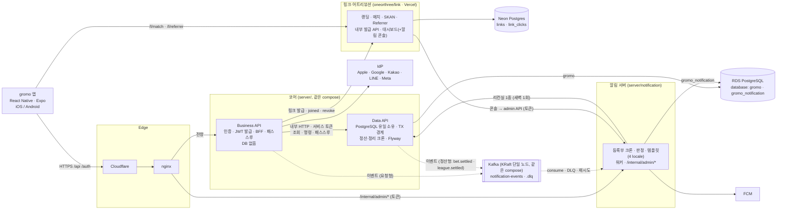
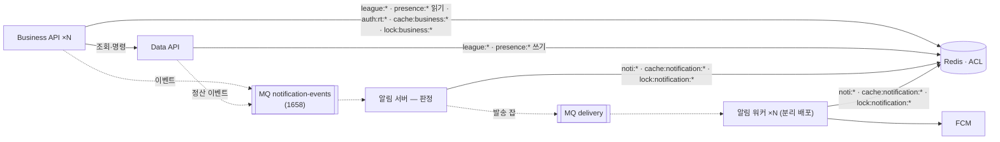

# gromo 서비스 아키텍처 (논리) — Target-1 · Target-2

> 정본(2026-09-10 승격). 결정 근거는 `decisions.md` A1~A19 · 알림 서버 설계 결정 D1~D20(`docs/prd/notification-server/policy.md`, 승격 예정) · 링크·어트리뷰션 설계 장부 v3(승격 예정).
> **Target-1** = 이번 분리 라운드(에픽 1643 + 알림 서버 + 링크 서버) 종료 시점. **MQ = Kafka 단일 노드 컨테이너(A12 확정)** · Redis 없음. **Target-2** = 관리형 MQ · Redis · 워커 분리.

## 0. 한 문장

**앱은 Business API 하나만 본다. 데이터는 Data API 만 만진다. 알림과 링크는 자기 데이터만 갖고, 코어를 부르지 않는다.**

## 1. Target-1 구도



실선 = 동기 HTTP, 점선 = 이벤트(Kafka). `POST /internal/events` 는 폴백·수동 재전송용으로만. 링크 서버(Vercel)는 브로커에 붙지 않는다.

## 2. 컴포넌트 책임

| 컴포넌트 | 소유 데이터 | 하는 일 | **안 하는 일** |
|---|---|---|---|
| **Business API** (신규, `server/services/business-api`) | 없음 (stateless) | 앱 진입점. **인증**(IdP 검증·게스트·AT 서명·refresh·logout, A7) · 화면 단위 BFF(`/bff/*`) · 아직 BFF 가 없는 엔드포인트 **패스스루**(A8) · 요청형 유스케이스 조합 · 요청형 이벤트 발행(친구·챌린지 개설·내기 승리 등) · 링크 발급 호출 | DB 접근 · 트랜잭션 · 크론 · 정산 |
| **Data API** (현 `server/services/data-api`) | `gromo` database 전체 | 데이터 서빙(`/internal/*` 조회·명령, A9) · **트랜잭션 경계·쓰기 불변식** · Flyway · **정산·정리 크론**(내기 3 · 리그 주간 · orphan sweep, A4) · 정산형 이벤트 발행(D10) · RT 저장·대조·회전·탈퇴 검사(A7) | 공인 노출 · JWT 검증 · FCM · 문구 · 알림 크론 |
| **알림 서버** (신규, `server/services/notification`) | `gromo_notification` database (templates · kinds · jobs · deeplinks · deliveries · device_tokens · settings · snapshots) | 이벤트 소비 · 스냅샷 · 등록부 크론 22 · 판정(quiet hours·쿨다운·dedup) · 템플릿 렌더(ICU, 4 locale) · FCM 발송·재시도·이력 · `/internal/admin/*` | 도메인 테이블 읽기(D4) · Data API 쓰기 · 화면 |
| **링크 서버** (별도 레포 `oneorthree/link`, Vercel + Neon) | `links` · `link_clicks` · SKAN·Referrer 원장 · 캠페인 비용 | 랜딩 · 지문 매치 · claim 귀속 · SKAN 포스트백 · Install Referrer · 캠페인 링크 대시보드 · **알림 콘솔 화면**(D17) | 코어 호출(단방향) · 유저 인증(콘솔 비밀번호 2겹은 별개, D18) |
| **앱** | 로컬 설정 · 토큰(SecureStore) | Business API 만 호출 · link 서버엔 match/referrer 만 · 언어 설정을 서버에 보고(`users.locale`, D11) | — |

## 3. 의존 방향 — 단방향 규칙

```
앱 → Business API → Data API
        │               │
        ├──이벤트──▶ 알림 서버 ◀──이벤트──┘        알림 서버 → Data API : 리컨실 1종만
        └──발급────▶ 링크 서버                     링크 서버 → (아무도 부르지 않음)
                     ▲
              콘솔 → 알림 서버 admin API
```

| 허용 | 금지 |
|---|---|
| Business → Data (조회·명령·패스스루) | Data → Business |
| Business / Data → 알림 (이벤트, 발행 주체 = 그 유스케이스를 완료한 프로세스) | 알림 → `gromo` database 직접 읽기 |
| 알림 → Data (`GET /internal/users/notification-snapshot` 하나) | 알림 → Data 쓰기 |
| Business → 링크 (발급·joined·revoke, 표시정보 스냅샷 동봉) | 링크 → 코어 어떤 것도 |
| 링크(콘솔) → 알림 admin API | 알림 → 링크 (Target-1; `type=push` 링크가 필요해지면 알림 → 링크 호출만, 폴백 스킴) |
| 앱 → Business, 앱 → 링크(match·referrer) | 앱 → Data · 앱 → 알림 |

원칙: **위성(알림·링크)은 코어를 부르지 않고, 코어가 위성에 밀어준다.** 위성이 코어의 사실을 알아야 하면 이벤트/발급 시 **동봉**하고, 정합은 리컨실/PATCH 로 맞춘다.

## 4. 통신 방식

| 방식 | Target-1 | Target-2 |
|---|---|---|
| 동기 내부 HTTP | 서비스 토큰(Bearer) + `X-User-Id`. 타임아웃·재시도(멱등 GET 만)·서킷을 **공통 RestClient 팩토리**에 처음부터 | 동일 |
| 이벤트 | **Kafka 단일 노드 컨테이너**(A12) — 토픽 `notification-events`(파티션 3, 키 = userId) + `.dlq`, 봉투 = `eventId` · `type` · `occurredAt` · `scheduledAt` · `userId` · `locale` · `subjectId` · `params`. 소비 측 `eventId` UNIQUE 멱등 + Spring Kafka 재시도·DLQ + 1일 1회 리컨실 (D7·D19). `POST /internal/events` 는 폴백·수동 재전송 | 관리형 브로커(MSK 등)로 승격 또는 그대로. 봉투·어댑터 동일 |
| 공유 저장소 | 없음 | Redis — **A19 네임스페이스 표 + ACL**: `league:*`·`presence:*`(Data 쓰기 · Business 읽기) · `noti:*`(알림) · `auth:rt:*`(Business) · `cache:<svc>:*`·`lock:<svc>:*`(각자, 공유 금지) |
| 앱 ↔ 서버 | REST `/api/v1`(패스스루) + `/bff/*` + `/auth/*` | 동일 |

## 5. 인증 경계 (A7 · A8)

- **AT**: Business API 가 HS256 `JWT_SECRET` 으로 서명·검증. 다른 서비스는 키를 갖지 않는다.
- **RT**: Data API `users.refresh_token` 에 저장. refresh 요청 → Business API → Data API `/internal/auth/refresh`(대조·회전·탈퇴 검사) → Business API 가 새 AT 서명.
- **탈퇴·무효 유저**: 매 요청 검사는 없다(stateless). Data API 가 `/internal/*` 호출마다 `X-User-Id` 활성 검사(현 `JwtFilter` 로직 이관) — Target-1 에선 모든 앱 요청이 Data API 를 거치므로 실질 동일. AT 3600s 창 수용.
- **내부**: 서비스 토큰 4종(A11 ⑥). 콘솔 사람 인증은 링크 대시보드의 비밀번호 2겹(D18), 알림 서버는 사람을 모른다.

## 6. 배치의 자리 (A4 · A5)

| 잡 | Target-1 프로세스 | 락 |
|---|---|---|
| 내기 정산 3종 · 리그 주간 정산 · orphan sweep | **Data API** (ShedLock, `gromo`) | 그대로 |
| 알림 22 잡 (상태 조회형 6 + 예약·묶음 flush) | **알림 서버** 등록부 (`notification_jobs` + ShedLock, `gromo_notification`) | 그대로 |
| 봇 틱 · 순위 추월 | **폐기** (A5 · D6) | — |
| 리컨실 (스냅샷 대조) | 알림 서버, 새벽 04:00 | — |
| 링크 집계 | 링크 서버 (Vercel Cron) | — |

Business API 는 크론을 갖지 않는다 → 단일/다중 인스턴스 무관.

## 7. 데이터 소유 (A10)

| 저장소 | 소유자 | 내용 |
|---|---|---|
| RDS `gromo` | Data API | 도메인 전체 (users · focus · league · group · currency · …). 다른 서비스 직접 접근 금지 |
| RDS `gromo_notification` | 알림 서버 | 알림 HLD §5 의 14 테이블. 별도 DB 유저·Flyway |
| Neon (link) | 링크 서버 | links · link_clicks · skan · referrer · spend |
| 앱 로컬 | 앱 | 설정 · 토큰 |

교차 조회는 **없다** — 필요한 사실은 이벤트·발급에 동봉하거나(위성), Data API 조회 API 로(코어).

## 8. Target-2 에서 달라지는 것



- **MQ**: 이벤트 어댑터 교체(HTTP → 브로커), at-least-once 는 이미 `eventId` 멱등으로 준비됨. DLQ·재시도는 1658 범위.
- **Redis**: 리그 랭킹 ZSET(리그 BFF 의 50페이지 클라 합산 제거, "지금 N위" 정확도 — D9 해소) · 프레즌스 리스 · RT 블랙리스트(강제 로그아웃) · Business API 다중 인스턴스 락 · 알림 카운터.
- **알림 워커 분리 배포**: 판정과 워커 사이에 큐가 있으므로 코드 무변경으로 워커만 스케일.
- **알림 DB 별도 인스턴스**: 부하가 보이면 (A10).
- **공유 저장소 규칙(A19)**: Redis 키는 네임스페이스 표(`decisions.md` A19)에 있는 것만 — `league:*`·`presence:*` 는 Data 가 쓰고 Business 가 읽으며, `noti:*`·`auth:rt:*` 는 소유자 전용, `cache:<svc>:*`·`lock:<svc>:*` 는 각 서비스 자기 것만(서비스 간 공유 캐시·락 금지). **Redis ACL** 로 서비스별 유저에 키 패턴·명령 권한을 주어 강제한다. 사본이므로 소유자가 재구축 가능해야 한다 — 단방향 규칙의 저장소 판.

## 9. 08-25 시안 대비 변경 요약

| 시안 | 이 문서 |
|---|---|
| 알림 서버가 Data API 로 템플릿·이력·토큰 왕복 | 알림 DB 별도, 코어 호출은 리컨실 1종 |
| 이벤트 발행 = Data API | 발행 = 유스케이스를 완료한 프로세스(요청형 Business · 정산형 Data) |
| MQ(Kafka/SQS)·Redis 첫날부터 | Target-1 = **Kafka 단일 노드 컨테이너**만, Redis 는 Target-2 |
| `/bff/*` 만 Business, 나머지 133 직행 | **전량 Business 경유**, Data API 공인 노출 0 |
| 인증 = 기존 서버 직행 | 인증 = Business API, 상태(RT)는 Data API |
| 링크·콘솔 없음 | 링크 서버(별도 레포·Vercel·단방향) + 콘솔 동거·비밀번호 2겹 |
| 크론 15종 → 알림 서버 | 알림 22 → 알림 서버, 정산·정리 → Data API, 봇·추월 폐기 |

## 10. 열린 점

- D9 만 잠정. (A12 Kafka 확정 · A14 EC2 사이즈업 · A17 서버 모노 확정)
- **레포(A17)**: 앱 `OneOrThree/app` · 링크 `oneorthree/link` · docs 사이트 · **JVM 서비스 5개 = `oneorthree/server`**(`services/data-api|business-api|notification|chat|file-upload` + `deploy/` + `docs/`). 이력서·팀 사이트는 허브 1장(`docs/architecture` 승격본)으로.
