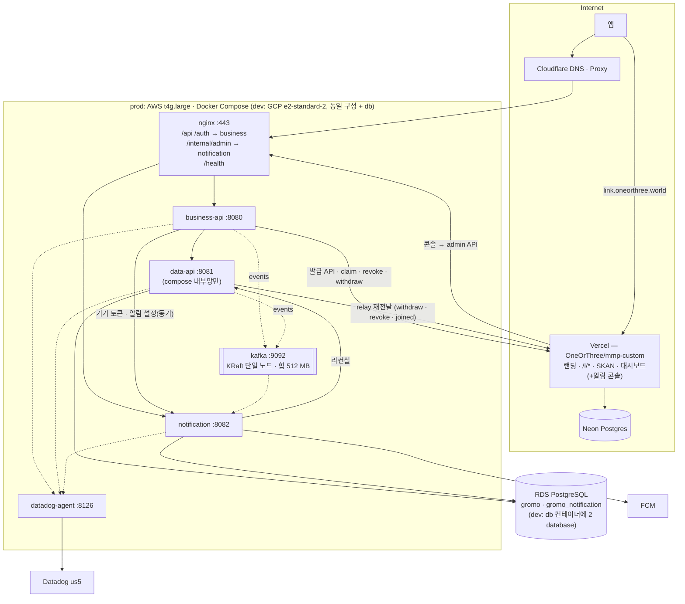

# gromo 시스템 아키텍처 (물리) — Target-1 · Target-2

> 정본(2026-09-10 승격). 논리 구도는 `service-architecture.md`, 결정은 `decisions.md` A1~A19.
> AS-IS 원본: 08-12 AS-IS 다이어그램(개인 보관).

## 1. 환경 실측 (2026-09-09)

| 환경 | 컴퓨트 | 현재 compose | DB | 관측 |
|---|---|---|---|---|
| **dev** | GCP `oneorthree2` / `gromo-dev-app` **e2-medium (2 vCPU · 4 GB)**, asia-northeast3-a. 러너 `gromo-dev-build` e2-custom-4-8192 | `app` · `db`(Postgres 컨테이너) + `datadog` 오버레이 | 컨테이너 Postgres | Datadog `gromo-back-dev`, 샘플 20% |
| **prod** | AWS **`gromo-prod` t4g.medium (2 vCPU · 4 GB, arm64, ap-northeast-2a)** → **Target-1 은 t4g.large(8 GB) 사이즈업(A14)** + Kafka 컨테이너(A12) | `app` · `nginx` · `datadog-agent` | **RDS `gromo-prod-db` db.t4g.micro (2 vCPU · 1 GB · 20 GB · single-AZ · PG 16.13)** — 알림 database 추가 시 db.t4g.small 검토 | Datadog `gromo-back-prod`, 샘플 20% |
| **link** | Vercel (Hobby → Pro 또는 Cloudflare, 링크 장부 미결) | — | Neon Postgres (무료) | Vercel 로그 (Datadog 밖) |

## 2. Target-1 배치



### 2.1 공인 노출면 (nginx)

| 경로 | 대상 | 인증 |
|---|---|---|
| `/api/v1/auth/**` — 소셜 로그인 6종 · 게스트 · refresh · logout | business-api | **없음 (pre-auth)** — AT 발급 **전**에 호출하는 경로다. 앱 현행 계약이 `/api/v1/auth/*` 이므로 Target-1 도 이 접두를 유지한다(경로를 `/auth/**` 로 옮기려면 배포된 앱이 있어 이관 절차가 따로 필요). 현 `JwtFilter` 화이트리스트 8종이 여기로 옮겨온다. **단 소셜 로그인은 「무인증」이 아니라 「선택적 인증」이다** — AT 가 실려 오면 `access` 타입인지 검증해 그 `userId` 를 Data 로그인 명령에 넘겨야 **게스트 → 소셜 승격**이 성립한다(순수 익명으로 구현하면 새 `User` 가 생겨 기존 기록을 잃는다, 서비스 §5) |
| **`DELETE /api/v1/users/me/device-token`** | business-api | **AT 만으로는 부족** — 현 `deleteDeviceToken`(`userApi.ts:88-94`)은 **refresh 인터셉터가 없는 bare axios 에 기존 AT** 를 싣고 `App.tsx:293-306,528` 은 실패를 삼킨다. 앱을 1시간 넘게 안 쓴 뒤 로그아웃·계정 전환하면 **만료 AT 로 401 이 나 Business 에 닿지도 못해 outbox 조차 안 남고**, 뒤의 `/auth/logout` 에는 대상 토큰·소유권 값이 없어 복구 불가다. 그래서 **이 삭제만은 RT(또는 별도 기기 자격)로 인증**하거나, **세션 전환을 깨지 않는 방식으로 fresh AT 를 확보한 뒤** outbox 기록까지 끝낸다 |
| 그 외 `/api/v1/**` · `/bff/**` | business-api | JWT (Business API 서명 검증) |
| `/auth/sessions` 및 `/auth/sessions/**` | business-api — 무접두 신규 API, URI 그대로 전달 | 선택 AT·RT·provider 자격의 세부 인증은 계정 계약(1757)에서 구현한다. nginx의 경로 연결은 인증 예외를 만들지 않으며, 현재 `AccessTokenFilter` 기본 보호를 유지한다 |
| `/me` · `/islands` · `/focus-sessions` · `/invitations` · `/rankings` · `/statistics` · `/screens` · `/link-previews` 및 각각의 `/` 하위 | business-api — 정확한 루트 경계만 연결(`me-other` 등 제외) | 앱 JWT 검증. 외부 `X-User-Id`·caller·링크 IP 증명 헤더는 폐기하고 내부 위임은 Business가 생성한다. 링크용 공유 시크릿 불필요. nginx upstream 재시도는 명시적으로 끈다. 기존 `/api/v1/link-previews` 계약·thumbnail URL은 유지한다 |
| `/internal/admin/**` | notification | 서비스 토큰(콘솔 전용). Vercel egress IP 는 가변이라 IP 허용 목록 없음 |
| `/health` | business-api (각 서비스 헬스는 compose 내부) | 없음 |
| `/l/**` · `/.well-known/**` | **nginx 가 아니라 DNS** — `link.oneorthree.world` → Vercel | — |
| **`/l/match` · `/l/referrer` (이관 호환)** | nginx → **Vercel 프록시** — 배포된 앱이 `${API_URL}/l/match`(= `api.oneorthree.world`)로 부르고 있어(`deferredInvite.ts`) 이 경로를 지우면 설치 매치가 실패하고 3시간 어트리뷰션 창을 잃는다. **원본 IP 를 반드시 보존한다** — 매치는 클릭 때 저장한 `ip_hash`(SHA-256(ip+salt))와 대조하는데, 그냥 프록시하면 링크 서버엔 EC2 주소가 보여 **정상 설치도 `matched:false`** 가 된다. nginx 가 `X-Forwarded-For` 를 **검증된 원본 IP 로 재작성하고**(클라이언트가 위조한 값 무시) — **`$remote_addr` 로 그냥 덮으면 안 된다**: 운영 경로가 **앱 → Cloudflare → nginx** 라 그 값은 **Cloudflare 엣지 IP** 이고, 그러면 Vercel 랜딩 때 저장한 방문자 IP 해시와 달라 **정상 설치도 `matched:false`** 가 된다. 반대로 요청의 `CF-Connecting-IP` 를 **그대로 믿으면 오리진을 직접 때린 호출자가 위조**할 수 있다. 그래서 **`set_real_ip_from` 에 Cloudflare CIDR 만 등록하고(+ 오리진 방화벽으로 CF 외 접근 차단) 그때만 `CF-Connecting-IP` 를 신뢰해 XFF 를 재작성**한다. Vercel은 수신 XFF를 플랫폼에서 덮어쓰므로 nginx는 같은 검증된 IP를 **`X-Link-Client-IP`에도 실어야 한다**. `X-Link-Proxy-Secret`에 프록시 전용 공유 시크릿을 함께 실으며, 링크 서버는 **그 시크릿이 유효할 때만 `X-Link-Client-IP`의 단일 IP를 신뢰**한다. **시크릿이 없는 직접 요청(방문자 → Vercel)은 소켓 주소가 아니라 Vercel 이 보장하는 클라이언트 IP 헤더**를 쓴다 — 서버리스 함수의 소켓 상대는 방문자가 아니라 플랫폼 프록시이고 실행 방식에 따라 소켓 정보가 아예 없어서, 소켓을 쓰면 클릭에 방문자가 아닌 IP 가 저장돼 나중에 nginx 가 전달한 실제 IP 와 해시가 어긋난다 | 무인증(현행과 동일) + 프록시 시크릿 |
| `/internal` 및 그 외 `/internal/**` · `/actuator` 및 `/actuator/**` | **404 차단** — management 포트는 사설망 전용 | — |

data-api 는 호스트 포트를 열지 않는다(compose 네트워크 내부만). notification 은 `/internal/admin/*` 만 nginx 를 통해 노출.

### 2.2 프로세스 · 포트 · 자원 (초기값)

| 서비스 | 포트 | JVM 힙(초기) | 비고 |
|---|---|---|---|
| business-api | 8080 | 512 MB | DB 없음, 커넥션 풀 없음. 패스스루 라우터 + BFF |
| data-api | 8081 | 1 GB | 현 app 그대로. 커넥션 풀 = Hikari 기본 10(prod 에 명시 설정 없음) |
| notification | 8082 | 512 MB | FCM 풀 · 크론 풀 6+ · 커넥션 풀 작게(≤5) |
| **kafka** (A12) | 9092 (compose 내부만) | **512 MB** + 페이지 캐시 | `apache/kafka` KRaft 단일 노드, retention 7일, **내부 토픽 복제 계수 1**(`OFFSETS_TOPIC_REPLICATION_FACTOR`·트랜잭션 사용 시 `TRANSACTION_STATE_LOG_*` 도 — 기본 3 이면 컨슈머 그룹 불가), `KAFKA_LOG_DIRS=/var/lib/kafka/data`와 같은 경로의 볼륨 필수(디스크 감시). 컨테이너 재생성 후 토픽·메시지 보존을 검증한다. 외부 미노출 — Vercel 은 붙지 않음 |
| nginx · datadog-agent | 443 · 8126 | — | 현행 |

힙 합계 2 GB 는 실사용으로 ≈1.3~1.5배(메타스페이스·스택·다이렉트 버퍼) = 2.6~3 GB 로 본다. dev e2-medium(4 GB)에 JVM 셋 **+ Kafka 512 MB** + Postgres + agent 는 **넘친다** — dev 는 `notification`·`business-api` 힙 256 MB, Kafka 384 MB 로 시작해도 여유가 거의 없어 **e2-standard-2(8 GB) 사이즈업을 전제**로 본다. prod 는 **A14 사이즈업(t4g.large 권장)** 전제 — 현 타입 실측 후 차이만 티켓에.

### 2.3 DB (A10)

- RDS 한 인스턴스에 database **2개**: `gromo`(data-api 유저) · `gromo_notification`(notification 유저). 서로의 database 에 권한 없음 → 교차 조인 물리적으로 불가.
- **prod 도 배포 전에 database·유저를 먼저 만든다.** Flyway 는 **접속 대상 database 자체와 로그인 유저를 만들지 못하므로**, 운영 RDS 에 `CREATE DATABASE gromo_notification` + 전용 유저 + 권한 부여가 사전에 없으면 notification 이미지는 **연결 단계에서 기동 실패**한다(dev 의 §6 절차와 같은 이유, 다른 장소). 마스터 계정으로 도는 **일회성 프로비저닝 단계(또는 IaC)를 릴리즈 절차의 이미지 배포 앞에 못 박는다** — dev 는 컨테이너 Postgres, prod 는 RDS 라 스크립트는 다르지만 「Flyway 앞에 database·유저가 있어야 한다」는 조건은 동일하다.
- db.t4g.micro 의 `max_connections` ≈ **112**(`LEAST(메모리/9531392, 5000)`), 풀 합계 data-api 10 + notification ≤5 → 커넥션은 여유. 병목은 RAM 1 GB(shared_buffers 공유) — §8.
- Flyway 2벌: `services/data-api/.../db/migration/V*` · `services/notification/.../db/migration/**`. **알림도 `V1__…` 로 시작한다** — Flyway 기본 `sql-migration-prefix` 가 `V` 라 `N*` 파일은 그냥 무시되고 스키마가 안 올라간다(현 설정에도 prefix 변경 없음). database·이력 테이블이 분리돼 있어 번호가 겹쳐도 무방하다. `N` 을 굳이 쓰려면 알림 서버에 `spring.flyway.sql-migration-prefix=N` 을 함께 설정해야 한다. CI 는 지금처럼 마이그레이션을 돌리지 않으므로(메모리: 엔티티↔DDL 드리프트는 dev 부팅에서만 터짐) **알림 서버 CI 에 Testcontainers + Flyway 부팅 테스트를 처음부터** 넣는다.
- 백업·파라미터·모니터링은 인스턴스 단위 그대로. Neon 은 링크 서버 소유(링크 장부).

### 2.4 시크릿 (A11 ⑥)

A22 ㋺의 기존 미리보기 통합으로 Business 컨테이너 한도는 2 GiB이며 전용 Redis 캐시는 192 MiB를 추가한다. `business-cache` 내부 네트워크에는 Business와 Redis만 연결하고, Redis 포트는 publish하지 않는다. JVM 힙은 512 MiB, PDF 프로세스 한도는 기존 값을 유지한다. PID 한도 128 안에서 JVM·Redis 연결·PDF 프로세스가 함께 동작하도록 Tomcat 요청 스레드를 최대 32·최소 대기 4로 제한한다. 이는 공유 Redis·리그 전환을 앞당기는 변경이 아니다.

| 시크릿 | 보유 |
|---|---|
| `BUSINESS_REDIS_PASSWORD` | Business만 원문 보유. Redis에는 SHA-256 비밀번호와 키·명령 ACL 파일만 주입 |
| `GOOGLE_DRIVE_API_KEY` | Business 미리보기 전용(선택). Data·Notification에는 전달하지 않음 |
| `JWT_SECRET` | 최종적으로 business-api **만**. **회수 시점은 FCM(아래)과 같은 순서다** — 현 `application-prod.yml:30` 이 기본값 없는 필수 placeholder 라, 라우팅 전환보다 먼저 data-api 에서 빼거나 **직전 digest 로 롤백**하면 **Data 가 기동하지 못해 전체 API 가 멈춘다**. **business-api 에 먼저 병행 배포 → 인증 트래픽 전환과 구 인증 코드 제거 확인 → 롤백 창 종료 → 그다음 data-api 에서 회수** |
| **`APPLE_CLIENT_ID` · `GOOGLE_CLIENT_ID`**(+ 그 밖의 provider 설정) | 최종적으로 **business-api** — IdP 토큰 검증을 옮기므로 함께 옮긴다. **회수 시점은 `JWT_SECRET`·FCM 과 같다**(병행 배포 → 인증 트래픽 전환·구 인증 코드 제거 확인 → 롤백 창 종료 → data-api 에서 회수). 현 `application-prod.yml:39·46` 이 **기본값 없는 필수 주입**이라 빠뜨리면 placeholder 해석 단계에서 **기동 자체가 실패**하고 해당 소셜 로그인이 전부 중단된다 |
| **`API_DB_URL` · `API_DB_USERNAME` · `API_DB_PASSWORD`** (gromo) | data-api — **현 `application-prod.yml:3-5` 이 읽는 실제 이름이다**(기본값 없음). 표에 다른 이름을 적어 두면 그대로 배포했을 때 기동 실패 |
| `NOTI_DB_URL` · `NOTI_DB_USERNAME` · `NOTI_DB_PASSWORD` (gromo_notification) | notification — 신규라 이름을 새로 정하지만 **Data API 의 `API_DB_*` 와 같은 형태로 맞춘다** |
| **`FCM_PROJECT_ID` · `FCM_SERVICE_ACCOUNT_JSON`** | 최종적으로 notification **만**. **단 회수 시점은 Target-1 배포 시점이 아니다** — 이관 절차 ④′ 까지는 Data API 안의 구 `NotificationScheduler` 가 실제 푸시를 계속 보내야 하는데, `FcmPushNotificationClient` 는 **둘 중 하나만 없어도 기동을 막는 fail-fast** 생성자라 배포와 동시에 빼면 **Data API 가 아예 안 뜨거나 구 발송 경로를 먼저 죽여야** 해서 이중 쓰기·백필·drain 기간의 알림이 끊긴다. 순서: **전환용 Data 이미지에는 자격을 병행 배포 → ④′ drain 과 legacy FCM 빈 제거 확인 → 그 다음 배포에서 data-api 자격 회수** — `FcmPushNotificationClient` 는 **둘 중 하나라도 없으면 기동을 실패**시키고, 프로퍼티 키가 env 자동 변환과 정확히 일치해야 한다(그 클래스 주석). `_BASE64` 접미사 붙은 이름이 아니고, **project ID 도 함께 옮겨야 한다** |
| `SVC_TOKEN_BIZ_TO_DATA` · **`SVC_TOKEN_NOTI_TO_DATA`**(리컨실 — 서비스 전용 호출) · **`SVC_TOKEN_BIZ_TO_NOTI`** · **`SVC_TOKEN_DATA_TO_NOTI`** · `SVC_TOKEN_CONSOLE_TO_NOTI` · **`SVC_TOKEN_BIZ_TO_LINK`** · **`SVC_TOKEN_DATA_TO_LINK`** — **위성 호출 토큰은 caller 별로 쪼갠다**(총 7종). 같은 비밀값을 Business 와 Data 에 함께 주면 수신 측이 **어느 프로세스가 불렀는지 구분할 수 없어** Business 용 경로(기기 토큰·설정·링크 발급)와 Data relay 용 경로(withdraw·revoke·joined)의 허용목록이 **합쳐지고**, 한쪽 자격이 유출되면 다른 쪽 전용 명령까지 열린다. 토큰마다 audience 와 메서드·경로를 **독립적으로** 제한한다(A11) | 발신·수신 양쪽 |
| **`BATCH_ADMIN_KEY`** (배치 트리거 `X-Batch-Admin-Key` 대조값) | **data-api** — A8 이 「⑴ nginx·Business 허용목록에서 `/api/v1/**` 의 배치 경로 제외 ⑵ `/internal/*` 로만 노출 ⑶ 그때까지 가드 유지」를 동시에 요구하므로, 세 조건이 갖춰지기 전까지 이 키는 **계속 배포된다**. `@Value("${BATCH_ADMIN_KEY:}")` 라 미주입이 기동을 막지는 않지만, **빈 값이면 가드가 사실상 열린다** |
| **GA4 4종**(`GA4_FIREBASE_APP_ID` · `GA4_APP_API_SECRET` · `GA4_WEB_MEASUREMENT_ID` · `GA4_WEB_API_SECRET`) | **data-api 와 링크 서버 양쪽** — 현 `InviteLinkGa4Events` 가 `invite_link_created`·`invite_link_clicked`·`invite_match_resolved` 를 이 네 값으로 발행하는데, Target-1 에서 **발급·랜딩·매치가 링크 서버로 넘어가므로 그 이벤트 발행도 함께 넘어간다**. 링크 서버에 안 주면 **가입 이벤트만 Data 에 남고 클릭·매치 퍼널이 조용히 끊긴다**(대안으로 링크 → 코어 전달 경로를 만드는 건 단방향 규칙에 어긋난다). 가입 귀속(`group_joined`)은 `publishJoinAttribution` 이 Data 에 남으므로 data-api 도 계속 보유 — 가입 귀속 발행(`publishJoinAttribution`)이 GA4 전송을 겸하고 그 코드가 Data 에 남으므로 함께 남는다. 넷 다 **기본값 있는 선택 주입**이라 미주입이 기동을 막지 않고 WARN 1회만 남긴다(FCM 의 fail-fast 와 대비 — 분석 배선 누락이 서비스를 세우면 안 된다는 현행 판단을 유지) |
| **`OPENAI_API_KEY`** | **data-api** — `/api/v1/character/moderation`(캐릭터 이미지 모더레이션)은 도메인 기능이라 Data 에 남고 Business 는 패스스루한다. 현 배포 생성기 `.github/scripts/write-compose-env.py:24` 가 **필수로 취급**하고 `OpenAiModerationClient:69` 는 값이 없으면 **모든 모더레이션 요청을 예외로 차단**하므로, 표에서 빠지면 그 경로가 전면 실패한다 |
| 콘솔 비밀번호 4개(해시) | Vercel env (링크 레포) |
| `LINK_IP_SALT` · SKAN 키 | 링크 서버 (Vercel env) — **기존 운영 값을 그대로 복사한다(새로 생성 금지)** |
| **`LINK_CAPABILITY_KEY`**(§3 비공개 가입 자격 서명) | **링크 서버(발급) 와 data-api(검증) 양쪽** — HMAC 공유 비밀 또는 링크 서버 개인키/Data 공개키 쌍. 없으면 Data 는 자격의 발급자를 확인할 수 없어 **가입을 전부 실패시키거나, 서명을 안 보고 클라이언트가 준 `groupId`·`inviterId`·`membershipEpoch` 를 믿어 비공개 그룹 가입이 우회**된다. **회전은 구·신 키 병행 검증 기간을 두고**(자격 만료보다 긴 창) 그 뒤 구 키를 폐기한다 |
| **`LINK_PROXY_SECRET`**(§2.1 의 프록시 전용 공유 시크릿) | **nginx·링크 서버·Business API** — 서비스 토큰과 별개다. 운영 Business는 기본값 없이 참조하므로 env 생성 전에 필수 검증한다(A22 ㋯). 이게 없으면 legacy `/l/match` 프록시가 신뢰 가능한 전달 IP 를 못 실어 링크 서버가 Vercel 이 본 EC2 주소로 해시하고, **정상 클릭도 `matched:false`** 가 된다 |

**런타임 시크릿 공급 경로(A22 ㋯):** prod 는 Secrets Manager(`gromo/prod/env` JSON), **dev 도 Secrets Manager(`gromo/dev/env`)** 이다. 현 `dev-cd.yml:79-90` 은 AWS OIDC 자격으로 JSON 을 읽어 `.github/scripts/write-compose-env.py` 를 통해 checkout 밖의 `dev.env` 로 쓴다. 같은 워크플로의 GCP 메타데이터 호출(`:92-98`)은 **GAR 이미지 pull 인증용**이다.

**Target-1 최초 배포 전에 공급 경로 전체를 수정한다.** 현 `write-compose-env.py:44-57` 은 `REQUIRED_KEYS` 와 Grafana 키만 출력해, JSON 에 `NOTI_DB_*`·`SVC_TOKEN_*` 를 추가해도 env 파일에는 나타나지 않는다. 구현 순서는 다음과 같다.

1. 위 표의 **서비스별 보유 목록**으로 env 생성기의 출력·필수값 검증을 나눈다. 배포 단계별 병행 보유(JWT·FCM 회수 전)도 명시하고, 해당 서비스의 필수 키 누락은 배포 전에 실패시킨다. 모든 JSON 키를 모든 서비스에 전달하는 방식은 사용하지 않는다.
2. `gromo/dev/env` 에 새 키를 등록하고, CD 가 생성하는 env 파일에 반영한다. compose 의 각 서비스 `environment` 또는 전용 `env_file` 에도 **허용된 키만** 연결한다. 표의 DB 이름·서비스 토큰 audience 와 실제 런타임 프로퍼티가 일치해야 한다.
3. **합성 시크릿 JSON → env 생성기 → `docker compose config`** 검증을 CI 에 넣는다. `NOTI_DB_*` 와 호출자별 서비스 토큰의 전달, 다른 서비스 시크릿의 미노출, 필수 키 누락 시 실패를 확인한다. 실제 시크릿 값은 검증 로그에 출력하지 않는다. prod 의 별도 배포 경로에도 같은 서비스별 전달 검증을 적용한다.

이 생성기·compose 변경은 **구현 착수 시 해야 할 작업**이며, 현 코드에 이미 새 서비스 지원이 있다는 뜻이 아니다.

**`LINK_IP_SALT` 는 전환 불변식이다.** 현 `invite_link_clicks.ip_hash` 는 운영 `LINK_IP_SALT`(`application-prod.yml`)로 이미 계산돼 있어서, Vercel 에 **새 salt 를 생성하면 백필한 클릭의 해시와 설치 시 새 서버가 계산한 해시가 전부 어긋나** IP·OS 가 같은 정상 설치도 3시간 매치 창 내내 `matched:false` 가 된다. 그래서 ⓐ 이관 시 **기존 값을 그대로 옮기고** ⓑ 미매치 클릭이 남아 있는 동안(= 최소 매치 창 3시간)은 회전하지 않으며 ⓒ 나중에 회전한다면 **구·신 salt 를 모두 계산해 조회하는 기간**을 두고 그 기간이 끝난 뒤 구 salt 를 폐기한다.

## 3. CI/CD 표준 (A11)

```
레포 (A17 · 1695 개정)
  oneorthree/server         JVM 서비스 전부 — phone 개명
    services/data-api/  services/business-api/  services/notification/  services/chat/  services/file-upload/   (각각 CLAUDE.md)
    deploy/             docker-compose.<env>.yml · nginx · dev.yml/prod.yml 배포 매니페스트(자동 커밋)
    docs/               architecture(허브 원본) · prd · conventions
    loadtest/
  OneOrThree/app            앱 (미러 승격)
  OneOrThree/mmp-custom           링크 서버 (Vercel Git 연동, 이 파이프라인 밖)
  (docs 사이트 레포)         docs.oneorthree.world — 허브 페이지

server/.github/workflows/
  dev-ci.yml        paths 매트릭스: services/<name>/** 가 바뀐 서비스만 → be-gradle.yml(재사용 1개, service 입력) → 이미지 <name>:<sha> push
                    ※ 공통 입력(settings.gradle · gradle wrapper · 공통 build script · .github/workflows/be-gradle.yml · deploy/compose·nginx) 이 바뀌면
                      매트릭스를 전 서비스로 fan-out — 서비스 폴더 밖 변경이 검증 없이 머지되거나 이미지에 반영되지 않는 걸 막는다
                    ※ 전 서비스 fan-out 시 각 CD 가 같은 deploy/<env>.yml 을 따로 커밋하면 충돌한다 —
                      호출자 SHA 를 checkout 하는 현 dev-cd.yml 구조 그대로면 첫 CD 가 봇 커밋을 push 한 뒤
                      나머지는 그 커밋이 없는 같은 부모에서 push 해 non-fast-forward 로 실패하고,
                      병렬이면 서로의 digest 를 덮는다. 환경별 concurrency 만으로는 낡은 checkout 이 갱신되지 않는다.
                      → 한 작업이 모든 digest 를 원자적으로 커밋하거나, 각 CD 가 최신 매니페스트 위로
                        fetch/rebase 한 뒤 충돌 시 재시도하도록 표준에 넣는다
                    ※ 단 CD 가 자동 커밋하는 deploy/<env>.yml 매니페스트는 fan-out 에서 제외한다(paths-ignore) —
                      포함하면 배포 → 매니페스트 커밋 → 전 서비스 CI → 새 SHA 이미지 → 다시 배포 로 무한 재빌드가 돈다.
                      봇 커밋은 push 트리거에서 빼거나(actor 조건) 커밋 메시지에 [skip ci] 를 붙인다
  dev-cd.yml        (workflow_call from ci + workflow_dispatch — 사람·CI 같은 버튼) 입력: service · digest · env → deploy/<env>.yml 갱신·커밋 → SSH/SSM: compose pull + up -d <service> → 헬스체크
  prod-ci.yml / prod-cd.yml / prod-rollback.yml   동일 구조, ECR, rollback = 서비스별 이미지 태그
  api-dog-generate  service 별 OpenAPI (business-api 가 앱 계약의 정본, data-api 는 /internal 문서)
```

- 변경된 서비스만 빌드·배포(경로 필터로 결정). compose 는 환경당 1파일 — **prod 6개**(JVM 서비스 3 + nginx · kafka · datadog-agent, DB 는 RDS), **dev 7개**(같은 6개 + Postgres `db` 컨테이너, §6·A10). 오버레이(datadog·observability) 유지.
- 헬스체크: `GET /health` 각 서비스, CD 는 변경된 서비스만 기다림(300s).
- **내부 HTTP 계약도 이벤트 스키마와 같은 expand/contract 를 따른다.** 서비스별 이미지를 하나씩 교체·롤백하는데 Business↔Data·코어↔위성의 동기 계약에는 규칙이 없었다 — Business 가 **새 엔드포인트·응답 필드를 요구하는 버전을 먼저** 올리면 기존 Data 에서 404·역직렬화 실패가 나고, Data 가 필드를 먼저 지우거나 **단독 롤백**되면 기존 Business 의 앱 경로가 끊긴다. 규칙: ⓐ 요청·응답 변경은 **additive** 만(필수화·삭제·타입 변경 금지) ⓑ **제공자 선배포 · 소비자 후배포**(이벤트의 「소비자 선배포」와 방향이 **반대**다 — HTTP 는 제공자가 먼저 준비돼야 한다) ⓒ 제거는 **다음 릴리즈에서**(롤백 창 밖) ⓓ **양방향 계약 테스트를 양쪽 CI 에** ⓔ 이 규칙을 지킬 수 없는 변경은 **상호 의존 이미지를 한 매니페스트로 원자 배포**한다.
- 롤백: `prod-rollback.yml` 에 `service` 입력 추가 — **이전 digest 를 `deploy/<env>.yml` 매니페스트에 먼저 기록·커밋한 뒤 그 상태를 적용한다**(태그만 되돌리고 매니페스트를 두면, 다음 호스트 재구축이나 전체 `compose up` 이 매니페스트의 문제 digest 를 다시 배포해 롤백이 취소된다). compose·스키마는 유지(현행 원칙). **단 이 원칙은 스키마가 이전 바이너리와 호환될 때만 성립한다** — 이 레포엔 `V16__rename_refresh_token_to_hash.sql` 같은 rename 과 `DROP COLUMN` 이 실재해서, 그런 마이그레이션이 포함된 배포는 이미지를 되돌리면 이전 코드가 없는 컬럼을 읽어 기동·요청이 깨진다. 규칙: **① 롤백 가능 기간(직전 1 릴리즈) 동안은 파괴적 DDL 금지** — rename·drop 은 expand/contract 2단계로 나눈다(새 컬럼 추가 → 백필 → 읽기 전환 → **다음** 릴리즈에서 구 컬럼 제거). **② 파괴적 DDL 이 든 릴리즈는 롤백 대상이 아니다** — roll-forward(수정 배포)만 하고, PR 본문 「DB 변경」 절에 그 사실을 적는다.
- 링크 서버는 Vercel Git 연동(별도 레포) — 이 파이프라인 밖.

## 4. 관측

| 서비스 | `DD_SERVICE` | 계측 |
|---|---|---|
| business-api | `gromo-business-{env}` | APM(servlet · http.client → data-api 스팬) · 로그 |
| data-api | `gromo-data-{env}` | APM(servlet · postgresql · scheduled.call) · 로그 |
| notification | `gromo-notification-{env}` | APM(scheduled.call · http.client FCM) · **표준 잡 로그 + 메트릭 3종**(`notification.job.duration` · `delivery.count{kind,status}` · `reconcile.mismatch`) — 스팬 샘플 20% 에 기대지 않음 |
| link | — | Vercel 로그·Analytics (Datadog 밖, 링크 장부 대가 ④) |

대시보드 `mdh-sxt-jta`(백엔드 관측)에 `service` 템플릿 변수로 3 서비스 전환 + 알림 잡 패널 추가. 트레이스는 `X-Datadog-*` 헤더 전파로 business → data 한 트레이스.

## 5. 네트워크 · 보안 요약

- 외부 → nginx 443 만. data-api 무노출. notification 은 `/internal/admin` 만.
- 서비스 간 = compose 내부 DNS(`http://data-api:8081`). 사설망이라 TLS 없음(같은 호스트). Vercel → notification 만 인터넷 경유(HTTPS + 토큰).
- link 서버 → 코어 호출 없음(단방향) → 코어에 링크용 인바운드 없음.
- 앱 → link 는 `link.oneorthree.world` 직접(Cloudflare 밖, Vercel). **단 이관 기간 동안** 기존 배포본이 부르는 `api.oneorthree.world/l/match`·`/l/referrer` 를 nginx 가 Vercel 로 프록시한다 — 제거 조건: 새 호스트를 쓰는 앱 버전이 최소 지원 버전이 되고, 구 경로 호출이 7일 연속 0 일 때(Datadog 로 확인).

## 6. dev 전용 차이

- Cloudflare 없음(`oneorthree.dev.mooo.com` 직행) — **dev 에 nginx 가 있는지 미확인**(compose 엔 `app`·`db` 뿐, CD 헬스체크는 `localhost:8080`). Target-1 에서 dev 도 nginx 를 두어 경로 규칙을 prod 와 같게 한다(§2.1).
- DB 는 컨테이너 Postgres 에 database 2개. `docker-entrypoint-initdb.d` 는 **데이터 디렉터리가 비어 있을 때만** 돌고 dev 는 `postgres_dev_data` named volume 을 영속하므로, **기존 dev 호스트를 Target-1 로 올릴 때는 init 스크립트가 실행되지 않는다** — 배포 절차에 일회성 `CREATE DATABASE gromo_notification` + 유저·권한 생성(또는 매 기동 시 도는 멱등 초기화 잡)을 포함한다. 빠뜨리면 notification 이 DB 연결 단계에서 기동 실패.
- Datadog 오버레이는 현행(`docker-compose.datadog.yml`), 서비스 3개에 `-javaagent` 동일 주입.

## 7. Target-2 추가분

| 추가 | 배치 | 조건(수치) |
|---|---|---|
| MQ 관리형 승격 (MSK 등) | Target-1 은 EC2 위 Kafka 단일 노드(A12) | 브로커 다운으로 **30분 이상** 발송 지연이 **월 1회 이상**, 또는 디스크·업그레이드 수동 작업이 월 1회 이상 |
| Redis | prod ElastiCache(최소) / dev 컨테이너 | 리그 화면 **p95 > 1.5s** 또는 `findRankOf` **p95 > 500ms**(APM), 또는 Business API 2 인스턴스 필요(아래) |
| 알림 워커 분리 배포 | 같은 compose 에 `notification-worker` 서비스, 큐 소비만 | 팬아웃 잡 5분 초과 또는 대상 2,000명 초과 (알림 실측 §0) |
| 알림 DB 별도 인스턴스 | RDS 추가 | `gromo_notification` 이 RDS CPU **30% 이상** 지속 또는 커넥션 대기(`Hikari pending`) **> 0** 이 일 1회 이상 |
| Business API 다중 인스턴스 | compose replicas 또는 VM 추가 + nginx upstream | 앱 API **p95 > 1s** 가 일 3회 이상, 또는 CPU **70% 이상 10분** 지속 |

임계값은 **초기값**이다 — 첫 분기 실측 후 `decisions.md` 에 A 번호로 조정한다.

## 8. 열린 점

1. ~~prod 인스턴스 사양~~ → **실측 완료(09-10)**: EC2 t4g.medium → large 사이즈업(A14). RDS db.t4g.micro(1 GB) — 알림 database 동거 시 small 승격 여부는 커넥션 대기·freeable memory 실측 후.
2. **dev nginx 유무** — 호스트 nginx 인지 Cloudflare 직행인지 확인 후 §6 확정.
3. Vercel Pro vs Cloudflare(링크 장부 미결) — 알림 콘솔 편집자 수가 변수.
4. **GROMO-1660 재정의** — 티켓 본문 범위 4("클릭 적재를 MQ 비동기 경로로")가 링크 v3(Vercel·Neon 직접 적재, 단방향)와 어긋난다. (배포 정의 소유자는 A17 로 확정 — `oneorthree/server` 안, 레포 간 dispatch 없음)
5. **A18(보류)** — Kafka 발행 실패 정책(유실 수용 / 발행 실패 테이블 재발행 / HTTP 자동 폴백).

## 9. 08-12 AS-IS 대비 변경 요약

- 배포 단위 1(`app`) → **컨테이너 prod 6 / dev 7**(JVM 서비스 3 + nginx · kafka · datadog-agent, dev 는 + Postgres `db`) + 외부 1(link/Vercel). 레포 1 → 4 (A17: server · app · link · docs).
- DB 1 database → 같은 인스턴스 2 database + Neon.
- 노출면: `app:8080` 직접 → nginx 가 business/notification 만. data-api 내부화.
- 시크릿: JWT·FCM 이 각각 한 서비스로 이동.
- 관측: 서비스 3개 `DD_SERVICE`, 알림은 메트릭 직접 계측.

소비자의 실패 토픽 resolver는 배포된 `notification-events.DLT`와 같은 이름을 명시한다(A22 ㋱). Spring Kafka 4의 `-dlt` 기본값과 자동 토픽 생성에 의존하지 않는다.


### Target-1 이관 검증 산출물

Data CLI는 export마다 고유한 `manifest.snapshot`을 생성하고 모든 `*.import-####.json` 청크와 `*.verify.json`에 같은 값을 넣는다. 빈 전체 집합도 하나의 빈 import 파일을 만든다. 초기·최종 파일을 섞지 않고 최종 집합의 검증을 통과한 뒤 최초 발송 게이트를 연다(A22 ㋼).

GROMO-1659의 Data export는 settings·device·delivery·user·participation 다섯 자원의 건수·체크섬을 같은 RR 스냅샷에서 생성한다. 실제 Noti bootJar의 정규화·키 유도 함수와 Data export 직렬화를 CI에서 함께 실행한다(A22 ㋳·㋶). Link 이관에는 필드별 표시 version과 LEGACY 귀속을 포함하며, 서비스별 시크릿·이미지 digest·nginx 적용 준비는 `docs/prd/server-separation/deployment.md`를 따른다(A22 ㋷·㋸).


기기 등록 롤아웃은 두 설정을 따로 전환한다(A22 ㋲). `NOTIFICATION_GENERATION_REQUIRED`는 구 AT 수명 대기 뒤
켜고, `NOTIFICATION_LEGACY_DEVICE_REGISTRATION`은 소유권 프로토콜 미지원 구 앱 지원 종료 뒤 끈다.
둘은 Notification 전용 env로 주입한다. 구 앱도 새 AT의 gen·sid를 사용할 수 있으므로 gen 존재로 앱 전환을 추정하지 않는다.

앱 업그레이드 호환 정리는 소유권 기록이 없는 기기의 SDK 토큰 조회에도 의존한다(A22 ㋲). SDK 조회까지 실패한 세션 미연결 구 토큰의 정리는 보장하지 않으며, 사용자 전체 삭제로 다른 기기를 비활성화하지 않는다. RT 폐기는 계속 수행한다.

Business 내부 HTTP의 복구 탐침은 요청 예산 검사 후에만 획득하며, 4xx 판정·자격 거절·계약 오류·요청 구성 예외에서도 정리한다(A22 ㋽). 기존 오류 분류와 재시도 범위를 유지하고 상류 복구 뒤 후속 요청이 통과하는지 실제 HTTP 응답으로 검증한다.

게이트 close는 같은 키의 재시도도 다시 닫고 발송 drain을 기다린다. open 재시도는 게이트 잠금 아래 현재 개방과 실제 데이터를 재검증하며, 이후 close로 닫혔으면 `409 DISPATCH_OPEN_REPLAY_STALE`로 거절한다. 의도적인 재개는 새 open 키를 사용한다. 실제 데이터 재검증 실패는 발송을 닫고 drain한 뒤 검증 태그를 지운다(A22 ㋾). GroupMember의 역할·권한·설정 변경은 실제 변경 컬럼만 저장해 동시 표시 버전 갱신을 보존한다(A22 ㋻).

refresh는 서명된 userId의 활성 users 행을 잠근 뒤 RT 세션을 조회한다. 세션이 있으면 그 행의 소유자·폐기를 판정하고 세션 RT를 조건부 회전한다. users의 단일 해시는 세션 없는 구 RT의 승격에만 유효성 근거로 사용하며, 회전 시에도 같은 옛 해시를 가리킬 때만 동기화한다. 다른 기기의 로그인·회전·개별 로그아웃은 살아 있는 세션의 갱신을 무효화하지 않는다. (A22 ㋣)

소유권 값은 null 또는 정규 UUID 표기만 받는다. 잘못된 값은 Business 상류 호출·Data 내구 기록 전에 400으로 거절하며 null로 바꿔 삭제 범위를 넓히지 않는다. 이미 내구화된 잘못된 소유권 삭제 사건은 Notification이 어떤 기기도 변경하지 않고 소비 완료해 후속 사용자 사건을 막지 않는다. (A22 ㋗)
