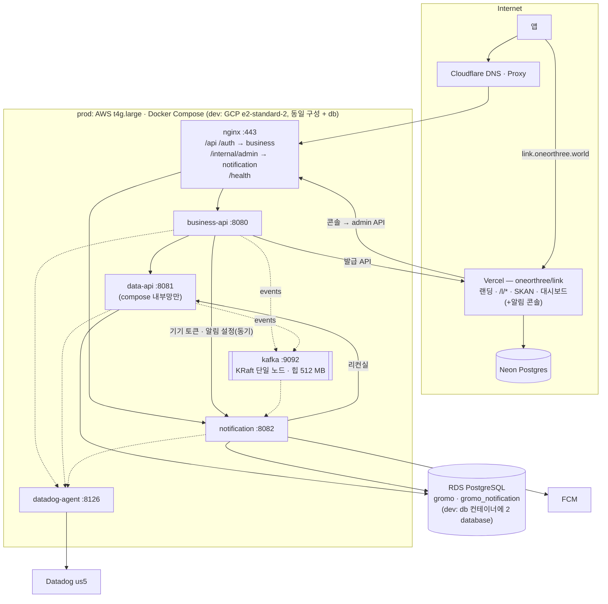

# gromo 시스템 아키텍처 (물리) — Target-1 · Target-2

> 정본(2026-09-10 승격). 논리 구도는 `service-architecture.md`, 결정은 `decisions.md` A1~A19.
> AS-IS 원본: 08-12 AS-IS 다이어그램(개인 보관).

## 1. 환경 실측 (2026-09-09)

| 환경 | 컴퓨트 | 현재 compose | DB | 관측 |
|---|---|---|---|---|
| **dev** | GCP `oneorthree2` / `gromo-dev-app` **e2-medium (2 vCPU · 4 GB)**, asia-northeast3-a. 러너 `gromo-dev-build` e2-custom-4-8192 | `app` · `db`(Postgres 컨테이너) + `datadog` 오버레이 | 컨테이너 Postgres | Datadog `gromo-back-dev`, 샘플 20% |
| **prod** | AWS **`gromo-prod` t4g.medium (2 vCPU · 4 GB, arm64, ap-northeast-2a)** → **Target-1 은 t4g.large(8 GB) 사이즈업(A14)** + Kafka 컨테이너(A12) | `app` · `nginx` · `datadog-agent` | **RDS `gromo-prod-db` db.t4g.micro (2 vCPU · 1 GB · 20 GB · single-AZ · PG 16.13)** — 알림 database 추가 시 db.t4g.small 검토 | Datadog `gromo-back-prod`, 샘플 20% |
| **link** | Vercel (Hobby → Pro 또는 Cloudflare, 링크 장부 미결) | — | Neon Postgres (무료) | Vercel 로그 (Datadog 밖) |

## 2. Target-1 배치



### 2.1 공인 노출면 (nginx)

| 경로 | 대상 | 인증 |
|---|---|---|
| `/api/v1/auth/**` — 소셜 로그인 6종 · 게스트 · refresh · logout | business-api | **없음 (pre-auth)** — AT 발급 **전**에 호출하는 경로다. 앱 현행 계약이 `/api/v1/auth/*` 이므로 Target-1 도 이 접두를 유지한다(경로를 `/auth/**` 로 옮기려면 배포된 앱이 있어 이관 절차가 따로 필요). 현 `JwtFilter` 화이트리스트 8종이 여기로 옮겨온다 |
| 그 외 `/api/v1/**` · `/bff/**` | business-api | JWT (Business API 서명 검증) |
| `/internal/admin/**` | notification | 서비스 토큰(콘솔 전용). Vercel egress IP 는 가변이라 IP 허용 목록 없음 |
| `/health` | business-api (각 서비스 헬스는 compose 내부) | 없음 |
| `/l/**` · `/.well-known/**` | **nginx 가 아니라 DNS** — `link.oneorthree.world` → Vercel | — |
| **`/l/match` · `/l/referrer` (이관 호환)** | nginx → **Vercel 프록시** — 배포된 앱이 `${API_URL}/l/match`(= `api.oneorthree.world`)로 부르고 있어(`deferredInvite.ts`) 이 경로를 지우면 설치 매치가 실패하고 3시간 어트리뷰션 창을 잃는다. **원본 IP 를 반드시 보존한다** — 매치는 클릭 때 저장한 `ip_hash`(SHA-256(ip+salt))와 대조하는데, 그냥 프록시하면 링크 서버엔 EC2 주소가 보여 **정상 설치도 `matched:false`** 가 된다. nginx 가 `X-Forwarded-For` 를 **덮어쓰고**(클라이언트가 위조한 값 무시) 프록시 전용 공유 시크릿 헤더를 함께 실으며, 링크 서버는 **그 시크릿이 있을 때만** XFF 첫 토큰을 신뢰한다(없으면 소켓 주소 사용) | 무인증(현행과 동일) + 프록시 시크릿 |
| 그 외 `/internal/**` | **차단** | — |

data-api 는 호스트 포트를 열지 않는다(compose 네트워크 내부만). notification 은 `/internal/admin/*` 만 nginx 를 통해 노출.

### 2.2 프로세스 · 포트 · 자원 (초기값)

| 서비스 | 포트 | JVM 힙(초기) | 비고 |
|---|---|---|---|
| business-api | 8080 | 512 MB | DB 없음, 커넥션 풀 없음. 패스스루 라우터 + BFF |
| data-api | 8081 | 1 GB | 현 app 그대로. 커넥션 풀 = Hikari 기본 10(prod 에 명시 설정 없음) |
| notification | 8082 | 512 MB | FCM 풀 · 크론 풀 6+ · 커넥션 풀 작게(≤5) |
| **kafka** (A12) | 9092 (compose 내부만) | **512 MB** + 페이지 캐시 | `apache/kafka` KRaft 단일 노드, retention 7일, **내부 토픽 복제 계수 1**(`OFFSETS_TOPIC_REPLICATION_FACTOR`·트랜잭션 사용 시 `TRANSACTION_STATE_LOG_*` 도 — 기본 3 이면 컨슈머 그룹 불가), 볼륨 필수(디스크 감시). 외부 미노출 — Vercel 은 붙지 않음 |
| nginx · datadog-agent | 443 · 8126 | — | 현행 |

힙 합계 2 GB 는 실사용으로 ≈1.3~1.5배(메타스페이스·스택·다이렉트 버퍼) = 2.6~3 GB 로 본다. dev e2-medium(4 GB)에 JVM 셋 **+ Kafka 512 MB** + Postgres + agent 는 **넘친다** — dev 는 `notification`·`business-api` 힙 256 MB, Kafka 384 MB 로 시작해도 여유가 거의 없어 **e2-standard-2(8 GB) 사이즈업을 전제**로 본다. prod 는 **A14 사이즈업(t4g.large 권장)** 전제 — 현 타입 실측 후 차이만 티켓에.

### 2.3 DB (A10)

- RDS 한 인스턴스에 database **2개**: `gromo`(data-api 유저) · `gromo_notification`(notification 유저). 서로의 database 에 권한 없음 → 교차 조인 물리적으로 불가.
- db.t4g.micro 의 `max_connections` ≈ **112**(`LEAST(메모리/9531392, 5000)`), 풀 합계 data-api 10 + notification ≤5 → 커넥션은 여유. 병목은 RAM 1 GB(shared_buffers 공유) — §8.
- Flyway 2벌: `server/data-api/.../db/migration/V*` · `server/notification/.../db/migration/N*`. CI 는 지금처럼 마이그레이션을 돌리지 않으므로(메모리: 엔티티↔DDL 드리프트는 dev 부팅에서만 터짐) **알림 서버 CI 에 Testcontainers + Flyway 부팅 테스트를 처음부터** 넣는다.
- 백업·파라미터·모니터링은 인스턴스 단위 그대로. Neon 은 링크 서버 소유(링크 장부).

### 2.4 시크릿 (A11 ⑥)

| 시크릿 | 보유 |
|---|---|
| `JWT_SECRET` | business-api **만** |
| `DB_URL/USER/PASS` (gromo) | data-api |
| `NOTI_DB_URL/USER/PASS` (gromo_notification) | notification |
| `FCM_SERVICE_ACCOUNT_JSON_BASE64` | notification **만** (data-api 에서 제거) |
| `SVC_TOKEN_BIZ_TO_DATA` · **`SVC_TOKEN_NOTI_TO_DATA`**(리컨실 — 서비스 전용 호출) · `SVC_TOKEN_TO_NOTI`(Business/Data → 알림: 이벤트·기기 토큰·설정 명령) · `SVC_TOKEN_CONSOLE_TO_NOTI` · `SVC_TOKEN_TO_LINK` | 발신·수신 양쪽 |
| 콘솔 비밀번호 4개(해시) | Vercel env (링크 레포) |
| `LINK_IP_SALT` · SKAN 키 | 링크 서버 (Vercel env) |

prod 는 Secrets Manager(`gromo/prod/env` JSON), dev 는 GCP 메타데이터/env — 현행 방식에 키만 추가.

## 3. CI/CD 표준 (A11)

```
레포 (A17 · 1695 개정)
  oneorthree/server         JVM 서비스 전부 — phone 개명
    services/data-api/  services/business-api/  services/notification/  services/chat/  services/file-upload/   (각각 CLAUDE.md)
    deploy/             docker-compose.<env>.yml · nginx · dev.yml/prod.yml 배포 매니페스트(자동 커밋)
    docs/               architecture(허브 원본) · prd · conventions
    loadtest/
  OneOrThree/app            앱 (미러 승격)
  oneorthree/link           링크 서버 (Vercel Git 연동, 이 파이프라인 밖)
  (docs 사이트 레포)         docs.oneorthree.world — 허브 페이지

server/.github/workflows/
  dev-ci.yml        paths 매트릭스: services/<name>/** 가 바뀐 서비스만 → be-check-style / be-test / be-spot-bugs → 이미지 <name>:<sha> push
                    ※ 공통 입력(settings.gradle · gradle wrapper · 공통 build script · .github/workflows/be-*.yml · deploy/) 이 바뀌면
                      매트릭스를 전 서비스로 fan-out — 서비스 폴더 밖 변경이 검증 없이 머지되거나 이미지에 반영되지 않는 걸 막는다
  dev-cd.yml        (workflow_call from ci + workflow_dispatch — 사람·CI 같은 버튼) 입력: service · digest · env → deploy/<env>.yml 갱신·커밋 → SSH/SSM: compose pull + up -d <service> → 헬스체크
  prod-ci.yml / prod-cd.yml / prod-rollback.yml   동일 구조, ECR, rollback = 서비스별 이미지 태그
  api-dog-generate  service 별 OpenAPI (business-api 가 앱 계약의 정본, data-api 는 /internal 문서)
```

- 변경된 서비스만 빌드·배포(경로 필터로 결정). compose 는 환경당 1파일 — **prod 6개**(JVM 서비스 3 + nginx · kafka · datadog-agent, DB 는 RDS), **dev 7개**(같은 6개 + Postgres `db` 컨테이너, §6·A10). 오버레이(datadog·observability) 유지.
- 헬스체크: `GET /health` 각 서비스, CD 는 변경된 서비스만 기다림(300s).
- 롤백: `prod-rollback.yml` 에 `service` 입력 추가 — **이전 digest 를 `deploy/<env>.yml` 매니페스트에 먼저 기록·커밋한 뒤 그 상태를 적용한다**(태그만 되돌리고 매니페스트를 두면, 다음 호스트 재구축이나 전체 `compose up` 이 매니페스트의 문제 digest 를 다시 배포해 롤백이 취소된다). compose·스키마는 유지(현행 원칙). **단 이 원칙은 스키마가 이전 바이너리와 호환될 때만 성립한다** — 이 레포엔 `V16__rename_refresh_token_to_hash.sql` 같은 rename 과 `DROP COLUMN` 이 실재해서, 그런 마이그레이션이 포함된 배포는 이미지를 되돌리면 이전 코드가 없는 컬럼을 읽어 기동·요청이 깨진다. 규칙: **① 롤백 가능 기간(직전 1 릴리즈) 동안은 파괴적 DDL 금지** — rename·drop 은 expand/contract 2단계로 나눈다(새 컬럼 추가 → 백필 → 읽기 전환 → **다음** 릴리즈에서 구 컬럼 제거). **② 파괴적 DDL 이 든 릴리즈는 롤백 대상이 아니다** — roll-forward(수정 배포)만 하고, PR 본문 「DB 변경」 절에 그 사실을 적는다.
- 링크 서버는 Vercel Git 연동(별도 레포) — 이 파이프라인 밖.

## 4. 관측

| 서비스 | `DD_SERVICE` | 계측 |
|---|---|---|
| business-api | `gromo-business-{env}` | APM(servlet · http.client → data-api 스팬) · 로그 |
| data-api | `gromo-data-{env}` | APM(servlet · postgresql · scheduled.call) · 로그 |
| notification | `gromo-notification-{env}` | APM(scheduled.call · http.client FCM) · **표준 잡 로그 + 메트릭 3종**(`notification.job.duration` · `delivery.count{kind,status}` · `reconcile.mismatch`) — 스팬 샘플 20% 에 기대지 않음 |
| link | — | Vercel 로그·Analytics (Datadog 밖, 링크 장부 대가 ④) |

대시보드 `mdh-sxt-jta`(백엔드 관측)에 `service` 템플릿 변수로 3 서비스 전환 + 알림 잡 패널 추가. 트레이스는 `X-Datadog-*` 헤더 전파로 business → data 한 트레이스.

## 5. 네트워크 · 보안 요약

- 외부 → nginx 443 만. data-api 무노출. notification 은 `/internal/admin` 만.
- 서비스 간 = compose 내부 DNS(`http://data-api:8081`). 사설망이라 TLS 없음(같은 호스트). Vercel → notification 만 인터넷 경유(HTTPS + 토큰).
- link 서버 → 코어 호출 없음(단방향) → 코어에 링크용 인바운드 없음.
- 앱 → link 는 `link.oneorthree.world` 직접(Cloudflare 밖, Vercel). **단 이관 기간 동안** 기존 배포본이 부르는 `api.oneorthree.world/l/match`·`/l/referrer` 를 nginx 가 Vercel 로 프록시한다 — 제거 조건: 새 호스트를 쓰는 앱 버전이 최소 지원 버전이 되고, 구 경로 호출이 7일 연속 0 일 때(Datadog 로 확인).

## 6. dev 전용 차이

- Cloudflare 없음(`oneorthree.dev.mooo.com` 직행) — **dev 에 nginx 가 있는지 미확인**(compose 엔 `app`·`db` 뿐, CD 헬스체크는 `localhost:8080`). Target-1 에서 dev 도 nginx 를 두어 경로 규칙을 prod 와 같게 한다(§2.1).
- DB 는 컨테이너 Postgres 에 database 2개. `docker-entrypoint-initdb.d` 는 **데이터 디렉터리가 비어 있을 때만** 돌고 dev 는 `postgres_dev_data` named volume 을 영속하므로, **기존 dev 호스트를 Target-1 로 올릴 때는 init 스크립트가 실행되지 않는다** — 배포 절차에 일회성 `CREATE DATABASE gromo_notification` + 유저·권한 생성(또는 매 기동 시 도는 멱등 초기화 잡)을 포함한다. 빠뜨리면 notification 이 DB 연결 단계에서 기동 실패.
- Datadog 오버레이는 현행(`docker-compose.datadog.yml`), 서비스 3개에 `-javaagent` 동일 주입.

## 7. Target-2 추가분

| 추가 | 배치 | 조건(수치) |
|---|---|---|
| MQ 관리형 승격 (MSK 등) | Target-1 은 EC2 위 Kafka 단일 노드(A12) | 브로커 다운으로 **30분 이상** 발송 지연이 **월 1회 이상**, 또는 디스크·업그레이드 수동 작업이 월 1회 이상 |
| Redis | prod ElastiCache(최소) / dev 컨테이너 | 리그 화면 **p95 > 1.5s** 또는 `findRankOf` **p95 > 500ms**(APM), 또는 Business API 2 인스턴스 필요(아래) |
| 알림 워커 분리 배포 | 같은 compose 에 `notification-worker` 서비스, 큐 소비만 | 팬아웃 잡 5분 초과 또는 대상 2,000명 초과 (알림 실측 §0) |
| 알림 DB 별도 인스턴스 | RDS 추가 | `gromo_notification` 이 RDS CPU **30% 이상** 지속 또는 커넥션 대기(`Hikari pending`) **> 0** 이 일 1회 이상 |
| Business API 다중 인스턴스 | compose replicas 또는 VM 추가 + nginx upstream | 앱 API **p95 > 1s** 가 일 3회 이상, 또는 CPU **70% 이상 10분** 지속 |

임계값은 **초기값**이다 — 첫 분기 실측 후 `decisions.md` 에 A 번호로 조정한다.

## 8. 열린 점

1. ~~prod 인스턴스 사양~~ → **실측 완료(09-10)**: EC2 t4g.medium → large 사이즈업(A14). RDS db.t4g.micro(1 GB) — 알림 database 동거 시 small 승격 여부는 커넥션 대기·freeable memory 실측 후.
2. **dev nginx 유무** — 호스트 nginx 인지 Cloudflare 직행인지 확인 후 §6 확정.
3. Vercel Pro vs Cloudflare(링크 장부 미결) — 알림 콘솔 편집자 수가 변수.
4. **GROMO-1660 재정의** — 티켓 본문 범위 4("클릭 적재를 MQ 비동기 경로로")가 링크 v3(Vercel·Neon 직접 적재, 단방향)와 어긋난다. (배포 정의 소유자는 A17 로 확정 — `oneorthree/server` 안, 레포 간 dispatch 없음)
5. **A18(보류)** — Kafka 발행 실패 정책(유실 수용 / 발행 실패 테이블 재발행 / HTTP 자동 폴백).

## 9. 08-12 AS-IS 대비 변경 요약

- 배포 단위 1(`app`) → **컨테이너 prod 6 / dev 7**(JVM 서비스 3 + nginx · kafka · datadog-agent, dev 는 + Postgres `db`) + 외부 1(link/Vercel). 레포 1 → 4 (A17: server · app · link · docs).
- DB 1 database → 같은 인스턴스 2 database + Neon.
- 노출면: `app:8080` 직접 → nginx 가 business/notification 만. data-api 내부화.
- 시크릿: JWT·FCM 이 각각 한 서비스로 이동.
- 관측: 서비스 3개 `DD_SERVICE`, 알림은 메트릭 직접 계측.
