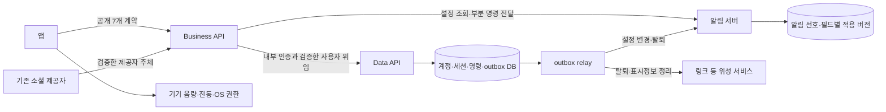
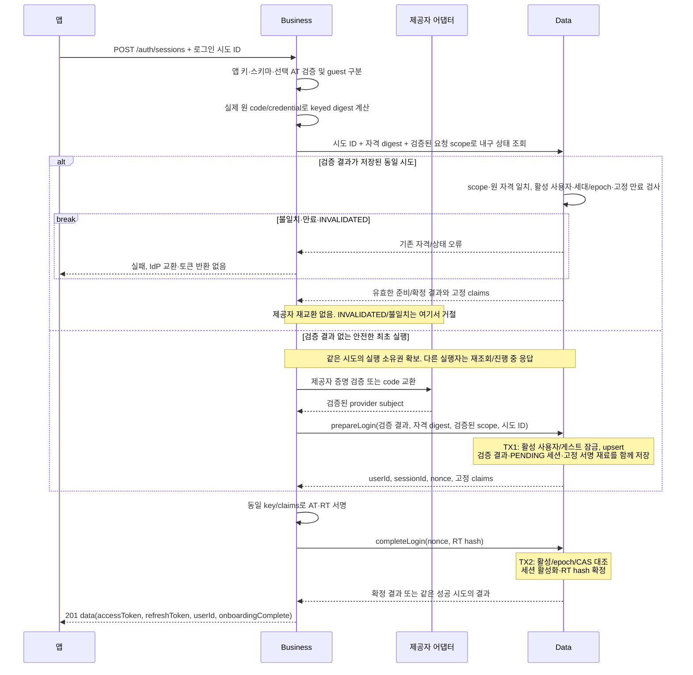
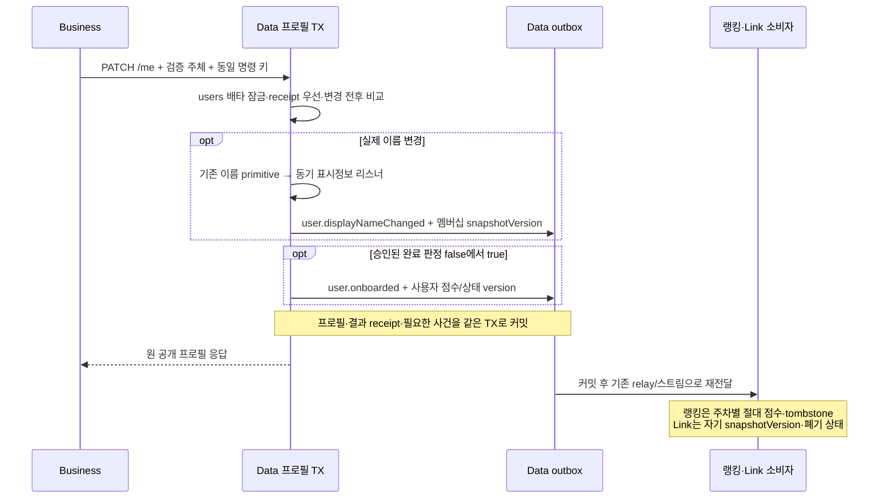
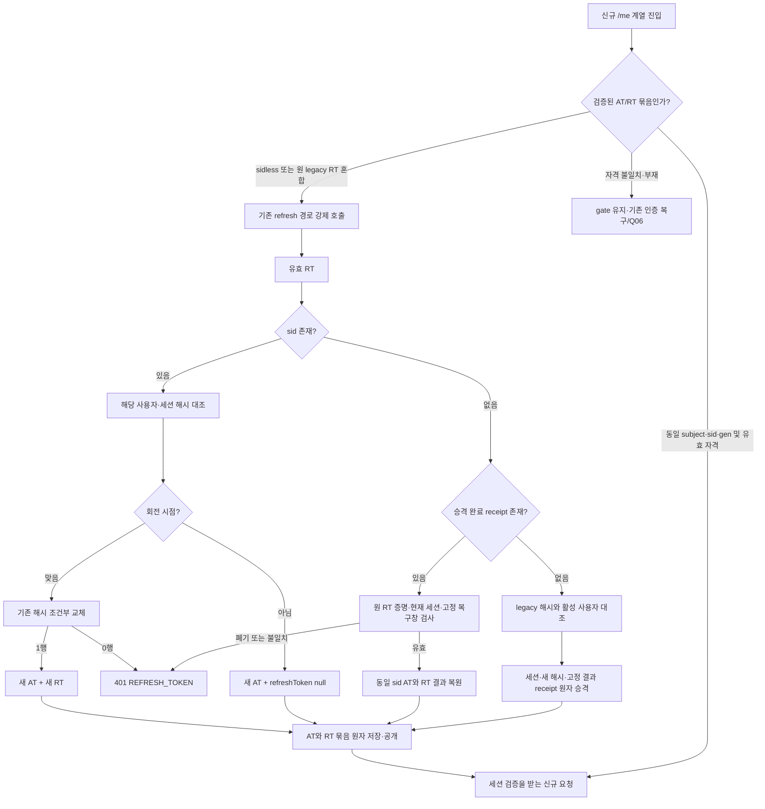
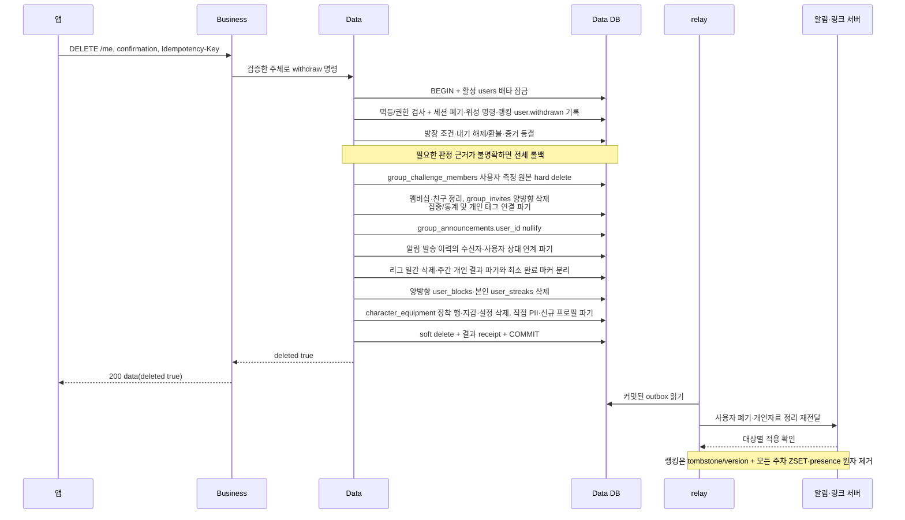
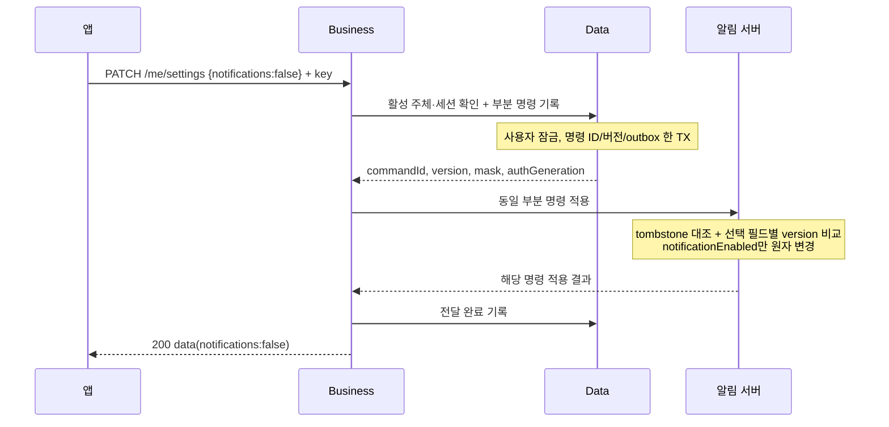

# 계정·설정 — HLD

GROMO-1756 · [정책](policy.md) · [상세 설계](low-level-design.md)

## 쉽게 보는 구조

Business는 입구에서 신분증을 확인하고 앱이 쓰는 모양으로 답한다. Data는 계정 장부와 세션 장부를 잠근 뒤 변경한다. 알림 서버는 알림 선호를 보관한다. 계정을 지울 때 장부를 여러 서버에 나눠서 조금씩 고치지 않는다. Data에서 함께 바뀌어야 하는 항목을 한 번에 확정하고, 다른 서버에 전달할 일도 같은 순간 outbox에 기록한다.

화살표는 통신/자료 흐름이지 DB 공유 권한이 아니다. Business에 계정 DB를 추가하지 않는다. 신규 `/me` 한 번의 조회는 Data의 계정 projection을 사용하며 섬·지갑·화면 집계를 여기 끼워 넣지 않는다. 화면 BFF 13개는 후반 배치의 책임이다.

## 현재 코드와 목표의 거리

| 영역 | 기준 main에서 확인한 것 | 미통합 1659 기반 | 1757이 연결/추가할 것 |
| --- | --- | --- | --- |
| 인증 | Data AuthService가 제공자 검증·사용자 생성·JWT 발급 | 내부 bootstrap/session 확인, auth session row | Business 검증/서명, 로그인 준비·확정, 공개 7개 경로 |
| RT | users의 단일 해시, 조건부 회전 | 세션 보조 행과 epoch, 기존 users 해시도 사용 | 세션별 정본 전환과 legacy 병행/승격·원 RT 증명의 결과 복구 receipt |
| 프로필 | nickname·기존 프로필, active user lock | 내부 사용자 위임/활성 검사 | name 매핑·catColor 저장·완료 판정 |
| 탈퇴 | 환불·익명화·PII 파기가 Data 단일 TX | 세션 폐기, authGeneration, 알림/링크 outbox | 새 프로필·로그인/명령 자료 파기 포함 |
| 설정 | Data의 기존 5필드 설정 | 알림 서버 정본 이관, Data outbox·직접 전달 | 1필드 공개 PATCH와 field mask·필드별 버전 |

1659 `AuthSessionService`의 존재만으로 계정 전체 이관이 완료됐다고 판단하지 않는다. 반대로 동일한 internal client, caller 인증, 위성 명령/outbox를 계정에서 다시 만들지도 않는다. 선행 공통 봉투·deadline·requestId 구현은 1751~1753 및 1659 통합에 의존한다.

## 로그인: 잠깐 준비하고, 서명 뒤 확정

유효한 선택 AT가 guest=false이면 기존 계정 전환을 허용하고 제공자 계정으로 로그인/가입한다. 이를 게스트 증명 실패로 거부하거나 두 소셜 계정을 합치지 않는다. guest=true일 때만 기존 승격 대상과 userId 보존 규칙을 적용한다. 제공자 자격 실패는 기존 6개 제공자별 *_TOKEN401을 유지하며 UNAUTHORIZED로 뭉개지 않는다.

제공자 네트워크 호출은 Data TX 밖이다. 모든 요청은 실제 원 code/credential을 제시하고 Business가 digest를 계산해 내구 시도를 먼저 조회한다. 앱이 보낸 digest나 provider subject만으로 재생하지 않는다. TX1 이후 Business가 죽으면 같은 시도 ID와 같은 자격 증명으로 준비 결과를 되찾아 재개하며, 이미 소비된 일회성 code를 다시 교환하지 않는다. 성공했는데 응답만 잃었으면 고정 claims로 같은 토큰을 복원한다. Data에는 원문 토큰 대신 해시·서명 재료만 남긴다. 재개는 원래 제공자 자격의 digest와 시도 범위가 일치해야 하며 시도 ID 하나만 알아서 토큰을 얻을 수 없다. 제공자 검증 성공 직후 TX1 저장 전에 죽으면 그 검증 결과는 내구화되지 않았으므로 이 복구로 재생할 수 없다. 교환 결과가 불명확한 실행을 안전한 최초 시도로 돌려 code를 무조건 다시 쓰지 않는다. 제공자의 검증된 복구 수단이 없으면 새 제공자 자격과 새 시도로 재인증해야 하며, guest 복구·Q06 정책을 임의 대체하지 않는다. [LLD의 재개 순서와 장애 경계](low-level-design.md#제공자-교환-전에-내구-시도를-조회한다)를 따른다.

탈퇴·세션 폐기가 먼저 확정됐으면 성공 시도라도 토큰을 다시 발급하지 않는다. 로그인 결과가 불명확하다고 매번 새 시도를 만들면 세션이 늘고 게스트 승격 경쟁이 생기므로 앱은 먼저 같은 시도를 재개한다. 로그인 CAS의 단순 경쟁 패배는 REPREPARE_REQUIRED로 분리하고 같은 attempt/자격으로 새 generation/nonce·고정 재료를 한 번 준비한다. 동시에 재개해도 같은 새 준비를 받고, 이전 nonce의 지연 완료는 거부한다. 탈퇴·epoch 폐기나 복구 창 종료는 INVALIDATED이며 재준비하지 않는다. [LLD 상태 전이](low-level-design.md#로그인-cas-충돌의-재준비-전이)를 따른다. 이는 refresh CAS 경쟁에서 진 요청을 성공 처리하는 규칙이 아니다.

## 프로필: 상태와 전달할 사실을 같이 저장

새 PATCH는 활성 users를 배타 잠그고 완료 receipt를 먼저 확인한다. 새 실행만 기존 name 변경 primitive에 위임하고 catColor를 적용한 뒤 Q03/Q04의 승인된 동일 판정으로 완료 전이를 비교한다. false→true이면 `user.onboarded`, 실제 이름 변경이면 기존 동기 리스너를 통한 `user.displayNameChanged`가 필요하다. 프로필·전이·receipt·outbox가 같은 Data TX이므로 하나라도 저장에 실패하면 모두 rollback한다. 동일 키 재생·무변경은 전이/사건을 다시 만들지 않는다.

표시정보 writer는 미통합 선행에 있으므로 새 PATCH에 연결해 재사용하며 별도 이중 outbox를 만들지 않는다. `user.onboarded` 생산자와 랭킹 소비자는 후속 통합 의무다. 두 version 축은 비교하지 않는다. 이 흐름은 기존 아키텍처 ㊣/㋡의 내부 상태 계약이고 섬 STOMP 14종이나 공개 API 66종을 추가한 것이 아니다. Q03/Q04 판정 및 원자 저장·중복/역순/탈퇴 회귀 전 새 경로를 활성화하지 않는다. [LLD 원자 경계와 실제 선행 코드](low-level-design.md#프로필-변경과-기존-상태-사건의-원자-경계)를 따른다.

## RT 전환과 로그아웃

현재 앱 `getFreshAccessToken`은 만료가 남은 AT를 바로 반환하므로 서버의 legacy RT 승격만으로 새 `/me` 진입이 보장되지 않는다. 새 앱은 이 빠른 반환 전에 AT/RT의 타입·subject·sid·authGeneration 및 만료를 함께 검사하는 전환 gate를 둔다. AT만 sid가 있어도 원 legacy RT가 남은 구 앱 혼합 저장은 Ready가 아니다. AT 만료를 기다리지 않고 원 RT 승격 receipt를 복구하고 기존 sid AT와 복구 결과의 주체·세션·세대를 대조한다. 기존 `/api/v1/auth/refresh`를 single-flight로 호출하고 로그인/로그아웃 generation을 대조한 뒤, AT/RT를 하나의 커밋된 인증 묶음으로 원자 저장·공개해야 gate가 열린다. 현행 두 번의 `AsyncStorage.setItem`은 이 원자성을 보장하지 않는다. 강제 승격에서는 새 sid AT와 sid RT가 모두 필요하며 클라이언트가 sid를 만들어 붙이지 않는다. 응답 유실·저장 실패 시 부분 토큰으로 진행하지 않고 같은 원 legacy RT로 승격 전용 receipt의 동일 AT/RT를 복원한다. 이 receipt는 현재 main/조사한1659에 없는 구현 의존이다. 현재 세션·epoch/gen·새 RT hash·원 RT 및 고정 토큰 만료·복구창이 모두 유효해야 재생하며, 소비된 bootstrap은 되살리지 않는다. 복구창 밖의 소셜 계정은 제공자 재인증이 가능하지만 제공자 없는 게스트의 대체 복구는 승인되지 않았다. Q06 결정과 서버 복구 검증 전에 강제 승격을 출시하지 않는다. [상세 진입 gate](low-level-design.md#유효한-sidless-at를-가진-기존-앱-설치의-진입-gate)를 따른다.

기기 A와 B는 서로 다른 sessionId를 가진다. B 로그인은 A 세션의 RT를 교체하지 않는다. sid 없는 legacy RT를 이름만 바꿔 폐기하지 않고, 기존 토큰의 최대 유효 수명과 실제 만료 시각을 기준으로 호환 창을 닫는다. prod/dev의 AT TTL이 다르므로 임의의 1시간을 전체 환경 공통 전제로 삼지 않는다.

`DELETE /auth/sessions/current`는 정확한 경로·메서드만 AT 필수 검사에서 제외하고 RT 전용 검증으로 인증한다. `X-Refresh-Token`은 필수이며 AT를 보냈다면 유효하고 같은 세션이어야 한다. 만료된 AT를 아예 보내지 않고 유효 RT만으로 종료할 수 있다. Data 한 TX에서 해당 세션과 bootstrap만 폐기한다. RT에는 대상 FCM 토큰/소유권 값이 없어 기기 삭제 outbox를 여기서 만들지 않는다. 잘못된 RT는 기존 401 REFRESH_TOKEN을 유지한다. 응답을 잃고 같은 RT를 다시 보낸 경우, 아직 유효한 원 RT의 폐기 증명 해시가 일치하고 사용자도 활성일 때만 200을 재생한다.

기기 등록 삭제는 별도 `DELETE /api/v1/users/me/device-token`이 `X-Device-Token`·`X-Device-Ownership`을 받아 처리한다(장부 ㊲·㊨·㊪). 새 앱은 큐 생성 시 대상과 고정 `Idempotency-Key`를 함께 저장한다. Data outbox 생성은 `K:device-delete-outbox`, 알림 직접 전달과 relay는 동일 `K:device-delete`를 사용한다. 원 사용자·명령 scope·fingerprint 검증 후 완료된 같은 키를 과거 ownership 거절보다 먼저 재생한다. 성공 후 바뀐 ownership으로 원 삭제가 실패하지 않으며 새 등록을 다시 삭제하지 않는다. 기존 클라이언트의 키 생략 호환과 이 새 앱의 필수 키 계약은 구분한다. 앱은 기기 자격·원 사용자·고정 키를 내구 큐에 보존하고 DELETE를 시도하되, 실패해도 원 세션 RT 폐기와 로컬 인증 정리를 독립적으로 계속한다. 미완료 큐는 보존하며 logout 200을 기기 삭제 성공으로 간주하지 않는다. 세션 폐기 뒤 재전송 인증 복구는 미결 gate이고, 이를 이유로 로그아웃 자체를 대기시키지 않는다. 비동기 도중 새 로그인이 시작되면 기존 generation 검사로 새 세션을 보존한다. 사용자 전체 등록을 지우지 않고 대상 토큰의 ownership을 대조해 다른 기기와 재등록을 보존한다.

## 탈퇴: 중앙 원자 처리와 위성 정리

기존 `freezeEvidenceForAccountErasure`는 달성 결과를 참가 행에 확정하지만 판정 target이 없으면 건너뛴다. 이 skip을 파기 준비 완료로 취급하지 않는다. OPEN 내기의 필요한 판정 근거가 확정되었는지 검증한 다음 원본 `group_challenge_members`를 삭제한다. 해당 `user_id`는 NOT NULL FK라 nullify할 수 없다. 최소 정산 결과는 별도 참가 행에 남으며 측정 이력이나 프로필로 공개하지 않는다. 측정 보고의 users 공유 잠금과 탈퇴의 배타 잠금으로 삭제 후 재생성도 차단한다. 새 검증/삭제는 후속 구현 사항이다.

차단 관계는 blocker/blocked 어느 쪽이 탈퇴자여도 삭제하고 본인의 user_streaks 행도 hard delete한다. 현재 차단 생성 서비스는 없지만 후속 writer는 두 활성 users를 UUID 오름차순으로 공유 잠근 뒤 관계를 기록해야 한다. 스트릭의 현 writer인 FocusService 완료 TX는 users 공유 잠금을 사용하며 독립 writer도 같은 규칙을 적용한다. UserStreakService가 받은 오래된 User 객체만으로 파기 후 재생성할 수 없게 한다. 현 탈퇴 코드에는 이 두 삭제가 없어 후속 구현과 동시성 검증이 필요하다.

공지 생성은 users 공유 잠금, 탈퇴는 같은 users 배타 잠금을 먼저 사용한다. 생성 선행이면 새 공지도 nullify하고 탈퇴 선행이면 생성은 404 `USER_NOT_FOUND`로 거부한다. 공지 내용은 기존 보존 규칙을 유지한다.

방장 위임 조건 실패나 환불·outbox 기록 실패는 중앙 TX 전체를 롤백한다. 지갑을 먼저 삭제해서 내기 환불 경로를 끊지 않는다. 위성 전송 실패는 이미 확정된 중앙 탈퇴를 되돌리지 않고 대상별 미전달 상태로 남긴다. 그러므로 200은 중앙 계정 폐기 완료이며, 모든 위성의 물리 파기가 같은 순간 끝났다는 뜻은 아니다. 지연 요청은 각 위성의 generation/epoch tombstone으로 차단한다.

## 설정: 한 필드만 바꾸기

알림 서버가 아직 적용하지 못하면 outbox에 넣었다는 이유만으로 성공을 반환하지 않는다. 동일 키 재시도는 같은 명령을 재전달한다. 완료 표시만 실패했으면 relay 재전달이 멱등 처리된다. 이미 적용된 false 명령의 재시도 뒤 최신 설정이 true로 바뀌었어도 원 명령의 결과는 false이며 현재 상태는 별도 GET으로 읽는다. 버전은 모든 설정 필드에 공통 순서를 부여하되 적용 여부는 선택 필드마다 비교한다.

## 관측과 구현 순서

로그에는 requestId, route, 안전한 error code, commandId, 단계, 처리 시간, 재시도 횟수, outbox 대상별 상태를 남긴다. Authorization, X-Refresh-Token, 제공자 자격, 이름·색상·동의 본문, RT 해시·서명 재료·bootstrap nonce는 기록하지 않는다. 본문 전체와 내부 오류 원문을 무차별로 로깅하지 않는다.

1. 1659 및 공통 계약 통합 상태를 대조하고 중복 엔드포인트/저장소를 막는다.
2. Q03~Q06 입력을 연결하며 catColor·온보딩·약관 스키마와 세션 expand migration을 준비한다.
3. 로그인 준비/확정·RT 세션 전환 및 최초 legacy 승격 결과 복구 서버를 먼저 구현한다. 응답 유실·앱 crash·폐기 경쟁·게스트 복구창 경계를 검증한 뒤 앱 sidless 진입 gate·인증 묶음 원자 저장을 연결한다.
4. 프로필·동기 활성 조회·logout을 연결하고 탈퇴 전수 파기와 경쟁을 검증한다.
5. 알림 부분 명령·field mask·필드별 version을 양쪽 서비스에 연결한다.
6. 앱 계약 7종과 legacy 호환을 함께 검증한 뒤 세션 정본을 전환한다. legacy 읽기 제거는 호환 창 종료 후 별도 단계다.

리그 개인 이력 파기와 최소 완료 마커 보존은 중복 정산 방지와 함께 검증한다. 랭킹 user.withdrawn outbox도 중앙 탈퇴와 같은 TX이며, 모든 주차 ZSET/presence와 지연·DLT 재생의 차단은 [LLD의 리그 파기 경계](low-level-design.md#리그-이력랭킹-투영-파기)를 따른다. 현재 main에서 완료됐다고 주장하지 않는다.

태그 생성뿐 아니라 updateFocusTag의 새 채택/과거 세션 재연결과 복원·관리 writer도 활성 users 공유 잠금을 먼저 확보한다. 탈퇴 배타 잠금 아래의 태그 연결 파기·character_equipment hard delete와 같은 순서로 직렬화한다. 기존 EquipmentService의 equip/unequip 공유 잠금은 유지하고 user_items 보유 증거는 장착 설정과 구분해 보존한다. 실제 양방향 경합·늦은 flush·rollback 검증 전 전수 파기 완료로 표시하지 않는다.
