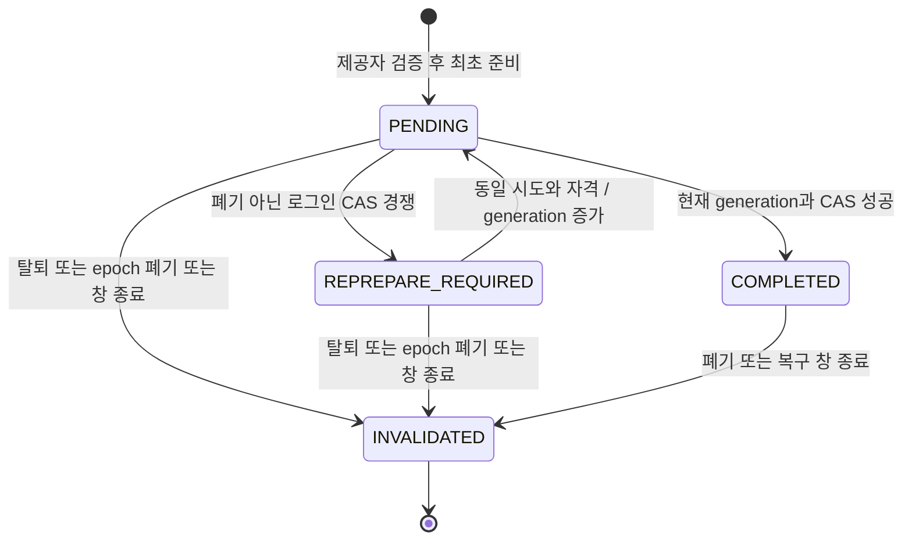

# 계정·설정 — LLD

GROMO-1756 · [정책](policy.md) · [HLD](high-level-design.md) · [원본 예시 7개](source-contracts.json)

## 1. 적용 범위와 공통 규칙

이 문서는 목표 계약이다. 조사 기준 main `529a396e5f0f88cb78c172110920e1fa6b9388a9`의 구현과 미통합 1659 기반을 분리한다. 1750 공통 계약은 선행 PR 의존이며 현재 브랜치에 없는 파일의 상대 링크를 만들지 않는다. 1757의 구현 완료·배포를 이 문서로 대신하지 않는다.

| 항목 | 규칙 |
| --- | --- |
| 경로 | 정확한 7개 method/path만 추가. `/v1`·`/api/v1` 없음. 기존 Data/chat 경로 보존 |
| 앱 자격 | 선행 1750 앱 키 검사. 외부 `X-User-Id`·내부 caller 헤더는 폐기한 뒤 검증한 주체로 새 내부 요청 생성 |
| 사용자 자격 | 일반 5개 `/me` 계열은 유효 AT와 동기 사용자·세션 활성 검사. 로그인은 제공자 자격, logout은 RT 전용 검사 |
| 성공 | 로그인 201, 나머지 200. `Content-Type: application/json`, `{ "data": ... }`만 한 번 적용 |
| 오류 | `{ "error": { "code": "...", "message": "...", "field": null, "retryable": false }, "requestId": "현재 요청 ID" }` |
| 캐시 | 토큰·개인 계정·설정 응답은 `Cache-Control: no-store`. 공용 캐시 금지 |
| 명령 키 | PATCH `/me`, DELETE `/me`, PATCH `/me/settings`에 필수 `Idempotency-Key` 하이픈 포함 36자 UUID(생성은 v4/v7 권고, 버전 비트로 수락을 제한하지 않음). 로그인에는 별도 `X-Login-Attempt-Id`, logout에는 범용 receipt 없음 |
| fingerprint | 검증된 주체 + HTTP method + 정규화한 작업/자원 문맥 + 키, 정규화한 요청 본문 digest. 현재 DB 상태는 digest에 넣지 않음 |
| 낙관 버전 | 원본 계정 7개는 `expectedVersion`이 없다. 필수 필드로 임의 추가하지 않고 Data 잠금과 명령 멱등으로 보호 |
| 생략/null | 요청의 생략은 미변경, 명시 null은 허용한 응답 필드를 제외하면 오류. JSON의 알 수 없는 요청 필드는 400으로 거부 |

범용 receipt는 이미 수락/확정한 키에 다른 본문이 오면 409를 반환한다. 실행 전 검증 실패로 receipt가 확정되지 않은 요청은 결과 재생 보장 밖이다. 수정한 사용자 의도에는 새 키를 쓴다. 같은 성공 명령은 최초 상태 코드와 비즈니스 결과를 재생하며 requestId는 현재 요청 값이다. 탈퇴 뒤에는 범용 재생보다 폐기된 주체 차단이 우선한다.

## 2. 공개 계약 7개

### 2.1 POST /auth/sessions

필수 `X-Login-Attempt-Id: <하이픈 포함 36자 UUID>`는 앱이 시도 시작 시 한 번 생성한다(v4/v7 생성 권고이며 다른 UUID 버전을 거부하지 않음). 외부 AT는 선택 사항이며 제공했다면 유효 access 타입의 서명·만료·주체와 Data의 현재 사용자·세션 활성/세대를 검증한다. 서명 검증만으로 승격 권한을 인정하지 않으며 [선택 AT의 세션 폐기 관문](#선택-at의-세션-폐기-관문)을 prepare·complete·결과 재생에 공통 적용한다. 유효한 guest=false AT도 정상 계정 전환으로 허용하고 게스트 승격 대상에서만 제외한다. 이 경우 제공자 증명이 가리키는 기존 계정 로그인/정상 신규 가입을 계속하며, 현재 비게스트 계정과 대상 계정을 합치지 않는다. guest=true는 기존 활성 게스트/이미 승격된 주체 판정 규칙으로 처리한다. 잘못된 AT를 익명 로그인으로 조용히 강등하지 않는다. 기존 legacy 경로의 선택 AT 동작은 별도 보존한다.

| 요청 필드 | 타입·규칙 |
| --- | --- |
| provider | 소문자 enum `apple`, `google`, `kakao`, `line`, `instagram`, `facebook`. 기존 지원 집합 보존 |
| authorizationCode | 비어 있지 않은 제공자 코드. `credential`과 정확히 하나. 실제 code 교환 어댑터를 거침 |
| credential | 기존 자격 호환을 위한 명시적 확장 `{type, value}`. `type`은 아래 제공자별 허용값, value는 비어 있지 않은 문자열 |
| termsVersion | 필수 문자열. 배포된 약관 버전 카탈로그의 실제 문서에 대응해야 함. Q05 미입력 상태에서 예시 날짜로 자동 허용하지 않음 |

원본 요청은 그대로 지원할 목표다. 단, 현재 Apple 코드의 `authorizationCode` 필드는 실사용되지 않고 `identityToken`만 검증한다. code를 기존 JWT 검증 함수의 token 인자에 넣는 것은 구현이 아니다. 신규 어댑터는 서버에 등록한 client/redirect 설정과 제공자의 검증 결과를 대조하고, 요청의 임의 URL이나 제공자가 다른 token을 신뢰하지 않는다. 원본의 code-only 형태를 구현하려면 실제 교환 설정과 검증을 연결해야 하며 미연결 상태에서 지원 완료로 표시하지 않는다.

| provider | 유지하는 기존 검증 자격 | 새로운 code 경로와의 경계 |
| --- | --- | --- |
| apple | `credential.type=id_token` → 기존 identityToken 검증 어댑터 | authorizationCode 교환 뒤 제공자 주체 검증 추가 필요 |
| google | `credential.type=id_token` → 기존 Google ID token 어댑터 | 새 Google 기능 확대를 요구하지 않음. 기존 검증 경로를 먼저 보존 |
| facebook | `credential.type=id_token` → 기존 Facebook JWT 어댑터 | 기존 제한/설정 보존 |
| kakao, line, instagram | `credential.type=access_token` → 기존 사용자 정보 검증 어댑터 | token 문자열을 우리 AT/RT로 해석하지 않음 |

지원 집합 밖의 provider 문자열 또는 해당 provider 어댑터 미구성은 기존 400 `UNSUPPORTED_PROVIDER`, field=`provider`로 거절한다. provider 누락/타입 오류는400 INVALID_REQUEST와 구분한다. 각 제공자의 code 경로는 구현·설정된 capability만 허용한다. 제공자 자체를 없애는 대신 기존 credential 경로를 유지한다. 미지원 credential 조합은 422, 제공자 자격 검증 실패는 해당 제공자의 기존 401 *_TOKEN 코드다. 우리 AT 검증 실패의 UNAUTHORIZED와 합치지 않는다. 타입 혼합·두 자격 동시 제출은 400이다. 신규 guest 생성은 이 7개에 추가하지 않으며 기존 `/api/v1/auth/guest`의 userId 보존과 세션 전환을 함께 검증한다.

201 응답은 정확히 다음 4필드다. 실제 userId는 UUID이고 원본 예시의 `me`는 placeholder다.

```json
{"data":{"accessToken":"access-token","refreshToken":"refresh-token","userId":"01991930-0000-7000-8000-000000000001","onboardingComplete":false}}
```

토큰은 null이 아니다. 이 응답에 `isNewUser`, raw provider subject, internal nonce, sessionEpoch를 임의로 노출하지 않는다. 기존 `deviceBootstrap` 전달은 신규 응답의 `X-Device-Bootstrap` 헤더로 보존한다(기술 결정). 앱은 이 값을 기존 기기 등록 DTO의 deviceBootstrap으로 전달한다. 본문 4필드는 유지하며 헤더도 자격이므로 저장소/로그/공용 캐시에 노출하지 않는다. 기존 legacy 로그인의 body 전달 방식은 보존한다.

### 2.2 GET /me

요청 본문 없음. 활성 계정 projection 한 번으로 아래 필드를 읽는다.

| 응답 필드 | 타입·규칙 |
| --- | --- |
| id | 사용자 UUID 문자열 |
| name | 문자열 또는 null. 기존 nickname이 미설정이면 null |
| catColor | 승인된 자산 ID 문자열 또는 null. Q03 확정 전 임의 기본색을 backfill하지 않음 |
| linkedProviders | 활성 소셜 연동의 소문자 provider 배열. 중복 제거·문자열 오름차순, 게스트면 빈 배열 |
| onboardingComplete | boolean. Q04 판정 함수를 하나로 공유하고 로그인 응답에도 사용 |

name/catColor null 허용은 온보딩 전 상태를 표현하기 위한 원본 예시 대비 명시적 보완이다. Q03/Q04 확정 후 legacy 초기 상태도 이 함수로 검증한다. 소프트 해제된 social account는 linkedProviders에 포함하지 않는다.

```json
{"data":{"id":"01991930-0000-7000-8000-000000000001","name":"수빈","catColor":"black","linkedProviders":["apple"],"onboardingComplete":true}}
```

### 2.3 PATCH /me

요청 `{ "name": "수빈", "catColor": "calico" }`. 두 필드 중 하나 이상 필수이고 생략한 필드는 보존한다. null·빈 객체는 400이다. name은 기존 nickname의 trim/2~10 UTF-16 단위/중복 정책을 사용한다. 자체 신규 정규화나 대소문자 접기를 추가하지 않는다. catColor는 Q03 카탈로그의 허용 ID만 저장하며 문자열을 이미지 URL·파일 경로로 해석하지 않는다.

활성 사용자 배타 잠금 → 기존 멱등 결과 확인 → 변경 전 완료 상태 판정 → name 검증/유일 제약과 기존 표시정보 writer 위임 → catColor 적용 → 변경 후 완료 상태 판정 → 필요한 전이 사건과 결과/receipt를 같은 Data TX에 기록하는 순서다. name 검증 실패나 사건/outbox 저장 실패 시 프로필·완료 전이·receipt·사건 모두 rollback하며 부분 성공은 없다. 현재 User 엔티티는 전체 컬럼 UPDATE이므로 공유 잠금 뒤 승급하거나 잠금 전에 읽은 엔티티를 저장하지 않는다.

200은 변경 후 `{id,name,catColor}` 3필드다. `onboardingComplete`는 이 응답에 추가하지 않고 필요하면 GET `/me`로 확인한다. 전체 사용자 엔티티·RT 해시·countryCode 등을 직렬화하지 않는다.

#### 프로필 변경과 기존 상태 사건의 원자 경계

- **완료 전이:** Q03/Q04로 승인된 동일 판정 함수를 잠금 안의 변경 전·후에 적용한다. `onboardingComplete`가 false→true일 때만 기존 [아키텍처 ㊣](../../architecture/decisions.md)의 `user.onboarded`를 프로필 변경·receipt와 같은 Data TX의 outbox에 기록한다. 미결 판정식을 “이름이 있으면 완료” 등의 기본값으로 확정하지 않는다. GET/로그인 응답과 PATCH가 다른 완료 함수를 사용하지 않는다. 같은 키 완료 재생, 무변경 및 이미 true→true인 수정에서는 이 전이 사건을 다시 만들지 않는다.
- **랭킹 전달:** `user.onboarded`는 기존 `score-events`의 적격성 상태 계약이다. 점수·다른 상태 전이와 같은 사용자 단조 version 경계를 사용하고, 소비자는 현재 적격성/탈퇴 tombstone을 확인해 DB 정본의 주차별 절대 점수를 재적재한다. 온보딩 전에 쌓인 점수를 0으로 초기화하거나 delta를 더하지 않는다. 중복·역순·DLT 재전달에서 낮은 version이 새 상태를 되돌리거나 탈퇴자를 되살리지 못한다. [기존 랭킹 계약](../../architecture/service-architecture.md)을 따르며 새 섬 랭킹의 분모·직군·보상 정책을 여기서 결정하지 않는다. 이 producer/소비자 통합은 기준 main의 완료 구현이 아니다.
- **이름 전이:** 정규화된 실제 name이 바뀌면 기존 사용자 표시정보 변경 경로를 사용한다. 선행 [UserService.changeNickname](https://github.com/OneOrThree/phone/blob/6a9ddd1367a3d5d3d5cc940b57faa8addd9d9b64/server/data-api/src/main/java/com/oneorthree/phone/user/service/UserService.java#L228)이 `UserDisplayNameChangedEvent`를 발행하고, [동기 리스너](https://github.com/OneOrThree/phone/blob/6a9ddd1367a3d5d3d5cc940b57faa8addd9d9b64/server/data-api/src/main/java/com/oneorthree/phone/group/listener/LinkDisplayNameChangeListener.java#L29)가 [recordDisplayNameChanged](https://github.com/OneOrThree/phone/blob/6a9ddd1367a3d5d3d5cc940b57faa8addd9d9b64/server/data-api/src/main/java/com/oneorthree/phone/group/service/LinkMembershipEventService.java#L291)에 위임한다. `MANDATORY` TX 안에서 활성 `(groupId,userId)` 멤버십의 `snapshotVersion`을 전진시키고 `user.displayNameChanged`/`link.displayNameChanged` outbox를 만든다. 기준 main에는 이 선행 경로가 없으며 새 PATCH가 이미 연결됐다고 주장하지 않는다. 현재 private 이름 변경 primitive를 새 진입점과 공유할 수 있도록 연결하되 기존 legacy writer 동작과 의존 방향을 보존하고 신규 caller가 표시정보 outbox를 이중 append하지 않는다. 새 PATCH에서 name 생략·정규화 후 무변경·확정 receipt 재생은 이름 writer를 다시 실행하지 않는다.
- **링크 적용:** 기존 [㋡](../../architecture/decisions.md)에 따라 커밋 후 relay가 새 표시정보를 전달한다. Link는 같은 멤버십 snapshot 축의 version과 폐기 상태를 대조해 이미 공유된 slug의 표시를 갱신하며 낮은 version·중복·탈퇴 후 지연 전달이 옛 이름/링크를 부활시키지 않는다. `user.onboarded`의 사용자 점수 축과 링크 `snapshotVersion`을 서로 비교하지 않는다. Data TX 안에서 Link HTTP를 기다리거나 AFTER_COMMIT/fire-and-forget만으로 내구 기록을 대체하지 않는다.

프로필 한 번이 두 전이를 모두 만들면 필요한 두 사건을 같은 TX에 담는다. 현재 사용자 인가와 기존 users→멤버십→aggregate 잠금 순서를 지켜 legacy 이름 writer·탈퇴와의 경합을 검증한다. 온보딩 판정·생산자 연결·동일 TX rollback/중복 회귀 전 새 PATCH를 활성화하지 않고, Redis 랭킹/Link snapshot 소비 경로도 각 version·재전달 회귀를 통과하기 전 활성화하지 않는다. 기존 DB 조회와 선행 구현, 목표 소비자 계약을 구분한다. 이 두 사건은 기존 내부 랭킹/링크 계약이며 신규 공개 API 66종이나 섬 STOMP 14종의 개수를 늘리지 않는다. 공개 PATCH 응답 `{id,name,catColor}`도 유지한다.

### 2.4 DELETE /auth/sessions/current

요청 본문 없음. 필수 헤더 `X-Refresh-Token: <우리 RT>`. Authorization AT는 생략할 수 있으나 제공하면 서명·타입·만료 및 RT와의 사용자/세션 일치가 필수다. 만료 AT를 실어 보내면 401이므로 앱은 RT만으로 로그아웃할 수 있다. 보안 예외는 이 method/path 하나에만 적용하고 `/auth/**` 전체를 공개하지 않는다.

1. RT 타입·서명·만료를 검증하고 sid 또는 legacy RT 해시로 정확한 사용자/세션을 찾는다.
2. 활성 사용자와 세션 행을 잠근다. 활성 상태라면 현재 저장된 RT 해시 일치를 요구한다. 회전 전의 옛 RT로 새 세션을 종료할 수 없다.
3. 해당 세션 RT를 폐기하고 sessionEpoch를 전진시킨다. 해당 세션 bootstrap도 같은 TX에서 폐기한다. 이 RT 전용 요청은 대상 FCM 토큰/ownershipToken을 받지 않으므로 기기 삭제 outbox를 생성하지 않는다. 사용자 authGeneration은 증가시키지 않는다.
4. 응답 유실 복구용 폐기 증명에는 실제로 폐기한 RT의 해시와 원 만료 시각만 둔다. 같은 서명/만료 검증을 통과한 RT가 정확히 그 해시와 맞고 사용자가 활성이라면 200을 재생한다. 임의의 유효 JWT나 이미 회전한 옛 해시에는 적용하지 않는다.
5. 처음/동일 완료 재시도 모두 `{ "data": { "revoked": true } }`. 재생은 sessionEpoch를 다시 증가시키거나 bootstrap을 다시 발급하지 않는다. 이미 탈퇴한 사용자면 404 `USER_NOT_FOUND`이며 만료·위조·타입/해시 불일치 RT는 기존 401 `REFRESH_TOKEN`이다.

legacy sid 없는 RT는 백필한 legacy 세션 축으로 대조한다. AT에도 sid가 없으면 검증된 같은 사용자와 해당 legacy 해시의 관계를 대조한다. RT에 sid가 없어도 검증된 RT의 정확한 해시로 현재 세션 행을 찾았고 AT의 sid가 그 행의 id와 일치하면 정상 조합으로 허용한다. 실제 기존 발급기가 만드는 sid AT + sid 없는 RT도 이 증명을 사용한다. 같은 사용자라는 사실만으로 다른 세션의 AT를 허용하거나, 세션 행이 없어 sid를 증명할 수 없는 혼합 조합을 허용하지 않는다. 주체·현재 authGeneration·각 자격 만료 검증은 유지하고 식별이 모호하면 401이며 RT 단독으로 재시도할 수 있다.

RT 헤더는 프록시·access log·HTTP client debug·trace attribute·오류 덤프에서 제거한다. 쿠키를 새로 요구하지 않는다. 로그아웃의 200은 세션/bootstrap 폐기 완료이며 푸시 기기 등록 삭제까지 뜻하지 않는다.

기기 등록 정리는 별도 `DELETE /api/v1/users/me/device-token`의 소유다. 앱이 대상 `X-Device-Token`과 `X-Device-Ownership`을 보내고, Business의 기존 `DeviceTokenUseCase.delete`가 해당 토큰·소유권 값으로 Data outbox를 먼저 기록한 뒤 직접 삭제/완료 표시를 처리한다(장부 ㊲·㊨·㊪·㊿). RT subject만 보고 사용자 전체 기기를 삭제하지 않는다. 지연된 A의 삭제는 A의 ownershipToken으로만 비교하여 B 또는 재등록한 A의 최신 등록을 지우지 않는다. 헤더 누락의 legacy 허용 창은 기존 ㊟ 롤아웃 규칙이며 새 문서가 이를 필수화했다고 주장하지 않는다. 앱은 로그아웃 시작 시 대상 기기 자격·원 사용자·고정 키를 내구 큐에 보존하고 기기 DELETE를 시도한다. 삭제 성공 여부와 무관하게 원 세션의 RT-only logout과 로컬 인증 정리를 계속하며, 기기 삭제 실패 때문에 활성 세션을 남기지 않는다(장부 ㋩, `app/app-dev/src/App.tsx:293~306`). outbox·직접 삭제 둘 다 실패하면 재시도 근거가 앱에만 남으며, outbox만 성공해도 직접 삭제 실패를 성공으로 숨기지 않는다. RT-only logout을 이 별도 DELETE의 성공으로 간주하거나 두 요청 사이의 값을 무상태 Business 메모리에 보관하지 않는다. 두 기기 헤더도 자격이므로 로그에 남기지 않는다.

#### 기기 DELETE의 동일 명령 재생

새 계정 흐름에 참여하는 앱은 별도 기기 DELETE를 큐에 넣을 때 **안정된 Idempotency-Key UUID를 한 번 생성해
대상 토큰·ownership·사용자와 함께 내구 보관**한다. 앱 재실행/네트워크 재시도/완료 표시 유실에서 키를 재생성하지
않는다. 이는 새로운8번째 계정 API가 아니라 기존 DELETE 사용 규약이며, 키 없는 구 앱의 기존 optional 창을
서버에서 소급 폐쇄하지 않는다. 새 앱의 필수 키와 구 경로의 호환 허용을 구분한다.

앱 키 K는 기존 RequestIdempotencyKeys의 결정적 단계 규약을 거친다. Data outbox 기록 명령은
`K:device-delete-outbox`, 알림 서버에 직접 보내는 삭제는 `K:device-delete`다. Data가 저장한 outbox의
알림 삭제 요청도 **동일한 `K:device-delete`**를 보존해 relay가 전달한다. 단계 이름을 두 번 붙이거나 relay에서
새 UUID를 생성하지 않는다. 서로 다른 단계의 키는 의도적인 scope 분리이며 동일 알림 mutation의 직접/relay 키는 같다.
이 일치는 후속 구현 의무다. 조사한 미통합 `UserSatelliteCommandService.recordDeviceTokenDeletion`은
토큰/ownership/authGeneration만 params에 기록하고 `toNotification(..., null)`로 봉투를 전달하므로,
현재 코드만으로 직접 전달 키의 보존을 보장한다고 주장하지 않는다. Business가 검증해 계산한 알림 삭제 키를
내부 명령 DTO와 fingerprint에 포함하고 Data delivery의 내구 메타데이터에 저장한다. relay와 수신 어댑터는
이 키로 같은 삭제 receipt를 찾도록 연결한다. outbox eventId는 전달 식별자로 따로 유지하며 이를 새 mutation 키로
대체하지 않는다. 기존 legacy delivery의 처리 방식은 보존하고 새 필드 없는 행을 새 계약 완료로 오인하지 않는다.
특히 현재 `InboundService`의 eventId dedup 뒤 `deleteLocked` 직접 호출은 이 공통 명령 재생을 우회한다.
새 delivery는 검증된 삭제 키를 받아 직접 DELETE와 동일한 `device-delete:<userId>` scope 및
정규화된 `{deviceToken, ownershipToken, authGeneration}` fingerprint를 쓰는 명령 함수로 연결한다.
HTTP 경로/봉투 전체를 fingerprint로 삼아 서로 다른 receipt를 만들지 않는다. eventId 중복 검사와 삭제 명령
receipt·실제 mutation·inbound 완료는 알림 DB의 같은 TX에서 확정해 어느 경로가 먼저 와도 한 번만 삭제한다.

알림 서버는 서비스 자격·검증 사용자·대상 토큰·작업 scope·fingerprint를 확인한 뒤 확정된 동일 명령 결과를
조회한다. **원래 삭제가 ownershipVersion을 전진시켰다면 성공 결과 재생을 낡은 ownershipToken 거절보다 먼저
수행**한다. 새 명령만 현재 ownership CAS를 검사한다. 같은 키에 다른 토큰/ownership/body면409이며 다른 주체가
receipt를 읽지 못한다. 결과 재생은 이미 끝난 삭제의 증거만 반환하고, 새 등록 B/새 ownership을 다시 삭제하지 않는다.

기기별 순서 장벽은 삭제 receipt와 별개다. [아키텍처 ㉴·㋓](../../architecture/decisions.md)에 따라
Notification은 토큰 행을 물리 삭제하지 않고 **토큰별 tombstone과 최대 `ownershipVersion`**을 보존한다.
현재 선행 구현 `DeviceService.deleteLocked`는 같은 `device-ownership` 잠금 아래 미존재 토큰도 비활성
행으로 남기며, 일치하는 활성 소유권을 삭제할 때 `active=false`와 `ownership_version+1`을 함께 적용한다.
등록도 같은 잠금에서 현재 활성 ownership CAS와 세션 폐기/epoch를 검사하고 기존 행 갱신은 버전을 증가시킨다.
그러므로 새 멱등 키를 가진 오래된 등록도 삭제 receipt를 우회해 부활할 수 없으며, tombstone을 행 없음으로
취급해 bootstrap 예외로 통과시키지 않는다. 정당한 새 로그인/계정 전환은 기존 활성 세션의 검증된 bootstrap 또는
허용된 legacy session 창과 현재 소유권 규칙을 따르고 최대 버전을 초기화하지 않는다. `ownershipToken`은 실제로
서버 발급 UUID CAS 값이며, 이것만으로 앱을 인증하는 서명된 기기 토큰이라고 해석하지 않는다.

삭제가 적용된 뒤 응답 또는 Data 완료 표시가 유실돼도 직접 재시도/relay가 같은 결과를 받아 완료할 수 있다.
현재 DeviceTokenUseCase.delete의 Data 완료 표시 실패는 원 삭제 성공을 뒤집지 않고 relay가 복구한다.
이때 outbox에는 삭제할 토큰·원 ownership·동일 키·필요한 generation만 남기며 일반 로그에는 기록하지 않는다.
기기 삭제 큐 항목은 해당 삭제의 성공이 확인됐을 때만 소진한다. **RT-only logout은 기기 DELETE 성공을 기다리는
조건부 단계가 아니다.** outbox·직접 삭제가 모두 실패해도 원 세션 폐기를 독립적으로 시도하고 로컬 인증을 정리한다.
각 비동기 단계는 기존 앱의 logoutSessionGeneration을 확인하여 새 로그인 세션의 RT나 로컬 자격을 지우지 않는다.
기기 삭제 큐는 원 사용자·대상 토큰·ownership·고정 키 및 필요한 인증 맥락을 안전하게 보존하되, 일반 로그나
새 계정의 삭제 명령으로 옮기지 않는다. RT-only logout 성공으로 미완료 기기 삭제 큐를 소진하지 않는다.

**로그아웃 뒤 AT 재인증을 기다리지 않는 보안 경계**는 기존 [아키텍처 ㋗·㋞·㋤·㋨](../../architecture/decisions.md)의
검증된 세션 연결과 내구 폐기다. 선행 PR745의 `DeviceTokenUseCase.register`는 현재 Data 세션의
bootstrap 또는 sid를 검증한 뒤 등록하고, `DeviceService`는 그 bootstrap hash 또는 `legacy_session_id`와
sessionEpoch를 기기 행에 연결한다. RT-only logout은 세션/bootstrap 폐기와 **`auth.session.revoked` outbox**를
같은 Data TX에 남긴다. Notification의 `InboundService` → `DeviceService.revokeSession`은 같은 로컬 TX의
`device-ownership` 잠금 아래 session fence의 폐기/최대 epoch와 그 세션에 연결된 기기 행의 `active=false`를
함께 적용한다. 따라서 AT가 만료되고 별도 DELETE의 outbox도 없더라도, 세션 폐기 전달은 서비스 자격으로
재전달되어 그 세션의 푸시 등록을 비활성화한다. 새 DELETE용 JWT나 폐기 RT의 일반 인증 권한을 발명할 필요가 없다.
지연 등록은 Data의 활성 검사와 Notification의 같은 잠금 내 세션 fence 대조를 모두 통과해야 하며,
다른 세션 B의 등록이나 새 로그인으로 연결이 바뀐 행은 폐기 대상에 포함하지 않는다.

이는 **검증된 sid/bootstrap에 연결된 등록의 동등한 보안 장벽**이지 독립 DELETE를 대신 실행하거나 그 큐를
성공 처리하는 계약이 아니다. logout 200은 Data의 폐기/전달 내구화이고 Notification 적용은 relay 완료 뒤다.
미완료 DELETE 큐를 기존 AT로 무조건 재전송할 수 있다고 주장하지 않으며 원 대상·키와 미완료 상태를 유지한다.
세션에 연결되지 않은 legacy 등록까지 이 보장에 포함하지 않는다. 새 앱 전환 시 해당 등록을 검증된 현재
sid/bootstrap으로 연결하고, 기존 ownership·legacy 허용 창을 우회하지 않는 전환을 확인해야 한다.
이 연결 및 삭제 실패→RT-only logout→relay 재전달→지연 등록 거절의 실제 회귀가 **앱 전환 활성 조건**이다.
미연결 행을 방치한 채 새 로그아웃 흐름을 활성화하거나, 활성 조건을 이유로 사용자의 RT 폐기 자체를 보류하지 않는다.

기존 RT 인증 `AuthService.logout(LogoutRequest)`는 명시적 대상 FCM/ownership이 있으면 삭제 outbox와
세션 폐기를 같은 TX에 기록하는 별도 호환 경로다(㋗). 이미 비활성 세션은 즉시 반환하므로 RT-only logout 뒤
그 경로에 처음 기기 값을 보내면 새 삭제가 내구화된다고 가정하지 않는다. 신규 본문 없는 RT-only 계약은 그대로 유지한다.

### 2.5 DELETE /me

요청 `{ "confirmation": "DELETE" }`. 대소문자까지 정확히 일치해야 하며 누락/다른 값은 400이다. 유효 AT와 활성 계정·세션 검사, 필수 멱등 키를 요구한다. confirmation은 재인증 수단이 아니다.

Data의 기존 `AccountWithdrawalService.withdraw` 단일 TX에 신규 파기를 넣는다. 다른 주민이 있는 방장은 기존 400 `HOST_WITHDRAW`이고 전체 변경이 롤백된다. 성공은 200 `{ "data": { "deleted": true } }`. 원본 예상 계약의 200과 legacy DELETE `/api/v1/users/me`의 204를 구분한다.

성공 후 같은 AT로 재요청하면 사용자 활성 검사에서 404 `USER_NOT_FOUND`이며 토큰 자체가 만료/위조면 401이다. 범용 receipt가 남아 있어도 폐기된 주체에게 개인 응답을 재생하지 않는다. 클라이언트는 최초 200 또는 후속 권한 폐기 확인 후 로컬 로그인 상태를 정리한다. logout의 활성 사용자 내 완료 재생 특례를 계정 탈퇴에 확대하지 않는다.

### 2.6 GET /me/settings

요청 본문 없음. Business에서 동기 활성 검사 후 알림 서버 정본을 읽는다. 200은 `{ "data": { "notifications": true } }`로 boolean 하나이며 null이 아니다. 신규/legacy 사용자의 기본값은 1659 이관/초기화 계약의 `notificationEnabled`에서 읽고 Business에 별도 기본값 상수를 만들지 않는다.

설정 행 누락이 정상 초기 상태면 정본 서비스의 기존 초기화 규칙으로 복구한다. 복구 실패·이관 누락을 `notifications:true` 성공으로 숨기지 않는다. 기존 compat GET의 AT 수명 읽기 창을 이 경로에 재사용하지 않는다.

### 2.7 PATCH /me/settings

요청 `{ "notifications": false }`, 정확한 boolean 하나 필수. 생략/null/문자열은 400이다. 성공은 `{ "data": { "notifications": false } }`. 알림 서버에 적용된 해당 명령의 비즈니스 결과를 반환한다.

내부 명령의 의미는 다음과 같다. 필드 이름은 공개 DTO와 내부 기존 모델을 구분한다.

```json
{"commandId":"01991930-0000-7000-8000-000000000002","version":42,"mask":["notificationEnabled"],"patch":{"notificationEnabled":false},"authGeneration":3}
```

사용자 주체는 Business가 새로 만든 내부 위임 헤더에서 받는다. 요청 본문의 userId를 신뢰하지 않는다. Data는 같은 키 재개에서 기존 commandId/version/mask/patch를 반환하며 새로운 명령을 만들지 않는다. Notification은 자신의 사용자 폐기 tombstone과 generation을 대조하고 선택 필드의 저장 version보다 큰 경우에만 그 필드를 바꾼다. 같은 명령 재전달은 최초 결과로 멱등 응답한다. 낮은 버전은 이미 대체된 상태를 덮지 않는다.

예: v41 sound=true가 지연되고 v42 notifications=false가 먼저 와도, sound의 적용 버전이 40이면 v41은 sound만 반영한다. 전체 버전 42를 보고 v41을 통째로 버리지 않는다. legacy 5필드 전체 PUT은 mask에 5개 모두를 담고 각 필드에서 동일 비교를 한다. 이 변경은 Notification 저장/relay 계약까지 함께 구현해야 하며 Business만의 DTO 변경으로 끝나지 않는다.

## 3. 토큰·로그인 시도 상세

### 로그인 내구 상태

아래는 새 테이블 이름을 무조건 추가하라는 뜻이 아니라 1659 세션/명령 기반에 필요한 논리 필드다. 구현 시 기존 모델 확장으로 중복 정본을 피한다.

| 상태/자료 | 내용·제약 |
| --- | --- |
| attempt scope | 로그인 시도 ID, provider, 검증된 provider subject의 비가역 digest, 선택 AT의 검증된 주체/guest·원 sessionId/세대(legacy는 입증된 결합 증거) 및 별도의 승격 대상 guest userId, termsVersion. 외부 userId는 사용하지 않음 |
| 자격 digest | 매 요청이 실제 원 code/credential을 제시하고 Business가 provider·credential 종류와 함께 keyed digest를 계산한다. 앱이 제출한 digest를 자격으로 수락하지 않는다. 원문 자격/원문 JWT 저장 금지 |
| 고정 서명 재료 | userId, sessionId, jti, iat, exp, guest, authGeneration, sessionEpoch, signing key ID, 직렬화 버전. AT/RT 타입별 claims 구분. bootstrap 재생에 필요한 key ID도 고정 |
| PENDING | upsert와 서명 재료를 저장했으나 RT 미확정. 외부 사용자 세션으로 사용할 수 없음 |
| COMPLETED | 해당 nonce의 RT hash CAS 성공. 동일 시도의 동일 결과만 재생 |
| REPREPARE_REQUIRED | 사용자는 활성이고 세션은 미폐기이며 원 epoch는 같지만 로그인 완료 CAS의 경쟁에 패배. 옛 준비 generation/nonce는 폐기하고 같은 시도의 재준비 허용 |
| INVALIDATED | 탈퇴·명시적 세션 폐기·authGeneration/sessionEpoch 변경 또는 복구 창 종료. 영구 종료 상태이며 같은 시도의 재준비/토큰 재생 금지 |

bootstrap도 로그인 성공 재개에서 같은 값이어야 한다. 기술 선택은 Business 전용 bootstrap HMAC 키와 고정 sessionId/jti의 도메인 분리 입력으로 불투명 값을 결정적으로 만들고, completeLogin에 해시만 전달하는 것이다. 키는 JWT 서명 키와 분리하고 재개 창 동안 key ID를 고정한다. 1659의 무작위 nonce 발급 경로를 그대로 재호출하면 재생 값이 달라지므로 신규 준비/확정 경로에서 기존 AuthSession에 미리 계산한 hash를 확정하는 확장이 필요하다. 소비된 bootstrap의 사용 상태를 재개가 초기화하지 않으며 활성 세션/epoch/소유권 대조는 기존 방식대로 유지한다.

첫 prepare는 제공자 검증 완료 후에만 가능하지만, **기존 내구 시도 조회는 제공자 검증/code 교환보다 먼저** 수행한다. 재개는 실제 원 자격 제시와 동일 scope 확인을 거쳐 이미 검증한 제공자 결과를 제한된 재개 창에서 재사용하며 일회성 authorizationCode를 반복 교환하지 않는다. 기술 초기값은 준비/응답 복구 창 5분이고 고정 AT/RT 만료 이전으로 제한한다. 재개 창 이후는 새 제공자 인증 시도가 필요하다. 시간 제한은 receipt 전체 영구 보존 정책과 다르다. 로그인 자격/서명 재료는 범용 receipt에 넣지 않으며 복구 창 종료·계정 탈퇴 시 안전하게 폐기한다.

같은 attempt ID의 다른 자격/본문은 409 `IDEMPOTENCY_KEY_REUSED`, 다른 실행자가 같은 준비/확정을 진행 중이면 409 `REQUEST_IN_PROGRESS`다. 실행 중인 소유자가 없는 PENDING 재개는 저장된 현재 generation/서명 재료를 사용하여 확정을 이어가며 무조건 진행 중 오류를 반복하지 않는다. 반환 field는 범용 키가 아니라 `X-Login-Attempt-Id`다. 재개 시 서명 key ID·직렬화·claims가 같아야 토큰 원문과 RT hash가 같으므로 해당 짧은 창 동안 서명 키를 제거하지 않는다. 서명 서버 시간으로 iat를 새로 찍지 않는다.

완료 CAS는 활성 사용자, 해당 sessionId, nonce, 미폐기 epoch를 한 경계에서 확인한다. 같은 시도의 성공 완료/동일 hash이면 최초 201을 복원할 수 있지만 다른 시도나 폐기된 세션의 실패를 성공으로 접지 않는다. 같은 제공자로 재가입해도 soft-deleted user를 부활시키지 않고 새 계정으로 처리한다.

### 선택 AT의 세션 폐기 관문

선택 AT를 보냈다면 guest 여부와 무관하게 현재 유효한 사용자 자격이어야 한다. 특히 개별 logout은 사용자를 비활성화하거나 authGeneration을 증가시키지 않으므로, 활성 users·서명·exp만 검사해 폐기된 게스트의 지갑/그룹을 새 제공자 계정에 연결하면 안 된다. Business의 JWT 검증 뒤 Data가 서명으로 증명된 subject와 sid에 해당하는 **같은 사용자 세션**을 잠그고 `revokedAt IS NULL`·현재 authGeneration 일치·현재 만료를 확인한다. 없는 세션·타인 sid·폐기/세대 불일치는 기존 `401 UNAUTHORIZED`이며 선택 AT를 없던 것으로 취급해 승격/신규 로그인으로 우회하지 않는다. 유효한 guest=false의 정상 계정 전환과 두 계정 비합병은 유지한다.

호환 기간의 sidless AT도 원 자격과 신뢰 가능한 백필 legacy 세션의 결합 및 그 세션의 미폐기를 확인해야 한다. 사용자 UUID에 활성 legacy 행이 하나 있다는 사실만으로 원 AT가 그 행에서 발급됐다고 추정하지 않는다. 원 세션이 폐기된 뒤 새 legacy 세션이 생겨도 옛 AT의 승격 권한을 되살리지 않도록 발급 자격의 결합과 폐기 fence를 유지한다. gen 없는 legacy 자격은 입증된 백필 당시 세대/폐기 경계로 검사하며 현재 세대를 임의 대입하지 않는다. 현재 자료로 원 자격의 결합을 입증할 수 없으면 새 로그인에서 명시 거절하고 기존 RT 기반 전환/복구 gate를 따른다. 이 호환 검증은 후속 구현 의무이며 sidless JWT의 subject만으로 구현 완료 처리하지 않는다. Q06의 복구 시간·장기 실패 정책은 여기서 정하지 않는다.

- 내구 attempt scope에 선택 AT의 검증 주체/guest뿐 아니라 **원 세션 식별·세대와 필요한 legacy 결합 증거**를 고정한다. 외부 sessionId/digest를 자격 대신 받거나 원문 AT를 저장하지 않는다. 다른 활성 세션을 제시해 폐기된 원 세션의 attempt를 이어받을 수 없다.
- IdP 전 내구 조회, prepare의 첫 도메인 변경, complete의 CAS, COMPLETED 결과 재생에서 이 관문을 다시 적용한다. IdP 호출 중에는 DB 잠금을 풀지만 반환 뒤 쓰기 TX에서 재검사한다. 결과 PENDING은 외부 사용 가능한 활성 세션이 아니라 동일 nonce의 미폐기 준비 상태로 검사하고, COMPLETED 결과만 활성 세션을 요구한다. 원 선택 세션 또는 준비된 결과 세션이 폐기됐으면 INVALIDATED로 종료하며 재준비/토큰 재생으로 우회하지 않는다. 원 결과 재생이 새 실행의 버전 검사보다 먼저라는 일반 규칙은 **현재 자격 검사보다 먼저**라는 뜻이 아니다.
- 신규 로그인 TX는 필요한 users를 먼저 확보한 뒤 auth_sessions → attempt/receipt → 사용자 aggregate 및 outbox 순서로 진행한다. 동일 사용자 승격은 users 배타 잠금 하나를 사용한다. 비게스트 계정 전환처럼 증명 사용자와 대상 사용자가 다르면 알려진 사용자 ID를 UUID 오름차순으로 잠그고 상태/대상 매핑을 재검사하며, sessions/receipt를 잠근 뒤 다른 users를 추가로 잠그지 않는다. 무락 사전 조회는 잠글 ID 발견용이고 인가 결과로 사용하지 않는다. 순서 밖 대상 변경은 rollback 후 재시도한다. 기존 AuthService의 게스트 한정 단일 사용자 잠금 경로를 무심코 현재→대상 두 행 잠금으로 바꾸지 않는다.
- logout·withdraw·refresh와 새 로그인은 같은 users 잠금을 가장 먼저 유지하여 직렬화한다. logout/withdraw가 먼저 커밋하면 prepare/complete/재생은 거절된다. 새 로그인의 해당 TX가 먼저 끝난 경우에도 후속 단계는 원 선택 세션을 다시 검사한다. 외부 네트워크 동안 잠금을 유지하거나 폐기보다 먼저 읽은 엔티티/캐시 결과를 쓰기 권한으로 재사용하지 않는다.

비교 근거는 [PR751의 SessionLogoutService](https://github.com/OneOrThree/phone/blob/a61859049808e47027dac605bfeb547a4c38133b/server/data-api/src/main/java/com/oneorthree/phone/auth/service/SessionLogoutService.java#L30)의 users → session 잠금과 개별 폐기, 같은 기반 `AuthSessionService.verifySession`의 sid/사용자 행 조회다. 후자는 조회된 행을 반환할 뿐 호출자의 `isActive`/세대 검사를 대신하지 않고 sidless면 empty다. 따라서 해당 선행 코드가 신규 선택 AT/legacy 결합 관문까지 구현했다고 주장하지 않는다.

### 제공자 교환 전에 내구 시도를 조회한다

1. Business는 스키마·provider/credential 종류·선택 AT를 검증하고, 요청이 실제 제출한 원 code/credential로 keyed digest를 계산한다. `X-Login-Attempt-Id`나 digest만 받는 공개 복구 API를 만들지 않는다. provider·credential 종류·선택 AT의 검증 주체/guest·승격 대상·termsVersion 등 교환 전에 확정할 수 있는 scope를 결합한다. provider subject는 미검증 요청에서 받지 않고, 최초 검증 결과를 저장한 뒤 그 시도의 고정 scope로 사용한다.
2. 기존 신뢰된 Business→Data 내부 인증으로 내구 시도를 **먼저 조회**한다. 저장된 검증 결과가 있으면 원 자격 digest·scope 일치와 사용자 활성·현재 authGeneration/sessionEpoch·원 선택 세션의 활성·결과 세션의 상태별 유효성(PENDING은 동일 nonce의 미폐기 준비, COMPLETED는 활성)·고정 토큰 만료/원 복구 마감·INVALIDATED 여부를 검사한 뒤 준비/확정 결과를 반환한다. provider subject는 그 일치한 내구 검증 결과에서만 복원한다. PENDING은 기존 고정 재료로 complete를 잇고 COMPLETED는 원 결과를 재생하며 REPREPARE_REQUIRED는 아래 전이를 따른다. 이 분기에서 IdP 교환 횟수는 0이다. 불일치·만료·INVALIDATED를 “시도 없음”으로 바꿔 새 로그인으로 우회하지 않는다.
3. 내구 검증 결과가 없고 아직 제공자 호출을 시작하지 않은 안전한 최초 실행만 동일 attempt의 실행 소유권을 확보해 IdP를 호출한다. 경합한 요청은 저장 상태를 재조회하거나 기존 REQUEST_IN_PROGRESS를 반환하고 같은 code를 동시에 교환하지 않는다. 네트워크 동안 사용자/세션 DB 잠금이나 TX를 유지하지 않는다. 검증 성공 뒤 prepareLogin TX가 provider 검증 결과·자격 digest/scope·PENDING 세션·고정 서명 재료를 함께 저장한다. 쓰기 직전에도 같은 attempt/scope와 현재 사용자 상태를 대조한다.
4. **IdP 성공과 내구 저장 사이의 장애는 별도 한계다.** 일회성 code가 소비됐지만 검증 결과가 저장되지 않았다면 로컬 메모리나 digest만으로 provider subject/토큰을 복원할 수 없다. 실행 소유권 만료만 보고 그 요청을 미실행으로 간주하지 않는다. 제공자가 보장하는 복구 수단이 실제 검증되지 않았다면 교환 결과 불명확으로 실패시키고 새 제공자 자격·새 attempt로 재인증한다. “prepare 이후 동일 결과 재생”을 이 구간의 무손실 보장으로 확대하지 않는다. 새 시도도 기존 guest 승격/계정 연결의 활성·경쟁 검사를 따르며 자동 새 guest 생성·자산 이전으로 복구를 대신하지 않는다.

이는 호출 순서와 증명 경계 보완이다. 기존 고정 복구 마감을 연장하거나 Q06의 legacy 게스트 복구창·장기 실패 정책, 약관 값을 새로 정하지 않는다. prepare/complete 및 내구 실행 소유권·장애 분기 구현/회귀 전 전체 로그인 이관이 완료됐다고 표시하지 않는다.

### 로그인 CAS 충돌의 재준비 전이

로그인 장부 ㊡의 충돌 재발급은 refresh CAS 0행의 401과 다른 규칙이다. 이 절의 세션 유효성은 미폐기 준비 세션도 포함하며, PENDING 세션을 외부 API에서 인증된 활성 세션으로 허용한다는 뜻은 아니다. 구현에서는 attempt 행에 현재 `prepareGeneration`, `nonce`, opaque CAS 조건과 고정 서명 재료를 함께 저장하고, 이미 폐기한 generation의 complete 요청이 새 준비를 덮지 못하게 한다. 같은 attempt의 새 준비를 별도 사용자/별도 기기 세션 생성으로 바꾸지 않는다.

| 현재 → 다음 | 조건과 원자 처리 | 외부 동작 |
| --- | --- | --- |
| PENDING(g) → COMPLETED(g) | 활성 사용자와 미폐기 준비/활성 세션, 원 epoch, 현재 generation/nonce와 CAS 조건이 일치. RT/bootstrap hash와 결과를 한 TX에서 확정 | 최초 201, 이후 같은 g의 성공 결과 재생 |
| PENDING(g) → REPREPARE_REQUIRED(g) | 사용자 활성·세션 미폐기와 원 epoch는 여전히 유효하지만 다른 로그인 준비와의 경쟁으로 CAS 조건만 달라짐. 실패 후보 토큰을 반환하지 않고 g의 nonce/후보 서명 재료를 폐기 | 409 `REQUEST_IN_PROGRESS`, field=`X-Login-Attempt-Id`, Retry-After: 1. 앱은 같은 attempt와 같은 자격으로 재개 |
| REPREPARE_REQUIRED(g) → PENDING(g+1) | attempt와 해당 사용자/세션을 잠근 뒤 동일 scope·자격 digest·원 복구 창·사용자 활성·세션 미폐기/epoch를 재검증. 최신 CAS 조건을 다시 읽고 새 nonce, AT/RT jti·iat·exp·key ID·bootstrap 재료를 한 번 저장 | Business는 g+1의 고정 재료로 다시 서명하고 complete 수행. 제공자 일회성 code 재교환과 user upsert 중복 없음 |
| PENDING(g+1) → PENDING(g+1) | 동일 attempt 재준비 요청의 동시 실행/응답 유실. 먼저 저장된 새 준비를 재조회 | 같은 g+1 재료 재생. 요청마다 g+2를 만들지 않음 |
| 모든 미종료 상태/COMPLETED → INVALIDATED | 탈퇴·세션 폐기·원 authGeneration/sessionEpoch 불일치 또는 복구 창 종료 | 원/새 nonce 발급 및 성공 재생 금지. 계정 부재는 404 `USER_NOT_FOUND`, 폐기 자격/창 종료는 401 `UNAUTHORIZED` |



복구 창 종료에 따른 INVALIDATED는 해당 로그인 시도의 재생 자격만 닫으며 이미 활성화한 세션을 임의 로그아웃시키지 않는다. 실제 세션 폐기는 별도 세션/epoch 상태가 정본이다.

옛 g의 지연 complete는 현재 g+1을 무효화하거나 그 재료를 재생하지 않고 409 REQUEST_IN_PROGRESS로 거부한다. g+1의 서명 재료는 그 generation 안에서만 결정적이고 g와는 달라야 한다. 서명 재료를 새로 준비해도 최초 attempt의 5분 복구 마감은 연장하지 않으며 새 토큰의 만료는 실제 환경 TTL과 현재 정책을 지킨다. 연속 경쟁이면 같은 전이를 반복하되 요청 deadline 안에서 무한 재시도하지 않고 같은 409로 앱에 복구 책임을 돌린다. 다른 활성 sessionId의 RT는 이 CAS의 갱신 대상이 아니다. 탈퇴로 INVALIDATED가 된 시도를 재가입 성공으로 승격하지 않으며 새로운 제공자 인증은 새 attempt에서 시작한다.

### refresh와 세션 마이그레이션

기존 refresh 계약은 7개 신규 endpoint에 추가 계수하지 않는다. Business 서명 이관과 세션 정본 전환의 필수 의존으로 검증한다.

| 경우 | 결과 |
| --- | --- |
| RT 타입/서명/만료/저장 해시 불일치 | 401 `REFRESH_TOKEN`. 단, 이미 완료된 최초 legacy 승격은 현재 원 해시 부재 판정보다 아래 receipt 재생 조건을 먼저 검사 |
| sid 있는 활성 세션, 회전 시점 아님 | 새 AT와 `refreshToken:null`, 앱은 기존 RT 유지 |
| sid 있는 활성 세션, 회전 필요, CAS 1행 | 새 AT·RT, 같은 sessionId |
| 같은 구 해시로 회전 경쟁, CAS 0행 | 401 `REFRESH_TOKEN`, 구 RT 유지 성공 금지 |
| sid 없는 legacy, 기존 해시 일치 | 첫 refresh에서 세션 생성/매핑과 새 sid RT hash를 원자 확정. 회전 시점 이전이어도 승격 |
| 이미 승격에 사용한 legacy RT 재사용 | 아래 승격 전용 인증 receipt의 동일 결과 재생 조건을 먼저 검사. 불일치/폐기/복구창 종료는401 REFRESH_TOKEN이며 새 hash를 덮지 않음 |
| 기기 B 로그인 | A의 RT·sessionEpoch를 변경하지 않음 |
| A 개별 logout | A만 폐기, B 계속 유효 |
| 탈퇴/전 기기 logout | 모든 세션과 bootstrap 폐기, authGeneration 증가 |

기준 main의 회전은 RT 남은 수명이 절반 미만일 때다. prod AT 3600초, RT 30일, 게스트 RT 90일이고 dev AT는 30일 설정이므로 환경별 실제 설정을 읽는다. legacy 호환 창은 배포일부터 일률 30일이 아니라 마지막 legacy 발급 시점과 토큰의 실제 최대 만료를 기준으로 한다. 구 발급 경로를 계속 열고 있으면 호환 창도 끝나지 않는다.

expand 순서는 세션 저장소 및 승격 전용 복구 receipt 추가 → 기존 해시의 legacy 세션 백필 → 로그인/refresh/logout 이중 호환 → 세션 정본으로 쓰기 전환 → legacy 발급 중단 확인 → 최대 유효 수명 경과·잔여 legacy 측정 → 조회 제거다. 기존 users 단일 해시를 새 세션 로그인마다 덮어쓰는 dual-write는 금지한다. 그것은 여러 기기 보존과 충돌한다. 기존 guest가 새 계정으로 떨어지는 일이 없도록 UUID/FK/지갑을 전환 전후 대조한다.

### 유효한 sidless AT를 가진 기존 앱 설치의 진입 gate

현재 `app/app-dev/src/services/api.ts:getFreshAccessToken`은 exp가 충분히 남았으면 저장된 AT를 그대로
반환한다(200~209행). 그래서 RT 승격 구현만으로는 기존 설치가 새 `/me` 계열에 진입할 수 없다.
**신규 경로를 처음 사용하기 전에 세션 형식 자격으로의 전환을 완료하는 앱 gate를 추가**한다.
AT가 아직 유효해도 sid가 없거나 저장 RT와 사용자·sid·authGeneration이 일치하는 완전한 묶음이 아니면
만료까지 기다리는 빠른 반환을 허용하지 않는다. 새 sid AT + 원 legacy RT의 혼합도 전환 미완료이며
원 legacy RT로 기존 `/api/v1/auth/refresh`의 승격 receipt 복구를 즉시 수행한다.
새 일반 `/me` 경로에서 sidless AT를 임의의 활성 세션에 연결하거나 사용자 ID로 fake sid를 합성하지 않는다.

1. 앱의 기존 auth-session transition/single-flight 잠금을 획득해 로그인·로그아웃·401 refresh·신규 경로 전환을
   직렬화한다. generation과 현재 자격 묶음을 읽는다. 로컬 JWT payload의 sid 확인은 전환 필요 여부만 결정하며
   인증/주체 허가를 대신하지 않는다.
2. AT/RT가 모두 존재하고 access/refresh 타입, 동일 subject·sid·authGeneration 및 필요한 만료 조건이
   일치하는 커밋된 묶음일 때만 현재 토큰 유효성 경로의 빠른 반환을 허용한다. 로컬 전환 generation과 JWT의
   authGeneration은 다른 축이며 각각 대조한다. 어느 한 토큰에 sid가 있다는 사실만으로 Ready가 되지 않는다.
   sidless AT이면 **exp 기반 조기 반환을 우회**해
   저장 RT를 제출한다. RT도 legacy면 서버는 실제 서명/만료/저장 해시를 검사한 첫 refresh에서 같은 userId의
   세션과 sid AT/RT 쌍을 확정한다. RT가 이미 sid 형식이면 해당 세션을 refresh하고 미회전 null 규칙을 따른다.
3. 요청 이후 generation이나 저장 RT가 달라졌으면 지연 응답을 버린다. 최초 legacy RT 승격 응답은 sid가 같은
   새 AT와 새 RT가 모두 필요하며 subject·sid·authGeneration이 서로 일치해야 한다.
   그 경로의 refreshToken:null·누락·사용자/세션/세대 불일치는 전환 완료가 아니다.
   세션 형식 RT의 정상 미회전 응답만 기존 RT와 새 AT를 묶을 수 있다.
4. 새 AT/RT·사용자·형식 버전을 **하나의 인증 상태 묶음으로 원자 저장/공개**하고 나서 신규 `/me` 요청 gate를 연다.
   현재처럼 accessToken과 refreshToken 키를 두 번 setItem하는 구현을 원자 교체라고 간주하지 않는다.
   단일 credential bundle의 원자 저장 또는 검증된 journal/commit-pointer 방식을 구현하고, 모든 인증 reader/writer를
   그 accessor로 전환해야 한다. AsyncStorage.multiSet의 이름만 보고 crash atomicity를 가정하지 않는다.
5. 저장 도중 종료/실패하면 신규 경로 gate를 열지 않는다. 복구는 완전히 commit된 자격 묶음만 읽고 새 AT+옛 RT를
   섞지 않는다. 서버 승격 후 응답/로컬 commit을 잃었으면 **같은 원 legacy RT로 승격 전용 receipt 결과를 재생**해
   동일 sid AT/RT 묶음을 다시 저장한다. 원 RT를 현재 해시로 되돌리지 않는다. 제공자 자격 없는 게스트에게
   소셜 재인증을 유일한 복구 수단으로 요구하거나 자동 guest 신규 생성으로 기존 userId·자산을 버리지 않는다.

서버 승격 선배포 뒤 구 앱이 `api.ts:168`의 AT 저장까지만 끝내고170행의 RT 저장 전에 종료한 설치도
검증 대상이다. 업데이트 앱은 구 분리 저장값을 무검증으로 새 bundle에 가져오지 않는다. 새 sid AT와 원 legacy
RT가 섞여 있으면 AT 만료 전에 원 RT를 제출하고, 서버는 **원 RT의 승격 완료 receipt**와 현재 활성 세션·
epoch/gen·완료 RT hash·고정 만료/복구창을 검사해 동일 결과를 복원한다. 기존 sid AT가 있는 혼합 상태는
복구된 결과의 subject·sid·authGeneration과도 대조하고, 불일치하면 그 AT와 결과를 섞어 Ready로 만들지 않는다.
서로 다른 sid/user/세대의 세션형 토큰이나 RT 부재는 임의 세션 선택/가짜 sid/새 guest 생성으로 수리하지 않는다.
해당 상태는 gate를 닫고 기존 인증 복구 또는 Q06의 미결 복구 조건으로 처리한다. 구 저장 키 정리도 새 bundle의
검증·원자 commit 뒤 수행하며, 구 앱의 순차 저장을 거친 혼합 fixture와 양쪽 토큰의 타입/세대 불일치를 회귀한다.

네트워크/5xx는 전환 대기 상태로 같은 원 RT를 재시도하며 일반 인증 실패와 구분한다. 실제 RT 부재·만료·폐기나
복구창 종료는 REFRESH_TOKEN401이며 소셜 계정은 제공자 재인증이 가능하다. **게스트의 복구창 밖 처리에는
아직 승인된 대체 복구 수단이 없다**. Q06의 복구 창·장기 실패 처리와 실패 주입 검증 없이 강제 전환을 출시하지 않는다.
세션 저장소/legacy RT 승격 및 결과 복구 서버 → 앱 원자 자격 accessor와 강제 refresh gate → 신규 계정 라우팅 활성화 순서로
배포한다. server-only 변경 후 기존 앱이 새 경로를 곧바로 쓰게 하지 않는다. 기존 `/api/v1`의 sidless AT 호환은
별도 롤아웃 창 동안 유지하며 신규 경로의 동기 활성 검사를 약하게 만들어 우회하지 않는다.

### legacy RT 승격 전용 결과 복구

이 승격은 정상 세션 RT의 주기적 회전과 구분한다. main에는 승격 전용 receipt가 없고, 조사한 선행1659의
`AuthService.refreshToken`은 원 해시로 사용자를 찾은 뒤 CAS로 새 해시를 저장한다. `AuthSessionService.rotate`는
새 해시/epoch/bootstrap을 저장하지만 원 legacy RT 해시와 고정 AT/RT 결과를 복구하는 인증 receipt가 없다.
일반 `PublicCommandService`에 토큰을 저장하거나 기존 세션 행이 있다는 이유로 복구가 구현됐다고 표시하지 않는다.

| 자료 | 승격 전용 인증 저장소의 계약 |
| --- | --- |
| 유일 scope | operation=LEGACY_RT_PROMOTION, 검증한 userId, 원 legacy RT의 hash. 원 RT 원문/새 토큰 원문을 범용 receipt나 로그에 보관하지 않음 |
| 고정 발급 재료 | 동일 userId·sid·guest·authGeneration·sessionEpoch, AT/RT별 jti/iat/exp/keyId·서명/직렬화 버전. 기존 refresh 응답에 bootstrap이 있으면 그 결과 복원 재료도 고정 |
| 완료 증거 | 새 RT hash, 준비 nonce/CAS 조건, PENDING/COMPLETED/INVALIDATED, 최초 완료 시각, recoveryExpiresAt. 새 세션과 COMPLETE는 같은 TX에서 확정 |
| 복구 유효성 | 원 RT 서명/refresh 타입/subject/만료, receipt scope, 활성 사용자, 같은 미폐기 세션·epoch/gen, 현재 세션 RT hash가 원 완료의 새 hash와 일치, 고정 AT/RT 만료 전·복구창 이내 |

1. **준비**: 원 RT를 검증하고 users → 세션/승격 receipt 순서로 잠근다. 같은 원 RT의 동시 준비는 같은 sid와
   고정 발급 재료를 받는다. 기존 유효 해시와 주체 상태를 확인하기 전에 재생 가능한 자료를 발급하지 않는다.
2. **서명·확정**: Business는 저장된 고정 재료로 후보를 서명하고 Data가 기존 해시 CAS·세션 전환·새 RT hash·
   receipt COMPLETE를 한 TX에 확정한다. 준비만으로 새 자격을 외부에 반환하지 않는다. 확정 실패면 모두 rollback한다.
3. **응답 유실 복구**: 원 RT의 서명/타입/만료 검증 뒤, 현재 users 원 해시 조회가 실패했다는 이유로 즉시401을 내기
   **전에** 승격 receipt를 찾고 위 복구 조건을 검사한다. 같은 완료 결과의 AT/RT와 sid를 복원하며 발급 시각·만료·
   복구창을 연장하지 않는다. CAS 패자도 이 원 RT의 성공 receipt가 정확히 일치할 때만 이미 확정된 결과를 받는다.
4. **폐기 우선**: logout·탈퇴·전체 세대 변경·후속 RT 회전이 먼저 완료됐으면 재생하지 않는다. 계정 비활성은
   USER_NOT_FOUND404, 원 RT/완료 자격 불일치는 REFRESH_TOKEN401이다. 재생이 bootstrap 소비 상태를 초기화하거나
   새 nonce를 생성하지 않는다. 실제 원 RT의 제시 없이 userId/attemptId만 아는 요청은 복구할 수 없다.
5. **수명·출시 gate**: 복구 창은 최초 완료 기준의 명시 설정이며 원 RT 만료·고정 AT/RT 만료를 넘지 않는다.
   그 기간의 서명/복원 keyId를 유지하고 만료/폐기 자료는 정리한다. 일반 로그인 시도5분 설정을 근거 없이 이곳에
   복사하지 않는다. Q06 및 게스트의 응답 유실/앱 crash/장기 오프라인 복구 검증 전에는 강제 legacy 승격을 활성화하지 않는다.

일반 sid RT 회전의 CAS0행=401 규칙은 유지한다. 예외는 **같은 원 legacy RT로 확정된 최초 승격 결과의 제한 재생**뿐이다.
새 게스트 계정 생성/기존 자산 이전이라는 제품 동작을 추가하지 않는다.

## 4. 탈퇴 파기·보존 전수 표

아래 '현재'는 main 증거다. '추가'는 1757 및 선행 1659 통합에서 검증해야 하는 변경이다. user 행과 일부 관계·정산 근거는 남으므로 이 설계를 전체 데이터의 물리 삭제나 복원 불가능한 완전 익명화라고 부르지 않는다. 보존 기간을 새로 약속하지 않는다.

| 자료 | 현재 처리 | 목표 처리·주의 |
| --- | --- | --- |
| users.nickname(name), deviceToken, refreshTokenHash, countryCode, language | erasePersonalData에서 null | 유지. 토큰 정리 outbox에 필요한 증명은 파기 전에 기록 |
| group_announcements.user_id | nullable 작성자 FK이며 schema.dbml은 탈퇴 시 null을 명시하지만 AccountWithdrawalService에는 정리 호출 없음 | 같은 탈퇴 TX에서 해당 user_id를 전부 nullify. 공지 행·내용은 기존 보존 규칙 유지, 작성자 사용자 연계만 제거. 생성의 getCallerForShare와 탈퇴 getCallerForUpdate로 경합 직렬화 |
| notification_sent_logs.user_id 및 사용자 상대를 뜻하는 target_user_id | 현재 AccountWithdrawalService에 정리 호출 없음. user_id는 NOT NULL, target_user_id는 nullable·종류별 다형 키 | 같은 중앙 TX에서 수신자 user_id가 탈퇴자인 행 전체와 FRIEND_REQUEST/FRIEND_ACCEPTED/RANK_OVERTAKE의 target_user_id가 탈퇴자인 행을 hard delete. PENDING/DEFERRED/SENT 모두 포함. 위성 이관 복사본과 지연 writer는 아래 전용 파기 경계 적용 |
| 신규 users.catColor | 필드 없음 | 이름과 함께 null. 프로필 receipt/투영/캐시의 복사본도 제거 |
| 신규 온보딩 자료·terms 동의 자료 | 필드/정본 없음 | 사용자 연계 프로필 완료 자료와 로그인 자격 자료 파기. 약관 증거 별도 보존 요구가 있다면 Q05에 문서화하고 일반 프로필 DB에 방치하지 않음 |
| users.occupation | 현재 그대로 남음 | 직접 프로필 필드이므로 null 파기에 추가. 기존 구현 완료라고 주장하지 않음 |
| users.lastActiveAt, characterTrialAnchorAt | 현재 그대로 남음 | 개인 활동/체험 시각 파기에 추가. lastActiveAt NOT NULL 때문에 nullable migration과 active-user 갱신 조건을 함께 변경해야 함 |
| users.statVisibility | 현재 유지 | 기존 기본값 FRIENDS로 정규화하되 이것을 비공개 권한으로 오인하지 않음. 별도의 활성 사용자 조건으로 탈퇴자의 모든 개인 통계 조회를 차단 |
| users.id, isDeleted, createdAt/updatedAt, isGuest/isBot, tierLevel | user 행 유지 | FK·계정 상태·기존 운영/정산 증거. 활성 사용자 DTO로 노출 금지. 직접 PII 파기와 구분하며 기존 retention→purge 정책의 구현/기간은 이 티켓에서 완료로 선언하지 않음 |
| social_accounts.provider_id 및 active/soft-unlinked 연동 행 | userId로 전체 hard delete | 유지. 식별자를 남긴 soft unlink만으로 탈퇴를 대체하지 않음 |
| user_wallet, screen/focus/notification 설정 | hard delete | 중앙 지갑은 내기 해제 환불 뒤 삭제. 알림 이관 후 정본 삭제는 위성 명령에도 포함 |
| focus_sessions, daily_focus_stats, daily_screen_time_stats | user 귀속 nullify | 그룹 내기 정산 증거를 먼저 동결. 통계 행 자체를 모두 지우는 동작 아님 |
| group_challenge_members의 user_id/progress_minutes/usage_date/measured_at 및 생성/수정 시각 | 현재 탈퇴는 원본 보고 행을 유지. user_id는 NOT NULL FK | 그룹 내기 증거 동결을 먼저 검증한 뒤 해당 사용자의 원본 보고 행 전체를 같은 탈퇴 TX에서 hard delete. 단순 nullify/soft delete로 원문을 남기지 않음 |
| group_challenge_bet_participants의 확정 achieved/achieved_at/progress_minutes/payout·회차/사용자 관계 | 기존 정산/동결 증거 보존 | 원본 날짜별 보고와 구분한 최소 정산 근거. 정산·기존 결과 복구 범위로만 사용, 탈퇴자 프로필/측정 원본 조회 금지. 보존 기간을 새로 무기한 확정하지 않음 |
| group_members, 혼자 소유한 group | membership leave, 필요 시 close | 남은 주민이 있으면 HOST_WITHDRAW 전체 rollback. 기존 정산 관계 이력 보존 |
| group_invites.inviter_id/invitee_id 및 상태·초대/응답 시각 | V1의 두 사용자 FK가 NOT NULL. 직접 초대 기능은 미사용이나 테이블은 유지되고 현재 탈퇴 삭제 호출 없음 | inviter_id 또는 invitee_id가 탈퇴자인 행을 상태와 무관하게 같은 중앙 TX에서 hard delete. 다른 사용자끼리의 초대·그룹·기존 링크/정산 증거는 보존 |
| user_blocks.blocker_id/blocked_id/created_at | 양쪽 NOT NULL users FK. 현재 탈퇴 정리 호출 없음; 차단 writer는 아직 미구현 | blocker 또는 blocked가 탈퇴자인 행 모두 같은 TX에서 hard delete. 한 방향만 삭제하거나 삭제 flag로 관계 원문을 남기지 않음 |
| user_streaks.user_id/last_session_date/streak_count/longest_streak_count/updated_at | V2 이후 user_id 자체가 PK/FK. 현재 실제 탈퇴 경로에 삭제 없음 | 집중 정산 증거 동결 뒤 같은 TX에서 사용자 streak 행 hard delete. legacy entity의 '현재 withdraw 하드삭제' 주석을 구현 근거로 삼지 않음 |
| 친구 관계·pin | 친구 soft delete, 관련 pin hard delete | 새 검색/목록은 활성 조건으로 가림 |
| user_items, currency_transactions | user FK로 이력 보존 | 기존 정산/보유 관계의 증거. 서버 공개 projection에서 탈퇴자 name/catColor를 재생하지 않음 |
| character_equipment.user_id/item_id/slot_type/equipped_at | V1의 별도 장착 행이며 user_id NOT NULL. 현재 중앙 탈퇴에 삭제 호출 없음 | user_items 보유·거래 증거와 구분한 개인 설정이다. 같은 탈퇴 TX에서 해당 사용자 장착 행 hard delete. EquipmentService의 활성 users 공유 잠금과 직렬화하고 타인 장착·보유/원장은 보존 |
| league_rank_snapshots.user_id/rank/created_at | V14 이후 실제 전역 일간 순위 테이블. 현재 탈퇴 삭제 없음 | 같은 탈퇴 TX에서 사용자 행 hard delete. 순위 snapshot writer는 활성 users 공유 잠금을 얻은 뒤 기록하여 파기 후 재생성 차단 |
| league_weekly_results.user_id/focus_seconds/tier/acknowledged_at | 실제 주간 정산 결과이며 사용자·주차 유일성이 중복 정산 방지에도 쓰임. 현재 탈퇴 삭제 없음 | 개인 순위/집중량/티어 변경/확인 시각은 같은 TX에서 파기. 중복 정산을 막는 최소 userId/weekStart 완료 마커만 분리 보존하고 활성 사용자 재검사로 탈퇴 뒤 정산·재생성 차단. 원 결과를 일반 API로 노출하지 않음 |
| Redis 랭킹의 모든 주차 ZSET·presence·지연 점수 사건 | 중앙 soft delete만으로 제거 보장 안 됨 | 같은 탈퇴 TX에 version을 가진 user.withdrawn outbox를 내구화. 랭킹 소비자는 tombstone/version 설정과 모든 주차 ZSET·presence 제거를 원자 적용하고 지연·DLT 점수의 부활을 거부 |
| gromo_chat.chat_read_cursors의 user_id/group_id/last_read_message_id/updated_at | 기준 main·PR739 이름 전환 코드에 커서 UPSERT가 있으나 탈퇴 삭제/consumer/fencing 없음 | 해당 user_id의 모든 방 커서 행 hard delete. 중앙 TX의 user.withdrawn 내구 전달 뒤 chat/realtime 로컬 TX에서 tombstone/version·DELETE·수신 완료를 함께 확정하고 모든 cursor writer와 직렬화. 메시지 본문/sender_id 보존은 변경하지 않음 |
| user_focus_tags.user_id, source_occupation_default_tag_id, default_tags.name 연결 | 기존 erase에는 삭제 없음 | FocusSession이 user_focus_tags를 참조하므로 직접 user_id만 nullify해도 사용자 역추적 경로가 남음. 정산 증거 동결 뒤 태그의 사용자 귀속/직군 출처를 끊는 nullable migration 또는 세션 태그 연결 해제 후 개인 채택 행 파기를 비교 검증. 공유 default_tags는 일괄 삭제하지 않음. 두 대안 모두 setupFocusTag/updateFocusTag 및 복원·관리 writer의 활성 users 공유 잠금과 탈퇴 배타 잠금으로 직렬화 |
| character_generation.user_id, created_at, client_generation_id | 기존 erase에는 정리 없음 | 같은 중앙 탈퇴 TX에서 해당 user_id의 모든 생성 이력 hard delete. 기존 recordGeneration의 users 배타 잠금 → 사용자 advisory → 이력 순서를 유지하여 삭제 뒤 재생성을 차단하고 타인 이력은 보존 |
| invite_link_clicks.claimedUserId·클릭 연결 | main 직접 파기 없음 | 1659의 claimed user 익명화·링크 위성 폐기 전달 재사용. ipHash/userAgent/device/app 식별 자료도 사용자 연계가 남는지 링크 소유 정리 명령에서 확인 |
| 신규 auth session RT/bootstrap hash·로그인 시도 자격 digest·고정 서명 재료 | main 새 모델 없음 | legacy 승격 전용 복구 receipt/고정 재료도 탈퇴 때 폐기하고 세션 폐기와 원문 재발급을 차단. 남기는 폐기 tombstone은 최소 sessionId/epoch/만료 정보로 제한하고 사용자 연계 자격은 파기 |
| 신규 일반 receipt·outbox·위성 projection 속 name/catColor/기기 자격 | 신규 자료 | 탈퇴 TX에서 직접 PII가 든 중앙 복사본 제거/대체, 대상별 outbox로 위성 파기. 삭제 receipt는 deleted 결과만 보유하며 개인 응답 재생 금지 |
| 로그·trace·dead-letter payload | 경로별 다름 | 애초에 자격/PII 본문을 남기지 않음. 잘못 수집한 자료를 기능 DB 삭제만으로 지웠다고 주장하지 않음 |

main User 주석은 retention→purge를 언급하지만 현재 조회한 `erasePersonalData`는 즉시 물리 삭제가 아니다. 기존 행의 보존 근거/기간 없이 무기한 보존을 새 정책으로 채택하지 않는다. 위 표에서 '추가'로 표시한 파기는 해당 소유 모델과 FK를 실제 검증해야 하며 새 catColor 하나만 null 처리하고 전수 파기 완료로 닫지 않는다.

### 캐릭터 생성 이력 파기

`V23__character_generation.sql:7~14`는 NOT NULL 사용자 FK와 생성 시각·선택 client_generation_id를 저장한다. 기준 `CharacterGenerationService.recordGeneration:78~102`는 먼저 `requireActiveUser` → `getCallerForUpdate`로 users 배타 잠금을 잡고 사용자 advisory 잠금 뒤 중복 조회/쿼터 판정/INSERT한다. trial anchor를 users에 쓸 수 있으므로 이를 공유 잠금으로 약화하지 않는다. 기존 멱등키 재시도도 활성 사용자 검사보다 앞서 성공 재생하지 않는다.

후속 탈퇴 구현은 같은 users 배타 잠금을 유지한 중앙 TX에서 캐릭터 소유 서비스에 위임해 `DELETE FROM character_generation WHERE user_id=:userId`를 실행한다. 생성 시각이나 client_generation_id 유무와 무관하게 본인 행 전체를 삭제하며 nullify/기간 제한 정리로 대체하지 않는다. 다른 사용자의 생성 이력과 보유/정산 증거는 보존한다. 현 AccountWithdrawalService/UserService에 이 삭제 호출이 없으므로 실제 배선이 완료 조건이다. 복원/관리·비동기 기록을 추가하더라도 활성 users 잠금 → 사용자 advisory(사용 시) → 이력 순서를 지키고 오래된 User 객체로 우회 저장하지 않는다. writer가 먼저 커밋한 행은 탈퇴가 삭제하고, 탈퇴 선행이면 늦은 기록/동일 client_generation_id 재시도도 활성 검사에서 거절한다. 삭제 직후 실패 시 생성 이력·계정·환불·receipt/outbox가 함께 rollback되어야 한다.

### 중앙 TX의 순서 제약

`getCallerForUpdate` → authGeneration/세션 폐기 및 필요한 위성 명령과 랭킹·chat/realtime 대상 user.withdrawn outbox 기록 → 그룹 조건·내기 해제 환불·증거 동결 → group_challenge_members 원본 보고 파기 → 집중/통계/스크린타임 귀속 및 user_focus_tags 사용자/직군 연결 파기·group_announcements.user_id nullify → notification_sent_logs 수신자·사용자 상대 이력 파기 → 일간 리그 snapshot 삭제·주간 리그 개인 결과 파기/최소 정산 완료 마커 분리 → character_generation 본인 생성 이력 및 character_equipment 사용자 장착 행 삭제·지갑·설정 삭제 → 양방향 group_invites·user_blocks 및 본인 user_streaks 삭제와 친구/pin/신규 개인자료 정리 → user 직접 PII null 및 soft delete → socialAccounts bulk delete 순서를 유지한다. 중간 실패는 전체 rollback이다.

`socialAccountRepository.deleteByUserId`는 `flushAutomatically` 후 `clearAutomatically`로 영속성 컨텍스트를 비운다. 따라서 user.catColor 등 엔티티 변경을 그 뒤에 붙이면 저장되지 않는다. 모든 엔티티 파기를 앞에 배치하고 마지막 bulk delete 뒤에는 분리된 엔티티를 수정하지 않는다. 멱등 결과 저장은 이 clear를 고려해 명시적으로 영속화하며 사용자 PII 수정의 순서를 뒤집지 않는다.

#### 채팅 읽음 이력의 위성 파기와 writer 경계

기준 main의 `server/chat`은 별도 `gromo_chat` DB에 `chat_read_cursors`를 보관한다. `V1__baseline.sql:30~43`의 `user_id`, `group_id`, `last_read_message_id`, `updated_at`은 모두 NOT NULL이며 `(group_id,user_id)`가 유일하다. 커서는 정산 증거나 다른 사람의 메시지 본문이 아니라 특정 사용자의 읽음 위치·활동 시각이다. 별도 보존 근거가 확인되지 않았으므로 nullify/soft delete로 남기지 않고 해당 사용자의 모든 방 행을 hard delete한다. 다른 사용자의 커서와 기존 `chat_messages` 본문·`sender_id` 보존 정책은 바꾸지 않는다.

[PR739](https://github.com/OneOrThree/phone/pull/739)의 `server/realtime`/`com.oneorthree.realtime` 이름 전환 작업에서도 DB `gromo_chat`, 커서 테이블과 `ChatRoomService.markRead` → `ChatReadCursorRepository.upsertIfNewer` 경로는 유지된다. 이름 전환이 데이터 파기 구현을 뜻하지 않는다. 기준 main의 `ChatRoomService:113~121`은 `ChatAccessGuard`의 집중/멤버십 검사와 메시지 소속 확인 뒤 UPSERT를 부르고, 저장 TX는 repository:45~60의 한 문장에만 있다. `MembershipService:59,79~96`의 기본 120초 캐시가 허용한 요청이나 검사 후 대기한 쓰기는 단순 DELETE 뒤 행을 다시 만들 수 있다. `last_read_message_id`의 단조 비교는 사용자 폐기 검사도, 재생성 차단도 아니다.

후속 구현은 기존 중앙 탈퇴 TX의 사용자 aggregate version과 `authGeneration`을 가진 `user.withdrawn` outbox를 **chat/realtime에도 내구 전달**한다. 기존 Notification/Link 전달을 빼거나 같은 사건을 새 공개/STOMP 계약으로 세지 않는다. 수신은 인증된 Data 내부 전달만 허용하고 앱/STOMP 입력으로 폐기 tombstone을 만들 수 없게 한다. 이 소비 대상의 전달/수신 완료를 별도로 추적하고, 수신측 로컬 커밋 후에만 완료 처리한다. 전달 장애·응답 유실은 같은 eventId로 재전달하며 이미 완료한 Data 탈퇴를 다시 실행하지 않는다. 현재 조사한 chat/realtime 코드에는 이 탈퇴 소비자와 커서 파기/fencing이 없으므로 producer 대상 배선·consumer·모든 writer의 통합과 회귀가 신규 탈퇴 구현 완료 조건이다.

chat/realtime 소비자는 **로컬 DB의 사용자별 공통 잠금 → 폐기 tombstone/version 확정 → `DELETE FROM chat_read_cursors WHERE user_id=:userId` → 수신 중복 제거/완료 기록**을 하나의 로컬 TX에서 처리한다. 최초 커서나 tombstone 행이 없는 사용자도 같은 잠금 키를 사용해야 하므로, 후속 구현은 사용자 UUID로 정해지는 transaction-scoped advisory lock을 cursor writer와 소비자 양쪽에 적용한다. tombstone은 최소 사용자 식별·폐기 여부·해당 사용자 aggregate version/세대만 유지하고 읽음 위치·방 목록·시각 원문을 복사하지 않는다. 중복/역순 사건이 폐기 상태를 해제하지 않으며 사용자 UUID를 재사용한 활성화나 과거 snapshot/import로 이를 덮어쓰지 않는다. 보존·키 폐기 정책을 정하기 전 tombstone을 임의 TTL로 삭제하지 않되 무제한 보존 기간을 새 제품 정책으로 확정하지 않는다.

`markRead`의 외부 Redis/HTTP 접근 검사는 DB TX 밖에 유지한다. 그 뒤 **커서 쓰기 로컬 TX에서 같은 사용자 잠금 → tombstone 재검사 → 메시지의 방 소속 재검사 → UPSERT**를 수행하도록 좁은 저장 경계를 추가한다. 폐기됐거나 로컬 검증이 실패하면 쓰기를 거절하고, 기존 집중/멤버십/커서 유효성 검사를 약화하지 않는다. 현재의 repository UPSERT만 호출하는 우회 경로를 남기지 않는다. 기존 REST 읽음, 추가되는 읽음 입력, 복원·관리 import·재시도·배치 등 사용자 cursor를 INSERT/UPDATE하는 모든 writer가 같은 관문을 사용해야 한다.

writer가 먼저 잠그면 소비자가 기다렸다가 방금 쓴 커서까지 삭제한다. 소비자가 먼저면 이미 멤버십 검사를 마친 요청도 잠금 획득 뒤 tombstone을 보고 거절한다. 캐시 무효화는 보조 정리일 뿐이며, 무효화 실패나 늦은 멤버십 응답의 재적재가 폐기 뒤 쓰기를 허용해서는 안 된다. 중앙 커밋부터 소비자 커밋까지의 비동기 전달 지연을 숨기지 않고 대상별 파기 상태로 확인한다. 이 기술 계약은 현존 개인 cursor의 파기 의무이고, 우체통의 읽음 표시 없음/커서 유지 여부 같은 MQ 제품 정책을 승인하거나 해결한 것으로 간주하지 않는다.

#### 기존 직접 초대 관계의 파기

`V1__baseline.sql:209~217`의 `group_invites`는 `inviter_id`와 `invitee_id`가 모두 NOT NULL이며 각각 users FK다.
`GroupInvite.java:26~28`·`GroupInviteRepository.java:13~15`는 직접 초대 기능을 접고 테이블을 유지한다고 명시한다.
기준 main의 Java 참조는 이 entity/repository 선언에만 있어 현재 서비스·컨트롤러 writer는 확인되지 않는다.
미사용이라는 사실은 기존 행의 개인 관계·상태·시각 보존 근거가 아니며, `group_invite_links`와 다른 테이블이다.

후속 탈퇴 구현은 users 배타 잠금 아래 `inviter_id = userId OR invitee_id = userId`인 모든 상태의 행을
같은 중앙 TX에서 삭제한다. nullify나 status 변경으로 관계를 남기지 않는다. 그룹 도메인 정리 함수를 통해
연결하며 다른 사용자끼리의 초대는 삭제하지 않는다. 향후 직접 초대 writer나 이관 writer를 재활성화한다면
두 참여 사용자를 UUID 순서로 활성 검사·공유 잠금한 뒤 쓰도록 탈퇴 잠금과 직렬화해야 한다.
기존 행 fixture는 본인이 초대한 경우/초대받은 경우 각각 PENDING·ACCEPTED·DECLINED와 무관한 타인 행을
함께 넣어 양방향 파기·타인 보존을 검증하고, 중간 실패 시 초대 행을 포함한 전체 탈퇴 rollback을 확인한다.

#### 집중 태그·캐릭터 장착 writer와 파기 경계

기준 `FocusService.setupFocusTag:212`는 requireActiveUser를 거치지만 `updateFocusTag:250~301`은
태그를 먼저 읽고 이름 변경 시 새 user_focus_tags를 저장한 뒤 과거 focus_sessions를 재연결한다.
이 경로에는 활성 users 잠금이 없어 탈퇴의 파기 스캔 뒤 사용자 귀속을 다시 만들 수 있다. 후속 구현은
setup/update 및 태그 복원·관리 import·세션 태그 재연결의 모든 writer에서 **태그/세션을 읽거나 쓰기 전에**
같은 TX의 활성 users FOR SHARE를 획득하고 종료까지 유지한다. 이미 읽은 tag.getUser()나 과거 활성 조회를
대신 쓰지 않는다. 탈퇴는 users FOR UPDATE 뒤 증거 동결·세션 귀속 해제와 표의 태그 파기를 수행한다.
nullable 전환과 연결 해제 후 삭제 중 어떤 방식을 채택해도 이 잠금 조건은 같다. 공유 default_tags의
전역 이름/다른 사용자 채택은 파기하지 않으며, 실제 FK migration/파기 대안 자체는 구현 검증 항목으로 유지한다.

`character_equipment`는 user_items 보유 증거와 별도인 현재 장착 설정이다. 중앙 탈퇴 TX에서
`DELETE FROM character_equipment WHERE user_id=:withdrawnUserId`로 사용자 행을 모두 지운다.
기존 `EquipmentService.equip/unequip:70/113`은 requireActiveUser → getCallerForShare:136~137를
사용하므로 그 잠금을 유지하며 탈퇴의 users FOR UPDATE 뒤 DELETE와 직렬화한다. 미래 복원/관리 writer도
같은 관문을 거치고 equipment 행을 먼저 잠근 뒤 users를 역순으로 잠그지 않는다. user_items와
currency_transactions를 장착 삭제에 연쇄 삭제하지 않는다. 대상/타인의 장착·보유·원장을 함께 넣은 실제 DB
fixture에서 writer 선행이면 삭제에 포함, 탈퇴 선행이면 활성 검사 거절, 지연 flush/재연결 뒤 부활0,
중간 실패이면 장착·태그·세션 연결까지 전체 rollback을 검증한다. 현재 탈퇴가 이미 이 추가 파기를
수행한다고 주장하지 않는다.

#### 리그 이력·랭킹 투영 파기

`league_arena_users`는 V14에서 DROP된 과거 테이블이며 현재 파기 대상의 대용으로 쓸 수 없다.
실제 `league_rank_snapshots`는 사용자 UUID·일별 순위, `league_weekly_results`는 사용자·주간 집중량·티어 변경·확인 시각을 연결한다.
후속 구현은 중앙 탈퇴 TX에서 일간 snapshot을 삭제하고 주간 개인 결과를 파기한다. 주간 결과의 `(user_id, week_start_at)`는
정산 중복 방지에 쓰이므로 먼저 별도 최소 완료 마커로 옮겨 중복 정산을 막고 개인 활동 payload를 남기지 않는다.
마커는 정산 재실행 방지에만 쓰며 공개 랭킹/프로필/결과 응답이나 측정 원본 재생에 사용하지 않는다. 새 무기한 보존 기간을 정하지 않는다.
새 마커 저장소와 실제 FK/settler 전환은 구현 gate이며, 단순 결과 DELETE 뒤 과거 주차를 다시 정산하면 안 된다.

snapshot upsert·결과 확인 writer는 **후속 구현에서** 같은 TX의 활성 users 공유 잠금 뒤 해당 행을 쓰도록 변경해야 한다. 현재 `RankOvertakeNotificationService:44/200`의 REPEATABLE_READ 배치·`LeagueRankSnapshotUpsertRepository:40`의 JDBC upsert와 `LeagueService:262~263`의 acknowledge에는 이 users 잠금이 없으므로 이미 보호되는 경로라고 간주하지 않는다. 주간 settler는 기존 findActiveForUpdate 배타 잠금을 유지하며 공유 잠금으로 약화하지 않는다. 탈퇴도 users 배타 잠금으로 직렬화한다.
이전 활성 조회나 배치 후보 목록만으로 새 INSERT/재생성을 허용하지 않는다. writer 선행이면 삭제에 포함하고 탈퇴 선행이면 기록을 거절한다.
주간 마커 전환·개인 결과 파기·랭킹 outbox 중 어느 단계 실패든 중앙 탈퇴 전체를 rollback한다.

[아키텍처 장부](../../architecture/decisions.md)의 ㊃/㊶/㊐에 따라 중앙 커밋과 함께 `user.withdrawn` 랭킹 사건을 내구화하는 것이 목표다. 해당 Redis 랭킹 소비자·outbox 실행 경로는 향후 랭킹 계층이 존재하고 통합·검증된 뒤의 활성화 조건이며, 현재 chat presence 구현을 이 랭킹 제거의 완료 근거로 사용하지 않는다.
랭킹 소비자는 사용자 tombstone/단조 version 기록과 **모든 주차 ZSET + 진행 중 presence 제거**를 같은 원자 처리로 적용한다.
ZREM만 하고 presence를 남기지 않으며 eventId dedup만으로 오래된 점수를 수용하지 않는다. 늦은 live/daily 점수·DLT·리컨실은 tombstone에서 거절한다.
탈퇴 tombstone의 수명은 재생 가능한 원본보다 짧게 잡지 않으며 최소 정보로 유지한다. relay 전송 실패는 중앙 탈퇴를 재실행하지 않고 같은 사건을 재전달한다.
모든 공개 랭킹·프로필 projection은 현재 활성 조건도 확인하여 비동기 제거 대기 중 탈퇴자를 노출하지 않는다.

#### 차단 관계·개인 스트릭의 파기와 writer 경계

`UserBlock`과 V7은 blocker_id/blocked_id 모두 NOT NULL users FK다. V2 이후 `UserStreak`는 user_id가
PK인1:1행이라 단순 user_id=null로 익명화할 수 없다. 기준 migration에는 두 테이블을 참조하는 inbound FK가
확인되지 않았다. 탈퇴 TX는 `DELETE FROM user_blocks WHERE blocker_id=:id OR blocked_id=:id`와
`DELETE FROM user_streaks WHERE user_id=:id`를 수행한다. 같은 상대와 양방향 차단이 있어도 두 행 모두 대상이다.
다른 두 활성 사용자의 차단과 streak는 보존한다. 정산 증거는 앞서 동결하고 이 파생 활동 이력을 보존 근거로 사용하지 않는다.

현재 차단은 schema/repository 선반영뿐이고 `UserBlockRepository`의 생산 writer는 없다. 후속 차단 생성/복원 writer는
**blocker와 blocked 양쪽의 활성 users 행**을 DB UUID 오름차순으로 공유 잠근 뒤 쓰며 TX 종료까지 유지한다.
호출자만 검사하면 상대가 탈퇴한 뒤 새 차단 행을 만들 수 있다. 탈퇴는 자신의 users 배타 잠금 후 양방향 행을 삭제하므로
writer 선행이면 신규 행도 삭제에 포함되고 탈퇴 선행이면 상대/호출자 활성 검사에서 거절한다. 탈퇴 삭제가 상대 users까지
추가로 잠그는 순서를 만들지 않는다. 뒤늦은 저장/복원·관리용 import도 이 관문을 우회하지 않는다.

현재 streak writer는 `FocusService.recordCompletion` → `UserStreakService.updateOnSessionComplete`이며,
FocusService의 활성 users FOR SHARE를 완료·streak 저장 TX 끝까지 유지한다. 탈퇴 FOR UPDATE와 직렬화된다.
독립 호출/배치 writer를 추가하면 stale User 객체만 받아 저장하지 말고 같은 TX에서 활성 users 잠금을 먼저 확보한다.
이것은 미래 writer의 의무이며 현재 UserStreakService 자체에 활성 잠금 검사가 있다고 과장하지 않는다.
양방향 경합·지연 flush·rollback을 실제 DB에서 검증하고, 과거 DailyFocusStat로 탈퇴자의 streak를 재생성하지 않는다.

#### 알림 발송 이력의 파기 경계

`notification_sent_logs`는 애플리케이션 로그 파일이 아니라 쿨다운·중복 발송 방지·미발송 클레임을 보관하는 기능 테이블이다. 기존 별도 보존 근거가 확인되지 않은 사용자 알림/친구 관계 이력을 무기한 보존 대상으로 추가하지 않는다. 수신자 `user_id`는 NOT NULL이므로 그 사용자 행은 nullify 대신 상태와 무관하게 hard delete한다. `target_user_id`가 실제 사용자 상대인 `FRIEND_REQUEST`/`FRIEND_ACCEPTED`/`RANK_OVERTAKE` 행도 파기한다. 이 삭제는 정산 결과 원장을 지우는 작업이 아니다.

`schema.dbml`에는 target_user_id의 users FK 표기가 있지만 V1 실제 SQL과 엔티티에는 그 FK가 없고, 구 BET_RESULT는 회차 ID, CHALLENGE_WINDOW_END/CHALLENGE_ENDED/CHALLENGE_CREATED는 챌린지 ID를 같은 열에 저장한다. V45의 BET_RESULT subject_id 이관도 이 차이를 보여 준다. 따라서 **종류를 보지 않고 모든 target_user_id를 사용자로 간주하지 않는다**. 다른 수신자의 회차/챌린지 키를 UUID 값만 같다는 이유로 지우지 않으며, 후속 구현은 실제 운영 migration의 FK/종류별 의미를 대조한다. FK나 법적 보존 기간을 이 문서에서 새로 확정하지 않는다.

기존 writer는 친구 알림의 `save`, 추월/챌린지 알림의 `saveAll`, 내기·모집·silent flush의 `insertPendingClaim`과 재시도 상태 변경이다. 예를 들어 FriendNotificationService는 현재 수신자·상대의 `findActive` 무락 조회 뒤 발송/저장을 하므로 조회 사실만으로 탈퇴와 직렬화됐다고 볼 수 없다. 후속1757은 **로그/클레임 기록 TX에서 수신자와 실제 사용자 상대를 ID 순서로 활성 공유 잠금·재검증**하고, 탈퇴는 사용자 배타 잠금을 먼저 얻어 삭제와 직렬화한다. 클레임/로그 행 잠금은 이 생명주기 잠금 뒤에 둔다. 늦은 FCM 응답 후 기록, 기존 이벤트 재생, 배치 재선점도 같은 관문을 거쳐야 한다. writer가 먼저 커밋하면 탈퇴가 삭제하고, 탈퇴가 먼저면 새 INSERT/재생성을 거절한다. 외부 전송을 기다리기 위해 새 사용자 잠금의 유지 범위를 늘리지 않는다.

위성 이관 후에도 중앙 삭제만으로 완료 처리하지 않는다. 기존 `user.withdrawn` 및 알림 대상 내구 파기 명령에 위 수신자/사용자 상대 범위를 포함하고, Notification은 같은 fencing TX에서 미발송을 중단하고 해당 발송 이력·사용자 연계 payload/이관 복사본을 제거해야 한다. 최소 tombstone만 기존 계약대로 유지하여 늦은 direct/relay/import가 삭제한 관계 이력을 부활시키지 못하게 한다. 현재 `DeviceService.generation`의 미발송 SUPPRESSED·projection/settings 삭제만으로 이 발송 이력 파기까지 구현됐다고 주장하지 않는다. 위성별 파기 완료를 확인하며, 재전달 실패는 기존 outbox로 복구하고 중앙 탈퇴를 재실행하지 않는다.

#### 그룹 창형 화면시간 원본의 파기 경계

기준 `GroupChallengeMember`는 user_id/group_challenge_id가 모두 NOT NULL FK이고 usage_date도 V37에서
NOT NULL로 승격했다. V1 FK는 이 행에서 users/group_challenges로 향하며 기준 migration/schema에는 이 행을
참조하는 inbound FK가 없다. 따라서 목표 처리는 사용자 FK만 null로 바꾸는 migration보다
`DELETE FROM group_challenge_members WHERE user_id = :withdrawnUserId`로 원본 전체를 제거하는 것이다.
이것은 설계 변경이며 현재 main이 이미 수행한다고 표시하지 않는다.

`GroupMemberService.detachWithdrawnUser`의 내기 해제/환불 뒤 `freezeEvidenceForAccountErasure`가 먼저
끝나야 한다. 기준 함수는 OPEN 회차를 순서대로 잠그고 달성 참가에 confirmWin을 남기며 미달성은 null로 둔다.
창형 SCREEN_TIME의 보고가 없어지면 기존 정산의 미보고=미달성 규칙을 따른다. 이미 확정한 승리는 참가 증거로
보존하므로 정산 금액이 달라지지 않아야 한다. 취소 마감/환불 정책을 바꾸거나 이 파기 경로에서 추가 환불하지 않는다.

다만 현재 함수는 판정 target을 복원하지 못하면 skip한다. 후속 파기 구현은 필요한 OPEN 참가별로
'기존 확정 결과 있음 / 원본에서 승리 증거 동결 완료 / 판정 가능한 미달성 또는 미보고'를 검증해야 한다.
**판정 불가 skip을 동결 완료로 간주해 원본을 지우지 않는다.** 필요한 증거를 확정할 수 없으면 중앙 탈퇴 TX를
성공으로 commit하지 않고 실패/복구 대상으로 남긴다. 실패를0분/미달성으로 대체하지 않는다.
종료된 회차는 이미 저장한 정산 결과를 사용하고 원본을 파기해도 과거 금액을 재계산하지 않는다.
이 보강 없이 현재 void 함수 호출 사실만으로 데이터 파기 gate가 통과했다고 간주하지 않는다.

창 사용분 업로드는 기존 `GroupBetWindowUsageService.requireActiveUser`의 users FOR SHARE를 유지하고
탈퇴는 같은 user의 FOR UPDATE를 유지한다. 보고가 먼저 commit하면 삭제 스캔에 포함되고, 탈퇴가 먼저면
대기 보고는 활성 조건을 재검사해404 USER_NOT_FOUND로 끝난다. 원본 native upsert만 직접 호출하는 우회 writer를
허용하지 않는다. soft-deleted 원본도 대상 사용자로 전체 삭제하며 어느 단계 실패든 동결/삭제/환불/outbox를 함께 rollback한다.

정산용 참가 증거에는 회차 식별자·확정 분/달성·금액이 남을 수 있으므로 완전 익명화라고 부르지 않는다.
이는 돈 정산 결과를 보존하는 기존 목적이고 날짜별 usage_date/measured_at 원본의 무기한 보존 근거가 아니다.
일반 프로필/측정 조회와 새 projection은 탈퇴자를 제외하고 원본 보고를 참가 증거에서 재생성하지 않는다.

공지 생성은 기존 `GroupAnnouncementService.createAnnouncement`의 `getCallerForShare`를 TX 종료까지 유지하고 탈퇴는 같은 users 행의 `getCallerForUpdate`를 먼저 획득한다. 생성이 먼저 커밋하면 탈퇴의 공지 nullify 스캔에 그 행이 포함되고, 탈퇴가 먼저 커밋하면 대기하던 생성은 활성 조건을 재평가해 404 `USER_NOT_FOUND`로 종료된다. 새 공지 생성 어댑터도 이 관문을 우회하지 않는다. nullify는 중앙 TX 안의 `UPDATE group_announcements SET user_id = NULL WHERE user_id = :withdrawnUserId`에 해당하며 별도 비동기 작업으로 미루지 않는다. 다른 활성 사용자의 공지 수정은 수정자 users 행만 잠그므로 이 작성자 잠금으로 막히지 않는다. 기준 `GroupAnnouncement`에는 `@DynamicUpdate`/`@Version`이 없어 오래 읽은 엔티티의 전체 UPDATE가 nullify된 user_id를 되살릴 수 있다. 후속 구현의 공지 수정 SQL은 title/content/updatedAt만 갱신하고 user_id는 쓰지 않게 한다. user_id 쓰기 경로는 최초 생성과 탈퇴 nullify로 제한한다. 타인 수정·공지 생성과 양방향 경합/rollback을 실제 DB에서 검증한다.

프로필/refresh/활동 갱신과 탈퇴의 경쟁은 모두 활성 조건과 동일 사용자 잠금/조건부 UPDATE 규칙을 지켜야 한다. soft delete된 사용자를 일반 findById로 꺼내 최신 user 필드를 전체 UPDATE하면 안 된다.

## 5. 구체 오류 계약

신규 공통 오류와 기존 domain status/code를 구분한다. 아래 기존 코드는 신규 어댑터의 등록 대조 표에 명시해 보존한다. 미등록 상류 code/status 조합은 502 `UPSTREAM_CONTRACT_ERROR`이며 임의 상태 추측을 하지 않는다. legacy 경로는 기존 오류 형태를 그대로 보존한다.

| HTTP / code | retryable | field / 상황 |
| --- | --- | --- |
| 400 INVALID_REQUEST | false | 깨진 JSON·필수 필드·confirmation·잘못된 타입 |
| 400 INVALID_IDEMPOTENCY_KEY | false | `Idempotency-Key` 누락/형식 오류 |
| 400 NICKNAME_INVALID | false | `name`, 기존 trim/길이 정책 실패 |
| 400 UNSUPPORTED_PROVIDER | false | `provider`, 지원 집합 밖 또는 해당 provider 어댑터 미구성. 기존 AuthErrorCode 유지 |
| 400 HOST_WITHDRAW | false | null, 남은 주민이 있는 방장 탈퇴 |
| 401 UNAUTHORIZED | false | null, 새 공개 경로의 AT 검증 또는 로그인 시도 재개 자격 오류. 제공자/RT 검증 오류는 아래 전용 코드로 구분 |
| 401 REFRESH_TOKEN | false | null, refresh 및 RT-only logout의 RT 타입·서명·만료·해시 불일치, 일반 회전 CAS0행, 승격 복구 불가 |
| 401 KAKAO_TOKEN | false | `provider`, Kakao 자격 검증 실패 |
| 401 APPLE_TOKEN | false | `provider`, Apple 자격 검증 실패 |
| 401 GOOGLE_TOKEN | false | `provider`, Google 자격 검증 실패 |
| 401 LINE_TOKEN | false | `provider`, LINE 자격 검증 실패 |
| 401 INSTAGRAM_TOKEN | false | `provider`, Instagram 자격 검증 실패 |
| 401 FACEBOOK_TOKEN | false | `provider`, Facebook 자격 검증 실패 |
| 404 USER_NOT_FOUND | false | null, 비활성/없는 본인 계정. 기존 UserErrorCode와 앱 재로그인 분기를 그대로 보존하며 NOT_FOUND로 치환하지 않음 |
| 409 NICKNAME_DUPLICATE | false | `name`, 이름 경쟁/중복 |
| 409 SOCIAL_ACCOUNT_ALREADY_LINKED | false | `provider`, 기존 게스트 승격 계정 충돌 |
| 409 GUEST_ALREADY_PROMOTED | false | null, 기존 승격 상태 충돌 |
| 409 IDEMPOTENCY_KEY_REUSED | false | 해당 명령 키 헤더, 수락된 동일 키에 다른 입력 |
| 409 REQUEST_IN_PROGRESS | true | 해당 키 헤더, Retry-After: 1 |
| 422 OUT_OF_RANGE | false | `catColor`·`credential.type`·`termsVersion`의 해석 가능하지만 미지원인 값 |
| 429 RATE_LIMITED | true | null, 알려진 제한 대기 시간의 Retry-After |
| 500 INTERNAL_ERROR | false | null, 분류되지 않은 결함 |
| 502 UPSTREAM_AUTH_FAILED | false | null, 서비스 자격/caller 거부. 사용자 로그아웃 유도 금지 |
| 502 UPSTREAM_CONTRACT_ERROR | false | null, 미지원 DTO·code/status |
| 503 SERVICE_UNAVAILABLE | true | null, 저장소/서비스 일시 불가 |
| 504 UPSTREAM_TIMEOUT | true | null, 필수 호출/deadline 초과. 쓰기는 동일 키로 복구 |

```json
{"error":{"code":"NICKNAME_DUPLICATE","message":"이미 사용 중인 닉네임입니다.","field":"name","retryable":false},"requestId":"현재 요청 ID"}
```

이 7개는 버전 입력이 없으므로 VERSION_CONFLICT/current 예시를 억지로 만들지 않는다. 공통 계약이 허용한 409 top-level current 확장을 쓰게 되더라도 공개 최신 DTO만 허용하고 다른 사용자의 연동 주체/닉네임 소유자/내부 행은 넣지 않는다.

## 6. 검증과 코드 근거

문서 변경 자체에는 빌드가 필요하지 않다. 아래는 후속 구현의 필수 행위 검증이며 이번에 실행했다고 표시하지 않는다.

| 검증 | 기대 결과 |
| --- | --- |
| 7개 원본 예시와 공개 스키마 대조 | method/path 7개, 성공 필드 손실 0, source override 명시 |
| 미지원 provider 문자열·어댑터 미구성·잘못된 credential 조합 | provider는400 UNSUPPORTED_PROVIDER, 지원 provider의 미지원 credential.type만422, 잘못된 구조400 |
| 유효 guest=false AT를 동봉한 기존 소셜 로그인/계정 전환 | 제공자 대상 계정으로 정상 로그인/가입, 게스트 승격 대상 제외·기존 계정 합병0; 위조/만료 AT는 별도거부 |
| 6개 제공자의 위조·만료·aud 오류 및 잘못된 RT logout | 해당 *_TOKEN401과 REFRESH_TOKEN401 보존, 내부 서비스401을 사용자 오류로 매핑하지 않음 |
| 게스트 개별 logout 뒤 만료 전 선택 AT + 정상 제공자 자격 | users 활성/gen 불변이어도 원 sid 폐기로401, 기존 지갑/그룹의 계정 연결·토큰 반환0 |
| 선택 AT의 타인 sid·세대 불일치·sidless 폐기 후 새 legacy 세션 | 원 세션 결합/폐기 fence 검사, userId만 맞춘 새 세션으로 옛 AT 승인0; 입증 불가 시 명시 거절 |
| 선택 세션 logout/withdraw와 IdP·prepare·complete·성공 receipt 재생의 양방향 경합 | 각 TX의 users 우선 잠금, 폐기 선행 시 INVALIDATED·토큰 재생0, 원 복구창 연장0 |
| 비게스트 A→B/B→A 동시 전환·대상 매핑 변경 | 필요한 users UUID 정렬 후 session/attempt 잠금, 순서 역전/교착0, 정상 계정 전환 유지·계정 합병0 |
| 6개 제공자/guest 승격 | 같은 userId·지갑·집중·그룹 유지, 타 제공자 token·RT-as-AT 거부 |
| 승인된 완료 판정 false→true / 이미 true→true / 동일 키 재생 | 첫 전이만 user.onboarded 내구화, 미완료 시점의 기존 점수도 주차별 절대값 재적재, 재생·무전이의 추가 사건0 |
| name 변경+catColor/온보딩 동시 변경·동일 키·무변경 | 기존 동기 이름 writer에 위임해 필요한 멤버십별 표시 사건만 생성, caller 이중 append0; name 생략/무변경/receipt 재생은 이름 사건0 |
| 프로필/완료 변경 뒤 어느 outbox 또는 receipt 저장 실패 | name·catColor·완료 전이·두 사건과 결과 모두 rollback, 부분 성공0 |
| user.onboarded 재전달/역순/DLT·탈퇴 경합 | 주차별 절대 점수·공통 version 및 tombstone 대조, 기존 점수 누락/중복가산/탈퇴자 부활0 |
| 이름 A→B 뒤 역순 relay·답장 유실·탈퇴/멤버십 종료 | 공유 slug는 최신 snapshotVersion만 적용, 낮은 버전 이름 복구/폐기 링크 부활0; 기존 legacy 이름 writer 회귀 유지 |
| login 준비 후 장애·확정 응답 유실 | 실제 원 code/credential + 같은 attempt로 내구 조회를 먼저 수행, 재개 시 IdP 호출0·동일 generation이면 동일 RT·새 세션 중복0 |
| 재개 시 원 자격 없이 attempt/digest만 제시·다른 provider/선택 주체/본문 | 준비 자료·provider subject·토큰 반환0. 앱 digest를 원 자격으로 신뢰하지 않음 |
| 재개 시 고정 만료/복구창 종료·사용자 비활성·세대/epoch 변경·INVALIDATED | IdP 재교환·새 준비로 우회0, 기존 거절 유지·복구 마감 연장0 |
| 같은 최초 attempt 동시 실행·IdP 성공 직후 prepare 저장 전 강제 종료 | 동시에 code 교환하지 않음. 내구 결과 없는 불명확 실행을 성공 재생하지 않으며, 제공자 복구 보장 없이는 재인증 분기로 명시 실패 |
| 로그인 CAS 경쟁·같은 attempt 동시 재준비·옛 complete 지연 | REPREPARE_REQUIRED에서 g+1을 한 번만 발급, g 토큰 반환/재활성화 0, g+1 응답 유실은 동일 재료 재생 |
| 로그인 CAS 경쟁 뒤 탈퇴/epoch 폐기 | INVALIDATED로 종료, 새 nonce·서명 재료 발급 0, 복구 마감 연장 0 |
| 위조 시도 ID·다른 자격·탈퇴 후 재개 | 토큰 반환 없음, 내구 시도 상태로 차단 |
| RT 회전 경계·동시 CAS | 미회전 null과 경쟁 0행 401 구분 |
| 아직 유효한 sidless AT로 앱 업데이트·신규 /me 진입 | exp와 무관한 강제 refresh1회, 동일 userId의 sid 자격 commit 후에만 호출 |
| 구 앱 AT setItem 뒤 RT setItem 전 종료 → 새 앱 업데이트 | 새 sid AT+원 legacy RT도 Ready 금지, AT 만료 전 원 RT receipt 복구·동일 subject/sid/gen 묶음 원자 commit. Q06 창 미결 유지 |
| AT/RT sid·subject·authGeneration 불일치·한쪽 부재 및 지연 복구 | 로컬 generation과 서버 세대 각각 검증, 다른 세션/사용자 조합으로 Ready 또는 자동 새 guest 생성0 |
| 강제 승격과 로그인/logout/401 경합·자격 저장 중 종료 | single-flight/generation fencing, AT/RT 혼합0·옛 응답 덮어쓰기0, 불완전 저장은 gate 미개방 |
| legacy 게스트 승격 커밋 뒤 응답 유실·앱 원자 저장 실패·동시 같은 원RT | 같은 승격 receipt의 동일 sid/AT/RT 복구, userId/지갑/집중/그룹 보존, 새 guest·중복 세션·옛 해시 부활0 |
| 승격 복구와 logout/탈퇴/후속회전·복구창 종료 경쟁 | 폐기 자격 재생0, 복구창/토큰 만료 연장0, 게스트 장기 복구 gate 충족 전 출시 금지 |
| legacy guest RT 첫 refresh·다중 기기 | 계정 손실 0, B 로그인/A logout이 다른 기기 RT를 지우지 않음 |
| logout RT-only·실제 기존 발급기 AT/RT·만료/타 세션 AT | RT-only 및 RT 해시→세션 행 id와 일치하는 sid AT는 최초/재생 성공. 행 증명 없는 혼합·타 세션·잘못 동봉한 AT는401, prefix 인증 예외 없음 |
| logout 응답 유실·중복·회전 전 RT 재사용 | 실제 폐기 증명만 200 재생, sessionEpoch 전진/bootstrap 폐기 1회, 기기 삭제 outbox 0건, 옛 RT 거부 |
| 기기 삭제 적용 후 응답/완료 표시 유실·재등록 뒤 동일키 재시도 | 직접/relay 같은 K:device-delete, 원 성공 재생이 옛 ownership 거절보다 먼저, 새 등록 재삭제0 |
| 같은 기기 삭제 키에 다른 대상/ownership/주체 |409 또는 인가 거절, 원 결과/기기 자격 노출0 |
| 기기 삭제 뒤 다른 키의 지연 등록·미존재 토큰 삭제·새 로그인 재등록 | 토큰별 tombstone/최대 ownershipVersion 보존, 행 없음 bootstrap 우회·옛 세션 부활0, 정당한 새 등록도 버전 초기화0 |
| 기기 DELETE와 RT-only logout 분리·지연 삭제 | outbox/직접 삭제 양쪽 실패에도 RT 폐기·원 세션 로컬 정리 진행, 미완료 큐/원 키 보존·새 로그인 자격 보존. 검증된 sid/bootstrap 연결 등록은 auth.session.revoked의 내구 fence로 비활성화·지연 등록 거절, 미연결 legacy 전환 검증 전 활성 금지, RT-only 성공을 기기 삭제 성공으로 오인하지 않음 |
| group_invites 양방향·전체 상태·타인 초대와 탈퇴 rollback | inviter 또는 invitee가 본인인 행만 전량 삭제, 무관한 타인 초대 보존, 실패 시 초대/계정/환불/outbox 전체 rollback |
| 공지 생성·타인 수정과 탈퇴의 양방향 경쟁·중간 실패 | 생성 선행이면 user_id=null, 탈퇴 선행이면 생성 USER_NOT_FOUND. 타인 수정의 지연 flush도 작성자 FK 부활 0, 공지 내용 보존, rollback 시 작성자 연결도 복구 |
| setupFocusTag/updateFocusTag·태그 복원/관리·세션 재연결과 탈퇴 양방향 경합 | 같은 users 잠금, 이름 변경이 만든 새 채택/세션 연결도 파기·탈퇴 뒤 귀속 부활0, 공유 태그·타인 채택 보존 |
| character_equipment full fixture·equip/unequip/복원과 탈퇴 양방향 경합·강제 rollback | 대상 장착0·타인 장착 및 user_items/원장 보존, 지연 flush 부활0, 실패 시 태그/장착/세션 연결 포함 전체 rollback |
| character_generation 과거/현재·client_generation_id null/값·타인 fixture | 탈퇴자 모든 이력0, 타인 이력 보존, NOT NULL FK의 실제 schema 대조 |
| recordGeneration/동일 키 재시도/복원과 탈퇴 양방향 실제 PG 경합·삭제 직후 실패 | users 배타 잠금 우선, 선행 생성까지 삭제·탈퇴 뒤 이력 부활0, 생성 이력/환불/계정/receipt/outbox 전체 rollback |
| 프로필과 탈퇴 경쟁 | 마지막 커밋 이후 name/catColor·PII 부활 없음 |
| group_challenge_members 보고/탈퇴 양방향 경쟁·동결 후 삭제 | 사용자 원본행0, 선행 승리/과거 정산 결과 유지, 삭제 뒤 upsert 부활0 |
| OPEN 참가 target 결손·증거 확정 불가·삭제 직후 실패 | 동결 완료로 위장하지 않음, 중앙 TX rollback, 기존 원본과 환불 정합 유지 |
| 알림 로그 수신자/친구 상대/라이벌·챌린지 키·PENDING/DEFERRED/SENT | 사용자 연계 대상만 파기, 다른 수신자의 비사용자 키 보존, 기본 NOT NULL/FK 실DB 대조 |
| 친구/추월/claim writer와 탈퇴의 양방향 경합·늦은 FCM 응답·위성 relay/import | 중앙/위성 이력 부활0, 실패 시 중앙 TX rollback, 내구 재전달로 위성 파기 확인 |
| 양방향 차단·스트릭 full fixture 및 차단/집중 완료와 탈퇴 양방향 경합 | 대상 차단/streak행0·타인행보존·지연 writer 부활0, 삭제 직후 실패하면 전체 rollback |
| 리그 일간 snapshot·주간 결과 파기와 정산/추월/확인 writer 경합 | 개인 결과0·최소 완료 마커 유지, 이중 정산0·지연 재생성0·타인 결과 보존·중간 실패 전체 rollback |
| 탈퇴 outbox 응답 유실·relay 재전달·모든 주차/presence·DLT 역순 | tombstone/version 원자 적용, 탈퇴 노출0·점수/후보 부활0, 전달 실패 뒤 같은 사건 복구 |
| chat/realtime 읽음 커서 전체 방·타인 커서·원문 메시지 fixture | 탈퇴자 cursor만0, 타인 cursor와 기존 메시지 보존 규칙 유지; 서비스 이름 전환 전후 같은 DB/대상 |
| markRead와 탈퇴 소비자 양방향 실제 PG 경합·캐시 hit/늦은 재적재·지연 UPSERT/import | writer 선행 행도 삭제, 소비자 선행 시 쓰기 거절, tombstone 뒤 읽음 이력 부활0 |
| chat/realtime user.withdrawn 중복/역순·응답 유실·DELETE 직후 강제 실패 | tombstone·cursor DELETE·수신 완료가 함께 rollback/commit, 실패 재전달 후 제거; 대상별 완료 전 전체 위성 파기 완료 주장 금지 |
| 탈퇴 full fixture + 강제 rollback | 전수 표 파기·보존 대조, 환불/지갑/outbox 포함 한 TX |
| 탈퇴 후 신규 7개에 옛 자격 | 로그인 성공 재개/일반 조회·변경 차단. 정상 새 제공자 재가입은 새 userId이며 옛 계정 부활 아님 |
| 설정 false/true 역전, 다른 필드 역전, legacy 전체 PUT 경쟁 | 필드별 version으로 유실 방지, 재전달 멱등, 원래 명령 결과 재생 |
| 알림 서버 장애·완료 표시 유실 | outbox만 저장됐는데 200 반환 금지, 같은 commandId로 복구 |
| 로그 캡처/에러/trace | 자격 헤더·PII·원문 제공자 payload·서명 재료 노출 0 |

기준 main 근거:

- [AuthService](../../../server/data-api/src/main/java/com/oneorthree/phone/auth/service/AuthService.java) — 제공자 검증·게스트 승격·단일 해시 RT·회전/로그아웃.
- [아키텍처 장부](../../architecture/decisions.md) — ㉮/ⓠ/㊑/㊔/㊙/㋣/㋪와 bootstrap fencing.

상세 소스 위치는 저장소 루트 기준이다.

| 파일 | 확인한 메서드/항목 |
| --- | --- |
| `server/data-api/src/main/java/com/oneorthree/phone/auth/service/AuthService.java` | socialLogin, loginOrRegister, refreshToken, logout |
| `server/data-api/src/main/java/com/oneorthree/phone/auth/AuthController.java` | 기존 제공자·guest·refresh·logout 경로 |
| `server/data-api/src/main/java/com/oneorthree/phone/user/service/UserService.java` | changeNickname, updateProfile, deleteWalletAndSettings, erasePersonalData |
| `server/data-api/src/main/java/com/oneorthree/phone/user/repository/domain/User.java` | @Version 부재, 필드 nullability·soft delete·전체 UPDATE 주석 |
| `server/data-api/src/main/java/com/oneorthree/phone/withdrawal/service/AccountWithdrawalService.java` | @Transactional withdraw·정리 순서 |
| `server/data-api/src/main/java/com/oneorthree/phone/group/service/GroupMemberService.java` | detachWithdrawnUser·환불과 증거 동결 |
| `server/data-api/src/main/java/com/oneorthree/phone/group/service/GroupBetService.java` | freezeEvidenceForAccountErasure: 달성 증거·판정 불가 skip, 원본 보고 잔존 주석 |
| `server/data-api/src/main/java/com/oneorthree/phone/group/repository/domain/GroupChallengeMember.java` | 원본 보고의 NOT NULL user FK·날짜·측정 시각 |
| `server/data-api/src/main/java/com/oneorthree/phone/group/service/GroupBetWindowUsageService.java` | requireActiveUser FOR SHARE·upsertWindowUsage |
| `server/data-api/src/main/resources/db/migration/V1__baseline.sql`, `V37__group_challenge_members_cleanup.sql`, `V43__challenge_member_measured_at.sql` | FK 방향·usage_date NOT NULL·measured_at |
| `server/data-api/src/main/java/com/oneorthree/phone/auth/exception/AuthErrorCode.java` | UNSUPPORTED_PROVIDER 400 |
| `app/app-dev/src/services/api.ts` | getFreshAccessToken의 유효 AT 조기 반환, refresh의 개별 AT/RT setItem |
| `server/data-api/src/main/java/com/oneorthree/phone/group/repository/domain/GroupAnnouncement.java` | nullable user 작성자 관계 |
| `server/data-api/src/main/java/com/oneorthree/phone/group/service/GroupAnnouncementService.java` | createAnnouncement·requireActiveUser의 getCallerForShare |
| `server/data-api/docs/db/schema.dbml` | group_announcements.user_id: 작성자, 탈퇴 시 null |
| `server/data-api/src/main/java/com/oneorthree/phone/user/exception/UserErrorCode.java` | 본인 계정 부재 USER_NOT_FOUND |
| `server/data-api/src/main/java/com/oneorthree/phone/friend/service/FriendService.java` | detachWithdrawnUser |
| `server/data-api/src/main/java/com/oneorthree/phone/focus/service/FocusService.java` | anonymizeWithdrawnUser |
| `server/data-api/src/main/java/com/oneorthree/phone/stats/service/StatsService.java` | anonymizeWithdrawnUser |
| `server/data-api/src/main/java/com/oneorthree/phone/screentime/service/ScreenTimeService.java` | anonymizeWithdrawnUser |

추가 채팅 근거: 기준 main의 `server/chat/src/main/resources/db/migration/V1__baseline.sql:30~43`,
`message/service/ChatRoomService.java:113~121`, `message/repository/ChatReadCursorRepository.java:45~60`,
`membership/MembershipService.java:59,79~96`, `message/service/ChatAccessGuard.java:47~54`.
PR739 작업 코드의 같은 상대 경로(`server/realtime`, package `com.oneorthree.realtime`)도 별도로 대조했다.
해당 main/이름 전환 코드 모두에 `user.withdrawn` 커서 파기 소비자가 있다고 주장하지 않는다.

미통합 1659 작업 코드에서 별도로 읽은 `AuthSessionService`, `NotificationSettingsUseCase`, `WithdrawalSatelliteCommandService`, `InternalAuthController`는 기반 재사용 근거다. 이 목록은 main에 모든 파일/동작이 이미 있다는 주장이 아니다. 구현 시 선행 PR 최종 diff와 대조하고, 특히 users 단일 RT 해시를 계속 정본으로 사용하는 과도 상태를 제거해야 한다.

추가 코드 대조: `user/repository/domain/UserBlock.java`, V7의 양쪽 FK;
`focus/repository/domain/UserStreak.java`, V2의 user_id PK 전환;
`focus/service/UserStreakService.java:103~130`, `FocusService.java:1137~1138,1317`의 현재 writer/잠금;
`auth/service/AuthService.java:239~264`, `AuthServiceTest.nonGuestAccountSwitchIsNotBlocked`,
`app/app-dev/src/services/auth.ts:71`의 비게스트 AT 계정 전환;
`auth/exception/InvalidTokenErrorCode.java`의7개401 코드.
미통합1659의 `AuthSessionService.rotate` 및 `AuthService.refreshToken`은 원RT 승격 결과 복구 receipt가 없는
비교 근거이며, 후속 구현에 고정 서명 재료/복구 창/폐기 경계를 추가해야 한다.
