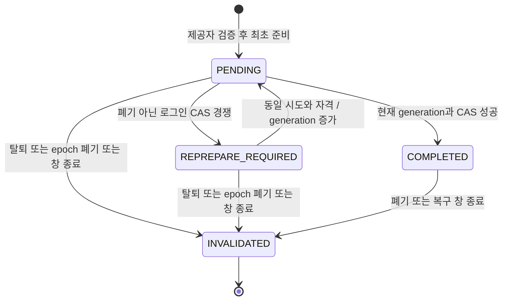

# 계정·설정 — LLD

GROMO-1756 · [정책](policy.md) · [HLD](high-level-design.md) · [원본 예시 7개](source-contracts.json)

## 1. 적용 범위와 공통 규칙

이 문서는 목표 계약이다. 조사 기준 main `529a396e5f0f88cb78c172110920e1fa6b9388a9`의 구현과 미통합 1659 기반을 분리한다. 1750 공통 계약은 선행 PR 의존이며 현재 브랜치에 없는 파일의 상대 링크를 만들지 않는다. 1757의 구현 완료·배포를 이 문서로 대신하지 않는다.

| 항목 | 규칙 |
| --- | --- |
| 경로 | 정확한 7개 method/path만 추가. `/v1`·`/api/v1` 없음. 기존 Data/chat 경로 보존 |
| 앱 자격 | 선행 1750 앱 키 검사. 외부 `X-User-Id`·내부 caller 헤더는 폐기한 뒤 검증한 주체로 새 내부 요청 생성 |
| 사용자 자격 | 일반 5개 `/me` 계열은 유효 AT와 동기 사용자·세션 활성 검사. 로그인은 제공자 자격, logout은 RT 전용 검사 |
| 성공 | 로그인 201, 나머지 200. `Content-Type: application/json`, `{ "data": ... }`만 한 번 적용 |
| 오류 | `{ "error": { "code": "...", "message": "...", "field": null, "retryable": false }, "requestId": "현재 요청 ID" }` |
| 캐시 | 토큰·개인 계정·설정 응답은 `Cache-Control: no-store`. 공용 캐시 금지 |
| 명령 키 | PATCH `/me`, DELETE `/me`, PATCH `/me/settings`에 필수 `Idempotency-Key` 하이픈 포함 36자 UUID(생성은 v4/v7 권고, 버전 비트로 수락을 제한하지 않음). 로그인에는 별도 `X-Login-Attempt-Id`, logout에는 범용 receipt 없음 |
| fingerprint | 검증된 주체 + HTTP method + 정규화한 작업/자원 문맥 + 키, 정규화한 요청 본문 digest. 현재 DB 상태는 digest에 넣지 않음 |
| 낙관 버전 | 원본 계정 7개는 `expectedVersion`이 없다. 필수 필드로 임의 추가하지 않고 Data 잠금과 명령 멱등으로 보호 |
| 생략/null | 요청의 생략은 미변경, 명시 null은 허용한 응답 필드를 제외하면 오류. JSON의 알 수 없는 요청 필드는 400으로 거부 |

범용 receipt는 이미 수락/확정한 키에 다른 본문이 오면 409를 반환한다. 실행 전 검증 실패로 receipt가 확정되지 않은 요청은 결과 재생 보장 밖이다. 수정한 사용자 의도에는 새 키를 쓴다. 같은 성공 명령은 최초 상태 코드와 비즈니스 결과를 재생하며 requestId는 현재 요청 값이다. 탈퇴 뒤에는 범용 재생보다 폐기된 주체 차단이 우선한다.

## 2. 공개 계약 7개

### 2.1 POST /auth/sessions

필수 `X-Login-Attempt-Id: <하이픈 포함 36자 UUID>`는 앱이 시도 시작 시 한 번 생성한다(v4/v7 생성 권고이며 다른 UUID 버전을 거부하지 않음). 외부 AT는 선택 사항이며 제공했다면 유효 access 타입의 현재 게스트 증명으로 검증한다. 잘못된 AT를 익명 로그인으로 조용히 강등하지 않는다. 기존 legacy 경로의 선택 AT 동작은 별도 보존한다.

| 요청 필드 | 타입·규칙 |
| --- | --- |
| provider | 소문자 enum `apple`, `google`, `kakao`, `line`, `instagram`, `facebook`. 기존 지원 집합 보존 |
| authorizationCode | 비어 있지 않은 제공자 코드. `credential`과 정확히 하나. 실제 code 교환 어댑터를 거침 |
| credential | 기존 자격 호환을 위한 명시적 확장 `{type, value}`. `type`은 아래 제공자별 허용값, value는 비어 있지 않은 문자열 |
| termsVersion | 필수 문자열. 배포된 약관 버전 카탈로그의 실제 문서에 대응해야 함. Q05 미입력 상태에서 예시 날짜로 자동 허용하지 않음 |

원본 요청은 그대로 지원할 목표다. 단, 현재 Apple 코드의 `authorizationCode` 필드는 실사용되지 않고 `identityToken`만 검증한다. code를 기존 JWT 검증 함수의 token 인자에 넣는 것은 구현이 아니다. 신규 어댑터는 서버에 등록한 client/redirect 설정과 제공자의 검증 결과를 대조하고, 요청의 임의 URL이나 제공자가 다른 token을 신뢰하지 않는다. 원본의 code-only 형태를 구현하려면 실제 교환 설정과 검증을 연결해야 하며 미연결 상태에서 지원 완료로 표시하지 않는다.

| provider | 유지하는 기존 검증 자격 | 새로운 code 경로와의 경계 |
| --- | --- | --- |
| apple | `credential.type=id_token` → 기존 identityToken 검증 어댑터 | authorizationCode 교환 뒤 제공자 주체 검증 추가 필요 |
| google | `credential.type=id_token` → 기존 Google ID token 어댑터 | 새 Google 기능 확대를 요구하지 않음. 기존 검증 경로를 먼저 보존 |
| facebook | `credential.type=id_token` → 기존 Facebook JWT 어댑터 | 기존 제한/설정 보존 |
| kakao, line, instagram | `credential.type=access_token` → 기존 사용자 정보 검증 어댑터 | token 문자열을 우리 AT/RT로 해석하지 않음 |

지원 집합 밖의 provider 문자열 또는 해당 provider 어댑터 미구성은 기존 400 `UNSUPPORTED_PROVIDER`, field=`provider`로 거절한다. provider 누락/타입 오류는400 INVALID_REQUEST와 구분한다. 각 제공자의 code 경로는 구현·설정된 capability만 허용한다. 제공자 자체를 없애는 대신 기존 credential 경로를 유지한다. 미지원 credential 조합은 422, 자격 검증 실패는 401이다. 타입 혼합·두 자격 동시 제출은 400이다. 신규 guest 생성은 이 7개에 추가하지 않으며 기존 `/api/v1/auth/guest`의 userId 보존과 세션 전환을 함께 검증한다.

201 응답은 정확히 다음 4필드다. 실제 userId는 UUID이고 원본 예시의 `me`는 placeholder다.

```json
{"data":{"accessToken":"access-token","refreshToken":"refresh-token","userId":"01991930-0000-7000-8000-000000000001","onboardingComplete":false}}
```

토큰은 null이 아니다. 이 응답에 `isNewUser`, raw provider subject, internal nonce, sessionEpoch를 임의로 노출하지 않는다. 기존 `deviceBootstrap` 전달은 신규 응답의 `X-Device-Bootstrap` 헤더로 보존한다(기술 결정). 앱은 이 값을 기존 기기 등록 DTO의 deviceBootstrap으로 전달한다. 본문 4필드는 유지하며 헤더도 자격이므로 저장소/로그/공용 캐시에 노출하지 않는다. 기존 legacy 로그인의 body 전달 방식은 보존한다.

### 2.2 GET /me

요청 본문 없음. 활성 계정 projection 한 번으로 아래 필드를 읽는다.

| 응답 필드 | 타입·규칙 |
| --- | --- |
| id | 사용자 UUID 문자열 |
| name | 문자열 또는 null. 기존 nickname이 미설정이면 null |
| catColor | 승인된 자산 ID 문자열 또는 null. Q03 확정 전 임의 기본색을 backfill하지 않음 |
| linkedProviders | 활성 소셜 연동의 소문자 provider 배열. 중복 제거·문자열 오름차순, 게스트면 빈 배열 |
| onboardingComplete | boolean. Q04 판정 함수를 하나로 공유하고 로그인 응답에도 사용 |

name/catColor null 허용은 온보딩 전 상태를 표현하기 위한 원본 예시 대비 명시적 보완이다. Q03/Q04 확정 후 legacy 초기 상태도 이 함수로 검증한다. 소프트 해제된 social account는 linkedProviders에 포함하지 않는다.

```json
{"data":{"id":"01991930-0000-7000-8000-000000000001","name":"수빈","catColor":"black","linkedProviders":["apple"],"onboardingComplete":true}}
```

### 2.3 PATCH /me

요청 `{ "name": "수빈", "catColor": "calico" }`. 두 필드 중 하나 이상 필수이고 생략한 필드는 보존한다. null·빈 객체는 400이다. name은 기존 nickname의 trim/2~10 UTF-16 단위/중복 정책을 사용한다. 자체 신규 정규화나 대소문자 접기를 추가하지 않는다. catColor는 Q03 카탈로그의 허용 ID만 저장하며 문자열을 이미지 URL·파일 경로로 해석하지 않는다.

활성 사용자 배타 잠금 → 멱등 명령 확인 → name 검증/유일 제약 → catColor 적용 → 결과와 receipt 한 TX 순서다. name 검증 실패 시 catColor만 저장되는 부분 성공은 없다. 현재 User 엔티티는 전체 컬럼 UPDATE이므로 공유 잠금 뒤 승급하거나 잠금 전에 읽은 엔티티를 저장하지 않는다.

200은 변경 후 `{id,name,catColor}` 3필드다. `onboardingComplete`는 이 응답에 추가하지 않고 필요하면 GET `/me`로 확인한다. 전체 사용자 엔티티·RT 해시·countryCode 등을 직렬화하지 않는다.

### 2.4 DELETE /auth/sessions/current

요청 본문 없음. 필수 헤더 `X-Refresh-Token: <우리 RT>`. Authorization AT는 생략할 수 있으나 제공하면 서명·타입·만료 및 RT와의 사용자/세션 일치가 필수다. 만료 AT를 실어 보내면 401이므로 앱은 RT만으로 로그아웃할 수 있다. 보안 예외는 이 method/path 하나에만 적용하고 `/auth/**` 전체를 공개하지 않는다.

1. RT 타입·서명·만료를 검증하고 sid 또는 legacy RT 해시로 정확한 사용자/세션을 찾는다.
2. 활성 사용자와 세션 행을 잠근다. 활성 상태라면 현재 저장된 RT 해시 일치를 요구한다. 회전 전의 옛 RT로 새 세션을 종료할 수 없다.
3. 해당 세션 RT를 폐기하고 sessionEpoch를 전진시킨다. 해당 세션 bootstrap도 같은 TX에서 폐기한다. 이 RT 전용 요청은 대상 FCM 토큰/ownershipToken을 받지 않으므로 기기 삭제 outbox를 생성하지 않는다. 사용자 authGeneration은 증가시키지 않는다.
4. 응답 유실 복구용 폐기 증명에는 실제로 폐기한 RT의 해시와 원 만료 시각만 둔다. 같은 서명/만료 검증을 통과한 RT가 정확히 그 해시와 맞고 사용자가 활성이라면 200을 재생한다. 임의의 유효 JWT나 이미 회전한 옛 해시에는 적용하지 않는다.
5. 처음/동일 완료 재시도 모두 `{ "data": { "revoked": true } }`. 재생은 sessionEpoch를 다시 증가시키거나 bootstrap을 다시 발급하지 않는다. 이미 탈퇴한 사용자면 404 `USER_NOT_FOUND`이며 만료·위조 RT는 401이다.

legacy sid 없는 RT는 백필한 legacy 세션 축으로 대조한다. AT에도 sid가 없으면 검증된 같은 사용자와 해당 legacy 해시의 관계를 대조한다. sid가 있는 AT를 다른 legacy RT와 느슨하게 사용자 ID만 보고 결합하지 않는다. 새/구 토큰 조합의 식별이 모호하면 401이며 RT 단독으로 재시도할 수 있다.

RT 헤더는 프록시·access log·HTTP client debug·trace attribute·오류 덤프에서 제거한다. 쿠키를 새로 요구하지 않는다. 로그아웃의 200은 세션/bootstrap 폐기 완료이며 푸시 기기 등록 삭제까지 뜻하지 않는다.

기기 등록 정리는 별도 `DELETE /api/v1/users/me/device-token`의 소유다. 앱이 대상 `X-Device-Token`과 `X-Device-Ownership`을 보내고, Business의 기존 `DeviceTokenUseCase.delete`가 해당 토큰·소유권 값으로 Data outbox를 먼저 기록한 뒤 직접 삭제/완료 표시를 처리한다(장부 ㊲·㊨·㊪·㊿). RT subject만 보고 사용자 전체 기기를 삭제하지 않는다. 지연된 A의 삭제는 A의 ownershipToken으로만 비교하여 B 또는 재등록한 A의 최신 등록을 지우지 않는다. 헤더 누락의 legacy 허용 창은 기존 ㊟ 롤아웃 규칙이며 새 문서가 이를 필수화했다고 주장하지 않는다. 앱은 세션 자격을 폐기하기 전에 별도 기기 DELETE의 결과를 확인하고 실패를 삼키지 않는 내구 재시도 ㋩를 유지한다. outbox·직접 삭제 둘 다 실패하면 재시도 근거가 앱에만 남으며, outbox만 성공해도 직접 삭제 실패를 성공으로 숨기지 않는다. RT-only logout을 이 별도 DELETE의 성공으로 간주하거나 두 요청 사이의 값을 무상태 Business 메모리에 보관하지 않는다. 두 기기 헤더도 자격이므로 로그에 남기지 않는다.

#### 기기 DELETE의 동일 명령 재생

새 계정 흐름에 참여하는 앱은 별도 기기 DELETE를 큐에 넣을 때 **안정된 Idempotency-Key UUID를 한 번 생성해
대상 토큰·ownership·사용자와 함께 내구 보관**한다. 앱 재실행/네트워크 재시도/완료 표시 유실에서 키를 재생성하지
않는다. 이는 새로운8번째 계정 API가 아니라 기존 DELETE 사용 규약이며, 키 없는 구 앱의 기존 optional 창을
서버에서 소급 폐쇄하지 않는다. 새 앱의 필수 키와 구 경로의 호환 허용을 구분한다.

앱 키 K는 기존 RequestIdempotencyKeys의 결정적 단계 규약을 거친다. Data outbox 기록 명령은
`K:device-delete-outbox`, 알림 서버에 직접 보내는 삭제는 `K:device-delete`다. Data가 저장한 outbox의
알림 삭제 요청도 **동일한 `K:device-delete`**를 보존해 relay가 전달한다. 단계 이름을 두 번 붙이거나 relay에서
새 UUID를 생성하지 않는다. 서로 다른 단계의 키는 의도적인 scope 분리이며 동일 알림 mutation의 직접/relay 키는 같다.
이 일치는 후속 구현 의무다. 조사한 미통합 `UserSatelliteCommandService.recordDeviceTokenDeletion`은
토큰/ownership/authGeneration만 params에 기록하고 `toNotification(..., null)`로 봉투를 전달하므로,
현재 코드만으로 직접 전달 키의 보존을 보장한다고 주장하지 않는다. Business가 검증해 계산한 알림 삭제 키를
내부 명령 DTO와 fingerprint에 포함하고 Data delivery의 내구 메타데이터에 저장한다. relay와 수신 어댑터는
이 키로 같은 삭제 receipt를 찾도록 연결한다. outbox eventId는 전달 식별자로 따로 유지하며 이를 새 mutation 키로
대체하지 않는다. 기존 legacy delivery의 처리 방식은 보존하고 새 필드 없는 행을 새 계약 완료로 오인하지 않는다.
특히 현재 `InboundService`의 eventId dedup 뒤 `deleteLocked` 직접 호출은 이 공통 명령 재생을 우회한다.
새 delivery는 검증된 삭제 키를 받아 직접 DELETE와 동일한 `device-delete:<userId>` scope 및
정규화된 `{deviceToken, ownershipToken, authGeneration}` fingerprint를 쓰는 명령 함수로 연결한다.
HTTP 경로/봉투 전체를 fingerprint로 삼아 서로 다른 receipt를 만들지 않는다. eventId 중복 검사와 삭제 명령
receipt·실제 mutation·inbound 완료는 알림 DB의 같은 TX에서 확정해 어느 경로가 먼저 와도 한 번만 삭제한다.

알림 서버는 서비스 자격·검증 사용자·대상 토큰·작업 scope·fingerprint를 확인한 뒤 확정된 동일 명령 결과를
조회한다. **원래 삭제가 ownershipVersion을 전진시켰다면 성공 결과 재생을 낡은 ownershipToken 거절보다 먼저
수행**한다. 새 명령만 현재 ownership CAS를 검사한다. 같은 키에 다른 토큰/ownership/body면409이며 다른 주체가
receipt를 읽지 못한다. 결과 재생은 이미 끝난 삭제의 증거만 반환하고, 새 등록 B/새 ownership을 다시 삭제하지 않는다.

삭제가 적용된 뒤 응답 또는 Data 완료 표시가 유실돼도 직접 재시도/relay가 같은 결과를 받아 완료할 수 있다.
현재 DeviceTokenUseCase.delete의 Data 완료 표시 실패는 원 삭제 성공을 뒤집지 않고 relay가 복구한다.
이때 outbox에는 삭제할 토큰·원 ownership·동일 키·필요한 generation만 남기며 일반 로그에는 기록하지 않는다.
큐 삭제와 후속 RT-only logout은 이 명령의 성공 확인 뒤 진행한다. 둘 다 실패해도 앱에 남은 내구 증거를 반드시
유지하고, RT-only logout 성공으로 기기 삭제 큐를 임의 소진하지 않는다.

### 2.5 DELETE /me

요청 `{ "confirmation": "DELETE" }`. 대소문자까지 정확히 일치해야 하며 누락/다른 값은 400이다. 유효 AT와 활성 계정·세션 검사, 필수 멱등 키를 요구한다. confirmation은 재인증 수단이 아니다.

Data의 기존 `AccountWithdrawalService.withdraw` 단일 TX에 신규 파기를 넣는다. 다른 주민이 있는 방장은 기존 400 `HOST_WITHDRAW`이고 전체 변경이 롤백된다. 성공은 200 `{ "data": { "deleted": true } }`. 원본 예상 계약의 200과 legacy DELETE `/api/v1/users/me`의 204를 구분한다.

성공 후 같은 AT로 재요청하면 사용자 활성 검사에서 404 `USER_NOT_FOUND`이며 토큰 자체가 만료/위조면 401이다. 범용 receipt가 남아 있어도 폐기된 주체에게 개인 응답을 재생하지 않는다. 클라이언트는 최초 200 또는 후속 권한 폐기 확인 후 로컬 로그인 상태를 정리한다. logout의 활성 사용자 내 완료 재생 특례를 계정 탈퇴에 확대하지 않는다.

### 2.6 GET /me/settings

요청 본문 없음. Business에서 동기 활성 검사 후 알림 서버 정본을 읽는다. 200은 `{ "data": { "notifications": true } }`로 boolean 하나이며 null이 아니다. 신규/legacy 사용자의 기본값은 1659 이관/초기화 계약의 `notificationEnabled`에서 읽고 Business에 별도 기본값 상수를 만들지 않는다.

설정 행 누락이 정상 초기 상태면 정본 서비스의 기존 초기화 규칙으로 복구한다. 복구 실패·이관 누락을 `notifications:true` 성공으로 숨기지 않는다. 기존 compat GET의 AT 수명 읽기 창을 이 경로에 재사용하지 않는다.

### 2.7 PATCH /me/settings

요청 `{ "notifications": false }`, 정확한 boolean 하나 필수. 생략/null/문자열은 400이다. 성공은 `{ "data": { "notifications": false } }`. 알림 서버에 적용된 해당 명령의 비즈니스 결과를 반환한다.

내부 명령의 의미는 다음과 같다. 필드 이름은 공개 DTO와 내부 기존 모델을 구분한다.

```json
{"commandId":"01991930-0000-7000-8000-000000000002","version":42,"mask":["notificationEnabled"],"patch":{"notificationEnabled":false},"authGeneration":3}
```

사용자 주체는 Business가 새로 만든 내부 위임 헤더에서 받는다. 요청 본문의 userId를 신뢰하지 않는다. Data는 같은 키 재개에서 기존 commandId/version/mask/patch를 반환하며 새로운 명령을 만들지 않는다. Notification은 자신의 사용자 폐기 tombstone과 generation을 대조하고 선택 필드의 저장 version보다 큰 경우에만 그 필드를 바꾼다. 같은 명령 재전달은 최초 결과로 멱등 응답한다. 낮은 버전은 이미 대체된 상태를 덮지 않는다.

예: v41 sound=true가 지연되고 v42 notifications=false가 먼저 와도, sound의 적용 버전이 40이면 v41은 sound만 반영한다. 전체 버전 42를 보고 v41을 통째로 버리지 않는다. legacy 5필드 전체 PUT은 mask에 5개 모두를 담고 각 필드에서 동일 비교를 한다. 이 변경은 Notification 저장/relay 계약까지 함께 구현해야 하며 Business만의 DTO 변경으로 끝나지 않는다.

## 3. 토큰·로그인 시도 상세

### 로그인 내구 상태

아래는 새 테이블 이름을 무조건 추가하라는 뜻이 아니라 1659 세션/명령 기반에 필요한 논리 필드다. 구현 시 기존 모델 확장으로 중복 정본을 피한다.

| 상태/자료 | 내용·제약 |
| --- | --- |
| attempt scope | 로그인 시도 ID, provider, 검증된 provider subject의 비가역 digest, 선택적 guest userId, termsVersion. 외부 userId는 사용하지 않음 |
| 자격 digest | 제출된 code/credential을 keyed digest로 결합해 같은 시도의 재개 증명을 확인. 원문 자격/원문 JWT 저장 금지 |
| 고정 서명 재료 | userId, sessionId, jti, iat, exp, guest, authGeneration, sessionEpoch, signing key ID, 직렬화 버전. AT/RT 타입별 claims 구분. bootstrap 재생에 필요한 key ID도 고정 |
| PENDING | upsert와 서명 재료를 저장했으나 RT 미확정. 외부 사용자 세션으로 사용할 수 없음 |
| COMPLETED | 해당 nonce의 RT hash CAS 성공. 동일 시도의 동일 결과만 재생 |
| REPREPARE_REQUIRED | 사용자는 활성이고 세션은 미폐기이며 원 epoch는 같지만 로그인 완료 CAS의 경쟁에 패배. 옛 준비 generation/nonce는 폐기하고 같은 시도의 재준비 허용 |
| INVALIDATED | 탈퇴·명시적 세션 폐기·authGeneration/sessionEpoch 변경 또는 복구 창 종료. 영구 종료 상태이며 같은 시도의 재준비/토큰 재생 금지 |

bootstrap도 로그인 성공 재개에서 같은 값이어야 한다. 기술 선택은 Business 전용 bootstrap HMAC 키와 고정 sessionId/jti의 도메인 분리 입력으로 불투명 값을 결정적으로 만들고, completeLogin에 해시만 전달하는 것이다. 키는 JWT 서명 키와 분리하고 재개 창 동안 key ID를 고정한다. 1659의 무작위 nonce 발급 경로를 그대로 재호출하면 재생 값이 달라지므로 신규 준비/확정 경로에서 기존 AuthSession에 미리 계산한 hash를 확정하는 확장이 필요하다. 소비된 bootstrap의 사용 상태를 재개가 초기화하지 않으며 활성 세션/epoch/소유권 대조는 기존 방식대로 유지한다.

첫 prepare는 제공자 검증 완료 후에만 가능하다. 재개는 원 시도와 같은 자격 digest를 증명하면 이미 검증한 제공자 결과를 제한된 재개 창에서 재사용하여 일회성 authorizationCode를 반복 교환하지 않는다. 기술 초기값은 준비/응답 복구 창 5분이고 고정 AT/RT 만료 이전으로 제한한다. 재개 창 이후는 새 제공자 인증 시도가 필요하다. 시간 제한은 receipt 전체 영구 보존 정책과 다르다. 로그인 자격/서명 재료는 범용 receipt에 넣지 않으며 복구 창 종료·계정 탈퇴 시 안전하게 폐기한다.

같은 attempt ID의 다른 자격/본문은 409 `IDEMPOTENCY_KEY_REUSED`, 다른 실행자가 같은 준비/확정을 진행 중이면 409 `REQUEST_IN_PROGRESS`다. 실행 중인 소유자가 없는 PENDING 재개는 저장된 현재 generation/서명 재료를 사용하여 확정을 이어가며 무조건 진행 중 오류를 반복하지 않는다. 반환 field는 범용 키가 아니라 `X-Login-Attempt-Id`다. 재개 시 서명 key ID·직렬화·claims가 같아야 토큰 원문과 RT hash가 같으므로 해당 짧은 창 동안 서명 키를 제거하지 않는다. 서명 서버 시간으로 iat를 새로 찍지 않는다.

완료 CAS는 활성 사용자, 해당 sessionId, nonce, 미폐기 epoch를 한 경계에서 확인한다. 같은 시도의 성공 완료/동일 hash이면 최초 201을 복원할 수 있지만 다른 시도나 폐기된 세션의 실패를 성공으로 접지 않는다. 같은 제공자로 재가입해도 soft-deleted user를 부활시키지 않고 새 계정으로 처리한다.

### 로그인 CAS 충돌의 재준비 전이

로그인 장부 ㊡의 충돌 재발급은 refresh CAS 0행의 401과 다른 규칙이다. 이 절의 세션 유효성은 미폐기 준비 세션도 포함하며, PENDING 세션을 외부 API에서 인증된 활성 세션으로 허용한다는 뜻은 아니다. 구현에서는 attempt 행에 현재 `prepareGeneration`, `nonce`, opaque CAS 조건과 고정 서명 재료를 함께 저장하고, 이미 폐기한 generation의 complete 요청이 새 준비를 덮지 못하게 한다. 같은 attempt의 새 준비를 별도 사용자/별도 기기 세션 생성으로 바꾸지 않는다.

| 현재 → 다음 | 조건과 원자 처리 | 외부 동작 |
| --- | --- | --- |
| PENDING(g) → COMPLETED(g) | 활성 사용자와 미폐기 준비/활성 세션, 원 epoch, 현재 generation/nonce와 CAS 조건이 일치. RT/bootstrap hash와 결과를 한 TX에서 확정 | 최초 201, 이후 같은 g의 성공 결과 재생 |
| PENDING(g) → REPREPARE_REQUIRED(g) | 사용자 활성·세션 미폐기와 원 epoch는 여전히 유효하지만 다른 로그인 준비와의 경쟁으로 CAS 조건만 달라짐. 실패 후보 토큰을 반환하지 않고 g의 nonce/후보 서명 재료를 폐기 | 409 `REQUEST_IN_PROGRESS`, field=`X-Login-Attempt-Id`, Retry-After: 1. 앱은 같은 attempt와 같은 자격으로 재개 |
| REPREPARE_REQUIRED(g) → PENDING(g+1) | attempt와 해당 사용자/세션을 잠근 뒤 동일 scope·자격 digest·원 복구 창·사용자 활성·세션 미폐기/epoch를 재검증. 최신 CAS 조건을 다시 읽고 새 nonce, AT/RT jti·iat·exp·key ID·bootstrap 재료를 한 번 저장 | Business는 g+1의 고정 재료로 다시 서명하고 complete 수행. 제공자 일회성 code 재교환과 user upsert 중복 없음 |
| PENDING(g+1) → PENDING(g+1) | 동일 attempt 재준비 요청의 동시 실행/응답 유실. 먼저 저장된 새 준비를 재조회 | 같은 g+1 재료 재생. 요청마다 g+2를 만들지 않음 |
| 모든 미종료 상태/COMPLETED → INVALIDATED | 탈퇴·세션 폐기·원 authGeneration/sessionEpoch 불일치 또는 복구 창 종료 | 원/새 nonce 발급 및 성공 재생 금지. 계정 부재는 404 `USER_NOT_FOUND`, 폐기 자격/창 종료는 401 `UNAUTHORIZED` |



복구 창 종료에 따른 INVALIDATED는 해당 로그인 시도의 재생 자격만 닫으며 이미 활성화한 세션을 임의 로그아웃시키지 않는다. 실제 세션 폐기는 별도 세션/epoch 상태가 정본이다.

옛 g의 지연 complete는 현재 g+1을 무효화하거나 그 재료를 재생하지 않고 409 REQUEST_IN_PROGRESS로 거부한다. g+1의 서명 재료는 그 generation 안에서만 결정적이고 g와는 달라야 한다. 서명 재료를 새로 준비해도 최초 attempt의 5분 복구 마감은 연장하지 않으며 새 토큰의 만료는 실제 환경 TTL과 현재 정책을 지킨다. 연속 경쟁이면 같은 전이를 반복하되 요청 deadline 안에서 무한 재시도하지 않고 같은 409로 앱에 복구 책임을 돌린다. 다른 활성 sessionId의 RT는 이 CAS의 갱신 대상이 아니다. 탈퇴로 INVALIDATED가 된 시도를 재가입 성공으로 승격하지 않으며 새로운 제공자 인증은 새 attempt에서 시작한다.

### refresh와 세션 마이그레이션

기존 refresh 계약은 7개 신규 endpoint에 추가 계수하지 않는다. Business 서명 이관과 세션 정본 전환의 필수 의존으로 검증한다.

| 경우 | 결과 |
| --- | --- |
| RT 타입/서명/만료/저장 해시 불일치 | 401 `REFRESH_TOKEN` |
| sid 있는 활성 세션, 회전 시점 아님 | 새 AT와 `refreshToken:null`, 앱은 기존 RT 유지 |
| sid 있는 활성 세션, 회전 필요, CAS 1행 | 새 AT·RT, 같은 sessionId |
| 같은 구 해시로 회전 경쟁, CAS 0행 | 401 `REFRESH_TOKEN`, 구 RT 유지 성공 금지 |
| sid 없는 legacy, 기존 해시 일치 | 첫 refresh에서 세션 생성/매핑과 새 sid RT hash를 원자 확정. 회전 시점 이전이어도 승격 |
| 이미 승격에 사용한 legacy RT 재사용 | 기존 매핑으로 새 hash를 덮지 않음. 실패하면 401 |
| 기기 B 로그인 | A의 RT·sessionEpoch를 변경하지 않음 |
| A 개별 logout | A만 폐기, B 계속 유효 |
| 탈퇴/전 기기 logout | 모든 세션과 bootstrap 폐기, authGeneration 증가 |

기준 main의 회전은 RT 남은 수명이 절반 미만일 때다. prod AT 3600초, RT 30일, 게스트 RT 90일이고 dev AT는 30일 설정이므로 환경별 실제 설정을 읽는다. legacy 호환 창은 배포일부터 일률 30일이 아니라 마지막 legacy 발급 시점과 토큰의 실제 최대 만료를 기준으로 한다. 구 발급 경로를 계속 열고 있으면 호환 창도 끝나지 않는다.

expand 순서는 세션 저장소 추가 → 기존 해시의 legacy 세션 백필 → 로그인/refresh/logout 이중 호환 → 세션 정본으로 쓰기 전환 → legacy 발급 중단 확인 → 최대 유효 수명 경과·잔여 legacy 측정 → 조회 제거다. 기존 users 단일 해시를 새 세션 로그인마다 덮어쓰는 dual-write는 금지한다. 그것은 여러 기기 보존과 충돌한다. 기존 guest가 새 계정으로 떨어지는 일이 없도록 UUID/FK/지갑을 전환 전후 대조한다.

### 유효한 sidless AT를 가진 기존 앱 설치의 진입 gate

현재 `app/app-dev/src/services/api.ts:getFreshAccessToken`은 exp가 충분히 남았으면 저장된 AT를 그대로
반환한다(200~209행). 그래서 RT 승격 구현만으로는 기존 설치가 새 `/me` 계열에 진입할 수 없다.
**신규 경로를 처음 사용하기 전에 세션 형식 자격으로의 전환을 완료하는 앱 gate를 추가**한다.
AT가 아직 유효해도 sid가 없으면 만료를 기다리지 않고 legacy RT로 기존 `/api/v1/auth/refresh`를 강제 호출한다.
새 일반 `/me` 경로에서 sidless AT를 임의의 활성 세션에 연결하거나 사용자 ID로 fake sid를 합성하지 않는다.

1. 앱의 기존 auth-session transition/single-flight 잠금을 획득해 로그인·로그아웃·401 refresh·신규 경로 전환을
   직렬화한다. generation과 현재 자격 묶음을 읽는다. 로컬 JWT payload의 sid 확인은 전환 필요 여부만 결정하며
   인증/주체 허가를 대신하지 않는다.
2. 이미 세션 형식 AT/RT라면 현재 토큰 유효성 경로를 따른다. sidless AT이면 **exp 기반 조기 반환을 우회**해
   저장 RT를 제출한다. RT도 legacy면 서버는 실제 서명/만료/저장 해시를 검사한 첫 refresh에서 같은 userId의
   세션과 sid AT/RT 쌍을 확정한다. RT가 이미 sid 형식이면 해당 세션을 refresh하고 미회전 null 규칙을 따른다.
3. 요청 이후 generation이나 저장 RT가 달라졌으면 지연 응답을 버린다. 최초 legacy RT 승격 응답은 sid가 같은
   새 AT와 새 RT가 모두 필요하다. 그 경로의 refreshToken:null·누락·사용자/세션 불일치는 전환 완료가 아니다.
   세션 형식 RT의 정상 미회전 응답만 기존 RT와 새 AT를 묶을 수 있다.
4. 새 AT/RT·사용자·형식 버전을 **하나의 인증 상태 묶음으로 원자 저장/공개**하고 나서 신규 `/me` 요청 gate를 연다.
   현재처럼 accessToken과 refreshToken 키를 두 번 setItem하는 구현을 원자 교체라고 간주하지 않는다.
   단일 credential bundle의 원자 저장 또는 검증된 journal/commit-pointer 방식을 구현하고, 모든 인증 reader/writer를
   그 accessor로 전환해야 한다. AsyncStorage.multiSet의 이름만 보고 crash atomicity를 가정하지 않는다.
5. 저장 도중 종료/실패하면 신규 경로 gate를 열지 않는다. 복구는 완전히 commit된 자격 묶음만 읽고 새 AT+옛 RT를
   섞지 않는다. 서버 승격은 성공했으나 응답/로컬 commit을 잃어 옛 RT가401인 경우, 옛 RT 해시를 부활시키지 않고
   정상 제공자 재인증으로 복구한다. 자동 guest 신규 생성으로 기존 userId·자산을 버리지 않는다.

네트워크/5xx는 전환 대기 상태로 재시도하며 일반 인증 실패와 구분한다. RT 부재·만료·폐기는 재인증이 필요하다.
세션 저장소/legacy RT 승격 서버 → 앱 원자 자격 accessor와 강제 refresh gate → 신규 계정 라우팅 활성화 순서로
배포한다. server-only 변경 후 기존 앱이 새 경로를 곧바로 쓰게 하지 않는다. 기존 `/api/v1`의 sidless AT 호환은
별도 롤아웃 창 동안 유지하며 신규 경로의 동기 활성 검사를 약하게 만들어 우회하지 않는다.

## 4. 탈퇴 파기·보존 전수 표

아래 '현재'는 main 증거다. '추가'는 1757 및 선행 1659 통합에서 검증해야 하는 변경이다. user 행과 일부 관계·정산 근거는 남으므로 이 설계를 전체 데이터의 물리 삭제나 복원 불가능한 완전 익명화라고 부르지 않는다. 보존 기간을 새로 약속하지 않는다.

| 자료 | 현재 처리 | 목표 처리·주의 |
| --- | --- | --- |
| users.nickname(name), deviceToken, refreshTokenHash, countryCode, language | erasePersonalData에서 null | 유지. 토큰 정리 outbox에 필요한 증명은 파기 전에 기록 |
| group_announcements.user_id | nullable 작성자 FK이며 schema.dbml은 탈퇴 시 null을 명시하지만 AccountWithdrawalService에는 정리 호출 없음 | 같은 탈퇴 TX에서 해당 user_id를 전부 nullify. 공지 행·내용은 기존 보존 규칙 유지, 작성자 사용자 연계만 제거. 생성의 getCallerForShare와 탈퇴 getCallerForUpdate로 경합 직렬화 |
| 신규 users.catColor | 필드 없음 | 이름과 함께 null. 프로필 receipt/투영/캐시의 복사본도 제거 |
| 신규 온보딩 자료·terms 동의 자료 | 필드/정본 없음 | 사용자 연계 프로필 완료 자료와 로그인 자격 자료 파기. 약관 증거 별도 보존 요구가 있다면 Q05에 문서화하고 일반 프로필 DB에 방치하지 않음 |
| users.occupation | 현재 그대로 남음 | 직접 프로필 필드이므로 null 파기에 추가. 기존 구현 완료라고 주장하지 않음 |
| users.lastActiveAt, characterTrialAnchorAt | 현재 그대로 남음 | 개인 활동/체험 시각 파기에 추가. lastActiveAt NOT NULL 때문에 nullable migration과 active-user 갱신 조건을 함께 변경해야 함 |
| users.statVisibility | 현재 유지 | 기존 기본값 FRIENDS로 정규화하되 이것을 비공개 권한으로 오인하지 않음. 별도의 활성 사용자 조건으로 탈퇴자의 모든 개인 통계 조회를 차단 |
| users.id, isDeleted, createdAt/updatedAt, isGuest/isBot, tierLevel | user 행 유지 | FK·계정 상태·기존 운영/정산 증거. 활성 사용자 DTO로 노출 금지. 직접 PII 파기와 구분하며 기존 retention→purge 정책의 구현/기간은 이 티켓에서 완료로 선언하지 않음 |
| social_accounts.provider_id 및 active/soft-unlinked 연동 행 | userId로 전체 hard delete | 유지. 식별자를 남긴 soft unlink만으로 탈퇴를 대체하지 않음 |
| user_wallet, screen/focus/notification 설정 | hard delete | 중앙 지갑은 내기 해제 환불 뒤 삭제. 알림 이관 후 정본 삭제는 위성 명령에도 포함 |
| focus_sessions, daily_focus_stats, daily_screen_time_stats | user 귀속 nullify | 그룹 내기 정산 증거를 먼저 동결. 통계 행 자체를 모두 지우는 동작 아님 |
| group_challenge_members의 user_id/progress_minutes/usage_date/measured_at 및 생성/수정 시각 | 현재 탈퇴는 원본 보고 행을 유지. user_id는 NOT NULL FK | 그룹 내기 증거 동결을 먼저 검증한 뒤 해당 사용자의 원본 보고 행 전체를 같은 탈퇴 TX에서 hard delete. 단순 nullify/soft delete로 원문을 남기지 않음 |
| group_challenge_bet_participants의 확정 achieved/achieved_at/progress_minutes/payout·회차/사용자 관계 | 기존 정산/동결 증거 보존 | 원본 날짜별 보고와 구분한 최소 정산 근거. 정산·기존 결과 복구 범위로만 사용, 탈퇴자 프로필/측정 원본 조회 금지. 보존 기간을 새로 무기한 확정하지 않음 |
| group_members, 혼자 소유한 group | membership leave, 필요 시 close | 남은 주민이 있으면 HOST_WITHDRAW 전체 rollback. 기존 정산 관계 이력 보존 |
| 친구 관계·pin | 친구 soft delete, 관련 pin hard delete | 새 검색/목록은 활성 조건으로 가림 |
| user_items, currency_transactions, league_arena_users | user FK로 이력 보존 | 기존 정산/보유 관계의 증거. 서버 공개 projection에서 탈퇴자 name/catColor를 재생하지 않음 |
| user_focus_tags.user_id, source_occupation_default_tag_id, default_tags.name 연결 | 기존 erase에는 삭제 없음 | FocusSession이 user_focus_tags를 참조하므로 직접 user_id만 nullify해도 사용자 역추적 경로가 남음. 정산 증거 동결 뒤 태그의 사용자 귀속/직군 출처를 끊는 nullable migration 또는 세션 태그 연결 해제 후 개인 채택 행 파기를 비교 검증. 공유 default_tags는 일괄 삭제하지 않음 |
| character_generation.user_id, created_at, client_generation_id | 기존 erase에는 정리 없음 | 개인 생성 요청 식별·사용자 연계 자료 파기 경로를 해당 소유 서비스와 연결. 공유 정산 근거와 동일 보존 사유로 뭉뚱그리지 않음 |
| invite_link_clicks.claimedUserId·클릭 연결 | main 직접 파기 없음 | 1659의 claimed user 익명화·링크 위성 폐기 전달 재사용. ipHash/userAgent/device/app 식별 자료도 사용자 연계가 남는지 링크 소유 정리 명령에서 확인 |
| 신규 auth session RT/bootstrap hash·로그인 시도 자격 digest·고정 서명 재료 | main 새 모델 없음 | 세션 폐기와 원문 재발급 방지. 남기는 폐기 tombstone은 최소 sessionId/epoch/만료 정보로 제한하고 사용자 연계 자격은 파기 |
| 신규 일반 receipt·outbox·위성 projection 속 name/catColor/기기 자격 | 신규 자료 | 탈퇴 TX에서 직접 PII가 든 중앙 복사본 제거/대체, 대상별 outbox로 위성 파기. 삭제 receipt는 deleted 결과만 보유하며 개인 응답 재생 금지 |
| 로그·trace·dead-letter payload | 경로별 다름 | 애초에 자격/PII 본문을 남기지 않음. 잘못 수집한 자료를 기능 DB 삭제만으로 지웠다고 주장하지 않음 |

main User 주석은 retention→purge를 언급하지만 현재 조회한 `erasePersonalData`는 즉시 물리 삭제가 아니다. 기존 행의 보존 근거/기간 없이 무기한 보존을 새 정책으로 채택하지 않는다. 위 표에서 '추가'로 표시한 파기는 해당 소유 모델과 FK를 실제 검증해야 하며 새 catColor 하나만 null 처리하고 전수 파기 완료로 닫지 않는다.

### 중앙 TX의 순서 제약

`getCallerForUpdate` → authGeneration/세션 폐기 및 필요한 위성 명령 기록 → 그룹 조건·내기 해제 환불·증거 동결 → group_challenge_members 원본 보고 파기 → 집중/통계/스크린타임 귀속 및 group_announcements.user_id nullify → 지갑·설정 삭제 → 친구/pin/신규 개인자료 정리 → user 직접 PII null 및 soft delete → socialAccounts bulk delete 순서를 유지한다. 중간 실패는 전체 rollback이다.

`socialAccountRepository.deleteByUserId`는 `flushAutomatically` 후 `clearAutomatically`로 영속성 컨텍스트를 비운다. 따라서 user.catColor 등 엔티티 변경을 그 뒤에 붙이면 저장되지 않는다. 모든 엔티티 파기를 앞에 배치하고 마지막 bulk delete 뒤에는 분리된 엔티티를 수정하지 않는다. 멱등 결과 저장은 이 clear를 고려해 명시적으로 영속화하며 사용자 PII 수정의 순서를 뒤집지 않는다.

#### 그룹 창형 화면시간 원본의 파기 경계

기준 `GroupChallengeMember`는 user_id/group_challenge_id가 모두 NOT NULL FK이고 usage_date도 V37에서
NOT NULL로 승격했다. V1 FK는 이 행에서 users/group_challenges로 향하며 기준 migration/schema에는 이 행을
참조하는 inbound FK가 없다. 따라서 목표 처리는 사용자 FK만 null로 바꾸는 migration보다
`DELETE FROM group_challenge_members WHERE user_id = :withdrawnUserId`로 원본 전체를 제거하는 것이다.
이것은 설계 변경이며 현재 main이 이미 수행한다고 표시하지 않는다.

`GroupMemberService.detachWithdrawnUser`의 내기 해제/환불 뒤 `freezeEvidenceForAccountErasure`가 먼저
끝나야 한다. 기준 함수는 OPEN 회차를 순서대로 잠그고 달성 참가에 confirmWin을 남기며 미달성은 null로 둔다.
창형 SCREEN_TIME의 보고가 없어지면 기존 정산의 미보고=미달성 규칙을 따른다. 이미 확정한 승리는 참가 증거로
보존하므로 정산 금액이 달라지지 않아야 한다. 취소 마감/환불 정책을 바꾸거나 이 파기 경로에서 추가 환불하지 않는다.

다만 현재 함수는 판정 target을 복원하지 못하면 skip한다. 후속 파기 구현은 필요한 OPEN 참가별로
'기존 확정 결과 있음 / 원본에서 승리 증거 동결 완료 / 판정 가능한 미달성 또는 미보고'를 검증해야 한다.
**판정 불가 skip을 동결 완료로 간주해 원본을 지우지 않는다.** 필요한 증거를 확정할 수 없으면 중앙 탈퇴 TX를
성공으로 commit하지 않고 실패/복구 대상으로 남긴다. 실패를0분/미달성으로 대체하지 않는다.
종료된 회차는 이미 저장한 정산 결과를 사용하고 원본을 파기해도 과거 금액을 재계산하지 않는다.
이 보강 없이 현재 void 함수 호출 사실만으로 데이터 파기 gate가 통과했다고 간주하지 않는다.

창 사용분 업로드는 기존 `GroupBetWindowUsageService.requireActiveUser`의 users FOR SHARE를 유지하고
탈퇴는 같은 user의 FOR UPDATE를 유지한다. 보고가 먼저 commit하면 삭제 스캔에 포함되고, 탈퇴가 먼저면
대기 보고는 활성 조건을 재검사해404 USER_NOT_FOUND로 끝난다. 원본 native upsert만 직접 호출하는 우회 writer를
허용하지 않는다. soft-deleted 원본도 대상 사용자로 전체 삭제하며 어느 단계 실패든 동결/삭제/환불/outbox를 함께 rollback한다.

정산용 참가 증거에는 회차 식별자·확정 분/달성·금액이 남을 수 있으므로 완전 익명화라고 부르지 않는다.
이는 돈 정산 결과를 보존하는 기존 목적이고 날짜별 usage_date/measured_at 원본의 무기한 보존 근거가 아니다.
일반 프로필/측정 조회와 새 projection은 탈퇴자를 제외하고 원본 보고를 참가 증거에서 재생성하지 않는다.

공지 생성은 기존 `GroupAnnouncementService.createAnnouncement`의 `getCallerForShare`를 TX 종료까지 유지하고 탈퇴는 같은 users 행의 `getCallerForUpdate`를 먼저 획득한다. 생성이 먼저 커밋하면 탈퇴의 공지 nullify 스캔에 그 행이 포함되고, 탈퇴가 먼저 커밋하면 대기하던 생성은 활성 조건을 재평가해 404 `USER_NOT_FOUND`로 종료된다. 새 공지 생성 어댑터도 이 관문을 우회하지 않는다. nullify는 중앙 TX 안의 `UPDATE group_announcements SET user_id = NULL WHERE user_id = :withdrawnUserId`에 해당하며 별도 비동기 작업으로 미루지 않는다. 다른 활성 사용자의 공지 수정은 수정자 users 행만 잠그므로 이 작성자 잠금으로 막히지 않는다. 기준 `GroupAnnouncement`에는 `@DynamicUpdate`/`@Version`이 없어 오래 읽은 엔티티의 전체 UPDATE가 nullify된 user_id를 되살릴 수 있다. 후속 구현의 공지 수정 SQL은 title/content/updatedAt만 갱신하고 user_id는 쓰지 않게 한다. user_id 쓰기 경로는 최초 생성과 탈퇴 nullify로 제한한다. 타인 수정·공지 생성과 양방향 경합/rollback을 실제 DB에서 검증한다.

프로필/refresh/활동 갱신과 탈퇴의 경쟁은 모두 활성 조건과 동일 사용자 잠금/조건부 UPDATE 규칙을 지켜야 한다. soft delete된 사용자를 일반 findById로 꺼내 최신 user 필드를 전체 UPDATE하면 안 된다.

## 5. 구체 오류 계약

신규 공통 오류와 기존 domain status/code를 구분한다. 아래 기존 코드는 신규 어댑터의 등록 대조 표에 명시해 보존한다. 미등록 상류 code/status 조합은 502 `UPSTREAM_CONTRACT_ERROR`이며 임의 상태 추측을 하지 않는다. legacy 경로는 기존 오류 형태를 그대로 보존한다.

| HTTP / code | retryable | field / 상황 |
| --- | --- | --- |
| 400 INVALID_REQUEST | false | 깨진 JSON·필수 필드·confirmation·잘못된 타입 |
| 400 INVALID_IDEMPOTENCY_KEY | false | `Idempotency-Key` 누락/형식 오류 |
| 400 NICKNAME_INVALID | false | `name`, 기존 trim/길이 정책 실패 |
| 400 UNSUPPORTED_PROVIDER | false | `provider`, 지원 집합 밖 또는 해당 provider 어댑터 미구성. 기존 AuthErrorCode 유지 |
| 400 HOST_WITHDRAW | false | null, 남은 주민이 있는 방장 탈퇴 |
| 401 UNAUTHORIZED | false | null, 새 공개 경로의 위조/만료/타입/주체 오류 |
| 401 REFRESH_TOKEN | false | null, 기존 refresh RT 검증 또는 회전 CAS 0행 |
| 404 USER_NOT_FOUND | false | null, 비활성/없는 본인 계정. 기존 UserErrorCode와 앱 재로그인 분기를 그대로 보존하며 NOT_FOUND로 치환하지 않음 |
| 409 NICKNAME_DUPLICATE | false | `name`, 이름 경쟁/중복 |
| 409 SOCIAL_ACCOUNT_ALREADY_LINKED | false | `provider`, 기존 게스트 승격 계정 충돌 |
| 409 GUEST_ALREADY_PROMOTED | false | null, 기존 승격 상태 충돌 |
| 409 IDEMPOTENCY_KEY_REUSED | false | 해당 명령 키 헤더, 수락된 동일 키에 다른 입력 |
| 409 REQUEST_IN_PROGRESS | true | 해당 키 헤더, Retry-After: 1 |
| 422 OUT_OF_RANGE | false | `catColor`·`credential.type`·`termsVersion`의 해석 가능하지만 미지원인 값 |
| 429 RATE_LIMITED | true | null, 알려진 제한 대기 시간의 Retry-After |
| 500 INTERNAL_ERROR | false | null, 분류되지 않은 결함 |
| 502 UPSTREAM_AUTH_FAILED | false | null, 서비스 자격/caller 거부. 사용자 로그아웃 유도 금지 |
| 502 UPSTREAM_CONTRACT_ERROR | false | null, 미지원 DTO·code/status |
| 503 SERVICE_UNAVAILABLE | true | null, 저장소/서비스 일시 불가 |
| 504 UPSTREAM_TIMEOUT | true | null, 필수 호출/deadline 초과. 쓰기는 동일 키로 복구 |

```json
{"error":{"code":"NICKNAME_DUPLICATE","message":"이미 사용 중인 닉네임입니다.","field":"name","retryable":false},"requestId":"현재 요청 ID"}
```

이 7개는 버전 입력이 없으므로 VERSION_CONFLICT/current 예시를 억지로 만들지 않는다. 공통 계약이 허용한 409 top-level current 확장을 쓰게 되더라도 공개 최신 DTO만 허용하고 다른 사용자의 연동 주체/닉네임 소유자/내부 행은 넣지 않는다.

## 6. 검증과 코드 근거

문서 변경 자체에는 빌드가 필요하지 않다. 아래는 후속 구현의 필수 행위 검증이며 이번에 실행했다고 표시하지 않는다.

| 검증 | 기대 결과 |
| --- | --- |
| 7개 원본 예시와 공개 스키마 대조 | method/path 7개, 성공 필드 손실 0, source override 명시 |
| 미지원 provider 문자열·어댑터 미구성·잘못된 credential 조합 | provider는400 UNSUPPORTED_PROVIDER, 지원 provider의 미지원 credential.type만422, 잘못된 구조400 |
| 6개 제공자/guest 승격 | 같은 userId·지갑·집중·그룹 유지, 타 제공자 token·RT-as-AT 거부 |
| login 준비 후 장애·확정 응답 유실 | 같은 시도/증명 재개, 동일 generation이면 동일 RT, 새 세션 중복 없음 |
| 로그인 CAS 경쟁·같은 attempt 동시 재준비·옛 complete 지연 | REPREPARE_REQUIRED에서 g+1을 한 번만 발급, g 토큰 반환/재활성화 0, g+1 응답 유실은 동일 재료 재생 |
| 로그인 CAS 경쟁 뒤 탈퇴/epoch 폐기 | INVALIDATED로 종료, 새 nonce·서명 재료 발급 0, 복구 마감 연장 0 |
| 위조 시도 ID·다른 자격·탈퇴 후 재개 | 토큰 반환 없음, 내구 시도 상태로 차단 |
| RT 회전 경계·동시 CAS | 미회전 null과 경쟁 0행 401 구분 |
| 아직 유효한 sidless AT로 앱 업데이트·신규 /me 진입 | exp와 무관한 강제 refresh1회, 동일 userId의 sid 자격 commit 후에만 호출 |
| 강제 승격과 로그인/logout/401 경합·자격 저장 중 종료 | single-flight/generation fencing, AT/RT 혼합0·옛 응답 덮어쓰기0, 불완전 저장은 gate 미개방 |
| 승격 응답 유실·RT 폐기·refresh 5xx | 5xx 대기/재시도와 RT401 재인증 구분, fake sid·새 guest·옛 RT 부활0 |
| legacy guest RT 첫 refresh·다중 기기 | 계정 손실 0, B 로그인/A logout이 다른 기기 RT를 지우지 않음 |
| logout RT-only·만료 AT 동봉·타 세션 AT | RT-only 성공, 잘못 동봉한 AT는 401, prefix 인증 예외 없음 |
| logout 응답 유실·중복·회전 전 RT 재사용 | 실제 폐기 증명만 200 재생, sessionEpoch 전진/bootstrap 폐기 1회, 기기 삭제 outbox 0건, 옛 RT 거부 |
| 기기 삭제 적용 후 응답/완료 표시 유실·재등록 뒤 동일키 재시도 | 직접/relay 같은 K:device-delete, 원 성공 재생이 옛 ownership 거절보다 먼저, 새 등록 재삭제0 |
| 같은 기기 삭제 키에 다른 대상/ownership/주체 |409 또는 인가 거절, 원 결과/기기 자격 노출0 |
| 기기 DELETE와 RT-only logout 분리·지연 삭제 | RT만으로 타 기기 등록 삭제 0, DELETE만 대상 토큰/ownership outbox 기록, 신규 ownership 등록을 옛 삭제가 제거하지 않음 |
| 공지 생성·타인 수정과 탈퇴의 양방향 경쟁·중간 실패 | 생성 선행이면 user_id=null, 탈퇴 선행이면 생성 USER_NOT_FOUND. 타인 수정의 지연 flush도 작성자 FK 부활 0, 공지 내용 보존, rollback 시 작성자 연결도 복구 |
| 프로필과 탈퇴 경쟁 | 마지막 커밋 이후 name/catColor·PII 부활 없음 |
| group_challenge_members 보고/탈퇴 양방향 경쟁·동결 후 삭제 | 사용자 원본행0, 선행 승리/과거 정산 결과 유지, 삭제 뒤 upsert 부활0 |
| OPEN 참가 target 결손·증거 확정 불가·삭제 직후 실패 | 동결 완료로 위장하지 않음, 중앙 TX rollback, 기존 원본과 환불 정합 유지 |
| 탈퇴 full fixture + 강제 rollback | 전수 표 파기·보존 대조, 환불/지갑/outbox 포함 한 TX |
| 탈퇴 후 신규 7개에 옛 자격 | 로그인 성공 재개/일반 조회·변경 차단. 정상 새 제공자 재가입은 새 userId이며 옛 계정 부활 아님 |
| 설정 false/true 역전, 다른 필드 역전, legacy 전체 PUT 경쟁 | 필드별 version으로 유실 방지, 재전달 멱등, 원래 명령 결과 재생 |
| 알림 서버 장애·완료 표시 유실 | outbox만 저장됐는데 200 반환 금지, 같은 commandId로 복구 |
| 로그 캡처/에러/trace | 자격 헤더·PII·원문 제공자 payload·서명 재료 노출 0 |

기준 main 근거:

- [AuthService](../../../server/data-api/src/main/java/com/oneorthree/phone/auth/service/AuthService.java) — 제공자 검증·게스트 승격·단일 해시 RT·회전/로그아웃.
- [아키텍처 장부](../../architecture/decisions.md) — ㉮/ⓠ/㊑/㊔/㊙/㋣/㋪와 bootstrap fencing.

상세 소스 위치는 저장소 루트 기준이다.

| 파일 | 확인한 메서드/항목 |
| --- | --- |
| `server/data-api/src/main/java/com/oneorthree/phone/auth/service/AuthService.java` | socialLogin, loginOrRegister, refreshToken, logout |
| `server/data-api/src/main/java/com/oneorthree/phone/auth/AuthController.java` | 기존 제공자·guest·refresh·logout 경로 |
| `server/data-api/src/main/java/com/oneorthree/phone/user/service/UserService.java` | changeNickname, updateProfile, deleteWalletAndSettings, erasePersonalData |
| `server/data-api/src/main/java/com/oneorthree/phone/user/repository/domain/User.java` | @Version 부재, 필드 nullability·soft delete·전체 UPDATE 주석 |
| `server/data-api/src/main/java/com/oneorthree/phone/withdrawal/service/AccountWithdrawalService.java` | @Transactional withdraw·정리 순서 |
| `server/data-api/src/main/java/com/oneorthree/phone/group/service/GroupMemberService.java` | detachWithdrawnUser·환불과 증거 동결 |
| `server/data-api/src/main/java/com/oneorthree/phone/group/service/GroupBetService.java` | freezeEvidenceForAccountErasure: 달성 증거·판정 불가 skip, 원본 보고 잔존 주석 |
| `server/data-api/src/main/java/com/oneorthree/phone/group/repository/domain/GroupChallengeMember.java` | 원본 보고의 NOT NULL user FK·날짜·측정 시각 |
| `server/data-api/src/main/java/com/oneorthree/phone/group/service/GroupBetWindowUsageService.java` | requireActiveUser FOR SHARE·upsertWindowUsage |
| `server/data-api/src/main/resources/db/migration/V1__baseline.sql`, `V37__group_challenge_members_cleanup.sql`, `V43__challenge_member_measured_at.sql` | FK 방향·usage_date NOT NULL·measured_at |
| `server/data-api/src/main/java/com/oneorthree/phone/auth/exception/AuthErrorCode.java` | UNSUPPORTED_PROVIDER 400 |
| `app/app-dev/src/services/api.ts` | getFreshAccessToken의 유효 AT 조기 반환, refresh의 개별 AT/RT setItem |
| `server/data-api/src/main/java/com/oneorthree/phone/group/repository/domain/GroupAnnouncement.java` | nullable user 작성자 관계 |
| `server/data-api/src/main/java/com/oneorthree/phone/group/service/GroupAnnouncementService.java` | createAnnouncement·requireActiveUser의 getCallerForShare |
| `server/data-api/docs/db/schema.dbml` | group_announcements.user_id: 작성자, 탈퇴 시 null |
| `server/data-api/src/main/java/com/oneorthree/phone/user/exception/UserErrorCode.java` | 본인 계정 부재 USER_NOT_FOUND |
| `server/data-api/src/main/java/com/oneorthree/phone/friend/service/FriendService.java` | detachWithdrawnUser |
| `server/data-api/src/main/java/com/oneorthree/phone/focus/service/FocusService.java` | anonymizeWithdrawnUser |
| `server/data-api/src/main/java/com/oneorthree/phone/stats/service/StatsService.java` | anonymizeWithdrawnUser |
| `server/data-api/src/main/java/com/oneorthree/phone/screentime/service/ScreenTimeService.java` | anonymizeWithdrawnUser |

미통합 1659 작업 코드에서 별도로 읽은 `AuthSessionService`, `NotificationSettingsUseCase`, `WithdrawalSatelliteCommandService`, `InternalAuthController`는 기반 재사용 근거다. 이 목록은 main에 모든 파일/동작이 이미 있다는 주장이 아니다. 구현 시 선행 PR 최종 diff와 대조하고, 특히 users 단일 RT 해시를 계속 정본으로 사용하는 과도 상태를 제거해야 한다.
