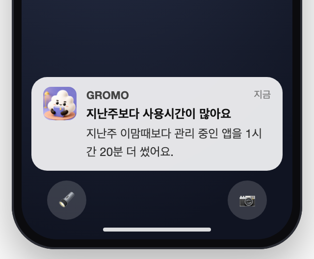
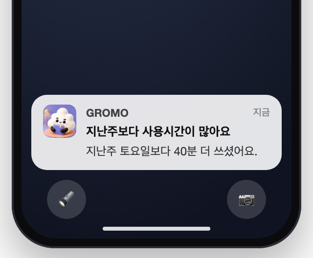
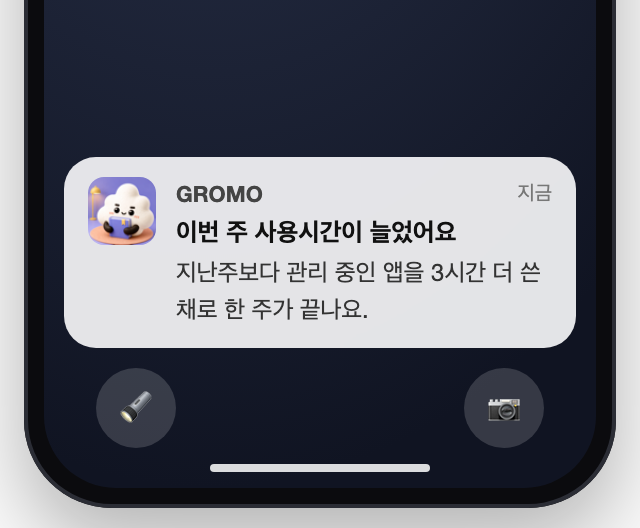
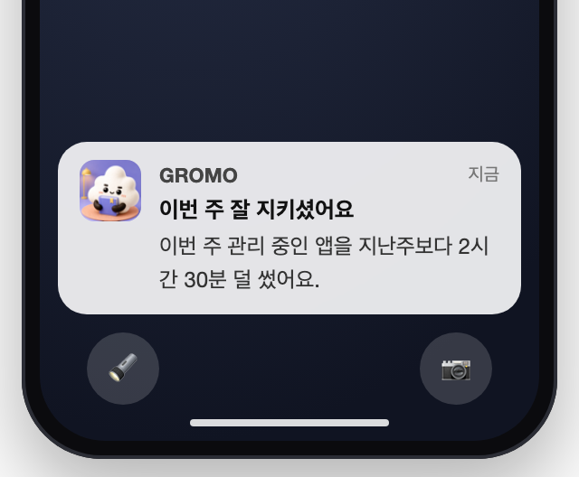
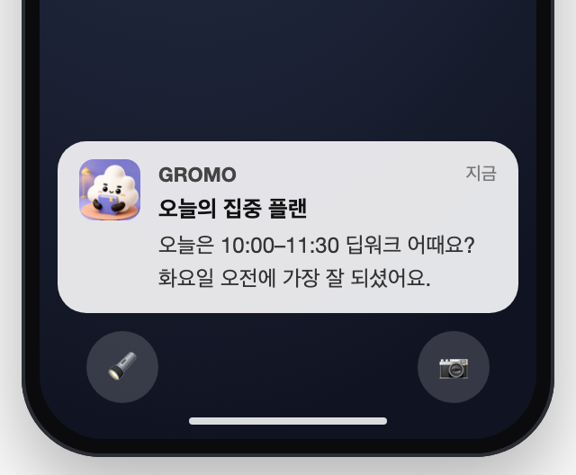
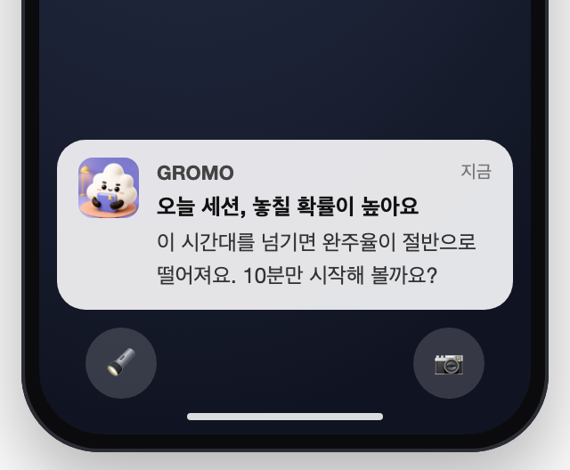
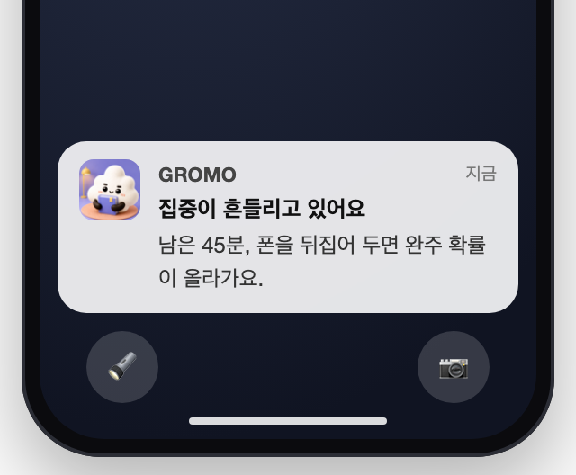
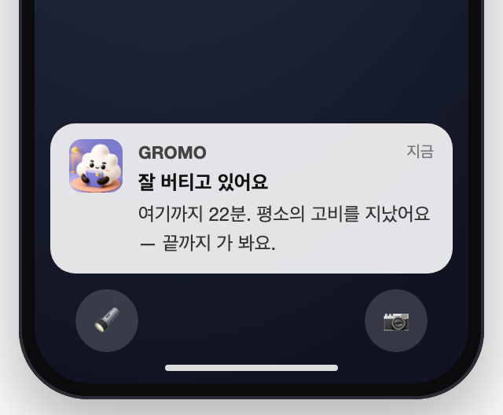
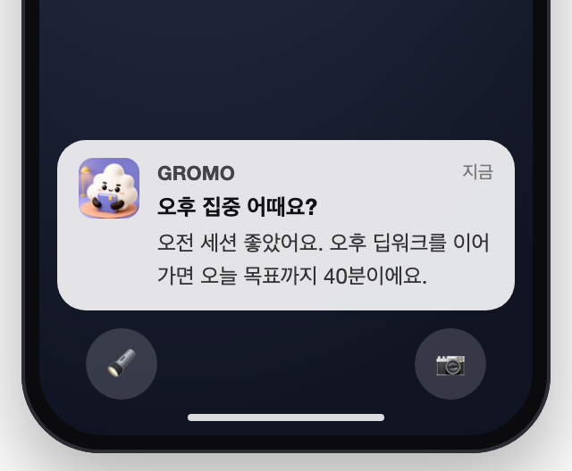
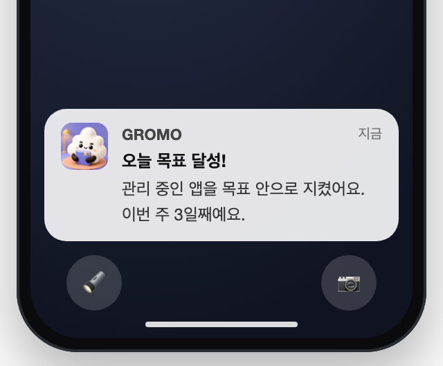

# 지능형 몰입 넛지 (AI 넛지) — 기획안

> 능동적 개입 모델 · 유저 컨텍스트 기반 몰입 최적화
> 상태: **1차 범위 확정 (구현 스펙 미작성)** · 작성일 2026-08-17
> 구현이 어떻게 굴러가는지는 [`study/`](study/README.md) — 모듈별 학습 노트 + 다이어그램

---

## 1. 무엇을 만드는가 — 한 문단

사용자가 **관리 중인 앱을 지난주보다 눈에 띄게 많이 쓰고 있을 때**, 그 사실을 **주가 끝나기
전에** 알려주는 알림이다. 토스가 "이번 달 지출이 지난달보다 늘었어요"를 보내는 것과 같은
형태 — 통계 화면에 들어와야 보이는 숫자를, 손쓸 수 있는 시점에 먼저 건넨다.
반대로 **줄었을 때도 알린다**(격려). 단 경고와 대칭이 아니다 — 이유는 §5에 적는다.

**1차 범위에 AI는 없다.** 규칙 기반 비교 알림이다. 왜 그런지는 §4에 적는다.

---

## 2. 왜 만드는가 — 문제

**사용자 쪽.** 폰을 얼마나 쓰는지는 아무도 실시간으로 세지 않는다. 주말에 통계를 열어보고
"이번 주 많이 썼네" 하고 아는데, **그때는 이미 그 주가 끝나 있다.** 손쓸 수 있는 시점에
아무도 말해주지 않는다.

**제품 쪽.** 현재 gromo의 알림은 **이벤트 반응형**이다. 유저 푸시 크론만 15종이고
(`notification/scheduler/NotificationScheduler.java` — 리그 5종·미접속복귀·순위추월·오늘미집중·
스트릭위기·내기 3종·챌린지 2종·세션오픈. 운영용까지 세면 파일 전체 `@Scheduled`는 17개),
방아쇠는 전부 *앱에서 일어난 사건*이다. **사용자가 지금 어떤 상태인지**는 아무도 보지 않는다.

그 결과가 코드에 그대로 남아 있다:

> *"일 22:00 은 마감 2시간 전 푸시와 겹쳐 focus 넛지가 중복되므로, 겹치지 않는 21시로 분리"*
> — `NotificationScheduler` 스트릭 위기 크론 주석

**크론 시각을 손으로 어긋나게 해서 겹침을 피하고 있다.** 누가 무엇을 언제 받는지 판단하는
층이 없다는 뜻이다.

---

## 3. 의도 — 무엇을 바꾸려는가

> **기록하는 도구 → 아직 늦지 않았을 때 말 거는 도구**

성공은 "알림을 많이 보냈다"가 아니라 **"보낸 알림마다 할 말이 있었다"** 로만 측정한다.
할 말이 없는 날은 보내지 않는다 — 이 기능의 기본값은 **침묵**이다(§7).

---

## 4. 1차에 AI가 없는 이유 — 정직하게

기능 이름은 AI 넛지지만, 1차 범위에는 AI가 들어갈 자리가 없다.

| 기술 | 1차에 필요한가 | 왜 |
| --- | --- | --- |
| 모델 학습 | ❌ | 두 주의 사용 시간을 빼는 **산수**다. 학습할 게 없다. |
| RAG | ❌ | 내 지난주 기록 조회는 **SQL 한 줄**이다. 검색이 아니다. |
| LLM | ❌ | 문구가 "40분 늘었어요"라면 **템플릿이 더 안전하다.** LLM을 끼우면 숫자를 틀릴 위험만 생긴다. |

이름만 AI를 달고 속이 `if`문인 기능은 팀 안에서 먼저 들킨다. **AI는 2차부터 들어온다** —
개인별 데이터가 쌓여 패턴 예측(모델)과 루틴 제안(LLM·RAG)이 실제로 필요해지는 시점이다(§10).
세 기술이 각각 뭘 하는 물건인지는 [`study/05-ai-basics.md`](study/05-ai-basics.md)에 풀어 뒀다.

---

## 5. 어떻게 동작하는가 — 판정 규칙

**매일 21:00 (KST)** 에 판정하고, **조건을 넘은 날에만** 보낸다. 요일 고정 발송이 아니다.

### 비교 방법

이번 주 **월~오늘 누적** vs 지난주 **월~같은 요일 누적**.
단, **양쪽에 모두 데이터가 있는 날짜만 짝지어 합산한다**(교집합 비교). 한쪽에만 있는 날을
그대로 더하면 "두 배 늘었어요"라는 거짓말이 나온다.

### 경고 발송 조건 — 늘었을 때 (모두 충족)

| 조건 | 값 | 이유 |
| --- | --- | --- |
| 증가율 | **+20% 이상** | 비율만 보면 사용량 적은 사람이 10분 차이로 매일 걸린다 |
| 증가량 | **+30분 이상** | 분만 보면 헤비 유저가 안 걸린다 |
| 기준선 | 지난주 **유효일 5일 이상** | 비교할 지난주가 실제로 있는가 |
| 짝맞춤 | 짝지어진 날 **3일 이상** | 비교가 성립하는가 |
| 빈도 | **주 3회 이하 · 연속 2일 금지** | 잔소리로 넘어가는 선 |
| 총량 | 오늘 이 유저가 받은 푸시 **3건 이상**이면 **스스로 침묵** | §8 — 수치는 조정값 |

수치(20%·30분·3회)는 **실데이터를 보고 조정할 값**이다. 정책 문서에 수치로 박되 고정값으로
취급하지 않는다.

### 격려 발송 조건 — 줄었을 때 (비대칭)

| | 경고 | 격려 |
| --- | --- | --- |
| 임계 | +20% AND +30분 | **−20% AND −30분** (대칭) |
| 시점 | 매일 21:00 | **일요일 21:00만** |
| 추가 게이트 | — | **그 주에 측정 대상이 바뀌지 않았을 것** |
| 주 3회 상한 | 경고 + 격려 **합산** | |

**주중에 격려하지 않는 이유.** "이번 주 잘하고 있대"는 **면죄부**가 된다. 주가 끝난 뒤에
말해야 다음 주의 기준선이 되지, 주중에 말하면 남은 날을 쓰라는 허가로 읽힌다.

**측정 대상 게이트가 필요한 이유.** 사용량이 줄어든 이유는 둘이다 — 진짜 덜 썼거나,
**관리 대상 앱을 빼버렸거나**(GROMO-942 "다음날 적용"). 그런데 서버가 받는 건
`actualScreenTimeMinutes`·`screenTimeGoalAchieved`·`reportedAt`·`isFinal` 넷뿐이라
(`ScreenTimeRequest`) **측정 대상이 뭔지도, 바뀌었는지도 모른다.**

오탐의 무게가 방향마다 다르다. 경고 오탐은 사용자가 억울해도 자기가 대상을 늘린 걸 안다.
**격려 오탐은 앱이 사용자를 속이는 것이고, 더 나쁜 건 회피 수단(대상 빼기)을 쓴 사람에게
"잘하고 있어요"라고 보상한다는 점이다.** 게이밍할 수 있는 지표를 칭찬하면 그 지표는 죽는다.

→ **선행 과제**: 앱이 "그 주에 대상이 바뀌었는지"를 boolean 하나로 실어 보내야 한다. 앱은
`gromo:goal:selectionApplyDate`로 이미 알고 있다. **이 계약 없이는 격려를 켤 수 없다.**

### 문구를 만드는 세 축

같은 판정에서 **가장 할 말이 있는 축**을 하나 골라 문구를 만든다. 셋을 다 보내지 않는다.

| 축 | 문구 형태 | 언제 고르는가 |
| --- | --- | --- |
| **누적 대비** | "지난주 이맘때보다 관리 중인 앱을 1시간 20분 더 썼어요" | 기본값 |
| **같은 요일 대비** | "지난주 화요일보다 40분 더 쓰셨어요" | 오늘 하루 증가분이 전체 증가분의 절반 이상일 때 |
| **주 총합 대비** | "지난주보다 관리 중인 앱을 3시간 더 쓴 채로 한 주가 끝나요" | 일요일 |
| **격려** | "이번 주 관리 중인 앱을 지난주보다 2시간 30분 덜 썼어요. 잘 지키셨어요" | 일요일 · 감소 |

### 실제로 받는 화면

| 누적 대비 (수요일) | 같은 요일 대비 (토요일) |
| --- | --- |
|  |  |

| 주 총합 대비 (일요일) | 격려 (일요일 · 감소) |
| --- | --- |
|  |  |

---

## 6. 문구 규칙 — "핸드폰 사용량"이라고 쓰지 않는다

실제로 재는 건 **사용자가 설정에서 고른 앱들**(`gromo:goal:selection`)이다. 인스타·유튜브만
골랐다면 카톡을 아무리 써도 안 잡힌다. 그 상태에서 "핸드폰 사용량이 늘었어요"라고 하면
사용자는 **폰 전체 사용량으로 읽는다. 문구가 정확히 틀린다.**

> ✅ "**관리 중인 앱** 사용이 지난주보다 40분 늘었어요"
> ❌ "핸드폰 사용량이 늘었어요"

토스 알림이 강한 이유는 자주 와서가 아니라 **금액이 정확해서**다. 부정확한 비교는 한 번
들키면 그다음부터 알림 전체가 무시된다.

---

## 7. 침묵이 기본값이다

보내지 않는 것이 실패가 아니다. 아래는 전부 **정상 동작**이다.

- **결측** — 업로드는 앱을 열 때만 되고(`ScreenTimeSyncer`: 앱 시작 + 포그라운드 복귀),
  소급은 "어제" 하루뿐이다. 며칠 안 열면 그 사이는 **영영 결측**이다.
  **결측을 0분으로 채우지 않는다** — 안 쓴 게 아니라 **모르는** 것이다.
- **신규 가입자** — 비교할 지난주가 없다. 아무것도 보내지 않고, 설정 화면에 *"2주 뒤부터
  비교를 보여드려요"* 를 **화면으로** 알린다.
- **스크린타임 권한 거부자** — 영구 무음이다. **권한을 켜달라는 푸시를 보내지 않는다.**
  거부한 사람에게 권한을 조르는 알림은 이 기능이 절대 되어선 안 되는 물건이다.
- **조용한 시간이 21:00을 덮는 유저** — 조용한 시간(quiet hours)은 기본 23:00~07:00이지만
  유저가 바꿀 수 있고, 걸린 푸시는 연기가 아니라 **드랍**된다(`sendIfAllowed`). 유저 설정
  창이 21:00을 포함하면 그 유저는 **영구 무발송**이다 — 정상 동작으로 수용한다.

---

## 8. 기존 알림과의 관계 — 1차에선 권한이 아니라 예의

§2에서 본 대로 발송 판정 층이 없는 게 근본 문제지만, **1차에서 그걸 고치지 않는다.** 기존
알림은 각자 크론에서 자기 판단으로 나가고, 내기 계열은 클레임 파이프라인(선점→이월→flush)까지
물려 있어 중간에 끊으면 클레임이 뜬다.

대신 **AI 넛지가 자기만 물러난다.** 발송 직전에 `notification_sent_logs`로 오늘 이 유저가 이미
받은 푸시 수를 조회하고, 임계(3건)를 넘었으면 **자기가 침묵한다.** 남을 끄는 게 아니라서 기존
발송 파이프라인의 동작은 바꾸지 않는다.

단, **전제가 하나 있다.** 지금 `notification_sent_logs`에 기록을 남기는 건 일부 타입뿐이고
(순위추월·내기·챌린지·세션오픈·친구), **리그 5종·미접속복귀·오늘미집중·스트릭 위기는 로그를
안 남긴다** — 하필 21:00에 도는 푸시들이 그렇다. 총량 조회가 성립하려면 **미로깅 발송
경로에 기록 한 줄씩을 먼저 넣어야 한다**(선행 과제, §13). 같은 21:00분에 도는 크론의
발송은 판정 시점에 아직 로그에 없다는 레이스도 있다 — 판정 크론을 몇 분 뒤로 미는
오프셋이 검토 대상이다.

**진짜 거부권은 알림 서버를 분리하는 시점에 생긴다**(§10).

---

## 9. 성공 기준

| 지표 | 왜 보는가 |
| --- | --- |
| 알림 열람률 | 보낼 때마다 할 말이 있었는가 |
| 발송 다음 날 사용량 변화 | 실제로 행동이 바뀌었는가 |
| **알림 끄기 비율** (반작용) | 도움이 아니라 잔소리로 느껴지는가 |
| **무발송 주 비율** | 침묵이 정상 작동하는가 — 너무 낮으면 임계가 헐겁다 |

셋째 지표가 오르면 앞의 둘이 올라도 **실패로 본다.**

---

## 10. 하지 않는 것 · 후속으로 미루는 것

**1차에서 하지 않는다**

- **감시하지 않는다.** 어떤 앱을 썼는지 캐묻거나 지적하지 않는다.
- **막지 않는다.** 실드(`ShieldAction`·`ShieldConfiguration`) 배선이 이미 있어서 "겸사겸사
  넣자"가 되기 쉬운데, **넛지와 차단은 다른 제품이다.** 감시하지 않겠다고 쓴 문서에서 앱을
  강제로 막으면 그 문장이 거짓말이 된다.
- **권한을 조르지 않는다.**

**후속 단계**

| 순서 | 내용 | 선행 조건 |
| --- | --- | --- |
| 2차 | **AI 도입** — 개인별 패턴 예측(모델), 루틴 제안(LLM·RAG) | 개인별 데이터 축적 |
| 2차 | **아침 루틴 제안** — "오늘은 10:00–11:30 딥워크" | `focus_sessions` 축적량 확인 |
| 후속 | **실드·실시간 차단** — 사용자가 명시적으로 켜는 별도 기능 | 별도 기획 |
| 후속 | **안드로이드** | iOS 검증 후 |
| 후속 | **유저 로컬 시간대** — 발송 필터 전체를 유저 존으로 전환 | 알림 도메인 공사 |
| 후속 | **알림 서버 분리** → AI 넛지에 실제 거부권 부여 | 인프라 |

### 2차 알림 시안 — 구현이 끝난 뒤의 하루

| 08:00 아침 루틴 | 09:58 이탈 예고 | 10:15 행동적 개입 |
| --- | --- | --- |
|  |  |  |
| 세션 30건+ · 완주율 모델 | 이탈 예측 모델 | ⚠ **하트비트 없음 — 불가** |

| 10:22 정서적 개입 | 14:07 재진입 | 21:40 성취 |
| --- | --- | --- |
|  |  |  |
| ⚠ **하트비트 없음 — 불가** | ✅ 지금 데이터로 가능 | ✅ 지금 데이터로 가능 |

21:40 성취는 "지금 데이터로 가능"이지만 **기존 목표 달성 알림과 겹친다** — 서버는 이미
final 보고에서 달성 알림을 발사하고(`ScreenTimeRequest` 주석) 앱에도 달성 축하 예약이
있다. 켜기 전에 중복 정리가 선행이다.

**세션 중 개입 둘(10:15·10:22)이 7분 간격이라는 점을 주목한다.** 한 세션 안에서 두 번
개입하는 셈이라 실제로 이렇게 보내면 잔소리다. 2차를 설계할 때 **"세션당 개입 1회"** 규칙이
필요하다는 신호다 — 1차의 「연속 2일 금지」와 같은 문제가 세션 단위에서 다시 나온다.

---

## 11. 측정의 한계 — 알고 시작한다

이 기능이 **원리적으로 알 수 없는 것들**이다. 나중에 "왜 안 되지?"로 다시 논의되지 않도록
적어둔다.

- **어떤 앱인지 모른다.** 앱 이름이 보이는 곳은 `screentimereport` 익스텐션 안뿐인데, Apple이
  이 익스텐션의 **네트워크·데이터 반출을 막았다.** 그래서 이 레포는 숫자를 가져오는 대신
  네이티브 뷰를 통째로 RN에 꽂아 화면에만 그린다(`ScreenTimeReportViewManager`). 우회가 아니라
  항복이다 — 다른 길이 없다.
- **몇 시에 썼는지는 기기에만 있다.** `GromoScreenTimeMonitor`가 `usageBucketEvents`에 임계값
  발화 타임라인을 남기지만, 서버로 올리는 계약이 없다. 1차는 **일 총량만** 쓴다.
- **iOS 총량은 15분 눈금의 도달 최고값** — 근사다. 증가율 계산이 이 해상도 위에서 돈다.
- **판정 시점(21:00)의 "오늘"은 부분값이다.** 마지막 업로드까지의 값과 지난주 **종일**
  확정값을 짝지으므로, 경고는 체계적으로 축소되고 감소(격려) 방향으로 편향된다 —
  "같은 요일 대비" 축이 가장 크게 왜곡된다. 오늘을 비교에서 빼는(월~어제) 안은 §13.
- **부분값이 영구 확정되는 날이 있다.** 소급이 어제 하루뿐이라, D일 낮에 부분값을 올리고
  이틀 뒤에 앱을 열면 D의 기록은 **그 낮까지의 값으로 영영 남는다**
  (`is_screen_time_finalized = false`). row가 있다고 온전한 하루가 아니다.
- **플랫폼마다 감지 가능한 신호가 다르다.** 안드로이드 `UsageStatsManager`는 앱별·시간대별
  정확값을 준다(`ScreenTimeModule.ts`: *"안드로이드는 오늘 0시~지금 queryEvents 정확값"*).
  **즉 안드로이드에서 만든 판정을 iOS로 이식할 수 없다** — iOS가 그 입력을 못 준다.
  안드로이드는 심화 가설의 **측정 실험실**로 쓰고, 공통 신호(일 총량)로만 양쪽을 맞춘다.

---

## 12. 용어

| 용어 | 뜻 | 쓰지 말 것 |
| --- | --- | --- |
| **관리 중인 앱** | 사용자가 설정에서 고른 측정 대상 앱·카테고리 묶음 | "핸드폰", "스크린타임 전체" |
| **유효일** | 총량(분)이 **null이 아닌** row가 있는 날 — 분 컬럼은 null 허용이라 row 존재만으론 부족 | 결측일을 0분으로 셈하는 것 · row 개수를 유효일로 셈하는 것 |
| **짝맞춤 비교** | 양쪽 주에 모두 데이터가 있는 날짜만 합산해 비교 | 한쪽에만 있는 날을 포함한 합산 |
| **침묵** | 조건 미달로 보내지 않음 — 정상 동작 | "발송 실패" |
| **넛지** | 사후 통보. 사용자가 스스로 판단 | 차단·강제(그건 실드, 별개 기능) |
| **경고 넛지** | 사용이 늘었을 때 — 매일 판정 | |
| **격려 넛지** | 사용이 줄었을 때 — 일요일만, 대상 변경 없을 때만 | 주중 발송, 대상 변경 주 발송 |

---

## 13. 다음 단계

이 문서는 **"무엇을·왜"** 까지다. 아직 정하지 않은 것:

- 임계값(20%·30분·주3회·일3건)의 실데이터 검증
- **측정 대상 변경 boolean의 업로드 계약** — 격려의 선행 조건(§5)
- **`notification_sent_logs` 커버리지 확장** — 리그·미접속복귀·오늘미집중·스트릭이 미기록.
  총량 게이트(§8)의 선행 조건 + 판정 크론 오프셋(21:05 등) 여부
- **비확정 row(`is_screen_time_finalized = false`)의 취급** — 유효일로 칠 것인가(§11)
- **비교 창** — "월~오늘(부분값 편향 수용)" vs "월~어제(하루 늦지만 대칭)" (§11)
- **연속 2일 금지의 세부** — 경고·격려 종류 불문인가, 주 경계(일→월)를 넘어도 적용인가.
  현행 해석(종류 불문·경계 무시)이면 토요일 경고가 일요일 격려를 침묵시킨다
- 문구 카피 확정
- 스키마·API·시퀀스 (`low-level-design.md`)
- 정책 결정 로그 (`policy.md`)

동작 확인용 시뮬레이터: **`ui.html`** — 판정 규칙이 실제로 도는 화면이다.
알림 이미지: **`screens/noti-p1-*.png`**(1차 4종) · **`screens/noti-p2-*.png`**(2차 시안 6종).
구현 학습 노트: **`study/`** — 모듈별로 어떻게 굴러가는지 다이어그램과 함께 정리.
