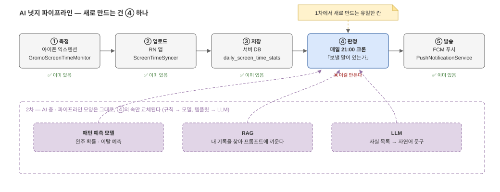

# 01. 전체 그림 — 새로 만드는 건 사실상 한 칸이다

## 파이프라인 5단계

이 기능은 처음부터 끝까지 다섯 단계다.

*편집: [`01-big-picture.drawio`](diagrams/01-big-picture.drawio)*

| 단계 | 하는 일 | 지금 있나 |
| --- | --- | --- |
| ① 측정 | 아이폰이 "관리 중인 앱"의 오늘 사용 시간을 잰다 | ✅ 이미 있음 (`GromoScreenTimeMonitor` 익스텐션) |
| ② 업로드 | 앱이 그 숫자를 서버에 보낸다 | ✅ 이미 있음 (`ScreenTimeSyncer` → `POST /screen-time`) |
| ③ 저장 | 서버가 날짜별 총량으로 쌓는다 | ✅ 이미 있음 (`daily_screen_time_stats` 테이블) |
| ④ **판정** | **매일 21:00에 지난주와 비교해 "보낼 말이 있는가"를 정한다** | ❌ **이걸 만든다** |
| ⑤ 발송 | FCM으로 푸시를 쏜다 | ✅ 이미 있음 (`PushNotificationService`) |

**①②③⑤는 전부 이미 돌아가고 있다.** 스크린타임 목표 기능(통계 화면)이 쓰려고
만들어 둔 것들이다. AI 넛지 1차가 새로 만드는 것은 ④ **판정 엔진 하나** — 크론 트리거
1개, 비교 쿼리 1개, 게이트 체인, 문구 템플릿 4벌이 전부다.

이게 prd.md §4에서 "1차에 AI가 없다"고 말한 것의 구현 쪽 의미다. 파이프라인의
9할이 재사용이고, 새 칸의 속은 산수다.

## 그럼 뭐가 어려운가

산수 자체가 아니라 **산수를 언제 하면 안 되는지** 판단하는 부분이다.

- 지난주 데이터가 며칠 비어 있으면? → 비교 자체가 거짓말이 된다 (→ [03. 판정 엔진](03-rule-engine.md))
- 데이터는 왜 비는가? → 업로드가 앱을 열 때만 되기 때문 (→ [02. 데이터 파이프라인](02-data-pipeline.md))
- 조건을 넘어도 못 보내는 경우는? → 조용한 시간·일일 총량 (→ [04. 발송](04-delivery.md))

문서 세 편이 각각 이 세 문제를 다룬다.

## 2차 미리보기 — AI는 어디에 끼는가

2차에서 AI가 들어와도 **파이프라인 모양은 안 바뀐다.** ④ 판정의 "규칙"이 "모델
예측"으로, 문구의 "템플릿"이 "LLM 생성"으로 교체될 뿐이다. 위 그림의 아래쪽
점선 층이 그 자리다. 자세한 건 [06. 2차 설계](06-phase2.md).
