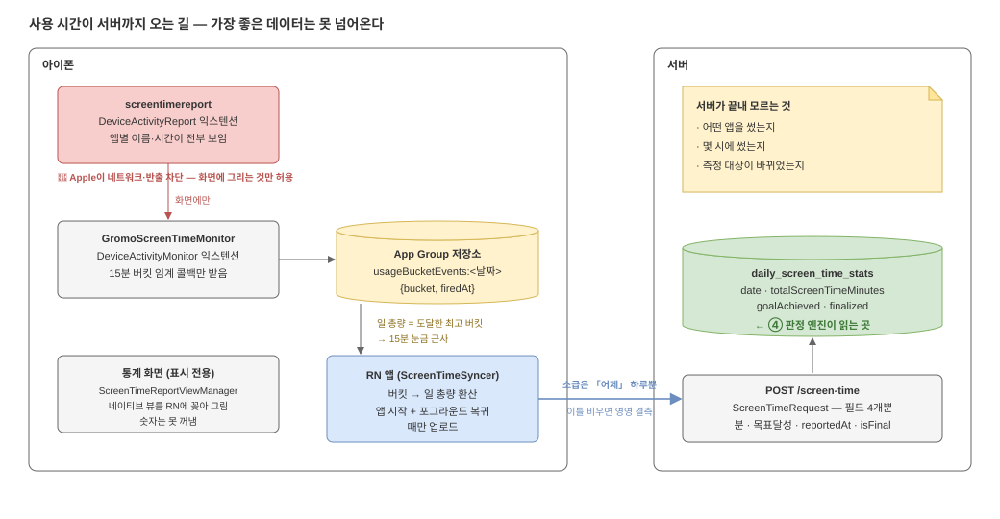

# 02. 데이터 파이프라인 — 숫자가 서버까지 오는 길

판정 엔진(④)의 입력은 서버에 쌓인 날짜별 사용 시간이다. 그 숫자가 **어디서 태어나서
어떤 길로 오는지**를 알아야, 판정 규칙의 절반(결측 처리·짝맞춤·15분 눈금)이 왜
존재하는지 이해된다.



*편집: [`02-data-pipeline.drawio`](diagrams/02-data-pipeline.drawio)*

## 아이폰 안에는 세 조각이 있다

iOS의 스크린타임 API는 **하나의 앱이 아니라 세 개의 조각**으로 쪼개져 있고, 조각마다
볼 수 있는 것과 내보낼 수 있는 것이 다르다.

| 조각 | 정체 | 보는 것 | 내보낼 수 있나 |
| --- | --- | --- | --- |
| `screentimereport` | DeviceActivityReport 익스텐션 | **앱별 이름·시간 전부** | ❌ Apple이 네트워크·반출을 막음. 화면에 그리는 것만 허용 |
| `GromoScreenTimeMonitor` | DeviceActivityMonitor 익스텐션 | 아무것도 못 봄. "누적이 N분을 넘었다"는 **임계 콜백만** 받음 | △ App Group 저장소에 쓰는 것만 가능 |
| RN 앱 본체 | gromo 앱 | App Group에 남은 이벤트 | ✅ 서버 업로드 |

**가장 좋은 데이터(앱별 상세)를 가진 조각이 하필 반출 금지다.** 그래서 이 레포는
통계 화면에서 숫자를 가져오는 대신 네이티브 뷰를 통째로 RN에 꽂아 **화면에만
그린다**(`ScreenTimeReportViewManager`). 서버로 올 수 있는 건 Monitor 익스텐션이
App Group에 남긴 **15분 버킷 임계 이벤트**(`usageBucketEvents:<날짜>`)를 앱이 읽어
환산한 **일 총량 하나**다.

## 일 총량이 "15분 눈금 근사"인 이유

Monitor는 "누적 15분 도달", "누적 30분 도달"… 같은 임계를 밟을 때마다 이벤트를
남긴다. 앱은 **그날 도달한 최고 버킷**을 총량으로 삼는다. 즉 실제 사용이 44분이어도
서버에 도착하는 값은 30분이다. 판정 엔진의 ±20%·30분 임계가 이 해상도 **위에서**
돈다는 걸 잊으면 안 된다 — 눈금보다 작은 차이를 논하는 규칙은 만들 수 없다.

## 업로드는 "앱을 열 때"만 일어난다

`ScreenTimeSyncer`가 업로드를 쏘는 시점은 **앱 시작 + 포그라운드 복귀** 두 번뿐이고,
소급은 **어제 하루**까지만 한다. 여기서 결측의 구조가 나온다:

```
월  앱 엶     → 월요일 업로드 ✅
화  앱 안 엶  → (없음)
수  앱 안 엶  → (없음)
목  앱 엶     → 목요일 + 수요일(어제 소급) 업로드 ✅
                화요일은 영영 결측 ❌
```

- 결측은 "안 쓴 날"이 아니라 **"모르는 날"** 이다. 0분으로 채우는 순간 비교가 거짓말이 된다.
- 결측엔 변종이 하나 더 있다 — **row는 있는데 부분값인 날.** D일 낮에 앱을 열어 그때까지의
  값이 올라가고, 다음날 앱을 안 열면 D는 마감(소급) 기회를 영영 놓친다. 그 낮까지의 값이
  `is_screen_time_finalized = false`인 채로 **영구히 남는다.** row 존재 ≠ 온전한 하루.
- 서버 API 문서에 "매일 23:59 업로드"라고 적혀 있어도 **그런 스케줄러는 없다.** 실제
  트리거는 위 두 개가 전부다 — 주석이 아니라 코드(`ScreenTimeSyncer.tsx`)가 정본이다.

## 서버에 도착하는 것 — 4개 필드가 전부

`POST /screen-time`(`ScreenTimeRequest`)이 받는 건 네 개다:

| 필드 | 뜻 |
| --- | --- |
| `actualScreenTimeMinutes` | 그날 총량 (15분 눈금) |
| `screenTimeGoalAchieved` | 목표 달성 여부 |
| `reportedAt` | 언제 잰 값인지 |
| `isFinal` | 그날이 끝난 뒤의 확정값인지 |

저장은 `daily_screen_time_stats` 한 테이블 — **비교 계산은 이 테이블만 읽으면 된다**
(발송 이력 게이트 ⑦⑧⑨는 `notification_sent_logs`를 따로 읽는다, [04](04-delivery.md)).
단 컬럼 두 개를 조심해야 한다: `total_screen_time_minutes`는 **null 허용**(미집계 ≠ 0분)
이고, `is_screen_time_finalized`가 확정/비확정을 가른다. 그래서 **유효일 = 분이 null이
아닌 날**이지, row가 있는 날이 아니다(정의 정본: prd §12).

## 서버가 끝내 모르는 것

| 모르는 것 | 왜 | 판정에 주는 제약 |
| --- | --- | --- |
| 어떤 앱을 썼는지 | Report 익스텐션 반출 금지 | "인스타를 줄이세요" 같은 문구 불가 → "관리 중인 앱" 총칭만 |
| 몇 시에 썼는지 | 버킷 타임라인이 기기에만 있음 (업로드 계약 없음) | "새벽 사용" 판정 불가 → 1차는 일 총량만 |
| 측정 대상이 바뀌었는지 | `gromo:goal:selection`은 기기 로컬 | 격려 넛지의 게이밍 구멍 → boolean 업로드 계약이 선행 과제 (prd §5) |

이 표가 [03. 판정 엔진](03-rule-engine.md)의 게이트들과 [06. 2차 설계](06-phase2.md)의
"하트비트 없이는 불가" 판정의 근거다.

> ⚠ 측정 한계의 정본은 [`../prd.md`](../prd.md) §11 — 이 표는 "판정에 주는 제약"
> 열을 덧붙인 설명용 사본이다.
