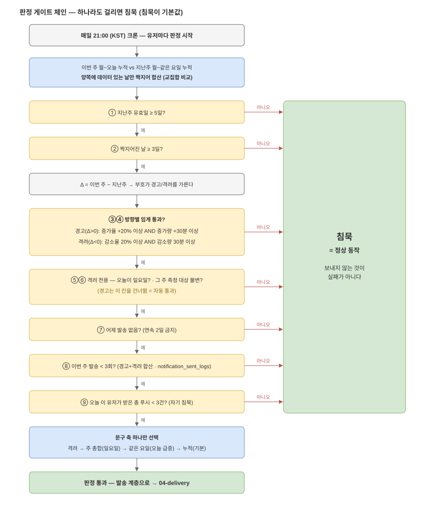

# 03. 판정 엔진 — 9개 게이트를 다 통과해야 알림 1건

1차에서 새로 만드는 유일한 모듈이다. 매일 21:00(KST) 크론이 유저마다 이 체인을
돌리고, **게이트 하나라도 걸리면 침묵한다.** 침묵은 실패가 아니라 이 기능의
기본값이다(prd §7).



*편집: [`03-rule-gates.drawio`](diagrams/03-rule-gates.drawio)*

## 비교 계산 — 교집합 합산을 손으로 따라가 보기

"이번 주 월~오늘 누적 vs 지난주 월~같은 요일 누적"인데, **양쪽에 모두 데이터가 있는
날만** 짝지어 더한다. 왜 그래야 하는지는 숫자로 보면 바로 보인다. 오늘이 수요일이고
데이터가 이렇다고 하자 (—는 결측):

| | 월 | 화 | 수 | 그냥 합산 | 교집합 합산 |
| --- | --- | --- | --- | --- | --- |
| 지난주 | 120분 | — | 110분 | 230분 | 230분 (월+수) |
| 이번 주 | 130분 | 140분 | 125분 | **395분** | 255분 (월+수) |

그냥 합산하면 "지난주보다 **+72%** 늘었어요"가 나온다 — 화요일이 지난주에 결측이라
비교 대상이 없는데 이번 주 것만 더해진 탓이다. 교집합으로 짝을 맞추면 **+11%**.
진짜 변화는 후자다. **결측을 0분으로 채우는 것도 같은 거짓말의 반대 방향이다** —
안 쓴 게 아니라 모르는 것이기 때문에([02](02-data-pipeline.md)), 그 날은 비교에서
빼는 게 유일하게 정직한 처리다.

교집합으로도 못 잡는 비대칭이 하나 남는다: 판정 시점(21:00)의 **"오늘"은 부분값**인데
지난주 같은 요일은 종일 확정값이다 — 경고 축소·격려 과대 방향의 편향이다(prd §11,
비교 창 변경안은 prd §13).

## 게이트 9개 — 순서와 이유

| # | 게이트 | 걸리면 | 이유 |
| --- | --- | --- | --- |
| ① | 지난주 유효일 ≥ 5일 | 침묵 | 비교할 지난주가 실제로 있는가. 신규 가입자도 여기서 걸러진다. 유효일 = **분이 null 아닌 날** — row 개수가 아니다([02](02-data-pipeline.md)) |
| ② | 짝지어진 날 ≥ 3일 | 침묵 | 교집합이 너무 작으면 비교 자체가 성립 안 함 |
| ③ | 변화율 ±20% 이상 | 침묵 | 비율만 보면 라이트 유저가 10분 차이로 매일 걸린다 |
| ④ | 변화량 ±30분 이상 | 침묵 | 분만 보면 헤비 유저가 안 걸린다. **15분 눈금의 2칸**이기도 하다 |
| ⑤ | (격려만) 오늘이 일요일 | 침묵 | 주중 격려는 "남은 날 써도 된다"는 면죄부가 된다 |
| ⑥ | (격려만) 그 주 측정 대상 불변 | 침묵 | 대상 앱을 빼서 줄인 사람을 칭찬하면 지표가 죽는다. **boolean 업로드 계약이 선행 과제** |
| ⑦ | 어제 발송 없음 | 침묵 | 연속 2일이면 잔소리 |
| ⑧ | 이번 주 발송 < 3회 (경고+격려 합산) | 침묵 | 주간 상한 |
| ⑨ | 오늘 이 유저가 받은 총 푸시 < 3건 | 침묵 | 다른 알림이 많이 나간 날은 **자기가 물러난다**(prd §8) |

> ⚠ 이 표는 **설명용 사본**이다. 수치(20%·30분·3회)와 조건의 정본은
> [`../prd.md`](../prd.md) §5 — 값이 바뀌면 prd만 고치고, 여기는 따라 읽는다.

①~④는 "**보낼 말이 있는가**", ⑤~⑥은 "**칭찬해도 되는가**", ⑦~⑨는 "**지금 말해도
되는가**"다. 층이 다르다는 걸 기억하면 순서를 외울 필요가 없다.

⑦⑧의 발송 이력과 ⑨의 총 푸시 수는 기존 `notification_sent_logs` **테이블**을 쓴다 —
새 테이블은 필요 없다. 단 **기록이 일부 타입에만 있다**: 지금 로그를 남기는 건
순위추월·내기·챌린지·세션오픈·친구뿐이고, **리그 5종·미접속복귀·오늘미집중·스트릭 위기는
안 남긴다.** 하필 21:00에 도는 푸시들이 미기록 쪽이라, ⑨가 성립하려면 **미로깅 발송
경로에 기록 추가가 선행 과제**다(prd §8·§13). 같은 분에 도는 크론의 발송이 판정 시점에
아직 로그에 없는 레이스도 있다 — 판정 크론 오프셋(21:05 등)이 검토 대상.

## 문구 축 선택 — 판정 하나에 문구 하나

모든 게이트를 통과하면 **가장 할 말이 있는 축 하나만** 골라 템플릿을 채운다:

```
if 격려          → "…지난주보다 N시간 덜 썼어요. 잘 지키셨어요"
elif 일요일       → 주 총합: "…N시간 더 쓴 채로 한 주가 끝나요"
elif 오늘 증가분이 전체 증가분의 절반 이상
                 → 같은 요일: "지난주 화요일보다 N분 더 쓰셨어요"
else             → 누적(기본): "지난주 이맘때보다 N분 더 썼어요"
```

셋 다 보내는 게 아니다. 숫자는 항상 서버가 계산해 템플릿에 박는다 — 문장을 만들
줄 아는 모듈(LLM)이 없어도 되는 이유고, 2차에 LLM이 들어와도 **숫자만은 계속
코드가 계산**해야 하는 이유다([05](05-ai-basics.md)).

## 어디까지 검증됐나

이 체인은 `../ui.html`의 `judge()` 함수로 이미 구현되어 돌아간다 — 프리셋 7개
(평온한 주·폭증한 주·조금씩만 늘어난 주·주말만 폭발·줄어든 주·결측 많은 주·신규 가입자)
와 토글 2개(측정 대상 변경·오늘 다른 푸시 수)로 모든 게이트의 발화·침묵을 확인했다.
서버 구현의 출발점으로 삼되, **시뮬레이터가 못 보는 것 두 가지**는 구현 때 따로 정한다:
주 경계(일요일 발송 → 월요일의 연속 2일 판정 — 시뮬레이터는 주 단위로 리셋된다)와
부분일 편향(위 절). 미정 사항 정본은 prd §13.
