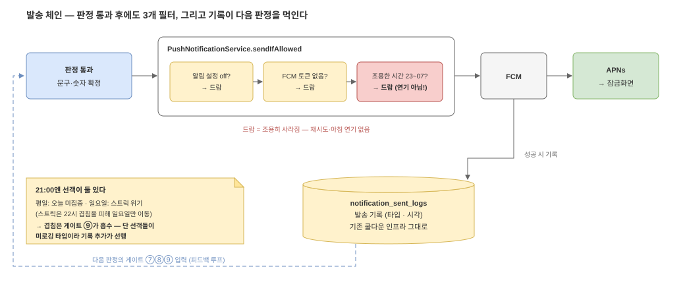

# 04. 발송 — 판정을 통과해도 3개 필터가 더 남아 있다

판정 엔진이 "보낸다"고 결정해도 그 푸시가 잠금화면까지 가는 길에는 **기존 알림
인프라의 필터 체인**이 있다. 전부 이미 있는 코드다 — 우리는 그 위에 올라탄다.

*편집: [`04-delivery-chain.drawio`](diagrams/04-delivery-chain.drawio)*

## 크론은 어디에 꽂히나

`NotificationScheduler`에는 이미 크론 트리거가 여럿 있다(유저 푸시 15종 — 리그 5종·
미접속복귀·순위추월·오늘미집중·스트릭위기·내기 3종·챌린지 2종·세션오픈). AI 넛지의
21:00 판정은 여기에 **트리거 하나**로 추가된다.

그런데 21:00에는 이미 선객이 **둘** 있다: 평일(월~금)엔 **오늘 미집중 푸시**, 일요일엔
**스트릭 위기 푸시**다. 스트릭은 원래 22시인데 일요일만 마감 푸시와 겹쳐 21시로 옮겨
왔다:

> *"일 22:00 은 마감 2시간 전 푸시와 겹쳐 focus 넛지가 중복되므로, 겹치지 않는 21시로 분리"*
> — `NotificationScheduler` 스트릭 위기 크론 주석

우리까지 21:00에 들어가면 겹침이 또 생기는데, 이번엔 시각을 손으로 옮기는 대신(prd §2가
문제 삼은 바로 그 방식) **판정 엔진의 총량 게이트(⑨ 오늘 푸시 < 3건)가 흡수한다.**
단 ⑨에는 선행 과제가 있다 — 하필 그 21:00 선객들(오늘미집중·스트릭)이 지금
`notification_sent_logs`에 **기록을 안 남기는 타입**이라, 미로깅 경로에 기록부터
넣어야 세어진다([03](03-rule-engine.md)의 ⑦⑧⑨ 절, prd §13).

## sendIfAllowed 필터 체인 — 셋 다 "드랍"이다

`PushNotificationService.sendIfAllowed`는 발송 직전에 순서대로 거른다:

| 필터 | 걸리면 | 주의 |
| --- | --- | --- |
| 유저가 알림 설정 off | 드랍 | |
| FCM 토큰 없음 | 드랍 | 로그아웃·재설치 직후 상태 |
| 조용한 시간(quiet hours, 기본 23:00–07:00 KST) | **드랍 — 연기가 아니다** | 아침에 다시 안 온다 |

셋째 줄이 중요하다. 조용한 시간에 걸린 푸시는 **아침으로 미뤄지는 게 아니라 그냥
사라진다.** 우리 발송 시각이 21:00인 건 기본 창(23~07시)을 피하는 선택이기도 하다.
그리고 이 창은 **유저가 바꿀 수 있다** — 유저 설정 창이 21:00을 덮으면 그 유저는
이 기능을 **영구히 못 받는다**(정상 동작으로 수용, prd §7). 발송 시각을 나중에
바꾸게 되면 이 창부터 다시 봐야 한다.

## 발송 후 — 기록이 다음 판정의 입력이 된다

발송에 성공하면 `notification_sent_logs`에 타입·시각을 남긴다. 이 테이블은 이미
타입별 쿨다운(순위추월 48h·주 2회 등)에 쓰이고 있고, **판정 엔진의 게이트 ⑦(연속
2일 금지)·⑧(주 3회)·⑨(오늘 총량)가 전부 이 테이블 조회다.** 즉 발송과 판정이 같은
장부를 읽고 쓰는 **피드백 루프**다 — 기록을 빼먹으면 다음 날 게이트가 전부
헐거워진다.

## 1차에서 실제로 추가하는 것

| 추가물 | 어디에 | 크기 |
| --- | --- | --- |
| 크론 트리거 1개 (21:00 KST, 오프셋 검토) | `NotificationScheduler` | 메서드 1개 |
| 판정 엔진 ([03](03-rule-engine.md)) | 신규 서비스 | 이 기능의 본체 |
| 발송 기록 타입 2종 (경고/격려) | `notification_sent_logs`의 `type` — **평문 문자열**이다 (`NotificationType` 같은 enum은 없다. domain의 enum은 `NotificationSendStatus`뿐) | 문자열 2개 |
| **미로깅 타입에 기록 추가** | 리그·미접속복귀·오늘미집중·스트릭 발송 경로 | 게이트 ⑦⑧⑨의 선행 과제 |
| 문구 템플릿 4벌 | 누적·같은 요일·주 총합·격려 | 문자열 4개 — LLM 아님 |

발송 **필터 체인**(sendIfAllowed)은 한 줄도 안 고친다. 단 넷째 줄대로, 총량 게이트가
남이 보낸 걸 세려면 기존 미로깅 발송 경로에 **기록 한 줄씩은** 넣어야 한다 — 남을
끄는 게 아니라 남이 보낸 걸 세는 것이므로, 자기만 물러나는 구조(prd §8)는 유지된다.
