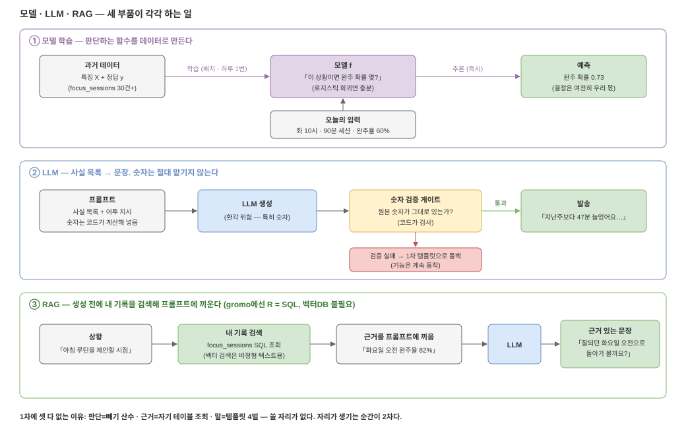

# 05. AI 기초 — 모델·LLM·RAG가 실제로 뭘 하는 물건인지

2차 설계([06](06-phase2.md))를 읽기 전에 필요한 만큼만. 세 단어가 전부 다른 물건이고,
각각 gromo에서 뭘 맡게 되는지까지 연결한다.



*편집: [`05-ml-rag-llm.drawio`](diagrams/05-ml-rag-llm.drawio)*

## ① 모델 학습 — 규칙을 사람이 쓰는 대신, 데이터로 함수를 만든다

1차 판정 엔진은 사람이 쓴 함수다: `if 증가율 ≥ 20% and 증가분 ≥ 30 → 경고`.
임계값 20, 30을 **우리가 정했다.**

모델 학습은 그 함수를 **데이터가 정하게** 하는 것이다. 재료는 두 가지:

- **특징(feature)** — 판단에 쓸 입력들. 예: 세션 시작 시각, 요일, 세션 길이, 최근 2주 완주율
- **정답(label)** — 과거에 실제로 일어난 결과. 예: 그 세션을 완주했나 (`COMPLETED` vs `CANCELED`)

> ⚠ 라벨 품질 함정 둘: ① `FocusSessionStatus`에는 `AUTO_CLOSED`(방치된 세션을 서버가
> 나중에 일괄 마감한 것 — 실제로 언제 끝났는지 모름)도 있다. 이걸 "완주 실패"로 세면
> 라벨이 오염된다 — **학습 데이터에서 제외**가 기본값. ② 레거시 경로로 **완주했는데
> `ACTIVE`로 남은 세션**도 있다(GROMO-610 시절). 그래서 코드베이스의 완주 필터 관례가
> `status = COMPLETED`가 아니라 `NOT IN (CANCELED, AUTO_CLOSED)`다 — **라벨도 이 관례를
> 따른다.** "COMPLETED만 완주"로 세면 레거시 완주가 통째로 빠진다.

과거 기록 수십~수백 건을 (특징, 정답) 쌍으로 넣고 "특징 → 정답을 가장 잘 맞히는
함수"를 찾게 하는 게 **학습(training)** 이고, 그렇게 나온 함수(= 숫자 뭉치 파일)가
**모델**이다. 새 입력을 모델에 넣어 답을 받는 게 **추론(inference)** 이다:

```
학습 (배치 — 하루 1번이면 충분):
  focus_sessions 과거 기록 → [학습] → 모델 f

추론 (판정 시점에 즉시):
  f(화요일, 오전 10시, 90분 세션, 최근 완주율 60%) = 완주 확률 0.73
```

알아둘 것 세 가지:

- **모델은 확률을 내놓지 결정을 내리지 않는다.** "0.73이면 보낸다/안 보낸다"의
  임계는 여전히 우리가 정한다 — 1차의 게이트 설계 경험이 그대로 쓰인다.
- **데이터가 없으면 아무것도 아니다.** 세션 30건도 없는 유저에겐 학습할 재료가 없다.
  2차 선행 조건이 전부 "데이터 축적"인 이유다.
- **모델은 유저마다 하나씩 만드는 게 아니다.** 30건으로 유저별 모델을 학습하면 노이즈만
  배운다. 기본형은 **전 유저 데이터로 전역 모델 하나**를 만들고, 유저별 차이(그 유저의
  최근 완주율·선호 시간대)는 **특징으로 입력**하는 것이다. "유저당 30건+"은 그 유저의
  특징과 라벨이 의미를 갖기 시작하는 선이지, 그 유저 전용 모델의 학습량이 아니다.
- 이 규모에선 거창한 딥러닝이 아니라 **로지스틱 회귀 수준**(엑셀 추세선의 분류 버전)
  으로 시작한다. 그것도 모델이다.

## ② LLM — 다음 단어 예측기. 사실을 주면 문장으로 바꿔 준다

LLM(대형 언어 모델)은 "지금까지의 글 다음에 올 말"을 예측하는 모델을 아주 크게
만든 것이다. 우리가 쓰는 용도는 하나: **사실 목록 → 자연스러운 문장.**

```
입력(프롬프트): "사실: 지난주 대비 +47분. 화요일 오전 완주율 높음.
                어투: 토스처럼 담백하게. 한 문장."
출력:          "지난주보다 47분 늘었어요. 잘되던 화요일 오전으로 돌아가 볼까요?"
```

**치명적 약점이 환각(hallucination)이다** — 그럴듯한 거짓을 지어낸다. 특히 숫자를.
"+47분"을 "+40분쯤"으로 바꿔 쓰는 순간 prd §6의 원칙("정확해서 강하다")이 무너진다.
그래서 역할을 강제로 쪼갠다:

> **숫자는 항상 코드가 계산하고, LLM은 표현만 만진다.**
> 생성된 문장에 원본 숫자가 들어 있는지 **코드로 검증**하고, 실패하면 1차의 템플릿으로
> 폴백한다. 검증은 문자열 그대로 비교가 아니라 **표기 정규화 후 대조**다 — "1시간
> 20분"과 "80분"은 같은 값이니, 문장에서 시간 표현을 뽑아 분으로 환산해 맞춘다.
> 안 그러면 정상 문장이 매번 폴백으로 떨어진다.

이 검증 게이트 덕에 LLM이 죽거나 미쳐도 기능은 1차 수준으로 동작한다. 호출 비용과
지연이 있으므로 발송 직전 실시간 호출보다 **배치 사전 생성**(21:00 판정 때 함께)이
기본이다.

## ③ RAG — LLM은 내 DB를 모른다. 검색해서 끼워 준다

LLM은 학습 시점의 일반 지식만 안다. **재영님네 DB에 뭐가 있는지 모른다.** 그렇다고
유저의 전체 기록을 매번 프롬프트에 다 넣을 수도 없다. 그래서:

```
상황 발생 → 관련된 내 기록만 검색 → 프롬프트에 끼움 → LLM 생성
```

이 구조가 RAG(Retrieval-Augmented Generation, 검색 증강 생성)다. 핵심은
"**생성하기 전에 근거를 조회해서 끼운다**"는 구조이지, 특정 기술 스택이 아니다.

- 흔히 RAG = 벡터DB로 알려져 있는데, 벡터 검색은 **비정형 텍스트에서 의미가 비슷한
  것**을 찾을 때 필요한 도구다 (예: 회사 문서 검색 챗봇).
- gromo의 데이터는 `focus_sessions`, `daily_screen_time_stats` 같은 **정형
  테이블**이다. "이 유저가 언제 잘 집중했나"는 **SQL로 정확하게** 뽑힌다.
  → **2차에서도 벡터DB는 필요 없다. RAG의 R은 SQL이다.** prd §4의 "RAG ❌ — SQL
  한 줄" 판정은 2차에서도 절반쯤 유효하고, 바뀌는 건 조회 결과를 LLM에게 먹인다는
  점뿐이다.

## 셋을 조립하면 — 아침 루틴 제안 한 건의 해부

2차의 대표 기능 "오늘은 10:00–11:30 딥워크 어때요?"는 세 부품의 합이다:

| 부품 | 맡는 일 |
| --- | --- |
| 모델 | 이 유저는 언제 완주율이 높은가 → 시간대 후보 + 확률 |
| 검색(RAG의 R) | 최근 세션 기록·이번 주 사용량을 SQL로 조회 |
| LLM | 위 사실들을 자연스러운 한 문장으로 |

**판단은 모델, 근거는 조회, 말은 LLM.** 어느 부품이 빠져도 성립하는 부분부터 만들 수
있다는 게 중요하다 — 순서는 [06. 2차 설계](06-phase2.md)에서.

## 그래서 1차에 왜 없는가 — 한 문단 복습

1차의 판단은 빼기 산수(모델 불필요), 근거는 자기 테이블 조회(검색이랄 게 없음),
말은 숫자 박힌 템플릿 4벌(LLM을 끼우면 숫자 틀릴 위험만 추가)이다. **세 부품 모두
"없어서 못 쓰는" 게 아니라 "쓸 자리가 없다."** 자리가 생기는 순간(개인별 패턴
예측·자연어 제안)이 2차다.
