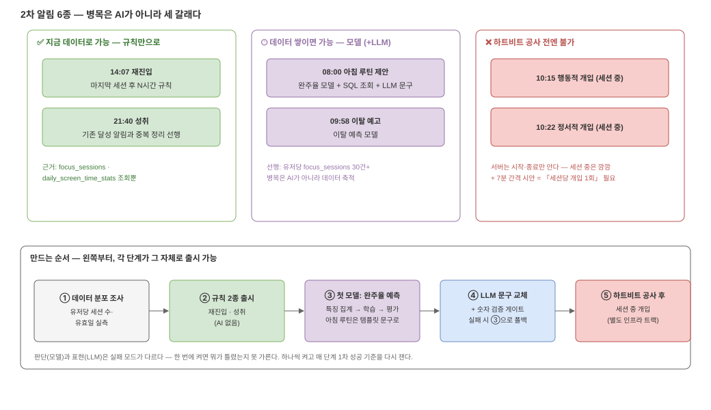

# 06. 2차 설계 — AI가 어디에 끼는지, 뭐부터 만들면 되는지

prd §10의 2차 시안 6종(`../screens/noti-p2-*.png`)을 [05](05-ai-basics.md)의 세 부품에
대응시키면, **6개가 세 무리로 갈라진다** — 지금 되는 것, 데이터가 쌓이면 되는 것,
공사 없이는 안 되는 것.



*편집: [`06-phase2-arch.drawio`](diagrams/06-phase2-arch.drawio)*

## 6개 알림 × 필요한 부품

| 시안 | 필요한 부품 | 선행 조건 | 판정 |
| --- | --- | --- | --- |
| 14:07 재진입 ("오후 집중 어때요") | 규칙 (마지막 세션 후 N시간) | 없음 — `focus_sessions`가 이미 안다 | ✅ 지금 가능 |
| 21:40 성취 ("오늘 목표 달성") | 규칙 | **기존 목표 달성 알림과 중복 정리** — 서버가 final 보고에서 이미 달성 알림을 쏘고, 앱에도 달성 축하 예약이 있다 | ✅ 데이터는 됨 · 중복 정리 선행 |
| 08:00 아침 루틴 제안 | **모델**(완주율) + SQL 조회 + **LLM** | 유저당 세션 30건+ 축적 | 🕐 데이터부터 |
| 09:58 이탈 예고 | **모델**(이탈 예측) | 위와 같음 + 라벨 정의 | 🕐 데이터부터 |
| 10:15 행동적 개입 (세션 중) | 세션 중 상태 감지 | **하트비트 — 없음** | ❌ 공사 전 불가 |
| 10:22 정서적 개입 (세션 중) | 세션 중 상태 감지 | **하트비트 — 없음** | ❌ 공사 전 불가 |

> ⚠ 시안 6종의 가능/불가 판정 정본은 [`../prd.md`](../prd.md) §10 — 이 표는 필요한
> 부품을 덧붙인 설명용 사본이다.

**"2차 = AI 도입"이라고 뭉뚱그리면 안 되는 이유가 이 표다.** 2차 시안의 1/3은 AI가
아니라 규칙으로 지금 만들 수 있고, 1/3은 AI보다 **데이터 축적**이 병목이고, 1/3은
AI와 무관한 **인프라 공사**(하트비트)가 병목이다.

## 왜 세션 중 개입은 불가인가 — 하트비트

서버가 세션에 대해 아는 순간은 **시작(`/focus-session/start`)과 종료 둘뿐**이다.
그 사이에 유저가 폰을 들었는지, 집중이 흔들리는지 서버는 깜깜하다. iOS에서 RN 앱은
백그라운드에서 계속 돌지 않고, Live Activity는 시스템이 그려 주는 표시일 뿐 앱 코드가
살아 있는 게 아니다.

세션 중 개입을 하려면 **앱→서버 하트비트 계약**(주기 신호 or 리스+배치 폴링)이
먼저 생겨야 한다. 이건 AI 넛지가 아니라 focus-session 신뢰성 쪽의 공사고, 2차
일정에 그쪽 선행 티켓이 걸린다.

그리고 시안 자체가 경고를 하나 준다 — 10:15와 10:22는 **7분 간격**이다. 하트비트가
생겨도 이렇게 보내면 잔소리다. 1차의 「연속 2일 금지」가 세션 단위에서 재현된 것:
**"세션당 개입 1회"** 규칙이 2차 판정 엔진에 들어가야 한다.

## 아키텍처에 새로 생기는 층

1차 파이프라인(측정→업로드→저장→판정→발송)은 그대로 두고, **판정 칸의 옆에** 세
가지가 붙는다:

1. **특징 집계 배치** — 매일 새벽, 유저별로 모델 입력(시간대별 완주율, 최근 세션
   통계 등)을 미리 계산해 테이블에 적재. 판정 크론이 실시간으로 무거운 집계를 돌지
   않게 하기 위해서다.
2. **모델 학습 배치 + 추론** — 학습은 하루 1번 배치로, 추론은 판정 시점에 특징
   테이블을 읽어 즉시. 모델 파일은 버전을 남긴다(어제의 모델로 롤백할 수 있게).
3. **LLM 문구 생성 + 검증 게이트** — 판정이 "보낸다"를 정한 뒤, 확정된 숫자를 들고
   문장만 생성. 숫자 검증 실패 시 템플릿 폴백([05](05-ai-basics.md) ②).

판정 엔진의 게이트 사상(빈도 상한·총량·자기 침묵)은 **그대로 유지된다.** 모델은
"보낼 후보"를 늘릴 뿐, 보낼지 말지의 마지막 말은 여전히 게이트가 한다.

## 만드는 순서 — 각 단계가 그 자체로 출시 가능하게

```
① 데이터 분포 조사        유저당 세션 수·스크린타임 유효일 분포부터 실측
      ↓                  (30건+ 유저가 몇 %인지 모르면 계획이 공중에 뜬다)
② 규칙 2종 출시           재진입 · 성취(기존 달성 알림과 중복 정리 후)
      ↓                  — AI 없이 2차 시안 2/6 소화
③ 첫 모델: 완주율 예측     특징 집계 배치 → 학습 → 오프라인 평가 순.
      ↓                  라벨은 완주 필터 관례(NOT IN CANCELED·AUTO_CLOSED)로.
      ↓                  아침 루틴은 일단 템플릿 문구로 출시
④ LLM 문구 + 검증 게이트   ③이 안정된 뒤 표현만 교체 — 실패해도 ③으로 폴백.
      ↓                  선행: 벤더·비용·개인정보 검토(행동 데이터 외부 반출)
⑤ 하트비트 공사 → 세션 중 개입   별도 인프라 트랙 — 완료 후에만 착수
```

②를 ③보다 앞에 두는 이유: **모델 없이 출시할 수 있는 걸 모델 뒤에 줄 세우면
안 된다.** ③ 안의 순서도 고정이다 — 특징 집계 배치("새로 생기는 층" 1번)가 모델의
실질 선행물이고, 학습이 끝나면 **발송에 연결하기 전에 오프라인 평가**를 통과해야
한다: 홀드아웃(학습에 안 쓴 기간의 데이터)으로 "단순 규칙 베이스라인(예: 최근
완주율 그대로)을 이기는가"를 확인한다. 못 이기는 모델은 규칙보다 나쁜 규칙이다.
④를 ③과 분리하는 이유: 판단(모델)과 표현(LLM)은 실패 모드가 달라서, 한 번에 켜면
뭐가 틀렸는지 못 가른다. ④에는 기술 밖 선행 조건도 있다 — 유저 행동 데이터를 외부
LLM API로 내보내는 일이라 **벤더 선정·비용·개인정보 검토**가 먼저다. 그리고 ④의
착수 조건은 [07](07-llm-api-benchmark.md)의 **시험지·채점지·벤치마크 시트 완성**이다 —
API를 처음 호출하는 날, 채점지가 이미 있어야 한다. 하나씩 켜고, 각 단계에서 1차의
성공 기준(열람률·끄기 비율·무발송 주)을 그대로 다시 잰다.
