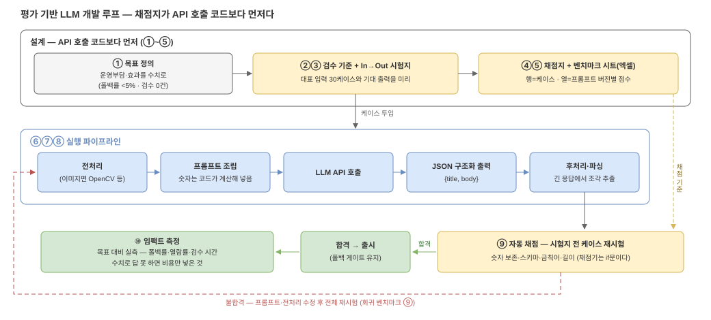

# 07. LLM은 API로 쓴다 — 채점지를 먼저 만드는 개발 루프

[05](05-ai-basics.md)가 "AI 세 부품이 뭔지"였다면, 이 문서는 **실제로 어떻게 만들
것인가**다. 요즘의 답은 명확하다: **모델을 만드는 게 아니라, LLM API를 "어떻게든 잘
쓰는" 쪽이 승부다.** gromo 2차도 직접 학습하는 건 로지스틱 회귀 하나뿐이고, 문구
생성·루틴 제안은 전부 API 호출이다. 그리고 API를 "잘" 쓴다는 건 프롬프트를 잘 짠다는
뜻이 아니라 — **채점지를 먼저 만든다**는 뜻이다.

*편집: [`07-llm-eval-loop.drawio`](diagrams/07-llm-eval-loop.drawio)*

## 왜 채점지가 먼저인가

LLM은 같은 입력에도 매번 다른 문장을 내놓는다(비결정성). "돌려보니 괜찮던데요"는
검증이 아니다 — 어제 괜찮던 프롬프트가 오늘 이상한 걸 내놓아도 **눈으로는 못 잡는다.**
그래서 순서를 뒤집는다: 코드보다 먼저 **시험지와 채점지**를 만들고, 프롬프트를 바꿀
때마다 시험을 다시 치게 한다. 일반 개발의 테스트 주도(TDD)와 같은 사상이고, LLM
업계에서는 이걸 **평가(evals)** 라고 부른다.

## 개발 루프 10단계

| # | 단계 | 하는 일 | gromo 예 |
| --- | --- | --- | --- |
| ① | **목표 정의** | 어떤 운영부담·효과를 얼마나 줄일지 **수치로** | 문구 수작업 검수 0건 · 템플릿 폴백률 < 5% |
| ② | **검수 기준** | "좋은 출력"의 조건을 명문화 | 숫자 정확 · "관리 중인 앱" 용어 준수 · 1~2문장 · 존댓말 |
| ③ | **In→Out 시험지** | 대표 입력과 기대 출력을 **미리** 작성 (고객 QnA를 미리 만들어 두듯) | 판정 결과 30케이스: 경고/격려/침묵·큰 수·15분 눈금 경계·결측 주 |
| ④ | **채점지** | 항목별 평가지표 + 통과 기준을 미리 확정 | 아래 채점지 표 |
| ⑤ | **벤치마크 시트** | 시험지+채점 결과를 엑셀/시트 하나로 관리 | 행=케이스, 열=프롬프트 버전별 점수 |
| ⑥ | **파이프라인** | 전처리(이미지면 OpenCV 등) → 프롬프트 조립 → **LLM API 호출** | 판정 JSON + 어투 지시 → API |
| ⑦ | **구조화 출력** | 응답을 **JSON으로** 받아 정답지와 자동 채점 | `{title, body}` 스키마 강제 |
| ⑧ | **후처리** | 긴 응답은 파싱해서 필요한 조각만 추출 | 루틴 제안에서 시간대·근거 분리 |
| ⑨ | **회귀 벤치마크** | 프롬프트·모델·전처리를 바꿀 때마다 **시험지 전체를 재채점** | 버전 올릴 때 30케이스 자동 재시험 |
| ⑩ | **임팩트 측정** | 목표(①) 대비 실제 효과를 실측 | 폴백률·열람률·검수 시간 변화 |

핵심은 ①~⑤가 **API 호출 코드보다 먼저**라는 것. 시험지 없이 프롬프트부터 만지면
"좋아진 느낌"만 남고, 뭐가 왜 좋아졌는지 영영 모른다.

## gromo 문구 생성의 채점지 — 예시

시험지 한 줄: **In** = `{kind: "warn", axis: "누적", delta: 80, weekday: "수"}` →
**기대 Out** = 80분(=1시간 20분)이 보존된 경고 문구 1~2문장.

| 채점 항목 | 방법 | 통과 기준 |
| --- | --- | --- |
| 숫자 보존 | 문장에서 시간 표현 추출 → 분 환산 → 원본과 대조 ([05](05-ai-basics.md) ②의 정규화 검증과 같은 코드) | 100% (하나라도 틀리면 실격) |
| JSON 스키마 | `{title, body}` 파싱 성공 | 100% |
| 용어 준수 | 금칙어 검사 — "핸드폰 사용량"·"스크린타임 전체" 금지(prd §6) | 100% |
| 길이·형식 | title ≤ 20자, body ≤ 60자, 존댓말 어미 | ≥ 95% |
| 어투 | 토스풍 담백함 — 이것만은 자동화가 어려워 **사람 채점**(5점 척도) | 평균 ≥ 4.0 |

앞 4개는 전부 **코드로 자동 채점**된다 — LLM 기능인데 채점기는 `if`문이라는 게
요점이다. 자동 채점 가능한 항목을 최대한 늘리는 게 시험지 설계의 실력이다.

## 한계는 뭐고, 어떻게 극복하나

| 한계 | 증상 | 극복 |
| --- | --- | --- |
| **환각** | 숫자·사실을 지어냄 | 숫자는 코드가 계산(05 ②) + 채점지의 숫자 보존 100% 게이트 + 실패 시 템플릿 폴백 |
| **비결정성** | 같은 입력, 다른 출력 | 케이스당 N회 반복 채점으로 통과율 측정 · temperature 낮춤 · 회귀 벤치마크(⑨) |
| **지연·비용** | 호출당 수초·과금 | 발송 직전 실시간 호출 대신 **배치 사전 생성**(21:00 판정 때 함께) · 시트에 호출 비용 열 추가 |
| **프롬프트 드리프트** | 고치다 보면 다른 케이스가 망가짐 | 프롬프트를 버전 관리하고 바꿀 때마다 전체 시험지 재채점(⑨) — 이게 없으면 두더지잡기 |
| **모델 교체 리스크** | 벤더가 모델을 바꾸면 품질이 흔들림 | 같은 시험지로 신모델을 먼저 채점 → 점수로 교체 판단 (감이 아니라) |

## 이 루프가 06의 순서 어디에 끼나

[06](06-phase2.md)의 ④(LLM 문구 교체) **착수 조건이 이 문서의 ①~⑤ 완료**다.
즉 2차에서 LLM API를 처음 호출하는 날, 시험지 30케이스와 채점지가 이미 시트에
있어야 한다. ⑩(임팩트 측정)은 1차의 성공 기준(prd §9 — 열람률·끄기 비율·무발송
주)과 같은 지표를 그대로 이어 쓴다 — "AI를 넣었더니 뭐가 좋아졌나"를 숫자로
답하지 못하면, AI를 넣은 게 아니라 비용을 넣은 것이다.
