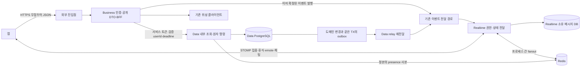
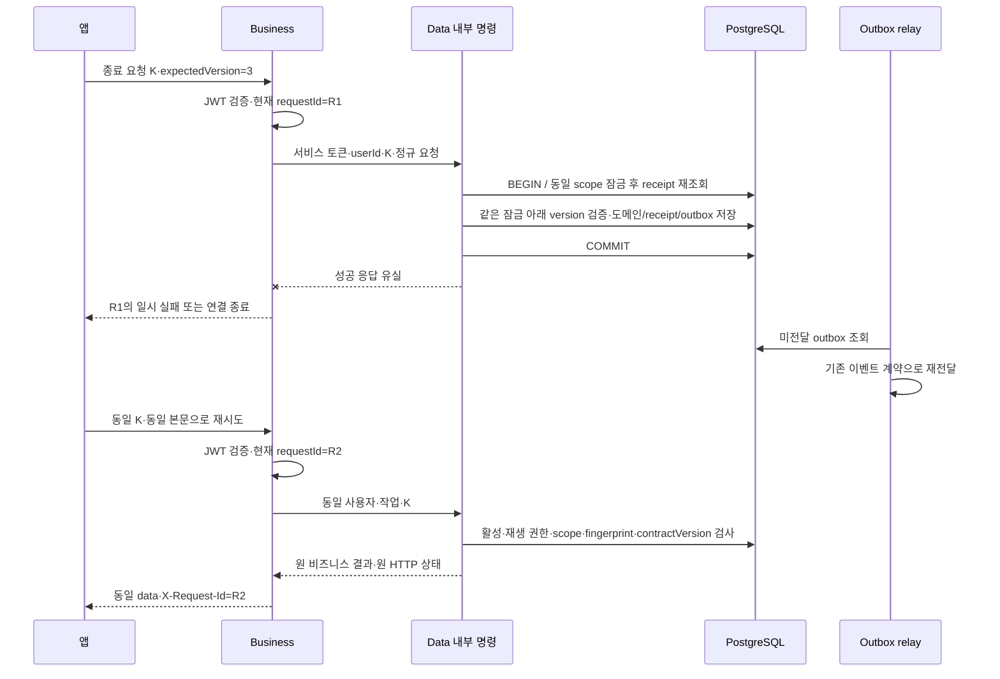
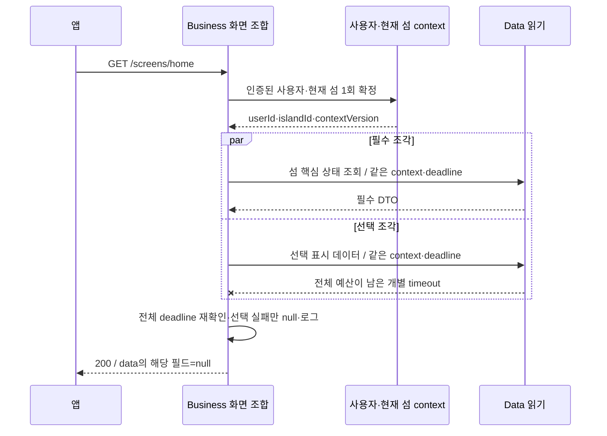

# 공통 API 계약 — HLD

GROMO-1750 · 2026-09-12 · [정책](policy.md) · [LLD](low-level-design.md)

## 아키텍처와 책임

앱이 보는 외부 경계는 Business다. Business는 인증된 주체와 입력을 정리하고 Data의 원자 명령 또는 읽기 조각을 호출한다. DB의 돈·소유·통계는 Data가 확정한다. 실시간 상태는 정본을 전달하고 다시 읽게 하는 수단이며 별도의 돈 장부가 아니다.

도식의 이벤트 전달 경로는 아키텍처 A4/A21 및 1659 통합 계약을 활용하는 **목표 연결**이다. 이 문서에서 새 이벤트 수신 HTTP·토픽을 추가하거나 모든 연결이 기준 main에 구현됐다고 주장하지 않는다. Realtime 채팅 DB를 Data가 직접 쓰거나 Realtime이 Data DB를 직접 읽는 연결은 없다. 우체통 REST를 Business가 중계할 때는 그 저장 소유자의 승인된 내부 계약이 먼저 필요하다.

| 경계 | 책임 | 하면 안 되는 일 |
| --- | --- | --- |
| 앱 | 키 생성·같은 의도 재시도, 자원version 보관, 재확인, 커서 초기화 | 가격·보상 계산값을 정본으로 제출, 타인 userId 위임 |
| Business 진입 | 인증·바디 제한·requestId·헤더 정리·공개 오류 | 앱 Authorization/X-User-Id를 내부 요청으로 그대로 복사 |
| Business 유스케이스 | 사용자/현재 섬 context 확정, 외부 DTO 매핑, 단일 명령 호출·화면 조합 | 직접 DB쓰기, 여러 HTTP mutation으로 차감과 지급 분할 |
| Data 내부 | 활성/소유/상태 재검증, 잠금/CAS, 명령 receipt·원장·outbox를 같은 TX에서 확정 | 인증 없는 userId 신뢰, 배치 명령을 일반 사용자 패스스루로 노출 |
| Realtime | 인증된 구독·이벤트 수신자, 메시지 저장, 휘발 emote | 개인 재화·재고를 섬 전체 토픽에 흘린 후 앱 필터에 기대기 |
| Redis/이벤트 | 캐시·projection·fanout·재전달 | 명령 성공의 유일한 증거, 돈 장부의 유일한 정본 |

## 기존 코드와 통합 선행 조건

기준 main `529a396e5f0f88cb78c172110920e1fa6b9388a9`에 있는 코드:

- [RequestFilter](../../../server/business-api/src/main/java/com/oneorthree/business/config/RequestFilter.java): JWT·requestId·256KiB body limit·정확한 관리경로 예외. `/api` 접두어로 인증을 골라 처리하지 않는다.
- [ApiExceptionHandler](../../../server/business-api/src/main/java/com/oneorthree/business/config/ApiExceptionHandler.java): Preview/validation/Redis 예외, 기존 code와 Retry-After.
- [PreviewController](../../../server/business-api/src/main/java/com/oneorthree/business/linkpreview/PreviewController.java): 기존 `/api/v1/link-previews`, 객체/목록 직접 반환, PNG byte 응답.
- [FocusService](../../../server/data-api/src/main/java/com/oneorthree/phone/focus/service/FocusService.java): 기존 종료의 조건부 UPDATE·정산·통계 TX 패턴. 신규 pause/resume·물고기 계약이 구현된 것이 아니다.
- [CurrencyLedgerService](../../../server/data-api/src/main/java/com/oneorthree/phone/currency/service/CurrencyLedgerService.java): 지갑/원장 원자성과 멱등키 유일성 패턴. 기존 코인과 새 섬 재화를 같은 값으로 취급하지 않는다.
- [아키텍처 결정 장부](../../architecture/decisions.md): A4/A9의 원자성, ㉸의 외부 주체 폐기, ㉼의 앱 키, A21의 outbox 재전달.

1659 통합 선행 코드의 재현 가능한 참조는 원격 [bfeat/GROMO-1659-notification-foundation 브랜치](https://github.com/OneOrThree/phone/tree/bfeat/GROMO-1659-notification-foundation)와 [고정 커밋 4161a3619af23aa84d74542eb6485339c93b0097](https://github.com/OneOrThree/phone/commit/4161a3619af23aa84d74542eb6485339c93b0097)이다. 조정자가 2026-09-12 00:41 KST에 원격 ref와 ls-remote 일치를 확인했다. 이후 브랜치가 이동해도 구현 대조에는 이 전체 SHA를 사용하고 실제 통합 SHA를 구현 PR에 남긴다. 이전 `8e5a73673dceb3c123d2b7bca6952acf5cb5fdd1`·`9e2963cc2`는 과거 조사 스냅샷이며 도달 가능한 통합 기준으로 사용하지 않는다.

재사용할 구성요소: `InternalHttpClient`, `Deadline`, `DataApiClient`, `RequestEnvelopeFilter`, `AccessTokenFilter`, `RequestIdempotencyKeys`, Data `InternalAuthFilter`·명령/outbox. **현재 문서 브랜치에 없는 경로를 로컬 링크로 만들지 않는다.** 1751~1753은 이 기반의 통합된 코드를 재사용한 뒤 신규 외부 계약을 확장한다. 기존 RequestFilter를 복제하거나 클라이언트·예외 처리기를 두 벌 신설하지 않는다.

과거 조사 스냅샷에서1659 `InternalHttpClient`의 재시도는 `MAX_ATTEMPTS=2` 하드코딩이고, deadline은 readTimeout 예산의 입구 검사 수준이며, requestId 전달도 아직 없다. 재사용은 기능 완료를 뜻하지 않는다. 1753에서 설정 가능한 재시도·connect/read/대기/재시도를 포함한 전체 예산·requestId 전달·취소 전파를 보완하고 HTTP fixture로 검증해야 한다. 기존 `GlobalExceptionHandler`의 상류 domain status/code 보존은 compat 경로에 남기고 신규 경로만 등록 매핑표를 적용한다.

## 원자 명령과 응답 유실

receipt 조회도 요청자의 범위로만 수행한다. fingerprint 불일치면 원 결과를 보여주지 않고409다. 확정 결과 재생 전에 stale expectedVersion을 먼저 검사하면 이미 성공한 요청을 실패로 오인하므로 순서를 바꾸지 않는다. 현재 권한이 유지되고 응답 계약 버전이 호환되는 일반 재생에서 리소스 변경으로 응답을 다시 조립하지 않으며 최초 응답이 잔액100이었다면 나중에 다른 구매로 잔액80이 되어도 원 명령 응답은100이다. 최신 화면 상태가 필요하면 별도 GET으로 읽는다. 비활성 계정의 일반 재생은 거절한다. 활성 본인의 leave/host-transfer처럼 원 명령 완료로 권한이 소멸한 경우에는 도메인이 승인한 비민감 최소 완료 증거만 제한 재생하며 저장 응답 전체·관리자 정보·초대 자격은 반환하지 않는다. 현재 권한 확인 없이 receipt 존재만으로 재생하지 않는다. 구버전 응답은 contractVersion별 reader/순수 변환을 거치고 지원 불가 시 명시 거절하며, 원 명령을 다시 실행하지 않는다.

## 화면 조회와 부분 실패

전체 deadline 소진은 선택 조각의 폴백보다 우선하는 504다. 개별 timeout 뒤 선택 필드를 null로 만든 경우에도 최종 응답 확정 전에 남은 예산을 확인한다. 401/403/502 등 즉시 실패를 포함해 화면 전체 응답을 조기에 확정하는 모든 경로에서 미완료 작업을 취소하고 실제 HTTP I/O·연결을 해제한다.

사용자·현재 섬 context 자체는 필수다. 각 조각이 현재 섬을 다시 고르면 이동 경합에서 한 화면에 서로 다른 섬의 잔액·시설이 섞인다. contextVersion은 조합 정합성 검사용 내부 값이며 모든 공개 API에 새 expectedVersion을 강제하는 의미가 아니다.

독립 HTTP 호출은 같은 DB snapshot을 보장하지 않는다. 화면별 설계1784는 필수/선택·허용하는 시점 차이·필요한 aggregateVersion 비교를 정한다. 반드시 일치해야 하는 값은 Data의 단일 snapshot 조회로 묶는다. 재정합 조회를 한다면 횟수1회와 같은 전체 deadline을 적용하고 무한히 쫓아가지 않는다. 완전히 확정된 쓰기 결과를 실패한 선택 읽기 때문에 다시 쓰지 않는다.

## 신뢰 경계와 추적

외부 헤더는 신뢰하지 않는다. Business가 `getHeader`, `getHeaders`, `getHeaderNames`에서 `X-User-Id`를 제거하고 새 내부 요청의 allowlist만 만든다. 검증한 UUID subject, 현재 requestId, 앱의 유효한 명령 키, 서버 서비스토큰이 그 목록이다. Data는 서비스 caller의 audience·메서드/경로 허용목록과 사용자 활성/소유를 다시 검사한다. 로그인은 [아키텍처 결정 장부](../../architecture/decisions.md)의 A7·㊒에 따라 선택적 사용자 인증을 지원한다. AT가 없으면 검증한 제공자 자격으로 사용자 없는 로그인 계약을 호출하고, 유효한 게스트 AT가 있으면 검증한 subject를 선택적 내부 게스트 주체로 전달해 기존 계정과 데이터를 승계한다. 제시한 AT의 위조·만료·타입 오류는 익명으로 강등하지 않는다. 앱의 X-User-Id는 어느 분기에서도 전달하지 않는다. 사용자 없는 인증/배치 호출은 별도 서비스전용 allowlist를 사용하며 임의 userId를 채우지 않는다.

로그는 `request_id`, 안전한 `operation`, HTTP status, upstream 서비스명, `duration_ms`, timeout/부분실패 code, opaque commandId/eventId로 연결한다. UUID 명령키의 원문 대신 필요한 경우 제한된 hash를 쓴다. 키·URL·토큰을 requestId로 재활용하지 않는다. JWT·서비스토큰·쿠키·요청/응답 본문·미리보기 원본URL·인증코드를 기록하지 않는다. 비동기 이벤트는 원 요청의 origin requestId를 추적 메타로 보존할 수 있으나, relay 실행이나 재시도 HTTP 응답의 현재 requestId와 구분한다.

## 제공 순서와 검증 책임

1750 공통 규약 → 1659 기반 통합 → 1751 응답/라우팅 → 1752 명령/버전/커서 → 1753 병렬 조합 → 도메인 원자 명령/실시간 → 1784~1787 BFF13종 순서다. Realtime 설계1754·개명1755는 독립 진행하되 Data/Business 내부 명령이 이미 있다고 가정하지 않는다.

Data 호환 스키마·내부 제공자 → 이벤트 소비자 → Business → 앱 순으로 연결한다. 마이그레이션 번호/DBML은 통합 담당이 관리한다. 이번 문서에서는 운영 인프라·DNS·배포를 실행하지 않는다. 실제 구현 검증 항목과 문서 검증은 [LLD](low-level-design.md)에 분리했다.
