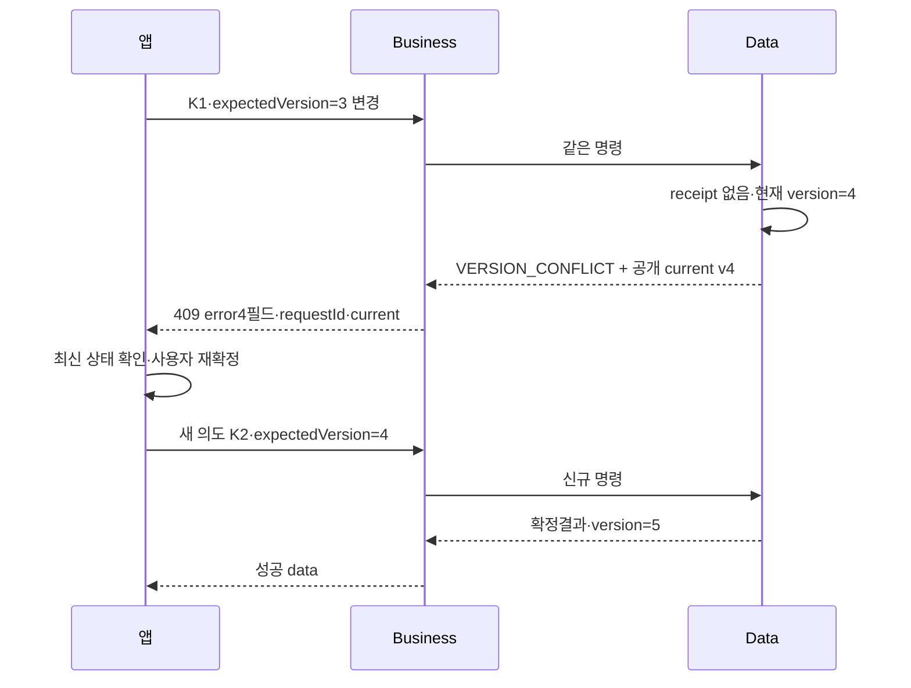

# 공통 API 계약 — LLD

GROMO-1750 · 2026-09-12 · [정책 정본](policy.md) · [HLD](high-level-design.md)

이 문서의 DTO·테이블 항목은 구현 요구를 표현하는 논리 계약이다. 아직 없는 Java 클래스·마이그레이션을 이미 구현된 파일처럼 제시하지 않는다. 실제 이름·Flyway 번호는1659 통합 코드와 대조해 재사용한다.

## 1. 경로·응답·헤더

신규 JSON API는 `/focus-sessions`, `/islands/{islandId}/...`, `/me/...`, `/screens/...`로 제공한다. 기존 Data `/api/v1`·chat `/api/v1/chat`을 삭제하거나 전역 rewrite하지 않는다. 내부 Data는 기존 아키텍처의 `/internal/*`와 서비스 인증을 유지한다.

| 응답 종류 | 상태·예시 |
| --- | --- |
| 단건 | `200 {"data":{"id":"..."}}` |
| 현재 단건 없음 | `200 {"data":null}` |
| 빈 페이지 | `200 {"data":{"items":[],"nextCursor":null}}` |
| 생성 | `201 {"data":{"id":"..."}}` |
| 데이터 없는 신규 JSON mutation | `200 {"data":null}`; 삭제 확인 DTO가 정해졌으면 그 DTO |
| PNG 썸네일 | `200 image/png`, bytes 원문, JSON 래핑 금지 |

### 미리보기 호환 별칭

| 계약 | 기존 `/api/v1/link-previews` 계열 | 신규 `/link-previews` 계열 |
| --- | --- | --- |
| POST/GET 성공 JSON | 기존 Preview 객체/목록 직접 반환 | `{data: ...}` 봉투 |
| 실패 JSON | 기존 `{code,message}` 평면 오류 | 공통 error4필드+requestId |
| Preview.thumbnailUrl | 기존 `/api/v1/link-previews/{id}/thumbnail` 유지 | `/link-previews/{id}/thumbnail` |
| thumbnail 성공 | image/png bytes·기존 인증 | 같은 PNG bytes·인증 |

두 계열은 같은 사용자별 Preview 저장/캐시를 사용한다. 신규 URL은 공개 응답 매핑에서 만들고 기존 캐시 객체·호환 응답을 바꾸지 않는다. 기존 별칭을 삭제하는 선택은 이번1751 구현 범위에 없다.

성공의 requestId는 `X-Request-Id` 헤더에 둔다. 오류 본문에는 같은 값을 넣는다. 서버는 들어온 `X-Request-Id`를 인증 근거나 서버 ID로 사용하지 않는다.

```json
{
  "error": {
    "code": "VERSION_CONFLICT",
    "message": "상태가 변경되었습니다. 최신 내용을 확인해 주세요.",
    "field": "expectedVersion",
    "retryable": false
  },
  "requestId": "019f1740-0000-7000-8000-000000000002",
  "current": {
    "version": 4,
    "resource": {
      "id": "019f1740-0000-7000-8000-000000000010",
      "status": "paused"
    }
  }
}
```

`current`는 **409 전용 선택 확장**이다. 존재하면 `version`은 해당 충돌 자원의 최신 버전, `resource`는 해당 도메인이 승인한 공개 최신상태 DTO다. 예시는 설명용 부분 DTO이며 실제 focus 전체 DTO를 정의하지 않는다. 다른 오류에는 넣지 않는다. 409여도 안전한 공개 상태가 없으면 필드를 생략한다. 인증·소유 검사 후 한 DB 스냅샷에서 version과 resource를 읽고 원래 사용자에게 공개되지 않는 값은 빼야 한다. 재조회 사이 다시 바뀔 수 있으므로 이 버전이 다음 mutation 성공을 예약하지 않는다.

| 경계 | 허용하는 헤더/값 |
| --- | --- |
| 앱→Business | Bearer AT(인증 공개 경로 예외), application/json, 적용표의 Idempotency-Key |
| Business 인바운드 | X-User-Id를 getHeader/getHeaders/getHeaderNames 모두에서 제거. 중복·대소문자 헤더 변형도 동일 처리 |
| Business 내부 context | 검증한 userId, 한 번 확정한 currentIslandId/contextVersion, 서버 requestId, deadline |
| Business→Data | 서버가 고른 서비스토큰 Authorization, 검증한 X-User-Id 1개, 새 X-Request-Id, 정규 명령키, 필요한 Content-Type |
| 사용자 없는 내부 인증/배치 | 해당 서비스전용 allowlist만, X-User-Id를 임의 생성하지 않음 |
| Data→Business | 내부 DTO/도메인 오류; 서비스 자격 실패는 앱401로 그대로 전달하지 않음 |

내부 요청에 앱 cookie·X-Batch-Admin-Key·전달받은 서비스토큰·임의 X-*를 복사하지 않는다. 사용자별 캐시를 사용해도 세션 AT 만료 검증은 생략할 수 없다. JSON 바디 제한은 기존256KiB를 재사용하고 chunked 스트림에도 적용한다.

## 2. Idempotency-Key 적용 목록

다음 표는 원본66개 중 GET이 아닌36개를 **빠짐없이** 대조한 것이다. 원본경로의 `/v1`을 제거했고 emote 행만 사용자 결정으로 STOMP로 대체한다. '필수'31개는 신규 Business 외부 계약만 대상으로 한다. 기존 레거시 라우트에는 소급 적용하지 않는다.

| method | 신규 경로 | 공통 키 | 작업 범위·도메인 추가 조건 |
| --- | --- | --- | --- |
|POST|`/auth/sessions`|범용 대상 제외|AT 없는 로그인과 검증된 선택적 게스트 AT 승격을 구분. 후자는 검증 subject를 내부 계약에 전달해 기존 계정 승계. A7·㊒·1756의 로그인/CAS 전용 계약; authorizationCode는 generic receipt 저장 금지|
|PATCH|`/me`|필수|method+라우트와 실제 경로 자원ID를 작업에 포함; 도메인 소유/권한 재검증|
|DELETE|`/auth/sessions/current`|범용 대상 제외|현재 인증 세션 철회. 계정 설계의 RT로 식별한 사용자+세션을 고정해 철회/완료 재생. 개별 철회는 authGeneration을 올리지 않으며 세션 epoch와 기기 ownershipVersion 경계를 구분(㊼)|
|DELETE|`/me`|필수·PII 파기|검증된 동일 사용자+탈퇴 의도. 기존 탈퇴 원자 명령·PII 파기 보존. 비활성 계정 재생 금지; 탈퇴 후404, 위조·만료 자격401|
|PATCH|`/me/settings`|필수|method+라우트와 실제 경로 자원ID를 작업에 포함; 도메인 소유/권한 재검증|
|POST|`/islands`|필수|method+라우트와 실제 경로 자원ID를 작업에 포함; 도메인 소유/권한 재검증|
|POST|`/islands/{islandId}/memberships`|필수|method+라우트와 실제 경로 자원ID를 작업에 포함; 도메인 소유/권한 재검증|
|POST|`/invitations/resolve`|불필요|초대 해석 조회. 키로 조회 결과를 영구 고정하지 않음. claim/가입은 별도 명령|
|PUT|`/me/current-island`|필수|method+라우트와 실제 경로 자원ID를 작업에 포함; 도메인 소유/권한 재검증|
|POST|`/focus-sessions`|필수|method+라우트와 실제 경로 자원ID를 작업에 포함; 도메인 소유/권한 재검증|
|POST|`/focus-sessions/{sessionId}/pause`|필수|method+라우트와 실제 경로 자원ID를 작업에 포함; 도메인 소유/권한 재검증|
|POST|`/focus-sessions/{sessionId}/resume`|필수|method+라우트와 실제 경로 자원ID를 작업에 포함; 도메인 소유/권한 재검증|
|POST|`/focus-sessions/{sessionId}/finish`|필수|작업에sessionId 포함. 종료·보상·기여·통계·원장/outbox는 한 TX, 종료결과 재생|
|POST|`/islands/{islandId}/emotes`|해당 HTTP 미채택|STOMP SEND로 대체. eventId·expiresAt, 저장·재생 없는 휘발 이벤트|
|PUT|`/me/screen-time/{date}`|필수|작업에date 포함. 같은보고재시도와 새로운측정업데이트는 구분;기기/날짜병합규칙은도메인정책|
|PATCH|`/islands/{islandId}`|필수|method+라우트와 실제 경로 자원ID를 작업에 포함; 도메인 소유/권한 재검증|
|PATCH|`/islands/{islandId}/join-requests/{requestId}`|필수|method+라우트와 실제 경로 자원ID를 작업에 포함; 도메인 소유/권한 재검증|
|POST|`/islands/{islandId}/invitations`|필수|method+라우트와 실제 경로 자원ID를 작업에 포함; 도메인 소유/권한 재검증|
|POST|`/islands/{islandId}/host-transfer`|필수|method+라우트와 실제 경로 자원ID를 작업에 포함; 도메인 소유/권한 재검증|
|DELETE|`/islands/{islandId}/members/{userId}`|필수|method+라우트와 실제 경로 자원ID를 작업에 포함; 도메인 소유/권한 재검증|
|DELETE|`/islands/{islandId}/memberships/me`|필수|method+라우트와 실제 경로 자원ID를 작업에 포함; 도메인 소유/권한 재검증|
|POST|`/islands/{islandId}/constructions`|필수|작업에islandId 포함, buildingId는본문. 건설유일성+차감 같은 TX|
|POST|`/islands/{islandId}/notices`|필수|method+라우트와 실제 경로 자원ID를 작업에 포함; 도메인 소유/권한 재검증|
|PATCH|`/islands/{islandId}/notices/{noticeId}`|필수|method+라우트와 실제 경로 자원ID를 작업에 포함; 도메인 소유/권한 재검증|
|DELETE|`/islands/{islandId}/notices/{noticeId}`|필수|method+라우트와 실제 경로 자원ID를 작업에 포함; 도메인 소유/권한 재검증|
|POST|`/islands/{islandId}/notices/{noticeId}/comments`|필수|method+라우트와 실제 경로 자원ID를 작업에 포함; 도메인 소유/권한 재검증|
|POST|`/islands/{islandId}/quests`|필수|method+라우트와 실제 경로 자원ID를 작업에 포함; 도메인 소유/권한 재검증|
|PATCH|`/islands/{islandId}/quests/{questId}`|필수|method+라우트와 실제 경로 자원ID를 작업에 포함; 도메인 소유/권한 재검증|
|POST|`/islands/{islandId}/quests/{questId}/claims`|필수|작업에islandId+questId 포함, occurrenceId는본문. 정산유일성+지급 같은 TX|
|POST|`/islands/{islandId}/messages`|clientMessageId 대체|사용자+islandId+clientMessageId로 메시지 저장1회. 일반 receipt와 중복 권위 금지. 신규 REST는1774/1775 후속 계약이며 기존 STOMP 발신을 이미 대체했다는 뜻이 아님|
|POST|`/islands/{islandId}/shop/orders`|필수|작업에islandId 포함, productId는본문 fingerprint. 차감+소유권+주문 원자성 및소유유일성 별도|
|PATCH|`/me/appearance`|필수|method+라우트와 실제 경로 자원ID를 작업에 포함; 도메인 소유/권한 재검증|
|PATCH|`/islands/{islandId}/appearance`|필수|method+라우트와 실제 경로 자원ID를 작업에 포함; 도메인 소유/권한 재검증|
|PATCH|`/islands/{islandId}/playback`|필수|method+라우트와 실제 경로 자원ID를 작업에 포함; 도메인 소유/권한 재검증|
|PUT|`/islands/{islandId}/construction-target`|필수|method+라우트와 실제 경로 자원ID를 작업에 포함; 도메인 소유/권한 재검증|
|DELETE|`/me/join-requests/{requestId}`|필수|method+라우트와 실제 경로 자원ID를 작업에 포함; 도메인 소유/권한 재검증|

추가 경계:

- 신규 `POST /link-previews`는 조회성 비동기 미리보기 작업이며 공통 명령키 필수가 아니다. 기존 사용자+URL cache/claim을 재사용한다. 같은 URL 재조회와 재화 mutation의 영속 명령을 같은 receipt 정책으로 묶지 않는다.
- GET30개와 BFF GET13개는 공통 키 대상이 아니다. GET에 키가 있어도 쓰기처럼 예약하지 않는다.
- 로그인과 로그아웃의 범용 키 제외는 전용 멱등 계약을 없애지 않는다. [아키텍처 결정 장부](../../architecture/decisions.md)의 **A7·㊑·㊒·㊔·㊙·㊡·㉮·㊼**를 기준으로 1756이 실제 구현과 대조한다. 로그인은 Data의 시도 키 기반 upsert/CAS nonce → Business의 고정 jti/발급시각 기반 서명 → Data의 CAS 확정이며, 성공은 같은 서명 재료로 복구하고 CAS 충돌은 시도 재개 규약을 따른다. refresh 회전 CAS 0행은 ㉮에 따라 세션 종료이며 로그인 성공 재생과 혼동하지 않는다.
- AT 없는 로그인은 검증한 provider identity로 시작한다. **유효한 선택적 게스트 AT가 있으면 검증한 subject를 Data 로그인 계약에 전달**하고 기존 UUID·집중 기록·지갑·그룹을 보존하며 소셜 계정으로 승격한다. 제시한 AT가 위조·만료·잘못된 타입이면401이고 익명 신규 가입으로 강등하지 않는다. 외부 X-User-Id나 본문 userId로 guest subject를 대체하지 않는다. 로그인 자격·토큰은 범용 receipt 저장 대상이 아니다.
- 현재 세션 철회는 1756의 RT 증명으로 대상 사용자/세션을 고정한다. 개별 로그아웃의 sessionEpoch와 기기 ownershipVersion은 각각 해당 경계만 바꾸고, 유저 공통 authGeneration은 탈퇴·전 기기 로그아웃에만 증가한다(㊼). 기준 main/1659에 세션별 로그인 복구 이관이 이미 끝났다고 주장하지 않는다. 한 번 사용한 authorizationCode와 응답 유실 복구는 계정 전용 시도 상태·재개 창에서 검증한다.
- 메시지의 clientMessageId는 UUID 계약을 유지한다. 원본 `local-1`은 목업 값이다. 새 우체통에 같은 ID/다른 text가 오면409 `IDEMPOTENCY_KEY_REUSED`(field=`clientMessageId`, retryable=false)로 처리하고, 기존 chat API의 원문 재생 동작은 호환 경로에 보존하는 어댑터 결정을1774/1775에서 반영한다. 응답/이벤트의 id와 clientMessageId로 앱이 중복을 제거한다.
- Idempotency-Key와 clientMessageId를 둘 다 보내도 메시지 저장의 유일성 정본은 clientMessageId다. 일반 미들웨어는 메시지 endpoint에 receipt를 만들지 않는다.

### 키와 fingerprint

scope는 `(authenticatedUserId, operation, normalizedKey)`다. operation에는 HTTP 의미와 라우트, 실제 경로 자원ID를 포함한다. 예를 들어 `focus.finish:<sessionId>`와 `focus.pause:<sessionId>`는 다른 작업이다. 사용자가 다른 섬에 같은 UUID를 사용해도 다른 작업이지만, 앱은 새 의도마다 새 키를 생성한다.

UUID36자는1659의 base key150자 제한 안에 들어간다. 공개 키는 정규화한 UUID만 전달하고 내부 단계 접미는 기존 `RequestIdempotencyKeys.forStep` 규칙을 재사용한다. suffix를 중복으로 붙이거나 길이를 잘라 충돌시키지 않는다. 오래된 optional key 라우트는 별도 정책으로 남긴다.

fingerprint는 **검증한 요청 DTO의 의미**로 만든다. 필드 이름 정렬, 객체 key 정렬, 배열 순서 보존, 숫자 표현 정규화, null/누락의 도메인 의미를 명시하고 SHA-256을 적용한다. HTTP method·정규 라우트·실제 경로 자원ID와 의미 있는 query를 포함한다. 섬에 결합된 작업은 경로/본문이 지정한 대상 섬 식별자도 포함한다. 재시도 때 바뀔 수 있는 현재섬 조회 결과나 서버의 현재 resourceVersion을 새로 섞지 않는다. 서버가 첫 수락 시 보완한 context가 있다면 receipt에 고정해 재생하며, 새 현재 context로 원 요청을 다른 명령으로 바꾸지 않는다. 외부 requestId·Authorization·멱등키·추적 헤더는 제외한다. `expectedVersion`/`expectedWalletVersion`/`expectedProductVersion`은 포함하므로 충돌 후 새 버전으로 다시 확정하는 의도는 새 키를 사용한다.

문자열을 임의 strip하거나 배열을 정렬해 서로 다른 의도를 합치지 않는다. 이름·text·암호·토큰 원문을 fingerprint 로그에 남기지 않는다. 로그인 자격 원문은 범용 fingerprint 대상 밖이다. 일반 receipt는 cookie·Authorization·토큰 발급 응답을 저장/재생하지 않으며, 로그인/refresh의 결정적 토큰 복구는 계정 전용 설계에서 검토·확정한다. P13의 cookie 비재생을 로그인 복구를 금지하는 정책으로 해석하지 않는다.

### 논리 receipt와 원자 경계

| 논리 필드 | 목적 |
| --- | --- |
| 주체·작업·키 | UNIQUE 범위. 사용자A의 키로B의 결과를 조회할 수 없음 |
| fingerprint | 같은 key/다른 의미의 요청 거절 |
| 상태·실행 소유 | 처리중/확정/실패 분류. 재선점이 있으면 기존1659 lease/소유 토큰 규약을 재사용 |
| 원 HTTP 상태·공개 결과 | 성공 응답 유실 복구. 전체 HTTP 패킷을 저장하지 않음 |
| contractVersion | 양의 정수. 해당 operation의 저장 응답 형식과 원 요청 정규화 규약 버전. 초기 신규 계약은1이며 변경 이력을 유지 |
| commandId·eventId·aggregateVersion | 도메인 정본/원장/outbox 추적, 결정적 재전달 |
| 생성/확정시각 | 운영 관측·향후 보존 정책의 근거 |

별도 Business DB를 만들지 않는다. Data의 기존 명령 저장·유일성 기능을 같은 도메인 TX에 합쳐 구현한다. 도메인 저장이 성공했는데 receipt만 롤백되거나 그 반대인 구조는 허용하지 않는다. 위성 소유 쓰기는 기존 승인된 영속 command/outbox 계약을 사용하며 Business가 위성 DB의 트랜잭션을 흉내 내지 않는다.

1. 외부 인증·주체 활성 확인 후 operation/scope를 확정한다. 재시도에서도 현재 재생 권한을 검사하며 receipt 존재만으로 접근권을 부여하지 않는다. 기존 키는 저장 contractVersion의 요청 reader로 원 fingerprint를 대조할 수 있게 한다. 최신 DTO의 신규 필수 필드를 먼저 강제해 호환 가능한 옛 재시도를 막지 않는다.
2. 확정 receipt가 있으면 원 주체·scope·fingerprint를 확인하고 아래 응답 계약 호환 절차에 따라 재생한다. **현재 자원 version을 비교해 원 성공을409로 바꾸지 않는다.** 비활성 계정과 활성 사용자의 자원 권한 소멸은 아래처럼 구분한다. 본문 불일치면409이며 원 결과는 노출하지 않는다.
3. receipt가 없으면 같은 scope의 실행을 직렬화하는 Data 잠금을 획득하고, **잠금 대기 종료 뒤 receipt를 다시 조회**한다. 선행 실행이 확정했으면2단계로 돌아가 새 도메인 쓰기를 하지 않는다. 모든 경합 실행자가 같은 사용자/aggregate 잠금 또는 DB의 동등한 직렬화 primitive를 사용해야 한다. READ COMMITTED에서 잠금 전 조회 결과를 재사용하지 않는다. 빈 키의 행 잠금만으로 없는 행이 잠긴다고 가정하지 않는다.
4. 재조회에도 없을 때만 새 명령의 현재 활성·소유·상태·expectedVersion을 검사한다. 해당 도메인 행/지갑 잠금은 버전 검사부터 실제 조건부 갱신·원장/receipt/outbox 저장과 커밋까지 유지한다. 같은 자원을 쓰는 legacy/new 경로도 같은 불변식·잠금 순서에 참여해야 한다. 실패로 rollback되어 처리중/확정 receipt가 남지 않은 검증4xx는 결과 재생 보장 밖이다. 의도가 바뀌면 앱은 새 키를 제출한다.
5. 도메인 상태·잔액·원장·보상/소유 유일성·응답 결과와 contractVersion·outbox를 같은 TX에서 확정한다. receipt UNIQUE는 마지막 방어선이다. JPA flush/INSERT의 UNIQUE 위반으로 오류 상태가 된 TX에서 예외를 삼켜 SELECT를 계속하지 않는다. 예기치 않은 충돌은 전체 TX를 rollback한 뒤 별도 정상 TX에서 같은 scope 결과를 조회하거나, 미리 검증한 비예외 SQL 충돌 처리 primitive로 다룬다. 두 방식 모두 원 쓰기를 부분 커밋하거나 중복 실행해서는 안 된다. Chat JDBC의 insert-catch 코드를 JPA TX에 그대로 복사하지 않는다.
6. 커밋 전 장애는 rollback, 커밋 후 응답 유실은 같은 키 재생이다. timeout만 보고 성공으로 접거나 새 키로 다시 쓰지 않는다. 확정 여부가 아직 없으면 기존 처리중/lease 계약과 전체 deadline을 적용한다.
7. receipt GC는 초기 구현에 없다. 기존 계정 PII 파기 정책이 우선한다. 보존 정책 변경 시 최소 재시도 보장창·만료/삭제된 키의 명시 거절·원장/도메인 유일성·개인정보 파기를 함께 검증한 후 적용한다.

### 재생 권한과 계약 버전

- **비활성 계정**: 신규 계정 계약1756에 따라 탈퇴 후404, 위조·만료 자격401이며 일반 receipt나 탈퇴 완료 증거로 우회하지 않는다. 계정 파기로 제거된 payload를 재생 목적으로 복구하지 않는다.
- **활성 본인, 자원 접근권 유지**: 원 명령 scope/fingerprint와 현재 결과 열람 권한을 확인해 승인된 원 결과를 재생한다. 원 잔액·상태를 현재 값으로 다시 계산하지 않는다.
- **활성 본인, 원 leave/host-transfer 완료로 권한 소멸**: 도메인이 명시한 비민감 최소 완료 증거에 한해 제한 재생한다. 저장 응답 전체·관리자 정보·초대 자격·현재 비공개 자원 정보는 반환하지 않는다. 증거의 정확한 DTO와 대상 명령은 해당 도메인 계약에 열거하며 범용 미들웨어가 임의 축소 응답을 만들지 않는다. 허용 계약이 없거나 다른 권한 소멸 사유면 현재 접근 정책의403/404다.

contractVersion은 **저장 receipt의 버전**이며 앱이 임의 입력하는 자원 expectedVersion이 아니다. 같은 operation의 원 요청 정규화 규칙과 공개 결과 schema가 바뀌면 버전을 올린다. 영구 receipt가 존재하는 동안 다음 정책을 유지한다.

1. 현재 버전과 같은 receipt는 승인된 원 HTTP 상태/data를 재생한다. 현재 requestId·cookie·동적 헤더는 저장 결과에서 재생하지 않는다.
2. 지원하는 구버전은 버전별 reader로 fingerprint/결과를 해석한다. 원 payload가 현재 계약에도 유효하면 원 결과를 유지하고, 그렇지 않으면 명시된 순수 응답 adapter로만 변환한다. adapter는 DB 쓰기·현재 상태 재계산·원장/보상/outbox 생성·권한 확대를 하지 않는다. 계정/도메인 제한 증거 정책도 동일하게 적용한다.
3. 이해할 수 없거나 안전한 변환이 없는 구버전은409 `STATE_CONFLICT`, field=null, retryable=false로 거절한다. 저장된 구형 payload를 그대로 노출하거나 성공했다고 가장하지 않으며, **키를 삭제하거나 새 명령으로 재실행하지 않는다**. 앱에도 새 키 자동 재시도를 지시하지 않는다. 지원 가능한 reader 복구나 별도 GET으로 확인한다.
4. 오프라인 schema 이관은 원 operation/scope/key·fingerprint 의미·HTTP 상태·명령 식별자를 보존하고 원 명령을 호출하지 않는 검증된 데이터 변환만 허용한다. 사용한 변환 버전과 이관 이력을 남긴다. 원 요청 canonicalization reader까지 안전하게 이관할 수 없으면 해당 contractVersion을 유지한다. 기존 PII 파기와 키 tombstone 정책을 이관이 되돌리지 않는다.

일반 명령 receipt가 단일 종료를 영원히 보장하는 유일한 장치는 아니다. 세션 종료/보상, 주문 소유권, 건물, 퀘스트 회차에는 **도메인 유일성**을 따로 둔다. 같은 작업을 새 key로 다시 요청했을 때 성공 재생인지 이미 완료409인지는 도메인 정책이 정하지만 중복 돈 이동은 언제나 금지다. 집중 finish는1763 요구에 따라 이미 종료된 세션의 확정 결과 복구도 설계해야 한다.

## 3. expectedVersion 적용 자원

아래 첫 표는 **원문에 있던** version 입력9개, 즉 `expectedVersion` 8개와 `expectedWalletVersion` 1개를 열거한다. 이어지는 별도 표는 이미 채택된 상점 한정 기술 확장1개다. 최종 제출 축은 총10개이며 다른 자원에 무조건 version을 강제하는 변경은 아니다. 필수형은0 이상의 정수(자원 GET이 반환한 실제 version), Java/DB에서는 overflow를 검사한다. 공개 숫자는0~9007199254740991 범위에서만 발행하고 범위를 넘기기 전 계약을 개정한다.

| 자원/버전 축 | 변경 요청 | 제출 필드 | 최신 상태 출처 |
| --- | --- | --- | --- |
| 집중 세션(sessionId) | POST `/focus-sessions/{sessionId}/pause` | expectedVersion | GET `/focus-sessions/current` 또는 직전 변경응답 |
| 집중 세션(sessionId) | POST `/focus-sessions/{sessionId}/resume` | expectedVersion | 같은 세션 공개 상태 |
| 집중 세션(sessionId) | POST `/focus-sessions/{sessionId}/finish` | expectedVersion | 같은 세션 공개 상태; 확정 receipt 재생은 우선 |
| 섬 건설 상태(islandId) | POST `/islands/{islandId}/constructions` | expectedVersion | 해당 섬/건설 공개 상태의 version |
| 퀘스트 회차(islandId+questId+occurrenceId) | POST `/islands/{islandId}/quests/{questId}/claims` | expectedVersion | 해당 회차 progress/claimable 응답 version |
| 섬 공동 외양(islandId) | PATCH `/islands/{islandId}/appearance` | expectedVersion | 같은 외양을 반환하는 섬 공개 상태 version |
| 섬 공용 재생(islandId) | PATCH `/islands/{islandId}/playback` | expectedVersion | GET `/islands/{islandId}/playback` |
| 섬 건설 목표(islandId) | PUT `/islands/{islandId}/construction-target` | expectedVersion | 섬/건설 목표 공개 상태 version |
| 실제 결제 지갑(ownerType+ownerId+currency) | POST `/islands/{islandId}/shop/orders` | **expectedWalletVersion** | GET `/islands/{islandId}/shop/wallets`의 fishVersion 또는 villagePointsVersion |

**상점 설계1780의 명시 개정 — 원본9개와 구분**

| 자원/버전 축 | 변경 요청 | 제출 필드 | 최신 상태 출처 |
| --- | --- | --- | --- |
| 상품의 불변 정의 revision(productId) | POST `/islands/{islandId}/shop/orders` | **expectedProductVersion** 필수 | GET `/islands/{islandId}/shop/products/{productId}` 및 상품 목록의 productVersion |

2026-09-12 결정 D18과 [상점 설계 PR742](https://github.com/OneOrThree/phone/pull/742)가 채택한 계약을 공통층에도 반영한다. 원문 구매 body에 이미 있었다는 뜻이 아니다. 구매 body는 productId·expectedWalletVersion·expectedProductVersion이며, 가격·통화·지갑 소유 구분은 서버 상품 정의가 정한다.

- 가격·currency·ownerType 등 **상품 정의의 결제 지갑 선택 조건**이 바뀌면 productVersion을 올린다. 지갑 잔액 version이 같거나 다른 통화 지갑의 version이 우연히 같아도 상품 revision 불일치로 차감을 거절한다. 현재 섬 이동으로 대상 context가 달라지는 문제는 별도 현재 섬/operation scope 검사로 다룬다.
- 현재 인증·재생 열람 권한을 확인한 동일 키의 확정 receipt 재생은 현재 상품/지갑 버전 검사보다 먼저다. 새 실행에서만 같은 Data TX의 상품 revision과 지갑 잠금 아래 버전 검사·실제 차감·소유권/주문/receipt/outbox를 확정한다. 상품 개정과 구매도 같은 잠금/조건부 쓰기에 참여해 검사 이후 가격이 바뀌는 경합을 막는다.
- 상품 revision 충돌은409 VERSION_CONFLICT, field=expectedProductVersion, 허용된 current에는 최신 상품 정의의 version/resource를 제공한다. 앱은 최신 가격·통화·소유 구분을 다시 표시하고 해당 지갑 버전을 재조회한 뒤 사용자가 재확정한 **새 키**로 요청한다. 자동 새 키 구매·자동 상향 가격 차감은 금지한다. 운영 가격 값과 공동 소비 권한의 미결 상태는 그대로다.

섬 건설·목표·공동 외양의 물리 aggregate를 공유할지는 각 도메인 설계가 정한다. 공유하면 GET과 모든 변경/이벤트가 같은 version을 반환해야 하고, 별도면 각 응답에 어느 자원 version인지 구별되어야 한다. 이 표를 근거로 서로 다른 자원에 같은 섬 최대 version 하나를 적용하지 않는다. `contextVersion`·멤버십 epoch·이벤트 schema 버전은 자원 version과 다르다.

**강제하지 않는 것**: 개인 appearance, profile/settings, 집중 start, 섬 생성/관리, 가입/승인/탈퇴, 공지/댓글, 퀘스트 생성/수정, 측정 보고에는 원문에 없는 expectedVersion을 일괄 추가하지 않는다. 동시성 검사가 필요하면 서버 원자 조건/유일성을 적용하고 외부 version 입력 추가는 해당 설계·계약 테스트를 개정한다. 구매 지갑은 product 정의가 선택하며 앱이 owner/currency/가격을 임의 결정하지 않는다.



## 4. 커서 페이지네이션

공통 공개 필드는 `items`, `nextCursor`다. cursor는 첫 페이지에서 생략한다. 빈 문자열은 형식 오류400이며 끝은 문자열 `"null"`이 아닌 JSON null이다. 원문별 limit을 사용하되 공통 상한100, 1 미만/상한 초과는422로 거절한다. 기본 limit은 각 endpoint가 문서화하며 미명시 신규 목록의 기본은30이다. 기존 chat의 size/상한절삭 동작은 그 호환 경로에 유지한다.

신규 커서는 URL-safe한 opaque 토큰으로 발행한다. 서버 내부 논리 내용은 `schemaVersion`, 사용자scope digest, 자원/정규 필터 digest, 정렬 방식, 마지막 정렬키+동률PK, 발급/만료시각이다. 이를 base64url+HMAC으로 서명하고 서명키는 JWT키와 분리한 서버 설정을 사용한다. **서명은 암호화가 아니다**. 원문 개인정보·검색어·민감 식별자는 토큰에 넣지 않고 digest나 비민감 paging key만 사용한다. 앱은 토큰을 해석/변조하지 않는다.

초기 기술 기본 만료15분. 서명키 회전 시 기존 검증키를 이 기간까지 보유한다. 만료는409 `CURSOR_EXPIRED`, 위조/형식/필터/사용자 불일치는400 `INVALID_CURSOR`다. 페이지 크기도 필터 digest에 포함하므로 크기 변경 시 새 조회를 시작한다. 현재 권한을 재검증하며 cursor 보유 자체가 이전 소속 접근권을 유지하지 않는다.

- 목록은 결정적인 정렬+동률PK를 사용한다. offset 기반 무한스크롤을 cursor라는 이름으로 포장하지 않는다.
- 메시지는 최신 페이지부터 과거 방향이다. 저장조회 id내림차순, `nextCursor`는 그 페이지의 가장 오래된 경계로 만들고 **그 다음** 공개 items를 시간순(id오름차순)으로 정렬해 한 페이지를 그리게 한다. 배열을 뒤집은 후 마지막 ID로 cursor를 만들면 경계가 틀린다.
- 같은 시각의 메시지도 UUIDv7 PK를 동률키로 쓴다. UUID INSERT 순서가 COMMIT 순서는 아니므로 지연 커밋된 과거ID가 이미 지나간 경계에 나타날 수 있다. 신규 페이지 탐색이 DB snapshot 전체를 보장한다고 주장하지 않으며 재연결/최신 페이지 재조회로 복구한다. 더 강한 보장이 필요하면 commit순서 키/스냅샷 계약이 선행되어야 한다.
- 검색·탭·기간·scope·정렬·선택섬을 변경하면 앱이 cursor를 버린다. 잘못된 cursor를 조용히 첫 페이지로 접으면 중복 페이지 루프가 되므로 명시 오류다.
- 무작위 discover는 seed/탐색세션을 cursor에 고정한다. 서버가 매 페이지 새 랜덤순서를 만들지 않으며 가입/정원 변화는 현재 권한·조건으로 재검증한다.

## 5. 화면 조합과 오류 변환

화면 조합기는 독립 **읽기**만 병렬 처리한다. 제안 설정 기본값은 bounded pool16, queue64, 화면 전체 deadline3초다. 서비스별 connect/read/재시도는1659 `InternalHttpClient`와 `Deadline`을 기반으로 보완하고 이3초 예산을 넘겨 독자적인 timeout을 중첩하지 않는다. 과거 조사 스냅샷의 클라이언트는 `MAX_ATTEMPTS=2` 하드코딩·readTimeout 입구 예산 검사만 있으며 requestId 전파가 없다. 재시도 횟수 설정, 남은 예산에 connect/read/대기 포함, 요청 추적 헤더 전달, 취소 시 실제 I/O 종료는 **1753 추가 구현 항목**이다. 이 수치는 초기 기술 설정이며 처리량/SLO를 실측한 운영 보장이 아니다. 1753에서 부하·고갈 테스트 후 필요하면 문서와 함께 조정한다.

각 조각은 `name`, `required`, 공개 DTO type, 허용한 일시실패 분류, 같은 context/deadline을 받는다. 전체 남은 예산이 없으면 더 enqueue하지 않고504 `UPSTREAM_TIMEOUT`으로 종료한다. context 조회·큐 대기·enqueue 전후 어느 지점에서 소진돼도 같은 시간 초과 계약을 적용한다. 예산이 남아 있지만 executor가 포화면503 `SERVICE_UNAVAILABLE`로 종료한다. 전체 화면 응답을 조기에 확정하는 **모든 경로**에서 미완료 작업을 취소한다. 예산 초과·포화뿐 아니라 필수/선택 조각의401/403/502 등 즉시 실패도 포함한다. Future 취소만으로 완료로 보지 않고 underlying HTTP I/O 중단·연결 반환/폐기·큐 작업 제거를 검증한다. pool 공유범위와 서비스별 연결 상한을 함께 둔다.

전체 deadline 판정은 선택 조각 폴백보다 우선한다. 필수 조각이 먼저 완료됐어도 마지막 선택 조각을 기다리다 전체3초를 소진하면504다. 개별 조각 timeout이 **전체 예산이 남아 있을 때** 발생한 경우에만 선택 필드를 null로 둘 수 있다. 성공/부분 성공 응답을 확정하는 마지막 지점에서도 deadline을 검사하며, 소진했으면200으로 보내지 않는다. 이미 응답이 확정된 뒤 시간을 다시 판정해 HTTP 응답을 바꾸는 의미는 아니다.

| 실패 | 필수 조각 | 선택 조각 |
| --- | --- | --- |
| 전체 deadline 소진 | 화면504 UPSTREAM_TIMEOUT | 동일504, null 폴백보다 우선 |
| 전체 예산이 남은 개별 일시503/timeout/회로열림 | 화면503/504 | 해당 필드null, requestId·조각명·사유 로그 |
| 주체401/도메인403 | 화면401/403 | 화면401/403; null로 숨기지 않음 |
| 상류 서비스토큰 거절 | 502 UPSTREAM_AUTH_FAILED | 같은502 |
| 상류 DTO/오류 계약 위반 | 502 UPSTREAM_CONTRACT_ERROR | 같은502 |
| 명시된 정상 부재 | endpoint의 null/빈목록 규약 | endpoint의 null/빈목록 규약 |
| 정의하지 않은404/도메인409 | 해당 도메인 오류 | 명시적으로 정상부재라고 설계하지 않았으면 동일 오류 |

선택 조각 null이 데이터 없음인지 장애인지 구별해야 하는 화면은1784에서 해당 공개 DTO에 명시적인 상태를 설계한다. 이 공통층이 임의 `_errors` 필드를 모든 화면에 추가하지 않는다. 로그로는 두 원인을 반드시 구별한다.

HTTP 재시도는 GET과 Data가 영속 멱등을 보장하는 명시 명령만, 기존 클라이언트의 횟수 상한 안에서 같은 deadline·키로 수행한다. 인증/인가/형식/버전 충돌은 자동 재시도하지 않는다. `Retry-After`를 기다리면 전체 deadline을 넘는 경우 지금 응답을 끝내고 앱에 복구 규칙을 전달한다.

필터에서 직접 쓰는401/413, Jackson/validation의400/422, 미지원 경로/메서드의404/405, 미리보기 예외, 내부 호출 예외, 예상 못한500이 같은 외부 오류 serializer를 사용한다. 기존1659 compat 경로는 원래 상류 domain status/code 보존 규약대로 남긴다. 신규 도메인 경로만 승인된 status/code registry와 대조하여 보존/명시 매핑하며, 등록되지 않은 조합은502 `UPSTREAM_CONTRACT_ERROR`로 드러낸다. ResponseBodyAdvice 사용 여부는 구현 선택이지만 Error DTO 이중감싸기·PNG bytes·Actuator·legacy응답 래핑을 막는 범위 테스트가 필수다. 관리 포트 노출/인증예외 정책은 기존 보안 경계를 그대로 따른다.

## 6. 검증 계획과 이번 문서의 실제 확인

| 구현 티켓 검증 | 실패하면 나타날 문제 |
| --- | --- |
| 필터401/413·MVC400/404/405/415/422·상류502/503/504·500 JSON 스냅샷 | 앱이 같은 실패를 다른 구조로 받음 |
| JSON null/빈items/201·바이너리PNG·기존API 경로 계약 | 이중 봉투, thumbnail 손상, 구앱 호환 파괴 |
| encoded/matrix URI·중복헤더·위조 X-User-Id·AT만료 | 무접두어 변경 중 인증 우회/타인 주체 전달 |
| Postgres 두 동시 동일key·본문불일치·커밋후응답유실·rollback | 이중 차감/보상, 잘못된 결과 재생 |
| 동일key 성공후 stale expectedVersion·다른key 종료/구매 | 원 성공409오인 또는 도메인유일성 누락 |
| 지갑 불변 중 상품 가격/통화/ownerType 개정·expectedProductVersion 충돌 | 사용자 동의 없는 조건으로 차감 |
| 초대 만료410 INVITATION_EXPIRED·field=code·retryable=false | 만료를502로 오인 |
| 현재requestId와원result 분리·새id요청 로그 연결 | 과거requestId/다른현재잔액을 재생 |
| 구버전 receipt reader/순수 adapter/미지원409·배포 후 같은 키 복구 | 구형 DTO 노출, 원 명령·차감 재실행 |
| 활성 본인의 leave/transfer 제한 증거·타인 scope·권한 소멸·비활성 계정 | 관리자/초대 자격 노출, 탈퇴 인증 우회 |
| 5개 timezone 누락/Asia/Seoul/다른 값/null·측정/퀘스트 fingerprint 동일성 | 날짜 버킷 분산·재시도 충돌 |
| 선택적 게스트 AT subject 승계·위조/만료 AT·메시지 field=clientMessageId | 계정 데이터 분리·오류 입력 오표시 |
| cursor 서명/만료/타사용자/필터/동률/메시지방향 | 정보유출·페이지중복/누락·무한스크롤루프 |
| bounded 병렬·context/큐/enqueue 전후 예산 소진504·executor 포화503·선택 timeout과 전체504 경계·필수/선택 즉시 실패·모든 조기 종료의 실제 I/O 취소 후 자원회수 | thread/connection 고갈, 권한상실 은폐 |
| 1659 auth/key/내부토큰 회귀·기존미리보기 전체 회귀 | 이미 해결한 인증·위성·SSRF 회귀 |

이번 문서 작업에서는 원본 복사본 SHA-256/바이트 비교, 66개 원본 method/path 대조, 변경36개 전수 적용표, 원본 버전필드9개+상점 기술 확장1개 대조, Markdown 상대 링크와 Mermaid fence 짝을 확인한다. 빌드·단위/통합 테스트는 문서 변경에 실행하지 않으며 위 표의 통과를 주장하지 않는다. 실제 검증 결과는 구현 PR에 명령·exit code·결과 파일과 함께 남긴다.
