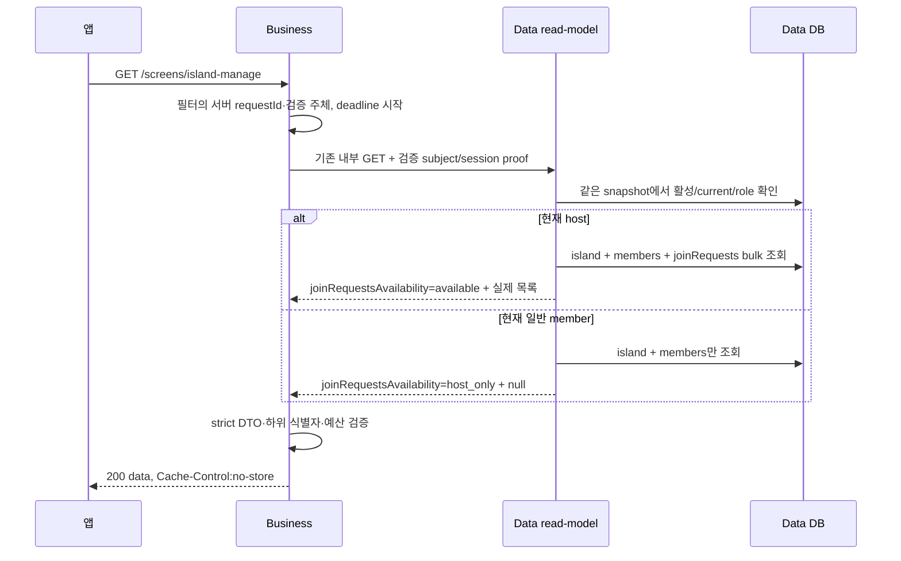
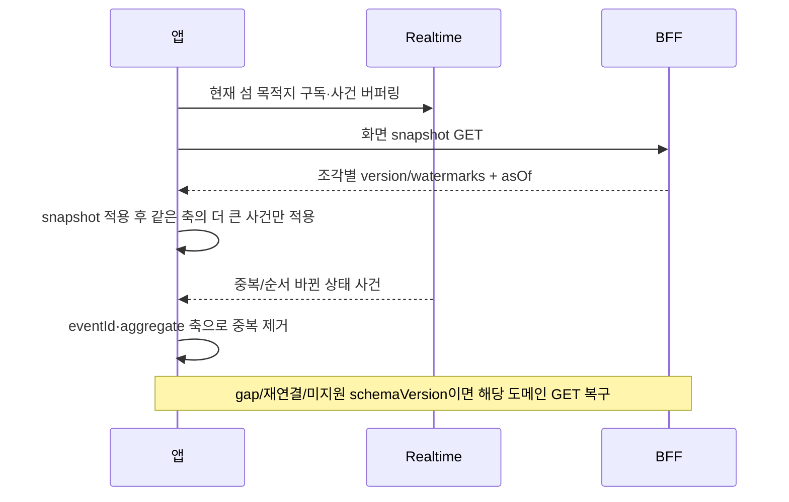

# 아키텍처와 데이터 흐름

BFF는 화면에 필요한 서류를 한 봉투에 넣어 주는 창구다. 서류 내용이 서로 맞아야 하므로 Data는 같은 시점의 장부를 읽는다. Business가 각 서류를 다른 시각에 받아 놓고 “같은 시점”이라고 이름만 붙이지 않는다.

```mermaid
flowchart LR
  App[화면 진입/필터 변경] --> Business[Business BFF 인증·입력·공통 봉투]
  Business --> Context[서버 검증 subject/session + 전체 deadline]
  Context --> Client[기존 InternalHttpClient / ScreenComposer]
  Client --> ReadModel[Data 화면 read-model GET]
  ReadModel --> Guard[현재 사용자·세션·소속·시설 검사]
  Guard --> Snapshot[(같은 DB read snapshot)]
  Snapshot --> Queries[기존 query 모듈 bulk 조회]
  Queries --> DTO[공개 DTO + 하위 versions + asOf]
  DTO --> Business
  Business --> App
  Domain[별도 사용자 명령] --> WriteTX[Data 명령 TX / receipt / outbox]
  WriteTX --> Realtime[기존 Realtime 이벤트]
  Realtime --> App
```

공통 ScreenComposer는 독립 GET 병렬 처리·예산·취소를 제공한다. 초기 13개 화면의 주요 재료는 하나의 Data 원자 읽기 묶음이므로 R 조각 하나로 호출할 수 있다. 원래 작은 도메인 query들을 Data facade에서 재사용한다. 공개 도메인 API를 제거하거나 새로운 HTTP 클라이언트·BFF 전용 DB를 만드는 구조가 아니다.

이 묶음은 기술 결정 D42가 채택한 [아키텍처 A9](../../architecture/decisions.md)의 접근 패턴 예외다. 서로 다른 자원의 인가·잔액·보유·진행 상태를 하나의 DB snapshot에서 읽어야 하는 경우로 한정하며, 단순 화면 추가나 필드 조합은 기존 정규 리소스·ids 배치와 Business 조합을 따른다. 예외의 내부 표면은 LLD §3의 13개 GET으로 제한하고 임의 화면 이름이나 wildcard allowlist로 확장하지 않는다.

앱의 `/screens/...` 요청은 Nginx를 거쳐 Business로 진입한다. 사용자 무접두 결정에 따라 [선행 PR744](https://github.com/OneOrThree/phone/pull/744)가 `/screens`와 그 하위의 ingress 설정을 제공한다. 이 설계는 해당 설정과 BFF 제공자의 통합·배포 검증을 BG08로 요구하며, 기존 `/api/v1` 계약을 바꾸거나 현재 운영 도달성을 가정하지 않는다.

위임/강퇴로 실제 Data가403을 반환하면 위 그림의 일반member 성공 분기로 바꾸지 않는다. 화면 전체를 실패시키고 미완료 I/O를 취소한다. 조회가 끝난 시점의 상태가 다음 사용자 명령을 예약하지 않으므로 실제 변경은 원 도메인 TX에서 다시 인가·버전을 검사한다.

BFF GET은 사건을 생산하지 않는다. 처음 받은 focus/rest/playback snapshot을 곧바로 같은 GET로 다시 요청하지 않는다. 돈을 빼거나 집중을 끝내는 행동은 기존 명령 endpoint와 키/version을 그대로 사용한다.

집중 주민의 표시 외양도 독립적인 버전이 필요하다. Data는 같은 snapshot에서 각 주민의 외양과 실제 user appearance.version을 읽어 `focusMembers.items[].appearanceVersion`으로 직접 반환한다. 앱은 `(member.appearance,userId)` 축에서만 사건·조회 응답을 비교하고 더 오래된 응답으로 이미 적용한 외양을 되감지 않는다. 섬 외양 버전이나 집중 투영 버전을 대신 쓰지 않는다.1765/1783 제공자와 도메인 주민 GET/BFF·앱의 역순 회귀를 함께 준비한 뒤 focus 화면을 활성화한다.
