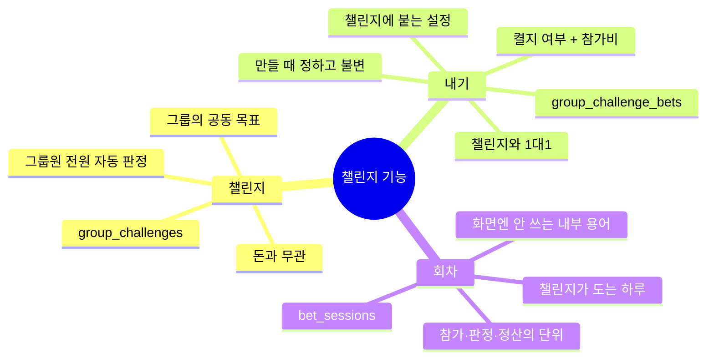
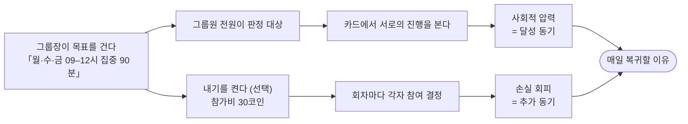
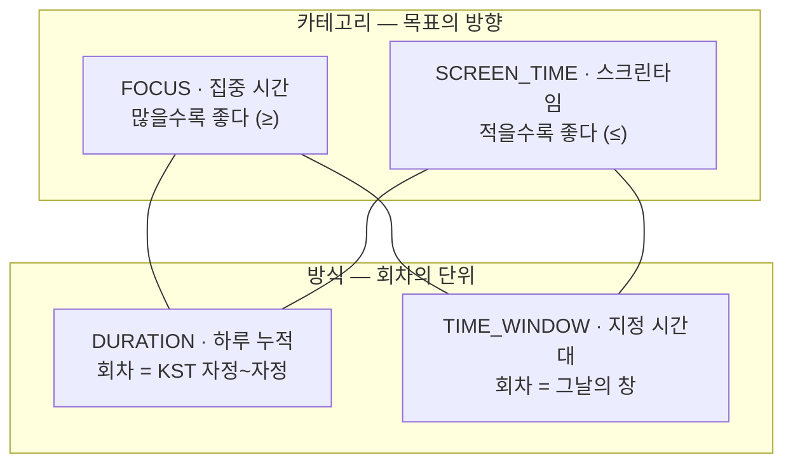
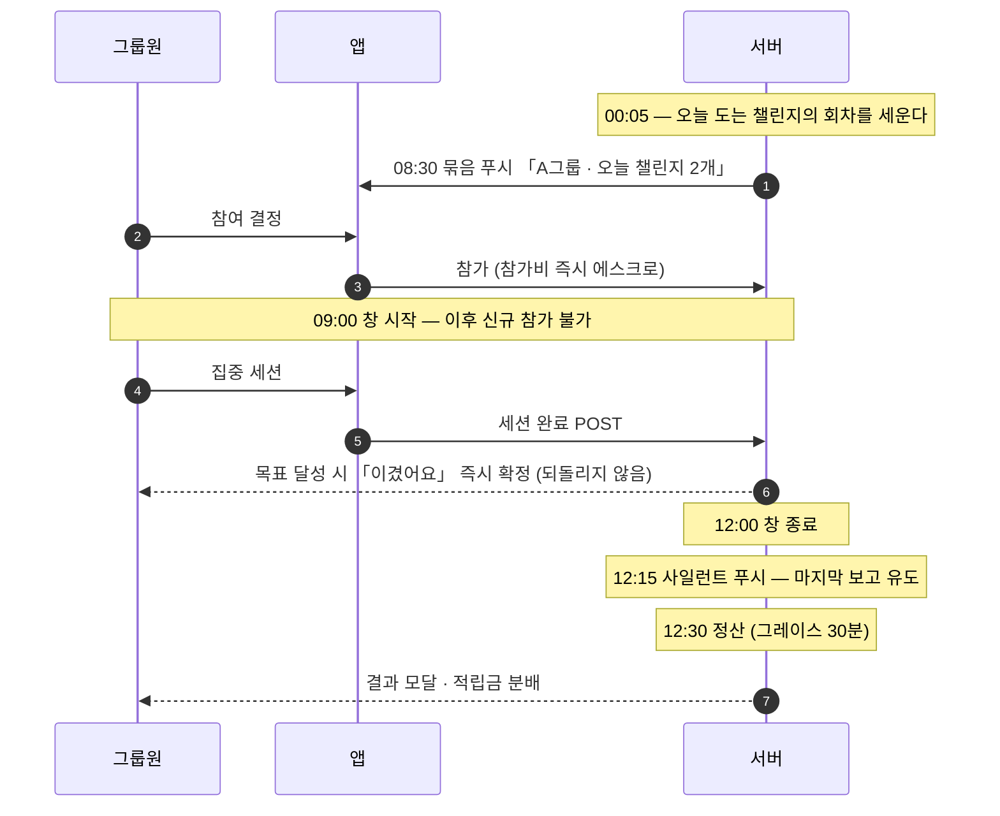
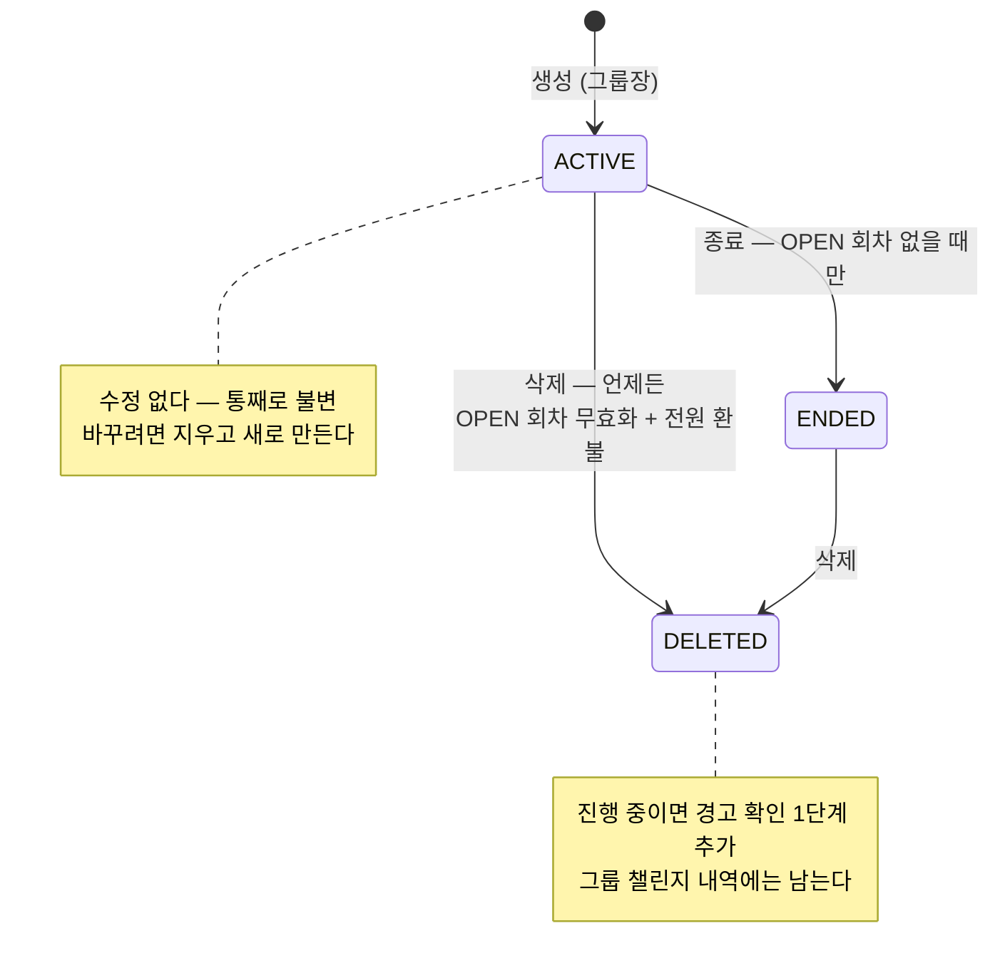
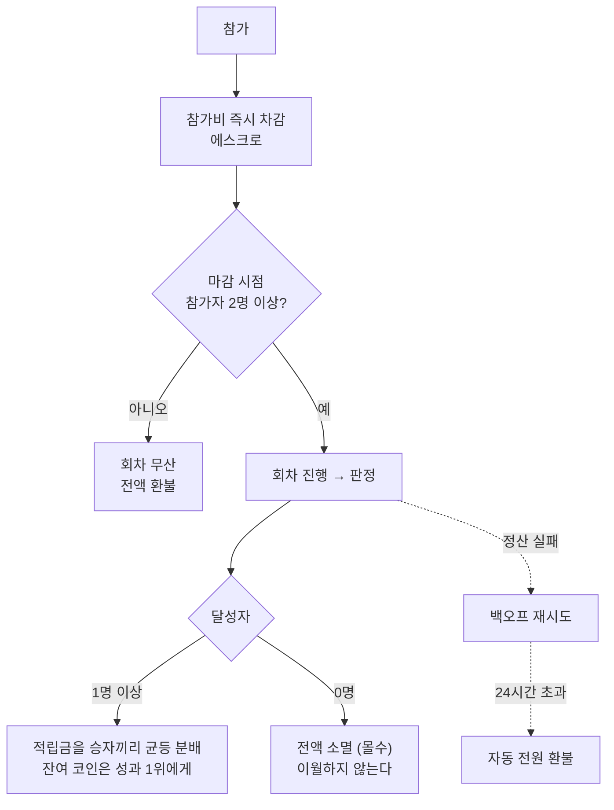
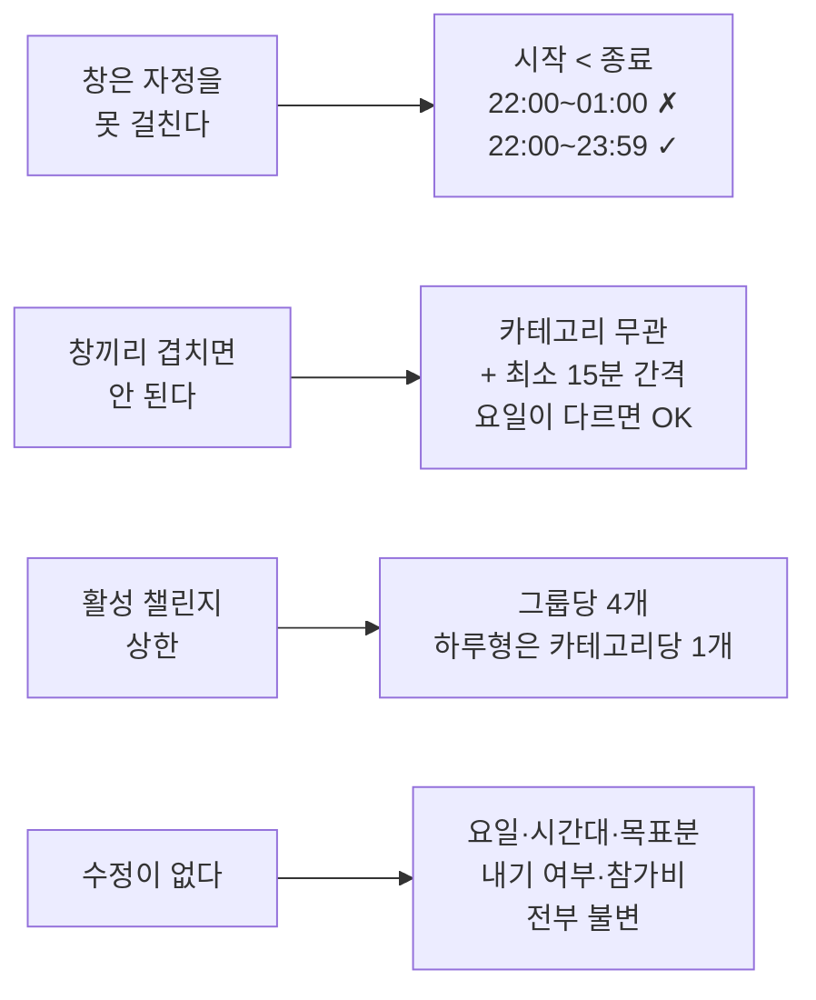

# 챌린지 — 한눈에 보기

> **그룹이 함께 지킬 목표를 걸고, 원하면 거기에 코인을 건다.**
>
> 이 문서는 **지도**다. 왜 그렇게 정했는지·정확한 규칙은 [`policy.md`](./policy.md)가 정본이고,
> 어긋나면 그쪽이 맞다.

---

## 1. 세 가지만 구분하면 된다



**챌린지와 내기의 차이가 핵심이다.** 판정은 내기를 걸든 안 걸든 **똑같이** 돌아간다.
내기가 바꾸는 건 *판정 결과에 돈이 따라붙느냐* 하나뿐이다.

|  | 챌린지 | 내기 |
| --- | --- | --- |
| 누가 대상인가 | **그룹원 전원** (자동) | **참가한 사람만** (매번 직접) |
| 언제 정하나 | 정할 게 없다 | **날마다** 참여할지 고른다 |
| 못 지키면 | 카드에 미달성으로 뜬다 | 그 위에 **참가비를 잃는다** |
| 없으면 | 챌린지가 성립 안 함 | 챌린지는 그대로 돈다 |

> ⚠️ **「판」·「판돈」·「철회」는 쓰지 않는다.** → 내기 / 참가비·적립금 / 참여 취소
> **「회차」는 내부 용어**라 화면 문구엔 안 쓴다 → `오늘(월) 참여`, `다음은 수요일`

---

## 2. 왜 이렇게 만드는가 — 핵심 루프



**목표가 먼저고 돈은 나중이다.** 이 문장에서 모든 결정이 파생된다.

---

## 3. 챌린지의 형태 — 두 축의 4조합



| 조합 | 예시 | 달성 조건 | 데이터 출처 |
| --- | --- | --- | --- |
| FOCUS × DURATION | 하루 60분 집중 | 당일 집중분 **≥** 60 | 서버 (세션 기록) |
| FOCUS × TIME_WINDOW | 09–12시에 90분 집중 | 창 내 집중분 **≥** 90 − 5(관용치) | 서버 (세션 클리핑) |
| SCREEN_TIME × DURATION | 하루 폰 120분 이하 | 당일 사용분 **≤** 120 | 클라 보고 |
| SCREEN_TIME × TIME_WINDOW | 22–24시에 30분 이하 | 창 내 사용분 **≤** 30 | 클라 보고 (**iOS만**) |

> **안드로이드 미해결**: `SCREEN_TIME × TIME_WINDOW`는 안드로이드에서 구조적으로 불가능하다.
> 지금은 미출시라 범위 밖이지만 **출시 전 반드시 결정**해야 한다 (GROMO-1257).

### 요일 반복 — 아이폰 알람 모델

```
「집중 · 09:00–12:00 · 90분」
  월 ● 화 ○ 수 ● 목 ○ 금 ● 토 ○ 일 ○
```

**기본값도 프리셋도 없다.** 하나도 안 고르면 다음으로 못 넘어간다 —
"언제 도는지"를 반드시 의식하게 만든다. 비활성 요일엔 판정도 알림도 회차도 없다.

---

## 4. 하루가 도는 모습 (창형 · 09:00–12:00 예시)



**참여는 회차마다 직접 한다.** 자동 반복은 없고, 대신 「이번 주 남은 날 전부」 단축이 있다.

---

## 5. 챌린지의 일생



| 액션 | 진행 중일 때 | 진행 중 참가비 | 성격 |
| --- | --- | --- | --- |
| **종료** | **불가** (`CHALLENGE_END_BLOCKED` 409) | — | 깨끗한 마감 |
| **삭제** | 가능 (경고 1단계 추가) | **무효화 + 전원 환불** | 강제 중단, **엎은 값을 치른다** |

> **왜 진행 중 종료는 막는가.** 종료는 환불 의무가 없다. 그걸 진행 중에 허용하면
> 그룹장이 **불리한 회차를 대가 없이 무를 수 있다.**

---

## 6. 돈의 흐름



| 규칙 | 값 |
| --- | --- |
| 참가비 | **1 ~ 3,000 코인** 정수 · 프리셋 = 상한의 10/30/50/100% (300/900/1,500/3,000) |
| 소유자 | 그룹장 (챌린지 만들 때 함께 설정, 이후 **못 끈다**) |
| 참여 취소 | `(회차 시작 전 OR 참가 후 5분 이내) AND 회차 종료 전` |
| 무산 | 마감 시 1명이면 **전액 환불** |

> **내기는 코인을 만들지 않는다** — 참가비는 참가자끼리 주고받고, 아무도 달성하지 못하면
> 팟이 **소멸**한다(FORFEITED, 이월·회수 계정 없음). 즉 제로섬이 아니라 **비인플레이션 —
> 소멸 방향**이다. 지급 합계가 항상 참가비 합계와 같다고 가정하면 회계·모니터링이 어긋난다.

---

## 7. 판정과 정산 — 조합마다 다르다

**관용치는 인심이 아니라 측정 정밀도의 함수다.**

| 조합 | 측정 정밀도 | 관용치 | 대신 |
| --- | --- | --- | --- |
| FOCUS × TIME_WINDOW | 서버 세션 클리핑 (분) | **5분** | — |
| FOCUS × DURATION | 서버 세션 기록 (분) | 0분 | 하루는 여유가 크다 |
| SCREEN_TIME × TIME_WINDOW | **15분 눈금** | 0분 | **목표분을 15분 배수로 강제** |
| SCREEN_TIME × DURATION | 일 단위 집계 | 0분 | — |

| 조합 | 정산 시점 | 왜 |
| --- | --- | --- |
| FOCUS × DURATION | KST 자정 즉시 | 자정 걸친 세션은 종료일 회차로 간다 |
| FOCUS × TIME_WINDOW | 창 종료 **+30분** | 창을 걸친 세션은 **끝나야** 서버가 안다 |
| SCREEN_TIME × TIME_WINDOW | 창 종료 **+30분** | 사일런트 푸시로 보고 유도 |
| SCREEN_TIME × DURATION | **익일 12:00** | 자정 마감이라 기기가 잔다 |

> **시간축은 KST 고정** — 저장축까지 통일한다.
> **개인 승리는 즉시 확정**되고 되돌리지 않는다. 팟 분배만 전원 확정 후에 일어난다.

---

## 8. 놓치기 쉬운 제약



**왜 창이 자정을 못 걸치나** — 요일이 회차를 가르는 축인데 회차가 요일 경계를 넘으면,
비활성 요일에 판정이 돌고 겹침 검사를 요일 교집합만으로 할 수 없게 된다.

**왜 겹침을 카테고리 무관으로 막나** — 09–12시에 집중 90분을 하면 그 시간 폰은 자연히 안 쓴다.
**하나의 행동으로 두 목표가 동시 달성**되므로 중복 보상이다.

---

## 9. 문서 지도

| 문서 | 무엇을 답하나 | 언제 보나 |
| --- | --- | --- |
| **[`policy.md`](./policy.md)** | **왜 그렇게 정했나** · 결정 로그 N1~N30 · 구현 과제 | **정본.** 규칙이 헷갈릴 때 |
| [`prd.md`](./prd.md) | 무엇을 만드나 · FR 목록 · 조건 한눈에 | 요구사항을 티켓으로 옮길 때 |
| [`information-architecture.md`](./information-architecture.md) | 화면 구조 · 진입 경로 · 정보 배치 | 앱 화면을 만들 때 |
| [`high-level-design.md`](./high-level-design.md) | 컴포넌트가 어떻게 협력하나 | 흐름 전체를 볼 때 |
| [`low-level-design.md`](./low-level-design.md) | 스키마 · 엔드포인트 · 시퀀스 | 실제로 코드를 쓸 때 |
| [`ux.html`](./ux.html) | 화면 시안 · 카피 | 브라우저로 열어볼 것 |
| [`diagrams/`](./diagrams/) | 조건 다이어그램 5종 (draw.io) | PRD가 임베드한다 |

**용어가 흔들리면 `policy.md` §1을 먼저 본다.** 계층이 셋이라 이름이 어긋나면
문서끼리 다른 얘기를 하게 된다.
