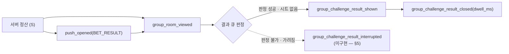

# 챌린지 분석 계약

| 항목 | 내용 |
| ---- | ---- |
| 상위 | [챌린지 지도](./README.md) · [정책 정본](./policy.md) · [PRD §5 성공 지표](./prd.md) |
| 역할 | 챌린지·내기의 **생성·참여·결과** 이벤트 이름, 발행 주체, 파라미터, 발화 조건의 단일 정본 |
| 제외 | 그룹 공통 이벤트(`group_viewed`·`group_room_viewed`·카드 덱)는 [그룹 공통 분석 계약](../group/shared/analytics.md)이 소유한다. 화면 구조는 [IA](./information-architecture.md), 구현 위치는 [LLD](./low-level-design.md) |
| 기준 | 2026-08-14 `origin/main`(`e78d689ec` — PR #650 병합 후). 표의 모든 행은 `analyticsEvents.ts`의 실제 정의·호출부와 대조해 적었다 |
| 참조 규칙 | **줄 번호를 쓰지 않고 파일 + 심볼(함수·상수·핸들러)로 가리킨다.** 줄은 커밋마다 밀려 문서가 무관한 코드를 가리키게 되고, 그때마다 "코드와 대조했다"는 이 문서의 유일한 값어치가 무너진다. 실제로 세 라운드 연속 이 문제로 지적받았다 |

---

## 0. 왜 이 문서가 생겼나 — 정본 주소가 실재하지 않았다

**소유권만 넘어오고 문서가 따라오지 않았다.**
[그룹 공통 분석 계약](../group/shared/analytics.md)이 이렇게 넘겼다:

> 챌린지·내기의 생성, 참여, 결과 이벤트는 이 표에 추가하지 않는다. 해당 기능의 이벤트 정본은 챌린지 문서가 소유한다.

그런데 **받은 쪽에 계측 절이 없었다.** `docs/prd/challenge/`에 이벤트 표가 없었고,
`prd.md` §5의 서술이 이벤트 이름 몇 개를 나열할 뿐이었다.

**게다가 코드가 가리키는 주소가 저장소에 없다.**
`analyticsEvents.ts`의 그룹 챌린지 내기 절 헤더와 `types/dto/group.ts` 내기 절 헤더이
`docs/app/challenge-impl-2026-08/contract.md §계측`을 정본으로 인용하는데,
저장소에 **`docs/app/` 디렉터리 자체가 없다**(개인 스크래치라 gitignore 대상).
같은 파일의 `event-logging-design.md`(`:33`·`:388`·`:412`·`:689` 등) 인용도 마찬가지로 실재하지 않는다.

> **이제 챌린지 계측의 정본은 이 문서다.**
> 코드 주석의 죽은 주소를 이 문서로 고치는 작업은 **후속**이다 — 이 배치가 계측 코드를 문서로만
> 남긴 이유는 PR #650이 같은 파일을 +223/−21로 바꾸고 있었기 때문인데(배치 결정 로그 N07),
> **그 #650은 2026-08-13에 머지됐다**(`e78d689ec`). 즉 이 문서의 기준 트리에는 이미 반영돼 있고
> 코드 배선은 지금 열려 있다 — **GROMO-1585**가 가져간다.

---

## 1. 측정 원칙

그룹 공통 계약의 원칙을 **그대로 상속**한다(`C`=앱 typed helper, `S`=서버 MP, `A`=GA4 자동).
챌린지 축에서 추가로 지키는 것은 셋이다.

- **성공한 것만 센다.** 생성·참여·취소·삭제는 **API 2xx 뒤에만** 발행한다.
  잔액 부족·중복·409로 튕긴 시도까지 세면 "실제 성립한 내기 수"가 부푼다.
  (`groupApi.ts`·`BetSheet.tsx` 주석이 같은 규칙을 코드에 박아 두었다.)
- **한 번의 결심 = 한 건이다.** 주간 예약(`join-week` N건)도 `group_bet_joined` **1건**이다.
  N건으로 세면 '참여 결심 수'와 '참여 건수'가 뒤섞여 퍼널 분모·분자가 갈리고,
  단축을 쓸수록 지표가 커져 단축 도입 효과를 스스로 부풀린다. 규모는 `session_count`로 남긴다.
- **모르는 값은 키 자체를 생략한다.** `null`/`undefined`는 `analytics.ts` `sanitizeParams`의 `sanitizeParams`가
  파라미터에서 통째로 뺀다. `'unknown'`·`'null'` 같은 문자열을 대신 채워 넣지 않는다 —
  "값이 없다"와 "값이 unknown이다"는 다른 사실이다.

### 1.1 이름·파라미터 규칙 (배치 계약 §5)

| 규칙 | 내용 |
| --- | --- |
| 이름 | `snake_case`, `<도메인>_<서브도메인>_<행위>`. 40자를 넘기면 `sanitizeName`(`analytics.ts` `sanitizeName`)이 잘라 **다른 이벤트로 뭉갠다** |
| 사유 있는 중단 | `_interrupted` 접미사 + `reason` enum. 선례 `group_deck_guide_interrupted`(`analyticsEvents.ts` `logGroupDeckGuideInterrupted`) |
| 실패 | `_failed` 접미사. 선례 `focus_marker_start_failed` · `group_deck_guide_read_failed` · `guide_complete_write_failed` · `onboarding_signup_failed` |
| 미지원 | `_unsupported`. 선례 `screentime_window_unsupported` |
| 금지 접미사 | `_skipped`·`_blocked`는 이 코드베이스에 **없다.** 새로 만들지 않는다 |
| 카운트 | `*_count` (`achiever_count`·`member_count`·`session_count`·`participants_count`) |
| 시간 | `*_ms` / `*_minutes` (`dwell_ms`·`duration_minutes`) |
| **금지 키** | **`value`** — GA4 예약 파라미터(숫자 이벤트 값)라 사용 금지(`logNotificationSettingChanged` 주석). **`source`** — 공통 파라미터(클라/서버 출처 `client`)와 이름이 겹쳐 덮어쓴다(`logFriendRequestSent` 주석) |

---

## 2. 이벤트 사전 — 구현되어 발화 중

| 축 | 이벤트 | 유형·주체 | 정확한 발행 시점 | 파라미터 |
| --- | --- | --- | --- | --- |
| 생성 | `group_challenge_created` | result·C | `createChallenge` 2xx 직후 (`ChallengeComposeSheet.tsx` — 생성 성공 핸들러) | `mission_type`, `mission_category`, `duration_minutes`, `has_window` |
| 생성 | `group_bet_enabled` | result·C | 같은 성공 경로에서 참가비를 정했을 때만 (`ChallengeComposeSheet.tsx` — 같은 핸들러의 참가비 분기) | `stake`, `mission_type`, `mission_category` |
| 생성 | `group_challenge_deleted` | result·C | `DELETE .../challenges/{id}` 2xx 직후 (`groupApi.ts` — `deleteChallenge`) | `mission_type`, `mission_category` — 메타는 API 층 캐시에서 꺼내며, **캐시 미적중이면 이벤트 자체가 안 나간다** |
| 내기 | `group_bet_created` | result·C | `createBet` 2xx 직후 (`BetSheet.tsx` — `requestCreate`) | `stake`, `mission_type`, `mission_category` |
| 내기 | `group_bet_joined` | result·C | 기존 회차 참가(`BetSheet.tsx` — `requestJoin`) · 다음 회차 예약(`JoinNextSheet.tsx`) · 주간 예약(`JoinWeekSheet.tsx`, `actual.length > 0`일 때만) 각 2xx 직후. **개설 경로에서는 나가지 않는다** — 아래 각주 4 | `stake`(**하루치**), `session_count?`, `mission_type`, `mission_category` |
| 내기 | `group_bet_canceled` | result·C | 내기가 **통째로 닫힐 때만** — 개설자 취소 · 마지막 참가자 철회(`ChallengeCard.tsx`, `participantsCount === 1`). **서버는 이때 회차 행 자체를 삭제한다** — 아래 각주 | `stake`, `participants_count` |
| 내기 | `group_challenge_joined` | result·C | 참여 성공 경로에서 `group_bet_joined`와 **나란히** 발행 (`BetSheet.tsx` `requestCreate` · `JoinNextSheet.tsx` · `JoinWeekSheet.tsx`) — 내기 참여와 별도로 **챌린지 참여 퍼널**을 집계한다 | `session_count?`, `mission_type`, `mission_category` |
| 결과 | `group_challenge_settled` | result·C | **참가자 각자가** 정산 결과를 조회했을 때 (`groupApi.ts` `getMyChallengeResults`, `userId:sessionId` 키로 1회) — 아래 각주 3 | `status` ∈ `SETTLED \| FORFEITED \| VOIDED \| REFUNDED` |
| 결과 | **`group_challenge_result_shown`** | exposure·C | **결과 모달이 실제로 뜬 순간** 결과당 1회 (`GroupRoomScreen.tsx` — 노출 이펙트) | `status`, `achieved?`, `achiever_count`, `member_count` (+ `mission_type?`·`mission_category?` — §2.1) |
| 결과 | **`group_challenge_result_closed`** | action·C | 결과 모달을 닫은 순간 (`GroupRoomScreen.tsx` — `onResultClose`) | `dwell_ms` |
| 결과 | `push_opened` | action·C | 백그라운드 배너 탭·종료 상태 콜드스타트(`push.ts` — `logPushOpened` 호출부 2곳) | `type` ∈ `BET_RESULT \| CHALLENGE_WINDOW_END` |
| 보고 | `screentime_window_reported` | result·C | 창 사용분 업로드 **API 성공 시에만** (`screentimeSync.ts` — `syncWindowUsage` 업로드 성공 분기) | `minutes`, `is_final` |
| 보고 | `screentime_window_unsupported` | result·C | **iOS에서만** — 구 바이너리 가드로 업로드를 전체 스킵할 때 **JS 런타임당 1회** (`screentimeSync.ts` — `syncWindowUsage` 구 바이너리 가드) — 아래 각주 | 없음 |

> **각주 1 — `GroupBetStatus`는 이름이 같은 타입이 둘이다. 섞어 읽지 않는다.**
> - 앱 `app/src/types/dto/group.ts` `GroupBetStatus` — `OPEN`·`SETTLED`·`REFUNDED`·`FORFEITED`·**`CANCELED`**
> - 서버 `GroupBetStatus.java` — `OPEN`·`SETTLED`·`REFUNDED`·`FORFEITED`·`VOIDED`·`UNUSED`
>
> `ChallengeCard.tsx` 철회 핸들러 주석이 "서버가 내기를 `CANCELED`로 닫는다"고 적은 것은 **앱 타입 축이라
> 그 자체로 틀리지 않았다.** 이 각주의 앞선 판이 서버 enum만 보고 "`CANCELED`는 존재하지 않는다"고
> 단정했는데, 그건 두 타입을 섞어 읽은 것이었다(codex 리뷰가 잡았다).
>
> 다만 **서버가 실제로 무엇을 하는지는 따로 확인해야 한다.** `GroupBetService.leaveBet`은 마지막
> 참가자가 빠지면 `groupChallengeBetSessionRepository.delete(session)`으로 **회차 행을 지운다.**
> 회차(session)와 내기(bet)는 다른 축이므로 "내기는 `CANCELED`로 닫히고 회차 행은 지워진다"가
> 동시에 참일 수 있다. **이 이벤트가 어느 축의 사건을 세는지는 확정하지 않는다** — §6 G7.
> 그때까지 이 행은 "**내기가 통째로 닫혔다**"로만 읽고, 회차 존속 여부를 파생하지 않는다.
>
> **각주 2 — `screentime_window_unsupported`는 세션당 1회가 아니다.**
> 가드 `windowUnsupportedLogged`(`screentimeSync.ts` 모듈 스코프)가 **모듈 전역 boolean**이고
> 리셋 지점이 없다. 앱 프로세스가 여러 GA4 세션에 걸쳐 살아 있으면 그 사이 전부 1건으로 접힌다.
> **그리고 iOS 전용이다.** `syncWindowUsage`가 `Platform.OS !== 'ios'`에서 먼저 반환하므로
> Android에서는 **절대 발행되지 않는다.** 전 플랫폼 대시보드에서 Android의 이벤트 부재를
> "지원됨"으로 읽으면 업데이트 필요 규모를 과소 집계한다.
>
> **하한도 상한도 아니다.** 한 런타임이 여러 GA4 세션에 걸치면 과소 집계되고, 반대로 크래시나
> 강제 종료 후 재실행되면 같은 GA4 세션 안에서 다시 발행된다. **JS 런타임 단위 진단값**으로만
> 읽는다 — "미지원 사용자가 존재하는가"와 그 추세를 보는 값이지, 세션·사용자 수로 환산하지 않는다.

> **각주 4 — `group_bet_joined`와 `group_challenge_joined`의 모집단은 같지 않다.**
> 내기 **개설** 성공 경로는 `group_bet_created` 다음에 `group_challenge_joined`만 발행한다
> (개설자는 그 자리에서 참가가 확정되지만 "기존 회차에 참가"한 것이 아니다).
> `group_bet_joined`는 **이미 있는 회차에 참가하는 분기**에서만 나간다.
> 그래서 `group_challenge_joined` ≥ `group_bet_joined`이고, 그 차이가 곧 **개설자의 자동 참여 수**다.
> 두 이벤트를 같은 모집단으로 보면 개설자 참여를 통째로 누락하거나 그 차이를 계측 손실로 오독한다.
>
> **각주 3 — `group_challenge_settled`는 회차 수가 아니라 「참가자가 결과를 조회한 횟수」다.**
> `getMyChallengeResults` 응답을 받은 **각 계정에서** `userId:sessionId` 키로 한 번씩 발행된다.
> 그래서 참가자 5명의 같은 회차는 **최대 5건**이 되고, 앱을 열지 않은 참가자의 건은 **아예 남지
> 않는다.** 이 값을 회차 정산 수로 집계하면 참가자 수와 앱 복귀율에 따라 부풀거나 누락된다.
> **회차 단위 정산 지표는 서버 로그가 정본이고, 이 이벤트는 「정산 결과가 사용자에게 도달했는가」의
> 앱 축 신호로만 쓴다.** 회차 단위로 보려면 `session_id` 중복 제거가 선행이다(미구현 — §6 G8).
>
> `challenge_create_started`(`analyticsEvents.ts` `logChallengeCreateStarted`)는 **호출부가 0건**이다(앱 전체 grep).
> 챌린지 만들기 시트 진입은 지금 아무 이벤트도 남기지 않으므로,
> "생성 시트 진입 → 생성 성공" 전환율은 현재 계산할 수 없다.

### 2.1 `group_challenge_result_shown` — 상세

**왜 재는가.** 퍼널 `챌린지 생성 → 내기 → 결과 확인 → 재참여`의 **결과 확인** 칸이다.
정산이 끝났다는 사실은 서버가 알지만, 그걸 **사용자가 실제로 봤는지**는 이 이벤트만 안다.
`push_opened(BET_RESULT)`가 "푸시를 눌러 들어왔다"까지라면 이 이벤트는 "결과가 눈앞에 떴다"이다.

정의 `analyticsEvents.ts` `logGroupChallengeResultShown` · 호출 `GroupRoomScreen.tsx` 노출 이펙트.

| 파라미터 | 값 | 왜 싣는가 |
| --- | --- | --- |
| `status` | `SETTLED \| FORFEITED \| VOIDED \| REFUNDED` (`challengeResult.ts` `RESULT_STATUSES`) | 정산 결말별 노출 분포. **무산·환불도 결과로 친다**(§D3)는 정책이 지표에서도 보여야 한다 |
| `achieved?` | `true \| false` | **내 결과**다(그룹 전체가 아니다). `null`(미판정)이면 `?? undefined`로 **파라미터를 아예 생략**한다(`GroupRoomScreen.tsx` 노출 이펙트) — `false`(미달성)와 뭉개지 않는다 |
| `achiever_count` | 정수 | 달성자 수. `member_count`와 짝으로 봐야 "혼자 이겼다/다 같이 졌다"가 갈린다 |
| `member_count` | 정수 | 판정 대상 수 = 위 값의 분모 |
| `mission_type?` | `DURATION \| TIME_WINDOW` | 시그니처에 **옵셔널로 있으나 지금은 값이 안 실린다** — 아래 각주 |
| `mission_category?` | `FOCUS \| SCREEN_TIME` | 위와 같음 |

> **각주 — 미션 메타 2종은 정의만 있고 값이 없다.**
> v2에서 결과 소스가 `/me/challenge-results`로 바뀌며(N53) 응답에 미션 메타가 없어졌고,
> 호출부(`GroupRoomScreen.tsx` 노출 이펙트)는 두 키를 **넘기지 않는다.** 구 데이터 연속성을 위해
> 시그니처만 옵셔널로 남긴 상태다(`logGroupChallengeResultShown` 시그니처 주석).
> 서버는 이미 준다 — `MyChallengeResultResponse`에 `missionCategory`·`missionType`이 있고
> `GroupBetQueryService`가 채운다(커밋 `ef47da7d5`, PR #573). **남은 갭은 앱 DTO뿐이며 GROMO-1583이 가져간다.**
> 그때까지 **결과 노출을 미션 조합별로 쪼개는 분석은 불가능하다** — 지금 데이터로 그 축을 그리면 전부 빈 값이다.

**발화 1회 가드**(`GroupRoomScreen.tsx` 노출 이펙트)

- 가드 키는 `resultShownKeyRef` = 현재 결과의 `sessionId`. 같은 키면 즉시 return하므로
  rerender·모달이 떠 있는 사이의 재조회로는 다시 발행되지 않는다.
- 기록 시점은 **모달이 뜬 순간**이지 닫을 때가 아니다. 닫을 때 기록하면 모달이 떠 있는 사이의
  당겨서 새로고침이 같은 결과를 큐에 또 넣는다. (후속 서버 ack 설계 GROMO-1577의 전제이기도 하다.)
- ⚠️ **"결과당 1회"는 best-effort지 보장이 아니다.** 가드는 두 층인데 둘 다 새는 구멍이 있다 —
  `resultShownKeyRef`는 모달을 닫으면 비워지고(그 세션 안에서만 유효), `markChallengeResultSeen`의
  AsyncStorage 쓰기는 **실패해도 삼킨다**(`challengeResult.ts` `markChallengeResultSeen`, `.catch(() => {})`).
  쓰기가 실패하면 다음 조회에서 같은 회차가 다시 unseen으로 들어와 `shown`이 재발행된다.
  그래서 `shown` 수는 **고유 결과 수보다 클 수 있다** — 결과당 노출 횟수를 세는 지표는
  `session_id` 단위 중복 제거 없이는 만들지 않는다. 서버 ack(GROMO-1577)이 이 구멍을 닫는다.
- 같은 이펙트에서 `markChallengeResultSeen`(AsyncStorage 노출 마커)도 함께 쓴다 —
  **계측과 재노출 가드가 같은 순간을 공유한다.** 한쪽만 옮기면 둘이 어긋난다.

### 2.2 `group_challenge_result_closed` — 상세

**왜 재는가.** 결과를 **읽는지 바로 넘기는지**를 가른다. 노출만 세면 "떴다"까지밖에 모른다.
체류가 1초 미만으로 몰리면 결과 화면이 읽히지 않는다는 뜻이고, 그건 카피·정보 배치 문제다.

정의 `analyticsEvents.ts` `logGroupChallengeResultClosed` · 호출 `GroupRoomScreen.tsx` `onResultClose`.

| 파라미터 | 값 | 왜 싣는가 |
| --- | --- | --- |
| `dwell_ms` | `Date.now() - resultShownAtRef` | 노출부터 닫기까지 체류(ms). **읽은 시간이 아니다** — 아래 각주 |

> **각주 — `dwell_ms`에는 백그라운드 시간이 섞여 있다.**
> 모달을 띄운 채 앱을 백그라운드로 보냈다가 돌아와 닫으면 `resultShownAtRef`는 중단 없이
> 유지되므로 **그 사이 시간이 전부 포함된다.** AppState 전환에 타이머를 멈추는 로직은 없다.
> 그래서 평균은 쉽게 부푼다 — **중앙값과 짧은 쪽 분위수(P25 이하)로 읽는다.**
> "1초 미만 비율" 같은 하단 지표는 백그라운드가 값을 늘리기만 하므로 영향을 받지 않는다.
> 정확한 읽기 시간이 필요하면 AppState 전환 시 타이머 일시정지가 선행이다(미구현).

- `resultShownAtRef`가 `null`이면(= 노출 이벤트가 나간 적 없으면) **발행하지 않는다** —
  `closed > shown`이 되는 구간을 만들지 않는다.
- 닫기 콜백은 큐의 다음 결과로 넘어가며 `resultShownKeyRef`를 비운다. 즉 **결과 N건을 연속으로 보면
  shown N건 / closed N건**이 짝으로 남는다.
- **앱이 죽거나 백그라운드로 간 채 돌아오지 않으면 `closed`가 없다.** `dwell_ms` 분포를 볼 때
  분모는 `closed`가 아니라 `shown`이어야 하고, 그 차이가 곧 "닫지 않고 이탈"이다.

---

## 3. enum

| 속성 | 허용값 | 출처 |
| --- | --- | --- |
| `mission_type` | `DURATION \| TIME_WINDOW` | 서버 enum 문자열 그대로 |
| `mission_category` | `FOCUS \| SCREEN_TIME` | 서버 enum 문자열 그대로 |
| `status` (결과) | `SETTLED \| FORFEITED \| VOIDED \| REFUNDED` | `challengeResult.ts` `RESULT_STATUSES` `RESULT_STATUSES`. `OPEN`·`UNUSED`는 모달 후보에서 제외되므로 이 이벤트에 나타나면 **버그** |
| `type` (`push_opened`) | `BET_RESULT \| CHALLENGE_WINDOW_END` | `push.ts` |
| `stake` | 1~3,000 정수 | 주간 예약은 **가장 큰 하루치** (총액이 아니다) |
| `has_window` | boolean | `mission_type === 'TIME_WINDOW'`와 형식상 중복이지만 계측 표의 계약이다 |
| `is_final` | boolean | `false` = 창 진행 중 중간 보고 |

---

## 4. 결과 확인 퍼널



- `push_opened(BET_RESULT)` → 30% 복귀는 PRD §5의 목표치다. 다만 **이 이벤트는 백그라운드 탭과
  콜드스타트만 센다** — 포그라운드에서 표시한 로컬 알림을 탭한 경로(`push.ts`)는 딥링크만 타고
  `push_opened`를 발행하지 않는다. 복귀율은 **하한**으로 읽어야 한다.
- 정산과 노출 사이에 **끊기는 구간이 세 군데** 있는데(§5) 지금 계측으로는 전부 보이지 않는다.
  그래서 `shown / push_opened` 비율이 낮게 나와도 **원인을 지목할 수 없다.**

---

## 5. 미구현 — 미노출 사유 이벤트 (설계)

> **상태: 설계만. 코드는 아직 쓰지 않는다.**
> 이 배치가 계측 코드를 건드리지 않은 이유는 PR #650이 같은 파일을 바꾸고 있었기 때문인데(N07),
> **#650은 이미 머지됐다**(`e78d689ec`). 구현은 **GROMO-1585**가 가져간다.

### 5.1 왜 필요한가

**지금 계측은 "떴다"만 잰다.** "떠야 했는데 안 떴다"를 못 잰다. 결과는 셋이다.

1. 결과 모달이 실제로 얼마나 안 뜨는지 **모른다.** 정산은 서버 로그에 있고 노출은 GA4에 있는데,
   그 사이에서 새는 양은 어느 쪽에도 없다.
2. 트리거 재정의(GROMO-1576)의 효과를 **검증할 수 없다.** 개선 전후로 비교할 지표가 없다.
3. 카드 덱 노출(GROMO-1575)이 모달을 얼마나 대체했는지 **알 수 없다.**

### 5.2 코드에 이미 있는 미노출 분기 세 곳

| # | 무슨 일이 일어나나 | 위치 | 결과 |
| --- | --- | --- | --- |
| ① | AsyncStorage 노출 마커를 못 읽어 `filterUnseenChallengeResults`가 `null`("판정 불가")을 돌려준다 | `challengeResult.ts` `filterUnseenChallengeResults` → 받는 곳 `GroupRoomScreen.tsx` — `filterUnseenChallengeResults`가 `null`을 돌려준 자리 | `unseenKnown = false` → `resultsUnknown = true`(`:410-412`) → **큐를 건드리지 않는다** |
| ② | `/me/challenge-results` 조회 자체가 실패했다 | `GroupRoomScreen.tsx` — `resultEntries === null && userId`인 자리 | 역시 `resultsUnknown = true` → 큐 유지 |
| ③ | 다른 시트(⋯ 메뉴·만들기·내기·초대)가 떠 있다 | `GroupRoomScreen.tsx` — `currentResult !== null && !resultVisible`인 자리 | `resultVisible = false` — **미룬다.** 큐는 상태로 남아 시트가 닫히면 그때 뜬다 |

**①②는 "이번엔 못 띄웠고 없다고 확정하지도 못했다"이고, ③은 "지연"이다.**
셋을 한 이벤트로 뭉치되 `reason`으로 반드시 갈라야 한다 — ③을 미노출로 세면 실제보다 나쁘게,
①②를 지연으로 세면 실제보다 좋게 보인다.

### 5.3 이벤트 설계

**이름**: `group_challenge_result_interrupted` (34자 — `sanitizeName` 40자 한도 안)

`<도메인>_<서브도메인>_<행위>` + 사유 있는 중단은 `_interrupted` + `reason` enum.
선례 `logGroupDeckGuideInterrupted({ reason: 'background' | 'route' | 'groups_changed' | 'blocking_overlay' | 'unmount' })`
(`analyticsEvents.ts` `logGroupDeckGuideInterrupted`)의 형태를 그대로 따른다. `blocking_overlay`는 그 선례가
**"다른 오버레이에 막혔다"에 쓰는 값 그대로**를 재사용한 것이다.

```ts
// 결과 모달을 띄우지 못한 사유 — "떴다"의 반대편. 이게 없으면 노출률의 분모가 없다.
export function logGroupChallengeResultInterrupted(p: {
  reason: 'guard_read_failed' | 'fetch_failed' | 'blocking_overlay';
  candidate_count?: number;
}): void {
  track('group_challenge_result_interrupted', p);
}
```

| 파라미터 | 값 | 왜 싣는가 |
| --- | --- | --- |
| `reason` | 아래 enum | 사유가 없으면 "안 떴다"만 남아 고칠 곳을 못 정한다 |
| `candidate_count?` | 정수 | **검사 대상이 된 후보 수 — 미노출 건수가 아니라 그 상한이다.** 아래 각주를 지키지 않으면 지표가 부푼다. **값을 모르는 사유에서는 키 자체를 생략한다** |

> **각주 — `candidate_count`를 "못 보여준 건수"로 읽지 않는다.**
> `guard_read_failed`는 노출 마커를 **못 읽어서** 나는 사유다. 즉 그 순간 후보 목록에는
> **이미 본 결과까지 섞여 있고**, 앱은 어느 것이 안 본 것인지 판별하지 못한다.
> 이 값을 미노출 건수로 해석하면 최근 결과가 많은 사용자일수록 장애가 심각해 보인다 —
> 실제 심각도가 아니라 결과 보유량을 재게 된다.
> 계약은 **"이번 판정에서 검사 대상이 된 수(실제 미노출 ≤ 이 값)"** 이다.
> 실제 미노출 건수 지표에는 이 값을 쓰지 않는다.

**`reason` enum**

| 값 | 무슨 뜻인가 | 발화 지점 | `candidate_count` | 어떻게 읽나 |
| --- | --- | --- | --- | --- |
| `guard_read_failed` | 노출 마커(AsyncStorage) 읽기 실패로 "이미 본 결과인지"를 판정하지 못했다. 안전을 위해 아무것도 띄우지 않는다 | `GroupRoomScreen.tsx` — `filterUnseenChallengeResults`가 `null`을 돌려준 자리 — `filterUnseenChallengeResults`가 `null`을 돌려준 자리 | `candidates.length` — **검사 대상 수(상한)**. 위 각주 | 기기 저장소 장애. 0에 가까워야 정상. 늘면 마커 전략 자체를 다시 봐야 한다 |
| `fetch_failed` | `/me/challenge-results` 조회가 실패해 후보 목록을 못 만들었다 | `GroupRoomScreen.tsx` — `resultEntries === null && userId`인 자리 — `resultEntries === null && userId`인 자리 | **생략** (후보 목록이 없어 알 수 없다) | 네트워크·서버 축. **비율이 아니라 절대 건수로 읽는다** — 아래 분모 절 |
| `blocking_overlay` | 후보는 있고 판정도 됐는데 다른 시트가 떠 있어 **미뤘다**. 시트가 닫히면 뜬다 | `GroupRoomScreen.tsx` — `currentResult !== null && !resultVisible`인 자리 — `currentResult !== null && !resultVisible`인 자리 | `resultQueue.length` (**안다**) | 지연이지 유실이 아니다. **①②와 절대 합산하지 않는다.** 이 값이 크면 시트 배타 규칙(N04)을 다시 볼 근거가 된다 |

**발화 가드 — 이게 없으면 숫자가 거짓말한다**

세 사유 **전부** view episode 단위로 게이트한다. "판정 시도당 1회"로는 부족하다 —
재조회(당겨서 새로고침·포그라운드 복귀)가 같은 화면에서 판정을 여러 번 돌리므로
시도당으로 세면 한 번의 방문이 여러 건이 된다.

- 게이트 키는 **`roomViewedRef`와 같은 형태**를 쓴다(`GroupRoomScreen.tsx` `roomViewedRef` 가드 —
  `{ groupId, interactionId }`). 분모가 그 키로 1회 발행되므로 분자도 같은 키를 써야 짝이 맞는다.
  사유별로 별도 슬롯을 두어 **episode × 사유당 최대 1건**으로 막는다.
- `blocking_overlay`도 **episode 단위다 — 큐 헤드 단위가 아니다.** 렌더마다 재평가되는
  조건이라 가드가 없으면 시트를 여닫은 횟수를 재게 되는데, 그렇다고 큐 헤드 `sessionId`마다
  다시 세면 **큐가 긴 사용자일수록 건수가 커져** 다른 두 사유와 같은 축에서 비교할 수 없다.
  한 episode에서 여러 결과가 연속으로 가려져도 **1건**이다. 몇 건이 가려졌는지는
  `candidate_count`(= 그 시점 `resultQueue.length`)가 말한다.

**분모 — 이 절이 이 설계에서 가장 틀리기 쉬운 곳이다**

이벤트를 늘리는 것만으로는 "얼마나 안 뜨는가"를 못 잰다. 분자만 늘 뿐이다.
그렇다고 아무 분모나 붙이면 **분자와 집계 단위가 어긋나 비율이 거짓말을 한다.**

분모 후보인 `group_room_viewed`는 **그룹 상세 로드가 성공한 뒤에만** 발행된다
(`GroupRoomScreen.tsx` `logGroupRoomViewed` 호출부 주석이 "상세 로드 성공 순간"으로 명시). 여기서 두 가지가 어긋난다.

- **분모가 아예 없는 분자가 생긴다.** 상세와 결과 조회가 함께 실패하면 `fetch_failed`는 나가는데
  `group_room_viewed`는 나가지 않는다. 상세 실패는 결과 조회 실패와 상관이 높으므로
  이 어긋남은 드문 예외가 아니라 **실패가 몰릴수록 커진다.**
- **따라서 이 비율은 하한이 아니다. 1을 넘을 수 있다.** 위 episode 게이트를 붙여 분자의
  중복을 없애도, 분모가 발행되지 않는 경로가 남는 한 상한도 보장되지 않는다.

그래서 계약을 이렇게 둔다.

| 무엇 | 어떻게 읽나 |
|---|---|
| `fetch_failed` | **절대 건수와 추세로만 읽는다.** `group_room_viewed`를 분모로 쓰지 않는다 — 분모가 없는 분자가 구조적으로 생긴다 |
| `guard_read_failed` | 절대 건수 우선. 비율이 필요하면 **상세 로드가 성공한 episode로 한정**해 조인한 뒤에만 쓴다 |
| `blocking_overlay` | 위와 같다. **`guard_read_failed`·`fetch_failed`와 절대 합산하지 않는다** — 지연을 유실로 세면 실제보다 나쁘게 보인다 |

**정확한 노출률이 필요하면 판정 시도 자체를 세는 분모가 선행이다.**
그건 그룹방 조회마다 발화하는 고빈도 이벤트라 지금은 만들지 않는다. 만들기 전까지
"결과 모달 미노출률"이라는 **비율 지표는 성립하지 않으며**, 이 이벤트들은 장애 감지와
추세 관찰에 쓴다. §6 G5는 이 분모가 생겨야 닫힌다.

**의도적으로 넣지 않은 것**

- `session_id`·`challenge_id`·`group_id` 같은 raw 식별자 — 그룹 공통 계약이 신규 이벤트 payload에
  raw ID를 넣지 않기로 했다. 사유별 분포를 보는 데 필요하지 않다.
- `_skipped`·`_blocked` 접미사 — 이 코드베이스에 없는 어휘라 만들지 않는다.
- 별도의 `..._deferred` 이벤트 — 발화 지점·가드·집계 단위가 나머지 둘과 같아 한 이벤트로 두는
  편이 구현과 대시보드 양쪽에서 단순하다.
  **단, "노출되지 못한 전체"라는 집계는 만들지 않는다.** `blocking_overlay`는 나중에 정상
  노출되는 **지연**이라 유실 두 사유와 더하면 실제보다 나쁘게 보인다(§5.3 표). 한 이벤트로
  둔 대가로 **대시보드가 `reason`을 반드시 쪼개야 한다** — `reason` 없는 총계는 이 이벤트의
  유효한 사용법이 아니다.

---

## 6. 알려진 갭 — 지금 측정할 수 없는 것

| # | 지표 | 왜 못 재나 | 어디에 걸려 있나 |
| --- | --- | --- | --- |
| G1 | **참여 취소율** (`취소 / 참여`) | 마지막 참가자가 아닌 **일반 철회는 대응 이벤트가 없다.** `group_bet_canceled`는 내기가 **통째로 닫힐 때만** 나간다(`ChallengeCard.tsx`) | `policy.md` §12·`prd.md` §5가 "전용 GA4 이벤트 신설"로 남겨 둔 갭 |
| G7 | `group_bet_canceled`가 **어느 축의 사건**을 세는가 | 앱 `GroupBetStatus`에는 `CANCELED`가 있고 서버 것에는 없다(§2 각주 1 — 이름만 같은 다른 타입). 그런데 `leaveBet`은 회차 행을 **삭제**한다. 내기가 닫히는 것과 회차가 사라지는 것이 같은 사건인지 확정되지 않았다 | 서버 축 확인 후 각주 1과 이 행을 함께 닫는다 |
| G8 | **미노출 사유의 정밀도** — 분모 정교화 · `dwell_ms` 백그라운드 편향 · 결과 중복 제거 키 · 이미 노출된 결과의 `blocking_overlay` 제외 · 빈 주간 예약 발화 조건 · 백그라운드 `shown` 확정 | PR #666 리뷰에서 나온 P2 6건. 계약 표면은 성립하지만 **집계 정밀도**를 더 조일 여지가 있다 | 미노출 사유 이벤트를 **실제로 구현할 때** 함께 정한다 — 구현 없이 문서로만 정밀도를 올리면 검증할 수단이 없다 |
| G2 | `prd.md` §5가 측정 소스로 적은 **`group_bet_left`가 코드에 없다** | 앱 전체 grep 0건. 문서만 있고 helper도 호출부도 없다 | 이름을 `group_bet_left`로 확정할지 포함해 G1과 함께 결정해야 한다. **이 문서가 임의로 정하지 않는다** |
| G3 | 미션 조합별 **결과 노출** 분포 | `group_challenge_result_shown`의 `mission_*`에 값이 안 실린다(§2.1) | GROMO-1583(앱 DTO 확장) |
| G4 | **생성 시트 진입 → 생성 성공** 전환 | `challenge_create_started` 호출부 0건 | 미배선 |
| G5 | 결과 모달 **미노출률** (비율) | 사유 이벤트가 없고(§5, PR #650 머지 후), **분모도 없다** — `group_room_viewed`는 상세 로드 성공 뒤에만 나가 분자와 집계 단위가 어긋난다(§5.3) | 사유 이벤트 + 판정 시도 분모 **둘 다** 필요. 그때까지 미노출은 **절대 건수로만** 본다 |
| G6 | 포그라운드 알림 탭 복귀 | `push.ts`가 `push_opened`를 발행하지 않는다 | `push_opened` 기반 복귀율은 하한으로만 읽는다 |

---

## 7. 구현·검증 게이트

1. 신규 이벤트는 `analyticsEvents.ts`의 typed helper **한 경로**로만 보낸다. 화면의 Firebase 직접 호출 금지.
2. §5 이벤트를 구현할 때, **구현을 되돌려 그 테스트 1건만 실패하는지** 확인한다.
   시임을 스텁으로 갈아끼우는 테스트는 배선 누락을 못 잡으므로 실제 데이터를 흘린다.
3. `group_challenge_result_shown`은 **모달이 실제로 뜬 렌더**에서만 1건이어야 한다.
   rerender·모달이 떠 있는 사이의 재조회·다른 시트에 가린 상태에서는 0건이다.
4. `achieved`가 `null`인 결과에서 payload에 `achieved` **키 자체가 없는지** 확인한다
   (`'null'`·`false`로 나가면 미판정과 미달성이 뭉개진다).
5. `group_challenge_result_closed`는 `shown` 없이 단독으로 나가지 않아야 한다.
   `closed` 수는 항상 `shown` 이하다.
6. §5의 `blocking_overlay`는 **한 view episode당 1건**을 넘지 않아야 한다 — 시트를 여러 번
   여닫아도, 큐에 결과가 여러 건 쌓여 연속으로 가려져도 1건이다(§5.3의 게이트와 같은 단위).
7. 미노출 이벤트를 도입한 뒤에는 `shown` 발화 수가 **변하지 않아야 한다** —
   미노출 계측이 노출 경로를 건드렸다면 배선이 잘못된 것이다.
8. §6의 갭이 닫히기 전에는 해당 지표를 KPI 대시보드에 올리지 않는다.
   특히 G2가 열려 있는 동안 `prd.md` §5의 "참여 취소율" 행은 **측정 개시 전** 상태다.
9. `analyticsEvents.ts`의 죽은 정본 주소(`docs/app/challenge-impl-2026-08/contract.md`·
   `event-logging-design.md`)를 이 문서로 정정하는 것은 PR #650 머지 후 후속 작업이다.
   정정 전까지 **코드 주석보다 이 문서가 우선**한다.
