# 챌린지 — 상위 설계 (High Level Design)

> 챌린지·내기 기능의 **구조와 흐름**. 어떤 컴포넌트가 무엇을 책임지고, 요청이 어떤 경로로
> 흐르며, 동시성과 시간을 어떻게 다루는지를 정리한다.
>
> **문서 지위**: to-be. 2026-08-08 백지 재정의 정책([`policy.md`](./policy.md)) 기준으로 다시 썼다.
> 현행 코드와의 차이는 `policy.md` §9가 정본이다 — 이 문서는 그 차이를 반복하지 않고,
> **도달해야 할 구조**만 기술한다.

---

## 1. 시스템 컨텍스트

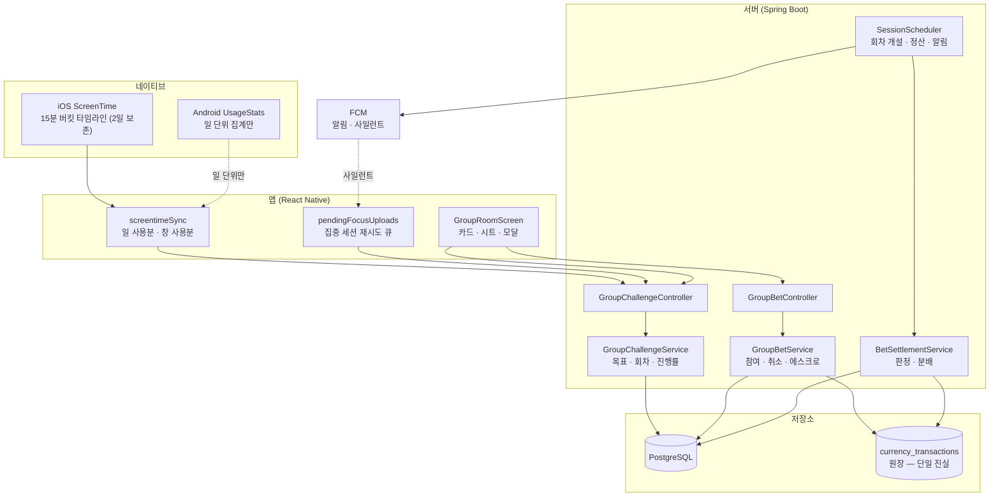

### 구성 요소의 책임

| 구성 요소 | 책임 | 책임이 **아닌** 것 |
|---|---|---|
| `GroupChallengeService` | 목표 CRUD · 요일 · 겹침 검증 · 진행률 조립 | 돈 |
| `GroupBetService` | 회차 참여 · 취소 · 에스크로 차감/환불 | 판정 |
| `BetJudge` | **달성 판정의 유일한 소유자** | 지급 |
| `BetSettlementService` | 회차 정산 · 팟 분배 · 몰수 | 판정 규칙 정의 |
| `SessionScheduler` | 회차 자동 개설 · 정산 트리거 · 알림 · 동결 복구 | 비즈니스 규칙 |
| `screentimeSync` (앱) | 네이티브 값을 서버로 올린다 | 판정 |

**`BetJudge`가 판정을 독점한다.** 카드 진행률·참가 자격 가드·정산이 전부 같은 함수를 부른다.
규칙이 두 곳에 구현되면 "내 카드엔 달성인데 돈은 못 받았다"가 발생한다.

---

## 2. 레이어 구조

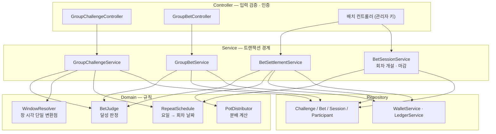

**신설되는 도메인 조각 둘**

- `RepeatSchedule` — 요일 비트마스크에서 "오늘이 활성인가", "다음 회차는 언제인가",
  "직전 회차는 언제였나"를 계산한다. 결과 모달의 "직전 회차일" 산출도 여기를 탄다.
- `BetSessionService` — 회차의 자동 개설과 마감을 소유한다. 내기(bet)는 설정이고, 회차(session)가
  실제 돈이 도는 단위다.

---

## 3. 주요 흐름

### 3.1 챌린지 생성

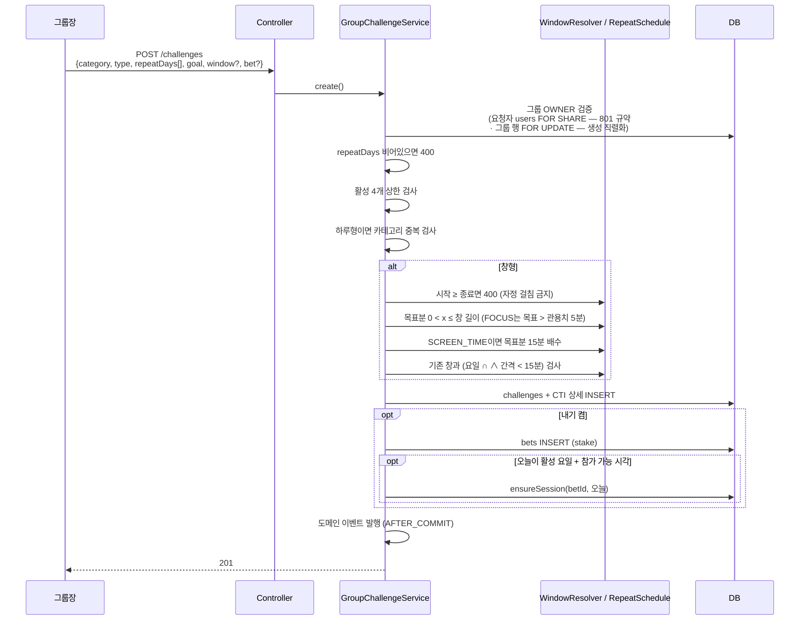

**검증 순서가 곧 에러 우선순위**다. 권한 → 요일 → 상한 → 조합 → 창 파라미터 → 겹침.
"왜 안 되는지"를 유저가 고칠 수 있는 순서로 알려준다.

**생성은 그룹 행 배타 락으로 직렬화한다.** 활성 4개 상한과 창 겹침은 그룹 전역 불변식이라
공유 락으로는 동시 생성 2건을 못 막는다 (LLD §2.1).

### 3.2 회차 개설 — lazy + 스케줄러 보증

내기가 켜진 챌린지는 활성 요일이 오면 회차가 **자동으로** 선다. 개설 API가 없다.

**개설 시점이 셋이다.** ① 매일 00:05 스케줄러(보증장치) ② `join-week` lazy — 스케줄러만
두면 "이번 주 남은 회차 전부" 예약이 성립하지 않는다. 월요일에 예약을 누르는 순간 수·금 회차
행이 **아직 존재하지 않기** 때문이다. ③ **챌린지 생성 직후** — 오늘이 활성 요일이고 아직
참가 가능한 시각이면 생성 트랜잭션에서 오늘 회차를 함께 만든다. 이게 없으면 00:05 이후 만든
챌린지는 다음 날까지 오늘 회차가 없어 단건 참여가 막힌다 (LLD §2.1).

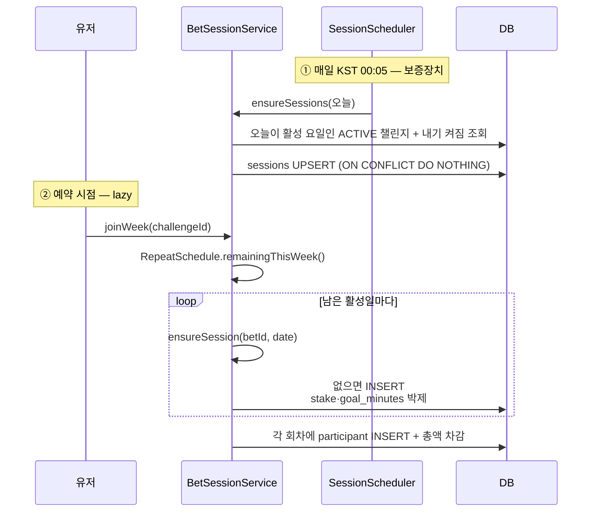

**`ensureSession`이 단일 진입점**이다. `UNIQUE(bet_id, session_date)` 덕에 세 경로가 겹쳐도
안전하고, 스케줄러는 "아무도 예약하지 않은 회차"를 메우는 역할만 한다.

**보증 스캔은 00:05 1회로 끝내지 않는다** — 멱등 UPSERT라 비용이 없으므로 **5분 정산 크론에
편승해 반복 수행**한다(캐치업). 하루 1회뿐이면 그 시각에 프로세스가 죽어 있거나 일부 챌린지의
INSERT가 실패했을 때 다음 자동 복구가 **다음 날**이라, 그날 카드에 회차가 없어 단건 참여가
종일 막힌다. (수동 트리거는 §2.3 — 자동 캐치업의 대체가 아니다.)

**단, 캐치업도 생성 경로와 같은 "참가 가능" 조건을 지킨다 (N35 확장).** 창형 챌린지의 오늘
참가 마감(창 시작)이 **이미 지났으면 오늘 회차를 만들지 않고** 다음 활성일부터 세운다. 조건 없이
UPSERT하면 창이 지난 뒤 만들어진 챌린지에 **참가 마감·종료가 이미 과거인 OPEN 회차**가 생겨,
아무도 못 들어온 채 인원 미달 `VOIDED`로 끝나고 그 무산 알림까지 나간다 — 창이 도는 동안
존재하지도 않았던 챌린지의 가짜 결과다. 하루형은 종일 참가라 이 제외가 필요 없다.

**박제 시점 = 그 회차가 처음 만들어지는 시점.** 월요일에 주 전체를 예약하면 수·금 회차도
그때의 값으로 굳는다. 챌린지 자체는 불변이라(수정 API가 없다) 값이 바뀔 일은 없지만,
박제는 **챌린지가 삭제된 뒤에도 회차를 읽기 위해** 필요하다 — 이력의 소유자가 그룹이기 때문이다.

| 필드 | 하루형 | 창형 |
|---|---|---|
| `starts_at` (회차 시작 · 취소 기준) | KST 00:00 | 창 시작 |
| `join_closes_at` (참가 마감) | `closes_at`과 동일 (종일 참가) | 창 시작 |
| `closes_at` (회차 종료) | KST 24:00 | 창 종료 (**항상 같은 날** — 자정 걸침 금지) |
| `settle_after` | FOCUS: `closes_at` / SCREEN_TIME: D+1 12:00 | `closes_at + 30분` |

회차에는 `stake`·`goal_minutes`뿐 아니라 **미션 스냅샷**(카테고리·방식·창 시각)까지 복사한다.
회차 한 줄이 자기 완결적이어야 「그룹 챌린지 내역」이 챌린지 없이도 렌더된다.

### 3.3 챌린지 목록 조회 (카드 렌더)

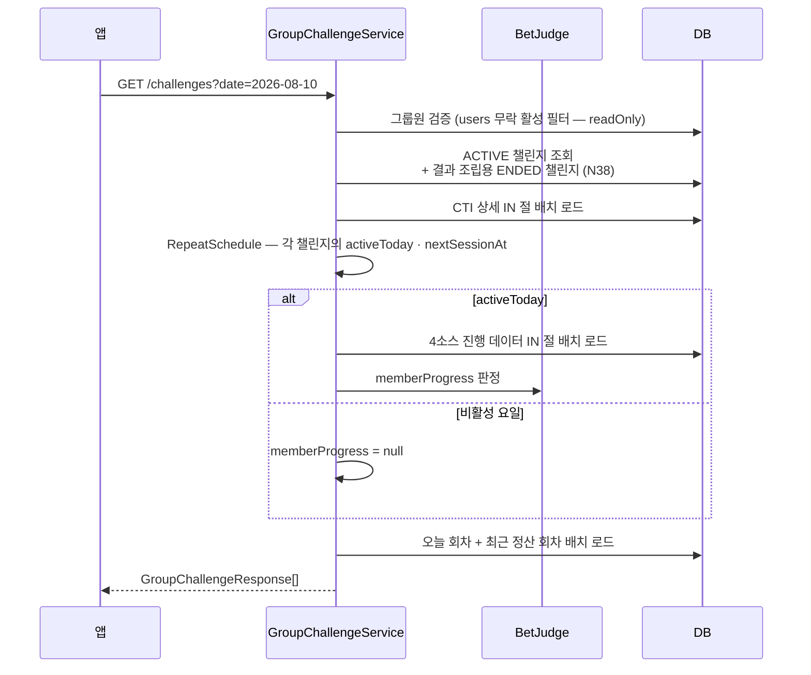

**쿼리 수는 챌린지 수·멤버 수와 무관하게 고정**이다. 전 구간 IN 절 배치 로드로 N+1을 제거한다.

**결과 조립엔 ENDED 챌린지도 포함한다 (N38).** ACTIVE만 실으면 「정산 → 그룹장 종료 → 유저
진입」 순서에서 그 챌린지의 `mySettledSessions`가 응답에서 통째로 빠져 **미확인 결과가 영영
안 보인다** — 모달의 데이터 소스는 이 조회 하나뿐이다. ENDED 챌린지는 `mySettledSessions`
조립에만 쓰고 카드는 그리지 않는다(앱은 `status=ENDED`로 구분). 삭제는 기존대로 푸시가
알린다(FR-44-4).

### 3.4 회차 참여

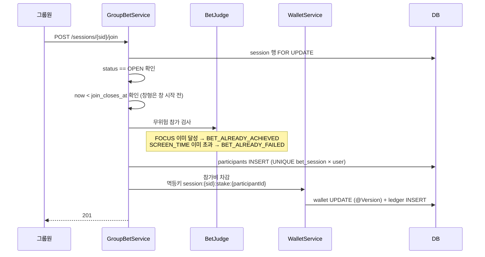

**"이번 주 남은 회차 전부"** 는 같은 로직을 회차 목록에 반복 적용한다. 단 **총액을 먼저 검사**해
중간에 잔액이 떨어져 일부만 들어가는 상태를 만들지 않는다 — 전부 성공하거나 전부 실패한다.

**미래 회차에는 무위험 참가 검사를 하지 않는다.** 아직 시작하지 않은 회차에는 진행분이 없어
"이미 달성"·"이미 초과"가 성립할 수 없다. 검사는 **오늘 회차에만** 적용한다.

### 3.5 취소와 그룹 탈퇴

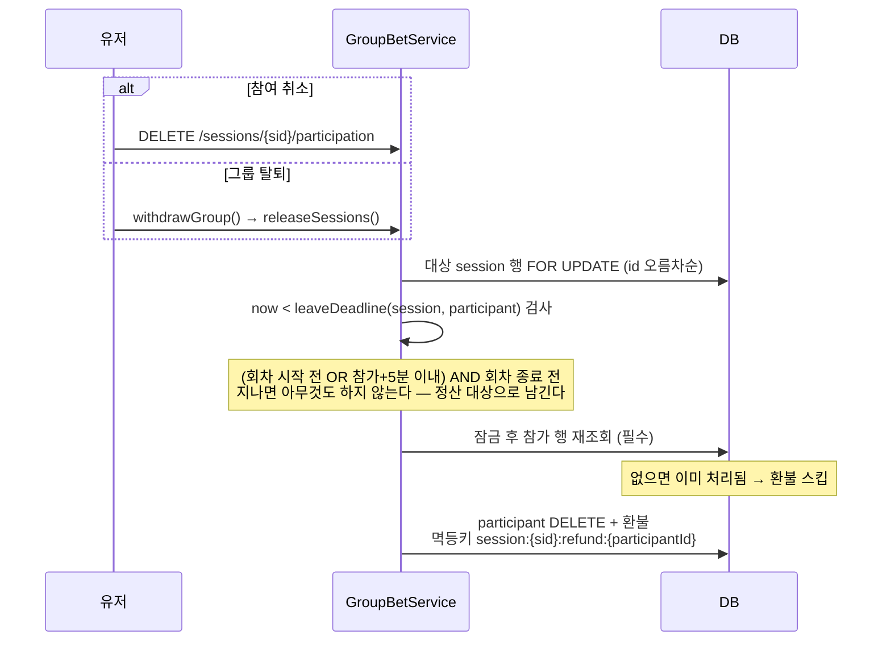

**두 경로가 완전히 같은 규칙, 같은 멱등키 축을 쓴다.** 이게 이중 환불을 구조적으로 막는
유일한 방법이다 — 키가 갈라지면 원장 UNIQUE가 교차 경로를 못 잡는다.

**취소 마감 = `min(max(회차 시작, 참가+5분), 회차 종료)`.** 하루형은 회차 시작이 자정이라
당일 참가자에게 "시작 전"이 영영 오지 않는다 — **5분 유예가 유일한 취소 창**이고, 그게 오탭
방어의 전부다. 회차 종료 상한은 유예가 정산 구간으로 흘러드는 것을 막는다.

**잠금 후 참가 행 재조회는 생략 불가**다. 잠금 전에 조회한 목록은 이미 낡았을 수 있다.

### 3.6 정산

FOCUS는 이벤트가 주 경로고 배치는 안전망이다.

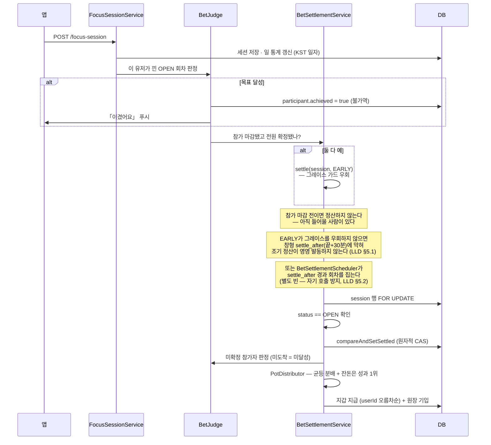

| 회차 상태 | 조건 |
|---|---|
| `VOIDED` | 참가 마감 시 참가자 < 2명 → 전액 환불 |
| `SETTLED` | 달성자 ≥ 1명 → 균등 분배 |
| `FORFEITED` | 달성자 0명 → 팟 소멸 (이월 없음) |
| `REFUNDED` | 정산 실패가 24h 초과 → 전원 환불 |

---

### 3.7 챌린지 삭제 — 강제 접기

**수정이 없는 대신 삭제에 조건이 없다.** 진행 중인 회차가 있으면 무효화하고 전원에게 환불한다.

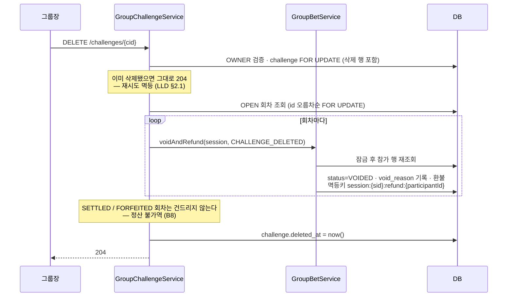

**이 경로가 잠금 순서 규약을 가장 강하게 요구한다.** 여러 회차 × 여러 지갑을 한 트랜잭션에서
만지므로, `회차 id 오름차순 → 지갑 userId 오름차순`을 어기면 다른 경로와 교차 데드락이 성립한다.

**종료(`/end`)와의 차이는 조건과 환불뿐이다.** 종료는 OPEN 회차가 하나라도 있으면 409다 —
남의 돈이 걸린 회차를 "조용히 마감"하는 경로를 주지 않는다. 접으려면 삭제를 쓰고 대가를 치른다.

**삭제해도 이력은 남는다.** 회차 행이 `group_id`·`challenge_id`·미션 스냅샷을 들고 있어
「그룹 챌린지 내역」이 조인 없이 렌더된다. 이력의 소유자가 챌린지가 아니라 그룹이라
삭제가 이력을 끊지 못한다.

---

## 4. 시간 모델

돈이 걸린 판정이라 **시간 해석이 단일 기준**이어야 한다.

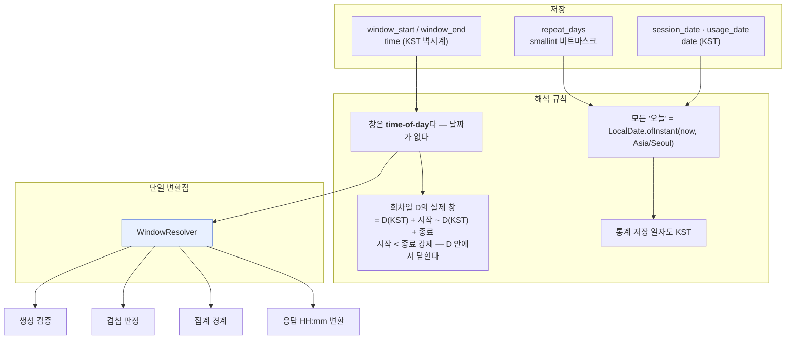

**창을 `time`으로 저장한다.** 기존에는 `timestamptz`에 담고 "날짜 부분은 무의미"라는 규약으로
버텼는데, 한때 저장 Instant의 UTC 시각을 KST 벽시계로 간주해 **정확히 9시간이 어긋난** 버그가
있었다(GROMO-1100). 타입 자체가 의미를 담게 바꿔 그 실수의 여지를 없앤다.

**모든 시각 축이 KST 하나다.** 판정도 저장도 `CountryZoneResolver`를 타지 않는다.
해외 유저는 "내 하루"와 앱의 하루가 어긋나지만, 챌린지가 **그룹 공동 목표**이므로 전원의 마감이
동시에 오는 쪽을 택했다.

### 회차 경계

| 방식 | 회차 시작 | 회차 끝 | 참가 마감 | 정산 |
|---|---|---|---|---|
| `DURATION` | KST 00:00 | KST 24:00 | **회차 끝까지** | FOCUS 즉시 / SCREEN_TIME D+1 12:00 |
| `TIME_WINDOW` | D의 시작 시각 | **D의** 종료 시각 | **회차 시작** | 끝 + 30분 |

**창은 자정을 걸칠 수 없다** — `시작 < 종료`를 생성 시 강제하므로 창형의 네 시각(시작·종료·참가
마감·정산)이 **전부 회차일 D 안에서** 결정된다. 요일이 회차를 가르는 축인데 회차가 요일 경계를
넘으면 판정일·겹침 검사·정산 귀속이 모두 모호해지기 때문이다.

**설계에서 사라지는 것**: `D+1` 종료 분기, "걸친 창의 요일 마스크는 어느 날 기준인가"라는 물음,
그리고 걸친 창에만 있던 "마지막 1시간은 참가 불가"라는 기형. 시간 모델에 날짜 경계 분기가
한 군데도 남지 않는다.

**단, 집중 세션의 자정 걸침은 그대로다** — 이건 창 규칙이 아니라 귀속 규칙이다.
자정을 걸친 집중 세션은 **종료일 회차**로 간다(`daily_focus_stats`가 세션 종료 시각 귀속).
23:30~00:30 세션은 그날 회차에 안 잡힌다. 카드 진행률도 같은 규칙이라 화면과 정산은 어긋나지
않는다.

> **창형 30분 그레이스의 근거**: 집계 쿼리가 **완료 세션만** 계수하므로(`ended_at IS NOT
> NULL`) 창을 걸친 세션(11:30~12:30, 창 09:00~12:00)의 창 안 30분은 **세션이 끝나야** 서버에
> 잡힌다. 그레이스 0이면 그 30분이 통째로 사라진다.
>
> **그레이스로도 못 덮는 것 — 아직 도는 세션 (N37)**: 11:30~13:00처럼 그레이스(+30분)보다
> 오래 도는 세션은 12:30 정산 시점에도 ACTIVE라 여전히 0분이다. 그래서 정산은 참가자의 창
> 겹침 ACTIVE 세션이 남아 있으면 **틱을 스킵하고 재시도**한다 — 세션 종료·자동 마감이 상한,
> 24h 환불이 최후 방어선 (LLD §5.2).

---

## 5. 동시성 · 일관성 전략

### 5.1 4중 방어

돈이 움직이는 전이는 네 겹으로 막는다.

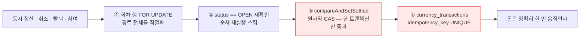

**행 락이 왜 CAS만으로 부족한가**: CAS는 *상태 전이*만 지킨다. 정산은 "참가자를 읽고 → 계산하고 →
지급"하는데, 그 사이 탈퇴 연동이 참가 행을 지우고 환불하면 정산의 낡은 스냅샷이 탈퇴자에게
지급까지 해 **이중 지급**이 된다. 참가자 읽기는 CAS가 못 지키므로 행 락이 필요하다.

**⑤ 잠금 후 재검증** — 4중 방어에 한 겹 더한다. 잠금을 잡은 뒤 참가 행이 아직 있는지 **다시
읽는다**. 잠금 전에 만든 대상 목록은 낡았을 수 있다. 이게 없으면 취소 × 탈퇴 교차에서
이중 환불이 난다.

### 5.2 잠금 순서 규약

교차 데드락을 막는 유일한 수단이 **순서 고정**이다.

| 규약 | 내용 |
|---|---|
| 전역 순서 | `회차 행 → 지갑` |
| 여러 회차 | `session.id` 오름차순으로 **전부 먼저 잠근 뒤** 돈을 움직인다 |
| 여러 지갑 | `userId` 오름차순 (정산 지급·전원 환불·탈퇴 연동 전부 동일) |

> 탈퇴 연동에서 "탈퇴자 먼저" 같은 자연스러운 순서를 쓰면, 탈퇴자 UUID가 더 클 때 지갑 잠금이
> 내림차순이 되어 오름차순으로 도는 다른 경로와 **교차 데드락**이 성립한다.

> **유저 행 락 규약 (GROMO-801 → 1237)**: 요청자 `users` 행을 어떻게 읽느냐도 규약이 있다.
>
> | 트랜잭션 성격 | 파인더 | 근거 |
> |---|---|---|
> | `users` 행 자체를 변경 | `findActiveByIdForUpdate` (배타) | 쓰기 충돌 직렬화 |
> | 변경 트랜잭션이지만 유저는 읽기만 (챌린지 생성·참여 등) | `findActiveByIdForShare` (공유) | 처리 중 탈퇴를 막는다 |
> | 순수 읽기 (`readOnly`) | `findByIdAndIsDeletedFalse` (무락) | **Postgres가 `readOnly`에서 `FOR SHARE`를 거절**한다 |
>
> 세 갈래 모두 **활성 필터를 포함**한다. "공유 락이 탈퇴를 막는다"의 전제: READ COMMITTED에서
> `FOR SHARE`가 대기 후 재평가될 때 **빈 결과 = 탈퇴 확정**이다(EvalPlanQual 재평가).

### 5.3 멱등키 규약

**축을 하나로 통일한다.** 참가 행(`participantId`)이 모든 회차 단위 돈 흐름의 축이다.

| 동작 | 키 |
|---|---|
| 참가비 차감 | `session:{sid}:stake:{participantId}` |
| 취소 환불 | `session:{sid}:refund:{participantId}` |
| 탈퇴 환불 | `session:{sid}:refund:{participantId}` ← **취소와 같은 키** |
| 회차 무산 환불 | `session:{sid}:refund:{participantId}` |
| 24h 자동 환불 | `session:{sid}:refund:{participantId}` |
| 정산 지급 | `session:{sid}:payout:{participantId}` |

**왜 참가 행이 축인가** — GROMO-1112 실사고: `userId`가 축이던 시절, 재참여가 같은 키를 만들어
차감이 **조용히 스킵**됐다. 참가 행만 생겨 **참가비 0원 참가**가 성립했고, 팟은
`stake × 참가자 수`라 걷지 않은 코인이 승자에게 나갔다.

**왜 환불 키를 통일하는가** — 경로별로 키를 나누면(`leave-refund` vs `refund`) 원장 UNIQUE가
교차 경로의 중복을 못 막는다. 환불은 "이 참가 행에 대해 정확히 한 번"이므로 경로와 무관하게
같은 키여야 한다.

### 5.4 낙관락

| 대상 | 이유 | 충돌 시 |
|---|---|---|
| `UserWallet.@Version` | 동시 차감·지급의 잔액 정합 | `CONCURRENT_UPDATE` 409 → 앱 재시도 |
| `Group.@Version` | 정원 초과 방지 | 동일 |

---

## 6. 알림 아키텍처

**핵심 변화: 발송이 "종류별"에서 "시간대별 묶음"으로 바뀐다.**

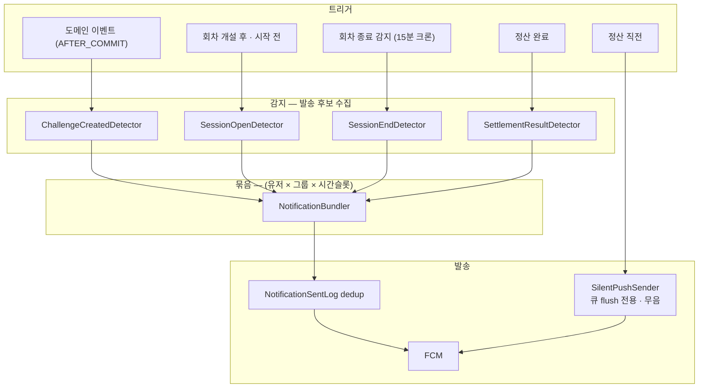

**설계 포인트**

- **묶음 단위 = (유저 × 그룹 × 시간슬롯)**. 같은 무렵 같은 그룹에서 발생한 알림은 한 건이 된다.
  월수금 챌린지 4개가 동시에 회차를 열어도 푸시는 하나다.
- **dedup 아이덴티티에는 이벤트 종류(kind)가 들어간다** — `(유저 × 그룹 × 슬롯 × kind)`.
  묶음 단위와 dedup 키를 같게 두면, 슬롯이 `SENT`가 된 **뒤에** 생긴 후보가 충돌로 스킵된다:
  13:01 개설 알림이 나간 슬롯에 13:03 정산 결과가 잡히면 **돈이 걸린 결과 알림이 유실**된다.
  kind가 다르면 같은 슬롯이어도 별도 클레임이라 보충 발송이 성립하고, 같은 kind의 동시 후보만
  묶음·dedup 대상이 된다.
- **감지와 발송을 분리**한다. 감지기는 후보만 만들고, 묶음·dedup·문구 조립은 한 곳에서 한다.
  각자 발송하면 규칙이 갈라진다.
- **재훑기 + 선점 dedup** — "직전 발송 이후"를 상태로 들지 않고 최근 구간을 통째로 다시 훑는다.
  발송 여부의 단일 소스는 `NotificationSentLog`인데, **조회 후 발송·성공 후 기록** 순서로 두면
  인스턴스가 둘이 되는 순간 "둘 다 로그 없음 확인 → 둘 다 발송"이 가능하고 이미 나간 푸시는
  회수할 수 없다. 그래서 **발송 전에 슬롯 유니크 키로 `PENDING` 행을 INSERT해 선점**하고
  (충돌 = 남이 선점 → 스킵), FCM 성공 시 `SENT`로 마킹한다.
- **발송 실패 시 `PENDING` 행을 지운다** → 다음 틱이 다시 집는다 — 재시도는 그대로 산다.
  (크론 자체의 중복 실행 방어는 policy §E4 — ShedLock, 티켓 565.)
- **고아 `PENDING`은 리스로 회수한다** — 선점 후 `SENT` 마킹(또는 삭제) 전에 프로세스가
  죽으면 유니크 키가 영구히 남아 그 알림이 영영 스킵된다. `PENDING`에 클레임 시각을 함께
  기록하고, **10분 지난 `PENDING`은 만료로 간주해 재클레임**(`UPDATE … WHERE status='PENDING'
  AND claimed_at < now()−10m`)한다.
- 결과적으로 클레임 행의 유니크 키는 **`(user_id, group_id, slot, kind)`** 이고, 상태는
  `PENDING`(클레임·리스 10분) → `SENT` 또는 삭제(실패)다.
- **사일런트 푸시는 묶음을 타지 않는다.** 목적이 표시가 아니라 앱 기동이라 dedup 대상도 아니다.
  대상은 해당 회차 참가자로 한정한다.

**시각 선정 근거**

| 시각 | 무엇 | 왜 그 시각인가 |
|---|---|---|
| 00:05 (+5분 크론 캐치업) | 회차 자동 개설 | 자정 직후, 하루가 시작되기 전 (§3.2) |
| 회차 시작 − 30분 (**창형만**) | 참여 모집 묶음 | 아직 들어올 수 있는 마지막 알림 시점 |
| 당일 08:00 (**하루형**, N40) | 참여 모집 묶음 | 하루형의 시작−30분은 전날 23:30 — 회차 미생성(00:05 개설)과 조용한 시간에 **이중으로 막혀 영영 못 나간다**. 조용한 시간 직후 아침 슬롯으로 옮긴다. 하루형은 종일 참가라 "마지막"이 아니라 "시작" 리마인더다 |
| 회차 종료 시점 | 종료 알림 (15분 크론 감지) | 창 종료 시각이 챌린지마다 달라 고정 크론으로 못 잡는다 |
| `settle_after` − 15분 | **사일런트** | 큐가 비워질 시간을 남긴다 |
| 정산 직후 | 결과 묶음 | 결과가 확정되자마자 |
| 11:30 | 사일런트 (SCREEN_TIME 하루형) | 12:00 정산 전 마지막 보고 기회 |

**조용한 시간(23–07)** 필터는 표시 푸시에만 적용한다. 사일런트는 무음이므로 예외다 —
심야 창의 정산이 데이터를 못 받는 문제가 이걸로 풀린다.

---

## 7. 운영 (Operability)

### 7.1 관측 지점

| 신호 | 형태 | 용도 |
|---|---|---|
| `회차 정산 완료 — 대상=…, 분배=…, 몰수=…, 무산=…, 스킵=…, 실패=…` | info, 고정 포맷 | 정상성 |
| `회차 정산 실패 — sessionId=…, 시도=N회` | warn, 고정 포맷 | 재시도 추적 |
| `회차 자동 환불 — 24h 초과, sessionId=…, 환불=N명` | error, 고정 포맷 | **SLO 위반 신호** |
| `환불 스킵 — 멱등키 선점됨` | warn | 정상 흐름에 없어야 할 상태 |
| `참가비 차감 스킵 — 멱등키 선점됨(도달 불가)` | error + 예외 | 트랜잭션 롤백 |
| `사일런트 푸시 발송 — 대상=N명, 회차=…` | info | 도착률 분석의 분모 |

### 7.2 참가비는 영원히 묶이지 않는다

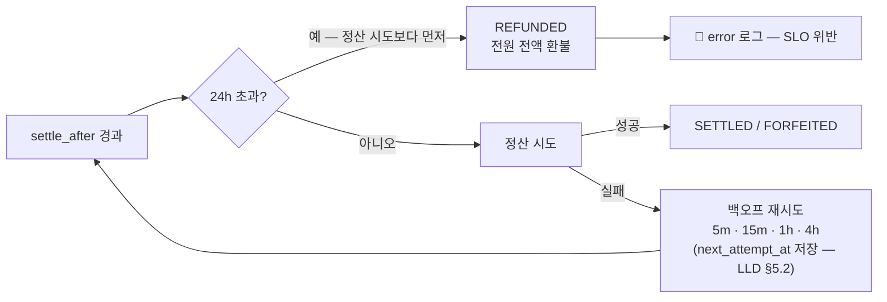

**자동 환불이 최후 방어선**이다. 사람이 아니라 시스템이 "참가비 동결 0"을 보장한다.
**24h 검사는 정산 시도보다 먼저다** — 검사가 실패 경로 안에만 있으면 스케줄러 장기 다운 후
복구, 혹은 데드라인 직후 의존성 회복 시 첫 시도가 성공해 환불 대신 지급이 나간다 (LLD §5.2).
정산된 건을 되돌리는 게 아니라 **정산 자체가 불가능한 건을 닫는 것**이므로 정산 불가역 원칙과
충돌하지 않는다.

**prod 수동 정산 트리거를 연다** — 관리자 키 게이트 + 감사 로그 필수. 24h를 기다리기 전에
손으로 풀 수단이 있어야 한다.

**후속 — GROMO-1256**: MQ + DLQ로 실패를 격리하고 운영자에게 알린다. 자동 환불이 이미
최후 방어선을 세우므로 급하지 않다.

### 7.3 실패 격리

| 실패 지점 | 격리 범위 | 복구 |
|---|---|---|
| 회차 1건 정산 | 그 회차만 롤백 | 백오프 재시도 → 24h 초과 시 자동 환불 |
| 푸시 발송 | 그 유저만 | 이력 미기록 → 다음 틱 재시도 |
| 사일런트 푸시 | 그 유저만 | 재시도 없음 (도착률 장치일 뿐 필수 경로가 아니다) |
| 창 사용분 보고 | 그 챌린지·날짜만 | 다음 sync 재시도 (upsert 멱등) |
| 회차 자동 개설 | 그 챌린지만 | 다음 틱 (UNIQUE로 중복 방지) |

---

## 8. 확장성 · 성능

| 축 | 설계 | 한계 |
|---|---|---|
| 카드 조회 | 쿼리 수 고정 (IN 절 배치) | 창형 집계가 챌린지당 1회 — 활성 4개 상한이라 무해 |
| 회차 개설 | 하루 1회 벌크 INSERT | 그룹 수에 선형 |
| 정산 | 이벤트 주도 + 배치 안전망, 건별 트랜잭션 | 회차 수에 선형. 병렬화·청킹 없음 |
| 회차 종료 감지 | 15분마다 활성 창 스캔 | 그룹 수에 선형. IN 절 청킹 |
| 알림 | 슬롯별 묶음 → 발송 건수가 챌린지 수와 **디커플** | — |
| 인스턴스 | **분산 락 필요** | ShedLock 미도입 시 스케일아웃 즉시 N배 실행 (티켓 565) |

---

## 9. 이 설계가 명시적으로 포기한 것

| 포기한 것 | 대신 얻은 것 |
|---|---|
| 이중부기 원장 신설 | 기존 `user_wallets` + `currency_transactions` 재사용 (그릇이 이미 있다) |
| 정산 되돌리기 | 마감의 확정성 — 되돌릴 수 있으면 "언제 확정인가"가 사라진다 |
| 스크린타임 서버 검증 | 기능 자체 (검증 수단이 없으면 만들지 않거나, 리스크를 수용하거나) |
| 유저 타임존별 정산 | 그룹 공동 목표의 동시 마감 + 배치 대상 선정의 단순함 |
| 몰수분 회수 계정 | 코인 소멸 (디플레 방향이라 안전). 회계상 계정이 없다는 건 수용 |
| 팟 이월 | 회차의 독립성 — 이월하면 "이 팟이 누구 돈인가"가 흐려진다 |
| 그룹원의 내기 개설 | 소유권의 단일성 — 예외를 두면 "누가 뭘 할 수 있나"가 매번 헷갈린다 |
| 내기를 **나중에 끄기** | 규칙의 단일성. 끄는 순간 이미 낸 참가비 처리가 남는데 그건 삭제(무효화 + 전원 환불)와 같은 일이다 — 같은 결과에 경로를 둘 두지 않는다. 끄려면 삭제 후 재생성 |
| 자정을 걸치는 창 | 요일 = 회차라는 단순한 규칙. 심야는 `22:00~23:59`로 끊거나 다음 날 요일의 별도 챌린지로 나눈다 |
| 챌린지 수정 **일체** | 판정 기준의 안정성 + 구현 단순화. 삭제가 자유로우니 "접고 다시 만들기"가 정상 동선이다 |
| 삭제를 막아서 이력 보존 | 이력의 소유자를 **그룹으로 승격**. 챌린지가 사라져도 내역이 남으므로 삭제에 조건이 필요 없다 |
| 창 사용분의 부분 집계 | 정확성 — 보존 창 밖 버킷이 필요하면 침묵(미보고)한다. 낮은 부분합이 최종으로 굳는 것보다 `null`이 안전하다 |
| 자동 참여 토글 | 무단 차감처럼 느껴질 여지 제거. 대신 "이번 주 전부" 단축을 준다 |
| 안드로이드 창 스크린타임 | 플랫폼 한계. **출시 전 결정해야 하는 게이트로 남긴다** |

---

## 관련 문서

- [**정책 정본 · 결정 로그**](./policy.md)
- [PRD](./prd.md) · [IA](./information-architecture.md) · [UX](./ux.html) · [LLD](./low-level-design.md)
