# 챌린지 — 정보 구조 (Information Architecture)

> 챌린지 기능이 **어디에 놓여 있고**, **무엇이 무엇을 담고 있으며**, **어떤 경로로 도달하는지**를
> 정리한다. 화면 계층 · 데이터 계층 · 진입 경로(딥링크/알림) · 정보 우선순위 네 축이다.
>
> **문서 지위**: to-be. 2026-08-08 백지 재정의 정책([`policy.md`](./policy.md)) 기준으로 다시 썼다.
> 현행 코드와의 차이는 `policy.md` §9에 구현 과제로 정리돼 있고, 이 문서는 그 차이를 반복하지 않는다.

---

## 1. 전체 지도

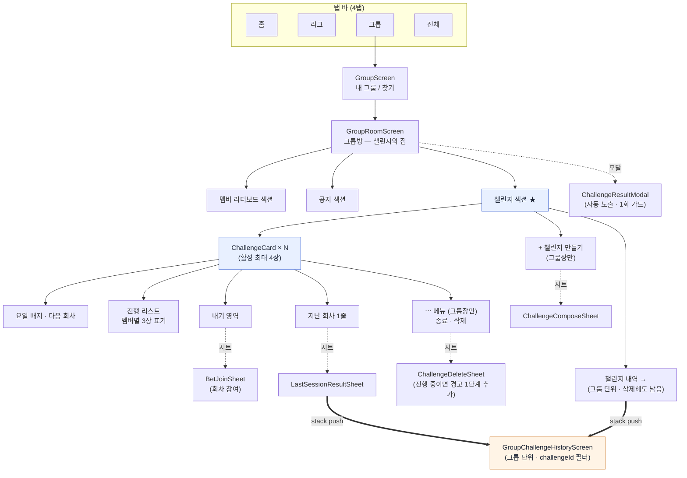

**핵심 원칙: 챌린지는 거의 전용 화면을 갖지 않는다.**
상호작용이 그룹방 안의 **카드 + 바텀시트**로 끝나고, 결과 확인조차 화면 이동 없이 모달/시트로
처리된다. **stack push는 한 곳뿐**이다 — 「그룹 챌린지 내역」. 무한 스크롤 목록이라 시트에
담을 수 없다(`SheetShell`이 ScrollView를 두르고 있어 시트 내 FlatList는 중첩 스크롤 문제가 있다).
챌린지별 이력도 **같은 화면에 `challengeId` 필터를 걸어** 들어간다 — 화면을 둘로 나눌 이유가 없다.

---

## 2. 화면 계층 (Screen Hierarchy)

```
그룹 탭
└── GroupScreen                       내 그룹 목록 · 찾기 진입
    └── GroupRoomScreen               그룹방 (챌린지의 유일한 컨테이너)
        ├── [섹션] 멤버 리더보드
        ├── [섹션] 공지
        └── [섹션] 챌린지               ← 이 문서의 대상
            ├── ChallengeCard          카드 1장 = 활성 챌린지 1개
            │   ├── 헤더               아이콘 · 미션 라벨 · ⋯ 메뉴(OWNER)
            │   ├── 요일 줄            요일 배지 + 다음 회차 날짜·시각
            │   ├── 캡션               카테고리 뜻 / 측정 한계 / 권한 경고
            │   ├── 진행 리스트         멤버 × (닉네임, 진행)  ※ 내 행 최상단 고정
            │   ├── 내기 영역           4가지 배타 상태 중 하나 (§2.3)
            │   └── 지난 회차 1줄       탭 → LastSessionResultSheet
            ├── [버튼] 챌린지 만들기     OWNER 전용 → ChallengeComposeSheet
            └── [링크] 챌린지 내역       → GroupChallengeHistoryScreen

        오버레이 (스택 이동 없음)
        ├── ChallengeComposeSheet      만들기 폼 (요일 선택 포함)
        ├── BetJoinSheet               회차 참여 (하루형은 진행분 공개)
        ├── LastSessionResultSheet     지난 회차 인별 결과
        ├── ChallengeDeleteSheet       삭제 확인 — 진행 중이면 경고 단계가 하나 더 (§2.5)
        └── ChallengeResultModal       회차 결과 (진입 시 자동 · 1회)

        스택 화면 (하나뿐)
        └── GroupChallengeHistoryScreen  회차 내역 — 무한 스크롤
              · 그룹 전체        (챌린지 내역 링크로 진입)
              · challengeId 필터 (지난 회차 시트의 "더보기"로 진입)
```

### 2.1 카드 안의 정보 순서

위에서 아래로, **"무엇을 → 언제 도는가 → 누가 얼마나 → 돈이 걸렸나 → 지난 결과"** 순.

| 순위 | 블록 | 왜 이 위치인가 |
|---|---|---|
| 1 | 미션 라벨 (`하루 60분 집중`) | 카드를 식별하는 단 하나의 문장 |
| 2 | **요일 배지 + 다음 회차** | 요일 반복이 생긴 이상, "언제 도는지"를 모르면 카드를 읽을 수 없다 |
| 3 | 뜻·한계 캡션 | 스크린타임은 방향이 반대라 오해를 먼저 막는다 |
| 4 | 진행 리스트 | 카드의 본문. **내 행이 항상 맨 위** (10명이면 눈으로 훑어야 한다) |
| 5 | 내기 영역 | 돈이 움직이는 자리 — 본문 아래, 구분선으로 분리 |
| 6 | 지난 회차 1줄 | 지난 일이라 가장 옅게, 밑줄로 탭 가능 표시 |

### 2.2 오늘 도는 카드와 안 도는 카드

요일 반복이 생기면서 카드는 두 톤을 갖는다.

| 상태 | 표시 |
|---|---|
| **오늘이 활성 요일** | 진행 리스트 · 내기 영역 정상 노출 |
| **오늘은 쉬는 날** | 진행 리스트 자리에 `다음 8/12(수) 09:00` 만. 카드 전체가 가라앉음 |

쉬는 날에도 카드를 감추지 않는다 — 그룹이 "우리가 지키기로 한 것"의 전체 모습을 항상 봐야 한다.

### 2.3 내기 영역의 배타 상태 (4분기)

같은 자리에 상태 하나만 그린다. **"개설"이 사라져** 기존 5분기에서 하나 줄었다.

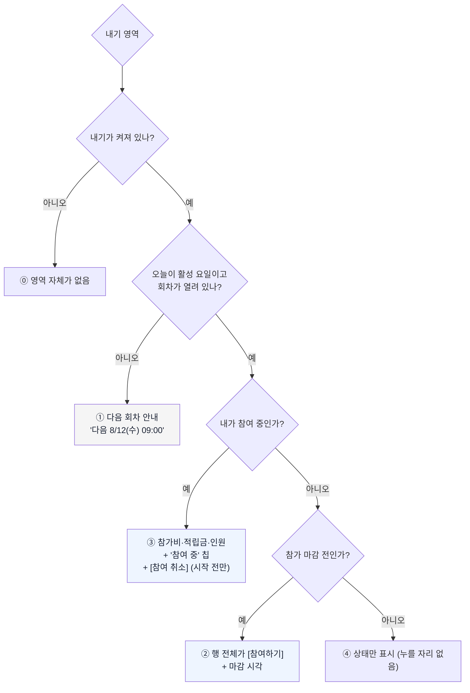

- **`참여 취소` 버튼은 `시작 전 참가 → 회차 시작까지` · `시작 후 참가(하루형) → min(참가+5분, 회차 종료)`일 때만** 뜬다.
  하루형은 회차 시작이 자정이라 당일 참가자에게는 **5분 유예가 유일한 취소 창**이다 —
  버튼 옆에 남은 시간을 초 단위로 카운트다운한다(`4:37 남음`).
- **개설자의 "회차 전체 취소"가 사라졌다** — 개설자가 없다. 지금 "취소"는 **내 참여를 무르는 것**
  하나뿐이고, 그래서 **버튼 문구도 `참여 취소`** 다. 그냥 `취소`는 시트를 닫는 버튼과 헷갈린다.
- ③에서 ②로 되돌아오는 경로가 있다 — 취소 후 참가 마감 전이면 *원래의 참여 진입점*이 되살아난다.
  재참여용 별도 버튼을 만들지 않는다.
- 참가자가 1명인 채로 마감되면 ④에 `참가자가 부족해 무산됐어요 · 참가비는 돌려드렸어요`.

### 2.4 카드에서 사라진 것

| 기존 | 왜 없어졌나 |
|---|---|
| `+ 내기 걸기` 버튼 | 내기는 그룹장이 챌린지에 켜는 상시 구조 (개설 행위 소멸) |
| **내기 켜기/끄기 토글** | 켤지 여부는 챌린지를 만들 때 정하고 **이후 불변**이다(policy §A7 · N26). 카드에도 상세에도 토글이 없다 — 끄려면 삭제 후 재생성 |
| 개설자의 `[회차 전체 취소]` 버튼 | 개설자가 없다 |
| **휴면 배지** | "내기 이력은 있는데 열린 회차가 없는 상태"가 정상 상태가 됐다 — 쉬는 날이 그것이다 |
| 헤더의 `X` 삭제 버튼 | `⋯` 메뉴 안으로 (종료·삭제 두 액션이라 버튼 하나로 안 된다) |

### 2.5 삭제 확인 — 진행 중일 때만 한 단계 더

삭제는 되돌릴 수 없고 **남의 진행과 돈을 함께 엎는다.** 그래서 확인 단계 수가 상태에 따라
갈린다 — 위험한 삭제만 두 번 묻는다.

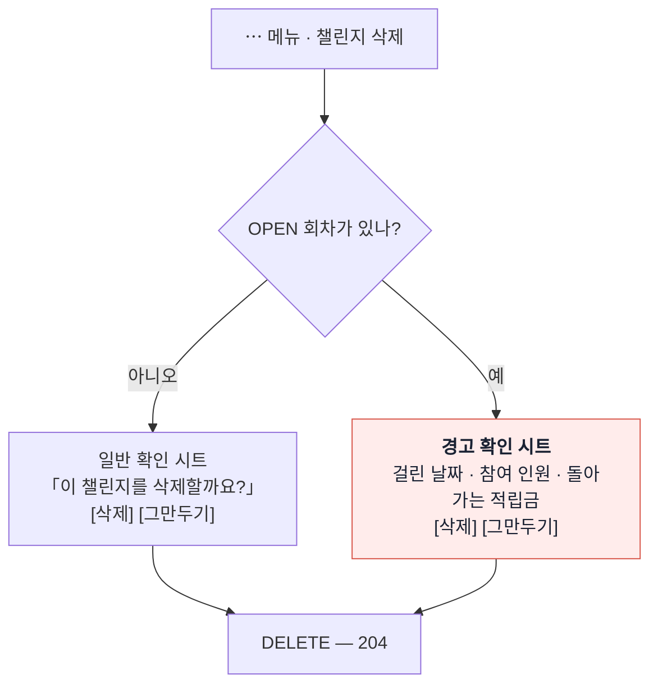

| 상태 | 확인 | 화면이 하는 말 |
|---|---|---|
| 진행 중 아님 | **1단계** | `이 챌린지를 삭제할까요? 지난 기록은 「챌린지 내역」에 남아요` |
| **진행 중** | **경고 1단계 추가** | `8/10(월) 3명 참여 중 · 적립금 90코인이 전원에게 돌아갑니다` |

- **경고에는 수치가 반드시 들어간다** — 걸려 있는 회차의 **날짜·참여 인원**과 **돌아가는
  적립금**. "정말 삭제할까요?"만 띄우면 읽지 않는다.
- **진행 중이 아니면 이 단계를 넣지 않는다.** 위험하지 않은 행동까지 두 번 물으면 경고가 의미를
  잃고, 정작 위험할 때도 그냥 누르게 된다.
- 버튼은 확인 `삭제` · 이탈 `그만두기`. `확인`은 무엇을 확인하는지 말해주지 않고, 여기서
  `취소`를 쓰면 **참여 취소**(§2.3)와 겹친다.
- **종료(`/end`)에는 이 단계가 없다.** 종료는 OPEN 회차가 있으면 애초에 막히므로(409) 확인
  시점에 사라질 돈이 없다.

---

## 3. 데이터 구조 (Content Model)

### 3.1 엔티티 관계

**핵심 변화: 내기가 2계층이 된다.** 내기(챌린지 1:1)과 회차(활성 요일마다)로 나뉜다.

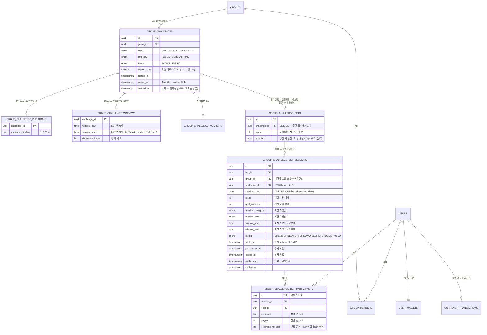

**왜 회차에 미션을 통째로 박제하는가.** 이력의 소유자가 **그룹**이기 때문이다(policy §A9).
챌린지가 삭제돼도 「챌린지 내역」의 한 줄은 온전히 읽혀야 한다 — 무슨 목표였고 얼마가 걸렸는지가
회차 행 안에 다 있어야 조인 없이 렌더된다.

**CTI(Class Table Inheritance)** — 타입별 파라미터를 본체에 NULL 컬럼으로 두지 않고 1:1 상세
테이블로 분리한다(`@MapsId`로 PK 공유). `duration_minutes`가 두 상세 테이블에 **각각** 있지만
의미가 다르다: durations는 *하루 목표*, windows는 *창 내 목표*.

### 3.2 회차 상태

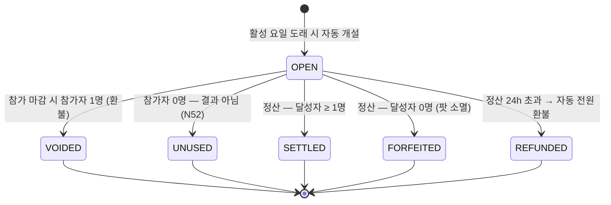

`REFUNDED`가 **되살아난다** — 회차 무산(`VOIDED`)과 24시간 자동 환불이 실제로 이 상태를 만든다.

### 3.3 판정 데이터가 어디서 오는가

챌린지 본체는 **목표만** 갖고, 진행 데이터는 4개의 서로 다른 테이블에서 온다.

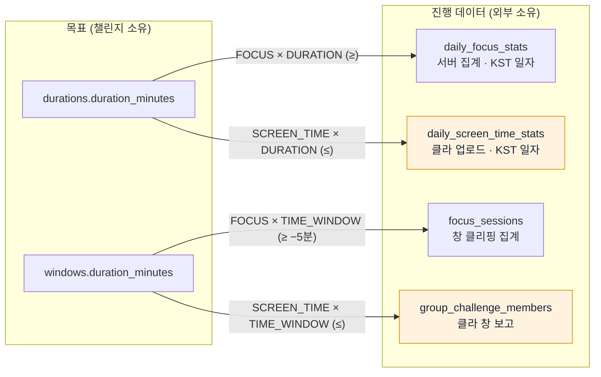

주황 = **클라 신뢰 데이터**(서버 검증 불가, 범위 검증만).

**네 소스 모두 저장 일자가 KST다.** 판정 키와 저장 키가 같은 축을 쓴다 —
유저 국가 존(`CountryZoneResolver`)은 이 경로에서 쓰이지 않는다.

### 3.4 응답 조립 — 카드 1장에 실리는 것

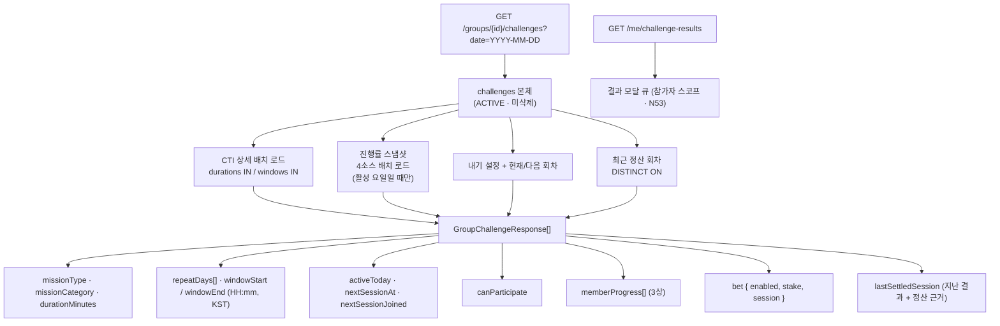

| 필드 | null이 뜻하는 것 |
|---|---|
| `memberProgress` | `date` 미전달 / **오늘이 비활성 요일** → 진행률 미계산 |
| `memberProgress[].progressMinutes` | SCREEN_TIME 미집계 (**0분 아님**) |
| `memberProgress[].achieved` | 판정 불가 |
| `bet` = `null` | 이 챌린지에 내기가 꺼져 있음 |
| `bet.session` = `null` | 오늘 회차가 없음 (비활성 요일) → `nextSessionAt` + `nextSessionJoined`로 **다음 활성일 참여 버튼**을 그린다 (N45 · FR-31-1) |
| `lastSettledSession` | 정산 이력 없음 (`VOIDED` **포함** — K5 해소, FR-44-3 기준 통일) |
| *(결과 큐는 이 응답에 없다)* | 결과 모달 소스는 `GET /me/challenge-results` — 카드 조회와 분리됐다 (N53) |
| `lastSettledSession.goalMinutes` · `results[].progressMinutes` | 미기록. 앱은 "—"로 그린다. **`0`(진짜 0분)과 다른 뜻** |

> **금지**: `bet` 필드에 `@JsonInclude(NON_NULL)`을 붙이면 앱의 undefined/null 3상 판정
> ("내기 꺼짐" vs "내기를 모르는 구서버")이 깨진다.

---

## 4. 진입 경로 (Navigation & Entry Points)

### 4.1 도달 경로 전체

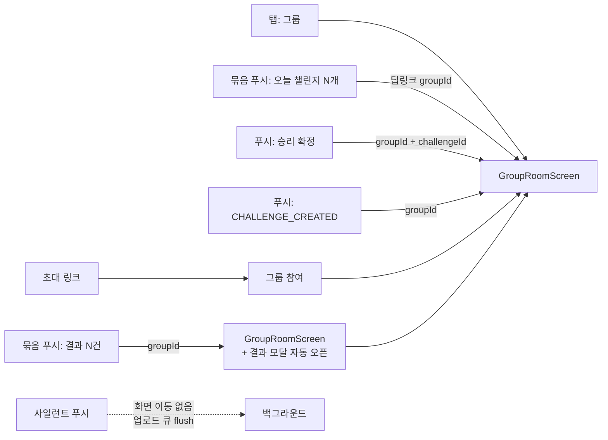

### 4.2 알림 → 화면 라우팅

| `data.type` | 페이로드 | 도착 | 승패 |
|---|---|---|---|
| `CHALLENGE_CREATED` | `groupId` | 그룹방 (모달 없음 — 결과가 아직 없다) | — |
| `CHALLENGE_SESSION_OPEN` | `groupId` (+ 회차 요약 N건) | 그룹방 | — |
| `CHALLENGE_SESSION_END` | `groupId` + 대표 `challengeId` | 그룹방 + 결과 모달 | ❌ |
| `BET_WON` | `groupId` + `challengeId` | 그룹방 | ✅ |
| `BET_RESULT` | `groupId` (+ 결과 요약 N건) | 그룹방 + 결과 모달 | ✅ |
| `BET_VOID_REFUND` | `groupId` + `voidReason` *(단건은 `challengeId` 추가 — 묶음 규칙 §4.2)* | 그룹방 | ✅ |
| *(사일런트)* | `content-available` / data-only | **없음** — 큐 flush 전용 | — |

> **앱 배선이 있어야 이 표가 성립한다.** 서버는 `link`를 싣지 않고 `groupId`만 주는데, 현재
> `push.ts`는 **`CHALLENGE_WINDOW_END` 한 타입에만** `groupId` → 그룹방 딥링크를 합성한다.
> 위 타입들을 같은 방식으로 배선하지 않으면 **탭해도 아무 데도 안 간다** (LLD §6.2 앱 파일 표).

**묶음 발송의 페이로드 규칙**: 여러 챌린지가 한 푸시에 묶이면 `challengeId` 대신 요약 배열을
싣고, 딥링크는 그룹방까지만 보낸다. 특정 챌린지로 스크롤하지 않는다 — 어느 것을 고를지
서버가 정할 근거가 없다.

### 4.3 결과 모달 — 언제, 무엇을, 몇 개

**한 줄 정의: 그룹방에 들어왔을 때, 내가 돈을 걸었던 회차 중 아직 결과를 안 본 것을 최신순으로
하나씩 보여준다.**

| 축 | 규칙 |
|---|---|
| **트리거** | 그룹방 `load()` 1회. 포그라운드 복귀로 재조회돼도 가드가 막는다 |
| **대상** | `GET /me/challenge-results` 응답 전부 (참가자 스코프 — N53) |
| **데이터** | **오늘 조회 1건**. 날짜를 따로 부르지 않는다 |
| **순서** | `sessionDate` 내림차순 → 동률이면 챌린지 `startedAt` 순. 최근 것부터 |
| **개수** | 순차 큐. 하나 닫으면 다음이 뜬다 |
| **1회 가드** | `gromo:sessionResult:{userId}:{sessionId}` — **계정별** 세션 id 기준 (§8과 동일 키. 한 기기 두 계정이 같은 회차에 참가할 수 있다) |

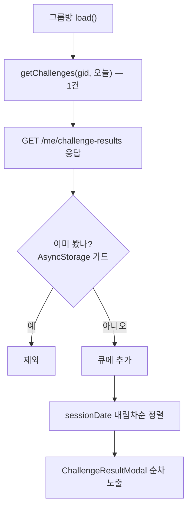

**날짜 조회가 사라졌다.** 기존 설계는 "오늘 + 직전 회차일" **2건**을 불렀는데, 요일 반복에서는
**챌린지마다 직전 회차일이 다르다** — 월수금 챌린지와 화목 챌린지가 공존하면 수요일 기준
직전 회차가 각각 월/화요일이라 2건으로 못 덮는다.

`/me/challenge-results`가 회차일·목표·인별 결과를 **참가자 기준**으로 한 번에 주므로 **오늘 조회 1건이면 충분하다.** 2건 조회는 그 필드가 없던 시절의 잔재였다.
최신 1건(`lastSettledSession`)만으로는 큐가 성립하지 않는다 — 참가 안 한 최신 회차가
내 결과를 가리고, 안 본 결과 여럿이 1건으로 접힌다 (policy §D3).

**정산 전 회차는 자동으로 빠진다** — `/me/challenge-results`에는 정산이 끝난 회차만 실린다.
스크린타임 하루형의 자정~익일 12:00 공백 구간이 이걸로 걸러진다.

**무산·환불도 결과다**

| 회차 상태 | 모달 | 문구 |
|---|---|---|
| `SETTLED` | ✅ | 인별 달성·손익 |
| `FORFEITED` | ✅ | `아무도 달성하지 못해 적립금 90이 사라졌어요` |
| `VOIDED` (`voidReason=INSUFFICIENT_PARTICIPANTS`) | ✅ | `참가자가 부족해 무산됐어요 · 참가비는 돌려드렸어요` |
| `VOIDED` (`voidReason=CHALLENGE_DELETED`) | ❌ **모달 아님** | 삭제 환불은 `BET_VOID_REFUND` **푸시**가 알린다 (FR-44-4·N48). 문구 `챌린지가 삭제돼 무산됐어요 · 참가비는 돌려드렸어요` 는 그 푸시의 것 |
| `REFUNDED` (`voidReason=REFUND_DEADLINE`) | ✅ | `정산이 지연돼 참가비를 돌려드렸어요` |

> **`REFUNDED`에도 `voidReason`이 실린다 (N55).** 사유 축은 무산 전용이 아니라 **종료 사유** 축이라
> 24h 데드라인 자동 환불도 사유를 갖는다. 앱은 상태에서 사유를 역추론하지 말고 **응답의
> `voidReason`을 그대로 분기**한다 — 다른 이유의 전원 환불이 생겨도 문구가 거짓말하지 않는다.

돈이 움직였거나 **움직이지 않기로 확정된** 사건은 전부 알린다. 침묵하면 "내 코인 어디 갔지"가 된다.

**모달을 띄우지 않는 경우**

- **내가 참가하지 않은 회차** — 남의 결과로 화면을 막지 않는다. 그룹 전체 달성 현황은
  카드에서 상시 보인다
- **내기가 꺼진 챌린지** — 참가 회차가 없으니 응답에 안 나온다
- **이미 본 회차** — 세션 id 가드
- **삭제된 챌린지의 회차** — 챌린지가 목록에서 빠져 응답에 없다. 삭제 시점의 환불은
  **푸시로 알린다**(모달 범위 밖)

> **가드 키가 `{cid}:{date}`에서 `{sessionId}`로 바뀐다.** 회차가 1급 개체가 되면서 세션 id가
> 유일 식별자다. **값은 `sessionDate`**(`'YYYY-MM-DD'`, KST)이고, 정리는 **마커를 기록할 때**
> 60일 지난 키를 함께 prune한다 (§8).

---

## 5. API 표면 (Endpoint Map)

모든 경로의 베이스는 `/api/v1`, 인증은 JWT(`@LoginUser`).

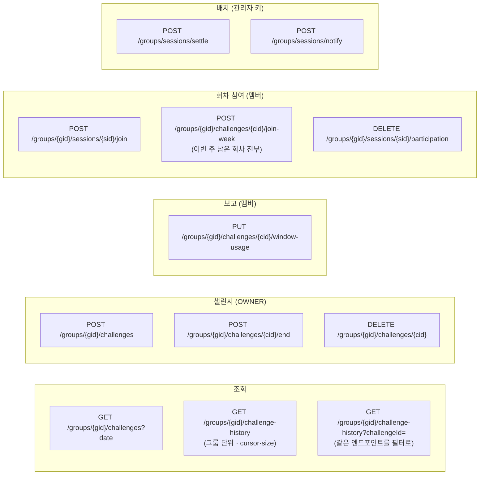

| 리소스 | 소유 컨트롤러 |
|---|---|
| 챌린지 조회·생성·종료·삭제·창 보고 | `GroupChallengeController` (**신설** — `GroupController`에서 분리) |
| 회차 참여·취소·이력 | `GroupBetController` |
| 정산·알림 수동 트리거 | `GroupBetBatchController` / `GroupNotificationBatchController` |

**사라지는 엔드포인트**

- `POST .../bets`(개설) · `DELETE .../bets/{bid}`(개설자의 회차 전체 취소) — 개설 개념 소멸
- `PATCH .../challenges/{cid}`(수정) — **만들지 않는다**. 챌린지는 불변이다(policy §A7)
- **내기 끄기 엔드포인트** (`bet.enabled`를 뒤집는 어떤 경로도) — **만들지 않는다**. 끄기는
  삭제(무효화 + 전원 환불)와 결과가 같아, 경로를 둘 두면 규칙만 늘어난다(policy §A7 · N26)

**이력 엔드포인트가 그룹으로 올라간다.** 챌린지별 조회는 같은 엔드포인트의 `challengeId` 필터로
처리한다 — 챌린지가 삭제돼도 그룹 내역은 살아 있어야 하므로, 경로가 챌린지에 종속되면 안 된다.

**`POST /groups/sessions/settle`은 prod에도 연다** — 관리자 키 게이트 + 감사 로그 필수.
24시간 자동 환불이 최후 방어선이지만, 그 전에 손으로 풀 수단이 있어야 한다.

---

## 6. 정보 우선순위 (Priority Model)

### 6.1 화면 밀도 규칙

| 위계 | 요소 | 시각 처리 |
|---|---|---|
| 1차 | 미션 라벨 · 내 진행 행 | `T.ink` / accent 칩 배경 |
| 2차 | 요일 배지(활성) · 타인 진행 행 · 참여 진입점 | `T.inkSub` / accent 배경 칩 |
| 3차 | 캡션(뜻·한계·사유) · 요일 배지(비활성) | `T.inkMuted` |
| 4차 | 지난 회차 1줄 · 다음 회차 안내 | `T.inkMuted` + 밑줄 |
| 경고 | 권한 없음 · 잔액 부족 | `T.dangerInk` |

### 6.2 "말하지 않으면 오해되는 것"의 목록

카드가 캡션을 다는 기준은 **침묵이 거짓말이 되는 자리**다.

| 캡션 | 없으면 생기는 오해 |
|---|---|
| `오늘 스크린타임을 목표 이하로 유지해요` | 집중처럼 "많을수록 좋다"로 읽힌다 |
| `사용 시간은 15분 단위로 집계돼 오차가…` | 정확한 측정 위로 돈이 움직인다고 믿는다 |
| `— 는 아직 집계되지 않았어요` | `—`를 0분으로 읽는다 |
| `오늘은 쉬는 날이에요 · 다음은 수요일` | 카드가 비면 "고장났다"로 읽힌다 |
| `목표에서 5분 모자라도 달성으로 인정돼요` | 창형 집중의 판정 기준을 모른 채 돈을 건다 |
| `이미 오늘 목표를 달성해서 참여할 수 없어요` | 버튼이 왜 안 눌리는지 알 방법이 없다 |
| `지금 참여 중인 사람` (하루형 참가 시트) | 불리한 회차인 줄 모르고 들어간다 |
| `남은 10분으로 60분을 채우기는 어려워요` | 물리적으로 불가능한 회차에 돈을 넣는다 (차단은 안 하고 경고만) |
| `참가자가 부족해 무산됐어요 · 참가비는 돌려드렸어요` | 돈이 어디 갔는지 알 수 없다 |
| `취소할 수 있는 시간이 지났어요` | 버튼이 사라진 이유를 모른다 |
| `4:37 안에 취소할 수 있어요` | 하루형은 5분 유예가 유일한 취소 창인데, 그게 흐르는 줄 모른다 |
| `1명 더 참여해야 오늘 내기가 성립해요` | 혼자인 채로 종일 있다가 자정에 갑자기 무산된다 |
| `내일 12시에 결과가 나와요` | 회차 종료(자정)와 정산(익일 12:00) 사이 12시간을 "고장"으로 읽는다 |
| `8/10(월) 3명 참여 중 · 적립금 90코인이 전원에게 돌아갑니다` (삭제 경고) | 삭제가 남의 돈을 어떻게 하는지 모른 채 누른다 |

> 위 세 줄은 **API 추가 없이 앱이 파생**한다 — 각각 `participants.length == 1`,
> `status == OPEN && now > closesAt`, `challenge.durationMinutes ≠ session.goalMinutes`.

### 6.3 화면 문구에는 "회차"를 쓰지 않는다

**"회차"는 내부 용어다.** 유저에게 회차는 결국 *그 챌린지가 도는 하루*고, 그건 **날짜와 요일이
이미 완전히 표현한다.** 월수금 챌린지의 월요일치를 "3회차"라고 부를 이유가 없다 — 유저가 아는 건
"오늘(월) 참여할지"뿐이다.

| 자리 | 쓰지 않음 | 대신 |
|---|---|---|
| 참여 버튼 | `이번 회차 참여` | `오늘(월) 참여` |
| 비활성 요일 | `다음 회차 수요일` | `다음은 수요일` · 버튼은 `8/12(수) 참여하기` (예약했으면 `8/12(수) 참여 중`) |
| 결과 모달 | `8/10(월) 회차 결과` | `8/10(월) 결과` |
| 마감 안내 | `회차 마감` | `오늘 마감` |
| 주간 일괄 참여 | `이번 주 남은 회차 전부` | `이번 주 남은 날 전부` |
| 종료 차단 사유 | `8/14(금) 회차가 끝나야…` | `8/14(금)이 끝나야…` |

이 문서·API·DB(`..._bet_sessions`)는 **회차/session을 그대로 쓴다.** 하루형과 창형이 섞일 때
단위를 한 단어로 가리켜야 하는 건 설계하는 쪽 사정이지 유저 사정이 아니다. 가르는 기준은
**"이 문장을 유저가 앱에서 읽는가"** 하나다.

**버튼 문구도 같은 규율을 받는다** — 참여를 무르는 버튼은 `취소`가 아니라 **`참여 취소`** 다.
시트를 닫는 버튼(`닫기` / `그만두기`)과 헷갈리면 안 된다.

---

## 7. 상태 소유권 (State Ownership)

누가 어떤 상태의 **정본**인가.

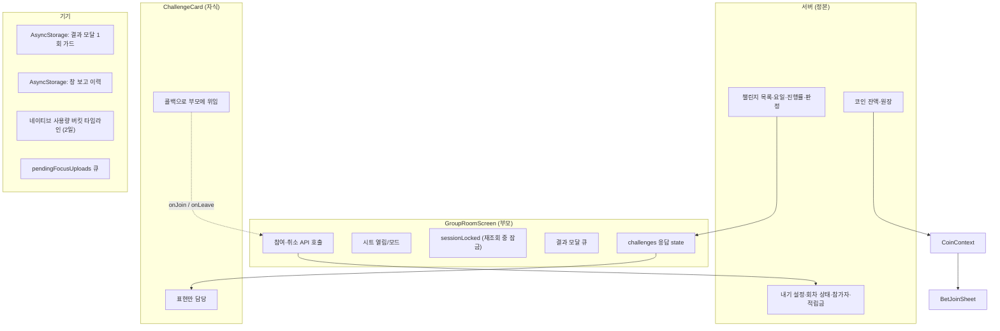

**카드는 표현만 담당한다.** 참여·취소 API 호출은 부모(`GroupRoomScreen`)가 소유하고 카드는
콜백만 부른다. `groupId`를 조회 캐시에서 역참조하던 우회도 없앤다 — prop으로 명시적으로 받는다.

- **낙관 반영의 폐기 시점은 "부모가 새 응답 객체를 내려줄 때"** 다. 값 비교(sessionId·인원·
  myJoined)로는 잡을 수 없다 — 취소 후 재참여하면 서버 상태가 취소 전과 **완전히 같아져**
  서명이 원래 값으로 되돌아온다. 객체 참조 비교(`seenChallengeRef`)를 렌더 중에 한다.
- **잔액의 정본은 CoinContext**다. 시트를 열 때·성공 후 매번 서버에서 다시 받는다.
  표기는 **`참가비 30 · 내 잔액 240`** 까지만 — 차감 후 값(`→ 210`)은 쓰지 않는다 (N46).
  "이번 주 전부" 예약은 총액(`stake × 남은 회차`)을 잔액과 대조해 버튼을 잠근다.

---

## 8. 저장소 키 (Local Storage)

| 키 | 형태 | 수명 | 용도 |
|---|---|---|---|
| `gromo:sessionResult:{userId}:{sessionId}` | `sessionDate` (`'YYYY-MM-DD'`, KST) | **60일**. **마커를 기록하는 시점**에 컷오프(오늘 − 60일)보다 오래된 키를 함께 prune한다 — 서버 큐(`/me/challenge-results`)가 **최근 30일** 경계라 마커가 항상 더 오래 산다. 30일 prune이면 주 1회 챌린지에서 마커가 먼저 지워진 회차가 **이미 본 모달로 재생**된다 | 결과 모달 1회 노출 가드. **키에 `userId`를 넣는다** — 한 기기에서 두 계정이 같은 그룹 회차에 참가하면, 세션 id만으로 키를 잡을 경우 A가 본 결과가 B에게도 스킵된다(반대로 계정 전환 때 싹 지우면 A로 돌아왔을 때 재생된다) |
| `gromo:screentime:windowReports` | `{userId, finals[], last{}}` | 어제 기준 prune | 창 보고 중복 방지 + 최종 1회 보장 |
| `gromo:screentime:bucketMonitorRegistered` | `userId` | — | 버킷 모니터 소유자 확인 |
| `gromo:focus:pendingUploads` | `[{userId, body}]` | 최대 50건 | 집중 세션 업로드 재시도 큐 (사일런트 푸시가 flush) |

계정 전환 시 오염을 막기 위해 **`userId`를 함께 저장**하고, 다르면 통째로 버린다.

> **왜 값이 `'1'`이 아니라 `sessionDate`인가.** 키(`{userId}:{sessionId}`)에 **날짜 성분이 없고**
> AsyncStorage는 **기록 시각을 보관하지 않는다**. 값이 `'1'`이면 어떤 키가 60일을 넘겼는지 판정할
> 정보가 **어디에도 존재하지 않아** 프룬 규칙이 원리적으로 실행 불가였다. 값에 회차 날짜를 담아
> 프룬의 근거를 마커 자신이 들고 있게 한다. 날짜 형식이 아닌 값(구 형식·깨진 값)도 정리 대상이다
> — 프룬 불능인 채 영영 남는 것보다 낫다.
>
> **프룬 시점은 "앱 시작"이 아니라 "마커 기록"이다.** 앱 시작 훅을 따로 두지 않고 쓰기 경로에
> 붙인다 — 마커가 늘어나는 순간이 곧 정리가 필요해지는 순간이라 훅 하나가 준다.

---

## 관련 문서

- [**정책 정본 · 결정 로그**](./policy.md)
- [PRD](./prd.md)
- [UX 설계](./ux.html)
- [상위 설계 (HLD)](./high-level-design.md)
- [상세 설계 (LLD)](./low-level-design.md)
