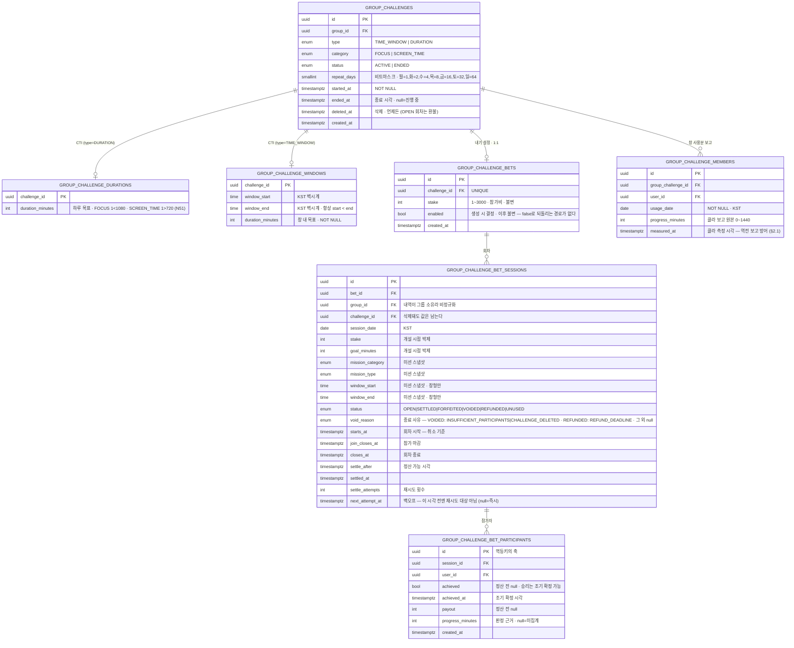
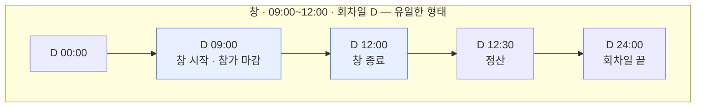
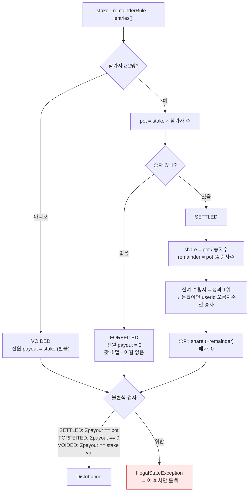
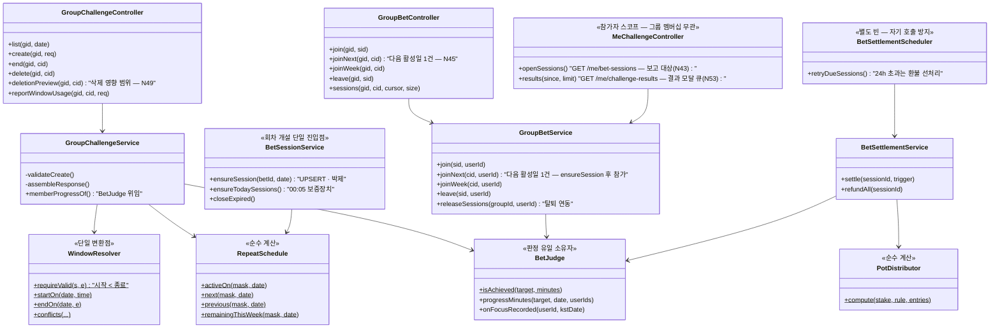

# 챌린지 — 상세 설계 (Low Level Design)

> 스키마 · API 계약 · 판정 커널 · 분배 엔진 · 클래스 배치. **구현이 직접 참조하는 문서**다.
>
> **문서 지위**: to-be. 2026-08-08 백지 재정의 정책([`policy.md`](./policy.md)) 기준으로 다시 썼다.
> 현행 코드와의 차이·전환 과제는 `policy.md` §9가 정본이다.

---

## 1. 데이터 스키마

### 1.1 ER



**`GROUP_CHALLENGE_MEMBERS`에서 사라지는 것**: `is_achieved` · `achieved_at` · `deleted_at`.
갱신하는 코드가 없던 GROMO-561 시절 잔재다. 이 테이블은 **클라 보고 원본만** 담는다.

**`repeat_days` 비트마스크** — `ISO-8601` 요일 번호(월=1…일=7)를 `1 << (dow - 1)`로 접는다.
평일은 `0b0011111 = 31`, 매일은 `127`. `0`은 저장 불가(CHECK).

**`void_reason` 값 3종 — 「종료 사유」 축 (정책 정본 N55 · N33 확장)**

| 값 | 붙는 상태 | 언제 |
|---|---|---|
| `INSUFFICIENT_PARTICIPANTS` | `VOIDED` | 참가 마감 시점 참가자가 **정확히 1명** — 환불 대상이 있는 인원 미달. 참가 마감 크론(N47) |
| `CHALLENGE_DELETED` | `VOIDED` | 그룹장이 챌린지를 삭제해 OPEN 회차가 무효화·환불됨 |
| `REFUND_DEADLINE` | `REFUNDED` | 정산 24h 데드라인 초과 자동 전원 환불 (N21) |

**`INSUFFICIENT_PARTICIPANTS`는 "2명 미만"이 아니라 "정확히 1명"이다 (N52).** 인원 게이트는
**0명을 먼저** 걸러 `UNUSED`로 닫고(결과·내역·알림 전부에서 제외), 그 다음에야 1명을 `VOIDED` +
환불로 보낸다 — 그 순서가 곧 정의다. "2명 미만"으로 읽으면 **보증 크론이 만든 0명 회차에 가짜
「인원 부족」 결과**가 쌓여 실제 최근 결과를 밀어낸다. 0명은 걸린 돈도 환불 대상도 없어 애초에
결과가 아니다.

> **사유 축은 `VOIDED` 전용이 아니다 — 정책이 그렇게 정했다 (N55).** `REFUNDED`(24h 데드라인 자동
> 환불)에도 사유가 붙는다. 정상 정산(`SETTLED`)·몰수(`FORFEITED`)·0명 종료(`UNUSED`)는 `null`이다.
> N33이 정한 무산 2종을 **대체하지 않고 확장**한 것이고, N48의 푸시 `data.voidReason`은 이 영속
> 값을 **그대로 싣는다**(상태에서 역추론하지 않는다). 서버 `GroupBetVoidReason`·V41 CHECK 3값이
> 이 결정의 구현체다.
>
> ⚠️ **동명이인 주의**: §5.2·§5.4 코드 예시의 `REFUND_DEADLINE`은 **`settle_after + 24h` 임계값을
> 나타내는 `Duration` 상수**로, 위 사유 enum과 이름만 같고 다른 것이다. 사유 enum은
> `void_reason` 컬럼에 들어가는 문자열, 상수는 그 사유를 만들어 내는 시간 임계값이다.

### 1.2 제약·인덱스

| 대상 | 제약 | 목적 |
|---|---|---|
| `group_challenges` | `CHECK (repeat_days BETWEEN 1 AND 127)` | 요일 하나는 반드시 |
| `group_challenges` | `INDEX (group_id) WHERE status='ACTIVE' AND deleted_at IS NULL` | 활성 목록 조회 · 상한 검사 |
| `group_challenges` | `UNIQUE (group_id, category) WHERE type='DURATION' AND status='ACTIVE' AND deleted_at IS NULL` | 하루형 카테고리당 1개 — check-then-insert 레이스의 **진짜** 방어선 |
| `group_challenges` | **`UNIQUE (id, category)`** (부분 인덱스 아님) | 자식의 복합 FK가 참조할 부모 키. **PK(`id`)와 부분 유니크만으로는 Postgres가 `FOREIGN KEY (challenge_id, category)`를 거부**한다 — 이게 없으면 아래 카테고리별 CHECK를 배포할 수 없다 |
| `group_challenge_durations` | **카테고리별 CHECK** — CTI 부모(`group_challenges.category`)를 참조해야 하므로 `category`를 이 테이블에 **비정규화 복사**하고 `CHECK ((category='FOCUS' AND duration_minutes BETWEEN 1 AND 1080) OR (category='SCREEN_TIME' AND duration_minutes BETWEEN 1 AND 720))` + 부모와의 `FOREIGN KEY (challenge_id, category)` | N51 상한을 **DB가 보증**한다. 단일 `BETWEEN 1 AND 1440`은 서비스 검증을 우회하는 경로(배치·수동 SQL)에서 상한 밖 값이 저장될 수 있고, 챌린지는 **불변**이라 되돌릴 수 없다 |
| `group_challenge_windows` | `CHECK (duration_minutes > 0)` | 목표 필수 |
| `group_challenge_windows` | `CHECK (window_start < window_end)` | 0길이 제거 **+ 자정 걸침 금지** — 회차가 요일 경계를 넘지 않는다는 것을 DB가 보증한다 |
| `group_challenge_members` | `UNIQUE (group_challenge_id, user_id, usage_date)` · `usage_date NOT NULL` | 날짜별 보고 1행 (NULL이면 유니크가 안 걸린다) |
| `group_challenge_bets` | `UNIQUE (challenge_id)` | 챌린지당 내기 1개 |
| `group_challenge_bets` | `CHECK (stake BETWEEN 1 AND 3000)` | **상한을 DB가 강제한다** (서비스 상수만으로는 우회 경로가 생긴다) |
| `group_challenge_bet_sessions` | `UNIQUE (bet_id, session_date)` | 회차 중복 개설 방어 |
| `group_challenge_bet_sessions` | `CHECK (stake BETWEEN 1 AND 3000)` | 박제값도 동일 제약 |
| `group_challenge_bet_sessions` | `INDEX (status, settle_after, next_attempt_at)` | 정산 대상 스캔 (백오프 포함) |
| `group_challenge_bet_sessions` | `INDEX (group_id, session_date)` | 카드 조립 |
| `group_challenge_bet_participants` | `UNIQUE (session_id, user_id)` | 중복 참가 방어 |
| `currency_transactions` | `UNIQUE (idempotency_key)` | 이중 차감/지급 최후 방어 |
| `user_wallets` | `@Version` 낙관락 | 잔액 정합 |

**`stake` 상한 3,000의 출처는 policy §C1(N30)이다.** 앱 프리셋 칩(300/900/1,500/3,000)은 이 상한의
10·30·50·100%로 정의되므로, 상한을 바꾸면 **DB CHECK 2곳과 프리셋이 함께** 움직인다. 서비스 상수만
고치고 CHECK를 두면 둘이 갈린다.

**회차 유니크가 단순해졌다.** 기존 `WHERE status <> 'CANCELED'` 부분 유니크는 "취소된 내기는
없던 일"이라는 규칙 때문이었는데, 개설 개념이 사라지면서 회차는 하루 1개만 만들어진다.
전체 유니크로 충분하다.

**회차는 자기 완결적이어야 한다.** `group_id` · `challenge_id` · 미션 스냅샷(카테고리·방식·
목표분·창 시각)까지 복사해 두는 이유는 하나다 — **챌린지가 삭제돼도 「그룹 챌린지 내역」의
한 줄이 조인 없이 온전히 읽혀야 한다.** 정규화를 깨는 대가로 이력의 불멸성을 산다.

### 1.3 마이그레이션 계획

```mermaid
flowchart LR
    V1["V1 baseline"]
    V2["V2 mission_type→type"]
    V5["V5 CTI 분리"]
    V19["V19 bets · participants"]
    V20["V20 FORFEITED·창 목표분"]
    V28["V28 부분 유니크·CHECK"]
    V29["V29 정산 근거 스냅샷"]
    VN1["Vn+1<br/>repeat_days · started_at · ended_at<br/>기존 행은 127(매일)·created_at 백필"]
    VN2["Vn+2<br/>sessions 테이블 신설 (미션 스냅샷 포함)<br/>기존 bets → bets(설정) + sessions(회차) 분해"]
    VN3["Vn+3<br/>window를 time 타입으로<br/>KST 벽시계 추출 백필<br/>CHECK (start &lt; end) 추가"]
    VN4["Vn+4<br/>잔재 컬럼 제거<br/>is_achieved·achieved_at·deleted_at<br/>usage_date NOT NULL"]
    VN5["Vn+5<br/>stake CHECK 상한<br/>부모 UNIQUE (id, category) 선행<br/>하루형 목표 상한 CHECK (N51)<br/>통계 일자 KST 재계산"]
    VN7["Vn+7<br/>daily_screen_time_stats.total_screen_time_minutes<br/>NOT NULL 해제 (미보고 = null)<br/>+ reported_at 저장·비교"]
    VN6["Vn+6<br/>notification_sent_logs 확장<br/>kind · subject_id · status · claimed_at · group_id · slot<br/>UNIQUE (user_id, kind, subject_id)"]

    V1 --> V2 --> V5 --> V19 --> V20 --> V28 --> V29 --> VN1 --> VN2 --> VN3 --> VN4 --> VN5 --> VN6 --> VN7
```



**`Vn+7`이 없으면 하루형 SCREEN_TIME이 무조건 이긴다.** `daily_screen_time_stats.
total_screen_time_minutes`가 `NOT NULL`이라 서비스가 미보고를 **0으로 접어** 저장하고, 판정은
`0 ≤ 목표`라 **미보고자가 승자**가 된다 — policy §B7·S5가 요구한 "미보고 = 미달성"이 하루형에서
뒤집힌다. 컬럼을 nullable로 바꾸고 **서비스의 0 폴딩도 함께 제거**해야 의미가 산다(마이그레이션만
해도 코드가 계속 0을 쓰면 그대로다).

**`Vn+6`이 없으면 알림 선점(N41·§6)이 구현 불가**다. 현행 `notification_sent_logs`는
`id·sent_at·target_user_id·type·user_id`뿐이라 **유니크 사건 키도, `PENDING` 상태·리스 시각도
없다** — 마이그레이션 없이 코드만 쓰면 결국 "조회 후 발송"으로 되돌아가 다중 인스턴스에서
결과 푸시가 중복 발송된다. 기존 행은 `kind=type`·`subject_id=NULL`로 백필하고, `NULL`
`subject_id`는 유니크 제약에서 빠지므로(Postgres) 과거 이력과 충돌하지 않는다.

**전환 원칙 — forward-only.** dev DB는 리셋 가능하므로 컷오버 데이터 불일치는 백필 대신
**수용 + 문서화**한다. 다만 `Vn+2`(내기 분해)와 `Vn+5`(통계 일자 재계산)는 **prod에 돈 이력이
있으면 백필이 필수**다 — 배포 시점에 prod 데이터 유무를 먼저 확인한다.

**`Vn+3` 백필 주의**: 기존 `window_start_at`은 `timestamptz`인데 "KST 벽시계 시각만 유효,
날짜는 무의미"라는 규약으로 저장돼 있다. `(window_start_at AT TIME ZONE 'Asia/Seoul')::time`으로
추출한다 — UTC로 읽으면 정확히 9시간 어긋난다(GROMO-1100과 같은 함정).

**`Vn+3`의 `CHECK (window_start < window_end)`는 기존 행을 깨뜨릴 수 있다.** 걸침이 허용되던
시절에 만들어진 `start ≥ end` 행(예: `22:00~01:00`)이 남아 있으면 CHECK 추가가 실패한다.
dev는 forward-only로 리셋하면 되지만 **prod에 그런 행이 있으면 먼저 정리**해야 한다 —
배포 전에 `SELECT count(*) FROM group_challenge_windows WHERE window_start >= window_end`로
확인한다.

---

## 2. API 계약

베이스: `/api/v1` · 인증: JWT(`@LoginUser UUID userId`)

### 2.1 챌린지

#### `GET /groups/{groupId}/challenges`

| 파라미터 | 타입 | 필수 | 설명 |
|---|---|---|---|
| `date` | `LocalDate` | ✗ | 클라의 **KST 오늘**(`todayStrKst()`). 없으면 `memberProgress`·`bet.session` 미계산 |

**200** — `GroupChallengeResponse[]` (`createdAt` DESC)

```jsonc
[{
  "id": "uuid",
  "missionType": "TIME_WINDOW",          // TIME_WINDOW | DURATION
  "missionCategory": "FOCUS",            // FOCUS | SCREEN_TIME
  "durationMinutes": 90,                 // DURATION=하루 목표, TIME_WINDOW=창 내 목표
  "repeatDays": ["MON", "WED", "FRI"],   // ISO 요일 · 항상 1개 이상
  "windowStart": "09:00",                // KST 벽시계, TIME_WINDOW만
  "windowEnd": "12:00",
  "status": "ACTIVE",
  "startedAt": "2026-08-01T02:11:00Z",
  "activeToday": true,                   // 오늘이 repeatDays에 있나
  "nextSessionAt": "2026-08-12T00:00:00Z", // **오늘을 제외한** 다음 활성일의 회차 시작. INACTIVE면 null. ACTIVE도 창형인데 창 상세가 없으면 null(아래 ⚠️)
  "nextSessionJoined": false,            // 다음 회차를 이미 예약했나 (N45 버튼 상태 — 내기 켜짐일 때만 의미)
  "canParticipate": true,                // FOCUS면 항상 true, SCREEN_TIME은 권한 여부
  "memberProgress": [                    // null = 미계산 (date 없음 · 비활성 요일)
    { "userId": "uuid", "nickname": "민지",
      "progressMinutes": 32,             // null = SCREEN_TIME 미집계 (0분 아님)
      "achieved": false }                // null = 판정 불가
  ],
  "bet": {                               // null = 내기 꺼짐 / 필드 부재 = 구서버
    "enabled": true,
    "stake": 30,                         // 참가비 (불변 — 수정 API 없음)
    "session": {                         // null = 오늘 회차 없음 (비활성 요일)
      "sessionId": "uuid",
      "sessionDate": "2026-08-10",
      "stake": 30,                       // 이 회차에 박제된 참가비
      "goalMinutes": 90,                 // 이 회차에 박제된 목표
      "pot": 90, "status": "OPEN",
      "startsAt": "2026-08-10T00:00:00Z",   // 회차 시작 — 취소 기준
      "joinClosesAt": "2026-08-10T00:00:00Z", // 참가 마감
      "myLeaveDeadlineAt": "2026-08-10T14:05:00Z", // 내 취소 마감 · 미참여면 null
      "closesAt": "2026-08-10T03:00:00Z",
      "myJoined": true, "myAchievedNow": false,
      "participants": [
        { "userId": "uuid", "nickname": "민지",
          "progressMinutes": 52,         // 하루형만 — 참가 시트의 진행분 공개용
          "achieved": null }
      ]
    }
  },
  "lastSettledSession": {                // null = 정산된 회차 없음 — 카드 "지난 결과" 표시용
    "sessionId": "uuid",
    "sessionDate": "2026-08-08", "stake": 30, "pot": 90,
    "status": "SETTLED",                 // SETTLED | FORFEITED | VOIDED | REFUNDED
    "voidReason": null,                  // VOIDED: INSUFFICIENT_PARTICIPANTS | CHALLENGE_DELETED
                                         // REFUNDED: REFUND_DEADLINE (N55) · 그 외 null
    "goalMinutes": 90,
    "myJoined": true,
    "myAchieved": true, "myPayout": 45,  // myJoined=false면 둘 다 null
    "results": [{ "userId": "uuid", "nickname": "민지",
                  "achieved": true, "payout": 45,
                  "progressMinutes": 102 }]
  },
}]
```

> **⚠️ `nextSessionAt` 은 ACTIVE 에서도 null 이 될 수 있다 — 「null == INACTIVE」로 단정하지 마라.**
> 창형(`TIME_WINDOW`)인데 `group_challenge_windows` 상세가 없으면 `GroupBetService#loadNextSessions`
> 가 그 챌린지를 **의도적으로 건너뛴다** — 시작 시각을 모르면 다음 회차를 계산할 수 없고, 하루형으로
> 간주해 자정을 주면 서지도 않을 회차를 예고하기 때문이다(그 자리 주석이 직접 그렇게 적고 있다).
>
> **이론적 사고가 아니라 레거시 데이터에 실재할 수 있다.** V5 가 인라인 파라미터를 CTI 상세
> 테이블로 이관할 때 백필을 **두 번** 했다 — ⑴ 챌린지 자체의 `window_start`·`window_end` 가
> NOT NULL 인 행, ⑵ 그게 null 이어도 **그룹의 미션 설정**이 `type`·`category` 까지 일치하고
> 시각이 있으면 그 값으로(그룹 폴백, `NOT EXISTS` 가드). 따라서 **상세가 없는 행은 둘 다 없었던
> 경우**다 — 챌린지 값이 null 이고, 그룹 폴백도 종류·카테고리가 다르거나 시각이 null 이라
> 적용되지 않은 행. 신규 생성 경로는 CTI 를 지키므로 새로 생기지는 않는다.
>
> **같은 분기를 타는 필드가 셋이다.** 조립부가 `nextSessions.containsKey(...) ? … : null` 이므로
> `nextSessionAt` 뿐 아니라 **`nextSessionJoined` 와 `nextSessionStake` 도 그 경우 null** 이다 —
> 위 예시의 `"nextSessionJoined": false` 는 **정상 경로의 값**이지 불변식이 아니다.
> `nextSessionJoined` 를 「false = 미예약」으로 단정하면 그 챌린지에서 틀린다.
>
> 📌 2026-08-11 정정(PR #610 codex 리뷰). 서버 DTO javadoc 도 같은 취지로 정정돼 있다(GROMO-1285).

> **결과 모달 큐는 이 응답에 없다 (N53).** 여기 있는 `lastSettledSession`은 카드의 "지난 결과 +
> 정산 근거" 한 줄 표시용 **그룹 기준 최신 1건**일 뿐이다. 모달 큐는 참가자 스코프
> **`GET /me/challenge-results`** 에서 가져온다 — 최신 1건으로 모달을 만들면 ① 내가 참가 안 한
> 최신 회차가 그 앞의 내 결과를 가리고 ② 앱을 안 연 사이 정산된 내 회차 여럿이 1건으로 접히며,
> 무엇보다 ③ 카드 조회는 그룹 멤버십을 검증하므로 **탈퇴자가 자기 결과를 못 본다**.
>
> **1회 가드의 정본은 서버 확인 표시(ack)다 (N58).** 앱 로컬 seen 마커는 정본이 아니라
> **ack 요청이 실패한 창을 메우는 보완재**로 잔류한다 — 기기를 바꾸거나 앱을 지우면 로컬 마커가
> 통째로 사라져 이미 본 결과가 전부 재생되고, 두 기기를 쓰면 각 기기가 같은 결과를 한 번씩
> 보여준다. 마커는 "서버가 아직 모르는 사이 같은 결과가 두 번 뜨는 것"만 막는다.
>
> 표시 시점은 **모달이 뜬 순간**이다(닫을 때가 아니다 — 계약 §1). 닫을 때 표시하면 모달이 떠
> 있는 사이의 재조회(당겨서 새로고침)가 같은 회차를 큐에 다시 넣는다.
>
> **선례는 리그다** — 같은 문제를 이미 이 모양으로 풀었다:
> `LeagueWeeklyResult.acknowledgedAt`(`:63-64`) · `LeagueWeeklyResultRepository.acknowledge`
> (`:73-89`)의 **`acknowledged_at IS NULL` 조건부 원자적 UPDATE**(`:87` — 중복·동시 호출에도 최초
> 1회만 세팅. 멱등·선점이고, 대상 없음/이미 확인은 0행 no-op) · `LeagueController`(`:117-128`).
> 리그가 `weekStartAt`을 실어 보내 "그 사이 배치가 넣은 새 결과를 삼키지 않게" 한 것과 같은
> 이유로, 여기서도 **GET으로 받은 그 `sessionId`** 를 대상으로 한다.
> 제안 엔드포인트: `POST /me/challenge-results/{sessionId}/ack`.
>
> ⚠️ **범위 구분 — 지금 코드는 여전히 로컬 마커만 쓴다.** 위 ack는 **GROMO-1577이 구현**한다.
> 이 티켓(1583)이 건드린 것은 미션 스냅샷 4필드와 모달 문구뿐이고, `challengeResult.ts`의
> 가드는 그대로 AsyncStorage 마커(`{userId}:{sessionId}`, IA §8)다. 이 문단은 **설계 정본이지
> 현재 구현 서술이 아니다.**
>
> **`limit`은 최대 10건이고, 30일은 「조회 윈도우」다 — 보존 기간이 아니다.**
> `GroupBetQueryService.RESULTS_WINDOW`(`:65`)는 `Instant.now().minus(RESULTS_WINDOW)`로 만든
> **쿼리 하한**(`effectiveSince`, `:133-137`)일 뿐이고, 회차·참가자 행을 지우는 프룬 잡은 **없다**
> (`GroupBetScheduler`의 스케줄 3건은 재시도·무산·회차 생성뿐). 즉 **행은 영구 보존되고 30일보다
> 오래된 회차가 큐에 안 실릴 뿐**이다. 서버 javadoc이 이 상수를 "보존 창"이라 부르는 것도 같은
> 오해를 부르는 표현이라 함께 정정 대상이다.
>
> 그래서 **"30일 경계가 로컬 마커 프루닝(60일)보다 짧아야 재생이 없다"는 종전 설명은 폐기한다.**
> 재생을 막는 것은 두 수명의 대소 관계가 아니라 **서버 ack**다 — 마커가 프루닝돼도 ack된 회차는
> 애초에 큐에 실리지 않는다. 두 수명 비교는 로컬 마커가 유일한 가드였을 때의 임시 방편이었다.

> **`activeToday` / `nextSessionAt` 계약**: 둘은 **배타가 아니라 보완**이다.
> `nextSessionAt`은 항상 **오늘을 제외한** 다음 활성일을 가리킨다(`RepeatSchedule.next()`).
> 오늘 회차의 정보는 `bet.session`에 있고, 내기가 꺼져 있으면 앱이 `windowStart`로 직접 만든다.
> 하루형은 회차 시작이 자정이라 "오늘 회차 시작"이 항상 과거다 — 이 분리가 없으면 오늘 도는
> 챌린지가 "다음 회차 내일"로 잘못 표시된다.

> **브리지 주기 동안 `bet`은 구·신 필드를 함께 싣는다 (N36 보강).** 경로만 유지하는 걸로는
> 부족하다 — 설치된 구앱의 `GroupChallengeBet` 타입은 최상위 `betId`·`status`·`myJoined`·
> `participants`를 **필수**로 읽는데, 새 응답은 그 자리를 `enabled`·`stake`·중첩 `session`으로
> 바꾼다. 서버 먼저 배포하면 구앱은 `bet`이 있다고 판단한 뒤 `undefined` 식별자로 렌더·호출해
> 깨진다. 그래서 브리지 한 주기 동안 **오늘 회차 기준으로 레거시 4필드를 채워 병기**하고,
> 구앱 전환 확인 후 제거한다(제거는 별도 티켓).
>
> **직렬화 계약**: `bet` · `bet.session` · `goalMinutes` · `results[].progressMinutes` ·
> `participants[].progressMinutes`에 **`@JsonInclude(NON_NULL)`을 붙이면 안 된다.**
> 앱이 `undefined`(구서버) ↔ `null`(값 없음) ↔ `0`(진짜 0분)을 3상으로 구분한다.
> 필드가 통째로 사라지면 3상이 2상으로 무너진다.

> **탈퇴 멤버 가시성**: 라이브 뷰(`memberProgress` · `session.participants`)는 탈퇴 멤버를
> **필터**하고, 정산 명단(`lastSettledSession`·`/me/challenge-results`의 `results`)은 명단·인원·`pot`을 보존하되 닉네임만
> **"탈퇴한 사용자"** 로 치환한다. **단 탈퇴자가 시작된 회차의 참가자면 라이브에서도 보인다** —
> 정산 대상으로 남기 때문이다(정책 C8).

> **요청자 검증**: `readOnly` 트랜잭션이므로 `findByIdAndIsDeletedFalse`(무락 활성 필터).
> Postgres가 `readOnly`에서 `FOR SHARE`를 거절하므로 공유 락을 쓸 수 없다.

#### `POST /groups/{groupId}/challenges` — 그룹장 전용

```jsonc
{
  "missionCategory": "FOCUS",
  "missionType": "TIME_WINDOW",
  "repeatDays": ["MON", "WED", "FRI"],   // 필수 · 1개 이상
  "durationMinutes": 90,
  "windowStart": "09:00",                // TIME_WINDOW만
  "windowEnd": "12:00",
  "bet": { "enabled": true, "stake": 30 } // 선택
}
```

**201** `{ "challengeId": "uuid" }`

**검증 순서 = 에러 우선순위**

| 순 | 검사 | 에러 |
|---|---|---|
| 1 | **그룹 멤버인가** — 그룹 행을 **`FOR UPDATE`**(생성 직렬화)로 잡은 뒤 멤버십 행 조회 · 요청자 유저 행은 801 규약대로 `FOR SHARE` | `MEMBER_ONLY` 403 |
| 2 | 그 멤버가 **OWNER인가** | `NOT_OWNER` 403 |
| 3 | `repeatDays` 비어있지 않은가 | `CHALLENGE_REPEAT_DAYS_REQUIRED` 400 |
| 4 | 활성 4개 미만인가 | `CHALLENGE_LIMIT_EXCEEDED` 409 |
| 5 | 하루형이면 같은 카테고리 활성 챌린지 없는가 | `CHALLENGE_DUPLICATE` 409 |
| 6 | 창형: **`시작 < 종료`** (자정 걸침 금지 — `22:00~01:00` 거부) | `INVALID_MISSION_PARAMS` 400 |
| 7 | 창형: `0 < 목표 ≤ 창 길이` — **FOCUS는 `목표 > 5분(관용치)` 추가**<br>하루형: **FOCUS `≤ 1080분`(18h) · SCREEN_TIME `≤ 720분`(12h)** (N51) | `INVALID_MISSION_PARAMS` 400 |
| 8 | 창형 SCREEN_TIME: 목표가 15분 배수 | `CHALLENGE_GOAL_NOT_ALIGNED` 400 |
| 9 | 창형: 기존 창과 겹치지 않는가 (§3.5) | `CHALLENGE_WINDOW_OVERLAP` 409 |
| 10 | 내기 켬: `1 ≤ stake ≤ 3000` | `BET_INVALID_STAKE` 400 |

> **권한 검사는 두 단계다 — 403이 두 종류다.** 그룹에 **아예 없는 사람**은 `MEMBER_ONLY`,
> 멤버인데 **OWNER가 아닌** 사람은 `NOT_OWNER`다(`GroupChallengeService.createChallenge` —
> 멤버십 조회 `orElseThrow(MEMBER_ONLY)` → `role != OWNER` 검사 `NOT_OWNER`). 둘을 하나로 뭉뚱그려
> 적으면 **클라이언트가 같은 403을 잘못 분기**한다 — "그룹장에게 요청하세요"와 "이 그룹의 멤버가
> 아닙니다"는 유저에게 전혀 다른 안내다.

> **왜 생성만 배타 락인가**: 활성 4개 상한(4)·창 겹침(9)은 **그룹 전역** 불변식이라 공유 락으로는
> 못 지킨다 — 동시 생성 2건이 둘 다 "3개네" 하고 통과하면 5개째가 들어온다(부분 유니크 제약은
> 하루형 카테고리 중복(5)만 막는다). 그룹 행 `FOR UPDATE`로 생성을 직렬화한다. 생성은 그룹장
> 전용의 드문 동작이라 경합 비용은 없다시피 하다. 조회는 기존대로 무락(§2.1).
>
> **왜 목표 하한이 관용치인가**: 창형 FOCUS 판정이 `분 ≥ 목표 − 5`(§3.2)라서 목표 1~5분이면
> 문턱이 0 이하 — **0분도 자동 달성**이 된다. 내기라면 전원이 "이미 달성" 가드(§3.3)에 걸려
> 아무도 참가하지 못한다. 관용치보다 큰 목표만 받는다.

**생성 직후 당일 회차** — 오늘이 활성 요일이고 아직 참가 가능한 시각(하루형: 항상 / 창형: 창
시작 전)이면 **생성 트랜잭션 안에서 `ensureSession(betId, 오늘)`을 함께 수행**한다. 회차 개설
경로가 00:05 스케줄러와 `join-week` lazy뿐이면, 00:05 이후 만든 챌린지는 다음 날까지 오늘
회차가 없다 — 카드에 `sessionId`가 비어 단건 참여가 막히고, 남은 회차가 오늘뿐이면
`join-week` 버튼 숨김 규칙(§2.2)과 겹쳐 **참여 경로가 0**이 된다. (HLD §3.2)

#### ~~`PATCH /groups/{groupId}/challenges/{challengeId}`~~ — **만들지 않는다**

챌린지는 만들면 통째로 불변이다(policy §A7). 목표분도 참가비도 바꿀 수 없다. 바꾸려면
삭제하고 새로 만든다 — 삭제에 조건이 없으므로 동선이 성립한다.

**`bet.enabled`를 뒤집는 엔드포인트도 만들지 않는다**(policy §A7 · N26). 내기를 끄는 순간 이미
참가비를 낸 OPEN 회차의 돈을 어떻게 할지가 남는데, 그건 `DELETE`가 하는 일(무효화 + 전원 환불)과
정확히 같다. 같은 결과에 경로를 둘 두면 멱등키·잠금 순서·환불 1회 불변식을 두 벌 검증해야 한다.
끄려면 `DELETE` 후 내기 없이 재생성한다.

#### `POST /groups/{groupId}/challenges/{challengeId}/end` — 그룹장 전용

**204**. `status=ENDED`, `ended_at=now()`. **챌린지 행 `FOR UPDATE`를 먼저 잡고** OPEN 회차를
검사·전이한다 — 삭제와 같은 직렬화다.

| 조건 | 에러 |
|---|---|
| OPEN 회차 존재 (**예약된 미래 회차 포함**) | `CHALLENGE_END_BLOCKED` 409 |
| 이미 ENDED | 멱등 — 204 |

> **왜 종료도 배타 락인가**: 참여 경로의 `ensureSession`은 챌린지 행 `FOR SHARE`로 활성을 확인한
> 뒤 회차·참가를 넣는다(§2.2). 종료가 락 없이 돌면 그 **미커밋 회차를 못 보고** OPEN 없음으로
> 판정해 `ENDED`를 확정하고, 뒤이어 참가가 커밋돼 **종료된 챌린지에 참가비가 걸린다**. 삭제는
> 이미 `FOR UPDATE`로 막았는데(§2.1) 종료만 빠져 있으면 같은 구멍이 한쪽에 남는다 — 다만 종료
> 쪽은 환불 루프가 없어 결과가 더 나쁘다(무효화도 환불도 안 된 고아 회차).

> 누군가 "이번 주 전부"로 금요일까지 예약해 두면 그룹장은 **금요일 정산이 끝나야** 종료할 수
> 있다. 남의 돈이 걸린 회차를 그룹장이 접을 수 없게 하는 것이 맞다. 에러 문구가 언제까지
> 기다려야 하는지 말한다 — <code>8/14(금) 회차가 끝나야 종료할 수 있어요</code>

#### `GET /groups/{groupId}/challenges/{challengeId}/deletion-preview` — 그룹장 전용

삭제 경고에 쓸 **영향 범위 프리플라이트** (N49 · 기존 미해결 **K11** 해소).

```jsonc
{ "openSessions": [                     // 예약된 미래 회차까지 전부
    { "sessionDate": "2026-08-10", "participantCount": 3, "pot": 90 },
    { "sessionDate": "2026-08-12", "participantCount": 2, "pot": 60 }
  ],
  "totalRefund": 150 }                  // 무효화 시 돌려줄 총액
```

카드 조회의 `bet.session`은 **오늘 회차 1건**뿐이라 `join-week`로 예약된 미래 회차가 빠진다 —
그 상태로 경고를 그리면 그룹장이 **뒤에 걸린 남의 돈을 못 본 채** 삭제를 확정하게 된다.
FR-12-1이 요구하는 "걸려 있는 **모든** OPEN 회차의 인원·적립금"은 이 응답으로 만든다.

#### `DELETE /groups/{groupId}/challenges/{challengeId}` — 그룹장 전용

**조건 없이 언제든 가능하다.** 진행 중인 회차가 있으면 무효화하고 전원에게 환불한다.

```java
@Transactional
void deleteChallenge(UUID groupId, UUID challengeId, UUID ownerId) {
    requireOwner(groupId, ownerId);
    // **그룹 바인딩 필수** — challengeId만으로 잠그면 IDOR: 내가 방장인 그룹의 gid + 남의
    // 그룹 챌린지 cid 조합으로 requireOwner를 통과시켜 남의 챌린지를 지울 수 있다.
    var ch = challengeRepo.findByIdAndGroupIdForUpdate(challengeId, groupId)  // 삭제 행 포함
                          .orElseThrow(CHALLENGE_NOT_FOUND);
    if (ch.isDeleted()) return;      // 이미 삭제됨 — 멱등 204 (활성만 조회하면 재시도가 예외로 빠진다)

    // ① OPEN 회차를 id 오름차순으로 전부 잠근다
    var sessions = sessionRepo.findOpenByChallengeIdForUpdate(challengeId);   // ORDER BY id
    // ② 지갑은 **트랜잭션 전체에서 한 번**, 전역 userId 오름차순으로 잠근다 (§5.4)
    var userIds = sessions.stream().flatMap(s -> participantRepo.userIdsOf(s.getId()).stream())
                          .distinct().sorted().toList();
    walletRepo.lockAllForUpdate(userIds);
    // ③ 무효화 + 환불 (멱등키 session:{sid}:refund:{participantId})
    //    참가자 0명이면 환불할 것도 알릴 것도 없다 → UNUSED로 닫는다 (N52)
    for (var s : sessions) {
        if (participantRepo.countBySessionId(s.getId()) == 0) { s.closeUnused(); continue; }
        voidAndRefund(s, VoidReason.CHALLENGE_DELETED);
    }
    // ② 정산이 끝난 회차는 건드리지 않는다 (B8 정산 불가역)
    ch.softDelete();                 // deleted_at = now()
}
```

> **지갑 잠금은 회차 루프 안이 아니라 트랜잭션 앞에서 한 번에** 한다. 회차별
> `voidAndRefund` 안에서만 정렬하면 **그 호출 안에서만** 오름차순이고 트랜잭션 전체로는
> 순서가 깨진다 — 참가자가 겹치는 두 챌린지를 동시에 삭제하면 한쪽은 Z→A, 다른 쪽은 A→Z가
> 되어 데드락으로 한쪽이 롤백된다. §5.4의 "여러 지갑은 `userId` 오름차순"은 **트랜잭션
> 단위** 규약이다.

> **lazy 개설과의 직렬화**: 참여 경로(`join-week`의 `ensureSession`, 단건 참여의 회차 조회)는
> **챌린지 행 `FOR SHARE` + 활성 재확인** 후에만 진행한다 (§2.2). 이 락이 없으면 join-week이
> 챌린지를 활성으로 읽고 아직 커밋하기 전에 삭제가 먼저 커밋될 수 있다 — 삭제의 OPEN 회차
> 스캔(`FOR UPDATE`)은 **미커밋 lazy 회차를 볼 수 없어** 환불 루프에서 빠지고, 뒤이어 커밋된
> 참가는 삭제된 챌린지에 참가비가 걸린 **고아 OPEN 회차**가 된다. 챌린지 행에서
> `FOR UPDATE`(삭제) × `FOR SHARE`(참여)가 충돌해 직렬화되고, 참여 쪽은 락 획득 후 활성
> 재확인으로 삭제 선행 커밋을 감지한다.

**204**. 응답 없음. 앱은 삭제 후 목록을 다시 받는다.

| 조건 | 결과 |
|---|---|
| OPEN 회차 있음 | **무효화 + 전원 환불** 후 삭제 |
| SETTLED / FORFEITED 회차 있음 | 그대로 둔다 — 이미 확정된 정산은 되돌리지 않는다 |
| 이미 삭제됨 | 멱등 — 204 |

> **`CHALLENGE_DELETE_BLOCKED`는 폐기된다.** 돈 기록 보존은 삭제를 막아서가 아니라
> **이력의 소유자를 그룹으로 옮겨서** 달성한다(§A9). 회차 행에 미션 스냅샷이 박제돼 있으므로
> 챌린지가 사라져도 내역 한 줄이 온전하다.

> **잠금 순서 준수**: 회차 → 지갑, 회차는 `id` 오름차순, 지갑은 `userId` 오름차순.
> 삭제는 여러 회차·여러 지갑을 한 트랜잭션에서 만지므로 교차 데드락 위험이 가장 큰 경로다.

**경고 확인 단계는 앱이 진다** (PRD FR-12-1 · IA §2.5). 진행 중(OPEN 회차 있음) 삭제에는 확인이
한 단계 더 붙고 그 시트가 **사라지는 날짜·참여 인원·돌아가는 적립금**을 수치로 보여준다.

| 축 | 규칙 |
|---|---|
| 서버 게이트 | **없다** — `DELETE`는 확인 단계 수와 무관하게 조건 없이 받는다. 경고는 오탭 방어이지 권한 검사가 아니다 |
| 수치 출처 | OPEN 회차의 `sessionDate` · `participants.length` · `pot` |
| 수치 출처 | **`deletion-preview` 프리플라이트**(§2.1) — 예약된 미래 OPEN 회차까지 전부. 카드의 `bet.session`은 오늘 1건뿐이라 쓸 수 없다 (K11 해소 · N49) |

#### `GET /groups/{groupId}/challenge-history`

**그룹 단위** 회차 내역. 챌린지 삭제와 무관하게 조회된다.

| 파라미터 | 필수 | 설명 |
|---|---|---|
| `cursor` | ✗ | 직전 페이지 마지막 `sessionId`(UUID). 서버가 **`(session_date, id)` 튜플**로 해석해 keyset을 잇는다 — 그룹 전체 조회라 같은 날짜에 회차가 최대 4개, 날짜만으로 자르면 페이지 경계의 같은 날 나머지가 스킵(또는 중복)된다 |
| `size` | ✓ | 범위 밖이면 `INVALID_PAGE_REQUEST` 400 |
| `challengeId` | ✗ | 특정 챌린지로 필터 (챌린지별 이력 화면이 이걸 쓴다) |

```jsonc
{
  "content": [{
    "sessionId": "uuid",
    "sessionDate": "2026-08-10",
    "challengeId": "uuid",              // 삭제된 챌린지여도 값은 있다
    "challengeDeleted": true,           // 앱이 "삭제된 챌린지" 배지를 단다
    "missionCategory": "FOCUS",         // ↓ 미션 스냅샷 — 조인 없이 읽는다
    "missionType": "TIME_WINDOW",
    "goalMinutes": 90,
    "windowStart": "09:00", "windowEnd": "12:00",
    "stake": 30, "pot": 90, "status": "SETTLED",
    "voidReason": null,                 // VOIDED: INSUFFICIENT_PARTICIPANTS | CHALLENGE_DELETED
                                        // REFUNDED: REFUND_DEADLINE (N55) · 그 외 null
                                        // (사유 없이 상태 하나면 "인원 부족" 카피가 삭제 건까지 거짓말한다)
    "myPayout": 45, "myAchieved": true, "myProgressMinutes": 102,
    "achievedCount": 2, "participantCount": 3
  }],
  "size": 20, "hasNext": true, "nextCursor": "uuid"
}
```

**미션 스냅샷이 없으면 이 응답을 만들 수 없다.** 챌린지 행이 사라진 뒤 `challenge_id`로 조인하면
빈 값이 나온다 — 그래서 §1.1에서 회차에 카테고리·방식·목표·창 시각을 복사해 둔다.

#### `PUT /groups/{groupId}/challenges/{challengeId}/window-usage` — 멤버 **+ 시작된 회차의 참가자**

```jsonc
{ "usageDate": "2026-08-10", "progressMinutes": 24,
  "measuredAt": "2026-08-10T14:03:00Z" }   // 구앱은 생략 가능 — 단 참가자 갈래는 없으면 저장 안 함(아래)
```

**204**. `measuredAt`은 **서버 시각 대비 +2분을 넘으면 거부**한다(`INVALID_MEASURED_AT` 400).
기기 시계가 앞서 있으면 미래 타임스탬프가 저장되고, 그 뒤의 **정상 보고가 전부 "오래된 값"으로
버려져** 낮은 사용분이 그대로 굳는다 — 스크린타임은 낮을수록 유리하므로 **오달성으로 이긴다**.
클라 값을 신뢰하되 순서 결정권까지 무제한으로 주지는 않는다.

upsert 멱등 — 단 **`measuredAt`이 저장값보다 오래된 보고는 조용히 204로 무시**한다
(`measured_at` 컬럼 저장·비교). 클라에 재시도 큐는 없지만(실패 시 다음 sync가 **그 시점
최신값**을 다시 보고 — `screentimeSync.ts`) 역전은 큐 없이도 생긴다: ① 포그라운드 sync와
사일런트 푸시 트리거 sync(§6.2)가 경합해 낮은 값 요청이 나중에 처리되거나 ② 타임아웃으로
앱은 실패 처리했지만 요청이 서버에 지연 도착하는 경우. "마지막 도착이 이긴다"로 두면
**정산 결과가 네트워크 도착 순서에 좌우**된다 — 돈 경로다.
서버는 범위(0~1440)만 검증한다(클라 신뢰).
**참가자 보고(아래 갈래 ①)는 회차 락을 잡고 `OPEN`을 재확인한 뒤 쓴다.** 무락으로 "OPEN이네" 확인만 하고 upsert하면
정산과 경합한다 — 정산이 락을 잡고 **옛 값으로 패배를 확정·지급한 뒤**, 이 트랜잭션이 새 값을
써서 **저장된 측정치와 지급 결과가 어긋난다**(계약상 "정산 후 보고는 무시"인데 실제로는 반영된
셈). 회차 락을 먼저 잡으면 정산이 새 값을 보거나, 보고가 정산 후임을 알고 스스로 무시한다.
**하루형 SCREEN_TIME 일일 보고 경로도 같은 직렬화가 필요하다** — DURATION 회차가 그 값을 쓴다.

**자격은 `usageDate` 회차에 결속되고, 두 갈래로 갈린다.** 대상 회차 = `(challengeId, usageDate)`
회차 1건이다(있을 수도, 없을 수도 있다). 그 회차에 **내 참가 행이 있으면 돈이 걸린 보고**,
없으면 **표시용 보고**다.

| 갈래 | 조건 | 게이트 |
|---|---|---|
| **① 참가자 (돈)** | `usageDate` 회차의 참가자 | 그 회차 행을 **`FOR UPDATE`로 잠그고** ⓐ 아직 `OPEN` ⓑ `now ≥ starts_at` 를 재확인 + ⓒ **`measuredAt ≥ 참가 시각`**(없으면 거절)인 뒤에만 저장. 하나라도 아니면 조용히 **204**. 그룹 멤버가 아니어도 받는다 (탈퇴자 — N43) |
| **② 표시용 (FR-9)** | 그 날짜에 참가 행이 없는 **그룹 멤버** | 받는다(`measuredAt` 없어도 받는다). **단** ⓐ 회차가 있는데 아직 `starts_at` 전이면 무시(204) ⓑ **회차가 없는 날짜**는 **오늘·어제**까지만 받는다(그보다 오래되면 204) |

- **왜 "참가자"로 좁히면 안 되나**: `memberProgress`는 **그룹 멤버 전원** 축이다. 게다가 **내기가
  꺼진 챌린지엔 회차 행이 아예 없다**(내기는 생성 시에만 켤 수 있다 — N26). "참가한 OPEN 회차"를
  요구하면 그 챌린지에는 창 사용분이 **한 건도** 저장되지 않아 카드 `memberProgress`가 전원 영구
  `null`이 되고 **FR-9 진행률이 통째로 죽는다**. IA §4.3의 "그룹 전체 달성 현황은 카드에서 상시
  보인다"와도 정면으로 어긋난다.
- **왜 "챌린지의 아무 시작된 OPEN 회차"로도 안 되나**: 오늘 회차 참가자가 `join-week`로 함께
  예약한 **미래 회차가 시작되기도 전에** 그 날짜의 낮은 값을 미리 심을 수 있다. 대상 회차를
  **날짜로 결속**해야 "시작 전 선기록"이 닫힌다.
- **왜 표시용도 시작 전엔 막나**: 미참가 상태로 낮은 값을 심어두고 **창 시작 전에 참가**하면
  참가자 결속을 우회한다. 창형은 **참가 마감 = 창 시작**(`join_closes_at == starts_at`)이라 시작 후
  합류가 없어 이 한 줄로 닫힌다. 시작 전 창에는 표시할 사용분이 없으므로 FR-9 손실도 없다.
- **왜 참가자 갈래만 `measuredAt`을 요구하나 (①-ⓒ)**: 판정축을 **"언제 도착했나"에서 "언제
  측정됐나"로** 옮긴 것이다. 도착 순서는 네트워크가 정하지만 측정 시각은 **값 자체의 성질**이라
  순서가 어떻게 꼬여도 결론이 같다. 비교 기준인 **참가 시각(참가 행 `created_at`)은 참가비 차감과
  같은 트랜잭션에서 박제되는 불변값**이라 "언제부터 돈이 걸렸나"의 단일 진실이다.
  **`measuredAt`이 없으면(구앱) 참가자 갈래는 거절**한다 — 시각을 모르면 참가 전 값인지 판별할
  방법이 없고, 돈이 걸린 쪽은 보수적으로 가야 한다. 미보고 = 미달성(FR-21)은 손해가 **본인에게만**
  가지만, 참가 전 값을 받으면 **남의 돈**을 가져간다. **표시용 갈래는 종전대로 받는다**(판정과
  무관하고, FR-9 카드가 구앱에서 죽으면 안 된다).
- **왜 표시용 과거 날짜를 오늘·어제로 자르나 (②-ⓑ)**: 미래만 막고 과거를 전부 통과시키면
  **행을 무한히 심을 수 있다**. (챌린지, 유저, **날짜**) 유니크는 날짜마다 새 행을 허용하므로
  유니크가 이 증식을 못 막는다. **"오늘만"으로 자르지 않은 이유**는 창형 정산 그레이스가 창
  종료 +30분이고 창은 자정을 걸치지 못하므로(V35 `CHECK (window_start < window_end)`), **자정 직후
  도착하는 어제분 늦은 보고가 정당한 경로**이기 때문이다 — 하루 여유가 그 폭을 덮고도 남는다.
  **회차가 있는 날짜는 이 제한을 받지 않는다**: 날짜 자체가 서버가 만든 회차에 결속돼 이미
  유한하고, 그쪽 돈 판정은 회차 게이트가 맡는다. 잘라낸 것은 정확히 **"회차도 없고 표시할 곳도
  없는 임의 과거 날짜"** 뿐이라 FR-9 손실이 없다(카드 진행률 조회는 요청 날짜 단건이라 더 오래된
  날짜를 채워 봐야 표시되지 않는다).

**선기록 악용은 회차 게이트 밖에서 네 겹으로 닫는다.** 회차 기준 게이트는 **행이 있어야**
작동하므로 아직 회차가 없는 날짜가 새고, **동시성 방어(잠금)는 순차 경합을 못 막는다**.

1. **날짜 게이트** — `usageDate`가 **KST 오늘보다 미래**면 무시(204). 그 날짜의 창은 시작조차
   하지 않았으므로 보고할 사용분이 존재할 수 없다. 반대쪽 끝은 갈래 ②-ⓑ가 맡는다(회차 없는
   날짜는 오늘·어제까지).
2. **창 시각 게이트** — 오늘이라도 **챌린지의 창 시작 전**이면 무시(204). 창 상세가 없는
   챌린지(레거시)는 날짜 게이트만 적용한다.
3. **참가 시점 무효화** (`invalidatePreJoinReport`) — **창이 열린 뒤** 아직 참가하지 않은 멤버가
   낮은 값을 먼저 보고하고 나중에 참가하는 변종이 남는다(레거시 참가 경로는 참가 마감을 창
   **종료**까지로 본다 — N36 브리지). 표시용 보고는 계속 받아야 하므로(FR-9) 쓰기를 막는 대신
   **참가 트랜잭션에서 그 (챌린지, 유저, 회차 날짜)의 보고 행을 지운다.** 정직한 사용자는 손해
   보지 않는다 — 클라가 **누적값**을 보내므로 다음 sync가 실제 값을 복원하고, 복원 전에
   정산되는 극단은 미보고 = 미달성(FR-21)이라 **돈 안전 쪽**으로 떨어진다.
4. **참가 시각 대비 `measuredAt` 비교** (갈래 ①-ⓒ) — 3의 무효화가 **닿지 못하는 순서**를 닫는다.
   아래 참조.

**보고 축(`challengeId:userId:usageDate`) advisory lock은 동시 트랜잭션만 직렬화한다.** 참가 행
생성과 무효화가 같은 트랜잭션이어도 그것만으로는 부족하다 — 참가 커밋 전이면 보고 쪽은 그 행을
못 보고(READ COMMITTED) "미참가 = 표시용"으로 갈라져 **무락으로** 쓰는데, 그 커밋이 무효화보다
뒤면 심긴 값이 살아남는다. 쓰기(upsert)와 무효화(delete)가 **같은 키**로 잠가야 두 순서 모두
안전하다. 같은 유저·같은 날짜의 자기 요청끼리만 줄을 서므로 참가자 간 경합은 생기지 않는다.

**그런데 잠금은 「동시」에만 듣는다 — 「순차」 경합이 남는다.** ① 창이 열린 뒤 미참가자가 낮은
값(아직 안 썼다)을 보내는데 그 요청 **처리가 지연**되고 ② 그 사이 참가 트랜잭션이 **먼저 커밋**되면,
무효화는 **아직 존재하지 않는 행**을 지우느라 아무것도 못 지우고 ③ 뒤늦게 도착한 요청이 이제
**참가자**로 재분류돼 그 낮은 값을 쓴다. 두 트랜잭션이 겹치지 않으므로 락은 개입할 자리가 없다.
SCREEN_TIME은 작을수록 이기는 지표라 그대로 부당 승리·지급이다. 그래서 갈래 ①은
**`measuredAt < 참가 시각`인 보고를 저장하지 않는다**(조용한 204). 기기 시계가 느리면 참가 직후
잠깐 보고가 버려지지만 오차만큼 지나면 스스로 풀리고(측정 시각이 참가 시각을 추월한다), 누적값
재보고가 그 사이를 복원한다. 시계가 빠른 쪽은 `measuredAt` +2분 관용치가 이미 400으로 막는다.

> **`measured_at`이 걸리는 비교는 둘인데 축이 다르다.** ⑴ **단조 갱신**(N34) — **저장값** 대비
> 비교로 *같은 사람의 옛 보고가 새 보고를 덮지 못하게* 한다. ⑵ **참가 시각 대비 비교**(위) —
> *참가 전에 잰 값이 애초에 들어오지 못하게* 한다. 하나는 순서 방어, 하나는 자격 방어다.
> **둘 다 유지된다** — 어느 한쪽으로 다른 쪽을 대신할 수 없다.

**과거 날짜는 원칙적으로 받는다** — 그레이스 구간의 늦은 보고가 여기 걸리면 안 된다(N43). 과거
날짜의 돈 판정은 갈래 ①의 회차 게이트가 맡고, **회차가 없는 과거 날짜만** 갈래 ②-ⓑ의 폭
제한(오늘·어제)을 받는다. 갈래 ①에서 회차가 사라졌거나 이미 정산됐으면 조용히 204로
무시한다(에러로 만들지 않는 이유는 아래와 같다).

**비활성 요일의 보고는 무시**한다 (`CHALLENGE_NOT_ACTIVE_TODAY` 대신 조용히 204 — 클라가
요일을 잘못 계산해도 에러가 나면 안 된다).

> **탈퇴자도 시작된 회차에는 보고할 수 있어야 한다 (N43).** C8·N19에 따라 **시작된 회차의
> 참가자는 탈퇴해도 정산 대상으로 남는데**, 이 엔드포인트가 현재 그룹 멤버만 받으면 그 사람은
> 마지막 창 사용분을 **영영 보낼 수 없다**. SCREEN_TIME은 미보고 = 미달성(§3.2)이라 목표를
> 지켰어도 **패배로 확정**된다 — 돈이 걸린 채로.
>
> | 축 | 규칙 |
> |---|---|
> | 서버 권한 | 그룹 멤버 **또는** 해당 챌린지의 **OPEN 회차 참가자**면 받는다 |
> | 앱 대상 탐색 | `getMyGroups()` → 그룹별 ACTIVE 챌린지 순회만으로는 못 찾는다(탈퇴 즉시 목록에서 사라지고, 종료된 챌린지의 진행 중 회차도 빠진다). **내 OPEN 회차 목록**을 축으로 대상을 만든다 |
> | 종료 시점 | **`closes_at`이 아니라 정산까지** 열어 둔다 — 회차가 `OPEN`인 동안(즉 `settle_after` 경과 후 정산이 끝나기 전까지 포함) 받는다. 정산 완료(`status != OPEN`) 후 도착분은 무시(B8 불가역) |
>
> **왜 `closes_at`에서 자르면 안 되나**: 창형 `settle_after`는 `closes_at + 30분`이고, 그
> 그레이스는 애초에 **늦게 확정되는 창 데이터를 받으려고** 둔 것이다(N12). 게다가 사일런트
> 푸시가 `settle_after − 15분`에 앱을 깨워 마지막 보고를 시키는데(FR-22), 대상에서 이미
> 빠졌으면 그 flush가 무의미해진다. 특히 탈퇴자는 그룹 기반 폴백이 없어 값이 `null`로 남고
> **미보고 = 미달성**으로 정산된다 — N43이 막으려던 바로 그 결과다.
>
> ⚠️ **구현은 이 표의 "서버 권한"보다 좁다 (미해소 · 후속 판단).** `GroupBetWindowUsageService`의
> 참가자 판정은 **"그 `usageDate` 날짜 회차의 참가자"** 인데, 위 표현("해당 챌린지의 OPEN 회차
> 참가자")은 **날짜 무관**으로 읽혀 더 넓다. 위의 갈래 ①·② 규칙은 구현(날짜 결속) 기준으로 쓰였다
> — 어느 쪽을 정본으로 삼을지는 아직 정하지 않았다.

#### `GET /me/challenge-results?since=&limit=` — 내 정산 완료 회차 (그룹 무관) · **결과 모달의 유일한 소스** (N53)

```jsonc
{ "results": [{
    "sessionId": "uuid", "groupId": "uuid", "groupName": "새벽반",   // 그룹방을 못 읽어도 이름은 보여준다
    "challengeId": "uuid", "challengeDeleted": false,   // 삭제 회차는 애초에 안 실린다 (FR-44-4)
    "challengeEnded": true,                              // ENDED는 실린다 (N38 — N53으로 이관)
    "sessionDate": "2026-08-08", "stake": 30, "pot": 90,
    "status": "SETTLED",                 // SETTLED | FORFEITED | VOIDED | REFUNDED (UNUSED는 안 실린다)
    "voidReason": null, "goalMinutes": 90,
                                         // voidReason — VOIDED: INSUFFICIENT_PARTICIPANTS | CHALLENGE_DELETED
                                         // REFUNDED: REFUND_DEADLINE (N55) · 그 외 null
    "missionCategory": "FOCUS", "missionType": "TIME_WINDOW",   // 미션 스냅샷 (회차 박제값)
    "windowStart": "06:00", "windowEnd": "08:00",               // 창형만 — DURATION 은 둘 다 null
    "myAchieved": true, "myPayout": 45,
    "acknowledged": false,               // 1회 가드의 정본 (N58) — ack 하면 true. 아래 ack 엔드포인트 · GROMO-1577
    "results": [{ "userId": "uuid", "nickname": "민지", "achieved": true, "payout": 45, "progressMinutes": 102 }]
}] }
```

- 조건: **내가 참가자**인 정산 완료 회차. **그룹 멤버십과 챌린지 ACTIVE/ENDED를 보지 않는다** —
  탈퇴자·종료 챌린지도 실린다. 최근 30일·최대 10건(§D3) — **30일은 조회 윈도우이지 보존 기간이
  아니다**(쿼리 하한일 뿐 행은 지워지지 않는다 — 근거는 위 카드 응답(`GET /groups/{groupId}/challenges`)
  주석의 「1회 가드」 문단).
- **미션 스냅샷 4필드(`missionCategory`·`missionType`·`windowStart`·`windowEnd`)는 결과 모달의
  FOCUS 창 5분 관용치 고지 판단용**이다(GROMO-1415·1583). 없으면 모달이 조건 분기를 세울 수
  없어, 55/60분인 참가자가 달성 명단에 뜨는데 아무 설명이 없다 — GROMO-1207이 "관용치 안내는
  결과 모달과 동일 문구·조건"으로 못박은 그 조건이다. 값은 회차 행의 비정규화 컬럼이라 챌린지가
  종료·삭제돼도 남는다(새 조인 없음). **앱은 이 4개를 선택 필드로 읽는다** — 나중에 붙은
  additive 필드라 구서버 응답에는 통째로 없고, 그때는 조건이 서지 않아 고지만 빠진다.
- **단 삭제된 챌린지(`deleted_at IS NOT NULL`)의 회차는 제외**한다 (FR-44-4·N48). 삭제 환불은
  **`BET_VOID_REFUND` 푸시**가 알리는 것으로 이미 정해져 있고, 모달까지 띄우면 같은 사건을 두
  경로로 통지하게 된다. "챌린지 상태 무관"은 **ENDED**에 대한 말이지 삭제까지 포함하지 않는다 —
  N53이 N38(ENDED 유실)을 풀면서 문구를 일반화하는 과정에서 N48의 예외가 지워졌던 자리다.
- **왜 카드 조회에서 분리했나 (N53)**: 결과 큐를 카드 응답에 실으면 세 가지가 동시에 막힌다 —
  ① 카드 응답 최상위가 `GroupChallengeResponse[]` **배열**이라 형제 키를 둘 자리가 없다
  ② ENDED 챌린지를 그 배열에 넣으면 구앱이 **끝난 챌린지를 카드로 렌더**한다(N38 보강 논의)
  ③ 카드 조회는 **그룹 멤버십 검증**으로 시작하므로 **탈퇴자는 자기 정산 결과를 영영 못 본다**
  (C8로 정산 대상은 유지되는데 결과 화면이 없다 — 푸시를 눌러도 못 읽는 그룹방으로 간다).
  참가자 스코프 엔드포인트 하나로 셋을 같이 닫는다. 신규 엔드포인트라 구앱에도 additive다.
- 카드 응답의 `mySettledSessions`는 **폐기**하고 `lastSettledSession`(카드의 "지난 결과" 한 줄
  표시용)만 남긴다.

#### `POST /me/challenge-results/{sessionId}/ack` — 결과 확인 처리 · **1회 가드의 정본** (N58)

| 축 | 규칙 |
|---|---|
| 호출 시점 | **모달이 뜬 순간**(닫을 때가 아니다) — 떠 있는 사이의 재조회가 같은 회차를 큐에 다시 넣는 것을 막는다 |
| 대상 | **GET으로 받은 그 `sessionId`** — ack 시점에 최신 회차를 다시 찾지 않는다(리그가 `weekStartAt`을 실어 보내는 것과 같은 이유: 그 사이 정산된 못 본 결과를 삼키지 않는다) |
| 멱등 | `acknowledged_at IS NULL` 조건부 원자적 UPDATE. 중복·동시 호출도 최초 1회만 세팅되고, 대상 없음·이미 확인은 **0행 no-op** |
| 권한 | 참가자 스코프 — 그룹 멤버십을 보지 않는다(탈퇴자도 자기 결과를 ack 할 수 있어야 한다) |

- 선례는 리그다 — 위 「1회 가드」 문단의 `LeagueWeeklyResult`·`LeagueWeeklyResultRepository.acknowledge`·
  `LeagueController` 3점 세트를 그대로 옮긴다.
- **응답의 `acknowledged`는 서버 필터링을 대신하지 않는다(선례 기준)**: 리그는 GET이 행을 그대로
  주고 **클라가 `hasResult && !acknowledged`로 노출을 판단**한다(`LeagueController:107-108`).
  같은 모양이면 구앱에 additive다 — 구앱은 이 필드를 무시하고 로컬 마커로 계속 동작한다.
  큐에서 아예 빼는 서버 필터링으로 갈지는 **GROMO-1577이 정한다.**
- ⚠️ **여기까지가 계약이고 상세는 GROMO-1577 몫이다** — ack 요청 실패 시 재시도 흐름, 오프라인
  큐잉, 로컬 마커와의 우선순위는 이 문서에서 정하지 않는다. **현재 구현은 아직 로컬 마커 단독**이다
  (`challengeResult.ts` — §6 앱 파일 표).

#### `GET /me/bet-sessions?status=OPEN` — 내 OPEN 회차 (그룹 무관)

N43의 **보고 대상 탐색축**이다. 그룹 목록을 타지 않으므로 **탈퇴 후에도, 챌린지가 종료된
뒤에도** 내가 참가비를 건 진행 중 회차를 찾을 수 있다.

```jsonc
{ "sessions": [{
    "sessionId": "uuid", "groupId": "uuid", "challengeId": "uuid",
    "sessionDate": "2026-08-10",
    "missionCategory": "SCREEN_TIME", "missionType": "TIME_WINDOW",
    "goalMinutes": 30, "windowStart": "22:00", "windowEnd": "23:59",  // 미션 스냅샷 (같은 날 최대 23:59)
    "closesAt": "...", "settleAfter": "..."                            // 보고 마감 판단용
}] }
```

- 조건: **내가 참가자**이고 회차가 `OPEN`. 그룹 멤버십은 보지 않는다.
- 미션 스냅샷을 실어야 앱이 창 시각·목표를 알고 보고할 수 있다 — 챌린지 행 조인이 불가능한
  상황(종료·삭제)이 이 API의 존재 이유다.
- `screentimeSync.ts`가 이걸로 대상을 만들고 `window-usage`로 보고한다. **이 API가 없으면
  N43은 권한만 열어둔 셈**이라 탈퇴자의 최종 보고 경로가 여전히 없다.

### 2.2 회차 참여

| 메서드 | 경로 | 동작 |
|---|---|---|
| `POST` | `/groups/{gid}/sessions/{sid}/join` | 회차 참여 (즉시 차감) |
| `POST` | `/groups/{gid}/challenges/{cid}/join-next` | **다음 활성일 회차 1건** 참여 (N45) — 회차를 lazy 생성(`ensureSession`)한 뒤 참가. 비활성 요일 카드의 참여 버튼이 쓴다 |
| `POST` | `/groups/{gid}/challenges/{cid}/join-week` | 이번 주 남은 회차 — **회차를 lazy 생성**(`ensureSession`)한 뒤 참가. 본문 `{ "sessionDates": ["2026-08-12", ...] }` **선택** — 생략하면 남은 활성일 전부, 주면 **그 날짜만**(부분 예약, §C2 「2일만 참여」). 총액 선검사 · 전부 성공 or 전부 실패 |
| `DELETE` | `/groups/{gid}/sessions/{sid}/participation` | 참여 취소 (회차 시작 전) |
| `GET` | `/groups/{gid}/challenge-history?challengeId=` | 회차 이력 — **그룹 단위** 엔드포인트의 필터 |

**`join-next` 응답**: `{ "sessionId": "uuid", "sessionDate": "2026-08-12", "stake": 30 }`

- 대상은 `RepeatSchedule.next(mask, 오늘)` — **오늘을 제외한** 다음 활성일 1건. 카드의
  `nextSessionAt`과 같은 날짜다(같은 함수를 탄다 — 화면과 결제 대상이 어긋나면 안 된다).
- **오늘 회차는 이 경로로 참여하지 않는다.** 오늘은 `bet.session.sessionId`가 있으므로 기존
  단건 `join`을 쓴다 — 경로가 겹치면 "지금 내는 돈이 오늘 것인지 다음 것인지"가 흐려진다.
- 회차 행이 없으면 `ensureSession`으로 만든 뒤 참가한다(`join-week`과 같은 진입점).
  **삭제·종료와의 직렬화**(챌린지 행 `FOR SHARE` + 활성 재확인)도 동일하게 적용된다.
- 이미 예약했으면 `BET_ALREADY_JOINED` 409 — 카드가 `nextSessionJoined`로 버튼을 미리 잠근다.
- **무위험 참가 검사는 하지 않는다** — 미래 회차라 진행분이 없어 "이미 달성/초과"가 성립 불가
  (§2.2 미래 회차 규칙과 같다).
- 취소는 예약분 규칙 그대로 — **회차 시작까지** 가능하다(§2.2 `leaveDeadline`).

**`join-week` 응답**: `{ "joined": [{"sessionId": "...", "sessionDate": "..."}], "totalStake": 90 }`

- **부분 예약**: 잔액이 전부를 감당하지 못하면 UX가 「2일만 참여 (60코인)」 같은 축소 액션을
  준다(ux §주간 시트). 그래서 본문의 `sessionDates`로 **대상 날짜를 지정**할 수 있다 — 주지
  않으면 남은 활성일 전부다. 지정 날짜는 아래 대상 규칙(활성일·참여 가능)을 통과해야 하고,
  하나라도 어긋나면 400(부분 성공을 만들지 않는다). **비어 있지 않은 서로 다른 날짜 집합**이어야
  한다 — 중복이 섞이면 총액 선검사가 부풀고, 같은 회차에 참가 행을 두 번 넣다가 유니크 제약으로
  전체가 롤백되거나 "이미 참가" 검사 시점에 따라 차감이 들쭉날쭉해진다. 중복은
  `INVALID_SESSION_DATES` 400으로 거절한다(조용한 dedup보다 낫다 — 클라 버그를 숨기지 않는다).
- 대상은 `RepeatSchedule.remainingThisWeek(mask, 오늘)` — 오늘 포함, 그 주(월~일)의 남은 활성일.
  단 **배치에 담는 건 "지금 참여 가능한 미참가 회차"만이다** (N39): 오늘 회차가 이미 참가
  마감됐거나(창 시작 후) 자격 가드(§3.3)에 걸리면 **조용히 건너뛴다**. 전부-성공-or-전부-실패에
  참여 불가능한 오늘을 그대로 담으면, 수요일 창 시작 후의 수/금 예약이 수요일에서 터져
  **금요일 예약까지 롤백**된다 — "이미 참가는 스킵"과 같은 원리다.
- `ensureSession`은 **챌린지 행 `FOR SHARE` + 활성 재확인** 후에만 회차를 만든다(단건 참여의
  회차 조회도 동일) — 삭제와의 직렬화는 §2.1 DELETE 참조.
- **남은 회차가 1개 이하면 앱이 버튼을 숨긴다** (단건 참여와 같아져 의미가 없다).
- **미래 회차에는 무위험 참가 검사를 하지 않는다** — 진행분이 없어 "이미 달성/초과"가 성립 불가.
  오늘 회차에만 적용한다.
- 이미 참가한 회차는 조용히 건너뛴다(`BET_ALREADY_JOINED`를 던지지 않는다) — 부분 예약 후
  다시 누르는 것이 정상 동선이다.

**이력 요청**: `?cursor={sessionId}&size=20` → `GroupBetHistorySliceResponse`
(`{ content, size, hasNext, nextCursor }`)

- `cursor`는 **직전 페이지 마지막 항목의 `sessionId`(UUID)** — 날짜가 아니다. 서버가 그 회차의
  `(session_date, id)` 튜플로 해석해 keyset을 잇는다 (`ORDER BY session_date DESC, id DESC` +
  튜플 비교 — 같은 날짜 동률의 경계 스킵/중복 방지). 첫 페이지는 생략.
- `size`는 **필수**. 범위 밖이면 `INVALID_PAGE_REQUEST` 400.
- **종료된 챌린지도 조회된다** — 이력은 영구 보존이다.

#### 에러 코드 전량

| 코드 | HTTP | 조건 | 경로 |
|---|---|---|---|
| `BET_INVALID_STAKE` | 400 | stake ∉ [1, 3000] | 생성 |
| `BET_NOT_FOUND` | 404 | 회차 없음 / 그룹 불일치 | 참여·취소 |
| `BET_CLOSED` | 409 | `now ≥ join_closes_at` (참가 마감) | 참여 |
| `BET_ALREADY_JOINED` | 409 | 이미 참가 | 참여 |
| ✚ `BET_SCREENTIME_PERMISSION_REQUIRED` | 409 | **SCREEN_TIME** 회차인데 스크린타임 권한 미허용 (N50) | 참여 |
| `BET_ALREADY_ACHIEVED` | 409 | **FOCUS** 이미 달성 | 참여 |
| `BET_ALREADY_FAILED` | 409 | **SCREEN_TIME** 이미 목표 초과 | 참여 |
| `BET_NOT_OPEN` | 409 | 회차가 이미 종료 / CAS 레이스 패배 | 참여·취소 |
| `BET_NOT_JOINED` | 409 | 참가자 아님 | 취소 |
| `BET_LEAVE_CLOSED` | 409 | 취소 마감 경과 — 시작 전 참가는 회차 시작, 시작 후 참가는 참가+5분(회차 종료 상한) | 취소 |
| ✚ `BET_INSUFFICIENT_BALANCE` | 409 | 잔액 부족 (join-week은 총액 기준) | 참여 |
| `NOT_OWNER` | 403 | **그룹 멤버이지만** OWNER가 아님 | 생성·종료·삭제 |
| `MEMBER_ONLY` | 403 | **그룹 멤버가 아님** (보고 경로는 "그 날짜 회차의 참가자도 아님"까지 포함) | 생성·종료·삭제 · 창 사용분 보고 · 참여(차감 직전 멤버십 재검증, N54) |
| `BET_CHALLENGE_INACTIVE` | 409 | 종료(`ENDED`)된 챌린지의 회차에 참여 | 참여 |
| `CHALLENGE_REPEAT_DAYS_REQUIRED` | 400 | 요일 미선택 | 생성 |
| `CHALLENGE_LIMIT_EXCEEDED` | 409 | 활성 4개 초과 | 생성 |
| `CHALLENGE_DUPLICATE` | 409 | 하루형 카테고리 중복 | 생성 |
| `CHALLENGE_GOAL_NOT_ALIGNED` | 400 | 창 SCREEN_TIME 목표가 15분 배수 아님 | 생성 |
| `CHALLENGE_WINDOW_OVERLAP` | 409 | 요일 ∩ 시간대 겹침 or 간격 < 15분 | 생성 |
| `CHALLENGE_END_BLOCKED` | 409 | OPEN 회차 존재 | 종료 |
| `INVALID_MISSION_PARAMS` | 400 | 창 파라미터 무효 | 생성 |
| `INVALID_PAGE_REQUEST` | 400 | `size` 범위 밖 | 이력 조회 |
| ✚ `INVALID_MEASURED_AT` | 400 | `measuredAt`이 서버 시각 +2분 초과 (기기 시계 앞섬) | 창 사용분 보고 |
| ✚ `INVALID_SESSION_DATES` | 400 | `join-week`의 지정 날짜가 활성일이 아니거나 참여 불가 | 주간 부분 예약 |
| `GUEST_FORBIDDEN` | 403 | 구버전 서버의 게스트 차단 응답 | 앱은 로그인 안내로 복구하며, 현재 서버의 정상 경로에서는 사용하지 않음(GROMO-1509) |
| `CONCURRENT_UPDATE` | 409 | 낙관락 충돌 → 재시도 안내 | 전 경로 |

> **✚ 표시가 없는 코드는 전부 `GroupErrorCode`에 이미 있는 값이다 — 새로 만들지 않고 그대로 쓴다.**
> **✚ 표시 4종은 아직 없어 대응 구현 티켓에서 신설한다** — `BET_SCREENTIME_PERMISSION_REQUIRED`
> (N50 권한 가드) · `BET_INSUFFICIENT_BALANCE` · `INVALID_SESSION_DATES`(둘 다 참여 경로) ·
> `INVALID_MEASURED_AT`(N34 창 사용분 보고). `main`의 `GroupErrorCode`에는 없으므로 **각 경로를
> 구현하는 티켓이 enum 값 추가까지 책임진다** — 있다고 가정하고 짜면 계약을 발급할 수 없다.
> (신규 코드라 구앱은 모른다 → 공통 문구로 강하한다. 그래서 이름은 자유롭게 정할 수 있는 반면,
> 아래 "기존 값" 항목들은 이름을 바꿀 자유가 없다.)
>
> - **`NOT_OWNER`·`MEMBER_ONLY`**: 초안의 `CHALLENGE_FORBIDDEN`(403 신설)은 폐기한다. 같은 403에
>   같은 의미인 `NOT_OWNER`(그룹장 아님)·`MEMBER_ONLY`(그룹원 아님)가 이미 있고, `GroupErrorCode`
>   에 **"앱이 응답의 code 문자열로 분기한다 — 이름 변경 금지"** 규약이 명문화돼 있다. 뜻이 겹치는
>   코드를 하나 더 만들면 앱이 두 문자열을 다 알아야 한다. 정책 정본에도 `CHALLENGE_FORBIDDEN`의
>   근거는 0회다. **둘은 서로 다른 실패다** — 생성·종료·삭제는 비멤버에게 `MEMBER_ONLY`, 멤버인데
>   OWNER가 아니면 `NOT_OWNER`를 던진다(§2.1 검증표 1·2행). 한 행에 뭉치면 앱이 403을 잘못 가른다.
> - **`BET_NOT_FOUND`·`BET_CLOSED`** (초안의 `BET_SESSION_NOT_FOUND`·`BET_SESSION_CLOSED`):
>   **개명하지 않는다.** 배포된 앱이 이 문자열로 분기 중이다 — `BetSheet.tsx`는 `BET_CLOSED`에서
>   **내일 날짜로 1회 자동 재시도**하고 `BET_NOT_FOUND`를 "사라진 내기" 전용 문구로 가르며,
>   `GroupBetHistoryScreen.tsx`는 `BET_NOT_FOUND`(무효 커서)에서 **페이지네이션을 접는다**.
>   이름을 바꾸면 그 분기들이 조용히 죽는다(구앱은 새 문자열을 모르고 공통 문구로 떨어진다).
> - **`BET_CHALLENGE_INACTIVE`**: 아래 폐기 목록에서 뺐다 — 신 참여 경로가 **살아 있는 분기**로
>   던진다(`GroupBetJoinService`의 `challenge.getStatus() != ACTIVE`).
> - **`CHALLENGE_DUPLICATE`** (초안의 `CHALLENGE_ALREADY_EXISTS`): 하루형 카테고리 중복은 이 코드로
>   나간다. `CHALLENGE_ALREADY_EXISTS`라는 이름은 코드에 **없다**. 같은 자리에 `ACTIVE_CHALLENGE_EXISTS`도
>   남아 있지만 **값만 잔존한 deprecated 코드로 발급 경로가 없다**(생성 중복은 전부 `CHALLENGE_DUPLICATE`) —
>   구앱 호환 때문에 이름만 살려 둔 것이니 새로 배선하지 않는다.

**검증 순서 계약 (취소)**: `참가자 여부 → OPEN → 취소 가능 시각`. 순서가 바뀌면 앱이 잘못된
문구를 띄운다.

```java
static final Duration LEAVE_GRACE = Duration.ofMinutes(5);

/**
 * 취소 마감 — 시작 전 참가는 회차 시작까지, 시작 후 참가(하루형)만 참가+5분 유예(종료 상한).
 * max(시작, 참가+5분)으로 쓰면 창 시작 직전 참가자가 시작 후 5분까지 취소할 수 있어
 * "시작 후 환불 없음" 불변식이 깨진다 — 창 초반을 보고 발을 빼는 각도가 생긴다.
 */
static Instant leaveDeadline(BetSession s, BetParticipant p) {
    if (p.getCreatedAt().isBefore(s.getStartsAt())) return s.getStartsAt();
    Instant graceEnd = p.getCreatedAt().plus(LEAVE_GRACE);
    return graceEnd.isBefore(s.getClosesAt()) ? graceEnd : s.getClosesAt();
}
```

| 회차 | `starts_at` | 당일 참가자의 취소 창 |
|---|---|---|
| 하루형 | `session_date` 00:00 KST | **참가 후 5분** (시작은 이미 지났다) |
| 창형 | 창 시작 (= `join_closes_at`) | 창 시작까지 — 참가가 그 전에만 가능하므로 항상 열려 있다 |
| 예약분 (미래 회차) | 그 날짜의 시작 | 회차 시작까지 (며칠) |

**`min(..., closes_at)` 상한이 필요한 이유**: 23:58에 참가하면 유예가 00:03까지인데, 그 사이
하루형 회차가 종료되고 FOCUS는 자정 즉시 정산이 돈다. 정산 중 취소가 들어오면 CAS와 경합한다.
회차 종료에서 잘라 그 창을 없앤다.

**응답에 `myLeaveDeadlineAt`을 실어 앱이 카운트다운**한다. 서버 시각 기준이므로 앱이
`created_at + 5분`을 자체 계산하지 않는다 — 기기 시계가 틀어지면 버튼이 어긋난다.

**폐기되는 코드**: `BET_FOCUS_ONLY` 하나뿐이다. FOCUS 전용 게이트가 사라져 발생 경로가 없다
(`GroupBetService.java:174` — 「게이트 = DURATION || (TIME_WINDOW && 창 목표분 있음). 카테고리 제한은 없다」).
값 자체는 **잔존**시킨다 — 구앱이 code 문자열로 분기하므로 이름을 지우지 않는다(발급만 멈춘다).

> **📌 2026-08-11 구현 대조 정정.** 종전 이 문단은 `BET_ALREADY_EXISTS` · `BET_CANCEL_FORBIDDEN` ·
> `BET_CANCEL_HAS_OTHERS` 도 함께 「개설·취소 개념이 사라지면서 전부 발생 경로가 없어진다」고 적었으나
> **사실이 아니다.** 셋 다 지금도 던져진다 — `GroupBetService.java:193,205,572`(ALREADY_EXISTS) ·
> `:270`(CANCEL_FORBIDDEN) · `:272`(CANCEL_HAS_OTHERS). 개설·취소 개념은 남아 있다.
> **이 문장을 근거로 throw 경로를 지우면 안 된다** — 살아 있는 실패 모드가 조용히 사라진다.

**`refundedCount` 도 폐기 대상이 아니다 — 좀비였다가 되살아났다.** `GroupBetSettlementSummaryResponse.refundedCount`
와 그 집계 코드는 **남긴다.** 24시간 데드라인 자동 전원 환불(N21 · GROMO-1411)이 이 버킷을 다시 쓰기
때문이다. "상시 0인 레거시"였던 시절은 끝났다.

| 축 | 증거 |
|---|---|
| 채움 | `GroupBetSettlementService.java:90-92` — `REFUNDED` 분기에서 `refunded++` |
| 채움 | 같은 파일 `:124-125` — 응답에 `refunded` 를 실어 반환 |
| 소비 | `GroupBetBatchController.java:83` — 감사 로그에 `summary.refundedCount()` 출력 |
| 고정 | `GroupBetSettlementServiceTest.java:98,108` — "24h 자동 환불(N21)은 refunded 버킷으로 따로 센다"가 `isEqualTo(1)` 로 못 박는다 |

지우면 **테스트가 즉시 빨개지고**, 통과시키려 테스트까지 지우면 24h 자동 환불의 **유일한 관측
지점**이 사라진다.

> ⚠️ **증거 표를 남기는 이유.** [§9.2](policy.md) B13 행에도 *"지우면 사고다"* 가 적혀 있지만
> 금지만으로는 부족하다 — 다음 사람이 근거를 스스로 찾다 실패하면 결국 지운다. 특히 티켓 이름이
> 「좀비 값 정리」처럼 읽히는 작업에서는 **살아 있다는 증거가 같은 자리에 있어야** 한다.
> 같은 파일 `:122` 의 `// … (종전엔 상시 0 레거시)` 괄호는 좀비 프레이밍의 흔적이되 **틀린 서술은
> 아니라서**(실제로 종전엔 그랬다) 그대로 둔다.

### 2.3 배치 (관리자 키)

| 경로 | 동작 | 환경 |
|---|---|---|
| `POST /groups/sessions/ensure` | 회차 개설 보증 트리거 (멱등 UPSERT) | 전 환경 |
| `POST /groups/sessions/settle` | 정산 트리거 | **prod 포함** — 감사 로그 필수 |
| `POST /groups/sessions/notify` | 알림 묶음 발송 트리거 | 전 환경 |

에러: `BATCH_KEY_NOT_CONFIGURED`(503) / `BATCH_KEY_INVALID`(403)

> **prod에 정산 트리거를 연다.** 24h 자동 환불이 최후 방어선이지만, 그 전에 손으로 풀 수단이
> 있어야 한다. 호출자·시각·대상 회차를 감사 로그에 남긴다.

---

## 3. 판정 커널

### 3.1 조합 매트릭스

```java
// BetJudge.Target — 판정 대상 + 박제된 목표
record Target(MissionCategory category, MissionType type, int goalMinutes,
              LocalTime windowStart, LocalTime windowEnd) {
    boolean windowed() { return type == TIME_WINDOW; }
}
```

| 조합 | 소스 | 조회 | 달성 | 값 없음의 뜻 |
|---|---|---|---|---|
| FOCUS × DURATION | `daily_focus_stats` | `findByUserIdInAndDate` | `분 ≥ 목표` | 0분 (사실) |
| FOCUS × TIME_WINDOW | `focus_sessions` | `sumOverlapSecondsInWindow` | `분 ≥ 목표 − 5` | 0분 (사실) |
| SCREEN_TIME × DURATION | `daily_screen_time_stats` | `findByUserInAndDate` | `분 ≤ 목표` | **미보고** (`null` — `Vn+7`로 NOT NULL 해제 전에는 0으로 접혀 **오달성**) |
| SCREEN_TIME × TIME_WINDOW | `group_challenge_members` | `findByGroupChallengeIdInAndUsageDate` | `분 ≤ 목표` | **미보고** |

**모든 `date` 키는 KST다.** `CountryZoneResolver`는 이 경로에 등장하지 않는다.
**초→분 변환은 `/ 60` 내림**. 유저·날짜당 1행이지만 중복 시 `Integer::max`로 방어.

> **일일 스크린타임 보고(`/screen-time`)도 창 보고와 같은 방어가 필요하다.** 이 경로는 하루형
> 정산의 **유일한 판정 소스**인데 지금은 창 보고(N34·§2.1)와 달리 아무 가드가 없다:
>
> | 구멍 | 결과 | 처방 |
> |---|---|---|
> | 순서 무보장 | 포그라운드·사일런트 동기화가 겹치거나 지연 요청이 나중에 도착하면 **높은 사용분이 낮은 값으로 회귀** — 스크린타임은 낮을수록 이기므로 오달성 | `reported_at` 저장·비교, 더 오래된 쓰기는 무시 (`Vn+7`) |
> | 미래 일자 수용 | 기기 시계가 앞서거나 악의적 클라가 **미래 날짜 행을 선주입**하면, 그 날짜의 예약 회차가 낮은 값으로 이긴다 | 서버 시각 기준 **오늘/과거만** 저장 (창형 `starts_at` 가드는 이 경로를 못 막는다) |
> | 확정 보고 덮어쓰기 | 하루 마감 후 도착한 중간 보고가 최종값을 덮는다 | 확정(최종) 플래그가 선 날짜는 이후 중간 보고를 무시 |

> **`sumOverlapSecondsInWindow`는 완료 세션만 계수**한다(`ended_at IS NOT NULL` + 취소·자동
> 마감 status 제외 — 현행 쿼리 관례). 창을 걸쳐 아직 도는 세션은 0분으로 보이므로, **정산은
> 창 겹침 ACTIVE 세션이 남아 있으면 대기**한다 (§5.2 N37).

### 3.2 판정 함수 — 유일한 소유자

```java
public static final int WINDOW_FOCUS_TOLERANCE_MINUTES = 5;

public static boolean isAchieved(Target t, Integer minutes) {
    if (t.category() == SCREEN_TIME) {
        return minutes != null && minutes <= t.goalMinutes();   // 미보고 = 미달성
    }
    int measured = (minutes == null) ? 0 : minutes;             // FOCUS: 없으면 0분
    return t.windowed()
        ? measured >= t.goalMinutes() - WINDOW_FOCUS_TOLERANCE_MINUTES
        : measured >= t.goalMinutes();
}
```

**카드 진행률도 이 함수를 통과한다.** `GroupChallengeService`가 규칙을 복제하지 않는다 —
한쪽만 고치면 "카드엔 달성인데 돈은 못 받았다"가 된다.

> **왜 창 SCREEN_TIME에 관용치가 없나**: 15분 눈금 오차를 관용치로 덮으려면 15분이 필요한데,
> "30분 이하" 목표에 45분을 인정하면 목표가 무의미해진다. 대신 **목표를 15분 배수로 강제**해
> (§2.1 검증 7) 눈금과 경계를 정렬한다.

### 3.3 참가 자격 가드 — 방향이 반대다

**멤버십은 차감 직전에 다시 본다 (N54).** 참여 경로가 `users` 행만 공유 잠금하면 **그룹 탈퇴와
직렬화되지 않는다**(탈퇴는 `group_members`를 바꾼다). 회차 락을 잡은 뒤 활성 멤버십을 재검증하고,
아니면 `MEMBER_ONLY` 403으로 되돌린다 — 그러지 않으면 **그룹에 없는 사람의 유료 예약**이
남고 탈퇴 정산 정리에서도 빠진다.

**권한 가드가 먼저다 (N50).** `join`·`join-next`·`join-week` **세 경로 모두**, SCREEN_TIME
회차면 차감 전에 `UserScreenTimeSettings.screenTimePermissionGranted`를 확인하고 없으면
`BET_SCREENTIME_PERMISSION_REQUIRED` 409로 막는다. 카드의 `canParticipate=false`는 **표시일
뿐** 계약이 아니다 — 구버전 앱이나 권한을 방금 회수한 기기는 그대로 참가를 호출할 수 있고,
그러면 **보고할 수단이 없는 사람이 참가비를 내고 미보고 = 미달성으로 확정 패배**한다.
같은 트랜잭션에서 검사해야 차감과 원자적이다.


```java
private void requireEligibleToStake(Target t, UUID userId, LocalDate date) {
    Integer minutes = judge.progressMinutes(t, date, List.of(userId)).get(userId);
    if (t.category() == SCREEN_TIME) {
        // 미보고(null)는 잠정 달성으로 보고 통과. 초과가 확인된 경우에만 막는다.
        if (minutes != null && minutes > t.goalMinutes()) throw BET_ALREADY_FAILED;
        return;
    }
    if (BetJudge.isAchieved(t, minutes)) throw BET_ALREADY_ACHIEVED;
}
```

| 카테고리 | 막는 것 | 왜 |
|---|---|---|
| FOCUS | 이미 **달성** | 서버 데이터라 확정 — 무위험 참가 |
| SCREEN_TIME | 이미 **초과** | 달성은 잠정(뒤집힌다), 초과는 확정 패배 |

### 3.4 요일 스케줄 — `RepeatSchedule`

```java
public final class RepeatSchedule {
    static int bit(DayOfWeek d) { return 1 << (d.getValue() - 1); }   // 월=1 … 일=64

    public static boolean activeOn(int mask, LocalDate d) {
        return (mask & bit(d.getDayOfWeek())) != 0;
    }
    /** d 이후(포함하지 않음) 첫 활성일. mask ≥ 1 이므로 최대 7회에 반드시 찾는다. */
    public static LocalDate next(int mask, LocalDate d) {
        for (int i = 1; i <= 7; i++) {
            LocalDate c = d.plusDays(i);
            if (activeOn(mask, c)) return c;
        }
        throw new IllegalStateException("mask=0은 저장 불가");
    }
    /** d 이전(포함하지 않음) 마지막 활성일 — 결과 모달의 "직전 회차일". */
    public static LocalDate previous(int mask, LocalDate d) { /* 대칭 */ }
    /** d를 포함한 그 주(월~일)의 남은 활성일 — "이번 주 전부" 예약용. */
    public static List<LocalDate> remainingThisWeek(int mask, LocalDate d) { /* … */ }
    /** 요일 교집합 ≠ ∅ — 창 겹침(§A5)의 1관문. */
    public static boolean overlaps(int maskA, int maskB) { return (maskA & maskB) != 0; }
    /** 스케줄을 days일 뒤로 미룬 7비트 순환 시프트 — 자정 인접 판정(§3.6 · GROMO-1498)이 쓴다. */
    public static int rotate(int mask, int days) {
        int s = Math.floorMod(days, 7);
        return ((mask << s) | (mask >>> (7 - s))) & EVERYDAY;      // EVERYDAY(127)는 회전 불변
    }
}
```

**회전도 이 클래스가 소유한다.** `repeat_days` 비트 연산의 단일 소유자라는 계약 때문이다 —
겹침 판정이 자기 자리에서 시프트를 새로 짜면 `1~127` 불변식(DB CHECK)을 검사하는 자리가 갈라진다.
순환 시프트는 비트 수를 보존하므로 유효 마스크의 회전 결과도 항상 `1~127` 이다.

**결과 모달이 "어제"를 못 쓴다.** 월수금 챌린지를 수요일에 열면 직전 회차는 월요일이다.
`previous()`로 역산해야 한다.

### 3.5 창 시각 해석 — 단일 변환점

창을 `time`으로 저장하고 **`시작 < 종료`를 강제**하므로 변환에 분기가 하나도 없다.

```java
// WindowResolver — 생성 검증·겹침 판정·집계 경계·응답 변환이 전부 이것을 쓴다
public static void requireValid(LocalTime s, LocalTime e) {
    if (!s.isBefore(e)) throw INVALID_MISSION_PARAMS;   // 자정 걸침 금지 (22:00~01:00 거부)
}
public static Instant startOn(LocalDate d, LocalTime s) {
    return d.atTime(s).atZone(KST).toInstant();
}
public static Instant endOn(LocalDate d, LocalTime e) {
    return d.atTime(e).atZone(KST).toInstant();          // 종료일은 항상 회차일 D
}
```



**분기가 통째로 사라졌다.** `endOn`에서 `s.isBefore(e) ? d : d.plusDays(1)` 삼항이 없어지고
인자도 하나 줄었다(`endOn(d, s, e)` → `endOn(d, e)`). 창형의 네 시각이 전부 회차일 D 안에서
결정되므로, 시간 모델 어디에도 `D+1` 이 등장하지 않는다.

**대가**: 심야 챌린지는 `22:00~23:59`처럼 자정 앞에서 끊거나, 자정 이후 구간을 **다음 날 요일의
별도 챌린지**로 만들어야 한다. 활성 4개 상한 안에서 감당 가능한 제약이다.

### 3.6 창 겹침 판정 — 요일 ∧ 시간대 ∧ 15분 간격 (하루 경계 포함)

```java
static final long GAP_NANOS = 15L * 60 * 1_000_000_000;
static final long DAY_NANOS = 24L * 60 * 60 * 1_000_000_000;

// 창은 자정을 걸치지 않으므로 [시작, 끝) 구간이 **항상 하나**다
static long[] daySegment(LocalTime start, LocalTime end) {
    return new long[]{start.toNanoOfDay(), end.toNanoOfDay()};   // start < end 보장
}

static boolean conflicts(int maskA, LocalTime sA, LocalTime eA,
                         int maskB, LocalTime sB, LocalTime eB) {
    long[] a = daySegment(sA, eA), b = daySegment(sB, eB);
    // A를 하루 앞/뒤로 펼쳐 세 번 본다 — m=0 은 같은 날, m=±1 은 자정을 넘는 인접(GROMO-1498)
    for (int m = -1; m <= 1; m++) {
        // 요일 교집합이 **이동마다** 선행 게이트다. A의 시각을 m일 옮겼으면 B의 요일도 m만큼 돈다
        if (!RepeatSchedule.overlaps(maskA, RepeatSchedule.rotate(maskB, m))) continue;
        long shift = m * DAY_NANOS;
        // 15분 간격까지 요구 — 양쪽으로 GAP만큼 부풀려 겹침 검사
        if (a[0] + shift - GAP_NANOS < b[1] && b[0] - GAP_NANOS < a[1] + shift) return true;
    }
    return false;
}
```

**회전 방향의 유도.** 절대 시각으로 쓰면, A의 `dA`일 인스턴스와 B의 `dB`일 인스턴스가 부딪히는
조건은 `sA + dA·DAY − GAP < eB + dB·DAY ∧ sB + dB·DAY − GAP < eA + dA·DAY` 다. 양변에서
`dA·DAY` 를 빼면 남는 자유도는 `k = dB − dA` 하나뿐이고, 이는 곧 **A를 `m = −k` 일 옮긴 비교**다
(위 코드의 `m`). 요일 조건은 "`dA` 가 A의 활성일이고 `dA + k = dA − m` 이 B의 활성일"이며,
`rotate` 가 요일 `i` 를 `i+m` 으로 보내므로 B의 `dA − m` 비트가 `dA` 로 와서
**`maskA ∩ rotate(maskB, m) ≠ ∅`** 와 같아진다. 즉 **A의 시각 이동과 B의 요일 회전은 같은 부호**다.
검산: A 월 `23:50~23:59`, B 화 `00:00~00:10` → `k=+1`, `m=−1` → A를 하루 당기면
`[−00:10, −00:01)` 이 B 앞 1분에 붙고 `rotate(화, −1) = 월` 이라 A의 월요일과 만난다 → 409.
`rotate` 는 7비트 순환이라 일→월 wrap(`rotate(월, −1) = 일`)도 같은 식으로 잡힌다.
창이 하루를 못 넘고 간격도 15분이라 `m ∈ {−1, 0, +1}` 이면 충분하다.

> **📌 2026-08-11 정정 — 비교 단위는 초가 아니라 나노초다.**
> 이 스케치의 초판은 `GAP_SECONDS` + `toSecondOfDay()` 를 썼는데, **그대로 구현하면 계약이 깨진다.**
> `toSecondOfDay()` 는 **소수 초를 버린다.**
>
> **반례** — A 가 `12:00:00.500` 에 끝나고 B 가 `12:15:00.000` 에 시작하면 실제 간격은
> **14분 59.5초**인데, 초로 깎으면 양쪽 다 `12:00:00`·`12:15:00` 이 되어 정확히 900초로 계산돼
> **통과한다.**
>
> **소수 초는 실재한다.** 구앱 형식의 ISO Instant(`2026-08-05T12:00:00.500Z`)가
> `WindowFocusAggregator.parseRequestTime` 을 거치며 나노초를 보존하고, DB 컬럼도 `time(6)` 이다.
> 구현(`GroupChallengeService.windowsConflict`)은 `toNanoOfDay()` 로 비교한다 — 이 문서가
> 구현을 따라온 것이다.

**자정 걸침 금지는 여전히 이 함수를 절반으로 줄인다.** 걸치는 창을 허용하면 한 창이 `[s, 86400)` +
`[0, e)` **두 구간**으로 쪼개져 2×2 중첩 루프가 필요했고, 거기에 "`D+1 00:00~01:00` 부분은
회차일 D의 몫이라 요일 마스크는 D 기준으로만 비교해야 한다"는 주의사항이 따라붙었다.
지금은 **창 하나가 여전히 구간 하나**이고(§A6-1), 늘어난 것은 창의 분해가 아니라 **비교 횟수**(3회)다
— 요일 마스크가 어느 날 것인지도 `m` 하나로 결정돼 되물을 일이 없다.

#### 3.6-1 경계값 표

구현·테스트가 맞춰야 할 기대값이다. **기준 상황**: 그룹에 활성 창형 A = `월수금 09:00–12:00` 이
이미 있고 B를 새로 만든다. `gap` 은 A의 끝(12:00)과 B의 시작 사이 간격. 판정은 **카테고리와
무관**하다(§A5).

**⑴ 요일 교집합이 있을 때** (B = 월수금 등, A와 최소 1일 공유)

| # | B의 시각 | gap | 기대 | 왜 |
|---|---|---|---|---|
| E1 | `11:00–13:00` | (구간이 실제로 겹침) | **409** `CHALLENGE_WINDOW_OVERLAP` | §A5 예시 3행 |
| E2 | `12:00–14:00` | **0분** | **409** | 맞닿음도 간격 0 < 15 라 거부 |
| E3 | `12:10–14:00` | **10분** | **409** | §A5 예시 4행 |
| E4 | `12:14–14:00` | **14분** | **409** | 15분 미만 |
| E5 | `12:15–14:00` | **15분** | **허용** | **경계** — strict `<` 라 15분은 겹침이 아니다. §A5 예시 5행 |
| E6 | `12:16–14:00` | **16분** | **허용** | 15분 초과 |

**⑵ 요일 교집합이 없을 때** (B = 화목)

| # | B의 시각 | 기대 |
|---|---|---|
| N1 | `09:00–12:00` (완전 동일) | **허용** |
| N2 | `11:00–13:00` (구간이 실제로 겹침) | **허용** |
| N3~N7 | `12:00` · `12:10` · `12:14` · `12:15` · `12:16` 시작 | **전부 허용** |

> ⚠️ **「요일이 안 겹치면 허용」을 이 표 밖으로 일반화하지 마라 — GROMO-1498 이후 거짓이다.**
> 종전에는 요일 교집합이 **판정 전체의 선행 게이트**여서 마스크가 안 겹치면 시간대를 평가조차
> 하지 않았다. 지금 그 게이트는 **이동 `m` 마다** 걸리고 `rotate` 가 마스크를 돌린다 — 그래서
> **원래 마스크가 안 겹쳐도 회전된 마스크가 만나면 409** 다. 바로 아래 **M4 가 그 반례**다
> (`A = 월` · `B = 화` 인데 `rotate(화, −1) = 월` 이라 409).
>
> **이 표가 전부 허용인 것은 요일 때문이 아니라 시각이 하루만큼 멀기 때문**이다. 검산
> (N3, `m = −1`): 회전 후 `월수금 ∩ 월수 ≠ ∅` 라 **시각 비교가 실제로 일어나고**,
> `b[0] − GAP = 11:45` · `a[1] + shift = 12:00 − 24h` 라 `11:45 < −12:00` 이 거짓이라 통과한다.
> 즉 이 표의 결과는 **「낮 시간대 × 요일 불일치」라는 조건부**이고, 자정 인접에서는 성립하지 않는다.
>
> 그래서 **하나라도 409면 게이트가 아니라 회전 부호를 의심**해야 한다 — 종전처럼 "게이트가 안
> 걸렸다"로 읽으면 진짜 원인을 놓친다.
>
> [정책 §A5](policy.md) 의 예외 문장도 **「어느 이동에서도 요일이 만나지 않으면」** 으로 함께
> 고쳤다(GROMO-1497). 종전 문면(*"요일이 겹치지 않으면"*)은 원래 마스크 기준으로 읽혀 **월 ↔ 화를
> 허용으로 오독**시켰다 — 정책만 보고 테스트를 쓰면 M4 와 정반대 기대값이 나온다.

**⑶ B가 A 앞에 오는 대칭 케이스** (요일 겹침)

판정식은 대칭이지만 구현이 한쪽만 부풀리면 여기서 드러난다.

| # | B의 시각 | gap | 기대 |
|---|---|---|---|
| S1 | `07:00–08:44` | **16분** | **허용** |
| S2 | `07:00–08:45` | **15분** | **허용** (경계) |
| S3 | `07:00–08:46` | **14분** | **409** |
| S4 | `07:00–09:00` | **0분** | **409** |

**⑷ 자정을 넘는 인접** (GROMO-1498 로 새로 막히는 축) — A = `매일 23:50–23:59`

| # | B | 실제 간격 | 기대 | 왜 |
|---|---|---|---|---|
| M1 | `매일 00:00–00:10` | **1분** | **409** | `m = −1` 에서 A가 `[−00:10, −00:01)` 로 와 B 앞 1분에 붙는다 |
| M2 | `매일 00:13–01:00` | **14분** | **409** | `b[0] − GAP = −00:02 < a[1] + shift = −00:01` |
| M3 | `매일 00:14–01:00` | **15분** | **허용** | **경계** — `−00:01 < −00:01` 이 거짓. 자정을 넘어도 strict `<` 는 같은 자다 |
| M4 | `A = 월만` · `B = 화 00:00–00:10` | 1분 | **409** | `rotate(화, −1) = 월` 이라 A의 월과 만난다 |
| M5 | `A = 월만` · `B = 수 00:00–00:10` | (인접 아님) | **허용** | 회전해도 교집합이 없다 — 월 종료 ↔ **수** 시작 |
| M6 | `A = 일만` · `B = 월 00:00–00:10` | 1분 | **409** | 7비트 **순환**이라 일→월 wrap 도 잡힌다(`rotate(월, −1) = 일`) |

⚠️ **M4~M6 이 요일 축의 회귀를 잡는다.** M1~M3 은 전부 「매일」이라 마스크가 `EVERYDAY` 로
대칭이어서, **회전 부호를 반대로 넣어도 통과한다.** 부호 오류는 비대칭 요일에서만 드러난다.

---

## 4. 분배 엔진

`PotDistributor` — **순수 계산**(DB·트랜잭션 무지). 단위 테스트로 규칙 전체 검증 가능.



**잔여 방향** — 카테고리마다 "성과 1위"의 뜻이 반대다.

```java
enum RemainderRule {
    HIGHEST_PROGRESS,   // FOCUS       — 집중 진행분이 가장 큰 승자
    LOWEST_PROGRESS     // SCREEN_TIME — 사용분이 가장 작은 승자
}
```

같은 규칙을 쓰면 스크린타임 내기에서 **제일 많이 쓴 승자가 잔여를 가져간다**.

**왜 잔여를 증발시키지 않나**: 증발시키면 팟이 새고, 팟에 남기면 갈 곳이 없다.

**`progressMinutes`가 null인 승자**(SCREEN_TIME은 애초에 null이면 승자가 못 된다)는
잔여 후보에서 제외한다 — 비교 불가능한 값으로 순위를 매기지 않는다.

---

## 5. 정산 오케스트레이션

### 5.1 조기 승리 확정 (FOCUS)

```java
// FocusSessionService가 세션 저장 후 호출 (같은 트랜잭션)
void onFocusRecorded(UUID userId, LocalDate kstDate) {
    // **FOCUS 회차만** — 조기 확정은 FOCUS 전용이다 (아래 근거)
    var targets = participantRepo.findOpenFocusByUserAndDate(userId, kstDate).stream()
            .filter(p -> !Boolean.TRUE.equals(p.getAchieved()))   // 이미 확정 제외
            .sorted(comparing(BetParticipant::getSessionId))      // §5.4 — id 오름차순
            .toList();
    // 회차 락을 **오름차순으로 전부 먼저** 잡는다 (정산·탈퇴 연동과 같은 순서 — 교차 데드락 방지)
    var locked = targets.stream()
            .map(p -> sessionRepo.findByIdForUpdate(p.getSessionId()).orElseThrow())
            .collect(toMap(BetSession::getId, identity()));

    for (var p0 : targets) {
        var s = locked.get(p0.getSessionId());
        if (s.getStatus() != OPEN) continue;                      // 이미 정산됨 — 건드리지 않는다
        // 락 이후 참가 행 재조회 (§5.4) — 대기하는 사이 취소로 사라졌을 수 있다
        var p = participantRepo.findById(p0.getId()).orElse(null);
        if (p == null || Boolean.TRUE.equals(p.getAchieved())) continue;
        Target t = targetOf(s);
        Integer m = judge.progressMinutes(t, kstDate, List.of(userId)).get(userId);
        if (BetJudge.isAchieved(t, m)) {
            p.confirmWin(m, Instant.now());                       // achieved=true (불가역)
            events.publish(new BetWonEvent(s.getId(), p.getId()));  // AFTER_COMMIT — 회차·참가 둘 다
        }
    }
}
```

**조기 확정은 되돌리지 않는다.** 목표분이 나중에 올라가도(A7) 회차 박제값으로 판정했으므로
번복 사유가 없다.

> **조기 확정은 FOCUS 회차에만 건다.** 카테고리를 안 가리면 집중 세션 하나를 기록했을 뿐인데
> **같은 날 SCREEN_TIME 회차까지 판정**된다 — 그 시점에 사용량이 목표 이하면
> `confirmWin`이 걸리고, 조기 확정은 **불가역**이라 이후 사용량이 목표를 넘겨도 정산에서
> 승자로 지급된다. SCREEN_TIME은 값이 하루 종일 늘어나는 지표라 애초에 "먼저 확정"이 성립하지
> 않는다(그래서 §5.1의 제목이 "조기 승리 확정 (FOCUS)"이다).
>
> **락 획득 후 참가 행을 다시 읽는다** — 락을 기다리는 동안 취소(5분 유예)가 그 행을 지웠을 수
> 있다. 낡은 스냅샷을 그대로 수정하면 없는 참가에 승리를 기록하거나, flush 실패로 **집중 세션
> 저장 트랜잭션 전체가 롤백**된다(남의 취소 때문에 내 집중 기록이 사라지는 셈).
>
> **한 번에 여러 회차를 잠글 때는 `session.id` 오름차순**(§5.4). 유저가 같은 날 여러 챌린지에
> 참가했을 수 있는데, 리포지토리 반환 순서대로 하나씩 잠그면 탈퇴 연동(`releaseSessions`)처럼
> 오름차순으로 도는 경로와 **교차 데드락**이 난다(한쪽은 낮은 id를 쥐고 높은 id를 기다리고,
> 이쪽은 그 반대). 대상 회차를 정렬해 **전부 잠근 뒤** 판정으로 들어간다.

> **정산과 같은 회차 락을 잡는 이유**: 이 경로가 락 없이 참가 행을 읽고 바꾸면 정산과 경합한다 —
> `settle()`이 락을 쥔 채 "미달성"으로 판정해 지급을 끝낸 **뒤에** 이 트랜잭션이 커밋되면
> `achieved=true`가 지급 결과를 덮어써 **저장된 결과와 실제 지급이 어긋난다**(정산은 불가역이라
> 되돌릴 수도 없다). 회차 락을 먼저 잡으면 둘 중 하나만 성립한다: 정산이 커밋된 집중 기록을
> 보거나, 조기 확정이 정산 전에 끝나거나. 락 획득 후 `status != OPEN`이면 이미 정산된
> 회차이므로 **아무것도 하지 않는다**.

**전원 확정 시 즉시 정산 — 단 참가 마감 이후에만.**

```java
// 전원 확정 검사는 confirmWin 트랜잭션 안이 아니라 AFTER_COMMIT 리스너에서 한다
// BetWonEvent(sessionId, participantId) — 리스너가 회차를 조회하므로 **sessionId를 반드시 싣는다**
// (participantId만 실으면 findById가 빈 결과 → 조기 정산이 영영 안 돈다)
@TransactionalEventListener(phase = AFTER_COMMIT)      // confirmWin이 발행한 BetWonEvent
void onBetWon(BetWonEvent e) {
    var session = sessionRepo.findById(e.sessionId()).orElseThrow();
    if (Instant.now().isBefore(session.getJoinClosesAt())) return;   // ← 생략하면 안 된다
    if (participantRepo.countUnconfirmed(e.sessionId()) > 0) return; // 커밋된 상태 기준
    settlement.settle(e.sessionId(), EARLY);           // 그레이스 가드 우회 (§5.2)
}
```

> **왜 트랜잭션 밖 검사인가**: 마지막 두 명이 **동시에** 확정되면, 각 트랜잭션 안의
> `countUnconfirmed`가 서로의 미커밋 행을 미확정으로 보고 **둘 다 발행을 건너뛴다**(write
> skew) — 이후 재검사 경로가 없어 조기 정산이 조용히 크론 대기로 강등된다. 커밋 후
> 재검사면 늦게 커밋한 쪽 리스너가 반드시 전원 확정을 본다.

**참가 마감 가드가 없으면 회차가 조기에 닫힌다.** 하루형은 참가 마감이 자정(= 회차 종료)이라
"전원 확정"이 성립해도 **아직 들어올 사람이 남아 있다.** 오전에 참가자 2명이 모두 목표를
채웠다고 정산해 버리면, 오후에 참여하려던 사람이 `BET_NOT_OPEN`을 맞는다.

결과적으로 **조기 정산은 창형에서만 발동**한다(참가 마감 = 창 시작 < 회차 종료).
하루형은 항상 회차 종료 시점에 정산된다 — 그래도 무해하다. 하루형 FOCUS의 `settle_after`가
`closes_at`(자정)이라 어차피 그때가 가장 이른 시점이다.

**조기 정산은 그레이스 가드를 우회해야 한다.** 창형 `settle_after`는 창 끝+30분(HLD §3)이고
전원 확정은 창 진행 중에 일어나므로, `SettleNowEvent` 핸들러가 §5.2의 `now < settle_after`
가드를 그대로 타면 조용히 return — **즉시 정산 경로가 영영 발동하지 않는다**(재스케줄도 없어
결국 크론이 30분 뒤에 정산한다 = 이 절 전체가 죽은 약속). 그래서 `settle`은 트리거를 받아
`EARLY`일 때만 그레이스를 건너뛴다. 참가 마감·전원 확정 가드는 위에서 이미 통과했다.
**잔여 코인 순위는 조기 정산 시점의 진행분으로 확정**된다 — 이후 창 끝까지의 집중분은 순위에
안 들어간다. 잔여는 `pot % 승자수`(참가자−1 코인 이하) 우수리라 수용한다.

### 5.2 회차 정산

```java
enum SettleTrigger { CRON, EARLY, MANUAL }

@Transactional
void settle(UUID sessionId, SettleTrigger trigger) {
    var s = sessionRepo.findByIdForUpdate(sessionId).orElseThrow();
    if (s.getStatus() != OPEN) return;                            // 순차 재실행 스킵

    // ① 24h 데드라인은 **모든 진입점**에서 먼저 — 락 안이라 크론·수동·조기 어디로 와도 동일 (N21)
    if (Instant.now().isAfter(s.getSettleAfter().plus(REFUND_DEADLINE))) { refundAll(s); return; }

    var participants = participantRepo.findBySessionId(sessionId); // 락 이후 읽기

    if (trigger == EARLY) {
        // ② EARLY 전제를 **락 안에서 재검증** — 리스너의 무락 검사는 낡았을 수 있다
        if (Instant.now().isBefore(s.getJoinClosesAt())) return;
        if (participants.stream().anyMatch(p -> p.getAchieved() == null)) return;
    } else {
        if (Instant.now().isBefore(s.getSettleAfter())) return;    // 그레이스 미경과
        if (s.isWindowed() && s.getCategory() == FOCUS             // FOCUS 창형만 (N37)
            && focusSessionRepo.existsActiveOverlapping(userIdsOf(s), windowOf(s))) return;
    }

    if (participants.isEmpty()) { s.closeUnused(); return; }      // 아무도 안 들어온 회차 — 결과 아님
    if (participants.size() < 2) { voidSession(s, participants, INSUFFICIENT_PARTICIPANTS); return; }

    Target t = targetOf(s);
    var minutes = judge.progressMinutes(t, s.getSessionDate(), userIdsOf(participants));
    for (var p : participants) {
        Integer m = minutes.get(p.getUserId());
        boolean achieved = Boolean.TRUE.equals(p.getAchieved())   // 조기 확정은 불가역 —
            || BetJudge.isAchieved(t, m);                         // 단 진행분은 전원 최종값으로 갱신
        p.recordSettlement(achieved, 0, m);
    }
    var dist = PotDistributor.compute(s.getStake(), remainderRuleOf(t), entries(participants));
    if (!sessionRepo.compareAndSetSettled(sessionId, dist.status())) return;  // CAS
    payout(dist);                                                  // userId 오름차순
}
```

> **EARLY 전제는 락 안에서 다시 본다**: 리스너의 전원 확정 검사(§5.1)는 **락 없이** 도는데,
> 그 사이 참가 마감 직전의 `join`이 커밋될 수 있다 — 리스너는 그 미커밋 참가자를 못 보고
> "전원 확정"으로 판단하고, `settle(EARLY)`는 join이 놓은 락을 받아 들어가 **방금 들어온
> 미확정 참가자를 창이 끝나기도 전에 패배로 확정**한다. 락 안에서 `join_closes_at`·미확정 0을
> 다시 확인하면 이 창이 닫힌다(재검증에 걸리면 그냥 return — 크론이 제때 정산한다).
>
> **24h 데드라인을 `settle` 안에 두는 이유**: 검사가 `retryDueSessions()`에만 있으면
> **수동 트리거(MANUAL)** 가 그대로 우회한다 — 스케줄러 장애를 복구하려고 운영자가 부르는
> 바로 그 상황이 24h를 넘긴 시점이라, 환불돼야 할 회차에 지급이 나간다(FR-45 위반).
> 락을 쥔 정산 본체에 두면 어느 진입점으로 와도 같은 결론이다.
>
> **참가자 0명은 결과가 아니다 (N52).** 보증 스캔이 매 활성일 회차를 세우므로 **아무도 참여하지
> 않은 회차**가 흔하다. 그걸 `VOIDED`로 닫으면 — `VOIDED`는 N17이 "혼자 남은 참가자에게 환불"로
> 정의한 상태다 — `lastSettledSession`·그룹 내역에 **"참가자가 부족해 무산" 0명 결과**가 뜨고,
> 심지어 **직전의 진짜 결과를 밀어낸다**. 그래서 참가자 0이면 별도 종료 상태(`UNUSED`)로 닫고
> **결과 큐·내역·알림 어디에도 싣지 않는다**. `VOIDED`는 환불 대상이 실제로 있는 경우(정확히
> 1명)로 남긴다.

> **진행분을 전원 다시 재는 이유**: `achieved == null`인 사람만 갱신하면 조기 확정자의
> `progressMinutes`가 **목표를 넘던 순간 값으로 박제**된다. 잔여 코인이 "성과 1위"에게 가는데
> (§4), 자정 정산 시점엔 조기 확정자의 실제 최종 집중분이 더 클 수 있다 — 박제값으로 순위를
> 매기면 잔여가 엉뚱한 승자에게 간다. `achieved` 플래그만 불가역이고 진행분은 정산 시점
> 최종값이다.

> **창 겹침 ACTIVE 세션 대기 (N37)**: `sumOverlapSecondsInWindow`는 **완료 세션만** 계수한다
> (`ended_at IS NOT NULL` — 취소·자동마감 제외 관례, §3.1). 창을 걸쳐 **아직 도는** 세션
> (11:30~13:00, 창 ~12:00)은 12:30 정산 시점에 창 안 30분이 0분으로 굳는다 — 정산은
> 불가역(B8)이라 승자가 패자로 확정될 수 있다. 그래서 CRON/MANUAL 정산은 참가자의 창 겹침
> ACTIVE 세션이 남아 있으면 **이번 틱을 스킵**하고 다음 5분 크론이 재시도한다 — 세션
> 종료·자동 마감이 대기 상한이고 24h 환불이 최후 방어선이다. 잠정 클리핑으로 포함하지 않는
> 이유: 정산 후 취소되면 "취소 세션 제외" 관례가 깨지는데 정산은 되돌릴 수 없다 — 가짜
> 세션을 걸쳐두고 정산 직후 취소하는 악용이 열린다. `EARLY`는 전원 확정 후라 승패가 이미
> 닫혔고 잔여 순위만 시점값 수용(N32) — 대기하지 않는다.
>
> **대기는 `FOCUS × TIME_WINDOW`에만 건다.** `SCREEN_TIME` 창형의 판정 소스는 클라가 보고한
> 사용분(`group_challenge_members`)이라 **집중 세션과 무관**하다. 카테고리를 안 가리면
> 참가자 중 누가 마침 집중 중이라는 이유로 준비된 스크린타임 정산이 밀리고, 세션이 길면
> 24h 자동 환불까지 갈 수 있다 — 대기가 오히려 돈을 되돌린다.

#### 트랜잭션 경계

| 경계 | 범위 |
|---|---|
| 회차 1건 = 트랜잭션 1개 | 실패해도 다른 회차에 영향 없음 |
| 조기 확정 | 집중 세션 저장 트랜잭션에 편승 — **회차 행 락을 먼저 잡는다**(§5.1), 푸시는 AFTER_COMMIT |
| `join-week` | **전체가 한 트랜잭션** — 부분 성공을 만들지 않는다 |

#### 실패와 재시도

```java
// BetSettlementScheduler — BetSettlementService와 **다른 빈**.
// 같은 빈에 두면 settle() 호출이 자기 호출(self-invocation)이라 @Transactional 프록시를 타지
// 않는다 — 각 리포지토리 호출이 제각각 짧은 트랜잭션으로 돌아 findByIdForUpdate 락이 문장
// 끝에 풀리고, 정산·지급의 원자 경계가 사라진다.
@Scheduled(cron = "0 */5 * * * *", zone = "Asia/Seoul")
void retryDueSessions() {
    // status=OPEN AND settle_after ≤ now
    //   AND (next_attempt_at IS NULL OR next_attempt_at ≤ now       -- 백오프 경과분
    //        OR settle_after ≤ now - 24h)                           -- 환불 대상은 백오프 무시
    for (var s : sessionRepo.findDue(Instant.now())) {
        try {                                                     // 실패는 건별 격리 (E3) —
            if (Duration.between(s.getSettleAfter(), Instant.now()).toHours() >= 24) {
                settlement.refundAll(s.getId());                  // REFUNDED — 정산 시도보다 먼저!
                log.error("회차 자동 환불 — 24h 초과, sessionId={}", s.getId());
            } else {
                settlement.settle(s.getId(), CRON);
            }
        } catch (Exception e) {
            // 시도 횟수 +1 과 다음 시도 시각을 같은 UPDATE 로 기록 (@Modifying — 아래 참조)
            sessionRepo.recordFailure(s.getId(), nextAttemptAt(s, s.getSettleAttempts() + 1));
        }
    }
}

/** 백오프 단계 — 5m · 15m · 1h · 4h, 이후 4h 고정. 단 24h 환불 데드라인을 넘기지 않는다. */
static Instant nextAttemptAt(BetSession s, int attempts) {
    Duration d = switch (attempts) {
        case 1 -> Duration.ofMinutes(5);
        case 2 -> Duration.ofMinutes(15);
        case 3 -> Duration.ofHours(1);
        default -> Duration.ofHours(4);
    };
    Instant next = Instant.now().plus(d);
    Instant deadline = s.getSettleAfter().plus(REFUND_DEADLINE);   // settle_after + 24h
    return next.isAfter(deadline) ? deadline : next;               // 데드라인에서 자른다
}

/** 참가 마감 시 인원 미달 무산 — 정산 그레이스를 기다리지 않는다 (N47 · FR-36). */
@Scheduled(cron = "0 */5 * * * *", zone = "Asia/Seoul")
void voidShortSessions() {
    // status=OPEN AND join_closes_at ≤ now AND 참가자 < 2
    for (var s : sessionRepo.findOpenPastJoinDeadlineWithFewParticipants(Instant.now())) {
        // 락 안에서 인원 재확인 → **0명이면 UNUSED**, 1명이면 VOIDED+환불 (N52는 전 종료 경로 적용)
        try { settlement.closeShortOrUnused(s.getId()); }
        catch (Exception e) { log.warn("무산 처리 실패 — sessionId={}", s.getId(), e); }
    }
}
```

> **인원 미달 무산은 참가 마감에 일어난다 (N47).** FR-36·HLD §3.6은 "참가 마감 시 2명 미만이면
> 무산 + 전액 환불"인데 판정이 `settle()` 안에만 있으면, 창형은 **창 전체 + 그레이스 30분**
> 동안 혼자 남은 참가자의 참가비가 묶이고 카드도 OPEN으로 남는다 — 문서가 약속한 즉시 환불
> 상태가 화면에 안 나온다(기존 미해결 **K1**을 여기서 닫는다). 별도 크론이 참가 마감을 지난
> 인원 미달 회차를 집어 즉시 환불하고, `settle()` 안의 `size() < 2` 가드는 **경합·크론 지연
> 대비 안전망**으로 남긴다.

24h는 `settle_after` 기준이다 — 백오프 단계와 무관하게 시각으로 끊는다.

> **백오프가 24h 데드라인을 가리면 안 된다**: `next_attempt_at` 술어만 두면 백오프가 데드라인을
> 건너뛴다 — `settle_after + 21h`에 실패하면 다음 시도가 `+25h`로 잡히고, **`+24h` 시점 스캔에
> 그 회차가 없어** 참가비가 하드 SLO를 넘겨 동결된다. 두 겹으로 막는다: ① 다음 시도 시각을
> 데드라인에서 **캡**하고 ② 선택 술어에 `settle_after ≤ now − 24h`를 **OR**로 넣어 백오프와
> 무관하게 환불 대상을 집는다. N21은 시각에 걸린 약속이므로 어떤 재시도 정책도 이를 늦출 수 없다.

> **`refundAll`도 같은 격리 경계 안이다** — try 밖에 두면 첫 항목의 환불이 지갑 충돌 등으로
> 계속 실패할 때 루프가 통째로 끊겨, **뒤의 무관한 회차들까지** 정산·환불이 밀린다.
> "회차 1건 = 실패 격리 1건"(E3)은 환불 분기에도 적용된다.
>
> **시도 횟수는 리포지토리 UPDATE로 올린다** — 이 스케줄러 빈은 의도적으로 무트랜잭션이라
> `findDue`가 돌려준 엔티티는 detached다. `s.incrementAttempts()`처럼 필드만 바꾸면 flush될
> 트랜잭션이 없어 **영영 저장되지 않고**, 백오프가 전진하지 못해 5분마다 무한 재시도한다.
>
> **`next_attempt_at`을 저장해야 백오프가 실재한다** — 횟수만 올리고 `findDue`가 그걸 안 보면
> 선택 술어는 여전히 "OPEN이고 `settle_after` 지난 전부"라, 문서에 적힌 5m·15m·1h·4h 단계가
> **한 번도 발동하지 않는다**(5분마다 계속 재시도 = 장애 난 의존성을 계속 때린다). 실패 시각에
> 다음 시도 시각을 계산해 함께 쓰고, 선택에서 그 시각을 지난 회차만 집는다.

> **24h 검사를 정산 시도보다 먼저 하는 이유**: 검사가 catch 블록 안에만 있으면 ① 스케줄러가
> 24h 넘게 죽었다 살아난 경우(예외가 난 적이 없다) ② 데드라인 직후 의존성이 회복된 경우,
> 첫 시도가 **성공해서 환불 대신 지급**이 나간다. N21("정산 24시간 초과 시 자동 전원 환불")과
> 하드 SLO("24h 이상 미정산 OPEN = 0")는 예외 횟수가 아니라 **시각**에 걸린 약속이다.

### 5.3 멱등키

**참가 행(`participantId`)이 모든 회차 단위 돈 흐름의 축이다.**

| 동작 | 키 |
|---|---|
| 참가비 차감 | `session:{sid}:stake:{participantId}` |
| 환불 (취소 · 탈퇴 · 무산 · 24h) | `session:{sid}:refund:{participantId}` |
| 정산 지급 | `session:{sid}:payout:{participantId}` |

**환불 키를 경로별로 나누지 않는다.** 나누면 원장 UNIQUE가 교차 경로 중복을 못 막는다 —
취소 × 탈퇴 이중 환불(기존 E5)이 정확히 그 문제였다.

### 5.4 잠금 순서

| 규약 | 내용 |
|---|---|
| 전역 순서 | `회차 행 → 지갑` |
| 여러 회차 | `session.id` 오름차순으로 **전부 먼저 잠근 뒤** 돈을 움직인다 |
| 여러 지갑 | `userId` 오름차순 |
| **잠금 후 재검증** | 참가 행을 **다시 읽는다**. 없으면 이미 처리됨 → 환불 스킵 |

---

## 6. 주요 클래스·메서드

### 6.1 백엔드



**`BetSettlementScheduler`를 서비스와 분리한다** — 같은 빈의 `retryDueSessions() → settle()`은
자기 호출이라 `@Transactional` 프록시를 우회한다(§5.2). 크론 진입점은 항상 별도 빈에서
프록시를 통해 서비스를 부른다.

**`GroupChallengeController` 신설.** 기존에는 `GroupController`의 21개 매핑에 챌린지 4개가
섞여 있어 소유권 경계가 흐렸다.

### 6.2 앱

| 파일 | 책임 | 변경 |
|---|---|---|
| `GroupRoomScreen.tsx` | 응답 state · 시트 제어 · **참여/취소 API 호출** | 카드에서 API 호출을 회수 |
| `ChallengeCard.tsx` | **표현만** · 콜백 위임 | `groupId` prop 명시 · 요일 배지 · 다음 회차 · **비활성 요일의 「다음 활성일 참여」 버튼**(`nextSessionJoined`로 상태 분기 — N45) |
| `ChallengeComposeSheet.tsx` | 만들기 폼 | **요일 선택 추가** (기본값 없음) |
| `BetJoinSheet.tsx` | 회차 참여 | 개설 모드 제거 · 하루형 진행분 공개 · "이번 주 전부" · **다음 활성일 단건 예약(`join-next`)** — 미래 회차라 진행분·경고 블록은 숨긴다 |
| `ChallengeDeleteSheet.tsx` | 삭제 확인 | **신설** — 진행 중이면 경고 단계 1개 추가(수치 노출), 아니면 1단계. 버튼 `삭제`/`그만두기` |
| `challengeResult.ts` | 결과 모달 후보 선정 | **전면 단순화** — `GET /me/challenge-results`(N53) 응답을 로컬 seen set(`{userId}:{sessionId}`)으로 필터. 날짜 역산이 사라지고, 자정 걸침 창 자체가 없어져 그 분기도 **만들지 않는다**. ⚠️ 이 로컬 마커는 **현재 구현**이고, 1회 가드의 정본은 서버 ack다(N58 · §2.1 「1회 가드」 문단) — ack 배선은 GROMO-1577 |
| `progressFormat.ts` | 3상 표기 · 관용치 문구 | 유지 |
| `pendingFocusUploads.ts` | 업로드 재시도 큐 | **사일런트 푸시 수신 시 flush 추가** |
| `push.ts` | 푸시 수신·딥링크 라우팅 | **`link`가 없는 타입만 합성한다** — 서버는 타입마다 `link` 유무가 갈린다(아래 표). 합성이 필요한 것은 `CHALLENGE_SESSION_OPEN`·`BET_WON`·`BET_VOID_REFUND` **셋뿐**이고, 나머지는 서버가 준 경로를 **재합성하지 않고** 표식(`result=1`/`refund=1`)만 덧붙인다(`withPushFlags`). 서버에 없는 `CHALLENGE_SESSION_END` 분기는 제거한다 |
| `screentimeSync.ts` | 일·창 사용분 보고 | 비활성 요일 스킵 · **보고 대상 탐색축 교체** — `getMyGroups()`→그룹별 ACTIVE 챌린지 순회에서 **내 OPEN 회차 목록** 기준으로 (탈퇴·챌린지 종료 후에도 진행 중 회차엔 보고해야 한다 — N43) |

**푸시 `link` 계약 — 타입마다 갈린다 (앱이 합성할 대상을 여기서 정한다)**

서버 `PushMessage` 생성 지점 전수 대조 결과다. `PushMessage.toDataPayload()`는 **`link`가 null이면
키 자체를 뺀다** — 앱은 `data.link` 유무로 갈라야 하고, 타입 이름으로 추측하면 안 된다.

| 타입 | `link` | 근거 |
|---|---|---|
| `CHALLENGE_CREATED` | 채움 `?g=` | `ChallengeCreatedNotificationService:195-199` |
| `CHALLENGE_SESSION_OPEN` (단건·묶음) | **null** | `SessionOpenNotificationService:390,394` |
| `CHALLENGE_WINDOW_END` · `CHALLENGE_ENDED` | 채움 `?g=…&challenge=` | `ChallengeEndPushDispatcher.compose:200-206` + `resultDeepLink:61-63` |
| `BET_WON` | **null** | `BetWonNotificationService:108` |
| `BET_RESULT` (단건·묶음) | 채움 `?g=` | `BetEventNotificationService:434,438,482` |
| `BET_VOID_REFUND` (단건·묶음) | **null** | `BetEventNotificationService:428,471` |
| 사일런트 | **null** (`data.type` 자체가 없다) | 아래 수신 배선 |

⚠️ **전 타입을 `groupId`로 합성하면 종료 2종이 깨진다.** `CHALLENGE_WINDOW_END`·`CHALLENGE_ENDED`의
`link`에는 **`&challenge=`** 가 실려 있고 그게 결과 모달을 여는 목적지인데, 앱이 `?g=`만으로
경로를 다시 만들면 그 상세 목적지를 덮어써 **결과 모달 자동 오픈이 죽는다**. 그래서 규칙은
"`link`가 없을 때만 합성, 있으면 표식만 덧붙인다"이다.
📌 2026-08-14 정정. 종전 서술("서버가 `link`를 안 싣는 계약이므로 전 타입을 앱에서 합성한다")은
**사실과 반대**였다. 같은 문단이 근거로 든 `CHALLENGE_SESSION_END`는 **서버에 존재하지 않는 타입**이다.

**사일런트 푸시 수신 배선**

```ts
// iOS: content-available=1 → didReceiveRemoteNotification(fetchCompletionHandler)
// Android: data-only message → FirebaseMessagingService.onMessageReceived
messaging().setBackgroundMessageHandler(async (msg) => {
  if (msg.data?.silent !== 'flush') return;
  await flushPendingFocusUploads(currentUserId);
  await syncScreenTimeUsage(currentUserId, goalSeconds);   // 창 사용분 포함
});
```

---

## 7. 테스트 전략

| 계층 | 대상 | 방식 |
|---|---|---|
| 순수 단위 | `PotDistributor` · `RepeatSchedule` · `WindowResolver.conflicts` | 파라미터화 테스트 · 불변식 |
| 판정 | `BetJudge.isAchieved` 4조합 × (null·경계·관용치) | 테이블 드리븐 |
| 통합 | 회차 개설 → 참여 → 정산 전 구간 | Testcontainers |
| **동시성** | 취소 × 탈퇴 강제 인터리빙 | `CountDownLatch`로 잠금 구간 교차 — **필수** |
| 동시성 | 동시 정산 (CAS 레이스) | 두 스레드 동시 `settle()` |
| 마이그레이션 | `Vn+2` 내기 분해 · `Vn+3` 시각 추출 | 실 SQL 검증 테스트 |

**취소 × 탈퇴 인터리빙 테스트는 생략 불가**다. 이 테스트가 없어서 기존 E5(이중 환불)가
프로덕션까지 갔다.

**자정 걸침 거부는 회귀 테스트로 못 박는다.** 이전 판은 걸침을 정상으로 봤고, 그 전제가 이미
테스트에 잠겨 있다 — PR #545의 `GroupChallengeV32MigrationTest`가 자정 걸침 케이스
(`16:00Z → 01:00`)를 **정상 동작으로 고정**해 놨다. 정책이 뒤집혔으므로 그 케이스는
`INVALID_MISSION_PARAMS` 400을 기대하도록 **반대로 뒤집어야** 한다. 함께 볼 것:
`WindowResolver.requireValid` · `CHECK (window_start < window_end)` 마이그레이션 ·
`daySegment` 단일 구간화.

```java
@Test
void 취소와_탈퇴가_겹쳐도_환불은_한_번() throws Exception {
    // given: 시작 전 회차에 참가한 유저
    // when: leave() 와 withdrawGroup() 을 잠금 구간이 겹치도록 동시 실행
    // then: currency_transactions 에 refund 기입이 정확히 1건
}
```

---

## 8. 알려진 한계

| # | 내용 |
|---|---|
| L1 | **안드로이드 SCREEN_TIME × TIME_WINDOW 불가** — 네이티브에 임의 시간대 타임라인이 없다. 출시 전 게이트 |
| L2 | 창 사용분 네이티브 타임라인 **2일 보존** — 그제 이전 창은 복구 불가. 부분합 대신 **전체 skip**한다 |
| L3 | 분산 락 미도입 — 스케일아웃 시 크론 N배 실행 (티켓 565) |
| L4 | 몰수분 회수 계정 없음 — 원장에 지급 기입이 없다 |
| L5 | 사일런트 푸시는 iOS에서 배달 보장이 없다 — 도착률 장치이지 신뢰 경로가 아니다 |
| L6 | **기기의 그날 UTC 오프셋이 `+09:00` 이 아니면** 창 축(KST)과 스크린타임 누적 리셋 축(기기 로컬 자정)이 어긋난다 — 아래 |

**L6 상세.** 창 경계는 **KST 고정**인데 스크린타임의 하루 누적 리셋과 날짜 키는 **기기 로컬 자정**
기준이다(`screentimeSync.ts` 의 축 분리 주석 — 창 경계 epoch·보고 date 는 KST 앵커, 네이티브 조회
dayKey 와 세그먼트 경계만 로컬 축). 로컬 자정이 KST 자정과 다른 순간이면 **자정 양옆의 두 KST 창이
같은 로컬-일 누적 안에 들어간다.**

> ⚠️ **판정은 지역이 아니라 오프셋이다.** `Asia/Tokyo` 는 해외지만 `+09:00` 이라 로컬 자정이 KST
> 자정과 **일치해** 이 한계가 없다. 반대로 국내 사용자라도 **기기 타임존을 바꾸면 발생**한다.
> 그래서 조건은 "해외인가"가 아니라 **"그 날짜의 기기 UTC 오프셋이 `+09:00` 인가"** 다 —
> DST 를 쓰는 존은 같은 존에서도 날짜에 따라 갈린다. 같은 축 오류를 GROMO-1254 가
> [`docs/date-axis.md`](../../date-axis.md) 에서 한 번 정리했다.

[§A5](policy.md) 가 자정 인접을 막는 **결정 자체는 이것과 무관하게 선다** — 남은 근거가 「중복 보상」
이기 때문이다(GROMO-1498). 다만 그 문단이 함께 들던 *"자정 리셋이 측정을 분리해 준다"* 는
**오프셋이 `+09:00` 일 때만 참**이고, 이 한계가 그 조건부를 가리킨다.

> 📌 GROMO-1497 이 `challenge-v2` 를 접으며 이관했다. 그 세트의 §2-2-bis 에만 적혀 있어서
> **「알려진 한계」만 훑는 사람은 볼 수 없는 자리**였다.

---

## 관련 문서

- [**정책 정본 · 결정 로그**](./policy.md)
- [PRD](./prd.md) · [IA](./information-architecture.md) · [UX](./ux.html) · [HLD](./high-level-design.md)
