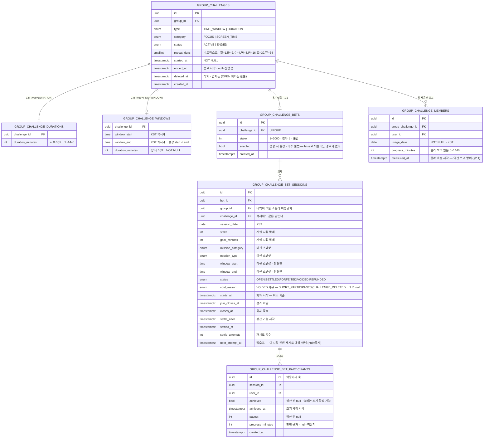
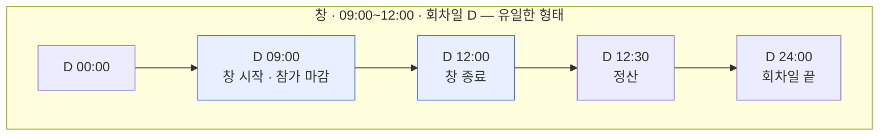
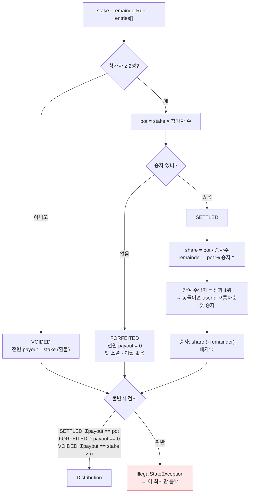
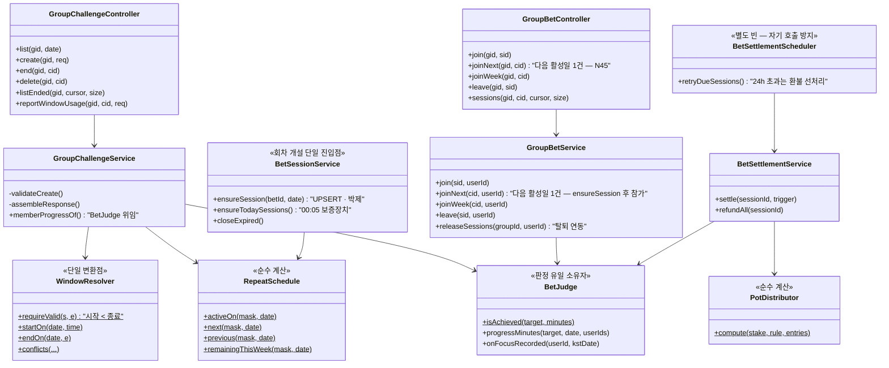

# 챌린지 — 상세 설계 (Low Level Design)

> 스키마 · API 계약 · 판정 커널 · 분배 엔진 · 클래스 배치. **구현이 직접 참조하는 문서**다.
>
> **문서 지위**: to-be. 2026-08-08 백지 재정의 정책([`policy.md`](./policy.md)) 기준으로 다시 썼다.
> 현행 코드와의 차이·전환 과제는 `policy.md` §9가 정본이다.

---

## 1. 데이터 스키마

### 1.1 ER



**`GROUP_CHALLENGE_MEMBERS`에서 사라지는 것**: `is_achieved` · `achieved_at` · `deleted_at`.
갱신하는 코드가 없던 GROMO-561 시절 잔재다. 이 테이블은 **클라 보고 원본만** 담는다.

**`repeat_days` 비트마스크** — `ISO-8601` 요일 번호(월=1…일=7)를 `1 << (dow - 1)`로 접는다.
평일은 `0b0011111 = 31`, 매일은 `127`. `0`은 저장 불가(CHECK).

### 1.2 제약·인덱스

| 대상 | 제약 | 목적 |
|---|---|---|
| `group_challenges` | `CHECK (repeat_days BETWEEN 1 AND 127)` | 요일 하나는 반드시 |
| `group_challenges` | `INDEX (group_id) WHERE status='ACTIVE' AND deleted_at IS NULL` | 활성 목록 조회 · 상한 검사 |
| `group_challenges` | `UNIQUE (group_id, category) WHERE type='DURATION' AND status='ACTIVE' AND deleted_at IS NULL` | 하루형 카테고리당 1개 — check-then-insert 레이스의 **진짜** 방어선 |
| `group_challenge_durations` | `CHECK (duration_minutes BETWEEN 1 AND 1440)` | 하루보다 긴 목표는 달성 불가 |
| `group_challenge_windows` | `CHECK (duration_minutes > 0)` | 목표 필수 |
| `group_challenge_windows` | `CHECK (window_start < window_end)` | 0길이 제거 **+ 자정 걸침 금지** — 회차가 요일 경계를 넘지 않는다는 것을 DB가 보증한다 |
| `group_challenge_members` | `UNIQUE (group_challenge_id, user_id, usage_date)` · `usage_date NOT NULL` | 날짜별 보고 1행 (NULL이면 유니크가 안 걸린다) |
| `group_challenge_bets` | `UNIQUE (challenge_id)` | 챌린지당 내기 1개 |
| `group_challenge_bets` | `CHECK (stake BETWEEN 1 AND 3000)` | **상한을 DB가 강제한다** (서비스 상수만으로는 우회 경로가 생긴다) |
| `group_challenge_bet_sessions` | `UNIQUE (bet_id, session_date)` | 회차 중복 개설 방어 |
| `group_challenge_bet_sessions` | `CHECK (stake BETWEEN 1 AND 3000)` | 박제값도 동일 제약 |
| `group_challenge_bet_sessions` | `INDEX (status, settle_after, next_attempt_at)` | 정산 대상 스캔 (백오프 포함) |
| `group_challenge_bet_sessions` | `INDEX (group_id, session_date)` | 카드 조립 |
| `group_challenge_bet_participants` | `UNIQUE (session_id, user_id)` | 중복 참가 방어 |
| `currency_transactions` | `UNIQUE (idempotency_key)` | 이중 차감/지급 최후 방어 |
| `user_wallets` | `@Version` 낙관락 | 잔액 정합 |

**`stake` 상한 3,000의 출처는 policy §C1(N30)이다.** 앱 프리셋 칩(300/900/1,500/3,000)은 이 상한의
10·30·50·100%로 정의되므로, 상한을 바꾸면 **DB CHECK 2곳과 프리셋이 함께** 움직인다. 서비스 상수만
고치고 CHECK를 두면 둘이 갈린다.

**회차 유니크가 단순해졌다.** 기존 `WHERE status <> 'CANCELED'` 부분 유니크는 "취소된 내기는
없던 일"이라는 규칙 때문이었는데, 개설 개념이 사라지면서 회차는 하루 1개만 만들어진다.
전체 유니크로 충분하다.

**회차는 자기 완결적이어야 한다.** `group_id` · `challenge_id` · 미션 스냅샷(카테고리·방식·
목표분·창 시각)까지 복사해 두는 이유는 하나다 — **챌린지가 삭제돼도 「그룹 챌린지 내역」의
한 줄이 조인 없이 온전히 읽혀야 한다.** 정규화를 깨는 대가로 이력의 불멸성을 산다.

### 1.3 마이그레이션 계획

```mermaid
flowchart LR
    V1["V1 baseline"]
    V2["V2 mission_type→type"]
    V5["V5 CTI 분리"]
    V19["V19 bets · participants"]
    V20["V20 FORFEITED·창 목표분"]
    V28["V28 부분 유니크·CHECK"]
    V29["V29 정산 근거 스냅샷"]
    VN1["Vn+1<br/>repeat_days · started_at · ended_at<br/>기존 행은 127(매일)·created_at 백필"]
    VN2["Vn+2<br/>sessions 테이블 신설 (미션 스냅샷 포함)<br/>기존 bets → bets(설정) + sessions(회차) 분해"]
    VN3["Vn+3<br/>window를 time 타입으로<br/>KST 벽시계 추출 백필<br/>CHECK (start &lt; end) 추가"]
    VN4["Vn+4<br/>잔재 컬럼 제거<br/>is_achieved·achieved_at·deleted_at<br/>usage_date NOT NULL"]
    VN5["Vn+5<br/>stake CHECK 상한<br/>통계 일자 KST 재계산"]

    V1 --> V2 --> V5 --> V19 --> V20 --> V28 --> V29 --> VN1 --> VN2 --> VN3 --> VN4 --> VN5
```



**전환 원칙 — forward-only.** dev DB는 리셋 가능하므로 컷오버 데이터 불일치는 백필 대신
**수용 + 문서화**한다. 다만 `Vn+2`(내기 분해)와 `Vn+5`(통계 일자 재계산)는 **prod에 돈 이력이
있으면 백필이 필수**다 — 배포 시점에 prod 데이터 유무를 먼저 확인한다.

**`Vn+3` 백필 주의**: 기존 `window_start_at`은 `timestamptz`인데 "KST 벽시계 시각만 유효,
날짜는 무의미"라는 규약으로 저장돼 있다. `(window_start_at AT TIME ZONE 'Asia/Seoul')::time`으로
추출한다 — UTC로 읽으면 정확히 9시간 어긋난다(GROMO-1100과 같은 함정).

**`Vn+3`의 `CHECK (window_start < window_end)`는 기존 행을 깨뜨릴 수 있다.** 걸침이 허용되던
시절에 만들어진 `start ≥ end` 행(예: `22:00~01:00`)이 남아 있으면 CHECK 추가가 실패한다.
dev는 forward-only로 리셋하면 되지만 **prod에 그런 행이 있으면 먼저 정리**해야 한다 —
배포 전에 `SELECT count(*) FROM group_challenge_windows WHERE window_start >= window_end`로
확인한다.

---

## 2. API 계약

베이스: `/api/v1` · 인증: JWT(`@LoginUser UUID userId`)

### 2.1 챌린지

#### `GET /groups/{groupId}/challenges`

| 파라미터 | 타입 | 필수 | 설명 |
|---|---|---|---|
| `date` | `LocalDate` | ✗ | 클라의 **KST 오늘**(`todayStrKst()`). 없으면 `memberProgress`·`bet.session` 미계산 |

**200** — `GroupChallengeResponse[]` (`createdAt` DESC)

```jsonc
[{
  "id": "uuid",
  "missionType": "TIME_WINDOW",          // TIME_WINDOW | DURATION
  "missionCategory": "FOCUS",            // FOCUS | SCREEN_TIME
  "durationMinutes": 90,                 // DURATION=하루 목표, TIME_WINDOW=창 내 목표
  "repeatDays": ["MON", "WED", "FRI"],   // ISO 요일 · 항상 1개 이상
  "windowStart": "09:00",                // KST 벽시계, TIME_WINDOW만
  "windowEnd": "12:00",
  "status": "ACTIVE",
  "startedAt": "2026-08-01T02:11:00Z",
  "activeToday": true,                   // 오늘이 repeatDays에 있나
  "nextSessionAt": "2026-08-12T00:00:00Z", // **오늘을 제외한** 다음 활성일의 회차 시작. null 없음
  "nextSessionJoined": false,            // 다음 회차를 이미 예약했나 (N45 버튼 상태 — 내기 켜짐일 때만 의미)
  "canParticipate": true,                // FOCUS면 항상 true, SCREEN_TIME은 권한 여부
  "memberProgress": [                    // null = 미계산 (date 없음 · 비활성 요일)
    { "userId": "uuid", "nickname": "민지",
      "progressMinutes": 32,             // null = SCREEN_TIME 미집계 (0분 아님)
      "achieved": false }                // null = 판정 불가
  ],
  "bet": {                               // null = 내기 꺼짐 / 필드 부재 = 구서버
    "enabled": true,
    "stake": 30,                         // 참가비 (불변 — 수정 API 없음)
    "session": {                         // null = 오늘 회차 없음 (비활성 요일)
      "sessionId": "uuid",
      "sessionDate": "2026-08-10",
      "stake": 30,                       // 이 회차에 박제된 참가비
      "goalMinutes": 90,                 // 이 회차에 박제된 목표
      "pot": 90, "status": "OPEN",
      "startsAt": "2026-08-10T00:00:00Z",   // 회차 시작 — 취소 기준
      "joinClosesAt": "2026-08-10T00:00:00Z", // 참가 마감
      "myLeaveDeadlineAt": "2026-08-10T14:05:00Z", // 내 취소 마감 · 미참여면 null
      "closesAt": "2026-08-10T03:00:00Z",
      "myJoined": true, "myAchievedNow": false,
      "participants": [
        { "userId": "uuid", "nickname": "민지",
          "progressMinutes": 52,         // 하루형만 — 참가 시트의 진행분 공개용
          "achieved": null }
      ]
    }
  },
  "lastSettledSession": {                // null = 정산된 회차 없음 — 카드 "지난 결과" 표시용
    "sessionId": "uuid",
    "sessionDate": "2026-08-08", "stake": 30, "pot": 90,
    "status": "SETTLED",                 // SETTLED | FORFEITED | VOIDED | REFUNDED
    "voidReason": null,                  // VOIDED만 — SHORT_PARTICIPANTS | CHALLENGE_DELETED
    "goalMinutes": 90,
    "myJoined": true,
    "myAchieved": true, "myPayout": 45,  // myJoined=false면 둘 다 null
    "results": [{ "userId": "uuid", "nickname": "민지",
                  "achieved": true, "payout": 45,
                  "progressMinutes": 102 }]
  },
  "mySettledSessions": [                 // 결과 모달 큐 — 내가 참가한 정산 완료 회차,
    /* lastSettledSession과 같은 요소 스키마 */  // 회차일 내림차순 · 최근 30일 · 최대 10건
  ]
}]
```

> **`lastSettledSession` vs `mySettledSessions`**: 전자는 카드의 "지난 결과 + 정산 근거"
> 표시용 **그룹 기준 최신 1건**, 후자는 결과 모달 큐용 **내 참가 회차 목록**이다. 최신 1건으로
> 모달을 만들면 ① 내가 참가 안 한 최신 회차가 그 앞의 내 결과를 가리고 ② 앱을 안 연 사이
> 정산된 내 회차 여럿이 1건으로 접힌다. 1회 가드는 앱 로컬 seen set(`sessionId`)이 담당하고,
> 서버는 seen 상태를 모른다. **최근 30일·최대 10건 초과분은 버린다** — 한 달 넘게 안 본
> 결과까지 모달로 줄 세우지 않는다(수용). 30일 경계는 앱 seen 마커 프루닝(60일 — IA §8)보다
> **짧아야 한다**: 서버가 마커 수명보다 오래된 회차를 계속 실어주면, 프루닝된 회차가 이미 본
> 모달로 재생된다.

> **`activeToday` / `nextSessionAt` 계약**: 둘은 **배타가 아니라 보완**이다.
> `nextSessionAt`은 항상 **오늘을 제외한** 다음 활성일을 가리킨다(`RepeatSchedule.next()`).
> 오늘 회차의 정보는 `bet.session`에 있고, 내기가 꺼져 있으면 앱이 `windowStart`로 직접 만든다.
> 하루형은 회차 시작이 자정이라 "오늘 회차 시작"이 항상 과거다 — 이 분리가 없으면 오늘 도는
> 챌린지가 "다음 회차 내일"로 잘못 표시된다.

> **직렬화 계약**: `bet` · `bet.session` · `goalMinutes` · `results[].progressMinutes` ·
> `participants[].progressMinutes`에 **`@JsonInclude(NON_NULL)`을 붙이면 안 된다.**
> 앱이 `undefined`(구서버) ↔ `null`(값 없음) ↔ `0`(진짜 0분)을 3상으로 구분한다.
> 필드가 통째로 사라지면 3상이 2상으로 무너진다.

> **탈퇴 멤버 가시성**: 라이브 뷰(`memberProgress` · `session.participants`)는 탈퇴 멤버를
> **필터**하고, 정산 명단(`lastSettledSession`·`mySettledSessions`의 `results`)은 명단·인원·`pot`을 보존하되 닉네임만
> **"탈퇴한 사용자"** 로 치환한다. **단 탈퇴자가 시작된 회차의 참가자면 라이브에서도 보인다** —
> 정산 대상으로 남기 때문이다(정책 C8).

> **요청자 검증**: `readOnly` 트랜잭션이므로 `findByIdAndIsDeletedFalse`(무락 활성 필터).
> Postgres가 `readOnly`에서 `FOR SHARE`를 거절하므로 공유 락을 쓸 수 없다.

#### `POST /groups/{groupId}/challenges` — 그룹장 전용

```jsonc
{
  "missionCategory": "FOCUS",
  "missionType": "TIME_WINDOW",
  "repeatDays": ["MON", "WED", "FRI"],   // 필수 · 1개 이상
  "durationMinutes": 90,
  "windowStart": "09:00",                // TIME_WINDOW만
  "windowEnd": "12:00",
  "bet": { "enabled": true, "stake": 30 } // 선택
}
```

**201** `{ "challengeId": "uuid" }`

**검증 순서 = 에러 우선순위**

| 순 | 검사 | 에러 |
|---|---|---|
| 1 | 그룹 OWNER인가 — **그룹 행 `FOR UPDATE`**(생성 직렬화) · 요청자 유저 행은 801 규약대로 `FOR SHARE` | `CHALLENGE_FORBIDDEN` 403 |
| 2 | `repeatDays` 비어있지 않은가 | `CHALLENGE_REPEAT_DAYS_REQUIRED` 400 |
| 3 | 활성 4개 미만인가 | `CHALLENGE_LIMIT_EXCEEDED` 409 |
| 4 | 하루형이면 같은 카테고리 활성 챌린지 없는가 | `CHALLENGE_ALREADY_EXISTS` 409 |
| 5 | 창형: **`시작 < 종료`** (자정 걸침 금지 — `22:00~01:00` 거부) | `INVALID_MISSION_PARAMS` 400 |
| 6 | 창형: `0 < 목표 ≤ 창 길이` — **FOCUS는 `목표 > 5분(관용치)` 추가** | `INVALID_MISSION_PARAMS` 400 |
| 7 | 창형 SCREEN_TIME: 목표가 15분 배수 | `CHALLENGE_GOAL_NOT_ALIGNED` 400 |
| 8 | 창형: 기존 창과 겹치지 않는가 (§3.5) | `CHALLENGE_WINDOW_OVERLAP` 409 |
| 9 | 내기 켬: `1 ≤ stake ≤ 3000` | `BET_INVALID_STAKE` 400 |

> **왜 생성만 배타 락인가**: 활성 4개 상한(3)·창 겹침(8)은 **그룹 전역** 불변식이라 공유 락으로는
> 못 지킨다 — 동시 생성 2건이 둘 다 "3개네" 하고 통과하면 5개째가 들어온다(부분 유니크 제약은
> 하루형 카테고리 중복(4)만 막는다). 그룹 행 `FOR UPDATE`로 생성을 직렬화한다. 생성은 그룹장
> 전용의 드문 동작이라 경합 비용은 없다시피 하다. 조회는 기존대로 무락(§2.1).
>
> **왜 목표 하한이 관용치인가**: 창형 FOCUS 판정이 `분 ≥ 목표 − 5`(§3.2)라서 목표 1~5분이면
> 문턱이 0 이하 — **0분도 자동 달성**이 된다. 내기라면 전원이 "이미 달성" 가드(§3.3)에 걸려
> 아무도 참가하지 못한다. 관용치보다 큰 목표만 받는다.

**생성 직후 당일 회차** — 오늘이 활성 요일이고 아직 참가 가능한 시각(하루형: 항상 / 창형: 창
시작 전)이면 **생성 트랜잭션 안에서 `ensureSession(betId, 오늘)`을 함께 수행**한다. 회차 개설
경로가 00:05 스케줄러와 `join-week` lazy뿐이면, 00:05 이후 만든 챌린지는 다음 날까지 오늘
회차가 없다 — 카드에 `sessionId`가 비어 단건 참여가 막히고, 남은 회차가 오늘뿐이면
`join-week` 버튼 숨김 규칙(§2.2)과 겹쳐 **참여 경로가 0**이 된다. (HLD §3.2)

#### ~~`PATCH /groups/{groupId}/challenges/{challengeId}`~~ — **만들지 않는다**

챌린지는 만들면 통째로 불변이다(policy §A7). 목표분도 참가비도 바꿀 수 없다. 바꾸려면
삭제하고 새로 만든다 — 삭제에 조건이 없으므로 동선이 성립한다.

**`bet.enabled`를 뒤집는 엔드포인트도 만들지 않는다**(policy §A7 · N26). 내기를 끄는 순간 이미
참가비를 낸 OPEN 회차의 돈을 어떻게 할지가 남는데, 그건 `DELETE`가 하는 일(무효화 + 전원 환불)과
정확히 같다. 같은 결과에 경로를 둘 두면 멱등키·잠금 순서·환불 1회 불변식을 두 벌 검증해야 한다.
끄려면 `DELETE` 후 내기 없이 재생성한다.

#### `POST /groups/{groupId}/challenges/{challengeId}/end` — 그룹장 전용

**204**. `status=ENDED`, `ended_at=now()`. **챌린지 행 `FOR UPDATE`를 먼저 잡고** OPEN 회차를
검사·전이한다 — 삭제와 같은 직렬화다.

| 조건 | 에러 |
|---|---|
| OPEN 회차 존재 (**예약된 미래 회차 포함**) | `CHALLENGE_END_BLOCKED` 409 |
| 이미 ENDED | 멱등 — 204 |

> **왜 종료도 배타 락인가**: 참여 경로의 `ensureSession`은 챌린지 행 `FOR SHARE`로 활성을 확인한
> 뒤 회차·참가를 넣는다(§2.2). 종료가 락 없이 돌면 그 **미커밋 회차를 못 보고** OPEN 없음으로
> 판정해 `ENDED`를 확정하고, 뒤이어 참가가 커밋돼 **종료된 챌린지에 참가비가 걸린다**. 삭제는
> 이미 `FOR UPDATE`로 막았는데(§2.1) 종료만 빠져 있으면 같은 구멍이 한쪽에 남는다 — 다만 종료
> 쪽은 환불 루프가 없어 결과가 더 나쁘다(무효화도 환불도 안 된 고아 회차).

> 누군가 "이번 주 전부"로 금요일까지 예약해 두면 그룹장은 **금요일 정산이 끝나야** 종료할 수
> 있다. 남의 돈이 걸린 회차를 그룹장이 접을 수 없게 하는 것이 맞다. 에러 문구가 언제까지
> 기다려야 하는지 말한다 — <code>8/14(금) 회차가 끝나야 종료할 수 있어요</code>

#### `DELETE /groups/{groupId}/challenges/{challengeId}` — 그룹장 전용

**조건 없이 언제든 가능하다.** 진행 중인 회차가 있으면 무효화하고 전원에게 환불한다.

```java
@Transactional
void deleteChallenge(UUID groupId, UUID challengeId, UUID ownerId) {
    requireOwner(groupId, ownerId);
    var ch = challengeRepo.findByIdForUpdate(challengeId)     // 삭제된 행 포함 조회
                          .orElseThrow(CHALLENGE_NOT_FOUND);
    if (ch.isDeleted()) return;      // 이미 삭제됨 — 멱등 204 (활성만 조회하면 재시도가 예외로 빠진다)

    // ① OPEN 회차를 id 오름차순으로 전부 잠근 뒤 무효화 + 환불
    for (var s : sessionRepo.findOpenByChallengeIdForUpdate(challengeId)) {   // ORDER BY id
        voidAndRefund(s, VoidReason.CHALLENGE_DELETED);   // status=VOIDED + 사유 기록,
    }                                                     // 멱등키 session:{sid}:refund:{participantId}
    // ② 정산이 끝난 회차는 건드리지 않는다 (B8 정산 불가역)
    ch.softDelete();                 // deleted_at = now()
}
```

> **lazy 개설과의 직렬화**: 참여 경로(`join-week`의 `ensureSession`, 단건 참여의 회차 조회)는
> **챌린지 행 `FOR SHARE` + 활성 재확인** 후에만 진행한다 (§2.2). 이 락이 없으면 join-week이
> 챌린지를 활성으로 읽고 아직 커밋하기 전에 삭제가 먼저 커밋될 수 있다 — 삭제의 OPEN 회차
> 스캔(`FOR UPDATE`)은 **미커밋 lazy 회차를 볼 수 없어** 환불 루프에서 빠지고, 뒤이어 커밋된
> 참가는 삭제된 챌린지에 참가비가 걸린 **고아 OPEN 회차**가 된다. 챌린지 행에서
> `FOR UPDATE`(삭제) × `FOR SHARE`(참여)가 충돌해 직렬화되고, 참여 쪽은 락 획득 후 활성
> 재확인으로 삭제 선행 커밋을 감지한다.

**204**. 응답 없음. 앱은 삭제 후 목록을 다시 받는다.

| 조건 | 결과 |
|---|---|
| OPEN 회차 있음 | **무효화 + 전원 환불** 후 삭제 |
| SETTLED / FORFEITED 회차 있음 | 그대로 둔다 — 이미 확정된 정산은 되돌리지 않는다 |
| 이미 삭제됨 | 멱등 — 204 |

> **`CHALLENGE_DELETE_BLOCKED`는 폐기된다.** 돈 기록 보존은 삭제를 막아서가 아니라
> **이력의 소유자를 그룹으로 옮겨서** 달성한다(§A9). 회차 행에 미션 스냅샷이 박제돼 있으므로
> 챌린지가 사라져도 내역 한 줄이 온전하다.

> **잠금 순서 준수**: 회차 → 지갑, 회차는 `id` 오름차순, 지갑은 `userId` 오름차순.
> 삭제는 여러 회차·여러 지갑을 한 트랜잭션에서 만지므로 교차 데드락 위험이 가장 큰 경로다.

**경고 확인 단계는 앱이 진다** (PRD FR-12-1 · IA §2.5). 진행 중(OPEN 회차 있음) 삭제에는 확인이
한 단계 더 붙고 그 시트가 **사라지는 날짜·참여 인원·돌아가는 적립금**을 수치로 보여준다.

| 축 | 규칙 |
|---|---|
| 서버 게이트 | **없다** — `DELETE`는 확인 단계 수와 무관하게 조건 없이 받는다. 경고는 오탭 방어이지 권한 검사가 아니다 |
| 수치 출처 | OPEN 회차의 `sessionDate` · `participants.length` · `pot` |
| **미해결** | 카드 조회의 `bet.session`은 **오늘 회차 1건**뿐이라 주간 일괄 참여로 예약된 미래 OPEN 회차가 덮이지 않는다. 프리플라이트를 두는지 카드 응답을 늘리는지 미정 (PRD §4.0.7 K11) |

#### `GET /groups/{groupId}/challenge-history`

**그룹 단위** 회차 내역. 챌린지 삭제와 무관하게 조회된다.

| 파라미터 | 필수 | 설명 |
|---|---|---|
| `cursor` | ✗ | 직전 페이지 마지막 `sessionId`(UUID). 서버가 **`(session_date, id)` 튜플**로 해석해 keyset을 잇는다 — 그룹 전체 조회라 같은 날짜에 회차가 최대 4개, 날짜만으로 자르면 페이지 경계의 같은 날 나머지가 스킵(또는 중복)된다 |
| `size` | ✓ | 범위 밖이면 `INVALID_PAGE_REQUEST` 400 |
| `challengeId` | ✗ | 특정 챌린지로 필터 (챌린지별 이력 화면이 이걸 쓴다) |

```jsonc
{
  "content": [{
    "sessionId": "uuid",
    "sessionDate": "2026-08-10",
    "challengeId": "uuid",              // 삭제된 챌린지여도 값은 있다
    "challengeDeleted": true,           // 앱이 "삭제된 챌린지" 배지를 단다
    "missionCategory": "FOCUS",         // ↓ 미션 스냅샷 — 조인 없이 읽는다
    "missionType": "TIME_WINDOW",
    "goalMinutes": 90,
    "windowStart": "09:00", "windowEnd": "12:00",
    "stake": 30, "pot": 90, "status": "SETTLED",
    "voidReason": null,                 // VOIDED만 — SHORT_PARTICIPANTS | CHALLENGE_DELETED
                                        // (사유 없이 VOIDED 하나면 "인원 부족" 카피가 삭제 건까지 거짓말한다)
    "myPayout": 45, "myAchieved": true, "myProgressMinutes": 102,
    "achievedCount": 2, "participantCount": 3
  }],
  "size": 20, "hasNext": true, "nextCursor": "uuid"
}
```

**미션 스냅샷이 없으면 이 응답을 만들 수 없다.** 챌린지 행이 사라진 뒤 `challenge_id`로 조인하면
빈 값이 나온다 — 그래서 §1.1에서 회차에 카테고리·방식·목표·창 시각을 복사해 둔다.

#### `PUT /groups/{groupId}/challenges/{challengeId}/window-usage` — 멤버 **+ 시작된 회차의 참가자**

```jsonc
{ "usageDate": "2026-08-10", "progressMinutes": 24, "measuredAt": "2026-08-10T14:03:00Z" }
```

**204**. upsert 멱등 — 단 **`measuredAt`이 저장값보다 오래된 보고는 조용히 204로 무시**한다
(`measured_at` 컬럼 저장·비교). 클라에 재시도 큐는 없지만(실패 시 다음 sync가 **그 시점
최신값**을 다시 보고 — `screentimeSync.ts`) 역전은 큐 없이도 생긴다: ① 포그라운드 sync와
사일런트 푸시 트리거 sync(§6.2)가 경합해 낮은 값 요청이 나중에 처리되거나 ② 타임아웃으로
앱은 실패 처리했지만 요청이 서버에 지연 도착하는 경우. "마지막 도착이 이긴다"로 두면
**정산 결과가 네트워크 도착 순서에 좌우**된다 — 돈 경로다.
서버는 범위(0~1440)만 검증한다(클라 신뢰).
**비활성 요일의 보고는 무시**한다 (`CHALLENGE_NOT_ACTIVE_TODAY` 대신 조용히 204 — 클라가
요일을 잘못 계산해도 에러가 나면 안 된다).

> **탈퇴자도 시작된 회차에는 보고할 수 있어야 한다 (N43).** C8·N19에 따라 **시작된 회차의
> 참가자는 탈퇴해도 정산 대상으로 남는데**, 이 엔드포인트가 현재 그룹 멤버만 받으면 그 사람은
> 마지막 창 사용분을 **영영 보낼 수 없다**. SCREEN_TIME은 미보고 = 미달성(§3.2)이라 목표를
> 지켰어도 **패배로 확정**된다 — 돈이 걸린 채로.
>
> | 축 | 규칙 |
> |---|---|
> | 서버 권한 | 그룹 멤버 **또는** 해당 챌린지의 **OPEN 회차 참가자**면 받는다 |
> | 앱 대상 탐색 | `getMyGroups()` → 그룹별 ACTIVE 챌린지 순회만으로는 못 찾는다(탈퇴 즉시 목록에서 사라지고, 종료된 챌린지의 진행 중 회차도 빠진다). **내 OPEN 회차 목록**을 축으로 대상을 만든다 |
> | 종료 시점 | **`closes_at`이 아니라 정산까지** 열어 둔다 — 회차가 `OPEN`인 동안(즉 `settle_after` 경과 후 정산이 끝나기 전까지 포함) 받는다. 정산 완료(`status != OPEN`) 후 도착분은 무시(B8 불가역) |
>
> **왜 `closes_at`에서 자르면 안 되나**: 창형 `settle_after`는 `closes_at + 30분`이고, 그
> 그레이스는 애초에 **늦게 확정되는 창 데이터를 받으려고** 둔 것이다(N12). 게다가 사일런트
> 푸시가 `settle_after − 15분`에 앱을 깨워 마지막 보고를 시키는데(FR-22), 대상에서 이미
> 빠졌으면 그 flush가 무의미해진다. 특히 탈퇴자는 그룹 기반 폴백이 없어 값이 `null`로 남고
> **미보고 = 미달성**으로 정산된다 — N43이 막으려던 바로 그 결과다.

### 2.2 회차 참여

| 메서드 | 경로 | 동작 |
|---|---|---|
| `POST` | `/groups/{gid}/sessions/{sid}/join` | 회차 참여 (즉시 차감) |
| `POST` | `/groups/{gid}/challenges/{cid}/join-next` | **다음 활성일 회차 1건** 참여 (N45) — 회차를 lazy 생성(`ensureSession`)한 뒤 참가. 비활성 요일 카드의 참여 버튼이 쓴다 |
| `POST` | `/groups/{gid}/challenges/{cid}/join-week` | 이번 주 남은 회차 전부 — **회차를 lazy 생성**(`ensureSession`)한 뒤 참가. 총액 선검사 · 전부 성공 or 전부 실패 |
| `DELETE` | `/groups/{gid}/sessions/{sid}/participation` | 참여 취소 (회차 시작 전) |
| `GET` | `/groups/{gid}/challenge-history?challengeId=` | 회차 이력 — **그룹 단위** 엔드포인트의 필터 |

**`join-next` 응답**: `{ "sessionId": "uuid", "sessionDate": "2026-08-12", "stake": 30 }`

- 대상은 `RepeatSchedule.next(mask, 오늘)` — **오늘을 제외한** 다음 활성일 1건. 카드의
  `nextSessionAt`과 같은 날짜다(같은 함수를 탄다 — 화면과 결제 대상이 어긋나면 안 된다).
- **오늘 회차는 이 경로로 참여하지 않는다.** 오늘은 `bet.session.sessionId`가 있으므로 기존
  단건 `join`을 쓴다 — 경로가 겹치면 "지금 내는 돈이 오늘 것인지 다음 것인지"가 흐려진다.
- 회차 행이 없으면 `ensureSession`으로 만든 뒤 참가한다(`join-week`과 같은 진입점).
  **삭제·종료와의 직렬화**(챌린지 행 `FOR SHARE` + 활성 재확인)도 동일하게 적용된다.
- 이미 예약했으면 `BET_ALREADY_JOINED` 409 — 카드가 `nextSessionJoined`로 버튼을 미리 잠근다.
- **무위험 참가 검사는 하지 않는다** — 미래 회차라 진행분이 없어 "이미 달성/초과"가 성립 불가
  (§2.2 미래 회차 규칙과 같다).
- 취소는 예약분 규칙 그대로 — **회차 시작까지** 가능하다(§2.2 `leaveDeadline`).

**`join-week` 응답**: `{ "joined": [{"sessionId": "...", "sessionDate": "..."}], "totalStake": 90 }`

- 대상은 `RepeatSchedule.remainingThisWeek(mask, 오늘)` — 오늘 포함, 그 주(월~일)의 남은 활성일.
  단 **배치에 담는 건 "지금 참여 가능한 미참가 회차"만이다** (N39): 오늘 회차가 이미 참가
  마감됐거나(창 시작 후) 자격 가드(§3.3)에 걸리면 **조용히 건너뛴다**. 전부-성공-or-전부-실패에
  참여 불가능한 오늘을 그대로 담으면, 수요일 창 시작 후의 수/금 예약이 수요일에서 터져
  **금요일 예약까지 롤백**된다 — "이미 참가는 스킵"과 같은 원리다.
- `ensureSession`은 **챌린지 행 `FOR SHARE` + 활성 재확인** 후에만 회차를 만든다(단건 참여의
  회차 조회도 동일) — 삭제와의 직렬화는 §2.1 DELETE 참조.
- **남은 회차가 1개 이하면 앱이 버튼을 숨긴다** (단건 참여와 같아져 의미가 없다).
- **미래 회차에는 무위험 참가 검사를 하지 않는다** — 진행분이 없어 "이미 달성/초과"가 성립 불가.
  오늘 회차에만 적용한다.
- 이미 참가한 회차는 조용히 건너뛴다(`BET_ALREADY_JOINED`를 던지지 않는다) — 부분 예약 후
  다시 누르는 것이 정상 동선이다.

**이력 요청**: `?cursor={sessionId}&size=20` → `GroupBetHistorySliceResponse`
(`{ content, size, hasNext, nextCursor }`)

- `cursor`는 **직전 페이지 마지막 항목의 `sessionId`(UUID)** — 날짜가 아니다. 서버가 그 회차의
  `(session_date, id)` 튜플로 해석해 keyset을 잇는다 (`ORDER BY session_date DESC, id DESC` +
  튜플 비교 — 같은 날짜 동률의 경계 스킵/중복 방지). 첫 페이지는 생략.
- `size`는 **필수**. 범위 밖이면 `INVALID_PAGE_REQUEST` 400.
- **종료된 챌린지도 조회된다** — 이력은 영구 보존이다.

#### 에러 코드 전량

| 코드 | HTTP | 조건 | 경로 |
|---|---|---|---|
| `BET_INVALID_STAKE` | 400 | stake ∉ [1, 3000] | 생성 |
| `BET_SESSION_NOT_FOUND` | 404 | 회차 없음 / 그룹 불일치 | 참여·취소 |
| `BET_SESSION_CLOSED` | 409 | `now ≥ join_closes_at` (참가 마감) | 참여 |
| `BET_ALREADY_JOINED` | 409 | 이미 참가 | 참여 |
| `BET_ALREADY_ACHIEVED` | 409 | **FOCUS** 이미 달성 | 참여 |
| `BET_ALREADY_FAILED` | 409 | **SCREEN_TIME** 이미 목표 초과 | 참여 |
| `BET_NOT_OPEN` | 409 | 회차가 이미 종료 / CAS 레이스 패배 | 참여·취소 |
| `BET_NOT_JOINED` | 409 | 참가자 아님 | 취소 |
| `BET_LEAVE_CLOSED` | 409 | 취소 마감 경과 — 시작 전 참가는 회차 시작, 시작 후 참가는 참가+5분(회차 종료 상한) | 취소 |
| `BET_INSUFFICIENT_BALANCE` | 409 | 잔액 부족 (join-week은 총액 기준) | 참여 |
| `CHALLENGE_FORBIDDEN` | 403 | 그룹장 아님 | 생성·종료·삭제 |
| `CHALLENGE_REPEAT_DAYS_REQUIRED` | 400 | 요일 미선택 | 생성 |
| `CHALLENGE_LIMIT_EXCEEDED` | 409 | 활성 4개 초과 | 생성 |
| `CHALLENGE_ALREADY_EXISTS` | 409 | 하루형 카테고리 중복 | 생성 |
| `CHALLENGE_GOAL_NOT_ALIGNED` | 400 | 창 SCREEN_TIME 목표가 15분 배수 아님 | 생성 |
| `CHALLENGE_WINDOW_OVERLAP` | 409 | 요일 ∩ 시간대 겹침 or 간격 < 15분 | 생성 |
| `CHALLENGE_END_BLOCKED` | 409 | OPEN 회차 존재 | 종료 |
| `INVALID_MISSION_PARAMS` | 400 | 창 파라미터 무효 | 생성 |
| `INVALID_PAGE_REQUEST` | 400 | `size` 범위 밖 | 이력 조회 |
| `GUEST_FORBIDDEN` | 403 | 게스트 | 전 경로 |
| `CONCURRENT_UPDATE` | 409 | 낙관락 충돌 → 재시도 안내 | 전 경로 |

**검증 순서 계약 (취소)**: `참가자 여부 → OPEN → 취소 가능 시각`. 순서가 바뀌면 앱이 잘못된
문구를 띄운다.

```java
static final Duration LEAVE_GRACE = Duration.ofMinutes(5);

/**
 * 취소 마감 — 시작 전 참가는 회차 시작까지, 시작 후 참가(하루형)만 참가+5분 유예(종료 상한).
 * max(시작, 참가+5분)으로 쓰면 창 시작 직전 참가자가 시작 후 5분까지 취소할 수 있어
 * "시작 후 환불 없음" 불변식이 깨진다 — 창 초반을 보고 발을 빼는 각도가 생긴다.
 */
static Instant leaveDeadline(BetSession s, BetParticipant p) {
    if (p.getCreatedAt().isBefore(s.getStartsAt())) return s.getStartsAt();
    Instant graceEnd = p.getCreatedAt().plus(LEAVE_GRACE);
    return graceEnd.isBefore(s.getClosesAt()) ? graceEnd : s.getClosesAt();
}
```

| 회차 | `starts_at` | 당일 참가자의 취소 창 |
|---|---|---|
| 하루형 | `session_date` 00:00 KST | **참가 후 5분** (시작은 이미 지났다) |
| 창형 | 창 시작 (= `join_closes_at`) | 창 시작까지 — 참가가 그 전에만 가능하므로 항상 열려 있다 |
| 예약분 (미래 회차) | 그 날짜의 시작 | 회차 시작까지 (며칠) |

**`min(..., closes_at)` 상한이 필요한 이유**: 23:58에 참가하면 유예가 00:03까지인데, 그 사이
하루형 회차가 종료되고 FOCUS는 자정 즉시 정산이 돈다. 정산 중 취소가 들어오면 CAS와 경합한다.
회차 종료에서 잘라 그 창을 없앤다.

**응답에 `myLeaveDeadlineAt`을 실어 앱이 카운트다운**한다. 서버 시각 기준이므로 앱이
`created_at + 5분`을 자체 계산하지 않는다 — 기기 시계가 틀어지면 버튼이 어긋난다.

**폐기되는 코드**: `BET_ALREADY_EXISTS` · `BET_CANCEL_FORBIDDEN` · `BET_CANCEL_HAS_OTHERS` ·
`BET_CHALLENGE_INACTIVE` · `BET_FOCUS_ONLY`. 개설·취소 개념이 사라지면서 전부 발생 경로가 없어진다.

### 2.3 배치 (관리자 키)

| 경로 | 동작 | 환경 |
|---|---|---|
| `POST /groups/sessions/ensure` | 회차 개설 보증 트리거 (멱등 UPSERT) | 전 환경 |
| `POST /groups/sessions/settle` | 정산 트리거 | **prod 포함** — 감사 로그 필수 |
| `POST /groups/sessions/notify` | 알림 묶음 발송 트리거 | 전 환경 |

에러: `BATCH_KEY_NOT_CONFIGURED`(503) / `BATCH_KEY_INVALID`(403)

> **prod에 정산 트리거를 연다.** 24h 자동 환불이 최후 방어선이지만, 그 전에 손으로 풀 수단이
> 있어야 한다. 호출자·시각·대상 회차를 감사 로그에 남긴다.

---

## 3. 판정 커널

### 3.1 조합 매트릭스

```java
// BetJudge.Target — 판정 대상 + 박제된 목표
record Target(MissionCategory category, MissionType type, int goalMinutes,
              LocalTime windowStart, LocalTime windowEnd) {
    boolean windowed() { return type == TIME_WINDOW; }
}
```

| 조합 | 소스 | 조회 | 달성 | 값 없음의 뜻 |
|---|---|---|---|---|
| FOCUS × DURATION | `daily_focus_stats` | `findByUserIdInAndDate` | `분 ≥ 목표` | 0분 (사실) |
| FOCUS × TIME_WINDOW | `focus_sessions` | `sumOverlapSecondsInWindow` | `분 ≥ 목표 − 5` | 0분 (사실) |
| SCREEN_TIME × DURATION | `daily_screen_time_stats` | `findByUserInAndDate` | `분 ≤ 목표` | **미보고** |
| SCREEN_TIME × TIME_WINDOW | `group_challenge_members` | `findByGroupChallengeIdInAndUsageDate` | `분 ≤ 목표` | **미보고** |

**모든 `date` 키는 KST다.** `CountryZoneResolver`는 이 경로에 등장하지 않는다.
**초→분 변환은 `/ 60` 내림**. 유저·날짜당 1행이지만 중복 시 `Integer::max`로 방어.

> **`sumOverlapSecondsInWindow`는 완료 세션만 계수**한다(`ended_at IS NOT NULL` + 취소·자동
> 마감 status 제외 — 현행 쿼리 관례). 창을 걸쳐 아직 도는 세션은 0분으로 보이므로, **정산은
> 창 겹침 ACTIVE 세션이 남아 있으면 대기**한다 (§5.2 N37).

### 3.2 판정 함수 — 유일한 소유자

```java
public static final int WINDOW_FOCUS_TOLERANCE_MINUTES = 5;

public static boolean isAchieved(Target t, Integer minutes) {
    if (t.category() == SCREEN_TIME) {
        return minutes != null && minutes <= t.goalMinutes();   // 미보고 = 미달성
    }
    int measured = (minutes == null) ? 0 : minutes;             // FOCUS: 없으면 0분
    return t.windowed()
        ? measured >= t.goalMinutes() - WINDOW_FOCUS_TOLERANCE_MINUTES
        : measured >= t.goalMinutes();
}
```

**카드 진행률도 이 함수를 통과한다.** `GroupChallengeService`가 규칙을 복제하지 않는다 —
한쪽만 고치면 "카드엔 달성인데 돈은 못 받았다"가 된다.

> **왜 창 SCREEN_TIME에 관용치가 없나**: 15분 눈금 오차를 관용치로 덮으려면 15분이 필요한데,
> "30분 이하" 목표에 45분을 인정하면 목표가 무의미해진다. 대신 **목표를 15분 배수로 강제**해
> (§2.1 검증 7) 눈금과 경계를 정렬한다.

### 3.3 참가 자격 가드 — 방향이 반대다

```java
private void requireEligibleToStake(Target t, UUID userId, LocalDate date) {
    Integer minutes = judge.progressMinutes(t, date, List.of(userId)).get(userId);
    if (t.category() == SCREEN_TIME) {
        // 미보고(null)는 잠정 달성으로 보고 통과. 초과가 확인된 경우에만 막는다.
        if (minutes != null && minutes > t.goalMinutes()) throw BET_ALREADY_FAILED;
        return;
    }
    if (BetJudge.isAchieved(t, minutes)) throw BET_ALREADY_ACHIEVED;
}
```

| 카테고리 | 막는 것 | 왜 |
|---|---|---|
| FOCUS | 이미 **달성** | 서버 데이터라 확정 — 무위험 참가 |
| SCREEN_TIME | 이미 **초과** | 달성은 잠정(뒤집힌다), 초과는 확정 패배 |

### 3.4 요일 스케줄 — `RepeatSchedule`

```java
public final class RepeatSchedule {
    static int bit(DayOfWeek d) { return 1 << (d.getValue() - 1); }   // 월=1 … 일=64

    public static boolean activeOn(int mask, LocalDate d) {
        return (mask & bit(d.getDayOfWeek())) != 0;
    }
    /** d 이후(포함하지 않음) 첫 활성일. mask ≥ 1 이므로 최대 7회에 반드시 찾는다. */
    public static LocalDate next(int mask, LocalDate d) {
        for (int i = 1; i <= 7; i++) {
            LocalDate c = d.plusDays(i);
            if (activeOn(mask, c)) return c;
        }
        throw new IllegalStateException("mask=0은 저장 불가");
    }
    /** d 이전(포함하지 않음) 마지막 활성일 — 결과 모달의 "직전 회차일". */
    public static LocalDate previous(int mask, LocalDate d) { /* 대칭 */ }
    /** d를 포함한 그 주(월~일)의 남은 활성일 — "이번 주 전부" 예약용. */
    public static List<LocalDate> remainingThisWeek(int mask, LocalDate d) { /* … */ }
}
```

**결과 모달이 "어제"를 못 쓴다.** 월수금 챌린지를 수요일에 열면 직전 회차는 월요일이다.
`previous()`로 역산해야 한다.

### 3.5 창 시각 해석 — 단일 변환점

창을 `time`으로 저장하고 **`시작 < 종료`를 강제**하므로 변환에 분기가 하나도 없다.

```java
// WindowResolver — 생성 검증·겹침 판정·집계 경계·응답 변환이 전부 이것을 쓴다
public static void requireValid(LocalTime s, LocalTime e) {
    if (!s.isBefore(e)) throw INVALID_MISSION_PARAMS;   // 자정 걸침 금지 (22:00~01:00 거부)
}
public static Instant startOn(LocalDate d, LocalTime s) {
    return d.atTime(s).atZone(KST).toInstant();
}
public static Instant endOn(LocalDate d, LocalTime e) {
    return d.atTime(e).atZone(KST).toInstant();          // 종료일은 항상 회차일 D
}
```



**분기가 통째로 사라졌다.** `endOn`에서 `s.isBefore(e) ? d : d.plusDays(1)` 삼항이 없어지고
인자도 하나 줄었다(`endOn(d, s, e)` → `endOn(d, e)`). 창형의 네 시각이 전부 회차일 D 안에서
결정되므로, 시간 모델 어디에도 `D+1` 이 등장하지 않는다.

**대가**: 심야 챌린지는 `22:00~23:59`처럼 자정 앞에서 끊거나, 자정 이후 구간을 **다음 날 요일의
별도 챌린지**로 만들어야 한다. 활성 4개 상한 안에서 감당 가능한 제약이다.

### 3.6 창 겹침 판정 — 요일 ∧ 시간대 ∧ 15분 간격

```java
static final int GAP_SECONDS = 15 * 60;

// 창은 자정을 걸치지 않으므로 [시작, 끝) 초 구간이 **항상 하나**다
static int[] daySegment(LocalTime start, LocalTime end) {
    return new int[]{start.toSecondOfDay(), end.toSecondOfDay()};   // start < end 보장
}

static boolean conflicts(int maskA, LocalTime sA, LocalTime eA,
                         int maskB, LocalTime sB, LocalTime eB) {
    if ((maskA & maskB) == 0) return false;              // 요일이 안 겹치면 무조건 OK
    int[] a = daySegment(sA, eA), b = daySegment(sB, eB);
    // 15분 간격까지 요구 — 양쪽으로 GAP만큼 부풀려 겹침 검사
    return a[0] - GAP_SECONDS < b[1] && b[0] - GAP_SECONDS < a[1];
}
```

**자정 걸침 금지가 이 함수를 절반으로 줄인다.** 걸치는 창을 허용하면 한 창이 `[s, 86400)` +
`[0, e)` **두 구간**으로 쪼개져 2×2 중첩 루프가 필요했고, 거기에 "`D+1 00:00~01:00` 부분은
회차일 D의 몫이라 요일 마스크는 D 기준으로만 비교해야 한다"는 주의사항이 따라붙었다.
지금은 **구간 하나 대 구간 하나**의 단순 비교이고, 요일 마스크가 어느 날 것인지 되물을 일도 없다.

---

## 4. 분배 엔진

`PotDistributor` — **순수 계산**(DB·트랜잭션 무지). 단위 테스트로 규칙 전체 검증 가능.



**잔여 방향** — 카테고리마다 "성과 1위"의 뜻이 반대다.

```java
enum RemainderRule {
    HIGHEST_PROGRESS,   // FOCUS       — 집중 진행분이 가장 큰 승자
    LOWEST_PROGRESS     // SCREEN_TIME — 사용분이 가장 작은 승자
}
```

같은 규칙을 쓰면 스크린타임 내기에서 **제일 많이 쓴 승자가 잔여를 가져간다**.

**왜 잔여를 증발시키지 않나**: 증발시키면 팟이 새고, 팟에 남기면 갈 곳이 없다.

**`progressMinutes`가 null인 승자**(SCREEN_TIME은 애초에 null이면 승자가 못 된다)는
잔여 후보에서 제외한다 — 비교 불가능한 값으로 순위를 매기지 않는다.

---

## 5. 정산 오케스트레이션

### 5.1 조기 승리 확정 (FOCUS)

```java
// FocusSessionService가 세션 저장 후 호출 (같은 트랜잭션)
void onFocusRecorded(UUID userId, LocalDate kstDate) {
    var targets = participantRepo.findOpenByUserAndDate(userId, kstDate).stream()
            .filter(p -> !Boolean.TRUE.equals(p.getAchieved()))   // 이미 확정 제외
            .sorted(comparing(BetParticipant::getSessionId))      // §5.4 — id 오름차순
            .toList();
    // 회차 락을 **오름차순으로 전부 먼저** 잡는다 (정산·탈퇴 연동과 같은 순서 — 교차 데드락 방지)
    var locked = targets.stream()
            .map(p -> sessionRepo.findByIdForUpdate(p.getSessionId()).orElseThrow())
            .collect(toMap(BetSession::getId, identity()));

    for (var p : targets) {
        var s = locked.get(p.getSessionId());
        if (s.getStatus() != OPEN) continue;                      // 이미 정산됨 — 건드리지 않는다
        Target t = targetOf(s);
        Integer m = judge.progressMinutes(t, kstDate, List.of(userId)).get(userId);
        if (BetJudge.isAchieved(t, m)) {
            p.confirmWin(m, Instant.now());                       // achieved=true (불가역)
            events.publish(new BetWonEvent(s.getId(), p.getId()));  // AFTER_COMMIT — 회차·참가 둘 다
        }
    }
}
```

**조기 확정은 되돌리지 않는다.** 목표분이 나중에 올라가도(A7) 회차 박제값으로 판정했으므로
번복 사유가 없다.

> **한 번에 여러 회차를 잠글 때는 `session.id` 오름차순**(§5.4). 유저가 같은 날 여러 챌린지에
> 참가했을 수 있는데, 리포지토리 반환 순서대로 하나씩 잠그면 탈퇴 연동(`releaseSessions`)처럼
> 오름차순으로 도는 경로와 **교차 데드락**이 난다(한쪽은 낮은 id를 쥐고 높은 id를 기다리고,
> 이쪽은 그 반대). 대상 회차를 정렬해 **전부 잠근 뒤** 판정으로 들어간다.

> **정산과 같은 회차 락을 잡는 이유**: 이 경로가 락 없이 참가 행을 읽고 바꾸면 정산과 경합한다 —
> `settle()`이 락을 쥔 채 "미달성"으로 판정해 지급을 끝낸 **뒤에** 이 트랜잭션이 커밋되면
> `achieved=true`가 지급 결과를 덮어써 **저장된 결과와 실제 지급이 어긋난다**(정산은 불가역이라
> 되돌릴 수도 없다). 회차 락을 먼저 잡으면 둘 중 하나만 성립한다: 정산이 커밋된 집중 기록을
> 보거나, 조기 확정이 정산 전에 끝나거나. 락 획득 후 `status != OPEN`이면 이미 정산된
> 회차이므로 **아무것도 하지 않는다**.

**전원 확정 시 즉시 정산 — 단 참가 마감 이후에만.**

```java
// 전원 확정 검사는 confirmWin 트랜잭션 안이 아니라 AFTER_COMMIT 리스너에서 한다
// BetWonEvent(sessionId, participantId) — 리스너가 회차를 조회하므로 **sessionId를 반드시 싣는다**
// (participantId만 실으면 findById가 빈 결과 → 조기 정산이 영영 안 돈다)
@TransactionalEventListener(phase = AFTER_COMMIT)      // confirmWin이 발행한 BetWonEvent
void onBetWon(BetWonEvent e) {
    var session = sessionRepo.findById(e.sessionId()).orElseThrow();
    if (Instant.now().isBefore(session.getJoinClosesAt())) return;   // ← 생략하면 안 된다
    if (participantRepo.countUnconfirmed(e.sessionId()) > 0) return; // 커밋된 상태 기준
    settlement.settle(e.sessionId(), EARLY);           // 그레이스 가드 우회 (§5.2)
}
```

> **왜 트랜잭션 밖 검사인가**: 마지막 두 명이 **동시에** 확정되면, 각 트랜잭션 안의
> `countUnconfirmed`가 서로의 미커밋 행을 미확정으로 보고 **둘 다 발행을 건너뛴다**(write
> skew) — 이후 재검사 경로가 없어 조기 정산이 조용히 크론 대기로 강등된다. 커밋 후
> 재검사면 늦게 커밋한 쪽 리스너가 반드시 전원 확정을 본다.

**참가 마감 가드가 없으면 회차가 조기에 닫힌다.** 하루형은 참가 마감이 자정(= 회차 종료)이라
"전원 확정"이 성립해도 **아직 들어올 사람이 남아 있다.** 오전에 참가자 2명이 모두 목표를
채웠다고 정산해 버리면, 오후에 참여하려던 사람이 `BET_NOT_OPEN`을 맞는다.

결과적으로 **조기 정산은 창형에서만 발동**한다(참가 마감 = 창 시작 < 회차 종료).
하루형은 항상 회차 종료 시점에 정산된다 — 그래도 무해하다. 하루형 FOCUS의 `settle_after`가
`closes_at`(자정)이라 어차피 그때가 가장 이른 시점이다.

**조기 정산은 그레이스 가드를 우회해야 한다.** 창형 `settle_after`는 창 끝+30분(HLD §3)이고
전원 확정은 창 진행 중에 일어나므로, `SettleNowEvent` 핸들러가 §5.2의 `now < settle_after`
가드를 그대로 타면 조용히 return — **즉시 정산 경로가 영영 발동하지 않는다**(재스케줄도 없어
결국 크론이 30분 뒤에 정산한다 = 이 절 전체가 죽은 약속). 그래서 `settle`은 트리거를 받아
`EARLY`일 때만 그레이스를 건너뛴다. 참가 마감·전원 확정 가드는 위에서 이미 통과했다.
**잔여 코인 순위는 조기 정산 시점의 진행분으로 확정**된다 — 이후 창 끝까지의 집중분은 순위에
안 들어간다. 잔여는 `pot % 승자수`(참가자−1 코인 이하) 우수리라 수용한다.

### 5.2 회차 정산

```java
enum SettleTrigger { CRON, EARLY, MANUAL }

@Transactional
void settle(UUID sessionId, SettleTrigger trigger) {
    var s = sessionRepo.findByIdForUpdate(sessionId).orElseThrow();
    if (s.getStatus() != OPEN) return;                            // 순차 재실행 스킵
    if (trigger != EARLY                                          // 조기 정산만 그레이스 우회 (§5.1)
        && Instant.now().isBefore(s.getSettleAfter())) return;    // 그레이스 미경과
    if (trigger != EARLY && s.isWindowed() && s.getCategory() == FOCUS   // FOCUS 창형만 (N37)
        && focusSessionRepo.existsActiveOverlapping(userIdsOf(s), windowOf(s))) return;

    var participants = participantRepo.findBySessionId(sessionId); // 락 이후 읽기
    if (participants.size() < 2) { voidSession(s, participants, SHORT_PARTICIPANTS); return; }

    Target t = targetOf(s);
    var minutes = judge.progressMinutes(t, s.getSessionDate(), userIdsOf(participants));
    for (var p : participants) {
        Integer m = minutes.get(p.getUserId());
        boolean achieved = Boolean.TRUE.equals(p.getAchieved())   // 조기 확정은 불가역 —
            || BetJudge.isAchieved(t, m);                         // 단 진행분은 전원 최종값으로 갱신
        p.recordSettlement(achieved, 0, m);
    }
    var dist = PotDistributor.compute(s.getStake(), remainderRuleOf(t), entries(participants));
    if (!sessionRepo.compareAndSetSettled(sessionId, dist.status())) return;  // CAS
    payout(dist);                                                  // userId 오름차순
}
```

> **진행분을 전원 다시 재는 이유**: `achieved == null`인 사람만 갱신하면 조기 확정자의
> `progressMinutes`가 **목표를 넘던 순간 값으로 박제**된다. 잔여 코인이 "성과 1위"에게 가는데
> (§4), 자정 정산 시점엔 조기 확정자의 실제 최종 집중분이 더 클 수 있다 — 박제값으로 순위를
> 매기면 잔여가 엉뚱한 승자에게 간다. `achieved` 플래그만 불가역이고 진행분은 정산 시점
> 최종값이다.

> **창 겹침 ACTIVE 세션 대기 (N37)**: `sumOverlapSecondsInWindow`는 **완료 세션만** 계수한다
> (`ended_at IS NOT NULL` — 취소·자동마감 제외 관례, §3.1). 창을 걸쳐 **아직 도는** 세션
> (11:30~13:00, 창 ~12:00)은 12:30 정산 시점에 창 안 30분이 0분으로 굳는다 — 정산은
> 불가역(B8)이라 승자가 패자로 확정될 수 있다. 그래서 CRON/MANUAL 정산은 참가자의 창 겹침
> ACTIVE 세션이 남아 있으면 **이번 틱을 스킵**하고 다음 5분 크론이 재시도한다 — 세션
> 종료·자동 마감이 대기 상한이고 24h 환불이 최후 방어선이다. 잠정 클리핑으로 포함하지 않는
> 이유: 정산 후 취소되면 "취소 세션 제외" 관례가 깨지는데 정산은 되돌릴 수 없다 — 가짜
> 세션을 걸쳐두고 정산 직후 취소하는 악용이 열린다. `EARLY`는 전원 확정 후라 승패가 이미
> 닫혔고 잔여 순위만 시점값 수용(N32) — 대기하지 않는다.
>
> **대기는 `FOCUS × TIME_WINDOW`에만 건다.** `SCREEN_TIME` 창형의 판정 소스는 클라가 보고한
> 사용분(`group_challenge_members`)이라 **집중 세션과 무관**하다. 카테고리를 안 가리면
> 참가자 중 누가 마침 집중 중이라는 이유로 준비된 스크린타임 정산이 밀리고, 세션이 길면
> 24h 자동 환불까지 갈 수 있다 — 대기가 오히려 돈을 되돌린다.

#### 트랜잭션 경계

| 경계 | 범위 |
|---|---|
| 회차 1건 = 트랜잭션 1개 | 실패해도 다른 회차에 영향 없음 |
| 조기 확정 | 집중 세션 저장 트랜잭션에 편승 — **회차 행 락을 먼저 잡는다**(§5.1), 푸시는 AFTER_COMMIT |
| `join-week` | **전체가 한 트랜잭션** — 부분 성공을 만들지 않는다 |

#### 실패와 재시도

```java
// BetSettlementScheduler — BetSettlementService와 **다른 빈**.
// 같은 빈에 두면 settle() 호출이 자기 호출(self-invocation)이라 @Transactional 프록시를 타지
// 않는다 — 각 리포지토리 호출이 제각각 짧은 트랜잭션으로 돌아 findByIdForUpdate 락이 문장
// 끝에 풀리고, 정산·지급의 원자 경계가 사라진다.
@Scheduled(cron = "0 */5 * * * *", zone = "Asia/Seoul")
void retryDueSessions() {
    // status=OPEN AND settle_after ≤ now
    //   AND (next_attempt_at IS NULL OR next_attempt_at ≤ now       -- 백오프 경과분
    //        OR settle_after ≤ now - 24h)                           -- 환불 대상은 백오프 무시
    for (var s : sessionRepo.findDue(Instant.now())) {
        try {                                                     // 실패는 건별 격리 (E3) —
            if (Duration.between(s.getSettleAfter(), Instant.now()).toHours() >= 24) {
                settlement.refundAll(s.getId());                  // REFUNDED — 정산 시도보다 먼저!
                log.error("회차 자동 환불 — 24h 초과, sessionId={}", s.getId());
            } else {
                settlement.settle(s.getId(), CRON);
            }
        } catch (Exception e) {
            // 시도 횟수 +1 과 다음 시도 시각을 같은 UPDATE 로 기록 (@Modifying — 아래 참조)
            sessionRepo.recordFailure(s.getId(), nextAttemptAt(s, s.getSettleAttempts() + 1));
        }
    }
}

/** 백오프 단계 — 5m · 15m · 1h · 4h, 이후 4h 고정. 단 24h 환불 데드라인을 넘기지 않는다. */
static Instant nextAttemptAt(BetSession s, int attempts) {
    Duration d = switch (attempts) {
        case 1 -> Duration.ofMinutes(5);
        case 2 -> Duration.ofMinutes(15);
        case 3 -> Duration.ofHours(1);
        default -> Duration.ofHours(4);
    };
    Instant next = Instant.now().plus(d);
    Instant deadline = s.getSettleAfter().plus(REFUND_DEADLINE);   // settle_after + 24h
    return next.isAfter(deadline) ? deadline : next;               // 데드라인에서 자른다
}
```

24h는 `settle_after` 기준이다 — 백오프 단계와 무관하게 시각으로 끊는다.

> **백오프가 24h 데드라인을 가리면 안 된다**: `next_attempt_at` 술어만 두면 백오프가 데드라인을
> 건너뛴다 — `settle_after + 21h`에 실패하면 다음 시도가 `+25h`로 잡히고, **`+24h` 시점 스캔에
> 그 회차가 없어** 참가비가 하드 SLO를 넘겨 동결된다. 두 겹으로 막는다: ① 다음 시도 시각을
> 데드라인에서 **캡**하고 ② 선택 술어에 `settle_after ≤ now − 24h`를 **OR**로 넣어 백오프와
> 무관하게 환불 대상을 집는다. N21은 시각에 걸린 약속이므로 어떤 재시도 정책도 이를 늦출 수 없다.

> **`refundAll`도 같은 격리 경계 안이다** — try 밖에 두면 첫 항목의 환불이 지갑 충돌 등으로
> 계속 실패할 때 루프가 통째로 끊겨, **뒤의 무관한 회차들까지** 정산·환불이 밀린다.
> "회차 1건 = 실패 격리 1건"(E3)은 환불 분기에도 적용된다.
>
> **시도 횟수는 리포지토리 UPDATE로 올린다** — 이 스케줄러 빈은 의도적으로 무트랜잭션이라
> `findDue`가 돌려준 엔티티는 detached다. `s.incrementAttempts()`처럼 필드만 바꾸면 flush될
> 트랜잭션이 없어 **영영 저장되지 않고**, 백오프가 전진하지 못해 5분마다 무한 재시도한다.
>
> **`next_attempt_at`을 저장해야 백오프가 실재한다** — 횟수만 올리고 `findDue`가 그걸 안 보면
> 선택 술어는 여전히 "OPEN이고 `settle_after` 지난 전부"라, 문서에 적힌 5m·15m·1h·4h 단계가
> **한 번도 발동하지 않는다**(5분마다 계속 재시도 = 장애 난 의존성을 계속 때린다). 실패 시각에
> 다음 시도 시각을 계산해 함께 쓰고, 선택에서 그 시각을 지난 회차만 집는다.

> **24h 검사를 정산 시도보다 먼저 하는 이유**: 검사가 catch 블록 안에만 있으면 ① 스케줄러가
> 24h 넘게 죽었다 살아난 경우(예외가 난 적이 없다) ② 데드라인 직후 의존성이 회복된 경우,
> 첫 시도가 **성공해서 환불 대신 지급**이 나간다. N21("정산 24시간 초과 시 자동 전원 환불")과
> 하드 SLO("24h 이상 미정산 OPEN = 0")는 예외 횟수가 아니라 **시각**에 걸린 약속이다.

### 5.3 멱등키

**참가 행(`participantId`)이 모든 회차 단위 돈 흐름의 축이다.**

| 동작 | 키 |
|---|---|
| 참가비 차감 | `session:{sid}:stake:{participantId}` |
| 환불 (취소 · 탈퇴 · 무산 · 24h) | `session:{sid}:refund:{participantId}` |
| 정산 지급 | `session:{sid}:payout:{participantId}` |

**환불 키를 경로별로 나누지 않는다.** 나누면 원장 UNIQUE가 교차 경로 중복을 못 막는다 —
취소 × 탈퇴 이중 환불(기존 E5)이 정확히 그 문제였다.

### 5.4 잠금 순서

| 규약 | 내용 |
|---|---|
| 전역 순서 | `회차 행 → 지갑` |
| 여러 회차 | `session.id` 오름차순으로 **전부 먼저 잠근 뒤** 돈을 움직인다 |
| 여러 지갑 | `userId` 오름차순 |
| **잠금 후 재검증** | 참가 행을 **다시 읽는다**. 없으면 이미 처리됨 → 환불 스킵 |

---

## 6. 주요 클래스·메서드

### 6.1 백엔드



**`BetSettlementScheduler`를 서비스와 분리한다** — 같은 빈의 `retryDueSessions() → settle()`은
자기 호출이라 `@Transactional` 프록시를 우회한다(§5.2). 크론 진입점은 항상 별도 빈에서
프록시를 통해 서비스를 부른다.

**`GroupChallengeController` 신설.** 기존에는 `GroupController`의 21개 매핑에 챌린지 4개가
섞여 있어 소유권 경계가 흐렸다.

### 6.2 앱

| 파일 | 책임 | 변경 |
|---|---|---|
| `GroupRoomScreen.tsx` | 응답 state · 시트 제어 · **참여/취소 API 호출** | 카드에서 API 호출을 회수 |
| `ChallengeCard.tsx` | **표현만** · 콜백 위임 | `groupId` prop 명시 · 요일 배지 · 다음 회차 · **비활성 요일의 「다음 활성일 참여」 버튼**(`nextSessionJoined`로 상태 분기 — N45) |
| `ChallengeComposeSheet.tsx` | 만들기 폼 | **요일 선택 추가** (기본값 없음) |
| `BetJoinSheet.tsx` | 회차 참여 | 개설 모드 제거 · 하루형 진행분 공개 · "이번 주 전부" · **다음 활성일 단건 예약(`join-next`)** — 미래 회차라 진행분·경고 블록은 숨긴다 |
| `ChallengeDeleteSheet.tsx` | 삭제 확인 | **신설** — 진행 중이면 경고 단계 1개 추가(수치 노출), 아니면 1단계. 버튼 `삭제`/`그만두기` |
| `challengeResult.ts` | 결과 모달 후보 선정 | **전면 단순화** — 각 챌린지의 `mySettledSessions`를 합쳐 회차일 내림차순 정렬 후 로컬 seen set(`sessionId`)으로 필터. 날짜 역산이 사라지고, 자정 걸침 창 자체가 없어져 그 분기도 **만들지 않는다** |
| `progressFormat.ts` | 3상 표기 · 관용치 문구 | 유지 |
| `pendingFocusUploads.ts` | 업로드 재시도 큐 | **사일런트 푸시 수신 시 flush 추가** |
| `screentimeSync.ts` | 일·창 사용분 보고 | 비활성 요일 스킵 · **보고 대상 탐색축 교체** — `getMyGroups()`→그룹별 ACTIVE 챌린지 순회에서 **내 OPEN 회차 목록** 기준으로 (탈퇴·챌린지 종료 후에도 진행 중 회차엔 보고해야 한다 — N43) |

**사일런트 푸시 수신 배선**

```ts
// iOS: content-available=1 → didReceiveRemoteNotification(fetchCompletionHandler)
// Android: data-only message → FirebaseMessagingService.onMessageReceived
messaging().setBackgroundMessageHandler(async (msg) => {
  if (msg.data?.silent !== 'flush') return;
  await flushPendingFocusUploads(currentUserId);
  await syncScreenTimeUsage(currentUserId, goalSeconds);   // 창 사용분 포함
});
```

---

## 7. 테스트 전략

| 계층 | 대상 | 방식 |
|---|---|---|
| 순수 단위 | `PotDistributor` · `RepeatSchedule` · `WindowResolver.conflicts` | 파라미터화 테스트 · 불변식 |
| 판정 | `BetJudge.isAchieved` 4조합 × (null·경계·관용치) | 테이블 드리븐 |
| 통합 | 회차 개설 → 참여 → 정산 전 구간 | Testcontainers |
| **동시성** | 취소 × 탈퇴 강제 인터리빙 | `CountDownLatch`로 잠금 구간 교차 — **필수** |
| 동시성 | 동시 정산 (CAS 레이스) | 두 스레드 동시 `settle()` |
| 마이그레이션 | `Vn+2` 내기 분해 · `Vn+3` 시각 추출 | 실 SQL 검증 테스트 |

**취소 × 탈퇴 인터리빙 테스트는 생략 불가**다. 이 테스트가 없어서 기존 E5(이중 환불)가
프로덕션까지 갔다.

**자정 걸침 거부는 회귀 테스트로 못 박는다.** 이전 판은 걸침을 정상으로 봤고, 그 전제가 이미
테스트에 잠겨 있다 — PR #545의 `GroupChallengeV32MigrationTest`가 자정 걸침 케이스
(`16:00Z → 01:00`)를 **정상 동작으로 고정**해 놨다. 정책이 뒤집혔으므로 그 케이스는
`INVALID_MISSION_PARAMS` 400을 기대하도록 **반대로 뒤집어야** 한다. 함께 볼 것:
`WindowResolver.requireValid` · `CHECK (window_start < window_end)` 마이그레이션 ·
`daySegment` 단일 구간화.

```java
@Test
void 취소와_탈퇴가_겹쳐도_환불은_한_번() throws Exception {
    // given: 시작 전 회차에 참가한 유저
    // when: leave() 와 withdrawGroup() 을 잠금 구간이 겹치도록 동시 실행
    // then: currency_transactions 에 refund 기입이 정확히 1건
}
```

---

## 8. 알려진 한계

| # | 내용 |
|---|---|
| L1 | **안드로이드 SCREEN_TIME × TIME_WINDOW 불가** — 네이티브에 임의 시간대 타임라인이 없다. 출시 전 게이트 |
| L2 | 창 사용분 네이티브 타임라인 **2일 보존** — 그제 이전 창은 복구 불가. 부분합 대신 **전체 skip**한다 |
| L3 | 분산 락 미도입 — 스케일아웃 시 크론 N배 실행 (티켓 565) |
| L4 | 몰수분 회수 계정 없음 — 원장에 지급 기입이 없다 |
| L5 | 사일런트 푸시는 iOS에서 배달 보장이 없다 — 도착률 장치이지 신뢰 경로가 아니다 |

---

## 관련 문서

- [**정책 정본 · 결정 로그**](./policy.md)
- [PRD](./prd.md) · [IA](./information-architecture.md) · [UX](./ux.html) · [HLD](./high-level-design.md)
