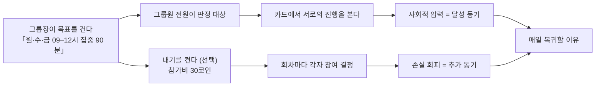
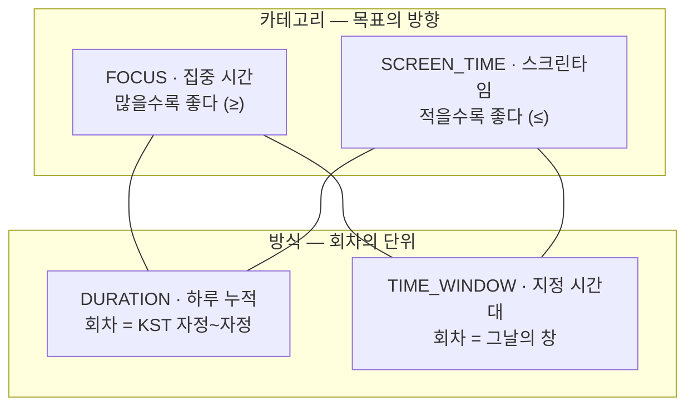
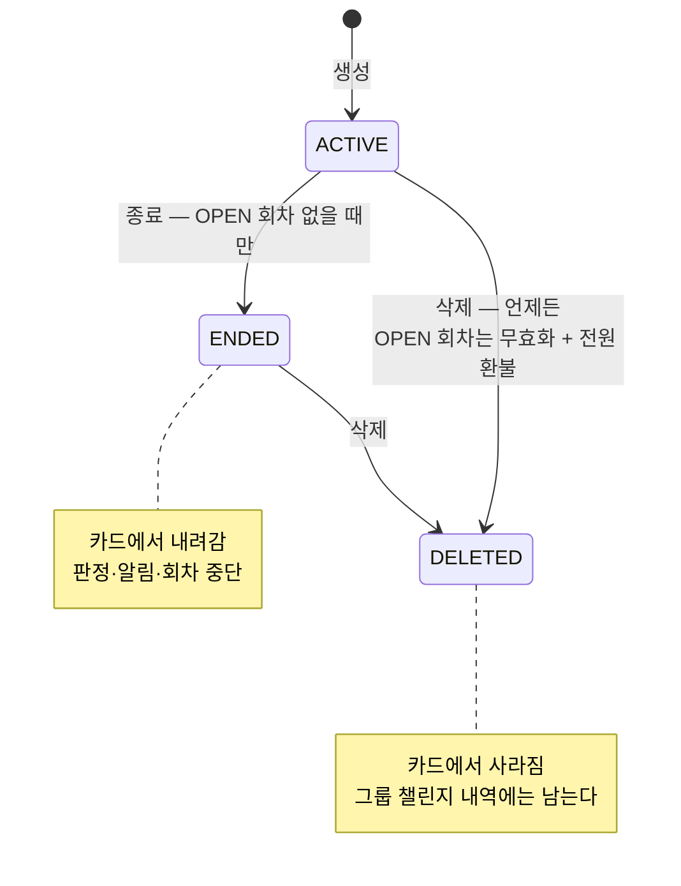
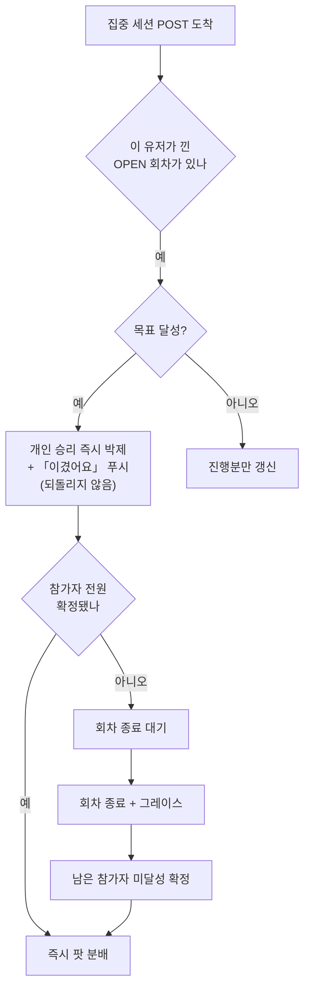
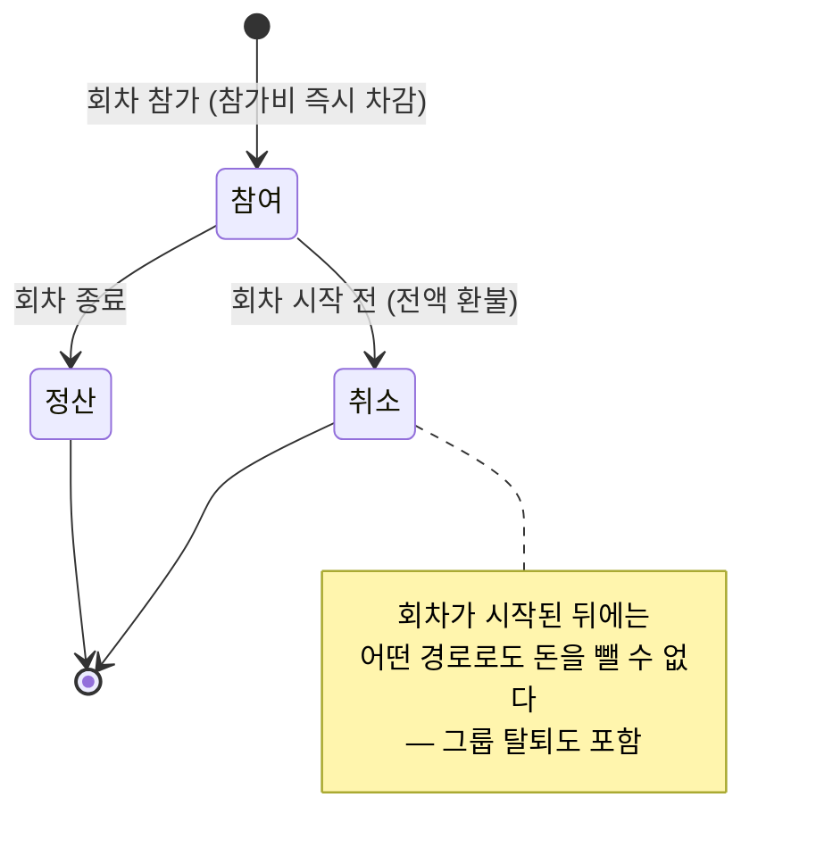
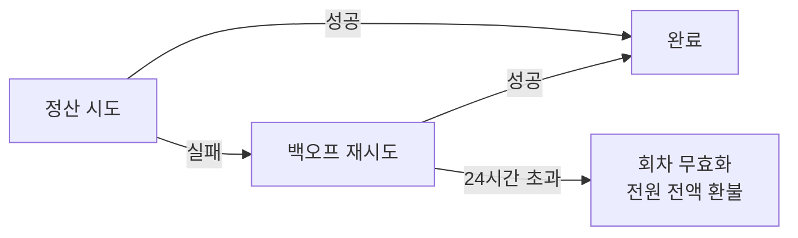

# 챌린지 — 정책 정본

> **문서 지위**: 2026-08-08 백지 재정의 세션의 결과물. **여기가 정책의 정본**이다.
>
> `docs/challenge/` 전체가 이 결정을 반영해 to-be로 다시 쓰였다(2026-08-08). 이 문서는 그중
> **왜 그렇게 정했는지**(§7 결정 로그)와 **현행 코드와의 차이**(§9 구현 과제)를 담는다.
> 다른 문서와 어긋나면 이 문서가 맞다. 2026-08-08 이전 판은 git 이력에 있다.
>
> | 항목 | 값 |
> |---|---|
> | 결정일 | 2026-08-08 |
> | 결정자 | 조재영 |
> | 대상 | 그룹 챌린지 + 챌린지 내기 |
> | 코드 위치 | `back/.../group/**`, `app/src/screens/group/**`, `app/src/services/screentimeSync.ts` |
> | 관련 문서 | [PRD](./prd.md) · [IA](./information-architecture.md) · [HLD](./high-level-design.md) · [LLD](./low-level-design.md) · [UI 시안](./ux.html) |

---

## 1. 핵심 루프

**챌린지는 그룹의 공동 목표다.** 그룹장이 "우리가 지킬 한 줄"을 걸면, 그룹원은 **아무것도 안
해도 전원이 그 목표의 판정 대상**이 된다. 신청도 수락도 없다 — 그룹에 있으면 오늘 몇 분
집중했는지가 카드에 뜨고, 서로가 그걸 본다.

**내기는 그 위에 돈을 얹는 별개의 선택이다.** 판정은 내기를 걸든 안 걸든 **똑같이** 돌아간다.
내기가 바꾸는 건 *판정 결과에 돈이 따라붙느냐* 하나뿐이다.

| | 챌린지 | 내기 |
|---|---|---|
| 누가 대상인가 | **그룹원 전원** (자동) | **참가한 사람만** (매번 직접) |
| 언제 정하나 | 정할 게 없다 | **날마다** 참여할지 고른다 |
| 못 지키면 | 카드에 미달성으로 뜬다 | 그 위에 **참가비를 잃는다** |
| 없으면 | 챌린지가 성립 안 함 | 챌린지는 그대로 돈다 |

한 문장으로: **챌린지는 "우리 이거 하자", 내기는 "여기에 30코인 건다".** 후자는 빼도 앱이
돌아가고, 전자는 빼면 남는 게 없다.



이 문서의 모든 결정은 이 한 문장에서 파생된다. **목표가 먼저고 돈은 나중이다.**

### 용어 (2026-08-09 확정)

계층이 셋이라 이름이 흔들리면 문서가 서로 다른 얘기를 하게 된다. 아래 셋만 쓴다.

| 용어 | 코드 | 뜻 |
|---|---|---|
| **챌린지** | `group_challenges` | 그룹의 공동 목표. 카테고리·방식·요일·시간대·목표분 |
| **내기** | `group_challenge_bets` | 챌린지에 붙는 **설정** (켤지 여부 + 참가비). **생성 시 정하고 이후 불변** (§A7). 챌린지와 **1:1** |
| **회차** | `..._bet_sessions` | 챌린지가 실제로 도는 하루. **참가·판정·정산의 단위** |

> **"회차"는 내부 용어다 — 화면에 쓰지 않는다.** 유저에게 회차는 결국 *그 챌린지가 도는 하루*고,
> 그건 **날짜와 요일로 이미 완전히 표현된다**. 월수금 챌린지의 월요일치를 "3회차"라고 부를
> 이유가 없다 — 유저가 아는 건 "오늘(월) 참여할지"뿐이다.
>
> | 화면 문구 | 쓰지 않음 | 대신 |
> |---|---|---|
> | 참여 버튼 | 이번 회차 참여 | **오늘(월) 참여** |
> | 비활성 요일 | 다음 회차 수요일 | **다음은 수요일** |
> | 결과 모달 | 8/10(월) 회차 결과 | **8/10(월) 결과** |
> | 마감 안내 | 회차 마감 | **오늘 마감** |
>
> 문서·코드·DB(`..._bet_sessions`)는 회차/session 을 그대로 쓴다. 하루형과 창형이 섞일 때
> 단위를 한 단어로 가리켜야 하는 건 **설계하는 쪽 사정**이지 유저 사정이 아니다.

**"판"이라는 말은 쓰지 않는다.** 내기가 챌린지와 1:1이라 독립 개념일 이유가 없고, 실제로
"판"이 가리키던 것은 대부분 **회차**였다. 유저에게도 노출하지 않는다.

| 쓰지 않음 | 대신 |
|---|---|
| 판 (설정 계층) | 내기 · "챌린지에 내기를 켠다" |
| 판 (돈이 도는 단위) | **회차** |
| 판돈 | **참가비** (개인이 건 돈) · **적립금**(=팟, 모인 돈) |
| 판을 깐다 | 내기를 켠다 |
| 판이 성립한다 | **내기가 성립한다** — 그날 참가자가 2명 이상 (§C9) |
| 철회 | **취소** — 법률·행정 어휘를 피한다. 결제·예약의 표준어에 맞춘다 |

> **"취소"의 뜻이 하나로 좁혀졌다.** 예전엔 *개설자가 회차 전체를 접는 것*이었는데 개설 개념이
> 사라지며 없어졌다. 지금 "취소"는 **내 참여를 무르는 것** 하나뿐이다.
> **UI 버튼도 문서도 `참여 취소`** 로 통일한다. 그냥 `취소`는 시트를 닫는 버튼과 헷갈린다 —
> 돈이 빠져나가는 행동이라 무엇을 취소하는지 버튼에 드러나야 한다.

---

## 2. A. 챌린지

### A1. 소유권 — 그룹장 전용

생성·종료·삭제 **전부 그룹장만** 한다. 내기를 켜고 참가비를 정하는 것도 그룹장이다.
소유권에 예외를 두지 않는다.

| 역할 | 챌린지 | 내기 |
|---|---|---|
| 그룹장 | 생성 · 종료 · 삭제 (수정 없음) | **생성 시** 켤지 결정 · 참가비 설정 (이후 불변) · 회차 참여 |
| 그룹원 | 조회 (판정은 자동 대상) | 회차 참여 · 취소 |
| 게스트 | 전부 차단 (`GUEST_FORBIDDEN` 403) | 전부 차단 |

> **폐기**: 기존 P9(내기 개설은 그룹원 누구나). 내기가 상시 구조가 되면서 "개설"이라는 행위 자체가
> 사라졌고, 그와 함께 *개설자 자동 참가* · *개설자의 회차 전체 취소* · *개설자 탈퇴 시 회차 전체 취소*
> 같은 곁가지가 전부 정리된다.

> **전제**: 모든 살아있는 그룹에 활성 그룹장이 있다. 그룹장 부재는 GROMO-1243(V31 최고참 승계)이
> 해소했다. 그룹 소유권 정책 자체는 이 문서 범위 밖 — 그룹 도메인 문서를 볼 것.

### A2. 축 — 카테고리 × 방식 (4조합 유지)



| 조합 | 예시 | 달성 조건 | 데이터 출처 |
|---|---|---|---|
| FOCUS × DURATION | 하루 60분 집중 | 당일 집중분 **≥** 60 | 서버 (세션 기록) |
| FOCUS × TIME_WINDOW | 09–12시에 90분 집중 | 창 내 집중분 **≥** 90 − 5(관용치) | 서버 (세션 클리핑) |
| SCREEN_TIME × DURATION | 하루 폰 120분 이하 | 당일 사용분 **≤** 120 | 클라 보고 |
| SCREEN_TIME × TIME_WINDOW | 22–24시에 30분 이하 | 창 내 사용분 **≤** 30 | 클라 보고 (**iOS만**) |

**⚠️ 안드로이드 게이트 (미해결, 의도적 보류)**
안드로이드 네이티브에는 일 단위 집계(`getTodayUsageBucketMinutes` / `getYesterdayUsageBucketMinutes`)만
있고, 임의 시간대 타임라인(`getUsageBucketEvents`)이 없다. 따라서 **SCREEN_TIME × TIME_WINDOW는
안드로이드에서 구조적으로 불가능**하고, 그 조합의 내기에 참가한 안드로이드 유저는 반드시 진다.

지금은 **안드로이드가 미출시라 이 문서의 범위 밖**이다. 다만 **안드로이드 출시 전에 반드시**
아래 중 하나를 결정해야 한다 — 이 결정 없이 출시하면 돈이 걸린 회차에서 플랫폼 차별이 발생한다.
티켓 **GROMO-1257**로 발행돼 있다.

- 안드로이드에서 해당 조합 `canParticipate=false`로 차단
- 해당 조합 자체를 폐기 (3조합으로 축소)
- `UsageStats.queryEvents` 기반 임의 창 집계를 안드로이드에 구현

### A3. 요일 반복

챌린지는 **도는 요일의 집합**을 갖는다. 아이폰 알람과 같은 모델이다.

```
「집중 · 09:00–12:00 · 90분」
  월 ● 화 ○ 수 ● 목 ○ 금 ● 토 ○ 일 ○
```

- **기본값 없음** — 요일을 하나도 안 고르면 다음 단계로 못 넘어간다. "언제 도는지"를 반드시
  의식하게 만든다.
- **비활성 요일에는** 진행률을 재지 않고, 마감 알림도 안 가며, 내기 회차도 서지 않는다.
  주말에 억울하게 미달성이 찍히는 일이 없어진다.
- **하루형에도 적용된다** — "평일만 하루 60분" 같은 목표가 가능하다.
- **회차(session)** = 챌린지가 실제로 도는 하루. 판정·내기·정산의 단위는 전부 회차다.

### A4. 구성과 상한

| 규칙 | 값 |
|---|---|
| 그룹당 활성 챌린지 | **최대 4개** |
| 하루형(DURATION) | 카테고리당 1개 (최대 2개) |
| 창형(TIME_WINDOW) | 겹치지 않으면 여러 개 (4개 상한 내에서) |

### A5. 창의 겹침 — 요일 ∧ 시간대

**창형끼리는 카테고리와 무관하게 겹칠 수 없고, 사이에 최소 15분 간격이 있어야 한다.**
단 **요일이 겹치지 않으면 시간대가 같아도 무방**하다.

```
겹침 판정 = (요일 교집합 ≠ ∅) ∧ (시간대 간격 < 15분)
```

```
월수금 09:00–12:00 집중   ██████
화목   09:00–12:00 폰금지        ██████   ✓  요일이 안 겹침
월수금 11:00–13:00 폰금지  ✗ 409  요일·시간대 모두 겹침
월수금 12:10–14:00 폰금지  ✗ 409  간격 10분 < 15분
월수금 12:15–14:00 폰금지  ✓
```

**왜 카테고리 무관 전면 금지인가.** 09–12시에 집중 90분을 하면 그 시간 폰은 자연히 안 쓰게 된다.
두 목표가 사실상 **하나의 행동으로 동시 달성**되므로 중복 보상이다.

**왜 15분 간격인가.** 창 A가 12:00에 끝나고 창 B가 12:00에 시작하면 경계의 측정이 양쪽 창에
섞인다. **스크린타임 창이 15분 눈금**이라 그보다 좁은 간격은 눈금 하나가 두 창에 걸친다 —
가장 거친 측정 단위를 기준으로 잡아야 어느 조합에서도 경계가 깨끗하다. 창 FOCUS의 5분 관용치도
이 안에 들어온다.

### A6. 창의 규칙

| # | 규칙 |
|---|---|
| A6-1 | 창은 **자정을 걸칠 수 없다**. `시작 < 종료` 를 강제한다 (`22:00~01:00` 거부, `22:00~23:59` 는 허용) |
| A6-2 | 목표분은 **0 < x ≤ 창 길이** |
| A6-3 | **SCREEN_TIME 창의 목표분은 15분 배수**여야 한다 (§B2 참조) |

**왜 자정 걸침을 막는가.** 요일 반복(§A3)과 정면으로 부딪힌다. `월 22:00~01:00` 은 화요일
01:00에 끝나는데, 그러면 "월요일 회차"가 화요일에 걸쳐 있다 — 요일이 회차를 가르는 축인데
회차가 요일 경계를 넘으면 다음이 전부 답이 없어진다.

- 화요일이 비활성 요일이면, 활성이 아닌 날에 판정이 돌아간다
- `월·화` 연속 활성이면 월요일 창의 꼬리와 화요일 창의 머리가 같은 시간대에 겹친다 —
  겹침 금지(§A5)를 요일 교집합만으로는 검사할 수 없다
- 참가 마감·정산 시각이 "그날"의 어느 쪽에 속하는지 매 규칙마다 되물어야 한다

**대가**: 심야 챌린지를 하려면 `22:00~23:59` 처럼 자정 앞에서 끊거나, 자정 이후 구간을
**다음 날 요일의 별도 챌린지**로 만들어야 한다. 활성 챌린지 4개 한도(§D1) 안에서 감당 가능한
제약이고, 얻는 것(요일 = 회차라는 단순한 규칙)이 훨씬 크다고 봤다.

### A7. 수정 — 없다

**챌린지는 만들면 통째로 불변이다.** 카테고리·방식·요일·시간대·목표분·**내기 켤지 여부**·참가비
어느 것도 바꿀 수 없다. 바꾸려면 **삭제하고 새로 만든다.**

> **내기는 나중에 끄지 못한다.** 내기를 끄는 순간 이미 참가비를 낸 회차의 돈을 어떻게 할지가
> 남는데, 그건 사실상 삭제(무효화 + 전원 환불)와 같은 일이다. 같은 결과를 내는 경로를 둘 두면
> 규칙만 늘어난다 — 끄고 싶으면 **삭제하고 내기 없이 다시 만든다.**

수정을 두지 않는 이유는 삭제가 쉬워졌기 때문이다(A8). 삭제에 조건이 걸려 있던 시절에는
"목표 하나 바꾸려고 하루를 기다린다"가 성립했지만, 이제 언제든 접고 다시 만들 수 있다.
수정 API·수정 시트·"진행 중 회차는 옛 목표로 판정된다"는 설명이 통째로 사라진다.

> **파생 결과**: 카드 분모와 회차 분모가 갈릴 일이 없다. 화면에서 "이 회차는 90분 기준"
> 같은 예외 문구를 지운다.

### A8. 종료와 삭제



**둘은 조건도 결과도 다르다. 진행 중이면 종료는 막히고 삭제만 열린다.**

| 액션 | 진행 중(OPEN 회차 있음) | 진행 중 아님 | 진행 중 참가비 |
|---|---|---|---|
| **종료** | **불가** (`CHALLENGE_END_BLOCKED` 409) | 가능 | — |
| **삭제** | 가능 | 가능 | **무효화 + 전원 환불** |

- **종료** = 깨끗한 마감. 돌고 있는 회차가 하나도 없을 때만, 더 이상 새 회차를 세우지 않는다.
- **삭제** = 강제 중단. 회차가 돌고 있어도 엎되, **엎은 값을 치른다** — OPEN 회차를 무효화하고
  참가비를 전원에게 돌려준다.

**"진행 중이면 종료 불가"인 이유**는 남의 돈이 걸린 회차를 *대가 없이* 조용히 마감하는 경로를
막기 위해서다. 종료는 환불 의무가 없으므로, 그걸 진행 중에 허용하면 그룹장이 불리한 회차를
무를 수 있다. 정말 접어야 하면 삭제를 쓰고 참가비를 돌려준다.

#### 진행 중 삭제는 한 번 더 막는다

돌고 있는 회차를 엎는 건 **남의 진행과 돈을 되돌리는 행동**이라, 오탭 한 번으로 일어나서는
안 된다. 진행 중(OPEN 회차 있음)일 때의 삭제는 **경고 확인을 한 단계 더** 거친다.

| 상태 | 삭제 확인 |
|---|---|
| 진행 중 아님 | 일반 확인 1단계 |
| **진행 중** | **경고 확인 1단계 추가** — 무엇이 사라지는지 수치로 보여준다 |

경고에 반드시 담을 것 — **지금 무슨 일이 일어나는지를 숫자로** 보여준다. "정말 삭제할까요?"만
띄우면 안 읽는다.

```
지금 진행 중인 챌린지예요

  오늘(월) 09:00–12:00 · 3명 참여 중
  적립금 90코인이 전원에게 돌아갑니다

이 회차는 무효가 되고 판정하지 않아요.
지난 기록은 그룹 챌린지 내역에 남습니다.

        [ 그만두기 ]   [ 삭제 ]
```

- **진행 중이 아니면 이 단계를 넣지 않는다.** 위험하지 않은 행동까지 두 번 물으면 경고가
  의미를 잃고, 정작 위험할 때도 그냥 누르게 된다
- 확인 버튼은 `삭제` — `확인`은 무엇을 확인하는지 말해주지 않는다(§N27과 같은 이유)
- 취소 버튼은 `그만두기` — 여기서 `취소`를 쓰면 **참여 취소**와 겹친다

**이미 정산이 끝난 회차는 건드리지 않는다.** 되돌리지 않는다는 원칙(B8)은 삭제에도 적용된다.
환불 대상은 `OPEN` 회차의 에스크로뿐이다.

### A9. 이력은 그룹이 소유한다

**「지난 챌린지」가 아니라 「그룹 챌린지 내역」이다.** 이력의 소유자를 챌린지에서 **그룹으로
승격**한다.

```
그룹방 > 챌린지 내역
  8/10(월)  집중 09–12시 90분   달성 3/4   +45
  8/08(금)  하루 폰 2시간 이하   달성 1/3   −30
  8/08(금)  집중 09–12시 90분   무산       환불
  …
```

이력이 챌린지에 매달려 있으면 **챌린지가 사라질 때 끊긴다.** 그룹에 매달면 안 끊긴다.
"돈이 오간 기록은 어떤 경로로도 사라지지 않는다"가 삭제 조건이라는 약속이 아니라
**구조**로 보장된다.

이를 위해 **회차 행에 미션 스냅샷을 박제**한다 — 카테고리·방식·목표분·창 시각. 챌린지 행이
사라져도 내역 한 줄을 온전히 읽을 수 있어야 한다.

> **해소**: 기존 A7 갭 — `deleteChallenge`가 정산 끝난 내기의 삭제를 허용하는데 이력 조회는
> 삭제된 챌린지를 거부해, **코인이 실제로 오간 기록이 그룹장 클릭 한 번에 전원 404**가 되던 문제.
> 삭제를 막아서가 아니라 **이력의 소유자를 옮겨서** 닫는다.

> **해소**: 기존 A1 갭 — `GroupChallengeStatus.INACTIVE`를 세팅하는 코드가 한 줄도 없어
> "종료" 개념이 반쪽이던 문제. 이제 실제 전이 경로가 생긴다.

> **짚어둘 것**: 종료와 삭제가 결과적으로 비슷해진다 — 둘 다 카드에서 사라지고 내역에는 남는다.
> 차이는 **조건(진행 중 허용 여부)과 환불 여부**뿐이다. 유저에게는 "잘 끝냈다"와 "엎었다"로
> 다르게 읽히므로 둘 다 남기되, 삭제는 파괴적 액션으로 확인 단계를 강하게 둔다.

---

## 3. B. 판정

### B1. 달성의 정의

- **FOCUS**: 회차 내 집중분 **≥** 목표분
- **SCREEN_TIME**: 회차 내 사용분 **≤** 목표분

### B2. 관용치 — 측정 오차 보정이다

관용치는 인심이 아니라 **측정 정밀도의 함수**다. 정밀한 축에 여유를 주고 거친 축에 안 주면
논리가 거꾸로 선다.

| 조합 | 측정 정밀도 | 관용치 | 대신 |
|---|---|---|---|
| FOCUS × TIME_WINDOW | 서버 세션 클리핑 (분 단위) | **5분** | — |
| FOCUS × DURATION | 서버 세션 기록 (분 단위) | **0분** | 하루는 여유가 크다 |
| SCREEN_TIME × TIME_WINDOW | **15분 눈금** | **0분** | **목표분을 15분 배수로 강제** — 눈금과 경계를 정렬 |
| SCREEN_TIME × DURATION | 일 단위 집계 | **0분** | — |

> **왜 창 SCREEN_TIME에 관용치 대신 눈금 정렬인가.** 15분 오차를 관용치로 덮으려면 15분을 줘야
> 하는데, "30분 이하" 목표에 45분까지 인정하면 목표가 무의미해진다. 목표 자체를 눈금에 맞추면
> 오차가 경계를 넘지 않는다.

> **해소**: 기존 D3 갭 — 창 FOCUS만 5분이고 15분 오차가 나는 창 SCREEN_TIME엔 0분이던 비대칭.
> 그 비대칭이 왜 존재하는지 어디에도 안 적혀 있던 문제도 함께 닫힌다.

### B3. 시간축 — KST 고정, 저장축까지

**모든 판정과 저장이 Asia/Seoul을 쓴다.** 집중·스크린타임 통계의 저장 일자도 KST로 통일한다.

한국 타깃 서비스이고 챌린지가 **그룹 공동 목표**이므로 전원의 마감이 동시에 오는 게 맞다.
해외 유저는 "내 하루"와 앱의 하루가 어긋나지만 수용한다.

> **해소**: 기존 D6 갭 (**P1**) — 통계는 `CountryZoneResolver`가 도출한 유저 국가 존 로컬 날짜로
> 저장되는데 판정은 KST `betDate`를 그대로 키로 조회해, 판정 경로에 존 변환이 **한 줄도 없던**
> 문제. JP는 UTC+9라 우연히 무해했고 그래서 안 드러났다.
>
> 기존 P5("모든 시각 판정은 KST 고정")는 **판정 시각**에 대한 결정이었지 **저장 버킷**에 대한
> 보증이 아니었다. 이제 저장까지 포함한다.

**유지되는 규칙**: 자정을 걸친 집중 세션은 **종료일 회차**에 잡힌다(`daily_focus_stats`가 세션
종료 시각 귀속). 카드 진행률도 같은 규칙이라 화면과 정산은 어긋나지 않는다.

### B4. 데이터가 안 왔을 때 — 미달성 확정

**미도착 = 미달성으로 확정한다.** 회차는 닫혀야 한다.

**"판정 제외 + 환불"은 검토했고 기각했다.** 두 카테고리 모두에서 깨진다.

- **FOCUS**: 서버에 세션 기록이 없다는 게 "안 했다"인지 "못 올렸다"인지 **원천적으로 구분
  불가능**하다. 미보고를 환불로 처리하면 집중 안 한 사람 전원이 환불된다.
- **SCREEN_TIME**: 구분은 되지만 "질 것 같으면 앱을 안 켠다"는 **무위험 탈출구**가 열린다.

대신 **도착률을 시스템이 끌어올린다.**

### B5. 사일런트 푸시 — 도착률 장치

미도착의 진짜 원인은 정산 시각이 아니라 **"앱을 안 열었다"** 이다. 세 가지 보고가 전부 같은
트리거를 쓴다 — `앱 시작 1회 + 포그라운드 복귀`. 백그라운드 전송이 없다.

| 데이터 | 1차 시도 | 실패 시 재시도 |
|---|---|---|
| 집중 세션 | 종료 즉시 POST | `pendingFocusUploads` 큐 → 앱 열 때 |
| 스크린타임(일) | — | `ScreenTimeSyncer` → 앱 열 때 |
| 스크린타임(창) | — | `syncWindowUsage` → 앱 열 때 |

**정산 직전에 무음 푸시(content-available / data message)를 보내 앱을 깨우고 큐를 비운다.**
대상은 해당 회차에 **참가한 유저만**이라 발송량이 작다. iOS는 배달 보장이 없지만 실효는 크다.

### B6. 정산 시점

FOCUS는 세션이 실시간으로 서버에 들어오므로 배치로 몰 이유가 없다. **개인 승리 확정과 팟 분배를
분리**해 즉시성과 데이터 수용을 둘 다 가진다.



| 조합 | 정산 시점 | 그레이스 | 근거 |
|---|---|---|---|
| FOCUS × DURATION | KST 자정 즉시 | **0분** | 자정 걸친 세션은 어차피 종료일 회차로 간다 |
| FOCUS × TIME_WINDOW | 창 종료 + 30분 | **30분** | 창을 걸친 세션은 끝나야 서버가 안다 (아래) |
| SCREEN_TIME × TIME_WINDOW | 창 종료 + 30분 | **30분** | 창 종료 직후 사일런트 푸시로 보고 유도 |
| SCREEN_TIME × DURATION | **익일 12:00** | — | 자정 마감이라 기기가 잔다. 오전 보고 기회 확보 |

**창형에 30분 그레이스가 필요한 이유**: 창이 09:00–12:00인데 유저가 11:30–12:30 집중하면
클리핑상 30분이 창 안에 들어간다. 그런데 서버는 세션이 **끝나야**(12:30) 그 존재를 안다 —
`/focus-session/start`를 앱이 호출하지 않아 진행 중 세션은 서버에 없다. 그레이스 0이면 **창
안에서 집중한 30분이 통째로 사라진다.**

**배치 크론의 역할이 바뀐다** — 주 경로가 아니라 위 이벤트 경로가 안 돌았을 때의 **안전망**이다.

> **해소**: 기존 D7 갭 (**P1**) — 01:00 정산이 "자정에 통계가 완결된다"를 전제하는데 업로드
> 큐는 앱 재실행에만 flush돼, 네트워크 실패 + 새벽 앱 미실행이면 억울한 패배로 확정되던 문제.

> **해소**: 기존 C4 갭 — 정산 시각이 카테고리별 경험칙으로 하드코딩(01:00 / 12:00)되던 문제.
> 이제 회차 종료가 정산을 트리거한다.

### B7. 0분과 미집계는 다르다

**저장 단계에서부터 구분한다.**

| 상태 | 표기 | 의미 |
|---|---|---|
| `achieved = true` | `달성 ✓` (초록 칩) | 확정 달성 |
| `progressMinutes` 값 | `32/60분` | 진행 중 |
| `progressMinutes = null` | `—` (옅은 회색) | **미집계** — 0분과 완전히 다르다 |

- **FOCUS**는 데이터가 없으면 "0분 집중"이 사실이므로 0으로 접는다.
- **SCREEN_TIME**은 "0분 사용"과 "보고 안 됨"을 구분할 수 없으므로 `null`로 남긴다.
  이걸 0으로 접으면 **미보고가 "0분 사용 = 달성"으로 뒤집힌다.**

> **해소**: 기존 D5 갭 — 앱이 `actualScreenTimeMinutes` 없이 보고하면 `ScreenTimeService`가
> **0으로 저장**해 실제 0분과 구분되지 않던 문제. `total_screen_time_minutes` nullable화가 필요하다.

### B8. 정산은 되돌리지 않는다

확정된 정산은 번복하지 않는다. 마감 이후 도착한 기록은 반영되지 않는다.

**예외 아님**: §E1의 24시간 자동 환불은 *정산된 건을 되돌리는 것*이 아니라 *정산 자체가 불가능한
건을 닫는 것*이다.

---

## 4. C. 내기

### C1. 내기는 챌린지에 상시로 붙는다

**"내기 개설"이라는 행위가 없다.** 그룹장이 챌린지에 내기를 켜면, **활성 요일마다 회차가 자동으로
서고** 그룹원은 회차마다 참여 여부만 결정한다.

```
챌린지 「월·수·금 09:00–12:00 집중 90분」
   └─ 내기 켜짐 · 참가비 30코인
        ├─ 8/10(월) 회차  참여 3명 → 팟 90 → 정산 ✓
        ├─ 8/12(수) 회차  참여 2명 → 팟 60 → 정산 ✓
        ├─ 8/14(금) 회차  참여 1명 → 무산 · 전액 환불
        └─ 8/17(월) 회차  모집 중…  참가 마감 09:00
```

| 규칙 | 값 |
|---|---|
| 내기의 소유자 | 그룹장 (챌린지 만들 때 함께 설정) |
| 챌린지당 내기 | 1개 |
| 참가비 | **1 ~ 3,000 코인** 정수. 앱은 프리셋 칩(**상한 대비 10/30/50/100%** = 300/900/1,500/3,000) + 자유 입력 |
| 회차 | 챌린지의 활성 요일마다 자동 |

> **폐기**: 기존 FR-7(내기는 챌린지당·날짜당 1개) · P11(취소된 내기는 같은 날짜 재개설 허용) ·
> FR-8(내기 날짜는 오늘 또는 내일). 개설 개념이 사라지면서 전부 무의미해진다.

### C2. 참여 — 회차마다 직접

기본은 **회차마다 직접 참여**한다. "오늘 낼까?"를 매번 결심하는 것 자체가 긴장감의 일부다.
회차 시작 전 알림으로 리마인드한다.

**단축**: "이번 주 남은 날 전부" 버튼을 준다. 마찰과 통제력의 절충이다.

**예약분은 즉시 전액 에스크로.** 월수금 3회차를 예약하면 90코인이 그 자리에서 묶인다.
"참가 = 돈이 빠졌다"는 원칙이 깨지지 않고, 팟이 항상 실재한다. 잔액이 부족하면 예약 버튼이
비활성화되고 가능한 회차만 고를 수 있다.

### C3. 참가 마감

| 방식 | 개설 마감 | 참가 마감 |
|---|---|---|
| **창형** | 창 시작 전 | **창 시작 전** |
| **하루형** | — | **회차 종료까지 (종일)** |

**창형은 출발선이 명확**하므로 창이 열리는 순간 회차를 잠근다. 전원이 같은 지점에서 시작한다.
창이 이미 지났으면 자연히 **다음 회차**가 열린다.

**하루형은 출발선이 없다.** 회차가 자정~자정이라 "회차 시작 전"은 곧 전날이고, 그러면
"오늘 하자"는 가장 자연스러운 동선이 죽는다. 그래서 종일 열어두되 **정보 비대칭만 없앤다.**

### C4. 하루형 — 진행분 공개

하루형 참가 시트는 **기존 참가자의 현재 진행분을 그대로 보여준다.**

```
┌─ 참가하기 · 30코인 ─────┐
│ 하루 60분 집중            │
│ 남은 시간 6시간 12분      │
│                          │
│ 지금 참여한 사람                │
│  민지  52/60분  ▰▰▰▰▱   │
│  준호  18/60분  ▰▱▱▱▱   │
│  나    0/60분   ▱▱▱▱▱   │
│                          │
│ [들어가기]                │
└──────────────────────┘
```

불리한 회차인 걸 알고 들어가는 건 본인 선택이다. 먼저 시작한 사람이 유리하다는 사실 자체는
남지만, **모르고 당하는 일**은 없앤다.

### C5. 무위험 참가 차단

카테고리마다 **막는 방향이 반대**다.

| 카테고리 | 차단 조건 | 에러 | 이유 |
|---|---|---|---|
| FOCUS | 이미 목표 달성 | `BET_ALREADY_ACHIEVED` | 확정된 승리에 올라타기 방지 |
| SCREEN_TIME | 이미 목표 초과 | `BET_ALREADY_FAILED` | 확정된 패배에 돈 넣기 방지 |

SCREEN_TIME의 "달성"은 회차가 끝나야 확정되는 **잠정** 값이라 차단 근거가 못 된다.

**남은 시간이 부족한 경우는 막지 않고 경고만 한다.** 하루형 FOCUS에서 23:50에 "60분 집중" 회차에
들어가면 물리적으로 불가능하지만, **서버는 차단하지 않는다.**

```
남은 시간 < (목표분 − 내 진행분)   →  참가 시트에 경고, 버튼은 살아 있다
```

> **왜 막지 않는가.** 차단하면 사람마다 참가 마감이 달라져("나는 왜 못 들어가지") 설명할 수
> 없는 화면이 된다. 불리한 회차에 들어가는 것은 하루형 종일 참가를 허용한 시점(§C3·§C4)에
> 이미 본인 선택으로 넘긴 영역이다 — 진행분을 공개하는 것과 같은 원리로, **정보를 주고
> 결정은 맡긴다.**

> **`BET_ALREADY_FAILED`와의 차이**: 그쪽은 결과가 **이미 확정**된 경우(스크린타임 초과는
> 되돌릴 수 없다)라 막는다. 남은 시간 부족은 어렵지만 **아직 확정이 아니다** — 10분에 60분은
> 불가능해도, 40분 남았는데 60분 목표라면 무리일 뿐 불가능은 아니다. 확정과 불리는 다르게 다룬다.

### C6. 최소 2명

**참가 마감 시점에 참가자가 1명뿐이면 회차를 무산시키고 전액 환불한다.** 내기는 상대가 있어야
성립한다. 혼자 걸었다가 달성하면 본전, 실패하면 그냥 벌금이라 내기가 아니다.

### C7. 팟과 분배

```
팟 = 참가비 × 참가자 수
```

| 상황 | 처리 |
|---|---|
| 달성자 ≥ 1명 | **달성자끼리 균등 분배**. 나머지 잔여 코인은 **성과 1위**에게 |
| 달성자 0명 | **전액 소멸** (몰수). 환불하지 않고, **다음 회차로 이월하지도 않는다** |

**성과 1위 판정** — 방향이 카테고리마다 반대다.

- FOCUS → 진행분이 가장 **큰** 승자
- SCREEN_TIME → 사용분이 가장 **작은** 승자
- 동률이면 `userId` 오름차순 첫 승자 (결정적 선택)

**왜 달성자 0명이면 소멸인가.** 전원 환불로 두면 "아무도 안 하면 본전"이 되어 내기의 긴장감이
사라진다. 코인 총량이 줄어드는 방향이라 인플레이션 방어에도 유리하다.

> 몰수분은 회수 계정으로 옮기지 않는다. 원장(`currency_transactions`)에는 차감(`BET_STAKE`)과
> 몰수 기입만 남고 지급 기입이 없다. 회계상 계정이 없다는 것은 **알려진 한계로 수용**한다.

### C8. 취소와 이탈



```
취소 가능 = (now < 회차 시작  OR  now < 참가시각 + 5분)  AND  now < 회차 종료
```

| 경로 | 회차 시작 전 | 참가 후 5분 이내 | 그 외 |
|---|---|---|---|
| **참여 취소** | 전액 환불 | 전액 환불 | 불가 |
| **그룹 탈퇴** | 전액 환불 | 전액 환불 | **정산 대상 유지** — 판정도 지급도 그대로 |

**5분 유예는 실수 방어다.** 하루형은 회차 시작이 자정이라 당일 참가자에게는 "회차 시작 전"이
영영 오지 않는다 — 참가하는 순간 이미 시작돼 있다. 오탭으로 30코인이 빠져나가고 되돌릴 방법이
없는 상태를 막는다.

**유예에 상한을 둔다.** `now < 회차 종료`가 없으면 23:58에 참가한 사람의 유예가 자정을 넘겨
정산 도중에 취소가 들어온다. 유예는 `min(참가시각 + 5분, 회차 종료)`에서 끊긴다.

> **어뷰징 여지**: 5분마다 참가·취소를 반복할 수 있다. 멱등키 축이 참가 행이라 정합성은
> 안전하고 실질 이득도 없지만(참가비가 왕복할 뿐), 원장에 노이즈가 쌓인다. **수용**한다 —
> 막으려면 참가 횟수 제한이 필요한데 그 복잡도가 이득보다 크다.

**"시작한 회차에서는 어떤 경로로도 참가비를 뺄 수 없다"가 예외 없이 성립한다.** 그룹을 나가도 계정과
지갑은 살아있으므로 판정과 지급이 정상 동작한다. 정산 명단에는 "탈퇴한 사용자"로 표기한다.

> **해소**: 기존 E4 갭 (**P0**) — `releaseBets`가 `isOpen`만 보고 **시작 시각을 확인하지 않아**,
> 지는 회차가 시작된 뒤 그룹을 나가면 전액 환불되던 문제. P6(취소는 시작 전만)과 손실 회피 설계가
> 통째로 무력화되던 우회로.

> **자동 해소**: 개설자 개념이 사라지면서 "개설자가 나가면 회차 전체 취소 + 전원 환불"
> (`cancelAndRefundAll`) 경로도 함께 사라진다. 이기고 있던 참가자의 상금이 남의 탈퇴로
> 증발하는 일이 없어진다.

### C9. 환불은 정확히 한 번

어떤 경로 조합에서도 환불은 **정확히 한 번** 일어난다. 이건 정책이 아니라 **구현이 지켜야 할
불변식**이다.

> **미해소 (구현 과제)**: 기존 E5 갭 (**P0**) — `releaseBets`가 대상 `betIds`를 **잠금 전에**
> 조회하고 `detachAndRefund`가 잠금 후 참가 행 재검증 없이 무조건 환불해, 취소 × 탈퇴가 겹치면
> 이중 환불된다. 멱등키가 갈라져(`bet:{betId}:leave-refund:{participantId}` vs
> `bet:{betId}:refund:{userId}`) 원장 UNIQUE도 못 막는다. **잠금 확보 후 참가 행 재검증** +
> `leaveBet` ↔ `withdrawGroup` 강제 인터리빙 테스트가 필요하다.

### C10. 참가비 멱등키

참가비 차감의 멱등키 축은 **참가 행 id**다 (유저 id 아님). 취소 → 재참여 회차가 키에서 갈려야
한다. 유저 축으로 잡으면 재참여가 **참가비 0원**이 된다 (GROMO-1112 실사고).

---

## 5. D. 노출

### D1. 카드

```
┌─ 집중 · 09:00–12:00 · 90분 ──────┐
│ 월 ● 화 ○ 수 ● 목 ○ 금 ● 토 ○ 일 ○ │
│ 다음은 8/10(월) 09:00               │
│                                    │
│ 민지  달성 ✓                        │
│ 준호  45/90분                       │
│ 수빈  —                             │
│                                    │
│ 내기 · 30코인 · 참여 2명             │
│ [참여하기]        마감 09:00        │
└────────────────────────────────┘
```

- **요일 배지**와 **다음 회차 날짜·시각**을 항상 노출한다. "언제 도는 챌린지인지"가 카드에서
  바로 읽혀야 한다.
- 비활성 요일에는 카드가 남되 "다음은 ○요일" 상태로 가라앉는다.
- 진행 표기는 §B7의 3상 규칙을 따른다.
- 진행 행은 한 덩어리로 읽히게 한다 (`accessible` + 합성 `accessibilityLabel` — VoiceOver가
  "—"를 "대시"로 읽는 문제 회피).

### D2. 알림 — 시간대별 묶음 발송

요일 반복과 회차별 참여로 알림이 크게 늘어난다. **같은 무렵에 떨어지는 알림은 그룹 단위로 한
건에 모아 보낸다.** 하루 2~3건이 상한이다.

```
08:30  「A그룹 · 오늘 챌린지 2개」
        · 집중 09–12시 내기 30코인
        · 하루 폰 2시간 이하

13:00  「A그룹 · 결과 2건」
        · 집중 달성 · +45코인
        · 폰 미달성 · −30코인
```

푸시를 열면 그룹방으로 이동해 상세를 본다.

| 종류 | 시점 | 대상 | 승패 포함 |
|---|---|---|---|
| 챌린지 생성 | 생성 이벤트 (AFTER_COMMIT) | 그룹원 (생성자 제외) | — |
| 회차 참여 모집 | 회차 시작 전 | 그룹원 | — |
| 회차 종료 / 하루 마감 | 회차 종료 | 그룹원 | ❌ (보고 전) |
| 결과 | 정산 완료 | 참가자 | ✅ |
| **승리 확정** | 목표 달성 순간 | 본인 | ✅ (§B6) |
| **사일런트** | 정산 직전 | 참가자 | 무음 — 큐 flush 전용 |

**회차 종료 푸시는 승패를 싣지 않는다** — 스크린타임은 보고 전이라 아직 확정이 아니다.

### D3. 결과 모달

**그룹방에 들어왔을 때, 내가 돈을 걸었던 회차 중 아직 결과를 안 본 것을 최신순으로 하나씩**
보여준다.

| 축 | 규칙 |
|---|---|
| 트리거 | 그룹방 진입 1회 |
| 대상 | 각 챌린지의 `mySettledSessions`(**내가 참가한** 정산 완료 회차, 최대 10건) 전부 |
| 데이터 | 챌린지 조회 **1건**. 날짜를 따로 부르지 않는다 |
| 순서 | 회차일 내림차순, 순차 큐 |
| 1회 가드 | 세션 id 기준 — 앱 로컬 seen set |

**최신 1건(`lastSettledSession`)으로는 큐가 성립하지 않는다.** 내가 참가 안 한 최신 회차가
그 앞의 내 결과를 가리고(월 참가 → 수 미참가 → 목 진입이면 월요일 결과가 영영 안 보인다),
앱을 안 연 사이 정산된 내 회차 여럿이 1건으로 접힌다. 그래서 모달 큐는 내 참가 회차
**목록**(`mySettledSessions`)을 쓰고, `lastSettledSession`은 카드 표시용으로만 남는다
(LLD §2.1). 10건 초과분은 버린다 — 수용.

**무산(`VOIDED`)·자동 환불(`REFUNDED`)도 결과로 친다.** 돈이 움직였거나 **움직이지 않기로
확정된** 사건은 전부 알린다 — 침묵하면 "내 코인 어디 갔지"가 된다.

**내가 참가하지 않은 회차는 띄우지 않는다.** 남의 회차 결과로 화면을 막지 않는다. 그룹 전체
달성 현황은 카드에서 상시 보이므로 모달이 대신할 이유가 없다.

> **날짜 조회가 사라진다.** 기존 설계는 "오늘 + 직전 회차일" 2건을 불렀는데, 요일 반복에서는
> **챌린지마다 직전 회차일이 다르다**(월수금 vs 화목) — 2건으로 못 덮는다. 서버가 이미
> `mySettledSessions`를 챌린지마다 실어주므로 조회 1건이면 끝나고, 앱에서 날짜 역산과
> 자정 걸침 판정이 통째로 사라진다.

---

## 6. E. 운영

### E1. 참가비는 영원히 묶이지 않는다



**정산 실패는 백오프로 재시도하고, 24시간을 넘기면 회차를 무효화하고 전원 환불한다.**
"참가비는 어떤 경우에도 영원히 묶이지 않는다"를 사람이 아니라 **시스템이 보장**한다.

**24h는 하드 데드라인이다 — 검사가 정산 시도보다 먼저 온다.** 실패 횟수가 아니라 시각에 걸린
약속이라, 스케줄러가 오래 죽었다 살아나거나 데드라인 직후 의존성이 회복돼 "첫 시도가 성공"하는
경우에도 지급이 아니라 환불이 나가야 한다 (LLD §5.2).

§B8("정산은 되돌리지 않는다")과 충돌하지 않는다 — 정산된 건을 되돌리는 게 아니라, **정산 자체가
불가능한 건을 닫는 것**이다.

> **해소**: 기존 E3 갭(재시도 없음) · C2 갭(동결 감지가 error 로그만) · C3 갭(prod 수동 정산
> 트리거 부재 — 동결을 푸는 수단이 재배포뿐이던 문제).

### E2. 관측성 (후속)

MQ + DLQ 기반 실패 격리와 운영자 알림은 **후속 티켓 GROMO-1256**으로 뺀다. E1의 자동 환불이
최후 방어선을 이미 세우므로 급하지 않다.

### E3. 정합성 요구

| 구분 | 요구 |
|---|---|
| 정합성 | 참가비는 어떤 경로로도 이중 차감·이중 지급되지 않는다 (행 락 → status 확인 → CAS → 원장 유니크) |
| 정합성 | 정산 실패는 **건별 격리** — 회차 1건 = 트랜잭션 1개 |
| 성능 | 챌린지 목록 조회는 챌린지 수·멤버 수와 무관하게 쿼리 수 고정 (IN 절 배치 로드) |
| 관측성 | 정산 배치는 고정 포맷 요약 로그를 남긴다 |
| 호환성 | 신규 **응답 필드**는 전부 additive. 단 **경로 교체(구 내기 API 제거)는 배포 순서 무관이 될 수 없다** — 구 앱은 구 경로를 부르고 새 앱은 새 경로를 부르므로, 어느 쪽을 먼저 배포해도 한쪽이 깨진다. 구 경로는 새 구현으로 위임하는 **브리지로 한 배포 주기 유지**하고, 구 앱 전환 확인 후 별도 티켓으로 제거한다 |

### E4. 분산 락 (미해소)

`@Scheduled` 크론에 분산 락이 없다. 현재 단일 인스턴스라 무해하지만 **스케일아웃 즉시 모든
크론이 N배 실행된다** (CAS·dedup이 *결과*는 지키지만 부하·로그는 오염). ShedLock 도입이
필요하다 — 기존 티켓 565.

---

## 7. 결정 로그

돈이 걸린 판정이라 "왜 그렇게 정했는지"가 기능만큼 중요하다.

| # | 결정 | 근거 | 버린 대안 |
|---|---|---|---|
| **N1** | 챌린지 = 그룹 공동 목표. 그룹원은 가입만으로 판정 대상 | 목표가 먼저고 돈은 나중 | 개인 목표 공개 경쟁 / 내기 중심 |
| **N2** | 소유권은 전부 그룹장 | 예외를 두면 "누가 뭘 할 수 있나"가 매번 헷갈린다 | 그룹원 개설 허용 (기존 P9) |
| **N3** | 요일 반복 도입, 기본값 없음 | "언제 도는지"를 반드시 의식하게 | 매일 고정 / 기본값 매일 |
| **N4** | 창형 겹침은 요일 ∧ 시간대로 판정, 최소 **15분** 간격 | 중복 보상 차단 + 경계 분리. 간격 기준은 **가장 거친 측정 단위**(스크린타임 15분 눈금)를 따른다 | 5분(관용치 기준) / 같은 카테고리만 금지 / 경고만 |
| **N5** | **수정 없음** — 챌린지는 통째로 불변 | 삭제가 쉬워졌으니 "접고 다시 만들기"가 정상 동선이다. 수정 API·시트·예외 문구가 통째로 사라진다 | 목표분만 수정 / 전면 수정 |
| **N6** | 종료는 **진행 중 불가**, 삭제는 **언제든 + 전원 환불** | 남의 돈이 걸린 회차를 조용히 마감하는 경로를 주지 않는다. 접으려면 대가(환불)를 치른다 | 삭제도 조건부 / 종료만 |
| **N6-1** | 이력의 소유자를 **챌린지 → 그룹**으로 승격 | 챌린지에 매달린 이력은 챌린지가 사라질 때 끊긴다. 그룹에 매달면 안 끊긴다 | 삭제를 막아서 이력 보존 |
| **N7** | 관용치는 측정 정밀도의 함수 | 정밀한 축에 여유를 주고 거친 축에 안 주는 건 거꾸로다 | 일괄 5분 / 전면 폐기 |
| **N8** | KST 고정 — 저장축까지 | 공동 목표는 마감이 동시에 와야 한다 | 유저 존 / 그룹 타임존 |
| **N9** | 미도착 = 미달성 확정 | 회차는 닫혀야 한다. 판정 제외는 두 카테고리 모두에서 깨진다 | 판정 제외 + 환불 / 보정 재정산 |
| **N10** | 사일런트 푸시로 도착률 제고 | 미도착의 원인은 정산 시각이 아니라 "앱을 안 열었다" | 정산 시각 이동만 / 방치 |
| **N11** | 개인 승리 즉시 박제, 팟 분배는 회차 종료 시 | 즉시성과 데이터 수용을 둘 다 가진다 | 전부 배치 / 전부 즉시 |
| **N12** | 창형만 30분 그레이스 | 창을 걸친 세션은 끝나야 서버가 안다 | 일괄 0 / 일괄 그레이스 |
| **N13** | 내기는 챌린지에 상시로 붙는다 | 회차마다 회차를 새로 여는 건 마찰뿐 | 회차별 개설 (기존) |
| **N14** | 참여는 회차마다 직접 + 주간 단축 | 매번 결심하는 것이 긴장감. 단축은 절충 | 자동 참여 토글 |
| **N15** | 예약분 즉시 전액 에스크로 | "참가 = 돈이 빠졌다"가 깨지면 안 된다 | 회차 직전 차감 |
| **N16** | 창형은 창 시작 전 마감 / 하루형은 종일 + 진행분 공개 | 창형은 출발선이 있고 하루형은 없다 | 일괄 규칙 |
| **N17** | 마감 시 1명이면 무산·전액 환불 | 내기는 상대가 있어야 성립 | 혼자 벌금 걸기 허용 |
| **N18** | 달성자 0명이면 소멸, 이월 없음 | "아무도 안 하면 본전"이 되면 긴장감이 사라진다 | 이월 / 회수 계정 |
| **N19** | 그룹 탈퇴 = 취소와 같은 규칙 | 시작한 회차에서는 어떤 경로로도 돈을 뺄 수 없다 | 시작분 몰수 / 탈퇴 차단 |
| **N20** | 알림은 시간대별 그룹 단위 묶음 | 하루 8~10건은 알림을 닫게 만든다 | 종류별 on/off / 돈 걸린 것만 |
| **N21** | 정산 24시간 초과 시 자동 전원 환불 | 참가비 동결 0을 사람이 아니라 시스템이 보장 | 운영자 판단 / 감지만 |
| **N24** | 결과 모달은 **내가 참가한 회차만**, 회차일 내림차순 순차 큐 | 남의 회차 결과로 화면을 막지 않는다. 챌린지 조회 1건의 `mySettledSessions`로 끝난다 (최신 1건 방식은 큐가 성립 안 함 — §D3) | 모든 챌린지 / 한 모달에 합침 / 최신 1건만 |
| **N25** | 창은 **자정을 걸칠 수 없다** (`시작 < 종료`) | 요일이 회차를 가르는 축인데 회차가 요일 경계를 넘으면 판정일·겹침검사·정산 귀속이 전부 모호해진다 | 자정 걸침 허용 (기존) / 걸친 창은 종료일 회차로 귀속 |
| **N26** | 내기는 **나중에 끄지 못한다** — 생성 시 결정, 이후 불변 | 끄는 순간 이미 낸 참가비 처리가 남는데 그건 삭제(무효화+전원환불)와 같은 일이다. 같은 결과에 경로를 둘 두지 않는다 | 켜기/끄기 토글 (기존 표기) |
| **N27** | 버튼 문구도 **`참여 취소`** — 그냥 `취소` 금지 | 시트 닫기 버튼과 헷갈린다. 돈이 빠지는 행동이라 무엇을 취소하는지 버튼에 드러나야 한다 | 짧게 `취소` |
| **N28** | **"회차"는 내부 용어** — 화면 문구는 날짜·요일로만 | 유저에게 회차는 "그 챌린지가 도는 하루"고 그건 날짜/요일이 이미 다 말해준다. 단위를 한 단어로 가리켜야 하는 건 설계하는 쪽 사정 | 화면에도 회차 노출 / 개념 이름 자체를 개명 |
| **N29** | **진행 중 삭제는 경고 확인을 한 단계 더** 거친다 (수치 포함) | 남의 진행과 돈을 되돌리는 행동이 오탭 한 번으로 일어나면 안 된다. 진행 중이 아닐 땐 넣지 않는다 — 안 위험할 때도 두 번 물으면 경고가 의미를 잃는다 | 항상 1단계 / 항상 2단계 / 텍스트 재입력 확인 |
| **N30** | 참가비 상한 **1,000 → 3,000 코인**, 프리셋은 **상한 대비 비율**(10/30/50/100% = 300/900/1,500/3,000) | 상한 1,000 이 손실 회피를 걸기엔 낮다. 프리셋을 절대값이 아니라 상한의 비율로 정의하면 상한이 또 바뀌어도 프리셋 정의는 그대로다 — 기존 10/30/50/100 의 모양도 보존된다 | 1,000 유지 / 50,000 / 개인 잔고 대비 비율(참가비 균일 구조와 충돌) |
| **N23** | 남은 시간 부족은 **막지 않고 경고만** | 차단하면 사람마다 참가 마감이 달라져 설명 불가능한 화면이 된다. 확정(이미 초과)과 불리(시간 부족)를 다르게 다룬다 | 개인별 자동 마감 / 고정 시각 컷 |
| **N22** | 취소에 **참가 후 5분 유예**를 더한다 — 단 **회차 시작 후 참가(하루형)에만** | 하루형은 회차 시작이 자정이라 "시작 전"이 영영 안 온다. 오탭으로 코인이 빠지고 되돌릴 수 없는 상태를 막는다. 시작 전 참가(창형·예약분)에까지 유예를 주면 창 시작 직전 참가자가 시작 후에 취소할 수 있어 "시작 후 환불 없음"이 깨진다 (2026-08-09 리뷰) | 하루형 취소 불가 / 진행분 기준 / 참가 마감 당기기 / 전 유형 일괄 유예 |
| **N31** | 창형 FOCUS 목표는 **관용치(5분)보다 커야** 생성 가능 | 판정이 `분 ≥ 목표−5`라 목표 1~5분이면 0분도 자동 달성 — 내기는 전원이 "이미 달성" 가드에 걸려 참가 불가 | 하한 없음 (기존) / 관용치를 목표에 비례 |
| **N32** | 조기 정산(전원 확정)은 **그레이스 가드를 우회**하고, 잔여 순위는 그 시점 진행분으로 확정 | 우회 없으면 창형 `settle_after`(끝+30분)에 막혀 즉시 정산이 영영 발동 안 한다. 잔여는 우수리 코인이라 시점 차 수용 | 조기 정산 폐기 / 창 종료까지 대기 |
| **N33** | 무산 사유를 회차에 기록한다 (`void_reason`: 인원 부족 / 챌린지 삭제) | 같은 `VOIDED`가 두 원인을 겸하면 이력 카피("참가자 부족")가 삭제 건까지 거짓말한다 — 돈 이력은 정확해야 한다 | 상태 분리 (터미널 상태 6종) / 사유 미기록 (기존) |
| **N34** | 창 사용분 보고는 **`measured_at` 비교로 역전 보고를 무시** | 마지막 도착이 이기면 큐에 밀린 옛 재시도가 최신값을 덮어 정산 결과가 네트워크 순서에 좌우된다 | last-write-wins (기존) / 단조 증가 강제 |
| **N35** | 챌린지 생성 시 **오늘 회차를 함께 개설** (활성 요일 + 참가 가능 시각일 때) | 개설이 00:05 스케줄러·join-week뿐이면 00:05 이후 만든 챌린지는 당일 참여 경로가 없다 | 다음 날까지 대기 (기존) / 카드 조회 시 lazy |
| **N36** | 구 내기 API는 **브리지로 한 배포 주기 유지** 후 제거 | 경로 교체는 배포 순서 무관이 될 수 없다 — 즉시 제거하면 구 앱이 깨진다 (§E3) | 즉시 제거 (기존) / 영구 유지 |

---

## 8. 기존 정책의 처분

| 기존 | 내용 | 처분 |
|---|---|---|
| P1 | 승자 0명 = 전액 몰수 | **유지** → N18 |
| P2 | SCREEN_TIME 내기 허용 | **유지** (위조 리스크 수용) |
| P3 | 창 FOCUS 5분 관용치 | **유지 + 논리 재정립** → N7 |
| P4 | SCREEN_TIME 미보고 = 미달성 | **유지 + 전 조합 확장** → N9 |
| P5 | 모든 시각 판정 KST 고정 | **강화** — 저장축까지 → N8 |
| P6 | 참여 취소는 시작 전만 | **유지 + 구멍 봉합** → N19 |
| P7 | 챌린지 삭제는 OPEN 내기 없을 때만 | **역전** — 삭제는 언제든(환불 동반), 대신 **종료**가 그 조건을 진다 → N6 |
| A3(갭) | 챌린지 수정 불가는 부채다 | **부채 아님으로 재분류** — 수정을 두지 않는 것이 결정이다 → N5 |
| P8 | 참가비 멱등키 = 참가 행 id | **유지** → §C10 |
| P9 | 내기 개설은 그룹원 누구나 | **폐기** → N2 |
| P10 | 마지막 참여 취소해도 챌린지 유지 | **자동 성립** (내기가 상시 구조라 개념 자체가 없음) |
| P11 | 취소된 내기는 같은 날짜 재개설 허용 | **불필요** (개설 개념 소멸) |
| FR-1 | 활성 챌린지는 조합당 1개 | **대체** → §A4 |
| FR-2 | 다른 카테고리 창끼리 겹침 금지 | **대체** → N4 |
| FR-7 | 내기는 챌린지당·날짜당 1개 | **대체** → N13 |
| FR-8 | 내기 날짜는 오늘 또는 내일 | **폐기** (회차 단위로 전환) |
| FR-13/14 | FOCUS 01:00 · SCREEN_TIME 12:00 정산 | **대체** → §B6 |

---

## 9. 현행 구현과의 차이 — 구현 과제

이 정책을 코드에 반영하려면 아래가 필요하다. 우선순위는 **돈 > 정합 > UX > 정리**.

### 9.1 스키마

| # | 변경 | 관련 |
|---|---|---|
| S1 | `group_challenges`에 요일 집합(`repeat_days`) 추가 | N3 |
| S2 | `group_challenges`에 `started_at` / `ended_at` 추가, `ENDED` 전이 구현 | N6 |
| S3 | 내기 모델 재편 — 내기(챌린지 1:1) ↔ 회차(요일마다) 2계층 | N13 |
| S4 | 회차 행에 **미션 스냅샷** 박제 (카테고리·방식·목표분·창 시각) — 챌린지가 사라져도 내역 한 줄이 온전해야 한다 | N6-1 |
| S5 | `total_screen_time_minutes` nullable화 | B7 |
| S6 | 통계 저장 일자를 KST로 통일 (`CountryZoneResolver` 제거) | N8 |
| S7 | stake 상한(**3,000**)을 DB CHECK로 승격 | §C1 |
| S8 | `group_challenge_members`의 `is_achieved` / `achieved_at` 잔재 제거 | 정리 |
| S9 | `usage_date` NOT NULL화 | 정리 |

### 9.2 백엔드

| P | # | 항목 |
|---|---|---|
| **P0** | B1 | **E5 이중 환불 레이스** — 잠금 확보 후 참가 행 재검증. 강제 인터리빙 테스트 필수 |
| **P0** | B2 | 그룹 탈퇴에 회차 시작 가드 추가 (E4 해소) |
| P0 | B3 | 정산 24시간 초과 시 자동 전원 환불 (N21) |
| P1 | B4 | 이벤트 기반 정산 — 세션 POST 도착 시 개인 승리 즉시 확정 (N11) |
| P1 | B5 | 회차 종료 트리거 정산 + 창형 30분 그레이스 (N12) |
| P1 | B6 | 판정 로직 단일화 — `GroupBetJudge`가 카드 진행률까지 흡수 (기존 D1 갭) |
| P1 | B7 | 사일런트 푸시 발송 (N10) |
| P1 | B8 | 겹침 검사에 요일 교집합 + 15분 간격 반영 (N4) |
| P2 | B9 | 알림 묶음 발송 (N20) |
| P1 | B10 | **그룹 챌린지 내역** API — 챌린지 삭제와 무관하게 조회되는 그룹 단위 이력 (N6-1) |
| P1 | B14 | 삭제 시 OPEN 회차 무효화 + 전원 환불 (N6). `PATCH` 수정 엔드포인트는 **만들지 않는다** |
| **P1** | B15 | **창 자정 걸침 금지 반영 (N25)** — 아래 4항. **되돌리는 작업이라 이미 올라간 코드를 고쳐야 한다** |
| P2 | B16 | **내기 끄기 경로 제거 (N26)** — `bet.enabled`를 `false`로 되돌리는 엔드포인트·서비스 메서드가 있으면 삭제하고, 새로 만들지 않는다. 끄기는 삭제(무효화 + 전원 환불)와 결과가 같으므로 경로를 두 개 둘 이유가 없다 |
| P2 | B11 | 분산 락 (ShedLock) — 기존 티켓 565 |
| P3 | B12 | 챌린지·내기 전용 컨트롤러 분리 (기존 H1 갭) |
| P3 | B13 | 좀비 값 정리 — `refundedCount`, `BET_FOCUS_ONLY` |

> **B15 상세 — 이건 신규 구현이 아니라 「되돌리기」다.** 자정 걸침은 지금까지 *허용*이 전제였고,
> 그 전제가 코드와 테스트에 이미 박혀 있다.
>
> | 축 | 지금 | 바꿀 것 |
> |---|---|---|
> | 생성 검증 | `시작 == 종료`만 거부 | **`시작 < 종료` 단일 조건** → 아니면 `INVALID_MISSION_PARAMS` 400 |
> | 창 종료 시각 | `s.isBefore(e) ? d : d.plusDays(1)` | **분기 제거** — 종료일은 항상 회차일 D (`endOn(d, s, e)` → `endOn(d, e)`) |
> | 겹침 검사 | 걸치는 창을 `[s, 86400)` + `[0, e)` **2구간**으로 쪼개 2×2 루프 | **구간 1개 대 1개** 단순 비교. "D+1 부분의 요일 마스크는 D 기준" 주의사항도 함께 삭제 |
> | DB 제약 | `CHECK (window_start <> window_end)` | **`CHECK (window_start < window_end)`** |
>
> **⚠️ PR #545가 반대 방향으로 잠가놨다.** `GroupChallengeV32MigrationTest`가 자정 걸침
> 케이스(`16:00Z → 01:00`)를 **정상 동작으로 고정**하는 단언을 들고 있다. 정책이 뒤집혔으므로
> 그 케이스는 **400을 기대하도록 뒤집어야** 한다 — 테스트를 남겨 두면 다음 사람이 "자정 걸침은
> 지원 사양"이라고 읽는다.
>
> **⚠️ 마이그레이션 순서.** `CHECK (window_start < window_end)`는 걸침 시절에 만들어진
> `start >= end` 행이 남아 있으면 추가 자체가 실패한다. dev는 forward-only로 리셋하면 되지만,
> 배포 전에 `SELECT count(*) FROM group_challenge_windows WHERE window_start >= window_end`로
> 확인한다.

> `GroupBetStatus.REFUNDED`는 **되살아난다** — 회차 무산(N17)과 24시간 자동 환불(N21)이
> 실제로 이 상태를 만든다. `@Deprecated`를 뗀다.

### 9.3 앱

| P | # | 항목 |
|---|---|---|
| P1 | A1 | 챌린지 만들기 — 요일 선택 UI (선택 강제) |
| P1 | A2 | 카드 — 요일 배지 + 다음 회차 표시 |
| P1 | A3 | 하루형 참가 시트 — 기존 참가자 진행분 공개 (N16) |
| P1 | A4 | "이번 주 남은 날 전부" 단축 (N14) |
| P1 | A5 | 사일런트 푸시 수신 → 큐 flush 배선 |
| P1 | A6 | **그룹 챌린지 내역** 화면 (챌린지별 「지난 챌린지」를 대체) |
| P1 | A7 | 목표 입력에 시간 환산 표시 (`90분 · 1시간 30분`) |
| **P1** | A9 | **화면 문구에서 「회차」 제거 (N28)** — 앱 카피 전수 정비. `이번 회차 참여`→`오늘(월) 참여`, `다음 회차 수요일`→`다음은 수요일`, `8/10(월) 회차 결과`→`8/10(월) 결과`, `회차 마감`→`오늘 마감`, `이번 주 남은 회차 전부`→`이번 주 남은 날 전부`, `8/14(금) 회차가 끝나야…`→`8/14(금)이 끝나야…`, 묶음 푸시 `오늘 회차 N개`→`오늘 챌린지 N개`. **코드 식별자·API 필드·DB(`..._bet_sessions`)는 그대로 둔다** — 바꾸는 건 유저가 읽는 문자열뿐이다 |
| **P1** | A10 | **버튼 문구 `참여 취소` (N27)** — 카드 내기 영역의 `취소` 미니 버튼, 카운트다운 버튼(`참여 취소 4:37`). 시트를 닫는 버튼은 그대로 `닫기`/`그만두기`다 |
| P2 | A11 | **내기 켜기/끄기 토글 제거 (N26)** — 챌린지 상세·설정·`⋯` 메뉴에 토글이 있으면 없앤다. 켤지 여부는 **생성 시트 안에서만** 정한다. 생성 시트에 "만든 뒤에는 끌 수 없어요" 고지를 붙인다 |
| — | ~~A8~~ | ~~결과 모달이 자정 걸침 창을 다루도록~~ — **불필요해졌다.** 자정 걸침 창이 금지되면서(N25) `challengeResult.ts`에 그 분기를 만들 이유가 사라졌다. 기존 F2 갭은 "구현"이 아니라 **"구현하지 않음"** 으로 닫힌다 |
| — | ~~수정 화면~~ | **만들지 않는다** (N5) |
| — | ~~내기 끄기 화면~~ | **만들지 않는다** (N26) |

### 9.4 알려진 한계 (수용)

| # | 내용 |
|---|---|
| L1 | **안드로이드 SCREEN_TIME × TIME_WINDOW 불가** — 미출시라 보류. 출시 전 게이트 (§A2) |
| L2 | 스크린타임 보고 위조 — 범위 검증(0~1440)만. 플랫폼 공통 신뢰 전제 |
| L3 | 창 사용분 네이티브 타임라인 **2일 보존** — 그제 이전 창은 복구 불가 |
| L4 | 몰수분에 회수 계정이 없다 — 코인이 소멸하며 원장에 지급 기입이 없다 |
| L5 | 탈퇴자 `payout` 기록과 실제 지급이 어긋날 수 있다 — 원장이 단일 진실 |

---

## 10. 해소된 미결

### O1. 하루형 취소 불가 → **참가 후 5분 유예로 해소** (2026-08-08)

두 결정을 조합했더니 모순이 나왔다 — §C3(하루형은 종일 참가) × §C8(취소는 회차 시작 전만).
하루형의 회차 시작은 KST 00:00이므로 **당일 참가자는 참가하는 순간 이미 시작돼 있어** 취소
버튼이 영영 뜨지 않았다. 창형은 `참가 ~ 창 시작` 구간이 있어 정상이었고, 하루형만 구멍이었다.

**결정: 참가 후 5분 유예를 준다** (§C8). 검토한 대안은 아래와 같다.

| 안 | 내용 | 판단 |
|---|---|---|
| A | 하루형 취소 불가로 명문화 | 설명은 되지만 오탭 방어가 0 |
| **B** | **참가 후 5분 유예** | **채택** — 실수 방어가 되고 규칙이 한 줄로 끝난다 |
| C | "참가 후 진행분이 늘지 않았으면" 허용 | 논리는 깔끔하나 판정 조회가 취소 경로에 붙는다 |
| D | 하루형 참가 마감을 당일 특정 시각으로 | §C3을 되돌려야 한다 (이미 기각한 방향) |

---

## 11. 후속 티켓

| 티켓 | 제목 | 근거 | 담당 |
|---|---|---|---|
| **GROMO-1256** | [BE] 챌린지 회차 정산 실패 MQ + DLQ 격리 및 운영자 알림 | §E2 · N21 | 조재영 |
| **GROMO-1257** | [App] 안드로이드 스크린타임×시간대 챌린지 정책 결정 — 출시 전 게이트 | §A2 · L1 | 조재영 |
| **미발행** | [BE] 창 자정 걸침 금지 되돌리기 — 검증·`WindowResolver`·겹침 2구간·DB CHECK + **PR #545 `GroupChallengeV32MigrationTest` 케이스 반전** | §A6 · N25 · §9.2 B15 | 조재영 |
| **미발행** | [App] 화면 카피에서 「회차」 제거 + 버튼 `참여 취소` — 앱 전 화면 전수 | N27 · N28 · §9.3 A9·A10 | 조재영 |

> 2026-08-08 발행. **1257은 안드로이드 출시를 막는 게이트**다 — 결정 없이 출시하면 돈이 걸린
> 회차에서 플랫폼 차별이 발생한다.
>
> 2026-08-09 추가분 둘은 **아직 Jira 번호가 없다**(`미발행`). 발행 전까지는 §9.2 B15 · §9.3
> A9·A10이 유일한 추적처다. **N25 건은 이미 머지 경로에 오른 PR #545를 되돌리는 작업**이라
> 방치하면 잘못된 전제가 코드에 굳는다 — 우선순위가 다른 후속보다 앞선다.

---

## 12. 성공 지표

| 지표 | 정의 | 목표 |
|---|---|---|
| 챌린지 보유 그룹 비율 | 활성 챌린지 ≥ 1인 그룹 / 전체 그룹 | 70% |
| 챌린지 회차 달성률 | `achieved=true` 멤버 / 판정 대상 멤버 | 50% |
| 내기 켜짐 비율 | 내기가 켜진 챌린지 / 활성 챌린지 | 40% |
| 회차 참여율 | 참여자 / 그룹원 (내기 켜진 회차) | 40% |
| 회차당 참가 인원 | 성립한 회차 1건당 평균 참가자 | 3명 |
| 결과 푸시 → 복귀 | `push_opened(BET_RESULT)` / 발송 | 30% |
| **참가비 동결 건수** | 24h 이상 미정산 OPEN 회차 | **0 (하드 SLO)** |
| **참여 취소율** | 취소 / 참여 — 전용 GA4 이벤트 신설 (기존 H4 갭) | 측정 개시 |

---

## 관련 문서

- [UI 전체 시안](./ux.html)
- [PRD](./prd.md)
- [정보구조 (IA)](./information-architecture.md)
- [상위 설계 (HLD)](./high-level-design.md) · [상세 설계 (LLD)](./low-level-design.md)
