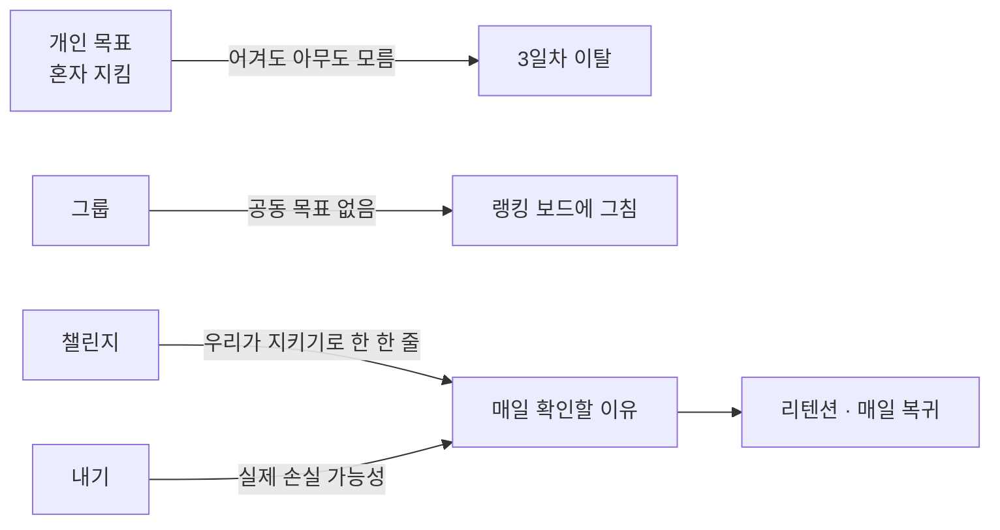
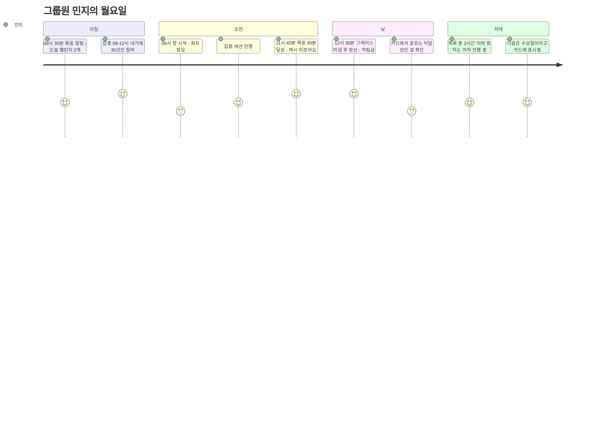
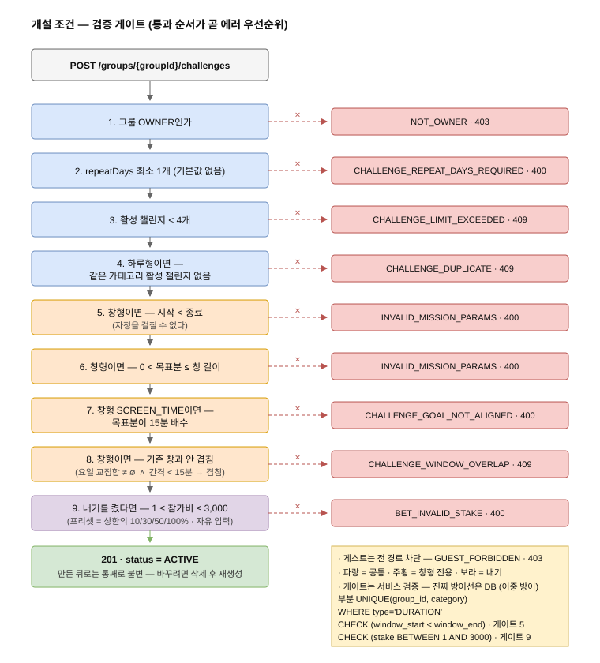
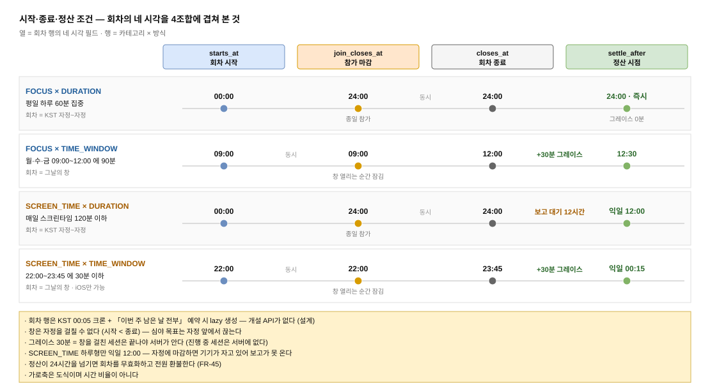
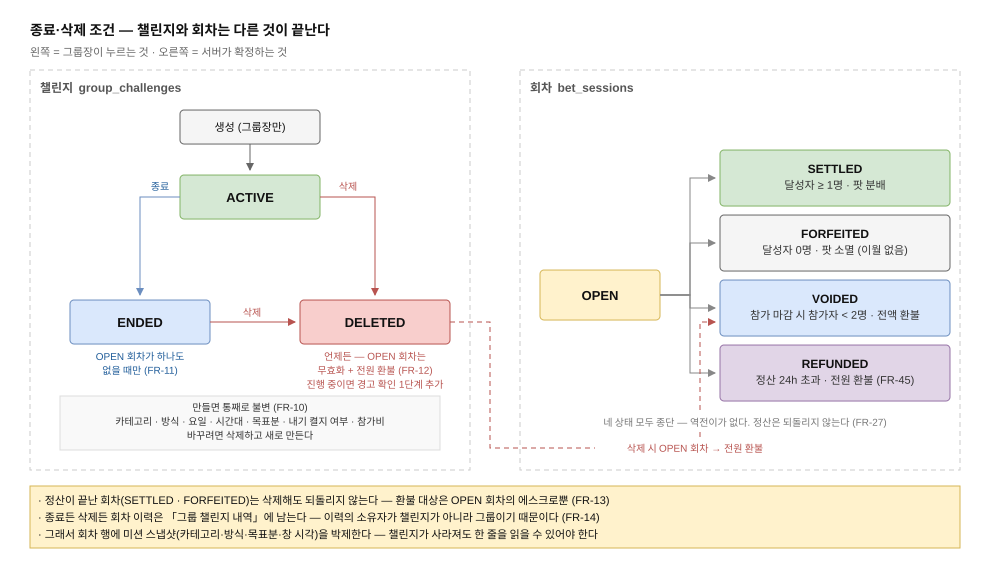
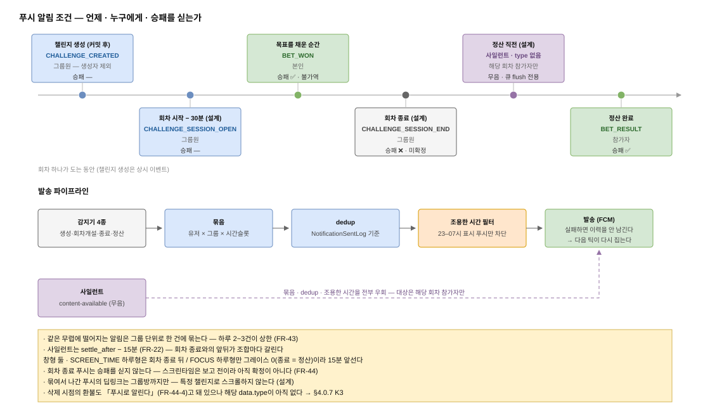
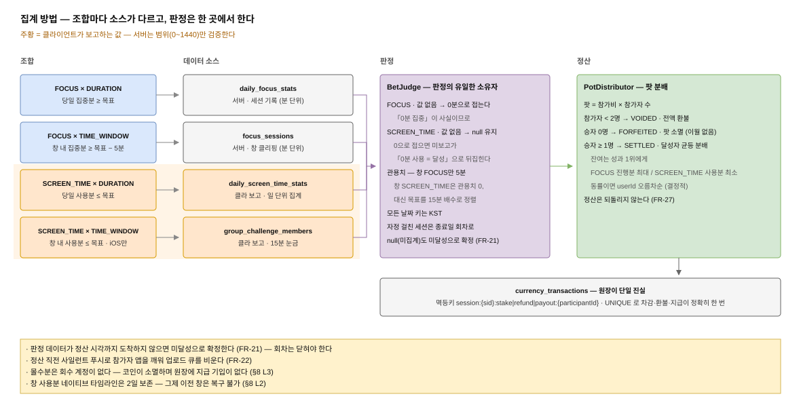
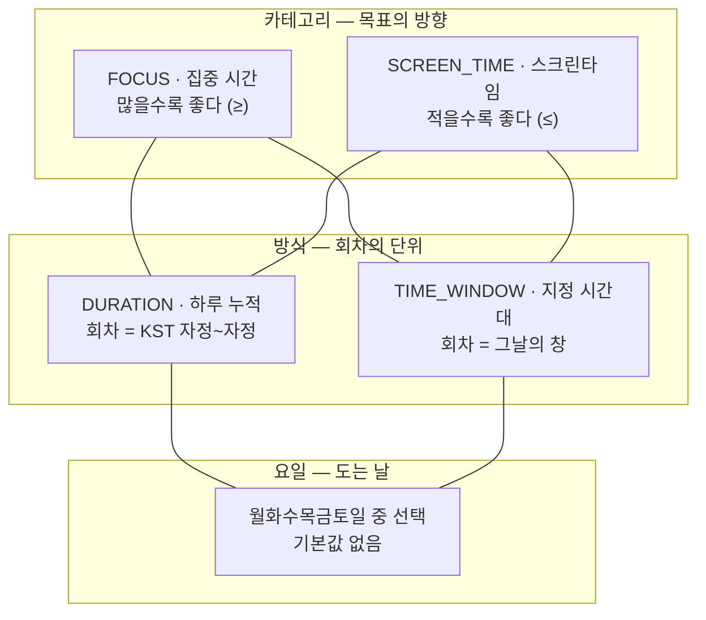
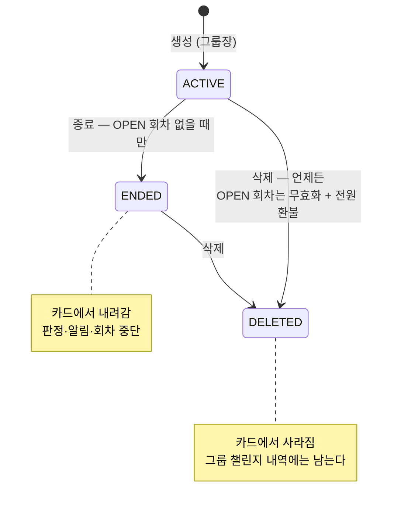
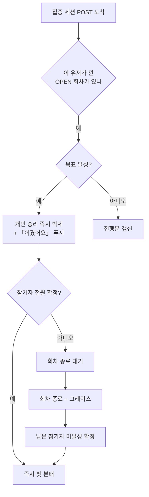

# 챌린지 (Group Challenge) — PRD

> **문서 지위**: **to-be PRD**. 2026-08-08 백지 재정의로 확정한 정책을 제품 요구사항으로 편 것이다.
>
> 정책의 *근거와 결정 로그*는 [`policy.md`](./policy.md)가 정본이고, 이 문서는 *무엇을 만드는가*를
> 기술한다. 둘이 어긋나면 `policy.md`가 맞다.
>
> 2026-08-08 이전 판(구현된 코드를 역서술한 as-is 기록)은 git 이력에 있다. 현행 코드와 이 문서의
> 차이는 `policy.md` §9에 구현 과제로 전량 정리돼 있다.
>
> | 항목 | 값 |
> |---|---|
> | 대상 기능 | 그룹 챌린지 + 챌린지 내기(베팅) |
> | 코드 위치 | `back/.../group/**`, `app/src/screens/group/**`, `app/src/services/screentimeSync.ts` |
> | 결정일 | 2026-08-08 |
> | 최종 갱신 | 2026-08-09 (**N51 하루형 목표 상한 FOCUS 18h/SCREEN_TIME 12h — 재영님 결정, K6 해소** + 코드 리뷰 8차 9건 반영: 삭제 IDOR·조기확정 FOCUS 한정·보고×정산 직렬화·구앱 bet 필드 병기 등. 직전: 7차 6건 **N49(K11 해소)·N50 권한 가드** · 사일런트 중복 제거 · usageDate↔OPEN 회차 결속 · `23:59`. K6은 재영님 결정 대기. 직전: 6차 9건 **N47(K1 해소)·N48(K3 해소)** · `GET /me/bet-sessions` 신설 · EARLY 락 내 재검증 · 전 진입점 24h 데드라인 · 부분 주간 예약 · 지갑 전역 락 · measuredAt skew · 비활성 요일 버튼. 직전: 5차 5건 N41 재정정·N43 기한·BetWonEvent·락 순서·README 표현. 직전: 팀 리뷰 **N45 다음 활성일 참여 버튼**·FR-31-1·K12 해소, **N46 잔액 표기 축약**. 같은 날 코드 리뷰 4차 3건 N43·N44, 3차 7건 N41·N42, 2차 12건 N37~N40, 1차 15건 N31~N36·K5 해소) |

---

## 1. 배경과 문제

gromo는 개인 집중 시간·스크린타임을 관리하는 앱이다. 개인 트래킹만으로는 **3일차 이탈**이 크다 —
혼자 지키는 목표는 어길 때 아무도 모른다.

그룹 기능은 "같이 하는 사람"을 붙여 이 구멍을 메우려 했지만, 그룹에 들어와도 **공동의 목표가
없으면** 단순한 랭킹 보드에 그친다. 챌린지는 그룹에 *지금 우리가 같이 지키기로 한 한 줄*을 만든다.

여기에 **내기(코인 에스크로)** 를 얹어 목표에 실제 손실 가능성을 붙였다. 손실 회피는 달성 동기 중
가장 강한 축이고, 이미 존재하는 재화 시스템(`user_wallets` / `currency_transactions`)을 재사용할 수
있다.



### 1.1 챌린지 · 내기 · 회차

계층이 셋이라 이름이 흔들리면 요구사항이 서로 다른 얘기를 하게 된다. 이 문서는 아래 뜻으로만 쓴다.

| 용어 | 뜻 |
|---|---|
| **챌린지** | 그룹의 공동 목표. 그룹원은 **아무것도 안 해도 전원이 판정 대상**이다 — 신청도 수락도 없다 |
| **내기** | 챌린지에 붙는 **설정**(켤지 여부 + 참가비). 챌린지와 **1:1**이고 생성 시 정해 이후 불변이다 |
| **회차** | 챌린지가 실제로 도는 하루. **참가·판정·정산의 단위**. 내부 용어라 화면 문구에는 쓰지 않는다(FR-9-3) |

**챌린지와 내기는 층이 다르다.**

| | 챌린지 | 내기 |
|---|---|---|
| 누가 대상인가 | **그룹원 전원** (자동) | **참가한 사람만** (매번 직접) |
| 언제 정하나 | 정할 게 없다 | **날마다** 참여할지 고른다 |
| 못 지키면 | 카드에 미달성으로 뜬다 | 그 위에 **참가비를 잃는다** |
| 없으면 | 챌린지가 성립하지 않는다 | 챌린지는 그대로 돈다 |

**판정은 내기를 걸든 안 걸든 똑같이 돌아간다.** 내기가 바꾸는 건 *판정 결과에 돈이 따라붙느냐*
하나뿐이다. 그래서 이 문서도 목표와 판정(§4.1~§4.5)을 먼저 세우고 돈(§4.6~§4.7)을 그 위에 얹는다 —
**목표가 먼저고 돈은 나중이다.**

---

## 2. 목표 / 비목표

### 2.1 목표

| # | 목표 | 근거 |
|---|---|---|
| G1 | 그룹에 **반복되는 공동 목표**를 만든다 | 재방문 이유 생성 |
| G2 | 목표 달성 여부를 **멤버 전원에게 상시 노출**한다 | 사회적 압력 = 달성 동기 |
| G3 | 목표에 **코인을 걸 수 있게** 한다 | 손실 회피 동기 + 재화 순환 |
| G4 | 판정·정산은 **서버가 확정**하고 되돌리지 않는다 | 돈이 걸린 판정의 신뢰 |
| G5 | 집중(늘리기)과 스크린타임(줄이기) **양방향 목표**를 다룬다 | 앱의 두 핵심 지표 커버 |
| G6 | **실제 생활 리듬**(평일만, 주 3회 등)을 담는다 | 매일 강제는 주말에 억울한 미달성을 만든다 |

### 2.2 비목표 (명시적 범위 밖)

- 챌린지 **수정** — 만들면 통째로 불변이다. 바꾸려면 삭제하고 새로 만든다(삭제가 자유롭다).
- 주간/월간 **누적** 챌린지 — 회차 단위는 **하루** 또는 **그날의 시간대**뿐이다.
- 그룹 간 챌린지·랭킹 — 리그가 따로 담당한다.
- 실화폐 — 코인은 인앱 재화이며 현금 환급이 없다.
- **안드로이드 창 스크린타임** — 플랫폼 한계로 불가. 미출시라 이번 범위 밖 (§8 L1).

---

## 3. 사용자와 시나리오

### 3.1 역할

| 역할 | 챌린지 | 내기 |
|---|---|---|
| **그룹장(OWNER)** | 생성 · 종료 · 삭제 (**수정 없음**) | **생성 시** 켤지 결정 · 참가비 설정 (**이후 불변**) · 회차 참여 · 참여 취소 |
| **그룹원(MEMBER)** | 조회 (판정은 자동 대상) | 회차 참여 · 참여 취소 |
| **게스트** | 전부 차단 (`GUEST_FORBIDDEN` 403) | 전부 차단 |
| **스크린타임 권한 미허용자** | SCREEN_TIME 챌린지에서 `canParticipate=false` | 사실상 참여 불가 |

**소유권에 예외가 없다.** 목표를 세우는 것도, 그 위에 돈내기를 켜는 것도 그룹장이다. 다만
**켤지 여부는 만들 때 한 번만 정하고 나중에 끄지 못한다**(FR-10) — 끄려면 삭제하고 내기 없이
다시 만든다. 그룹원은 "오늘 낄까 말까"만 결정한다.

### 3.2 핵심 시나리오



### 3.3 유저 스토리

- **US-1** 그룹장으로서, 우리 그룹이 **평일에만** 지킬 목표를 만들고 싶다 → 요일 반복 챌린지 생성
- **US-2** 그룹장으로서, 목표에 돈이 걸리게 하고 싶다 → **챌린지를 만들 때** 내기 켜기 + 참가비 설정
- **US-3** 그룹원으로서, 오늘 누가 목표를 지켰는지 한눈에 보고 싶다 → 카드 진행 리스트
- **US-4** 그룹원으로서, 오늘 회차에 낄지 매번 정하고 싶다 → 회차 참여
- **US-5** 그룹원으로서, 매번 누르기 귀찮으면 한 번에 예약하고 싶다 → 주간 일괄 참여(「이번 주 남은 날 전부」)
- **US-6** 그룹원으로서, 불리한 회차인지 알고 들어가고 싶다 → 참가 시트의 진행분 공개
- **US-7** 그룹원으로서, 시작 전이라면 마음을 바꿔 빠지고 싶다 → 참여 취소(전액 환불)
- **US-8** 그룹원으로서, 목표를 채운 순간 바로 알고 싶다 → 승리 확정 푸시
- **US-9** 그룹장으로서, 끝난 목표를 정리하되 기록은 남기고 싶다 → 챌린지 종료

---

## 4. 기능 요구사항

### 4.0 조건 한눈에

> 이 절은 **인덱스**다. 규칙의 정의는 §4.1~§4.10의 FR이고 여기서는 그것을 **조건 축**으로 다시
> 세운다. 두 곳이 어긋나면 FR이 맞다.
>
> 근거 열의 **`설계`** 는 FR에 없고 HLD·LLD에만 있는 값이라는 뜻이다 — PRD가 요구한 것이 아니라
> 구현이 정한 것이므로, 바꾸고 싶으면 FR을 먼저 세워야 한다.
>
> 다이어그램은 draw.io다. 이미지 아래 `.drawio` 링크를 열면 편집할 수 있다.

#### 4.0.1 개설(생성) 조건



*편집: [`cond-01-create-gate.drawio`](./diagrams/cond-01-create-gate.drawio)*

검사 순서가 곧 에러 우선순위다. 위에서 하나라도 걸리면 아래는 보지 않는다.

| # | 조건 | 위반 시 | 근거 |
|---|---|---|---|
| 1 | **그룹장(OWNER)만** 만든다. 게스트는 전 경로 차단 | `NOT_OWNER` 403 · `GUEST_FORBIDDEN` 403 | §3.1 · 설계 |
| 2 | 요일을 **최소 1개** 고른다 — 기본값도 프리셋도 없다 | `CHALLENGE_REPEAT_DAYS_REQUIRED` 400 | FR-4 · FR-9-1 |
| 3 | 그룹당 활성 챌린지 **최대 4개** | `CHALLENGE_LIMIT_EXCEEDED` 409 | FR-1 |
| 4 | 하루형은 **카테고리당 1개** (최대 2개) | `CHALLENGE_DUPLICATE` 409 | FR-2 |
| 5 | 창은 **`시작 < 종료`** — **자정을 걸칠 수 없다** (`22:00~01:00` 거부, `22:00~23:59` 허용) | `INVALID_MISSION_PARAMS` 400 | FR-6 |
| 6 | 창형 목표분은 **0 &lt; x ≤ 창 길이** | `INVALID_MISSION_PARAMS` 400 | FR-7 |
| 7 | 창형 SCREEN_TIME 목표분은 **15분 배수** | `CHALLENGE_GOAL_NOT_ALIGNED` 400 | FR-8 |
| 8 | 창형끼리 **`요일 교집합 ≠ ∅` ∧ `간격 &lt; 15분`** 이면 불가 (카테고리 무관) | `CHALLENGE_WINDOW_OVERLAP` 409 | FR-5 · FR-3 |
| 9 | 내기를 켰다면 참가비 **1~3,000 코인** 정수 | `BET_INVALID_STAKE` 400 | FR-29 |

만들고 난 뒤의 조건:

| 축 | 규칙 | 근거 |
|---|---|---|
| 불변성 | 카테고리·방식·요일·시간대·목표분·**내기 켤지 여부**·**참가비** 전부 불변. 수정 API를 만들지 않는다 | FR-10 |
| 내기 | 챌린지에 켜는 **상시 구조**이며 챌린지당 1개 — "개설"도 "끄기"도 없다. 끄려면 삭제하고 다시 만든다 | FR-28 · FR-10 |
| 표시 | 분 입력은 시간 환산을 병기한다 (`90분 · 1시간 30분`) | FR-9-2 |
| 참가 자격 | 스크린타임 권한 미허용자는 SCREEN_TIME 챌린지에서 `canParticipate=false` | §3.1 |

#### 4.0.2 시작 조건



*편집: [`cond-02-session-timeline.drawio`](./diagrams/cond-02-session-timeline.drawio)*

| 축 | 규칙 | 근거 |
|---|---|---|
| 회차가 서는 날 | 챌린지의 **활성 요일마다** 자동으로 선다. 비활성 요일에는 서지 않는다 | FR-30 · FR-9 |
| 회차 행 생성 | KST **00:05 보증 크론** + 주간 일괄 참여 예약 시 lazy 생성 — 개설 API가 없다 | 설계 |
| 회차 시작 | 하루형 **KST 00:00** / 창형 **창 시작** | §4.1 · 설계 |
| 참가 마감 | 창형 **창 시작 전** / 하루형 **회차 종료까지(종일)** | FR-33 |
| 참가 방법 | 회차마다 직접 참여. 주간 일괄 참여 단축 제공 (화면 문구 「이번 주 남은 날 전부」). **비활성 요일에도 「다음 활성일 1건」 참여 버튼** | FR-31 · FR-31-1 |
| 에스크로 | 예약분은 **즉시 전액 차감**. 잔액 부족 시 예약 버튼 비활성 | FR-32 |
| 무위험 차단 | FOCUS 이미 달성 → `BET_ALREADY_ACHIEVED` / SCREEN_TIME 이미 초과 → `BET_ALREADY_FAILED` | FR-35 |
| 차단하지 않는 것 | 남은 시간 부족(`남은 시간 &lt; 목표분 − 내 진행분`)은 **경고만** — 앱이 응답값으로 파생 | FR-35-1 |
| 정보 공개 | 하루형 참가 시트는 기존 참가자의 **현재 진행분**을 공개 | FR-34 |
| 회차 성립 | 참가 마감 시점에 참가자가 **1명뿐이면 무산** + 전액 환불 | FR-36 |
| 참여 취소 | `시작 전 참가 → 회차 시작까지` · `시작 후 참가(하루형) → min(참가+5분, 회차 종료)` → 전액 환불 | FR-39 |
| 그룹 탈퇴 | 취소와 **같은 규칙**. 시작된 회차는 정산 대상 유지, 명단엔 "탈퇴한 사용자" | FR-40 |

#### 4.0.3 종료 조건

| 무엇이 끝나나 | 조건 | 근거 |
|---|---|---|
| **챌린지 → ENDED** | **OPEN 회차가 하나도 없을 때만** — 남의 돈이 걸린 회차를 조용히 마감하는 경로를 주지 않는다. 위반 시 `CHALLENGE_END_BLOCKED` 409 | FR-11 |
| 회차 종료 | 하루형 **KST 24:00** / 창형 **창 종료** — 창은 자정을 걸칠 수 없어 **항상 회차일 안에서 닫힌다** | §4.1 · FR-6 · 설계 |
| 그레이스 | 창형 **30분** / FOCUS 하루형 **0분** / SCREEN_TIME 하루형은 익일 12:00로 대체 | FR-24 · FR-25 |
| 정산 시점 | FOCUS×DURATION 자정 즉시 · FOCUS×WINDOW 창+30분 · SCREEN_TIME×WINDOW 창+30분 · SCREEN_TIME×DURATION **익일 12:00** | FR-24 |
| 조기 정산 | **참가자 전원 확정** 시 회차 종료를 기다리지 않고 즉시 팟 분배 | FR-23 · FR-24 |
| 안전망 | **정산** 안전망 크론은 이벤트 경로가 안 돌았을 때만 일한다 (`0 */5 * * * *` · 5분 주기) — 주 경로가 아니다 | FR-26 · 설계 |
| 강제 종료 | 정산 실패가 **24시간**을 넘기면 회차 무효화 + 전원 환불 | FR-45 · FR-46 |
| 불가역 | 마감 이후 도착한 기록은 반영하지 않는다 | FR-27 |

#### 4.0.4 삭제 조건



*편집: [`cond-03-lifecycle-state.drawio`](./diagrams/cond-03-lifecycle-state.drawio)*

| 축 | 규칙 | 근거 |
|---|---|---|
| 시점 | **언제든** — ACTIVE·ENDED 어느 상태에서도 | FR-12 |
| OPEN 회차 | **무효화 + 전원 환불** (접는 행위에 붙은 대가) | FR-12 |
| 확인 단계 | 진행 중 아니면 **1단계** / **진행 중이면 경고 확인 1단계 추가** — 사라지는 것을 **수치로**(참여 인원·적립금) 보여준다. 버튼은 `삭제` / `그만두기` | FR-12-1 |
| 정산된 회차 | 건드리지 않는다. 환불 대상은 **OPEN 회차의 에스크로뿐** | FR-13 |
| 이력 | 「그룹 챌린지 내역」에 남는다 — 이력의 소유자가 **챌린지가 아니라 그룹** | FR-14 |
| 스냅샷 | 회차 행에 카테고리·방식·목표분·창 시각을 박제 | FR-14 |
| 통지 | 삭제 시점의 환불은 **푸시로 알린다** | FR-44-4 → K3 |

#### 4.0.5 푸시 알림 조건



*편집: [`cond-04-notify-timeline.drawio`](./diagrams/cond-04-notify-timeline.drawio)*

| 종류 | `data.type` | 시점 | 대상 | 승패 | 근거 |
|---|---|---|---|---|---|
| 챌린지 생성 | `CHALLENGE_CREATED` | 생성 이벤트 (AFTER_COMMIT) | 그룹원 (생성자 제외) | — | FR-43 |
| 회차 참여 모집 | `CHALLENGE_SESSION_OPEN` | 회차 시작 **− 30분** | 그룹원 | — | FR-43 · 설계 |
| 회차 종료 / 하루 마감 | `CHALLENGE_SESSION_END` | 회차 종료 (**알림** 감지 크론 · 15분 주기) | 그룹원 | **❌ 싣지 않는다** | FR-43 · FR-44 |
| 승리 확정 | `BET_WON` | 목표를 채운 순간 | 본인 | ✅ | FR-43 |
| 결과 | `BET_RESULT` | 정산 완료 | 참가자 | ✅ | FR-43 |
| **무효화 환불** | **`BET_VOID_REFUND`** | **회차 무효화 + 환불 커밋 직후** (챌린지 삭제 · 인원 미달 무산 · 24h 자동 환불) | 해당 회차 참가자 | ✅ | FR-44-4 · **K3 해소** |
| 사일런트 | — | 정산 직전 (`settle_after` − 15분) | 해당 회차 참가자 | 무음 | FR-22 · 설계 |

> **`BET_VOID_REFUND`가 없으면 삭제 환불이 무음이다.** FR-44-4는 삭제된 챌린지의 회차를 결과
> 모달에서 빼고 **푸시로 알린다**고 약속하는데, 타입이 정의되지 않으면 구현이 그 푸시를 만들
> 수 없다 — 유저는 설명 없이 코인만 돌아온 걸 본다. 사유는 `data.voidReason`
> (`CHALLENGE_DELETED` · `INSUFFICIENT_PARTICIPANTS` · `REFUND_DEADLINE`)로 구분해 문구를 고른다 —
> 회차에 영속된 **종료 사유**를 그대로 싣는다(N55, N33 확장).

| 발송 규칙 | 내용 | 근거 |
|---|---|---|
| 묶음 | 같은 무렵 알림은 **그룹 단위 한 건**으로. 하루 2~3건이 상한 | FR-43 |
| 묶음 단위 | 묶음 = (유저 × 그룹 × 시간슬롯) · **dedup은 사건 단위 (유저 × kind × 대상 id)** — 클레임은 사건마다, 푸시는 슬롯마다 (N41) | 설계 |
| 실패 | 발송 전 슬롯 선점(`PENDING`) → 성공 시 `SENT`, 실패 시 선점 해제 → 다음 틱이 다시 집는다 (발송 후 기록 방식은 다중 인스턴스에서 이중 발송) | 설계 |
| 조용한 시간 | 유저가 정한 야간 구간(기본 23–07)은 **표시 푸시만** 차단하되 **버리지 않고 그 구간 종료 시각으로 이월**(N44) — 하루형은 자정 정산이라 폐기하면 결과 알림이 영구 침묵한다. **단 이월 시점에 행동할 수 없게 되는 것만 버린다** — 참여 모집은 종료 시각에 이미 참가 마감이면 버리고, 아직 참가할 수 있으면 이월한다(종류가 아니라 건별 판정). 사일런트는 예외(즉시) | 설계 |
| 딥링크 | 묶여 나간 푸시는 **그룹방까지만** — 특정 챌린지로 스크롤하지 않는다 | 설계 |

**결과 모달**(푸시가 아닌 인앱 트리거) — 그룹방 진입 시, 내가 참가자였던 회차 중 결과를 안 본 것을
회차일 내림차순 순차 큐로. 1회 가드는 **세션 id** 기준. 대상은 `SETTLED`·`FORFEITED`·`VOIDED`·
`REFUNDED` 전부이며, 내가 참가하지 않은 회차·내기가 꺼진 챌린지·정산 전 회차·삭제된 챌린지의
회차는 띄우지 않는다. 데이터는 `GET /me/challenge-results` 1건(내가 참가한 정산 완료 회차,
최신순 · 최근 30일 · 최대 10건)로 충분하다 — 날짜를 따로 부르지 않는다. 종료(ENDED)된
챌린지의 회차도 결과 조립에 포함된다(카드만 안 그린다 — N38). (FR-44-1 ~ FR-44-4)

#### 4.0.6 집계 방법 — 4조합 종합



*편집: [`cond-05-aggregation-pipeline.drawio`](./diagrams/cond-05-aggregation-pipeline.drawio)*

| 축 | FOCUS × DURATION | FOCUS × TIME_WINDOW | SCREEN_TIME × DURATION | SCREEN_TIME × TIME_WINDOW |
|---|---|---|---|---|
| 회차 범위 | KST 자정~자정 | 그날의 창 | KST 자정~자정 | 그날의 창 |
| 데이터 출처 | **서버** — 세션 기록 | **서버** — 세션 창 클리핑 | **클라 보고** | **클라 보고** |
| 측정 정밀도 | 분 단위 | 분 단위 | 일 단위 집계 | **15분 눈금** |
| 달성 조건 | 당일 집중분 **≥** 목표 | 창 내 집중분 **≥** 목표 − 5 | 당일 사용분 **≤** 목표 | 창 내 사용분 **≤** 목표 |
| 관용치 | 0분 | **5분** | 0분 | 0분 (목표를 15분 배수로 정렬) |
| 값 없음 처리 | **0으로 접는다** | 0으로 접는다 | **`null` 유지** | `null` 유지 |
| 판정 시점 | 세션 POST 도착마다 | 세션 POST 도착마다 | 정산 시점 일괄 (설계) | 정산 시점 일괄 (설계) |
| 정산 시점 | KST 자정 즉시 | 창 종료 + 30분 | **익일 12:00** | 창 종료 + 30분 |
| 그레이스 | 0분 | 30분 | — | 30분 |
| 참가 차단 | `BET_ALREADY_ACHIEVED` | `BET_ALREADY_ACHIEVED` | `BET_ALREADY_FAILED` | `BET_ALREADY_FAILED` |
| 잔여 코인 | 진행분이 가장 **큰** 승자 | 진행분이 가장 **큰** 승자 | 사용분이 가장 **작은** 승자 | 사용분이 가장 **작은** 승자 |
| 플랫폼 | iOS · Android | iOS · Android | iOS · Android | **iOS만** (§8 L1) |

근거: 회차 범위·출처 §4.1 · 달성 조건 FR-17 · 관용치 FR-18 · 값 없음 FR-15·FR-16 ·
판정/정산 시점 FR-23·FR-24 · 참가 차단 FR-35 · 잔여 FR-37.

조합과 무관한 공통 규칙:

| 축 | 규칙 | 근거 |
|---|---|---|
| 시간대 | 모든 판정과 저장이 **KST 고정**. 통계 저장 일자도 KST | FR-19 |
| 세션의 자정 걸침 | 자정을 걸친 **집중 세션**은 **종료일 회차**에 잡힌다. 카드와 정산이 같은 규칙 (창이 자정을 걸치는 것과는 다른 얘기다 — 창은 FR-6으로 금지) | FR-20 |
| 미도착 | 정산 시각까지 데이터가 안 오면 **미달성으로 확정** | FR-21 |
| 미도착 대비 | 정산 직전 사일런트 푸시로 앱을 깨워 업로드 큐를 비운다 | FR-22 |
| 팟 | `팟 = 참가비 × 참가자 수` · 달성자 균등 분배 + 잔여는 성과 1위 (동률이면 `userId` 오름차순) | FR-37 |
| 달성자 0명 | **전액 소멸** — 환불도 이월도 없다 | FR-38 |
| 정합성 | 환불은 어떤 경로 조합에서도 **정확히 한 번**. 멱등키 축은 **참가 행 id** | FR-41 · FR-42 |

#### 4.0.7 미정의 · 문서 간 불일치 — **전부 해소 (2026-08-09)**

조건을 한 표로 모으는 과정에서 값이 하나로 정해지지 않았던 지점들이다. **K1~K12 전부 닫혔다** —
아래는 무엇이 어긋났고 어떻게 정했는지의 이력이다(같은 논쟁이 다시 열리면 여기부터 본다).
새 불일치가 생기면 `K13`부터 이어 적는다.

| # | 축 | 내용 |
|---|---|---|
| K1 | 시작 | ~~**무산 판정 시각**. FR-36·HLD·IA는 "참가 마감 시 &lt;2명", LLD는 `settle()` 안(= `settle_after` 이후) — 창형은 그 사이 OPEN으로 남는다~~ → **해소** (2026-08-09 6차 리뷰, policy N47). 참가 마감을 지난 인원 미달 회차를 5분 크론이 집어 **즉시 무산·환불**한다. `settle()` 안의 가드는 안전망으로 잔류 |
| K2 | 정산 | ~~**조기 정산 전제**. FR-24는 조건 2개인데 LLD는 `now ≥ join_closes_at`를 필수 전제로 추가~~ → **해소** (2026-08-09). FR-24 ①에 **참가 마감 이후**를 명시하고 "조기 정산은 창형에서만 발동"을 본문에 적었다 (N32) |
| K3 | 알림 | ~~**삭제 환불 푸시 타입 부재**. FR-44-4는 "푸시로 알린다"인데 FR-43 표·감지기 목록 어디에도 해당 `data.type`이 없다~~ → **해소** (2026-08-09 6차 리뷰, policy N48). **`BET_VOID_REFUND`** 신설 + `VoidRefundDetector` 추가, 사유는 `data.voidReason`으로 구분 |
| K4 | 알림 | ~~**사일런트 2회 중복**. `settle_after`−15분(11:45)과 11:30 규칙이 SCREEN_TIME 하루형에서 겹친다~~ → **해소** (2026-08-09 7차 리뷰). **SCREEN_TIME 하루형을 `settle_after`−15분 규칙에서 제외**하고 11:30 하나만 남겼다 (HLD §6 슬롯 표) |
| K5 | 결과 | ~~**`VOIDED` 모달**. FR-44-3·LLD는 대상에 포함, IA는 `lastSettledSession` 정의에서 제외~~ → **해소** (2026-08-09 리뷰). 모달 큐가 `mySettledSessions`로 바뀌며 `VOIDED` **포함**으로 통일 — IA 정의도 맞춤 |
| K6 | 개설 | ~~**하루형 목표분 상한 — 세 문서가 어긋난다**. DB `1~1440` / UX "최대 3시간" / policy 무규정~~ → **해소** (2026-08-09 재영님 결정, policy **N51**·§A6-bis). **FOCUS 18시간(1,080분) · SCREEN_TIME 12시간(720분)** — DB 제약·검증표·FR-9-2·UX 카피 전부 이 값으로 통일 |
| K7 | 개설 | ~~참가비 불변 vs 내기 끄기~~ → **해소** (policy N26). 내기는 생성 시 정하고 **이후 끄지 못한다**. 끄는 경로가 없으므로 "껐을 때 OPEN 회차·에스크로를 어떻게 하나"라는 질문 자체가 성립하지 않는다 — 끄고 싶으면 삭제(무효화 + 전원 환불) 후 재생성이다 |
| K8 | 개설 | ~~`canParticipate=false`(스크린타임 권한 미허용)가 이 PRD에만 있고 정본(policy)에 없다~~ → **해소** (2026-08-09 7차 리뷰, policy **N50**). 권한 규칙이 정본에 들어왔고, 표시(`canParticipate`)와 **서버 가드**(`BET_SCREENTIME_PERMISSION_REQUIRED`)의 역할도 분리해 정의했다 |
| K9 | 참조 | ~~policy §8이 `FR-1`·`FR-7`·`FR-13` 등을 **옛 뜻으로** 인용~~ → **해소** (2026-08-09). policy §8 표를 **`구 FR-*`** 표기로 바꾸고, 2026-08-08 이전 번호임을 표 머리에 명시했다 |
| K10 | 참조 | ~~알려진 한계 번호가 한 칸 어긋남 (policy §9.4 vs 이 문서 §8)~~ → **해소** (2026-08-09). 두 목록을 **L1~L7 동일 축**으로 통일했다(위조·해외 유저·5분 유예 어뷰징 항목 상호 보완). 항목 추가 시 양쪽을 같이 고친다 |
| K11 | 삭제 | ~~**진행 중 삭제 경고의 수치 출처**. 카드 조회의 `bet.session`은 오늘 회차 1건뿐이라 예약된 미래 회차가 덮이지 않는다~~ → **해소** (2026-08-09 7차 리뷰, policy N49). `GET …/deletion-preview` 프리플라이트 신설 — OPEN 회차 전부의 날짜·인원·적립금 + 총 환불액 |
| K12 | 참여 | ~~**비활성 요일의 "다음 회차 미리 참여" 버튼**~~ → **해소** (2026-08-09 팀 리뷰 → 재영님 결정, policy N45). **준다** — 다음 활성일 **1건**만, 전용 경로 `join-next`. ① 범위=다음 회차 1건(주간 일괄은 `join-week` 그대로) ② `join-week` 버튼 숨김 규칙(남은 회차 ≤1)과 무관하게 단건 버튼은 다음 회차 미참가면 노출 ③ N14와 상충 없음 — 회차 단위로 직접 누르는 동작이다 |

---

### 4.1 챌린지의 형태

챌린지는 **카테고리 × 방식 × 요일**의 곱이다.



| 조합 | 예시 문장 | 달성 조건 | 데이터 신뢰 |
|---|---|---|---|
| FOCUS × DURATION | 평일 하루 60분 집중 | 당일 집중분 **≥** 60 | 서버 (세션 기록) |
| FOCUS × TIME_WINDOW | 월·수·금 09:00~12:00에 90분 집중 | 창 내 집중분 **≥** 90 − 5(관용치) | 서버 (세션 클리핑) |
| SCREEN_TIME × DURATION | 매일 스크린타임 120분 이하 | 당일 사용분 **≤** 120 | 클라 보고 |
| SCREEN_TIME × TIME_WINDOW | 일~목 22:00~23:59에 30분 이하 | 창 내 사용분 **≤** 30 | 클라 보고 (**iOS만**) |

**FR-1** 그룹당 활성 챌린지는 **최대 4개**.
**FR-2** 하루형(DURATION)은 **카테고리당 1개** — 최대 2개.
**FR-3** 창형(TIME_WINDOW)은 겹치지 않으면 여러 개 (FR-1 상한 내에서).
**FR-4** 요일은 **반드시 하나 이상** 골라야 한다. 기본값이 없다.
**FR-5** 창형끼리는 **`요일 교집합 ≠ ∅` 이고 `시간대 간격 < 15분`** 이면 만들 수 없다
  (카테고리 무관 — 같은 시간의 행동 하나로 목표 두 개를 동시에 달성하는 중복 보상 차단).
**FR-6** 창은 **자정을 걸칠 수 없다.** `시작 < 종료`를 강제한다 — `22:00~01:00`은 거부하고
  `22:00~23:59`는 허용한다. 요일이 회차를 가르는 축인데 회차가 요일 경계를 넘으면 판정일·겹침
  검사·정산 귀속이 전부 모호해진다. 심야 목표는 자정 앞에서 끊거나, 자정 이후 구간을 **다음 날
  요일의 별도 챌린지**로 만든다.
**FR-7** 창형 목표분은 **0 < x ≤ 창 길이**.
**FR-8** **SCREEN_TIME 창의 목표분은 15분 배수**여야 한다 (네이티브 15분 눈금과 경계 정렬).
**FR-9** 비활성 요일에는 진행률을 재지 않고, 마감 알림도 보내지 않으며, 내기 회차도 서지 않는다.
**FR-9-1** 요일은 7개 배지를 **직접** 고른다. 「매일 / 평일 / 주말」 같은 프리셋을 두지 않는다 —
  누르는 손이 곧 "언제 도는지"를 의식하는 절차다.
**FR-9-2** 분 단위 입력은 **시간으로 환산해 함께 보여준다**(`90분 · 1시간 30분`). 상한도 같은
  단위로 쓴다 — **하루형 FOCUS `최대 18시간` · 하루형 SCREEN_TIME `최대 12시간`**(N51),
  창형은 창 길이가 상한이다. 목표가 커질수록 "분"만으로는 감이 오지 않는다.
**FR-9-3** **"회차"는 내부 용어다 — 화면 문구에 쓰지 않는다.** 유저에게 회차는 결국 *그 챌린지가
  도는 하루*고, 그건 날짜와 요일이 이미 다 말해준다. 문서·API·DB(`..._bet_sessions`)는 회차/
  session을 그대로 쓰되 화면 카피에서만 걷어낸다.

| 자리 | 쓰지 않음 | 대신 |
|---|---|---|
| 참여 버튼 | `이번 회차 참여` | `오늘(월) 참여` |
| 비활성 요일 | `다음 회차 수요일` | `다음은 수요일` |
| 결과 모달 | `8/10(월) 회차 결과` | `8/10(월) 결과` |
| 마감 안내 | `회차 마감` | `오늘 마감` |

**FR-9-4** 참여를 무르는 버튼 문구는 **`참여 취소`** 다. 그냥 `취소`는 시트를 닫는 버튼과
  헷갈린다 — 돈이 빠져나가는 행동이라 **무엇을** 취소하는지가 버튼에 드러나야 한다. 시트를 닫는
  버튼은 그대로 `닫기` / `그만두기`를 쓴다.

### 4.2 챌린지 라이프사이클



**FR-10** 챌린지는 **수정할 수 없다.** 카테고리·방식·요일·시간대·목표분·**내기 켤지 여부**·
  참가비 전부 불변이다. 바꾸려면 삭제하고 새로 만든다.
  **내기를 나중에 끄는 경로도 두지 않는다** — 끄는 순간 이미 참가비를 낸 회차의 돈을 어떻게 할지가
  남는데, 그건 사실상 삭제(무효화 + 전원 환불)와 같은 일이다. 같은 결과를 내는 경로를 둘 두면
  규칙만 늘어난다. 끄고 싶으면 **삭제하고 내기 없이 다시 만든다.**
**FR-11** **종료**는 OPEN 회차가 없을 때만 가능하다 — 남의 돈이 걸린 회차를 조용히 마감하는 경로를
  주지 않는다. OPEN 회차가 하나라도 있으면(**예약된 미래 회차 포함**) `CHALLENGE_END_BLOCKED`
  409로 막고, 언제까지 기다려야 하는지를 문구에 담는다.
**FR-12** **삭제**는 언제든 가능하되, OPEN 회차가 있으면 **무효화하고 전원에게 환불**한다.
  접는 행위에 대가를 붙인 것이다.
**FR-12-1** **진행 중(OPEN 회차 있음) 삭제는 경고 확인을 한 단계 더** 거친다. 남의 진행과 돈을
  되돌리는 행동이 오탭 한 번으로 일어나서는 안 된다.

| 상태 | 삭제 확인 |
|---|---|
| 진행 중 아님 | 일반 확인 **1단계** |
| **진행 중** | **경고 확인 1단계 추가** — 무엇이 사라지는지 **수치로** 보여준다 |

  경고에는 **지금 무슨 일이 일어나는지를 숫자로** 담는다 — 걸려 있는 회차의 **날짜·참여 인원**과
  **돌아가는 적립금**이다. "정말 삭제할까요?"만 띄우면 읽지 않는다.
  **진행 중이 아니면 이 단계를 넣지 않는다** — 위험하지 않은 행동까지 두 번 물으면 경고가 의미를
  잃고 정작 위험할 때도 그냥 누르게 된다.
  버튼 문구는 확인 `삭제` · 이탈 `그만두기`다. `확인`은 무엇을 확인하는지 말해주지 않고, 여기서
  `취소`를 쓰면 **참여 취소**(FR-9-4)와 겹친다.
**FR-13** 이미 정산이 끝난 회차는 삭제로 되돌리지 않는다. 환불 대상은 `OPEN` 회차의 에스크로뿐이다.
**FR-14** 종료·삭제 어느 쪽이든 회차 이력은 **그룹 챌린지 내역**에 남는다 — 이력의 소유자가
  챌린지가 아니라 **그룹**이기 때문이다. 이를 위해 회차 행에 미션 스냅샷(카테고리·방식·목표분·
  창 시각)을 박제한다.

### 4.3 카드 — 요일·다음 회차·3상 진행률

카드는 멤버별 진행을 보여준다. **0과 "값 없음"을 절대 뭉개지 않는다.**

| 상태 | 표기 | 의미 |
|---|---|---|
| `achieved = true` | `달성 ✓` (초록 칩) | 확정 달성 |
| `progressMinutes` 값 | `32/60분` | 진행 중 |
| `progressMinutes = null` | `—` (옅은 회색) | **미집계** — 0분과 완전히 다르다 |

**FR-15** FOCUS는 데이터가 없으면 "0분 집중"이 사실이므로 0으로 접는다.
**FR-16** SCREEN_TIME은 "0분 사용"과 "보고 안 됨"을 구분할 수 없으므로 `null`로 남긴다. 이걸 0으로
  접으면 **미보고가 "0분 사용 = 달성"으로 뒤집힌다.** 저장 단계에서부터 구분한다.
**FR-16-1** 카드는 **요일 배지**와 **다음 회차의 날짜·시각**을 **상시** 노출한다. 요일 반복이
  생긴 이상 "언제 도는 챌린지인지"를 모르면 카드를 읽을 수 없다 — 진행률만으로는 오늘 안 도는
  카드가 왜 비어 있는지 설명되지 않는다.
**FR-16-2** **비활성 요일에는 카드가 가라앉는다.** 카드를 감추지는 않되(그룹이 "우리가 지키기로
  한 것"의 전체 모습을 항상 봐야 한다) 진행 리스트 자리를 `다음 8/12(수) 09:00` 안내로 바꾸고
  카드 전체를 옅게 처리한다. 오늘 도는 카드와 쉬는 카드가 한눈에 갈려야 한다.

### 4.4 판정

**FR-17** FOCUS는 `회차 내 집중분 ≥ 목표분`, SCREEN_TIME은 `회차 내 사용분 ≤ 목표분`.
**FR-18** 관용치는 **측정 정밀도의 함수**다.

| 조합 | 측정 정밀도 | 관용치 |
|---|---|---|
| FOCUS × TIME_WINDOW | 서버 세션 클리핑 (분 단위) | **5분** |
| FOCUS × DURATION | 서버 세션 기록 (분 단위) | 0분 |
| SCREEN_TIME × TIME_WINDOW | 15분 눈금 | 0분 — 대신 목표를 눈금에 정렬(FR-8) |
| SCREEN_TIME × DURATION | 일 단위 집계 | 0분 |

**FR-19** 모든 판정과 저장은 **KST 고정**이다. 통계 저장 일자도 KST를 쓴다.
**FR-20** 자정을 걸친 집중 세션은 **종료일 회차**에 잡힌다. 카드와 정산이 같은 규칙을 쓴다.
**FR-21** 판정 데이터가 정산 시각까지 도착하지 않으면 **미달성으로 확정**한다.
**FR-22** 정산 직전 **사일런트 푸시**로 참가자 앱을 깨워 업로드 큐를 비운다.

### 4.5 정산 시점



**FR-23** FOCUS는 세션이 도착할 때마다 판정하고, **목표를 채운 순간 개인 승리를 확정**한다(불가역).
**FR-24** 팟 분배 트리거는 **① 참가 마감 이후 + 참가자 전원 확정** 또는 **② 회차 종료 + 그레이스**.
  ①에 **참가 마감**이 붙는 이유: 하루형은 참가 마감이 자정(=회차 종료)이라 "전원 확정"이
  성립해도 **아직 들어올 사람이 남아 있다** — 마감 전에 정산하면 오후 참여자가 막힌다.
  결과적으로 조기 정산은 **창형에서만** 발동한다(policy N32 · LLD §5.1).

| 조합 | 정산 시점 | 그레이스 |
|---|---|---|
| FOCUS × DURATION | KST 자정 즉시 | 0분 |
| FOCUS × TIME_WINDOW | 창 종료 + 30분 | 30분 |
| SCREEN_TIME × TIME_WINDOW | 창 종료 + 30분 | 30분 |
| SCREEN_TIME × DURATION | 익일 12:00 | — |

**FR-25** 창형에 30분 그레이스를 두는 이유: 창을 걸친 세션(11:30~12:30, 창은 09:00~12:00)은
  **끝나야 서버가 안다**. 그레이스 0이면 창 안에서 집중한 30분이 통째로 사라진다.
**FR-26** 배치 크론은 위 이벤트 경로가 안 돌았을 때의 **안전망**이다 (주 경로가 아니다).
**FR-27** 정산은 **되돌리지 않는다**. 마감 이후 도착한 기록은 반영되지 않는다.

### 4.6 내기

**FR-28** 내기는 그룹장이 챌린지에 켜는 **상시 구조**다. 챌린지당 내기 1개. "개설"이라는 행위가
  없고, **"끄기"라는 행위도 없다** — 켤지 여부는 챌린지를 만들 때 정하고 이후 불변이다(FR-10).
**FR-29** 참가비는 **1~3,000 코인** 정수. 앱은 프리셋 칩 4개 + 자유 입력을 준다.
  프리셋은 절대값이 아니라 **상한 대비 비율(10 / 30 / 50 / 100%)** 로 정의한다 —
  현재 상한 3,000 기준으로 **300 / 900 / 1,500 / 3,000**이다. 비율로 적어 두면 상한이 다시
  바뀌어도 프리셋의 정의는 그대로고 값만 따라온다.
**FR-30** 챌린지의 활성 요일마다 **회차가 자동으로 선다.**
**FR-31** 참여는 회차마다 직접 한다. **주간 일괄 참여** 단축을 제공한다 — 화면 문구는
  「이번 주 남은 날 전부」다(FR-9-3에 따라 버튼에 "회차"를 쓰지 않는다).
**FR-31-1** **오늘이 비활성 요일이어도 「다음 활성일 참여」 버튼을 제공한다** (N45).
  대상은 **다음 활성일 1건**이며(주간 일괄은 FR-31 그대로), 버튼 문구는 날짜로 쓴다 —
  「8/12(수) 참여하기」. 이미 예약했으면 버튼 대신 예약 상태를 보여준다. 에스크로(FR-32)·
  취소 창(FR-39)·무위험 차단 예외(미래 회차는 진행분이 없어 검사하지 않는다)는 예약분 규칙을
  그대로 따른다.
**FR-32** 예약분은 **즉시 전액 에스크로** 차감한다. 잔액 부족 시 예약 버튼이 비활성화된다.
  참가 시트 표기는 **「참가비 N · 내 잔액 M」** 까지 — 차감 후 값은 병기하지 않는다 (N46).
**FR-33** 참가 마감 —

| 방식 | 참가 마감 |
|---|---|
| 창형 | **창 시작 전** |
| 하루형 | **회차 종료까지 (종일)** |

**FR-34** 하루형 참가 시트는 **기존 참가자의 현재 진행분을 공개**한다.
**FR-35** 무위험 참가 차단 — FOCUS는 이미 달성 시 `BET_ALREADY_ACHIEVED`,
  SCREEN_TIME은 이미 목표 초과 시 `BET_ALREADY_FAILED`.
**FR-35-1** **남은 시간이 부족한 경우는 차단하지 않고 경고만** 한다
  (`남은 시간 < 목표분 − 내 진행분`). 확정된 결과(이미 초과)와 불리한 조건(시간 부족)은 다르다 —
  차단하면 사람마다 참가 마감이 달라져 설명할 수 없는 화면이 된다. 앱이 응답값으로 파생한다.
**FR-36** 참가 마감 시점에 참가자가 **1명뿐이면 회차를 무산**시키고 전액 환불한다.

### 4.7 팟과 정산

```
팟 = 참가비 × 참가자 수
```

**FR-37** 달성자끼리 **균등 분배**. 나머지 잔여 코인은 **성과 1위**에게 몰아준다.
  - FOCUS → 진행분이 가장 **큰** 승자 / SCREEN_TIME → 사용분이 가장 **작은** 승자
  - 동률이면 `userId` 오름차순 첫 승자 (결정적 선택)
**FR-38** 달성자 0명 → **전액 소멸**. 환불하지 않고 **다음 회차로 이월하지도 않는다.**
**FR-39** 취소 가능 조건은 `시작 전 참가 → 회차 시작까지` · `시작 후 참가(하루형) → min(참가+5분, 회차 종료)`이며 전액
  환불한다. **5분 유예**가 필요한 이유: 하루형은 회차 시작이 자정이라 당일 참가자에게는
  "시작 전"이 영영 오지 않는다 — 오탭으로 코인이 빠지고 되돌릴 수 없는 상태를 막는다.
  `회차 종료 전` 상한이 필요한 이유: 23:58 참가자의 유예가 자정을 넘겨 정산 도중에 취소가
  들어오는 것을 막는다.
**FR-40** **그룹 탈퇴도 취소와 같은 규칙**을 따른다 — 시작 전 회차는 환불, 시작된 회차는 정산 대상
  유지(판정도 지급도 그대로). 명단에는 "탈퇴한 사용자"로 표기한다.
**FR-41** 환불은 어떤 경로 조합에서도 **정확히 한 번** 일어난다.
**FR-42** 참가비 차감의 멱등키 축은 **참가 행 id** (유저 id 아님) — 취소 → 재참여 회차가 키에서
  갈려야 한다.

### 4.8 알림

**FR-43** 같은 무렵에 떨어지는 알림은 **그룹 단위로 한 건에 묶어** 보낸다. 하루 2~3건이 상한이다.

| 종류 | `data.type` | 시점 | 대상 | 승패 |
|---|---|---|---|---|
| 챌린지 생성 | `CHALLENGE_CREATED` | 생성 이벤트(AFTER_COMMIT) | 그룹원 (생성자 제외) | — |
| 회차 참여 모집 | `CHALLENGE_SESSION_OPEN` | 회차 시작 전 | 그룹원 | — |
| 회차 종료 / 하루 마감 | `CHALLENGE_SESSION_END` | 회차 종료 | 그룹원 | ❌ |
| 승리 확정 | `BET_WON` | 목표 달성 순간 | 본인 | ✅ |
| 결과 | `BET_RESULT` | 정산 완료 | 참가자 | ✅ |
| 사일런트 | — | 정산 직전 | 참가자 | 무음 (큐 flush 전용) |

**FR-44** 회차 종료 푸시는 **승패를 싣지 않는다** — 스크린타임은 보고 전이라 아직 확정이 아니다.

### 4.9 결과 모달

**FR-44-1** 그룹방 진입 시, **내가 참가자였던 회차** 중 아직 결과를 안 본 것을 **회차일
  내림차순 순차 큐**로 보여준다. 1회 가드는 세션 id 기준이다.
**FR-44-2** 데이터는 **`GET /me/challenge-results` 1건**(내가 참가한 정산 완료 회차,
  최신순 · **최근 30일 · 최대 10건**)로 충분하다 — 날짜를 따로 부르지 않는다. 요일 반복에서는
  챌린지마다 직전 회차일이 달라(월수금 vs 화목) 날짜 조회로는 덮을 수 없다. **최신 1건
  필드로는 큐가 성립하지 않는다** — 참가 안 한 최신 회차가 내 결과를 가리고, 안 본 결과
  여럿이 1건으로 접힌다.
**FR-44-3** `SETTLED` · `FORFEITED` · `VOIDED`(무산) · `REFUNDED`(자동 환불) **전부 대상**이다.
  돈이 움직였거나 움직이지 않기로 확정된 사건은 전부 알린다.
**FR-44-4** 내가 참가하지 않은 회차, 내기가 꺼진 챌린지, 정산 전 회차, 삭제된 챌린지의 회차는
  띄우지 않는다. 삭제 시점의 환불은 **푸시**로 알린다. 단 **종료(ENDED)된 챌린지의 회차는
  띄운다** (N38) — 결과 조립엔 ENDED 챌린지도 포함되며 카드만 그리지 않는다. 정산 → 종료 →
  진입 순서에서 결과가 유실되면 안 된다.

### 4.10 운영

**FR-45** 정산 실패는 백오프로 재시도하고, **24시간을 넘기면 회차를 무효화하고 전원 환불**한다.
  "참가비는 어떤 경우에도 영원히 묶이지 않는다"를 시스템이 보장한다.
**FR-46** FR-45는 FR-27과 충돌하지 않는다 — 정산된 건을 되돌리는 게 아니라 **정산 자체가 불가능한
  건을 닫는 것**이다.

> **후속 범위**: 정산 실패를 **MQ + DLQ로 격리하고 운영자에게 알리는 것**은 이번 범위 밖이며
> **GROMO-1256**으로 뺐다. FR-45의 자동 환불이 최후 방어선을 이미 세우므로 급하지 않다 —
> 1256이 없어도 참가비가 묶이지는 않고, 실패 원인을 사람이 더 빨리 아는 문제만 남는다.

---

## 5. 성공 지표

| 지표 | 정의 | 목표 |
|---|---|---|
| 챌린지 보유 그룹 비율 | 활성 챌린지 ≥ 1인 그룹 / 전체 그룹 | 70% |
| 챌린지 회차 달성률 | `achieved=true` 멤버 / 판정 대상 멤버 | 50% |
| 내기 켜짐 비율 | 내기가 켜진 챌린지 / 활성 챌린지 | 40% |
| 회차 참여율 | 참여자 / 그룹원 (내기 켜진 회차) | 40% |
| 회차당 참가 인원 | 성립한 회차 1건당 평균 참가자 | 3명 |
| 결과 푸시 → 복귀 | `push_opened(BET_RESULT)` / 발송 | 30% |
| **참가비 동결 건수** | 24h 이상 미정산 OPEN 회차 | **0 (하드 SLO)** |
| 참여 취소율 | 취소 / 참여 — 전용 GA4 이벤트 신설 | 측정 개시 |

측정 소스: GA4 이벤트(`group_challenge_created`, `group_bet_enabled`, `group_bet_joined`,
`group_bet_left`, `push_opened`) + 정산 요약 로그.

---

## 6. 비기능 요구사항

| 구분 | 요구 |
|---|---|
| 정합성 | 참가비는 어떤 경로로도 이중 차감·이중 지급되지 않는다 (행 락 → status 확인 → CAS → 원장 유니크) |
| 정합성 | 정산 실패는 **건별 격리** — 회차 1건 = 트랜잭션 1개 |
| 정합성 | 환불은 어떤 경로 조합에서도 정확히 한 번 |
| 성능 | 챌린지 목록 조회는 챌린지 수·멤버 수와 무관하게 쿼리 수 고정 (IN 절 배치 로드) |
| 관측성 | 정산은 고정 포맷 요약 로그를 남긴다 |
| 관측성 | 참가비 동결(24h 이상 미정산)을 감지하고 자동 환불로 닫는다 |
| 호환성 | 앱·서버 배포 순서와 무관하게 동작 — 신규 응답 필드는 전부 additive |
| 접근성 | 진행 행은 한 덩어리로 읽힌다 (`accessible` + 합성 `accessibilityLabel`) |

---

## 7. 리스크

| 리스크 | 영향 | 완화 |
|---|---|---|
| 스크린타임 보고 위조 | 부정 승리로 코인 획득 | **수용**. 범위 검증(0~1440)만. 플랫폼 공통 신뢰 전제 |
| 정산 배치 중단 | 참가비 동결 | 24h 초과 시 자동 전원 환불 (FR-45) |
| 멀티 인스턴스 배포 | 크론 중복 실행 | ShedLock 도입 필요 (기존 티켓 565) — **미해소** |
| 창 측정 오차 | 억울 패배 | 15분 눈금 고지 상시 노출 + SCREEN_TIME 창 목표를 눈금에 정렬(FR-8) |
| 앱 미실행 → 미보고 | 억울 패배 | 사일런트 푸시(FR-22) + 하루형 SCREEN_TIME은 익일 12:00 정산 |
| 요일 반복으로 알림 급증 | 알림 차단 → 기능 이탈 | 시간대별 그룹 단위 묶음 발송 (FR-43) |

---

## 8. 알려진 한계 (수용)

| # | 내용 |
|---|---|
| **L1** | **안드로이드 SCREEN_TIME × TIME_WINDOW 불가** (**GROMO-1257** 출시 전 게이트) — 네이티브에 임의 시간대 타임라인이 없다(일 단위 집계만). 미출시라 이번 범위 밖이나, **출시 전에 반드시 결정해야 하는 게이트**다: 참여 차단 / 조합 폐기 / `UsageStats.queryEvents` 구현 중 택일 |
| L2 | 창 사용분 네이티브 타임라인 **2일 보존** — 그제 이전 창은 복구 불가 |
| L3 | 몰수분에 회수 계정이 없다 — 코인이 소멸하며 원장에 지급 기입이 없다 |
| L4 | 탈퇴자 `payout` 기록과 실제 지급이 어긋날 수 있다 — 원장(`currency_transactions`)이 단일 진실 |
| L5 | 해외 유저는 KST 고정으로 "내 하루"와 앱의 하루가 어긋난다 — 한국 타깃 서비스라 수용 |
| L6 | **5분 유예(FR-39) 반복 어뷰징** — 5분마다 참가·취소를 되풀이할 수 있다. 멱등키 축이 참가 행(FR-42)이라 정합성은 안전하고 참가비가 왕복할 뿐 실질 이득도 없지만, 원장에 노이즈가 쌓인다. **수용** — 막으려면 참가 횟수 제한이 필요한데 그 복잡도가 이득보다 크다 |
| L7 | 스크린타임 보고 **위조** — 범위 검증(0~1440)과 `measured_at` 순서 방어(N34)뿐, 값 자체는 검증 수단이 없다. 플랫폼 공통 신뢰 전제 |

> 번호는 **policy §9.4와 동일 축**이다 (K10 해소) — 항목이 늘면 양쪽을 같이 고친다.

---

## 관련 문서

- [**정책 정본 · 결정 로그**](./policy.md) — 왜 그렇게 정했는지 + 구현 과제 목록
- [조건 다이어그램 원본](./diagrams/) — §4.0의 draw.io 5종 (`.drawio` 편집본 + `.svg` 렌더본)
- [정보구조 (IA)](./information-architecture.md)
- [UX 설계](./ux.html)
- [상위 설계 (HLD)](./high-level-design.md)
- [상세 설계 (LLD)](./low-level-design.md)
