# 재화(시간조각) — HLD (High-Level Design)

> 현재 구현 상태 기준 · 2026-08-08 `main`
> 시리즈: [IA](./information-architecture.md) · [PRD](./prd.md) · **HLD** · [LLD](./low-level-design.md)

**색 규칙** — 🟦 파랑 = 오스카 구현 · ⬜ 회색 = 조재영 구현 · 🟥 빨강 = 부채

---

## 1. 설계 원칙

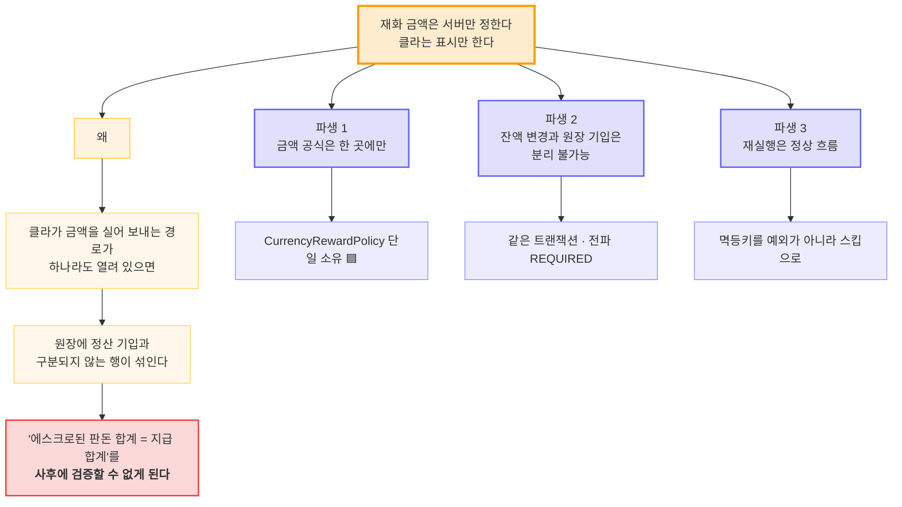

이것이 `/currency/earn`을 API 제거 없이 **no-op으로까지 만들어 막은** 이유다.

---

## 2. 컴포넌트 구성

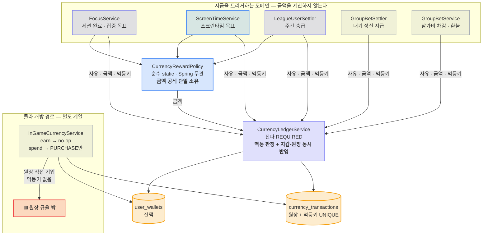

---

## 3. 왜 원장 서비스가 둘인가

```mermaid
flowchart LR
    subgraph A["InGameCurrencyService ⬜"]
        A1["호출자: 클라 HTTP"]
        A2["안전장치: 타입 화이트리스트"]
        A3["금액 결정: 클라"]
        A4["멱등: ❌"]
        A5["트랜잭션: 자체 시작"]
    end

    subgraph B["CurrencyLedgerService"]
        B1["호출자: 서버 로직"]
        B2["안전장치: 멱등키"]
        B3["금액 결정: 서버"]
        B4["멱등: ✅ 2단"]
        B5["트랜잭션: 호출자에 합류"]
    end

    R["서버 주도 타입은<br/>클라 신뢰 전제 검증을<br/>통과할 수 없다"]:::reason
    A -.->|"그래서 분리"| R -.-> B

    style A fill:#9ca3af1a,stroke:#9ca3af
    style B fill:#3b82f61f,stroke:#3b82f6,stroke-width:3px
    classDef reason fill:#eab30833,stroke:#eab308
```

`InGameCurrencyService`는 **"earn은 PURCHASE 불가 / spend는 PURCHASE만"**이라는 **클라 신뢰 전제**의
검증을 걸고 있어, 서버 주도 타입(`BET_*`·`*_GOAL`)이 통과할 수 없다.
`CurrencyLedgerService`는 호출자가 서버 로직이라는 전제 아래 타입 제약 대신 **멱등키**로 안전성을 확보한다.

> 🟥 **부채**: `spend`가 아직 `InGameCurrencyService`에 남아 원장 규율 밖에 있다.
> 서버 주도 경로는 전부 원장 서비스로 모였지만 구매만 예외다 → [PRD REQ-R2](./prd.md)

---

## 4. 왜 금액 공식을 별도 클래스로 두는가 🟦

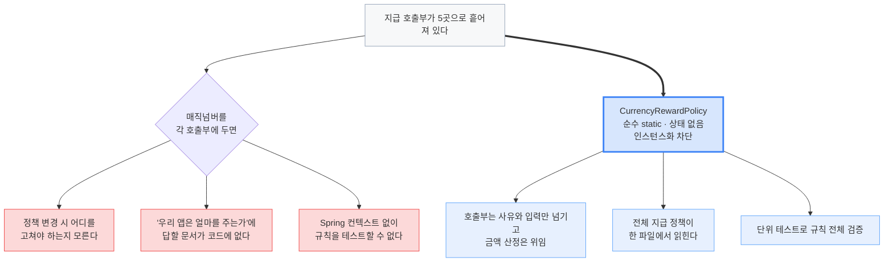

### 4.1 클라 미러의 위치와 경계 🟦

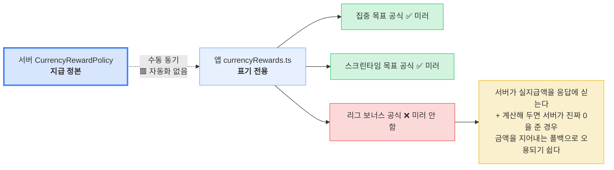

---

## 5. 데이터 왕복 — 경로별 시퀀스

### 5.1 세션 완료 지급 (실시간)

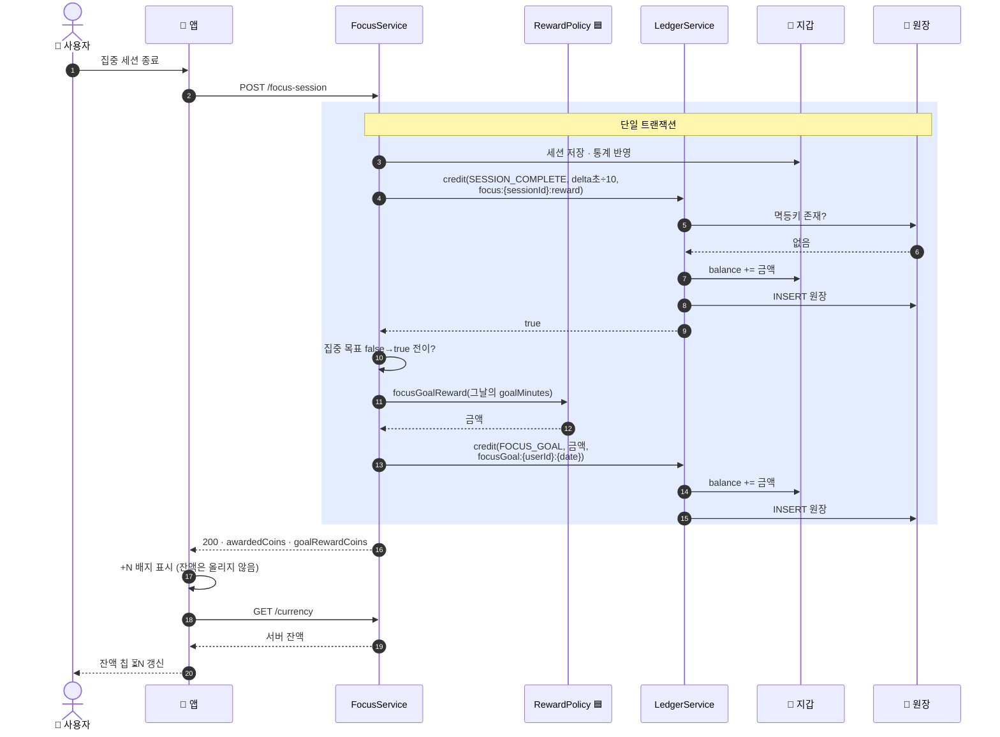

### 5.2 스크린타임 목표 지급 (실시간)

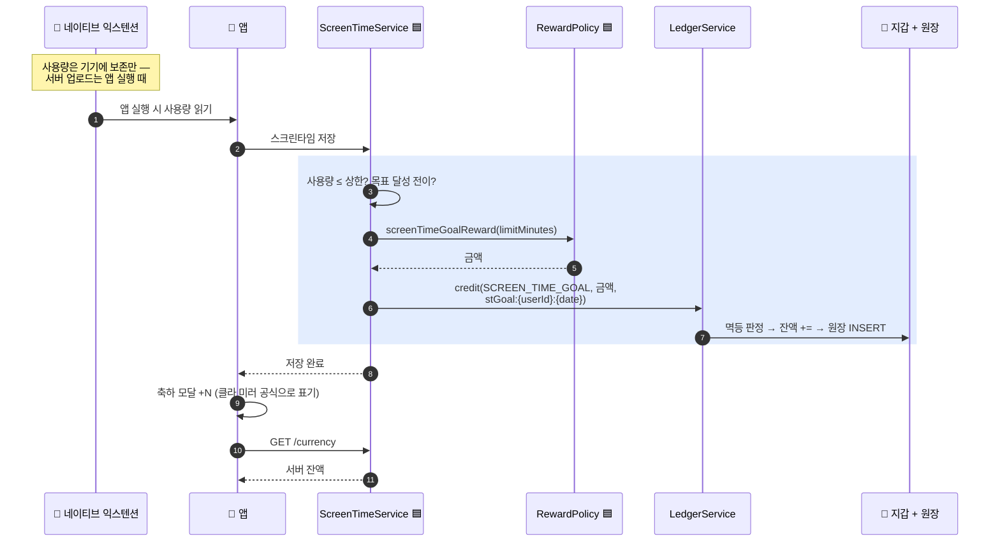

### 5.3 내기 — 차감(실시간) → 정산(배치)

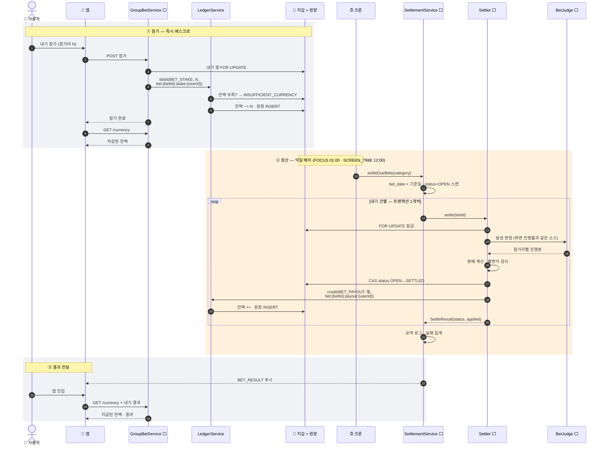

### 5.4 리그 승급 보너스 (주 배치)

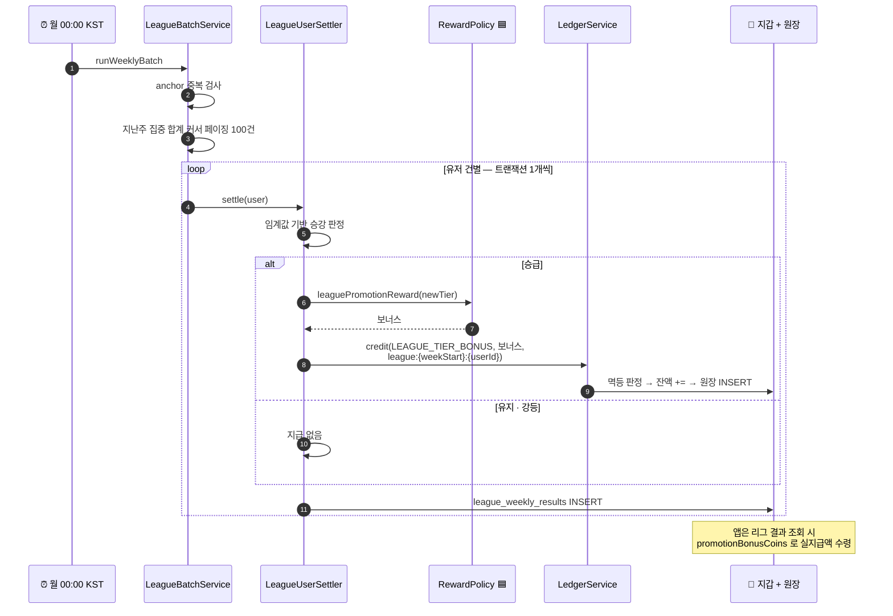

### 5.5 구매 (실시간) — 🟥 원장 규율 밖

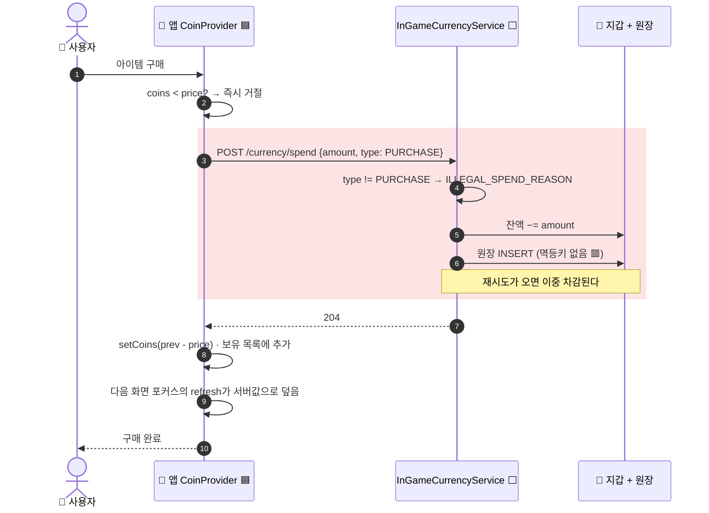

---

## 6. 정산 트리거 / 로직 분리

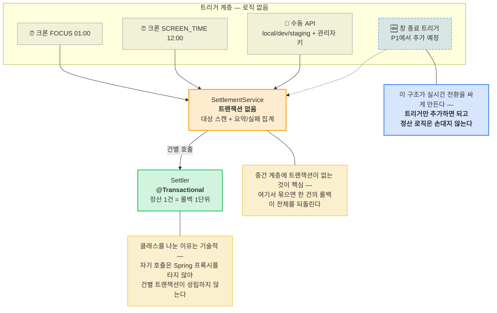

### 6.1 왜 카테고리별로 크론을 나누는가

```mermaid
gantt
    title 정산 크론 타임라인 (KST)
    dateFormat HH:mm
    axisFormat %H:%M

    section 데이터 완결
    집중 통계 완결 (세션 종료시각 귀속)    :milestone, m1, 00:00, 0m
    스크린타임 어제치 보고 유입 (앱 실행)   :active, st, 06:00, 6h

    section 정산 배치
    그레이스 1h                          :g, 00:00, 1h
    FOCUS 정산                           :crit, f, 01:00, 15m
    SCREEN_TIME 정산                     :crit, s, 12:00, 15m

    section ops
    판돈 동결 감지                        :d, 09:00, 15m
```

| 크론 | 시각 | 왜 그 시각인가 |
|---|---|---|
| FOCUS 정산 | 01:00 | 집중 일별 통계는 세션 **종료 시각** 귀속이라 자정에 완결. 자정 넘겨 끝난 세션을 위한 그레이스 1h만 두면 충분 |
| SCREEN_TIME 정산 | 12:00 | 네이티브가 기기에 보존하고 업로드는 앱 실행 때. 어제치 최종 보고가 **다음날 첫 실행**에 올라오므로, 01:00에 정산하면 "미보고 = 미달성" 억울패배가 양산된다 |
| 판돈 동결 감지 | 09:00 | 두 정산이 다 지난 뒤 남은 OPEN을 확인 |

**대상 선정만 카테고리로 갈리고 정산 로직은 하나다.**

---

## 7. 클라 상태 관리 🟦

### 7.1 왜 낙관 가산을 쓰지 않는가

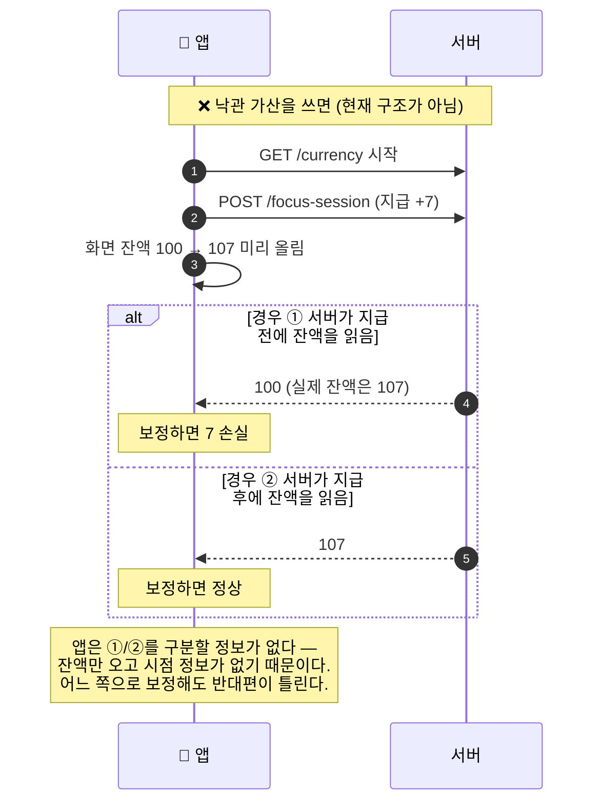

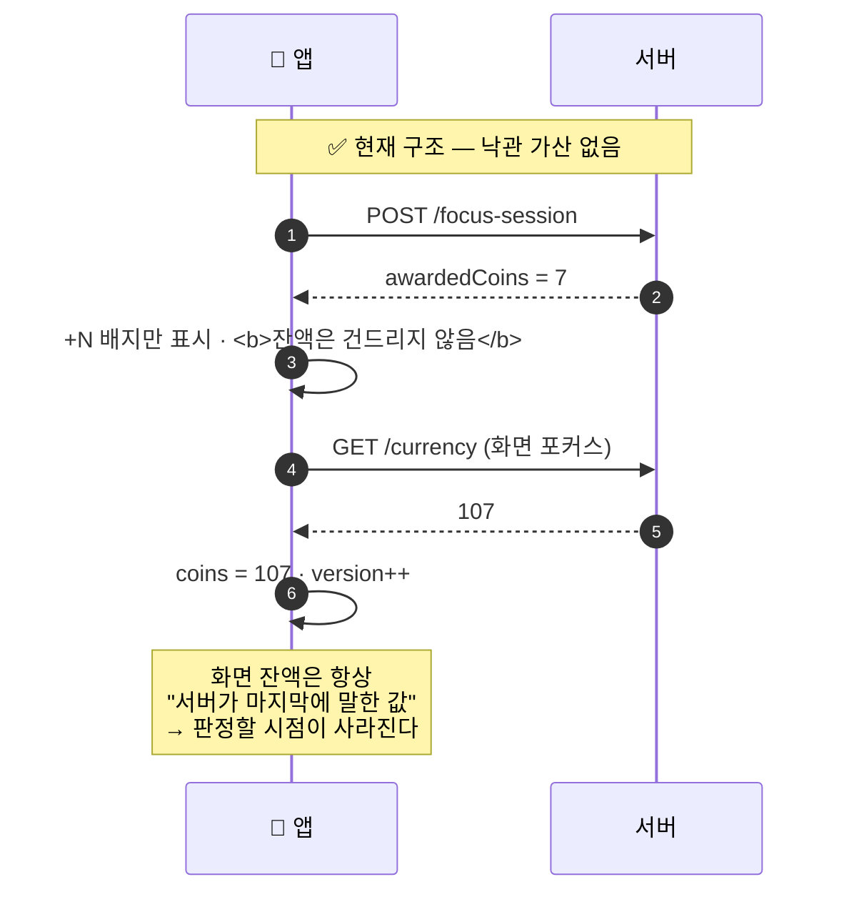

### 7.2 잔액 재조회 — 시퀀스 가드

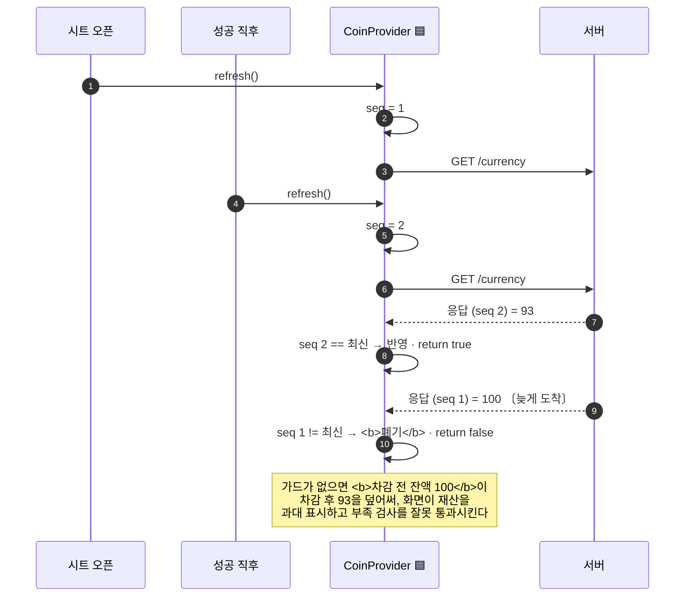

| 장치 | 왜 |
|---|---|
| **시퀀스 가드** | `refresh`는 여러 곳에서 겹쳐 불린다(시트 오픈 + 성공 직후 + 인라인 재시도) |
| **무효 호출은 `false`** | 실패가 아니지만 반영되지 않았다. `true`로 치면 뒤이은 호출이 실패했을 때 "동기화됐다"는 **거짓 확정**이 된다 |
| **실패 시 `coinsLoaded=false`** | 조용히 삼키지 않는다 — "지금 쥔 값은 못 믿는다"를 소비자가 알 수 있게 |
| **`throw` 안 함** | 잔액은 화면을 막을 값이 아니다. 호출처가 try/catch를 두지 않아도 되게 |
| **ref + state 이중화** | state는 응답 적용~다음 렌더 사이 한 틱 낡는다. 비동기 콜백은 ref 게터로 읽는다 |

---

## 8. 신뢰 경계

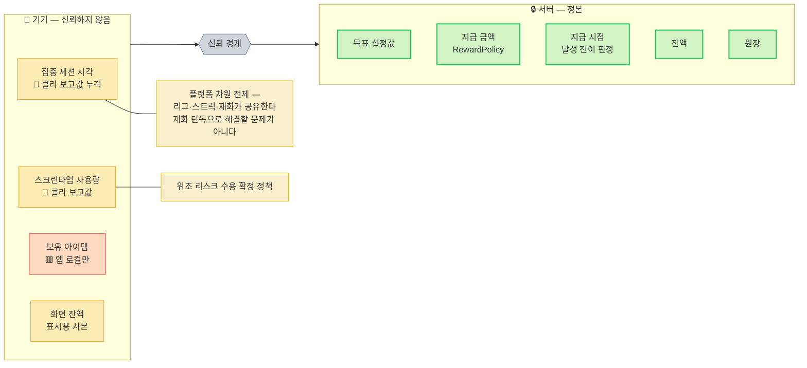

---

## 9. 배치 인프라

구현 방식은 **인메모리 Spring `@Scheduled`** — 별도 배치 서버·MQ 없음.
왜 그런지와 언제 바꾸는지는 [PRD §8.6](./prd.md).

| | 내기 정산 | 리그 승급 |
|---|---|---|
| 크론 | FOCUS 01:00 / SCREEN_TIME 12:00 KST | 월 00:00 KST |
| 트랜잭션 단위 | **내기 1건** | **유저 1명** |
| 실패 격리 | 🟩 건별 | 🟩 유저별 |
| 재실행 안전 | 🟩 멱등키 + 상태 CAS | 🟩 멱등키 + anchor 중복 검사 |
| 미실행 감지 | 🟩 `GroupBetFreezeMonitor` 09:00 | 🟥 없음 |
| 분산 락 | 🟥 없음 | 🟥 없음 |
| 수동 트리거 | 🟩 관리자 키 + 프로파일 게이팅 | 🟩 |

### 9.1 배치 미실행 감지 (내기만)

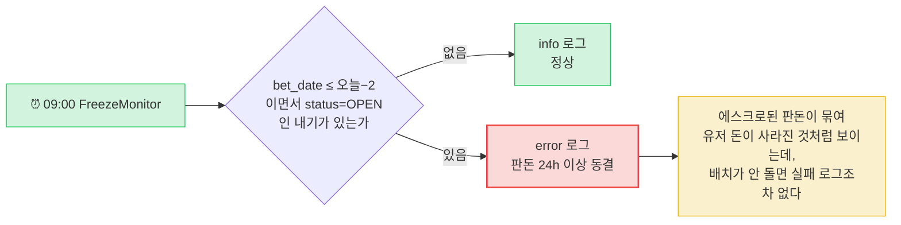

관리자 푸시·슬랙 연동은 범위 밖 — **로그 고정 포맷으로 알림 규칙을 걸 수 있게 하는 데까지**다.
