# 재화(시간조각) — IA (Information Architecture)

> 현재 구현 상태 기준 · 2026-08-08 `main`
> 시리즈: **IA** · [PRD](./prd.md) · [HLD](./high-level-design.md) · [LLD](./low-level-design.md)

**색 규칙** — 🟦 파랑 = 오스카 구현 · ⬜ 회색 = 조재영 구현 · 🟥 빨강 = 미구현/부채

---

## 1. 전체 정보 지도

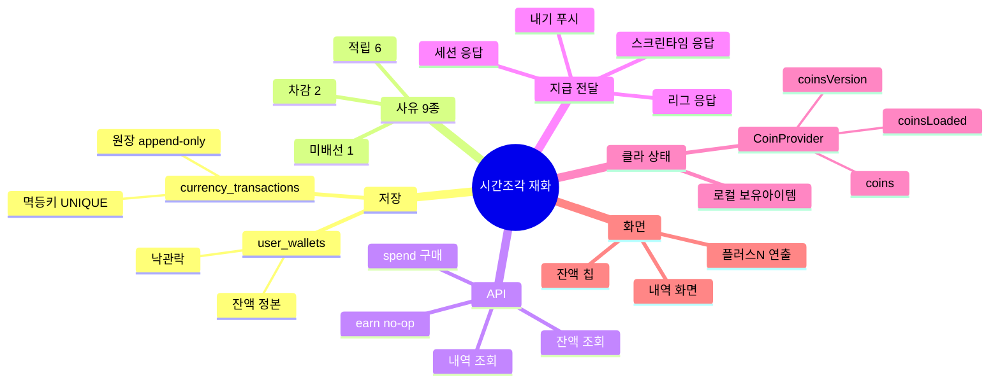

---

## 2. 데이터 모델

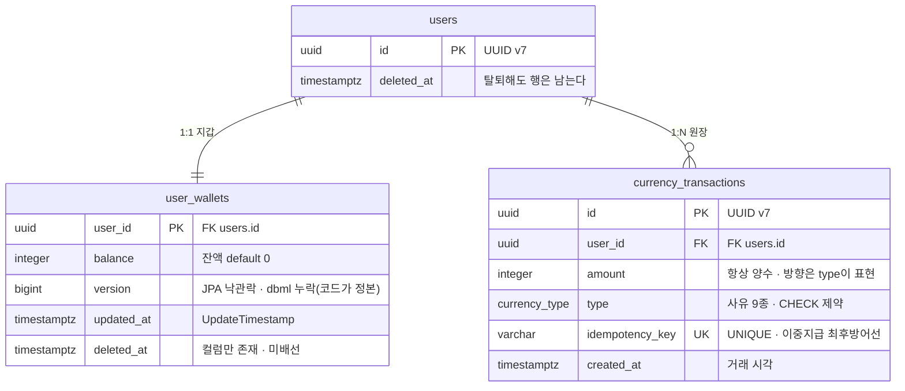

### 2.1 잔액을 원장 합산으로 구하지 않는다

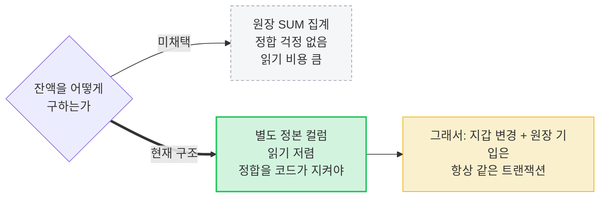

잔액 조회는 앱에서 가장 빈번한 호출이라 읽기 비용을 택했다.

---

## 3. type 도메인 (9종)

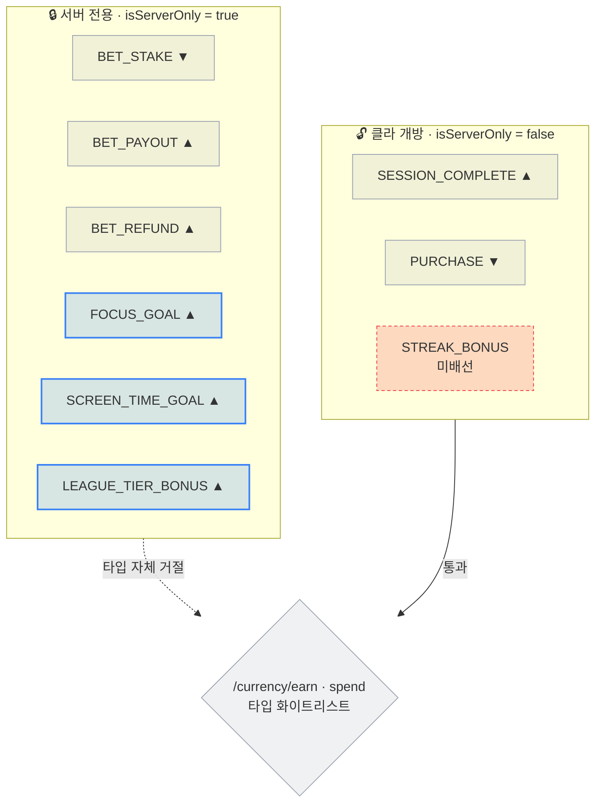

▲ 적립 · ▼ 차감

| type | 방향 | `isServerOnly` | 구현 |
|---|---|---|---|
| `SESSION_COMPLETE` | ▲ | false | ⬜ |
| `PURCHASE` | ▼ | false | ⬜ |
| `BET_STAKE` | ▼ | **true** | ⬜ |
| `BET_PAYOUT` | ▲ | **true** | ⬜ |
| `BET_REFUND` | ▲ | **true** | ⬜ |
| `FOCUS_GOAL` | ▲ | **true** | 🟦 |
| `SCREEN_TIME_GOAL` | ▲ | **true** | 🟦 |
| `LEAGUE_TIER_BONUS` | ▲ | **true** | 🟦 |
| `STREAK_BONUS` | ▲ | false | 🟥 **enum 값만 존재 · 지급 호출부 없음** |

- **`isServerOnly()`** = 금액·시점을 서버가 전적으로 결정하는 6종. 클라 경로에서 타입 자체를 거절한다.
- CHECK 제약은 Flyway `V22__currency_transaction_reward_types.sql`(🟦)이 관리한다.

---

## 4. 멱등키 네임스페이스

**"같은 사건은 같은 키"** — 사건의 자연 유일성을 키에 담는다.

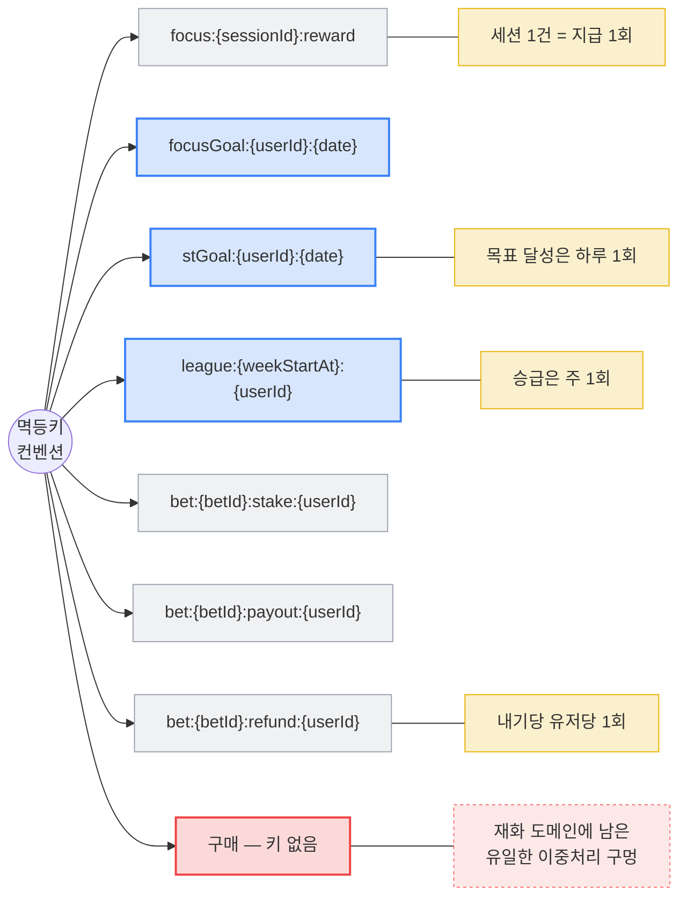

---

## 5. API 표면

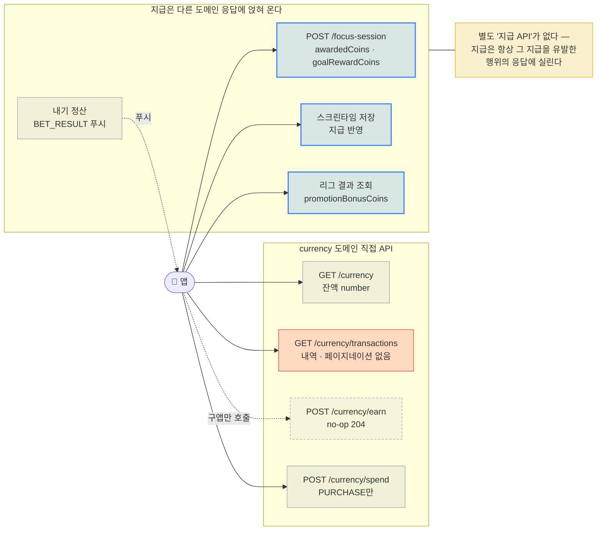

### 5.1 조회 데이터 왕복

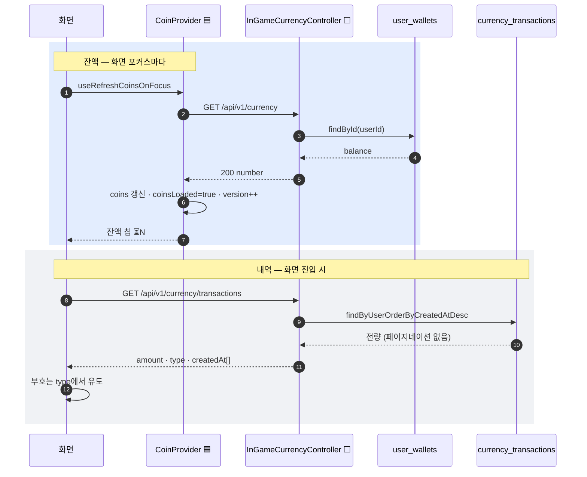

### 5.2 앱 DTO 미러 🟦

```typescript
export type CurrencyTransactionType =
  | 'SESSION_COMPLETE' | 'STREAK_BONUS' | 'PURCHASE'
  | 'BET_STAKE' | 'BET_PAYOUT' | 'BET_REFUND'
  | 'FOCUS_GOAL' | 'SCREEN_TIME_GOAL' | 'LEAGUE_TIER_BONUS'
  | (string & {});          // ← 서버 enum 확장 도착 시에도 타입이 깨지지 않게

export interface CurrencyTransaction {
  amount: number;    // 항상 양수 — 방향은 type이 표현
  type: CurrencyTransactionType;
  createdAt: string; // Instant ISO
}
```

**`(string & {})`** — 미지의 enum 값이 도착해도 타입을 깨지 않으면서 알려진 값의 자동완성은 유지한다.
서버가 type을 확장 배포했는데 앱이 구버전인 상황을 언어 차원에서 흡수한다.

---

## 6. 클라 상태 구조 🟦

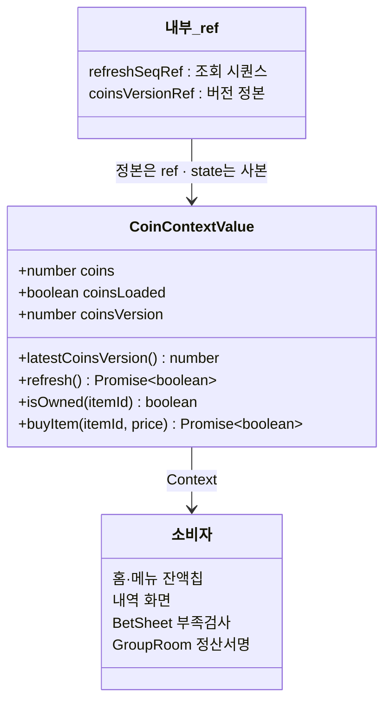

| 노출값 | 의미 | 왜 필요한가 |
|---|---|---|
| `coins` | 서버 잔액 (표시용, **정본 아님**) | |
| `coinsLoaded` | 한 번이라도 받아왔나 | `false`면 `coins=0`은 '0코인'이 아니라 **'모름'** |
| `coinsVersion` | 몇 번째로 받은 값인가 (state) | 서버 판정을 풀어도 되는지는 **크기가 아니라 도착 순서**로 갈린다 |
| `latestCoinsVersion()` | 지금 이 순간의 버전 (ref) | state는 응답 적용~다음 렌더 사이 한 틱 낡는다 |
| `refresh()` | 서버 재조회 | 반환값 = **이 호출의 잔액이 실제로 반영됐는가** |

### 6.1 `coinsLoaded`가 갈라내는 네 가지 0

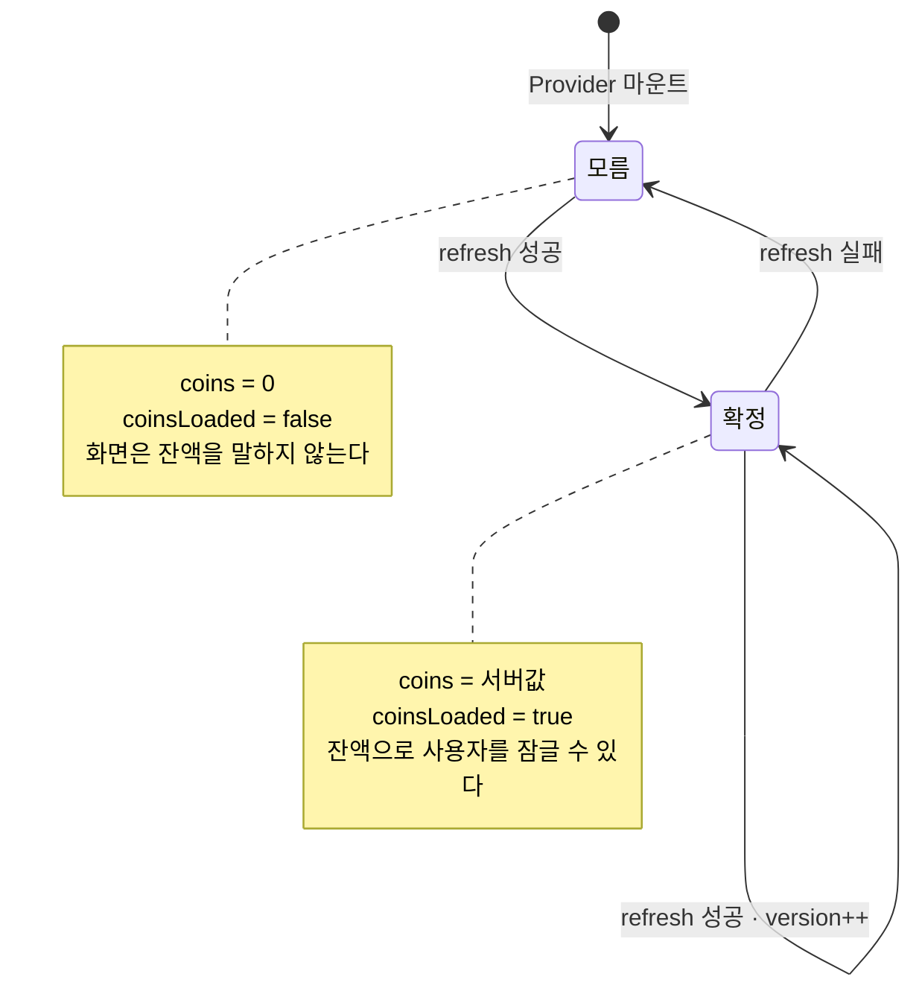

`coins = 0`이 될 수 있는 경로가 넷 — **진짜 0코인 · 최초 로드 실패 · refresh 실패 · 응답 전.**
이 넷이 같은 숫자로 뭉개지면 화면이 사용자의 재산에 대해 거짓을 말한다.

### 6.2 로컬 저장 구조 (보유 아이템)

아이템 API가 없어 **로컬이 유일한 구매 기록**이다.

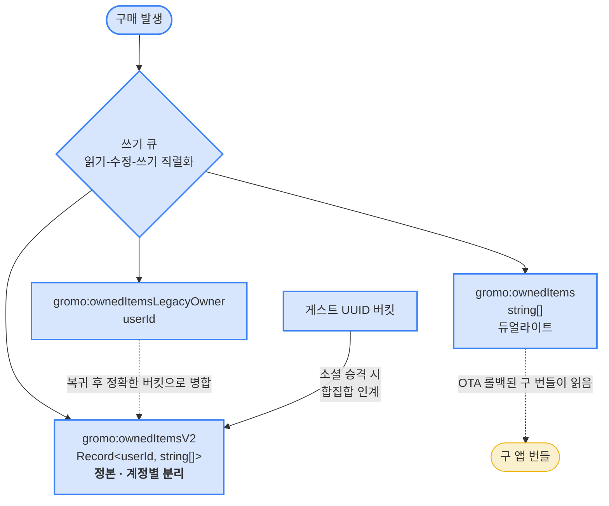

고정 `guest` 버킷을 쓰지 않는 이유: 게스트 로그아웃 후에도 남아 **다음 게스트·무관한 소셜 계정에 누출**된다.

---

## 7. 화면 IA

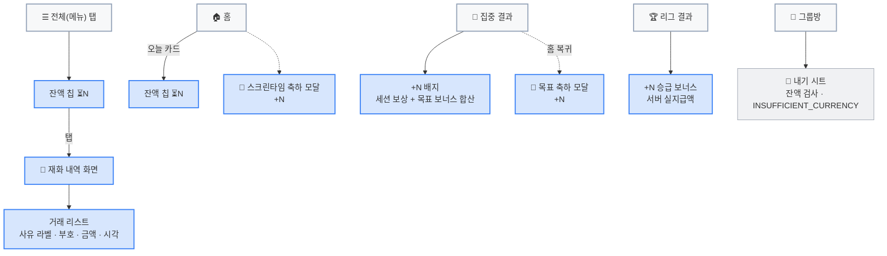

### 7.1 표시 규칙 🟦

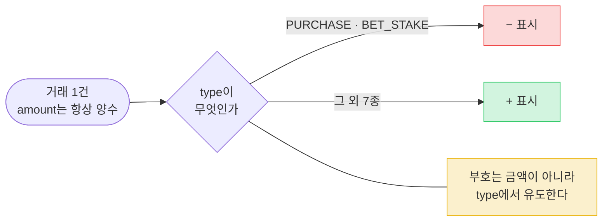

| 규칙 | 내용 |
|---|---|
| **부호 유도** | `PURCHASE`·`BET_STAKE` = −, 나머지 = + |
| **잔액 재조회 시점** | Provider 마운트 1회 + **잔액 표시 화면 포커스마다**. 서버가 깎은 잔액은 마운트 1회로는 영영 반영되지 않는다 |
| **아이콘** | `CurrencyIcon` 컴포넌트 — 이모지 ⏳는 기기·폰트마다 모양이 달라 쓰지 않는다 |
| **라벨** | `CURRENCY.label = '시간조각'`. 코드 식별자는 `coin`/`currency` |
| **미도착 처리** | 지급값이 안 오면 graceful **배지 미표시** — 0을 지어내지 않는다 |
