# 재화(시간조각) — LLD (Low-Level Design)

> 현재 구현 상태 기준 · 2026-08-08 `main`
> 시리즈: [IA](./information-architecture.md) · [PRD](./prd.md) · [HLD](./high-level-design.md) · **LLD**

**색 규칙** — 🟦 파랑 = 오스카 구현 · ⬜ 회색 = 조재영 구현 · 🟥 빨강 = 부채

---

## 1. 지급 공식 🟦 `CurrencyRewardPolicy`

순수 static · Spring 무관 · 인스턴스화 차단.

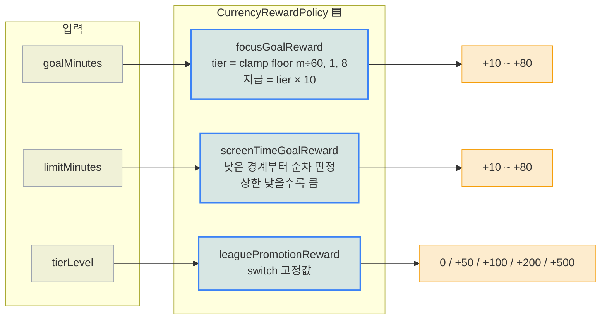

### 1.1 집중 목표 `focusGoalReward`

```
tier = clamp(floor(goalMinutes / 60), 1, 8)
지급 = tier × 10
```

| 입력 | 계산 | 지급 |
|---|---|---|
| ≤ 0 | — | **0** |
| 30분 | floor(0) → clamp 1 | **+10** |
| 90분 | floor(1) | **+10** ← 부분시간 내림 |
| 120분 | floor(2) | +20 |
| 480분 (8h) | floor(8) | **+80** |
| 600분 | floor(10) → clamp 8 | **+80** (캡) |

> 부분 시간을 **내림**으로 처리하는 이유: 명세가 정시간만 예시로 들어 해석 여지가 있고,
> 재화 발행은 보수적으로 가는 편이 안전하다.

### 1.2 스크린타임 목표 `screenTimeGoalReward`

**상한이 낮을수록(빡셀수록) 보상이 크다.** 낮은 경계부터 순차 판정 — 경계 분은 그 구간에 포함.

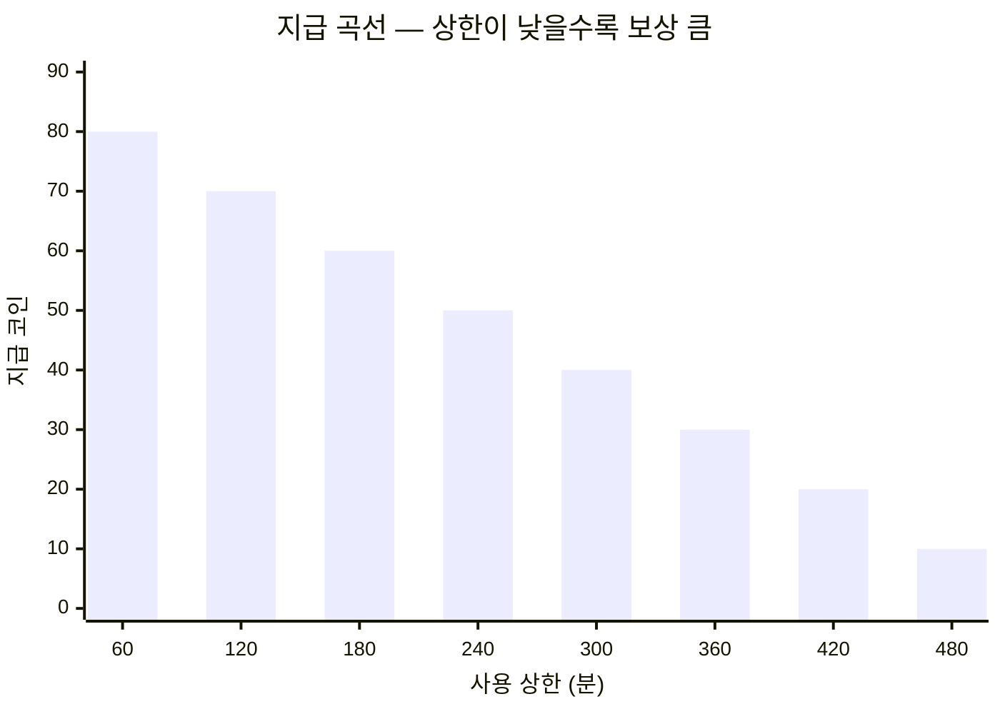

| 사용 상한 | 지급 |
|---|---|
| ≤ 60분 (1h) | **+80** |
| ≤ 120분 | +70 |
| ≤ 180분 | +60 |
| ≤ 240분 | +50 |
| ≤ 300분 | +40 |
| ≤ 360분 | +30 |
| ≤ 420분 (7h) | +20 |
| > 420분 | **+10** |

### 1.3 리그 승급 `leaguePromotionReward`

```java
switch (tierLevel) {
    case 2 -> 50;    // 예열
    case 3 -> 100;   // 초집중
    case 4 -> 200;   // 갓생러
    case 5 -> 500;   // 정복자
    default -> 0;    // 1(첫 티어)과 범위 밖
}
```

### 1.4 세션 완료 ⬜

```
지급 = 집중 delta초 / 10
```
증분 정산이므로 마지막 정산 이후 delta 초만 대상. 24h 상한 가드 존재.

### 1.5 클라 미러 🟦 `app/src/utils/currencyRewards.ts`

`focusGoalReward` · `screenTimeGoalReward`만 미러 — **축하 모달 표기 전용.**
클라 쪽 `screenTimeGoalReward`에는 `limitMinutes <= 0 → 0` 가드가 추가돼 있다
(상한 미설정 시 서버 지급 스킵 규칙과 일치시키기 위함).

**리그 보너스는 미러하지 않는다** — 서버가 `promotionBonusCoins`를 실어 보내고,
계산해 두면 서버가 진짜 0을 준 경우(지급 실패)에 금액을 지어내는 폴백으로 오용되기 쉽다.

---

## 2. 원장 기입 `CurrencyLedgerService`

```java
@Transactional
public boolean credit(User user, CurrencyTransactionType type, int amount, String idempotencyKey) {
    if (alreadyApplied(type, idempotencyKey)) return false;   // 1차 방어: 조회 스킵
    wallet(user).earn(amount);                                 //          잔액
    record(user, type, amount, idempotencyKey);                //          원장
    return true;
}

@Transactional
public boolean debit(User user, CurrencyTransactionType type, int amount, String idempotencyKey) {
    if (alreadyApplied(type, idempotencyKey)) return false;
    wallet(user).spend(amount);        // 부족 시 INSUFFICIENT_CURRENCY throw
    record(user, type, amount, idempotencyKey);
    return true;
}
```

### 2.1 2단 멱등 판정

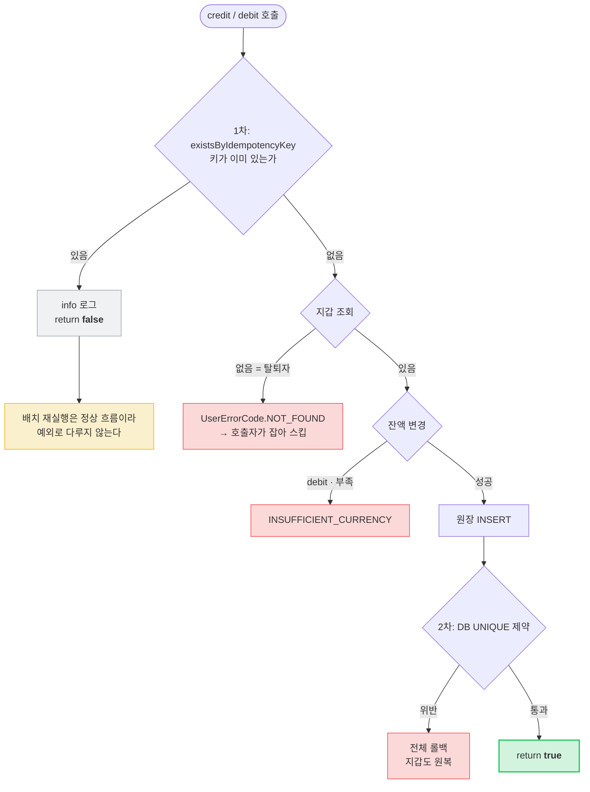

| 포인트 | 내용 |
|---|---|
| **2단 멱등** | ① 앞단 조회로 **조용히 스킵** → ② 뚫리면 DB UNIQUE가 최후 방어선 |
| **전파 REQUIRED** | 호출자 트랜잭션에 합류 → 지갑만 바뀌고 원장이 없는 상태가 구조적으로 불가능 |
| **반환값 `boolean`** | 호출자가 "**내가** 실제로 지급했는지"를 알아야 한다 — 배치 요약 집계(남이 한 정산을 제 성과로 세지 않기)와 경고 로그 분기에 쓴다 |
| **`amount` 항상 양수** | 방향은 `type`이 표현 |

### 2.2 지갑 엔티티 ⬜ `UserWallet`

```java
// 목적: spendCurrency 동시성(이중 차감) 방지. dbml 은 이 컬럼을 누락했으나 코드가 정본이다.
@Version
@Builder.Default
private Long version = 0L;

@UpdateTimestamp private Instant updatedAt;
private Instant deletedAt;   // 🟥 컬럼만 존재 — 세팅/필터 미배선, withdraw()는 하드 삭제

public void earn(int amount) {
    if (amount <= 0) throw new IllegalArgumentException("잔액 증가는 양수 단위로만");
    this.balance += amount;
}
public void spend(int amount) {
    if (amount <= 0) throw new IllegalArgumentException("잔액 감소는 양수 단위로만");
    if (this.balance < amount) throw new CurrencyException(INSUFFICIENT_CURRENCY);
    this.balance -= amount;
}
```

**낙관락이 막는 것과 못 막는 것**

| 이중 차감 유형 | 결과 |
|---|---|
| **동시 요청** — 두 트랜잭션이 같은 지갑을 같은 순간에 | ✅ 늦은 쪽 `UPDATE … WHERE version=?`가 0행 → `OptimisticLockingFailureException` |
| **순차 재시도** — 응답 유실 후 다시 보냄 | 🟥 version이 이미 갱신돼 정상 요청과 구분되지 않는다 → **멱등키만이 막는다** |

**충돌 시 동작 — 서버 자동 재시도는 없다**

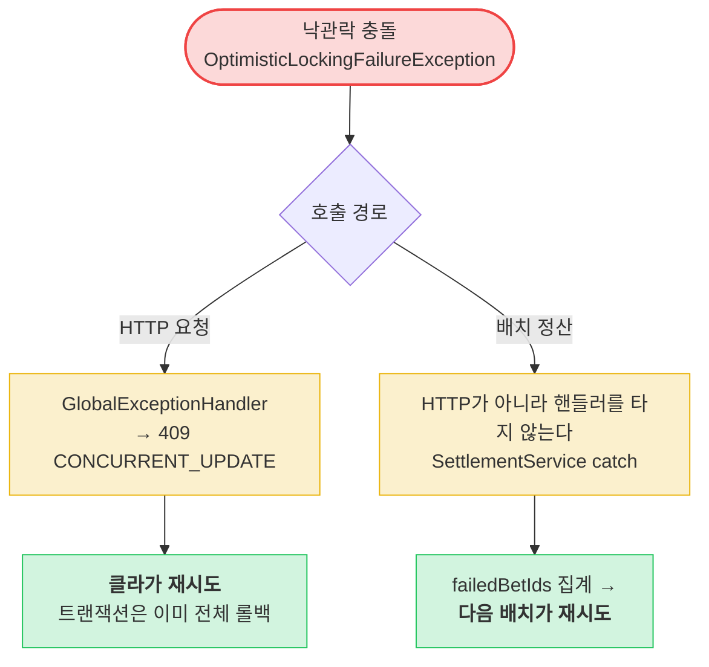

`@Retryable` 같은 서버측 자동 재시도는 없다 — 재시도 책임이 **클라(HTTP)** 또는 **다음 배치 실행**에 있다.
비관락 충돌(내기 행 `FOR UPDATE` 데드락)도 같은 409로 강하되며, 설계상 없어야 하는 충돌이라 `warn`을 남긴다.

### 2.3 구매 경로 — 🟥 원장 규율 밖

```java
// InGameCurrencyService.spendCurrency — CurrencyLedgerService를 경유하지 않는다
if (type != PURCHASE) throw ILLEGAL_SPEND_REASON;
wallet.spend(amount);
currencyTransactionRepository.save(...);   // ⚠️ idempotencyKey 없음
```

멱등키가 없어 네트워크 재시도 시 이중 차감이 가능하다 → [PRD REQ-R1·R2](./prd.md).

---

## 3. 지급 배선 (호출부별)

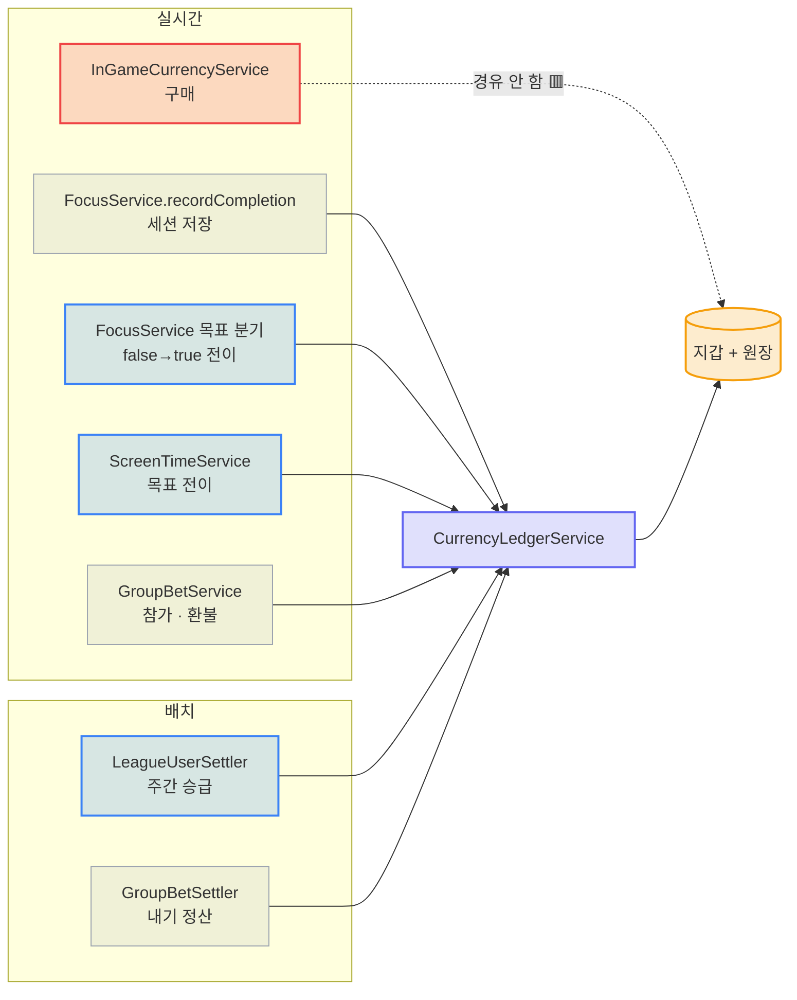

| 호출부 | 트리거 | 멱등키 | 응답 필드 | 구현 |
|---|---|---|---|---|
| `FocusService.recordCompletion` | 세션 저장 | `focus:{sessionId}:reward` | `awardedCoins` | ⬜ |
| `FocusService` (목표) | 집중 목표 **전이** | `focusGoal:{userId}:{date}` | `goalRewardCoins` | 🟦 |
| `ScreenTimeService` | 스크린타임 목표 전이 | `stGoal:{userId}:{date}` | — | 🟦 |
| `LeagueUserSettler` | 주간 승급 | `league:{previousWeekStart}:{userId}` | `promotionBonusCoins` | 🟦 |
| `GroupBetSettler` | 내기 정산 | `bet:{betId}:payout:{userId}` | — | ⬜ |
| `GroupBetService` | 참가·환불 | `bet:{betId}:stake\|refund:{userId}` | — | ⬜ |
| `InGameCurrencyService` | 구매 | 🟥 **없음** | — | ⬜ |

### 3.1 전이(transition)에서만 지급한다

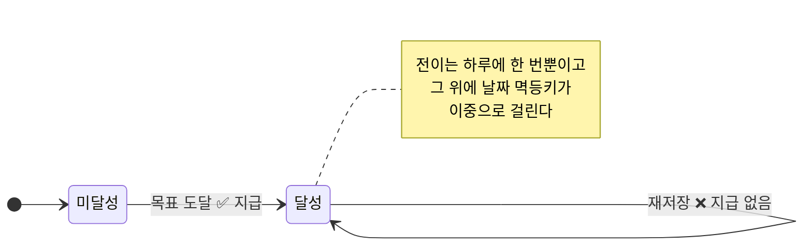

"달성 상태"가 아니라 "달성으로 바뀌는 순간"을 잡는다.

---

## 4. 지급 하드닝 (현재 적용된 가드) 🟦

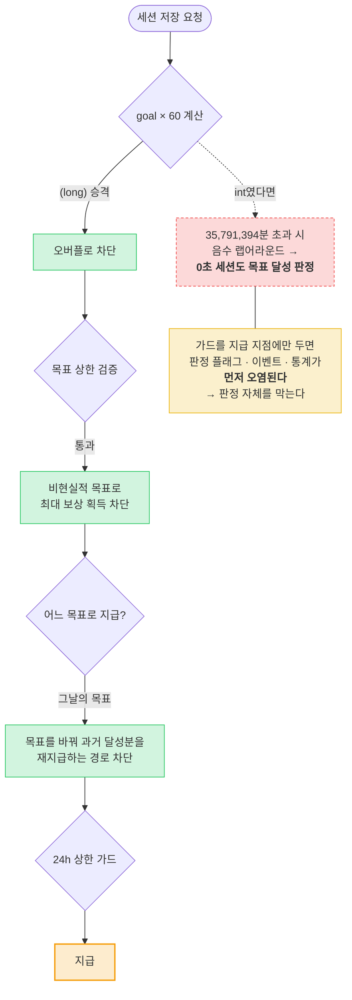

| 가드 | 막는 것 |
|---|---|
| `(long)` 승격 | `goal * 60`의 `int` 오버플로 — 지급은 24h 상한이 막았지만 그보다 **앞서 실행되는 달성 플래그·이벤트가 이미 오염**된다 |
| 목표 상한 검증 | 비현실적 목표 설정으로 최대 보상 획득 |
| 그날의 목표로 지급 | 목표를 바꿔 과거 달성분을 새 목표 기준으로 재지급 |
| 24h 상한 | 비정상 세션 시간 |

---

## 5. 잔액 동기화 구현 🟦

```typescript
const refresh = useCallback(async (): Promise<boolean> => {
  const seq = ++refreshSeqRef.current;                 // 시퀀스 발급
  try {
    const res = await api.get<number>('/api/v1/currency');
    if (seq !== refreshSeqRef.current) return false;   // 늦은 응답 폐기
    setCoins(res.data);
    setCoinsLoaded(true);
    coinsVersionRef.current += 1;                      // ref = 정본 (동기)
    setCoinsVersion(coinsVersionRef.current);          // state = 사본 (렌더용)
    return true;
  } catch {
    if (seq !== refreshSeqRef.current) return false;
    setCoinsLoaded(false);                             // 조용히 삼키지 않음
    return false;
  }
}, []);
```

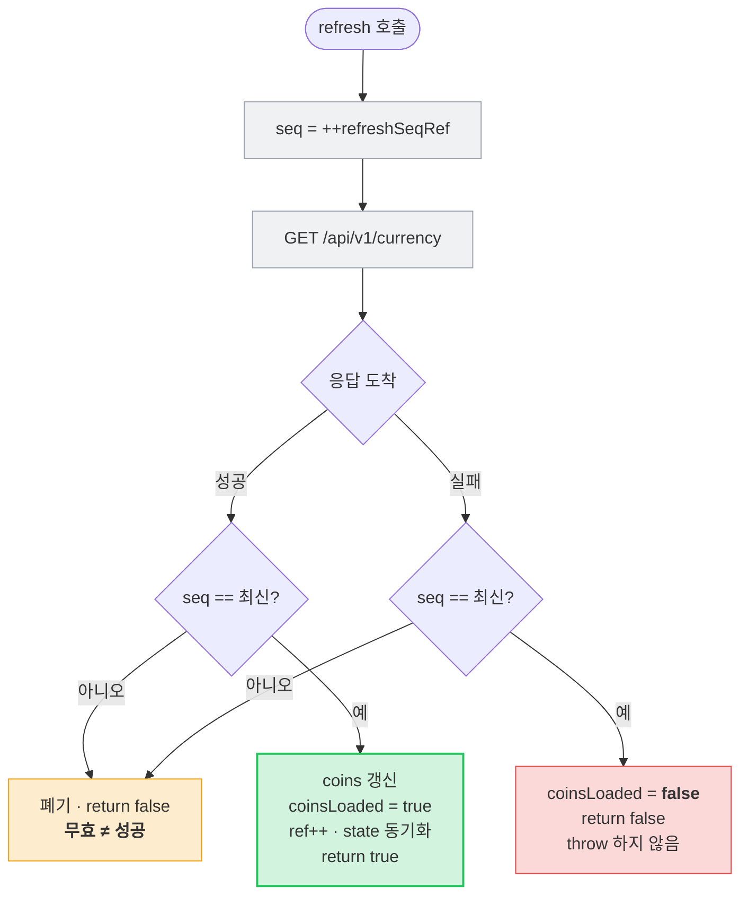

| 장치 | 왜 |
|---|---|
| **시퀀스 가드** | 순서를 안 지키면 **차감 전 잔액**을 실은 늦은 응답이 차감 후 잔액을 덮어써, 화면이 재산을 과대 표시하고 **부족 검사를 잘못 통과시킨다** |
| **무효 호출은 `false`** | 실패가 아니지만 반영되지 않았다. `true`로 치면 뒤이은 호출이 실패했을 때 "동기화됐다"는 **거짓 확정**이 된다. 재시도로 이어져도 손해가 없는 방향으로 보수 |
| **실패 시 `coinsLoaded=false`** | "지금 쥔 값은 못 믿는다"를 소비자가 알 수 있게 |
| **`throw` 안 함** | 잔액은 화면을 막을 값이 아니다 |
| **ref + state 이중화** | state는 응답 적용~다음 렌더 사이 한 틱 낡는다. effect로 미러링해도 그 틈은 남는다. 비동기 콜백은 `latestCoinsVersion()`(ref)로 읽고, **렌더에서는 ref를 쓰지 않는다** — ref는 다시 그리지 않으므로 |

### 5.1 구매 시 로컬 반영

```typescript
async function buyItem(itemId: string, price: number) {
  if (coins < price) return false;
  await api.post('/api/v1/currency/spend', { amount: price, type: 'PURCHASE' });
  setCoins((prev) => prev - price);          // 응답을 받은 뒤 반영
  setOwnedItemIds((prev) => [...prev, itemId]);
  return true;
}
```

낙관 가산 금지의 예외처럼 보이지만 다르다 — **응답을 받은 뒤** 반영하고,
다음 화면 포커스의 `refresh`가 서버값으로 덮는다.
페이로드는 정식 필드 `type`을 쓴다(구 페이로드 `reason`은 `@JsonAlias`로만 동작).

---

## 6. 마이그레이션 🟦 `V22__currency_transaction_reward_types.sql`

```sql
-- enum 값 추가만으로는 CHECK가 갱신되지 않는다. prod는 ddl-auto: validate라
-- 이 마이그레이션이 없으면 FOCUS_GOAL/SCREEN_TIME_GOAL/LEAGUE_TIER_BONUS
-- INSERT가 전부 제약 위반으로 실패한다.
ALTER TABLE currency_transactions DROP CONSTRAINT currency_transactions_type_check;
ALTER TABLE currency_transactions
    ADD CONSTRAINT currency_transactions_type_check
    CHECK ((type)::text = ANY ((ARRAY[
        'SESSION_COMPLETE','STREAK_BONUS','PURCHASE',
        'BET_STAKE','BET_PAYOUT','BET_REFUND',
        'FOCUS_GOAL','SCREEN_TIME_GOAL','LEAGUE_TIER_BONUS'
    ]::character varying[])::text[]));
```

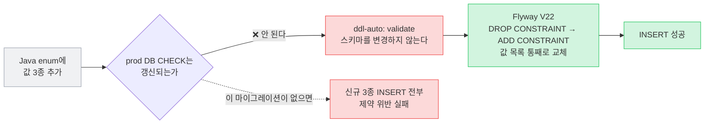

**CHECK는 값 목록을 통째로 교체해야 하므로** 기존 제약을 드롭하고 다시 만든다.

---

## 7. 부분 실패 처리 — 탈퇴자 지급 스킵 ⬜

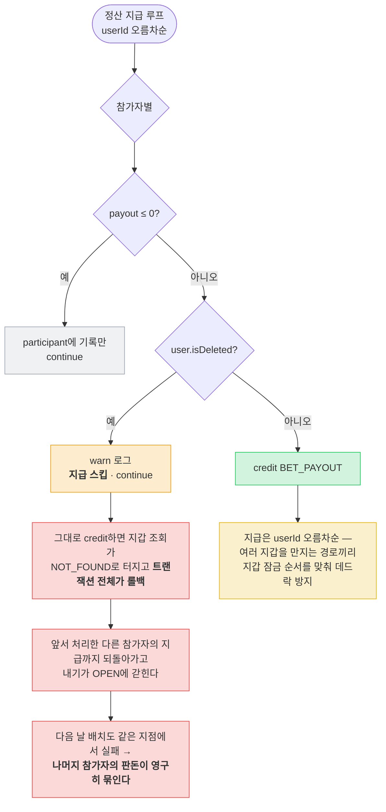

탈퇴는 `users` 행은 남기고 `user_wallets`만 지운다(참가 행은 FK 때문에 남는다).
참가 행에는 계산된 몫을 그대로 남긴다 — 분배 계산의 근거(합 = 팟)는 보존하고,
**실제 이동 여부는 원장(`currency_transactions`)이 단일 진실이다.**

---

## 8. 계정 라이프사이클 🟦

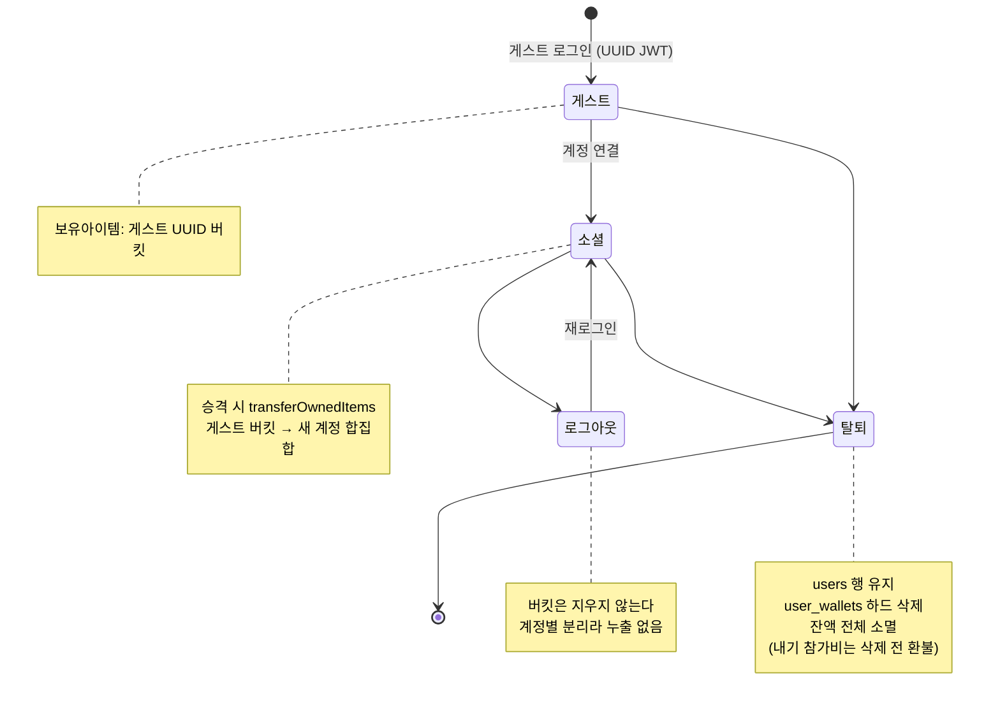

| 상황 | 처리 |
|---|---|
| **탈퇴** | `users` 행 유지 + `user_wallets` **하드 삭제**(`deleteById`). 잔액 전체 소멸(돌려줄 지갑이 없음). `deleted_at` 소프트 딜리트는 컬럼만 있고 미배선 — 후속 티켓 |
| **로그아웃 / 계정 전환** | 보유 아이템을 **계정별 버킷**으로 분리 보관 — 계정 간 누출과 기록 소실을 동시에 방지 |
| **게스트 → 소셜 승격** | 게스트 UUID 버킷을 새 계정에 **합집합 인계**. 고정 `guest` 버킷은 로그아웃 후 **다음 게스트·무관한 소셜 계정에 누출**되므로 쓰지 않는다 |
| **OTA 롤백** | 구 키에 **듀얼라이트** + 소유자 키를 남겨, 롤백 중의 구매를 복귀 후 정확한 버킷으로 병합 |

### 8.1 로컬 쓰기 직렬화 🟦

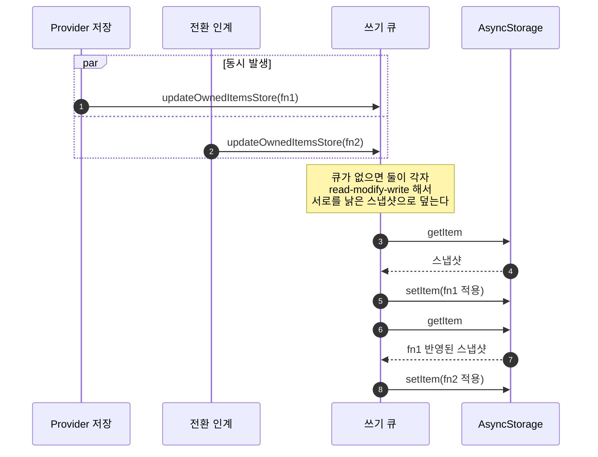

```typescript
let ownedItemsWrites: Promise<void> = Promise.resolve();
function updateOwnedItemsStore(update) {
  const run = ownedItemsWrites.then(async () => {
    const raw = await AsyncStorage.getItem(KEY);                   // 읽기
    const map = raw ? JSON.parse(raw) : {};                        // 수정
    await AsyncStorage.setItem(KEY, JSON.stringify(update(map)));  // 쓰기
  });
  ownedItemsWrites = run.catch(() => {});   // 큐는 실패해도 이어짐
  return run;                              // 호출자엔 실패 전파
}
```

---

## 9. 표시 규칙 구현 🟦

```typescript
// 부호는 금액이 아니라 type에서 유도 — 서버는 amount를 항상 양수로 기입한다
const isSpend = type === 'PURCHASE' || type === 'BET_STAKE';
const sign = isSpend ? '−' : '+';
```

```typescript
// 잔액 표시 화면이 포커스될 때 서버 잔액 재조회
export function useRefreshCoinsOnFocus() {
  const { refresh } = useCoins();
  useFocusEffect(useCallback(() => { refresh(); }, [refresh]));
}
```

### 9.1 +N 표시가 중복되지 않는 경계

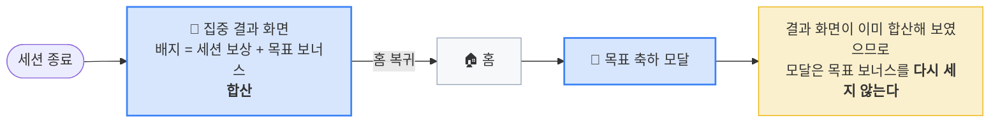

지급이 0이거나 미도착이면 **배지를 그리지 않는다** — 0을 지어내지 않는다.

---

## 10. 테스트 현황

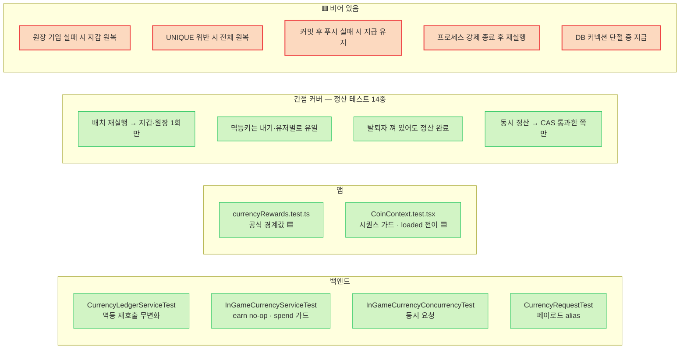

비어 있는 5건이 [PRD §9.6](./prd.md) 롤백 검증 케이스 1·3·4·7·8이다.
