# 재화(시간조각) — PRD (Product Requirements Document)

> 현재 구현 상태 + 향후 계획 · 2026-08-08 `main`
> 시리즈: [IA](./information-architecture.md) · **PRD** · [HLD](./high-level-design.md) · [LLD](./low-level-design.md)

**색 규칙** — 🟦 오스카 구현 · ⬜ 조재영 구현 · 🟩 구현 완료 · 🟥 미구현/부채

---

## 1. 목적

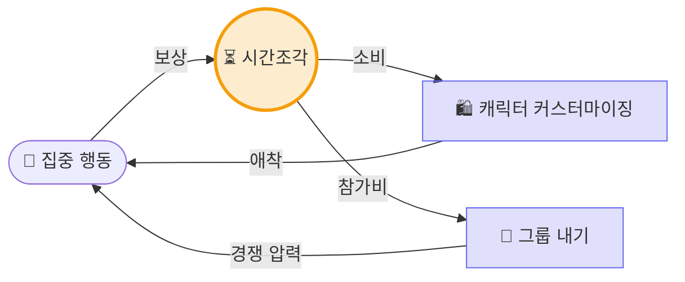
```mermaid
flowchart LR
    F(["🎯 집중 행동"]) -->|"보상"| C(("⏳ 시간조각")):::coin
    C -->|"소비"| S["🛍 캐릭터 커스터마이징"]:::use
    C -->|"참가비"| B["💸 그룹 내기"]:::use
    S -->|"애착"| F
    B -->|"경쟁 압력"| F

    classDef coin fill:#f59e0b33,stroke:#f59e0b,stroke-width:3px
    classDef use fill:#6366f133,stroke:#6366f1
```

집중 행동에 즉각적 보상 루프를 붙여 **세션 반복률과 목표 설정률**을 올린다.
동시에 커스터마이징의 소비처이자 내기의 참가비로 쓰여 **획득 → 소비 → 경쟁**의 순환을 만든다.

> **재화는 수단이지 목적이 아니다.** 잔액이 많이 쌓이는 것 자체는 성과가 아니고,
> 그 재화가 **집중 행동을 다시 일으켰는가**가 성과다. 아래 지표 체계가 그 순서를 따른다.

---

## 2. 지표 체계

### 2.1 3층 구조

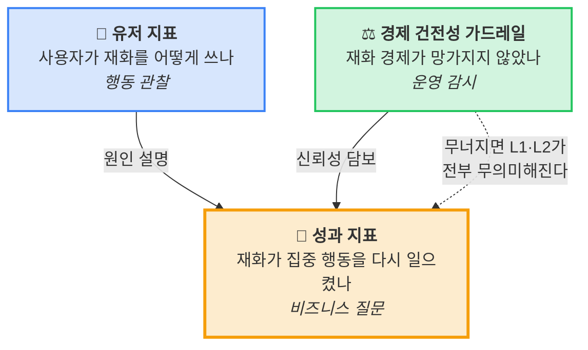
```mermaid
flowchart TD
    L1["🎯 <b>성과 지표</b><br/>재화가 집중 행동을 다시 일으켰나<br/><i>비즈니스 질문</i>"]:::l1
    L2["👤 <b>유저 지표</b><br/>사용자가 재화를 어떻게 쓰나<br/><i>행동 관찰</i>"]:::l2
    L3["⚖️ <b>경제 건전성 가드레일</b><br/>재화 경제가 망가지지 않았나<br/><i>운영 감시</i>"]:::l3

    L2 -->|"원인 설명"| L1
    L3 -->|"신뢰성 담보"| L1
    L3 -.->|"무너지면 L1·L2가<br/>전부 무의미해진다"| L1

    classDef l1 fill:#f59e0b33,stroke:#f59e0b,stroke-width:3px
    classDef l2 fill:#3b82f633,stroke:#3b82f6,stroke-width:2px
    classDef l3 fill:#22c55e33,stroke:#22c55e,stroke-width:2px
```

**L3가 왜 별도 층인가** — 인게임 재화는 하나의 경제다. 발행이 소비를 계속 앞지르면 잔액이 무의미해지고
(살 게 없는데 코인만 쌓임), 소비처만 비싸면 아무도 참여하지 않는다. **L3는 L1·L2의 전제 조건**이라
따로 감시한다.

### 2.2 L1 — 성과 지표

| ID | 지표 | 산출식 | 잠정 목표 | 측정 |
|---|---|---|---|---|
| **S1** | **목표 설정률** (북극성) | 목표 설정 유저 ÷ WAU | 60% | 서버 |
| S2 | 목표 달성률 | 달성 유저 ÷ 목표 설정 유저 | 40% | 서버 |
| S3 | **보상 후 재방문률** | 재화 획득 유저의 D+1 복귀율 **−** 미획득 유저의 D+1 복귀율 | **+10%p** | 원장 + 접속 |
| S4 | 세션 반복률 | 주 2회 이상 세션 완료 유저 ÷ WAU | 45% | 서버 |
| S5 | 내기 참가율 | 내기 참가 유저 ÷ 그룹 소속 유저 | 30% | 원장 |
| S6 | 상점 구매 전환율 | 구매 유저 ÷ 재화 보유 유저 | 25% | 원장 |

> **S3이 재화 기능의 핵심 증명이다.** 절대 복귀율이 아니라 **획득 유저와 미획득 유저의 차이**로 본다.
> 차이가 0이면 "재화는 아무 행동도 바꾸지 않았다"는 뜻이고, 그때는 공식을 손보는 게 아니라
> **보상 설계 자체를 재검토**해야 한다.

### 2.3 L2 — 유저 지표

| ID | 지표 | 산출식 | 무엇을 알려주나 | 측정 |
|---|---|---|---|---|
| U1 | 획득 경로 분포 | 경로별 발행량 ÷ 총 발행량 | 어느 보상이 실제로 작동하나 | 원장 |
| U2 | 1인당 주간 획득량 | 주간 발행량 ÷ 획득 유저 수 | 보상 체감 크기 | 원장 |
| U3 | 1인당 주간 소비량 | 주간 소비량 ÷ 소비 유저 수 | 소비처 매력도 | 원장 |
| U4 | 잔액 분포 | 중위수 · p90 · p99 | "부자"와 "빈자"의 격차 | 지갑 |
| U5 | **첫 획득 → 첫 소비 소요일** | 유저별 first spend − first earn | 재화를 쓸 줄 아는가 (온보딩 문제) | 원장 |
| U6 | **미소비 유저 비율** | 획득만 하고 소비 0인 유저 ÷ 획득 유저 | 쌓아두기만 = 소비처 실패 | 원장 |
| U7 | 재화 부족 좌절률 | `INSUFFICIENT_CURRENCY` 발생 유저 ÷ 시도 유저 | 가격·보상 밸런스 | 계측 필요 |
| U8 | 내기 참가비 분포 | 참가비 금액 히스토그램 | 유저가 감당한다고 느끼는 판돈 | 원장 |

> **U5·U6이 가장 먼저 볼 지표다.** 재화 기능이 실패하는 가장 흔한 방식은
> "잘 주는데 아무도 안 쓰는 것"이고, 그 신호가 U6이다.

### 2.4 L3 — 경제 건전성 가드레일

먼저 **화폐 흐름을 3종으로 갈라야** 지표가 정확해진다. 내기는 발행이 아니라 유저 간 이전이다:

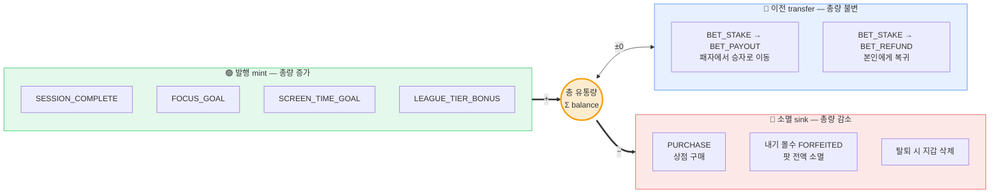
```mermaid
flowchart LR
    subgraph MINT["🟢 발행 mint — 총량 증가"]
        M1["SESSION_COMPLETE"]
        M2["FOCUS_GOAL"]
        M3["SCREEN_TIME_GOAL"]
        M4["LEAGUE_TIER_BONUS"]
    end
    subgraph XFER["🔵 이전 transfer — 총량 불변"]
        X1["BET_STAKE → BET_PAYOUT<br/>패자에서 승자로 이동"]
        X2["BET_STAKE → BET_REFUND<br/>본인에게 복귀"]
    end
    subgraph SINK["🔴 소멸 sink — 총량 감소"]
        K1["PURCHASE<br/>상점 구매"]
        K2["내기 몰수 FORFEITED<br/>팟 전액 소멸"]
        K3["탈퇴 시 지갑 삭제"]
    end

    MINT ==>|"+"| POOL(("총 유통량<br/>Σ balance")):::pool
    POOL <-->|"±0"| XFER
    POOL ==>|"−"| SINK

    classDef pool fill:#f59e0b33,stroke:#f59e0b,stroke-width:3px
    style MINT fill:#22c55e1f,stroke:#22c55e
    style XFER fill:#3b82f61f,stroke:#3b82f6
    style SINK fill:#ef44441f,stroke:#ef4444
```

> ⚠️ `BET_STAKE` 합계를 그대로 "소비"로 세면 **경제 지표가 완전히 틀어진다.**
> 대부분 `BET_PAYOUT`으로 돌아오기 때문이다. 실제 소멸분은
> `Σ BET_STAKE − Σ BET_PAYOUT − Σ BET_REFUND` (= 몰수분)이다.

| ID | 지표 | 산출식 | 위험 신호 | 측정 |
|---|---|---|---|---|
| **G1** | **싱크 비율** | 주간 소멸 ÷ 주간 발행 | **< 0.5 = 인플레이션** (쌓이기만 함)<br/>**> 1.2 = 디플레이션** (못 모음) | 원장 |
| G2 | 총 유통량 증가율 | (금주 Σbalance − 전주) ÷ 전주 | 주 20% 초과 지속 | 지갑 |
| G3 | 보유 집중도 | 상위 10% 유저의 잔액 점유율 | > 60% | 지갑 |
| G4 | **경로 편중도** | 최대 발행 경로의 비중 | **> 70%** (한 경로가 지배 = 밸런스 붕괴) | 원장 |
| G5 | 몰수 소멸량 | Σ STAKE − Σ PAYOUT − Σ REFUND | 급증 = 달성 난이도 과다 | 원장 |
| G6 | **획득 이상치** | 1일 획득량 p99.9 초과 유저 | 어뷰징 신호 | 원장 |
| G7 | 지급 실패율 | 정산 실패 건 ÷ 정산 대상 건 | > 0.1% | 로그 |
| G8 | **정합 오차** | Σ 원장(부호 적용) vs Σ 지갑 잔액 | **≠ 0 이면 즉시 조사** | 원장 + 지갑 |

> **G8이 0이 아니면 다른 모든 지표를 믿을 수 없다.** 현재 이 감사가 없다 → REQ-R5.

### 2.5 측정 가능성 — 지금 되는 것 / 계측이 필요한 것

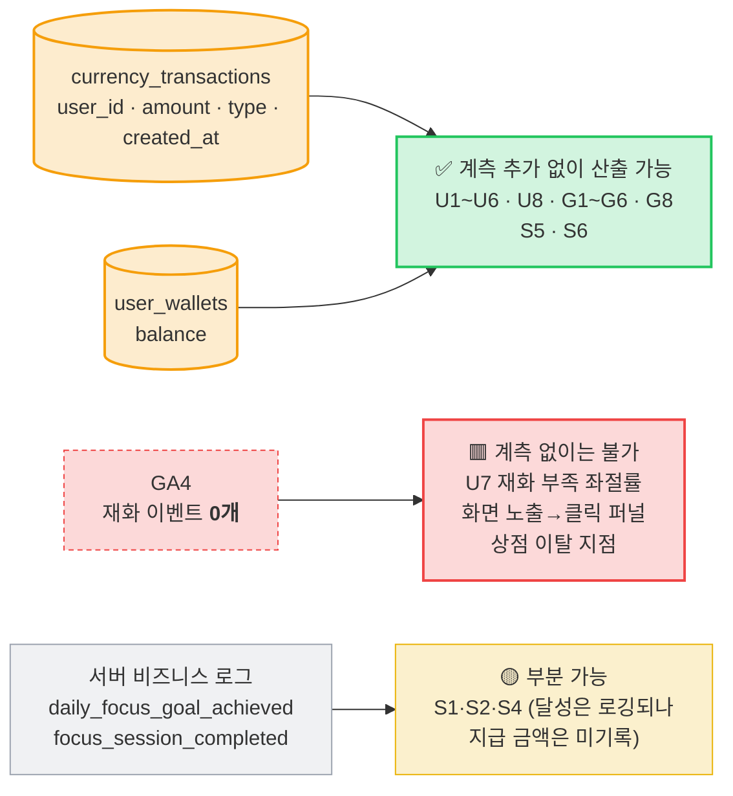
```mermaid
flowchart LR
    LEDGER[("currency_transactions<br/>user_id · amount · type · created_at")]:::db
    WALLET[("user_wallets<br/>balance")]:::db
    GA4["GA4<br/>재화 이벤트 <b>0개</b>"]:::gap

    LEDGER --> OK["✅ 계측 추가 없이 산출 가능<br/>U1~U6 · U8 · G1~G6 · G8<br/>S5 · S6"]:::ok
    WALLET --> OK
    GA4 --> NG["🟥 계측 없이는 불가<br/>U7 재화 부족 좌절률<br/>화면 노출→클릭 퍼널<br/>상점 이탈 지점"]:::no

    SRV["서버 비즈니스 로그<br/>daily_focus_goal_achieved<br/>focus_session_completed"]:::jae --> PART["🟡 부분 가능<br/>S1·S2·S4 (달성은 로깅되나<br/>지급 금액은 미기록)"]:::part

    classDef db fill:#f59e0b33,stroke:#f59e0b,stroke-width:2px
    classDef ok fill:#22c55e33,stroke:#22c55e,stroke-width:2px
    classDef no fill:#ef444433,stroke:#ef4444,stroke-width:2px
    classDef part fill:#eab30833,stroke:#eab308
    classDef gap fill:#ef444433,stroke:#ef4444,stroke-dasharray:4 3
    classDef jae fill:#9ca3af26,stroke:#9ca3af
```

**핵심: 재화 지표의 대부분은 이미 측정 가능하다.** 원장이 모든 변동을 `user_id · amount · type · created_at`으로
남기고 있어서, 대시보드를 붙이는 것 말고 새로 계측할 게 없다. 예:

```sql
-- G1 싱크 비율 (주간). 내기는 이전이라 제외하고, 몰수분만 소멸로 계산한다
WITH w AS (
  SELECT type, SUM(amount) AS amt FROM currency_transactions
  WHERE created_at >= now() - interval '7 days' GROUP BY type
)
SELECT
  ( COALESCE((SELECT amt FROM w WHERE type='PURCHASE'), 0)
  + COALESCE((SELECT amt FROM w WHERE type='BET_STAKE'), 0)
  - COALESCE((SELECT amt FROM w WHERE type='BET_PAYOUT'), 0)
  - COALESCE((SELECT amt FROM w WHERE type='BET_REFUND'), 0) )::float
  / NULLIF((SELECT SUM(amt) FROM w
            WHERE type IN ('SESSION_COMPLETE','FOCUS_GOAL',
                           'SCREEN_TIME_GOAL','LEAGUE_TIER_BONUS','STREAK_BONUS')), 0)
  AS sink_ratio;
```

```sql
-- G8 정합 오차. 0이 아니면 즉시 조사
SELECT (SELECT SUM(CASE WHEN type IN ('PURCHASE','BET_STAKE')
                        THEN -amount ELSE amount END) FROM currency_transactions)
     - (SELECT SUM(balance) FROM user_wallets) AS drift;
```

> ⚠️ `deleted_at IS NULL` 필터를 넣지 않는다 — `user_wallets`는 **하드 삭제**되므로 행 자체가 없다
> (`deleted_at`은 컬럼만 있고 미배선).
>
> ⚠️ 그래서 `drift`는 **탈퇴로 소멸한 잔액만큼 구조적으로 벌어진다** — 지갑은 지워지지만 원장은 보존되기
> 때문이다. 감사 배치는 탈퇴 소멸분을 별도 집계해 차감해야 하며, 그러려면 **탈퇴 시점 잔액을 어딘가
> 남겨야 한다**(현재 남기지 않는다). 소프트 딜리트 전환이 이 문제를 함께 푼다.

### 2.6 계측 요구사항

| ID | 요구 | 우선순위 | 비고 |
|---|---|---|---|
| **REQ-M1** | **경제 건전성 주간 리포트** — G1~G6·G8을 원장 SQL로 산출해 대시보드화 | **High** | 새 계측 0. 쿼리 + 대시보드만 |
| **REQ-M2** | GA4 재화 이벤트 4종 정의 — `currency_earned`(type·amount) · `currency_spent` · `currency_history_viewed` · `currency_insufficient` | **High** | U7·퍼널이 여기 걸려 있다 |
| REQ-M3 | 서버 달성 로그에 **지급 금액 필드 추가** | Medium | S1·S2를 금액과 연결 |
| REQ-M4 | G6 획득 이상치 · G7 지급 실패율 알림 규칙 | Medium | 로그 기반 |
| REQ-M5 | **베이스라인 2주 관측 후 잠정 목표값 확정** | **선행 조건** | 아래 참고 |

> ### ⚠️ 목표값은 전부 잠정치다
> 재화 기능이 배포된 지 얼마 되지 않아 **베이스라인이 없다.** 위 표의 목표 수치는 착수 기준선일 뿐
> 검증된 값이 아니다. REQ-M1을 먼저 붙여 2주 관측한 뒤 목표를 확정하는 순서가 맞다.
> 지금 이 숫자들로 성패를 판정하면 안 된다.

---

## 3. 유저 이벤트 정의 (신규)

### 3.1 현황 — 재화 이벤트가 0개다

기존 GA4 이벤트는 44종인데 **재화 관련은 단 하나도 없다.** 그래서 지금은
"보상을 받았는데 사용자가 그걸 봤는지", "잔액이 부족해서 막혔는지"를 전혀 알 수 없다.

### 3.2 이벤트 소유권 — 획득은 서버, 조작은 클라

기존 규약(`analyticsEvents.ts` 상단)에 **"서버 소스 이벤트를 클라에서 중복 발행하면 이중 집계된다"**가
명시돼 있다. 재화는 이 원칙이 특히 중요하다:

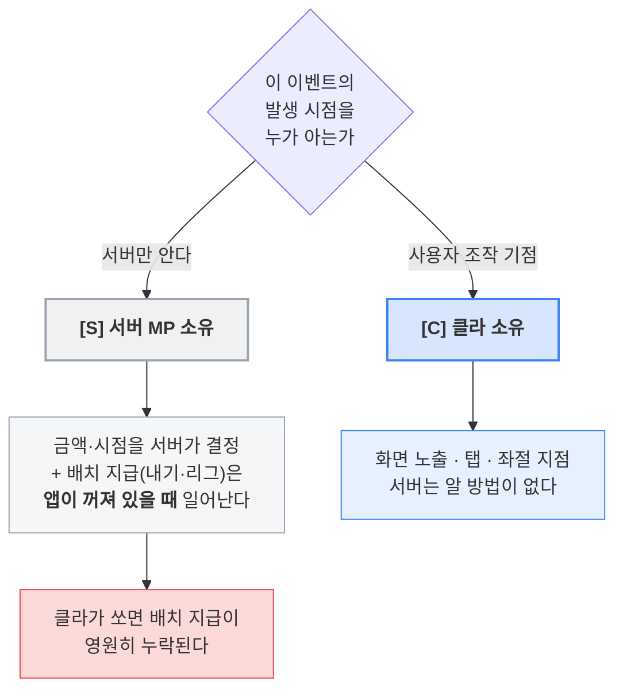
```mermaid
flowchart TD
    Q{"이 이벤트의<br/>발생 시점을<br/>누가 아는가"}

    Q -->|"서버만 안다"| S["<b>[S] 서버 MP 소유</b>"]:::srv
    S --> S1["금액·시점을 서버가 결정<br/>+ 배치 지급(내기·리그)은<br/><b>앱이 꺼져 있을 때</b> 일어난다"]:::srvn
    S1 --> S2["클라가 쏘면 배치 지급이<br/>영원히 누락된다"]:::bad

    Q -->|"사용자 조작 기점"| C["<b>[C] 클라 소유</b>"]:::cli
    C --> C1["화면 노출 · 탭 · 좌절 지점<br/>서버는 알 방법이 없다"]:::clin

    classDef srv fill:#9ca3af26,stroke:#9ca3af,stroke-width:2px
    classDef srvn fill:#9ca3af1a,stroke:#9ca3af
    classDef cli fill:#3b82f633,stroke:#3b82f6,stroke-width:2px
    classDef clin fill:#3b82f61f,stroke:#3b82f6
    classDef bad fill:#ef444433,stroke:#ef4444
```

> **핵심**: 내기 정산과 리그 승급은 **새벽 배치**에서 지급된다. 그때 앱은 꺼져 있다.
> 획득 이벤트를 클라가 소유하면 이 두 경로가 통째로 측정에서 빠진다.

### 3.3 신규 이벤트 명세

#### [S] 서버 MP 소유 — 2종

| 이벤트 | 발행 시점 | 파라미터 | 채우는 지표 |
|---|---|---|---|
| **`currency_earned`** | `credit()`가 **`true` 반환** 시 (실제 반영된 건만) | `type`(사유 9종) · `amount` · `is_batch`(bool) · `balance_after` | U1·U2·G1·G4·G6·S3 |
| **`currency_spent`** | `debit()` / 구매 차감 성공 시 | `type`(`PURCHASE`\|`BET_STAKE`) · `amount` · `balance_after` | U3·G1·U8 |

> ⚠️ **멱등 스킵(`false` 반환)은 발행하지 않는다.** 배치 재실행마다 이벤트를 쏘면
> 실제 지급 1회가 GA4에서 여러 건으로 잡혀 **발행량 지표가 부풀려진다.**
> 반환값 `boolean`이 여기서 한 번 더 쓰인다.

#### [C] 클라 소유 — 4종

| 이벤트 | 발행 시점 | 파라미터 | 채우는 지표 |
|---|---|---|---|
| **`currency_reward_shown`** | +N 배지·모달이 **실제로 노출**될 때 | `surface`(`focus_result`\|`goal_modal`\|`screentime_modal`\|`league_result`) · `amount` · `reward_type` | **보상 인지율** |
| **`currency_insufficient`** | 잔액 부족으로 막혔을 때 | `context`(`bet`\|`shop`) · `required` · `shortfall`(부족분) | **U7** |
| **`currency_history_viewed`** | 내역 화면 진입 | `entry`(`home_chip`\|`menu_chip`) · `tx_count` | 내역 사용도 |
| **`currency_chip_tapped`** | 잔액 칩 탭 | `location`(`home`\|`menu`) | 잔액 관심도 |

#### 유저 속성 1종

| 속성 | 값 | 용도 |
|---|---|---|
| `currency_balance_bucket` | `0` \| `1-99` \| `100-499` \| `500+` | S3 코호트 비교 · 세그먼트 분석 |

> 잔액 원값은 유저 속성으로 보내지 않는다 — 버킷만. 기존 규약의 **"파생 비식별값만"** 방침에 맞춘다.

### 3.4 `currency_reward_shown`이 왜 중요한가

서버 `currency_earned`와 짝을 지으면 **"지급했지만 사용자가 못 본 보상"**을 잡아낼 수 있다.

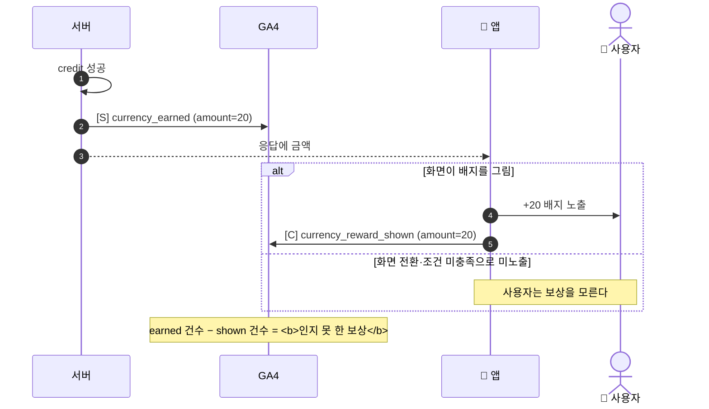
```mermaid
sequenceDiagram
    autonumber
    participant S as 서버
    participant G as GA4
    participant A as 📱 앱
    actor U as 👤 사용자

    S->>S: credit 성공
    S->>G: [S] currency_earned (amount=20)
    S-->>A: 응답에 금액
    alt 화면이 배지를 그림
        A->>U: +20 배지 노출
        A->>G: [C] currency_reward_shown (amount=20)
    else 화면 전환·조건 미충족으로 미노출
        Note over A,U: 사용자는 보상을 모른다
    end
    Note over G: earned 건수 − shown 건수 = <b>인지 못 한 보상</b>
```

이 격차가 크면 **지급 로직이 아니라 표시 로직을 고쳐야 한다** — 실제로 재화 관련 결함은
지급보다 표시 쪽에서 더 많이 나왔다.

### 3.5 구현 요구사항

| ID | 요구 | 담당 | 우선순위 |
|---|---|---|---|
| **REQ-E1** | `currency_earned` · `currency_spent` 서버 MP 발행 (멱등 스킵 제외) | BE | **High** |
| **REQ-E2** | `currency_reward_shown` · `currency_insufficient` 클라 발행 | 앱 | **High** |
| **REQ-E3** | `currency_history_viewed` · `currency_chip_tapped` 클라 발행 | 앱 | Medium |
| **REQ-E4** | `currency_balance_bucket` 유저 속성 세팅 | 앱 | Medium |
| **REQ-E5** | `analyticsEvents.ts`에 타입드 헬퍼 추가 + `GA4_이벤트_현황.md` 갱신 | 앱 | High |

> REQ-M2를 이 6종으로 확정한다(기존 4종 제안에서 `currency_reward_shown`·`currency_chip_tapped` 추가).

### 3.6 ⚠️ 상점 이벤트는 유보 — 소비처가 살아 있지 않다

**현재 앱에서 상점에 도달할 수 없다.** `PURCHASE`를 일으키는 `buyItem()`의 유일한 호출부가
`legacy/screens/ShopScreen.tsx`인데, 이 화면은 **네비게이션에 등록돼 있지 않고** 프로젝트 규칙상
라이브 코드는 `legacy/`를 import하지 않는다.

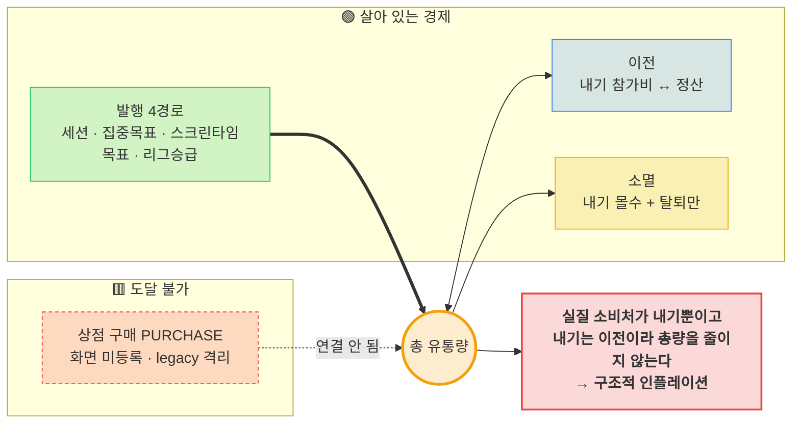
```mermaid
flowchart LR
    subgraph ALIVE["🟢 살아 있는 경제"]
        M["발행 4경로<br/>세션 · 집중목표 · 스크린타임목표 · 리그승급"]:::ok
        X["이전<br/>내기 참가비 ↔ 정산"]:::xfer
        K["소멸<br/>내기 몰수 + 탈퇴만"]:::part
    end
    subgraph DEAD["🟥 도달 불가"]
        SH["상점 구매 PURCHASE<br/>화면 미등록 · legacy 격리"]:::gap
    end

    M ==> POOL(("총 유통량")):::pool
    POOL <--> X
    POOL --> K
    SH -.->|"연결 안 됨"| POOL

    POOL --> CONCL["<b>실질 소비처가 내기뿐이고<br/>내기는 이전이라 총량을 줄이지 않는다<br/>→ 구조적 인플레이션</b>"]:::bad

    classDef ok fill:#22c55e33,stroke:#22c55e
    classDef xfer fill:#3b82f633,stroke:#3b82f6
    classDef part fill:#eab30833,stroke:#eab308
    classDef gap fill:#ef444433,stroke:#ef4444,stroke-dasharray:4 3
    classDef pool fill:#f59e0b33,stroke:#f59e0b,stroke-width:3px
    classDef bad fill:#ef444433,stroke:#ef4444,stroke-width:2px
```

**이것이 지표에 미치는 영향:**

| 지표 | 예상값 | 의미 |
|---|---|---|
| **G1 싱크 비율** | **≈ 0** (몰수분만) | 위험 임계 0.5를 한참 밑돈다 — **인플레이션 확정** |
| **U6 미소비 유저 비율** | **≈ 100%** | 소비처가 없으니 당연 |
| **U3 1인당 소비량** | 내기 참가비만 | 실질 소비 아님 (돌아옴) |
| **S6 상점 구매 전환율** | **측정 불가** | 화면 자체가 없음 |
| U5 첫 획득→첫 소비 | 측정 불가 | 같은 이유 |

> **따라서 상점 이벤트(`shop_item_viewed` 등)는 지금 정의하지 않는다** — 화면이 없는데 이벤트를
> 만들면 죽은 이벤트가 되고, 온보딩 퍼널에서 죽은 이벤트가 지표를 왜곡한 전례가 있다.
> **아이템 API + 상점 화면이 살아날 때 함께 정의한다.**

> **동시에 이건 지표 문제가 아니라 기능 갭이다.** 재화를 계속 발행하면서 쓸 곳을 주지 않으면
> §1의 순환(획득 → 소비 → 경쟁)이 반쪽으로 돌아간다. §11 갭에 반영했다.

---

## 4. 재화 정의

| 항목 | 값 |
|---|---|
| 명칭 | **시간조각** (UI 노출명) |
| 코드 식별자 | `coin` / `currency` |
| 종류 | **단일 재화** |
| 현금 충전·환전 | **없음.** 인게임 전용 → **금융 정산·PG 연동 대상이 아니다** |
| 아이콘 | 커스텀 컴포넌트 `CurrencyIcon` 🟦 |

> ### ⚠️ "현금이 아니다"가 §8·§9 여러 판단의 근거다
> 기획서에 있는 **기프티콘/포인트 정산**이 실제로 들어오는 순간 이 전제가 깨지고 요구사항 전체를 다시 봐야 한다.

---

## 5. 획득 · 소비 경로

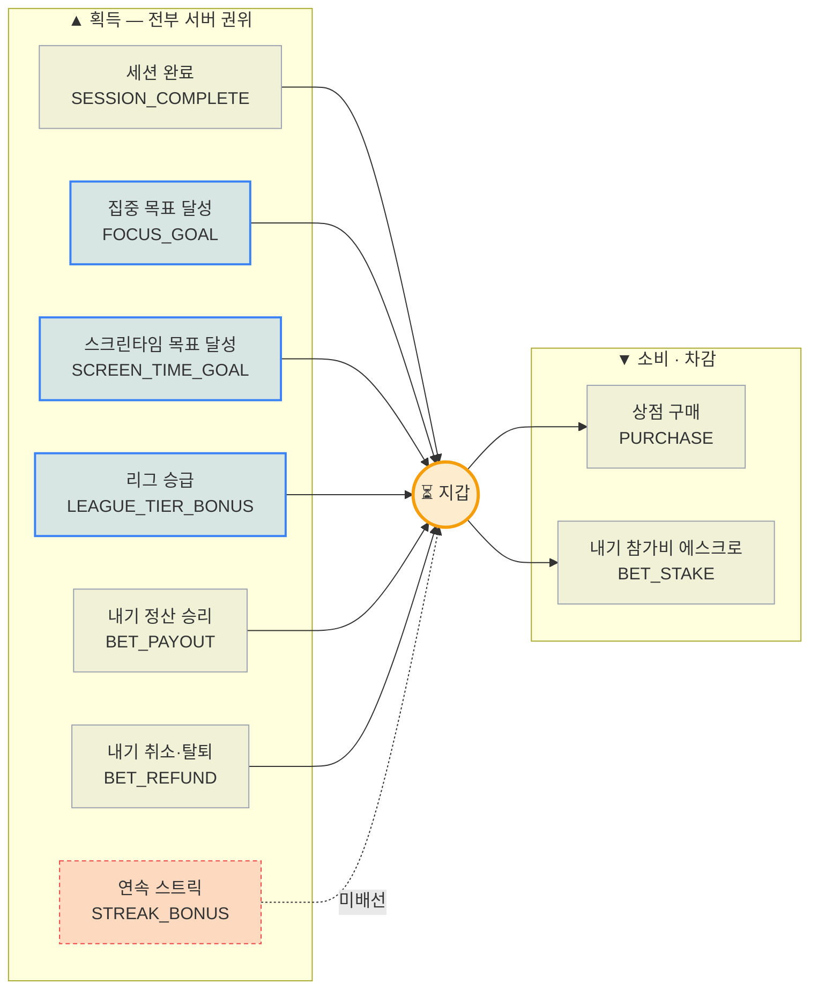
```mermaid
flowchart LR
    subgraph EARN["▲ 획득 — 전부 서버 권위"]
        E1["세션 완료<br/>SESSION_COMPLETE"]:::jae
        E2["집중 목표 달성<br/>FOCUS_GOAL"]:::oscar
        E3["스크린타임 목표 달성<br/>SCREEN_TIME_GOAL"]:::oscar
        E4["리그 승급<br/>LEAGUE_TIER_BONUS"]:::oscar
        E5["내기 정산 승리<br/>BET_PAYOUT"]:::jae
        E6["내기 취소·탈퇴<br/>BET_REFUND"]:::jae
        E7["연속 스트릭<br/>STREAK_BONUS"]:::gap
    end

    WALLET(("⏳ 지갑")):::coin

    subgraph SPEND["▼ 소비 · 차감"]
        S1["상점 구매<br/>PURCHASE"]:::jae
        S2["내기 참가비 에스크로<br/>BET_STAKE"]:::jae
    end

    E1 & E2 & E3 & E4 & E5 & E6 --> WALLET
    E7 -.->|"미배선"| WALLET
    WALLET --> S1 & S2

    classDef oscar fill:#3b82f633,stroke:#3b82f6,stroke-width:2px
    classDef jae fill:#9ca3af26,stroke:#9ca3af
    classDef gap fill:#ef444433,stroke:#ef4444,stroke-dasharray:4 3
    classDef coin fill:#f59e0b33,stroke:#f59e0b,stroke-width:3px
```

| # | type | 조건 | 금액 | 구현 |
|---|---|---|---|---|
| 1 | `SESSION_COMPLETE` | 집중 세션 저장 | 집중 delta초 ÷ 10 | ⬜ |
| 2 | `FOCUS_GOAL` | 하루 집중 목표 달성 전이 | 목표 1시간당 **+10**, 8시간(+80) 동결 | 🟦 |
| 3 | `SCREEN_TIME_GOAL` | 사용 상한 이하 달성 전이 | 상한 낮을수록 큼 — ≤1h **+80** ~ >7h **+10** | 🟦 |
| 4 | `LEAGUE_TIER_BONUS` | 주간 배치 상위 티어 승급 | 티어 2 **+50** / 3 **+100** / 4 **+200** / 5 **+500** | 🟦 |
| 5 | `BET_PAYOUT` | 내기 정산 승자 분배 | 팟 ÷ 달성자 수 (잔여는 성과 1위) | ⬜ |
| 6 | `BET_REFUND` | 내기 취소 · 그룹 탈퇴 | 참가비 전액 | ⬜ |
| 7 | `PURCHASE` | 상점 구매 — **유일한 클라 개방 경로** | 아이템 가격 | ⬜ |
| 8 | `BET_STAKE` | 내기 개설·참가 즉시 차감 | 참가비 1~1000코인 유저 입력 | ⬜ |
| — | `STREAK_BONUS` | 🟥 **미배선** | — | — |

정확한 공식은 [LLD §1](./low-level-design.md).

---

## 6. 확정된 정책

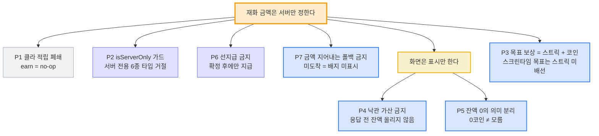
```mermaid
flowchart TD
    ROOT["재화 금액은 서버만 정한다"]:::root

    ROOT --> P1["P1 클라 적립 폐쇄<br/>earn = no-op"]:::jae
    ROOT --> P2["P2 isServerOnly 가드<br/>서버 전용 6종 타입 거절"]:::both
    ROOT --> P6["P6 선지급 금지<br/>확정 후에만 지급"]:::both
    ROOT --> P7["P7 금액 지어내는 폴백 금지<br/>미도착 = 배지 미표시"]:::oscar

    ROOT --> UI["화면은 표시만 한다"]:::root2
    UI --> P4["P4 낙관 가산 금지<br/>응답 전 잔액 올리지 않음"]:::oscar
    UI --> P5["P5 잔액 0의 의미 분리<br/>0코인 ≠ 모름"]:::oscar

    ROOT --> P3["P3 목표 보상 = 스트릭 + 코인<br/>스크린타임 목표는 스트릭 미배선"]:::oscar

    classDef root fill:#f59e0b33,stroke:#f59e0b,stroke-width:3px
    classDef root2 fill:#eab30833,stroke:#eab308,stroke-width:2px
    classDef oscar fill:#3b82f633,stroke:#3b82f6,stroke-width:2px
    classDef jae fill:#9ca3af26,stroke:#9ca3af
    classDef both fill:#6366f133,stroke:#6366f1
```

| # | 정책 | 근거 |
|---|---|---|
| **P1** | 클라 적립 전면 폐쇄 — `POST /currency/earn`은 no-op(204만) | 클라가 금액을 정하면 임의 민팅 가능. 구앱 호환으로 응답만 유지하고 호출 잔존을 로그 감시 |
| **P2** | `isServerOnly()` 가드 — 서버 전용 6종은 클라 경로에서 타입 자체 거절 | 원장에 정산 기입과 구분 안 되는 행이 섞이면 정합을 사후 검증할 수 없다 |
| **P3** | 목표 달성 보상 = 스트릭 + 코인 둘 다 | 스크린타임 목표는 스트릭 미배선 (비대칭) |
| **P4** | 낙관 가산 금지 | 진행 중이던 잔액 응답이 지급 전/후 스냅샷인지 앱이 구분할 수 없어 어느 쪽으로 보정해도 반대편이 틀림 |
| **P5** | 잔액 0의 의미 분리 | 화면이 사용자 재산에 대해 거짓을 말하지 않게 |
| **P6** | 선지급 금지 — 확정된 뒤에만 지급 | 지급은 되돌릴 수 없다 (§9.1 R1) |
| **P7** | 금액을 지어내는 폴백 금지 | 클라가 다시 계산하면 지급 실패를 정상으로 위장한다 |

---

## 7. 지급 데이터 왕복 (현재)

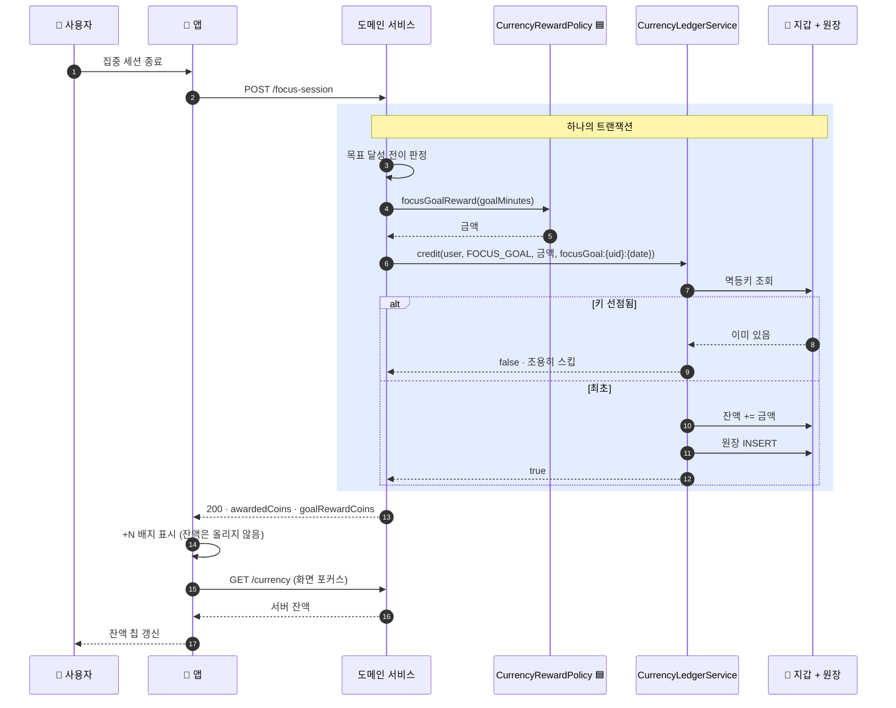
```mermaid
sequenceDiagram
    autonumber
    participant U as 👤 사용자
    participant A as 📱 앱
    participant D as 도메인 서비스
    participant P as CurrencyRewardPolicy 🟦
    participant L as CurrencyLedgerService
    participant DB as 💾 지갑 + 원장

    U->>A: 집중 세션 종료
    A->>D: POST /focus-session

    rect rgba(59, 130, 246, 0.14)
    note over D,DB: 하나의 트랜잭션
    D->>D: 목표 달성 전이 판정
    D->>P: focusGoalReward(goalMinutes)
    P-->>D: 금액
    D->>L: credit(user, FOCUS_GOAL, 금액, focusGoal:{uid}:{date})
    L->>DB: 멱등키 조회
    alt 키 선점됨
        DB-->>L: 이미 있음
        L-->>D: false · 조용히 스킵
    else 최초
        L->>DB: 잔액 += 금액
        L->>DB: 원장 INSERT
        L-->>D: true
    end
    end

    D-->>A: 200 · awardedCoins · goalRewardCoins
    A->>A: +N 배지 표시 (잔액은 올리지 않음)
    A->>D: GET /currency (화면 포커스)
    D-->>A: 서버 잔액
    A-->>U: 잔액 칩 갱신
```

---

## 8. 실시간 정산 트랜잭션 — 계획

### 8.1 현황 — 이미 6/8이 실시간이다

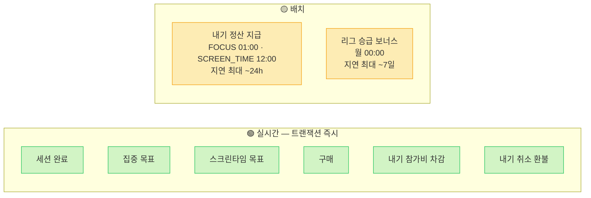
```mermaid
flowchart LR
    subgraph RT["🟢 실시간 — 트랜잭션 즉시"]
        direction TB
        T1["세션 완료"]:::rt
        T2["집중 목표"]:::rt
        T3["스크린타임 목표"]:::rt
        T4["구매"]:::rt
        T5["내기 참가비 차감"]:::rt
        T6["내기 취소 환불"]:::rt
    end

    subgraph BT["🟡 배치"]
        direction TB
        B1["내기 정산 지급<br/>FOCUS 01:00 · SCREEN_TIME 12:00<br/>지연 최대 ~24h"]:::bt
        B2["리그 승급 보너스<br/>월 00:00<br/>지연 최대 ~7일"]:::bt
    end

    classDef rt fill:#22c55e33,stroke:#22c55e
    classDef bt fill:#f59e0b33,stroke:#f59e0b
```

**재화 지급의 대부분은 이미 "끝날 때마다 트랜잭션을 도는" 구조다.**
남은 배치 2종을 실시간화할 수 있는지가 이 계획의 전부다.

### 8.2 실시간 전환 가능성 판정

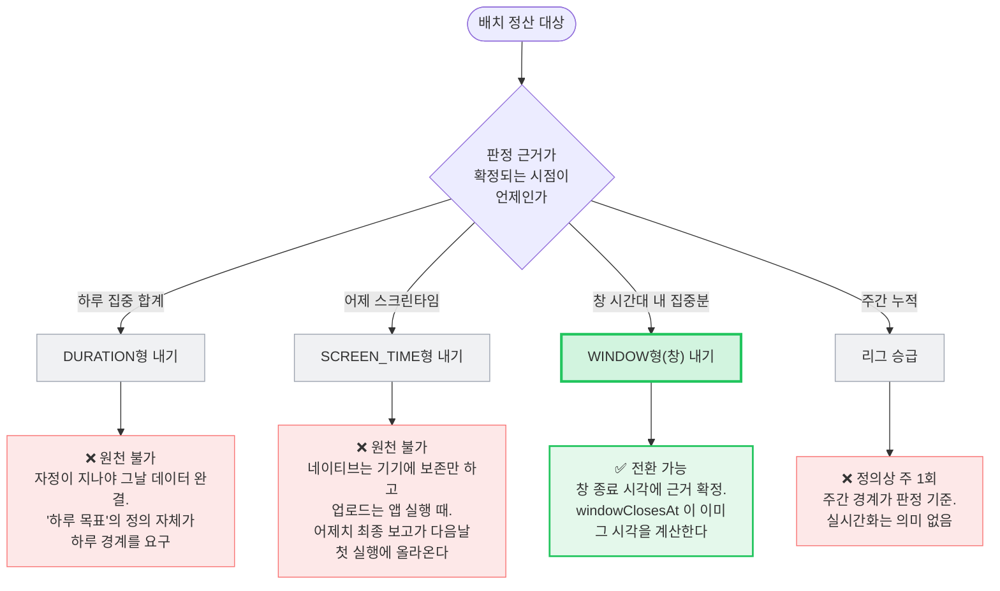
```mermaid
flowchart TD
    START(["배치 정산 대상"]) --> Q1{"판정 근거가<br/>확정되는 시점이<br/>언제인가"}

    Q1 -->|"하루 집중 합계"| D1["DURATION형 내기"]:::no
    D1 --> R1["❌ 원천 불가<br/>자정이 지나야 그날 데이터 완결.<br/>'하루 목표'의 정의 자체가<br/>하루 경계를 요구"]:::nored

    Q1 -->|"어제 스크린타임"| D2["SCREEN_TIME형 내기"]:::no
    D2 --> R2["❌ 원천 불가<br/>네이티브는 기기에 보존만 하고<br/>업로드는 앱 실행 때.<br/>어제치 최종 보고가 다음날<br/>첫 실행에 올라온다"]:::nored

    Q1 -->|"창 시간대 내 집중분"| D3["WINDOW형(창) 내기"]:::yes
    D3 --> R3["✅ 전환 가능<br/>창 종료 시각에 근거 확정.<br/>windowClosesAt 이 이미<br/>그 시각을 계산한다"]:::yesgreen

    Q1 -->|"주간 누적"| D4["리그 승급"]:::no
    D4 --> R4["❌ 정의상 주 1회<br/>주간 경계가 판정 기준.<br/>실시간화는 의미 없음"]:::nored

    classDef yes fill:#22c55e33,stroke:#22c55e,stroke-width:3px
    classDef no fill:#9ca3af26,stroke:#9ca3af
    classDef yesgreen fill:#22c55e1f,stroke:#22c55e,stroke-width:2px
    classDef nored fill:#ef44441f,stroke:#f87171
```

> ### 실시간 전환 대상은 **창형(WINDOW) 내기 정산 하나**다.

### 8.3 Phase 계획

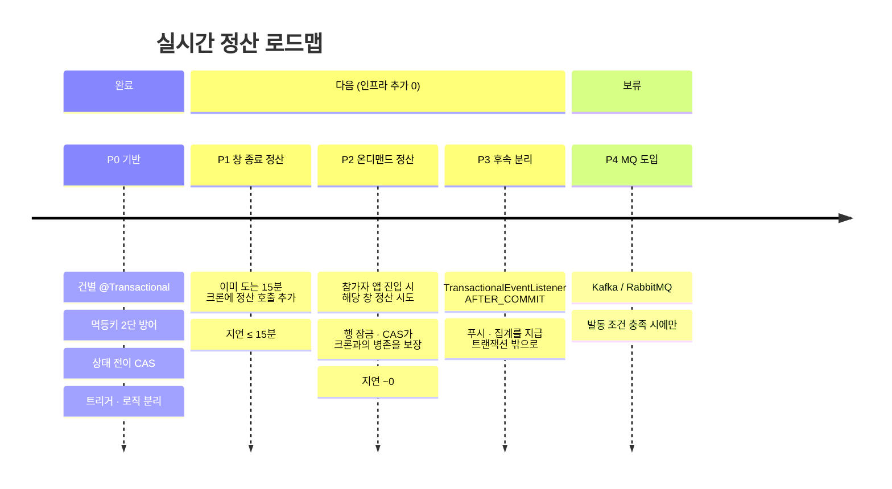
```mermaid
timeline
    title 실시간 정산 로드맵
    section 완료
        P0 기반 : 건별 @Transactional
                : 멱등키 2단 방어
                : 상태 전이 CAS
                : 트리거 · 로직 분리
    section 다음 (인프라 추가 0)
        P1 창 종료 정산 : 이미 도는 15분 크론에 정산 호출 추가
                       : 지연 ≤ 15분
        P2 온디맨드 정산 : 참가자 앱 진입 시 해당 창 정산 시도
                       : 행 잠금 · CAS가 크론과의 병존을 보장
                       : 지연 ~0
        P3 후속 분리 : TransactionalEventListener AFTER_COMMIT
                    : 푸시 · 집계를 지급 트랜잭션 밖으로
    section 보류
        P4 MQ 도입 : Kafka / RabbitMQ
                  : 발동 조건 충족 시에만
```

| Phase | 방식 | 인프라 추가 | 지연 | 상태 |
|---|---|---|---|---|
| **P0** | 건별 `@Transactional` + 멱등키 + CAS | — | — | 🟩 **완료** |
| **P1** | **이미 도는 15분 크론에 정산을 붙인다** — 창 종료 감지 크론(`0 */15 * * * *`)이 이미 존재 | **없음** | ≤15분 | 미착수 |
| **P2** | 참가자 앱 진입 시 온디맨드 정산 | **없음** | ~0 | 미착수 |
| **P3** | `@TransactionalEventListener(AFTER_COMMIT)` — 커밋 후 실행 보장 + 후속 실패가 지급을 롤백하지 않음 | **없음** (Spring 내장) | — | 미착수 |
| **P4** | MQ — 정산 이벤트 발행 → 별도 소비자 | **큼** | — | **보류** |

> **P1이 비용 대비 효과가 압도적이다.** 새 인프라도, 새 크론도, 새 트랜잭션 설계도 필요 없다.
> 이미 있는 크론에 이미 있는 정산 호출을 붙이는 일이고, 창형 내기 사용자의 가장 큰 불만
> ("내기가 끝났는데 결과를 내일까지 못 본다")이 해소된다.

### 8.4 P1 후 데이터 흐름

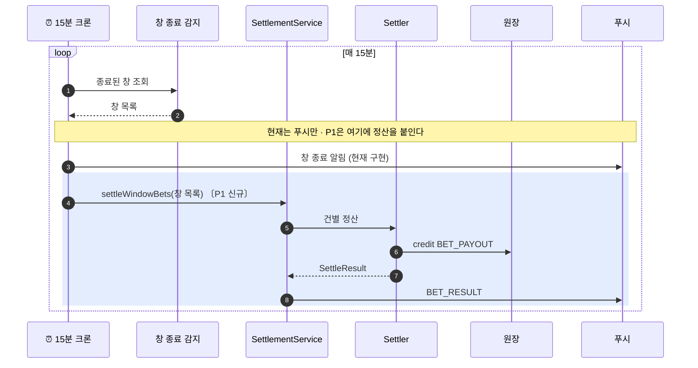
```mermaid
sequenceDiagram
    autonumber
    participant CRON as ⏰ 15분 크론
    participant W as 창 종료 감지
    participant SS as SettlementService
    participant ST as Settler
    participant L as 원장
    participant PUSH as 푸시

    loop 매 15분
        CRON->>W: 종료된 창 조회
        W-->>CRON: 창 목록
        note over CRON,PUSH: 현재는 푸시만 · P1은 여기에 정산을 붙인다
        CRON->>PUSH: 창 종료 알림 (현재 구현)
        rect rgba(59, 130, 246, 0.14)
        CRON->>SS: settleWindowBets(창 목록) 〔P1 신규〕
        SS->>ST: 건별 정산
        ST->>L: credit BET_PAYOUT
        ST-->>SS: SettleResult
        SS->>PUSH: BET_RESULT
        end
    end
```

### 8.5 요구사항

| ID | 요구 | 우선순위 |
|---|---|---|
| **REQ-T1** | 창형 내기는 창 종료 후 15분 이내에 정산된다 | High |
| **REQ-T2** | 실시간 정산과 일 배치가 같은 내기를 동시에 집어도 지급은 정확히 1회 | High · 🟩 기반 존재 |
| **REQ-T3** | 정산 트리거가 늘어나도 정산 로직은 하나를 공유한다 | High · 🟩 기반 존재 |
| **REQ-T4** | 지급 후속 작업(푸시·이벤트) 실패가 지급을 롤백하지 않는다 | Medium |
| **REQ-T5** | DURATION·SCREEN_TIME형은 배치를 유지한다 — 실시간화가 오히려 오판정을 만든다 | 확정 |

### 8.6 MQ(Kafka/RabbitMQ) 판단

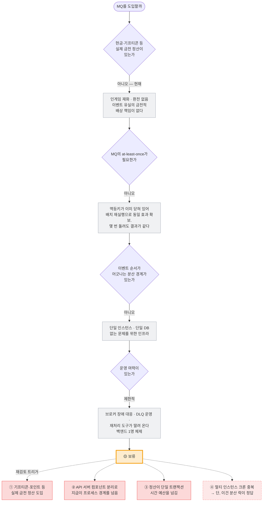
```mermaid
flowchart TD
    Q(["MQ를 도입할까"]) --> C1{"현금·기프티콘 등<br/>실제 금전 정산이<br/>있는가"}
    C1 -->|"아니오 — 현재"| N1["인게임 재화 · 환전 없음<br/>이벤트 유실의 금전적<br/>배상 책임이 없다"]:::no

    N1 --> C2{"MQ의 at-least-once가<br/>필요한가"}
    C2 -->|"아니오"| N2["멱등키가 이미 닫혀 있어<br/>배치 재실행으로 동일 효과 확보.<br/>몇 번 돌려도 결과가 같다"]:::no

    N2 --> C3{"이벤트 순서가<br/>어긋나는 분산 경계가<br/>있는가"}
    C3 -->|"아니오"| N3["단일 인스턴스 · 단일 DB<br/>없는 문제를 위한 인프라"]:::no

    N3 --> C4{"운영 여력이<br/>있는가"}
    C4 -->|"제한적"| N4["브로커 장애 대응 · DLQ 운영 ·<br/>재처리 도구가 딸려 온다<br/>백엔드 1명 체제"]:::no

    N4 --> HOLD["🟡 보류"]:::hold

    HOLD -.->|"재검토 트리거"| T1["① 기프티콘·포인트 등<br/>실제 금전 정산 도입"]:::trig
    HOLD -.-> T2["② API 서버 컴포넌트 분리로<br/>지급이 프로세스 경계를 넘음"]:::trig
    HOLD -.-> T3["③ 정산이 단일 트랜잭션<br/>시간 예산을 넘김"]:::trig
    HOLD -.-> T4["④ 멀티 인스턴스 크론 중복<br/>→ 단, 이건 분산 락이 정답"]:::trigalt

    classDef no fill:#9ca3af26,stroke:#9ca3af
    classDef hold fill:#f59e0b33,stroke:#f59e0b,stroke-width:3px
    classDef trig fill:#ef444433,stroke:#ef4444
    classDef trigalt fill:#ef44441f,stroke:#f87171,stroke-dasharray:4 3
```

①이 가장 유력한 트리거다 — 기획서에 이미 언급돼 있다.

---

## 9. 실패 시 롤백 전략 — 계획

### 9.1 원칙

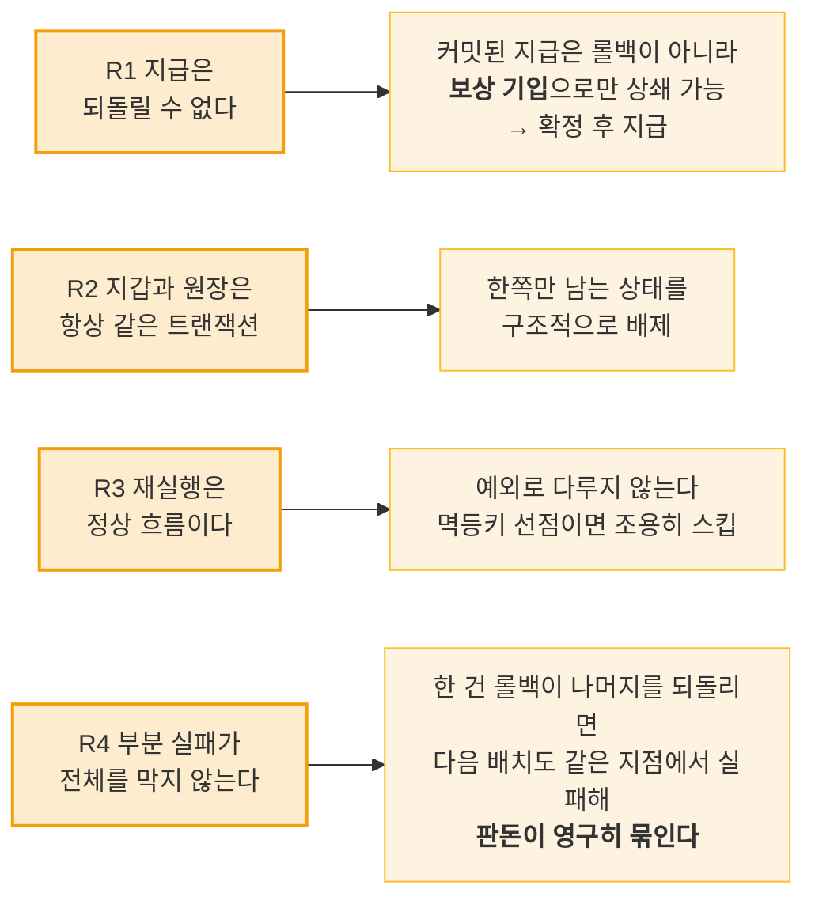
```mermaid
flowchart LR
    R1["R1 지급은<br/>되돌릴 수 없다"]:::p --> I1["커밋된 지급은 롤백이 아니라<br/><b>보상 기입</b>으로만 상쇄 가능<br/>→ 확정 후 지급"]:::i
    R2["R2 지갑과 원장은<br/>항상 같은 트랜잭션"]:::p --> I2["한쪽만 남는 상태를<br/>구조적으로 배제"]:::i
    R3["R3 재실행은<br/>정상 흐름이다"]:::p --> I3["예외로 다루지 않는다<br/>멱등키 선점이면 조용히 스킵"]:::i
    R4["R4 부분 실패가<br/>전체를 막지 않는다"]:::p --> I4["한 건 롤백이 나머지를 되돌리면<br/>다음 배치도 같은 지점에서 실패해<br/><b>판돈이 영구히 묶인다</b>"]:::i

    classDef p fill:#f59e0b33,stroke:#f59e0b,stroke-width:2px
    classDef i fill:#f59e0b1f,stroke:#fbbf24
```

### 9.2 계층별 방어 — 현황

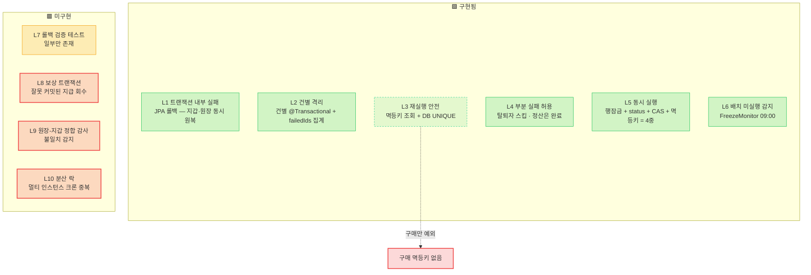
```mermaid
flowchart TD
    subgraph HAVE["🟩 구현됨"]
        L1["L1 트랜잭션 내부 실패<br/>JPA 롤백 — 지갑·원장 동시 원복"]:::ok
        L2["L2 건별 격리<br/>건별 @Transactional + failedIds 집계"]:::ok
        L3["L3 재실행 안전<br/>멱등키 조회 + DB UNIQUE"]:::okpart
        L4["L4 부분 실패 허용<br/>탈퇴자 스킵 · 정산은 완료"]:::ok
        L5["L5 동시 실행<br/>행잠금 + status + CAS + 멱등키 = 4중"]:::ok
        L6["L6 배치 미실행 감지<br/>FreezeMonitor 09:00"]:::ok
    end

    subgraph MISS["🟥 미구현"]
        L7["L7 롤백 검증 테스트<br/>일부만 존재"]:::part
        L8["L8 보상 트랜잭션<br/>잘못 커밋된 지급 회수"]:::miss
        L9["L9 원장-지갑 정합 감사<br/>불일치 감지"]:::miss
        L10["L10 분산 락<br/>멀티 인스턴스 크론 중복"]:::miss
    end

    L3 -.->|"구매만 예외"| GAP["구매 멱등키 없음"]:::miss

    classDef ok fill:#22c55e33,stroke:#22c55e
    classDef okpart fill:#22c55e1f,stroke:#34d399,stroke-dasharray:4 3
    classDef part fill:#f59e0b33,stroke:#f59e0b
    classDef miss fill:#ef444433,stroke:#ef4444,stroke-width:2px
```

### 9.3 롤백이 실제로 도는 모습

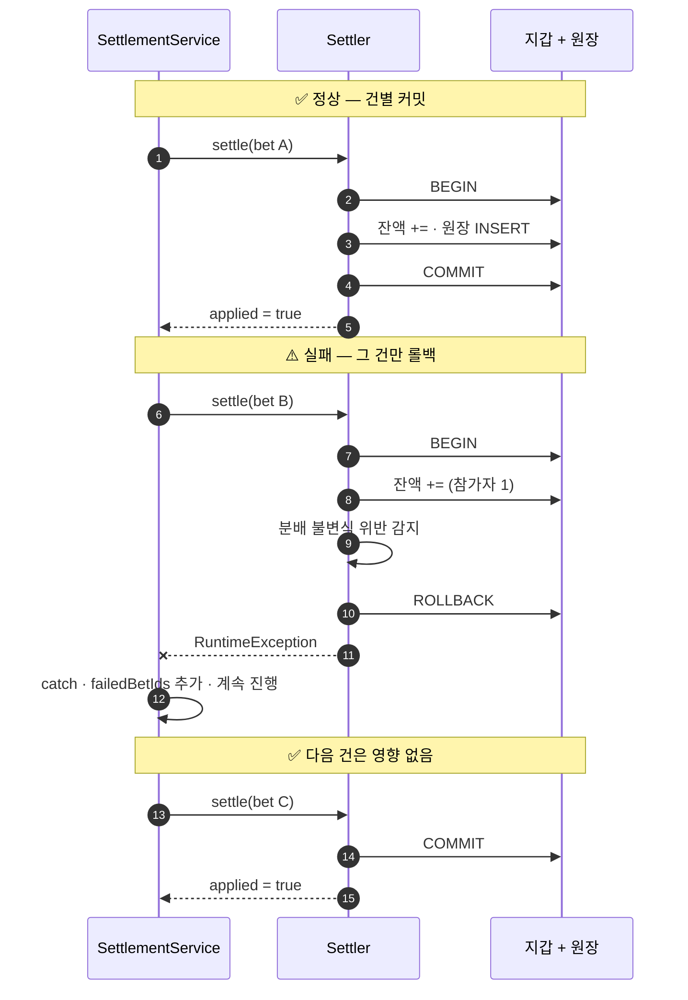
```mermaid
sequenceDiagram
    autonumber
    participant B as SettlementService
    participant S as Settler
    participant DB as 지갑 + 원장

    note over B,DB: ✅ 정상 — 건별 커밋
    B->>S: settle(bet A)
    S->>DB: BEGIN
    S->>DB: 잔액 += · 원장 INSERT
    S->>DB: COMMIT
    S-->>B: applied = true

    note over B,DB: ⚠️ 실패 — 그 건만 롤백
    B->>S: settle(bet B)
    S->>DB: BEGIN
    S->>DB: 잔액 += (참가자 1)
    S->>S: 분배 불변식 위반 감지
    S->>DB: ROLLBACK
    S--xB: RuntimeException
    B->>B: catch · failedBetIds 추가 · 계속 진행

    note over B,DB: ✅ 다음 건은 영향 없음
    B->>S: settle(bet C)
    S->>DB: COMMIT
    S-->>B: applied = true
```

**`SettlementService`에 트랜잭션이 없는 것이 핵심** — 여기서 하나로 묶으면 bet B의 롤백이 A·C까지 되돌린다.

### 9.4 롤백 불가 지점 (명시적 수용)

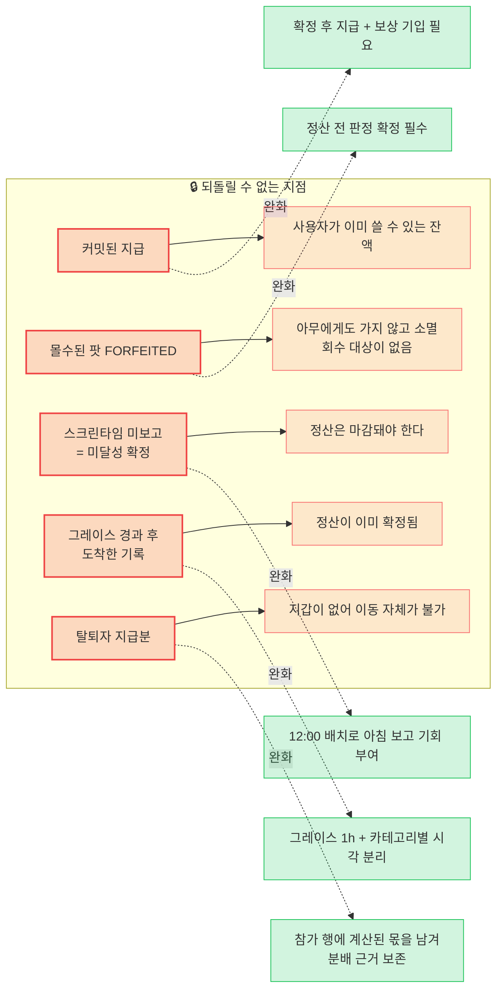
```mermaid
flowchart LR
    subgraph IRREV["🔒 되돌릴 수 없는 지점"]
        A["커밋된 지급"]:::irr --> Aw["사용자가 이미 쓸 수 있는 잔액"]:::w
        B["몰수된 팟 FORFEITED"]:::irr --> Bw["아무에게도 가지 않고 소멸<br/>회수 대상이 없음"]:::w
        C["스크린타임 미보고<br/>= 미달성 확정"]:::irr --> Cw["정산은 마감돼야 한다"]:::w
        D["그레이스 경과 후<br/>도착한 기록"]:::irr --> Dw["정산이 이미 확정됨"]:::w
        E["탈퇴자 지급분"]:::irr --> Ew["지갑이 없어 이동 자체가 불가"]:::w
    end

    A -.->|"완화"| Am["확정 후 지급 + 보상 기입 필요"]:::m
    B -.->|"완화"| Bm["정산 전 판정 확정 필수"]:::m
    C -.->|"완화"| Cm["12:00 배치로 아침 보고 기회 부여"]:::m
    D -.->|"완화"| Dm["그레이스 1h + 카테고리별 시각 분리"]:::m
    E -.->|"완화"| Em["참가 행에 계산된 몫을 남겨<br/>분배 근거 보존"]:::m

    classDef irr fill:#ef444433,stroke:#ef4444,stroke-width:2px
    classDef w fill:#ef44441f,stroke:#f87171
    classDef m fill:#22c55e33,stroke:#22c55e
```

### 9.5 요구사항

| ID | 요구 | 우선순위 | 관련 티켓 |
|---|---|---|---|
| **REQ-R1** | 구매(`spend`)에 멱등키를 도입한다 | **High** | GROMO-712 |
| **REQ-R2** | `spend`를 `CurrencyLedgerService` 경유로 통일한다 | **High** | GROMO-712 |
| **REQ-R3** | 롤백 검증 테스트를 §9.6 케이스로 채운다 | **High** | — |
| **REQ-R4** | 보상 기입(역방향 원장) 경로를 만든다 — 잔액 직접 수정 금지 | Medium | — |
| **REQ-R5** | 원장 합계 ↔ 지갑 잔액 정합 감사 배치 (일 1회, 불일치 시 error 로그) | Medium | — |
| **REQ-R6** | 정산 실패 알림을 로그 밖으로 (슬랙 등) | Low | — |
| **REQ-R7** | 분산 락(ShedLock) 도입 | Medium | GROMO-820·894·838 |

### 9.6 롤백 검증 테스트 케이스 (REQ-R3)

| # | 케이스 | 기대 결과 | 현황 |
|---|---|---|---|
| 1 | 원장 기입이 실패하면 지갑도 원복되는가 | 잔액 무변화 | 🟥 없음 |
| 2 | 잔액 부족(`spend`)이면 원장이 안 남는가 | 원장 무변화 | 🟡 부분 |
| 3 | 멱등키 UNIQUE 위반 시 전체 원복 | 잔액·원장 무변화 | 🟥 없음 |
| 4 | 지급 커밋 후 푸시가 실패하면 지급은 유지되는가 | **지급 유지** (경계 확인) | 🟥 없음 |
| 5 | 정산 중 한 건이 불변식 위반 → 나머지는 정산되는가 | 나머지 정산 완료 | 🟩 있음 |
| 6 | 지급 후 응답이 유실돼 클라가 재시도 | 이중 지급 없음 | 🟩 있음 |
| 7 | 배치 실행 중 프로세스 강제 종료 → 재실행 | 정합 유지, 이중 지급 없음 | 🟥 없음 |
| 8 | DB 커넥션 단절 중 지급 시도 | 지갑·원장 모두 무변화 | 🟥 없음 |
| 9 | 탈퇴자가 껴 있어도 정산이 끝나는가 | 그 참가자만 스킵, 정산 완료 | 🟩 있음 |
| 10 | 동시 정산(스케줄러 ↔ 수동)에서 지급 1회 | CAS 통과한 쪽만 지급 | 🟩 있음 |

**5·6·9·10은 이미 통합 테스트로 존재한다. 1·3·4·7·8이 비어 있다.**

---

## 10. 비기능 요구

| 항목 | 요구 | 현황 |
|---|---|---|
| 이중 지급 방지 | 어떤 재실행에서도 정확히 1회 | 🟩 (구매 제외) |
| 정합성 | 지갑 변동과 원장 기입이 항상 짝 | 🟩 |
| 감사 추적 | 모든 변동에 사유·시각 기록 | 🟩 (구매는 키 없음) |
| 잔액 표시 정확도 | 화면이 사용자 재산을 거짓 표시하지 않음 | 🟩 |
| 내역 조회 성능 | 거래 누적에도 응답 크기 일정 | 🟥 페이지네이션 없음 |
| 지급 지연 | 창형 내기 ≤15분 | 🟥 현재 ~24h |

---

## 11. 갭 우선순위

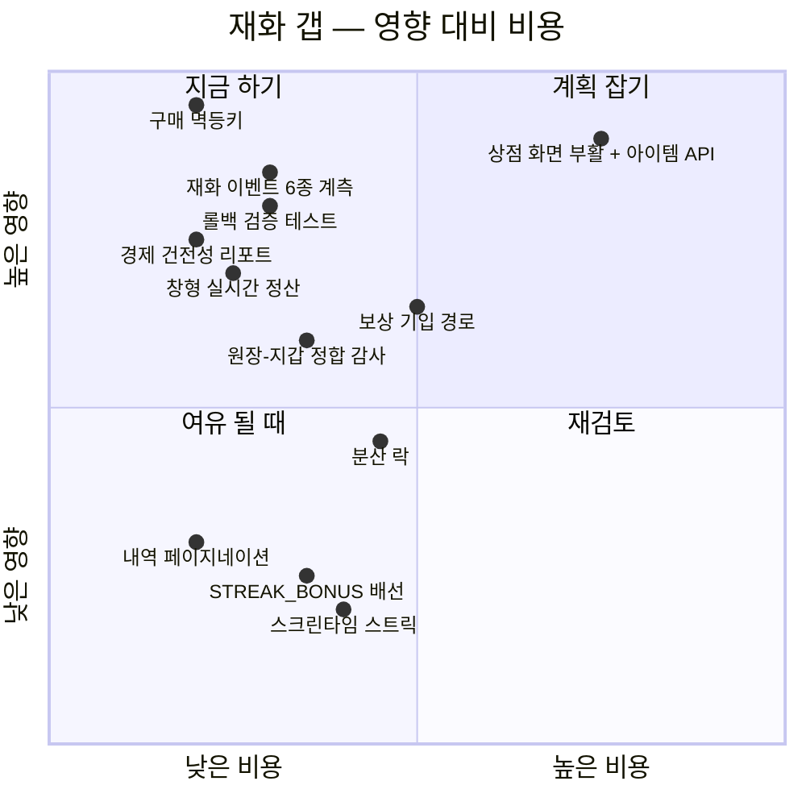
```mermaid
quadrantChart
    title 재화 갭 — 영향 대비 비용
    x-axis "낮은 비용" --> "높은 비용"
    y-axis "낮은 영향" --> "높은 영향"
    quadrant-1 "계획 잡기"
    quadrant-2 "지금 하기"
    quadrant-3 "여유 될 때"
    quadrant-4 "재검토"
    "구매 멱등키": [0.2, 0.95]
    "롤백 검증 테스트": [0.3, 0.8]
    "창형 실시간 정산": [0.25, 0.7]
    "원장-지갑 정합 감사": [0.35, 0.6]
    "보상 기입 경로": [0.5, 0.65]
    "분산 락": [0.45, 0.45]
    "내역 페이지네이션": [0.2, 0.3]
    "STREAK_BONUS 배선": [0.35, 0.25]
    "스크린타임 스트릭": [0.4, 0.2]
    "재화 이벤트 6종 계측": [0.3, 0.85]
    "경제 건전성 리포트": [0.2, 0.75]
    "상점 화면 부활 + 아이템 API": [0.75, 0.9]
```

| # | 항목 | 영향 | 요구/티켓 |
|---|---|---|---|
| 1 | **소비처가 살아 있지 않다** — 상점 화면 미등록(legacy 격리) | **구조적 인플레이션.** 발행만 있고 소멸이 몰수분뿐 → §1 순환이 반쪽 | §3.6 · 아이템 API |
| 2 | 구매 멱등키 없음 · 원장 규율 밖 | **순차 재시도** 시 이중 차감 · 사후 추적 불가 (동시 요청은 지갑 낙관락이 막는다) | **GROMO-712** |
| 3 | **재화 이벤트 0개** | 보상 인지·좌절·퍼널을 전혀 모른다 | REQ-E1~E5 |
| 4 | 경제 건전성 리포트 없음 | 인플레이션을 아무도 감시하지 않는다 | REQ-M1 |
| 5 | 롤백 검증 테스트 5건 공백 | 롤백이 실제로 되는지 미확인 | REQ-R3 |
| 6 | 원장-지갑 정합 감사 없음 | 불일치를 아무도 모름 | REQ-R5 |
| 7 | 창형 내기 실시간 정산 미구현 | 결과를 다음날까지 못 봄 | REQ-T1 |
| 8 | 보상 기입 경로 없음 | 잘못 지급된 건을 안전하게 회수할 수단 없음 | REQ-R4 |
| 9 | 분산 락 없음 | 멀티 인스턴스 시 크론 중복 (이중 지급은 아님) | GROMO-820·894·838 |
| 10 | 아이템 API 미구현 | 보유 아이템이 앱 로컬에만 — 기기 변경 시 소실 | — |
| 11 | 내역 페이지네이션 없음 | 응답 비대 | 코드 TODO |
| 12 | `STREAK_BONUS` 미배선 | 기획서 획득 경로가 코드에 없음 | — |
| 13 | 스크린타임 목표에 스트릭 미배선 | 집중 목표와 보상 비대칭 | — |
| 14 | 클라 공식 미러 수동 동기 | 서버 공식 변경 시 앱을 같이 고쳐야 함 | — |

**우선순위: 3·4 (관측 확보) → 2 (안전) → 1·10 (소비처) → 5·6 → 7**

> **왜 관측이 1순위인가** — 지금은 재화 경제가 어떤 상태인지 **측정할 수단이 없다.**
> #1(소비처 부재)이 실제로 얼마나 심각한지도 G1·U6을 붙여야 숫자로 말할 수 있다.
> 계측은 비용이 작고(원장 SQL + 이벤트 6종) 나머지 판단의 근거가 되므로 먼저 깐다.

---

## 12. 구현 담당

```mermaid
flowchart TB
    subgraph JAE["⬜ 조재영 — 그릇"]
        J1["재화 엔티티 · 지갑 · 컨트롤러"]
        J2["CurrencyLedgerService 원장"]
        J3["클라 earn 폐쇄 · spend 가드"]
        J4["내기 에스크로 · 정산 지급"]
        J5["리그 정산 건별 트랜잭션 격리"]
    end

    subgraph OSCAR["🟦 오스카 — 정책과 표면"]
        O1["CurrencyRewardPolicy 지급 공식"]
        O2["서버 지급 3종 배선<br/>집중목표 · 스크린타임목표 · 리그승급"]
        O3["V22 마이그레이션 type 확장"]
        O4["지급 하드닝 오버플로 · 상한 · 그날의 목표"]
        O5["잔액 상태 모델 coinsLoaded · version · 시퀀스 가드"]
        O6["앱 지갑 UI 전체<br/>잔액칩 · 내역화면 · +N 연출 · 아이콘"]
    end

    subgraph TAE["🟨 권태화"]
        T1["초기 currencyApi · DTO 스캐폴드"]
    end

    classDef default fill:#9ca3af14,stroke:#9ca3af
    style JAE fill:#9ca3af1a,stroke:#9ca3af
    style OSCAR fill:#3b82f61f,stroke:#3b82f6,stroke-width:3px
    style TAE fill:#eab3081f,stroke:#eab308
```

> **재화의 그릇(엔티티·원장·API)은 조재영, 지급 규칙과 사용자에게 보이는 전부는 오스카.**
> 재화는 오스카가 **BE까지 관통해 구현한 유일한 도메인**이다.
