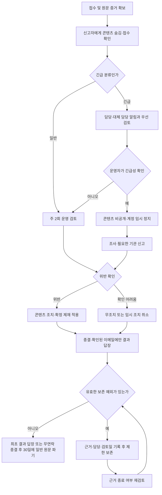

# 신고센터 정책 — Catus 2.0

[제품 결정 로그](../decision-log.md) · [티켓 GROMO-1670](https://romance.atlassian.net/browse/GROMO-1670)

이 문서는 2026-09-22 브레인스토밍의 확정 정책(RP)과 후속 구현에서 검토할 상세 설계안(D)을 담는다. GROMO-1670의 네 가지 문서 산출물은 이 문서와 연결 문서에 정리했다. **실제 구현이나 2.0 출시 완료를 의미하지 않는다.** 결정 로그와 어긋나면 결정 로그가 우선한다.

## 범위와 근거

티켓 본문의 1.x 이미지 공유 전제는 2026-09-20 안수빈 댓글 #11163의 2.0 범위로 대체한다. **2.0에는 사용자 이미지·파일을 서버에 영구 저장하거나 다른 사용자에게 보여주는 기능을 넣지 않는다.** 신고 대상은 게시판 공지·댓글, 섬 채팅, 친구 편지, 닉네임, 섬 이름·소개와 방문자에게 보이는 퀘스트 제목인 텍스트 콘텐츠다. 집중 주제는 본인에게만 원문을 보여 주고 타인에게는 정형 문구로 대체해야 한다. 누끼 캐릭터 공유와 이미지 증거 보존 A/B/C 선택지는 이번 범위에서 제외한다. 기존 `POST /api/v1/character/moderation`은 base64 PNG를 입력받아 외부 검사 서비스에 보내고 결과만 반환한다. 저장·공유 경로는 아니지만 실제 이미지 처리 경로이므로 접근·개인정보·오남용·불법 자료 대응을 출시 전에 검증한다.

**신고·차단 제공은 댓글에서 이미 정한 2.0 출시 전 필수 조건이며 스프린트 15 범위다.** 이번 브레인스토밍은 도입 여부를 다시 선택하는 과정이 아니다. A/B 논의는 차단 효과의 범위를 정하는 과정이며, A를 채택했다. 정책 문서 작성만으로 출시 조건이 충족되지는 않는다. 후속 구현과 동작 검증을 완료해야 한다.

댓글이 인용한 IA-R61의 진입점은 공지 상세(BD-1a) 및 관련 사용자·콘텐츠(SYS-2)다. 이 작업 폴더에는 IA 원문이 없어 해당 진입점은 티켓 댓글을 근거로 기록한다.

티켓의 옛 산출물 경로 `docs/prd/character-report/policy.md`는 현재 [문서 분류 규칙](../../../README.md)에 따라 이 제품 폴더 아래에 둔다.

## 확정한 결정

### RP-편지증거 — 신고 접수 시 원문 보존

2026-09-24 RP-메일정본에 따라 아래의 별도 증거 보존 장소는 자체 DB가 아닌 전용 운영 메일함이다.

- 친구 편지가 열려 있을 때 신고한다. 닫힌 뒤에는 해당 편지에 대한 신규 신고를 받지 않는다.
- 신고 접수 시 서버 원문을 별도 증거로 보존한다. 이미 접수된 증거는 편지를 닫아도 유지한다.
- 신고 화면 진행 중 편지가 닫히지 않게 하고, 접수 성공은 증거 보존이 확정된 뒤 안내한다. 복수 기기에서의 닫기·신고 경합 처리도 후속 구현에서 이 조건을 지켜야 한다.
- 별도 신고 증거는 신고된 편지에 한해 보존한다. 일반 편지의 닫기 이후 서버 파기 시점은 아직 정하지 않았다. 별도 신고 원문 증거의 보존 기간은 아래 RP-증거기간을 따른다. 기존 `deleted_at` 방식의 화면 비노출을 서버 원문 파기로 표현하지 않는다.

근거: 본 대화의 첫 A 선택. 기존 닫기 정책은 [친구 편지 상세 설계 §1.16](../friend-letter/low-level-design.md)에 있다.

### RP-일반신고 — 신고자 보호와 운영자 검토

- 일반 신고 접수 시 신고자에게 해당 콘텐츠를 즉시 숨긴다.
- 재로그인·다른 기기에서도 이 숨김을 유지하려면 계정에 연결된 최소 숨김 표지(신고자·대상·**신고한 텍스트의 리비전**)가 필요하다. 공지는 댓글 추가에도 공용 `notice.version`이 오르므로 숨김 판정에 그 값을 그대로 쓰지 않고 제목·본문 전용 리비전을 쓴다. 본문이 바뀌지 않은 댓글 추가만으로 기존 숨김이 풀리면 안 된다. 이 표지는 신고 원문·사유를 보존하는 자체 사건 DB가 아니며, 구체적인 저장·파기 방식은 후속 구현에서 정한다. 서버 표지 확정 전 로컬 숨김만 됐다면 영구 숨김 성공으로 안내하지 않는다.
- 다른 사용자에게도 숨길지, 계정을 제재할지는 운영자가 검토해 결정한다. 신고 건수만으로 전체에 자동 숨김하지 않는다.
- 이 결정의 숨김 대상은 신고한 콘텐츠다. 신고만으로 작성자 전체가 자동 차단되는 것은 아니다. 신고와 사용자 차단을 연결하는 UI는 RP-신고차단연계에서 확정했다.
- 텍스트로 제기된 아동 성착취·학대 의심과 외부 자료를 가리키는 신고의 긴급 대응 절차를 정한다. 신고용 이미지 첨부·증거 저장 파이프라인은 이번 범위에 넣지 않는다. 기존 캐릭터 이미지 검사 API의 실제 입력·외부 전송은 별도 출시 검증 대상으로 둔다. 일반 검토 대기 규칙을 그대로 적용한다고 간주하지 않는다.

근거: 본 대화의 두 번째 A 선택. 집단 허위 신고로 정상 콘텐츠가 전체에서 내려가는 것을 방지한다.

### RP-차단 — 직접 연락 차단과 상대 콘텐츠 숨김

- 한쪽이 차단하면 서버가 양방향 편지 발송과 친구 요청을 거절하고 새 요청·편지 알림도 보내지 않는다. 차단 여부를 앱의 목록 대조나 버튼 숨김에만 맡기지 않는다.
- 차단 완료와 동시에 진행 중인 발송·친구 요청도 같은 관계 상태를 기준으로 재검사하고, 알림 전달 직전에도 차단 여부를 확인한다. 차단 확정 후 늦게 커밋된 요청·편지·예약 알림이 상대에게 전달되면 차단 성공으로 처리하지 않는다.
- 차단 확정 세대를 실시간 채팅 서버에도 내구적으로 전파하고 해당 세대의 적용·기존 fanout 배출 확인 뒤 성공을 반환한다. 실시간 서버는 송신 직전 권위 있는 차단 세대를 재검사하고 오래된 세대에서 대기 중인 전송을 버린다. 이미 기기에 도착한 내용의 회수는 약속하지 않지만 차단 성공 응답 뒤에 기존 소켓으로 새 콘텐츠가 도착하게 두지 않는다.
- 차단한 사람에게 상대가 작성한 섬 채팅·댓글·공지와 그 사람이 현재 수정한 공개 퀘스트 제목을 서버 응답·실시간 전송에서 제외하거나 중립 대체한다. 공지는 원 작성자뿐 아니라 **현재 제목·본문 리비전의 실제 수정 주체**가 차단 대상이어도 제외한다. 차단 대상의 닉네임·사용자 소개 등 프로필 텍스트와 그 사람이 현재 리비전을 수정한 **섬 이름·소개**도 차단자에게 보내는 서버 응답·알림에서 중립 표시로 대체한다. 같은 섬 소속과 섬 기능은 유지한다. 상세 ID 직접 조회, 목록·미리보기·푸시 알림도 같은 규칙을 따른다. 직접 연락만 차단하는 B안은 채택하지 않는다.
- 차단 대상이 탈퇴하면서 `user_blocks`와 작성자·수정자 FK가 제거돼도 기존 차단자에게 그 사람이 작성했거나 현재 리비전에서 수정한 남은 콘텐츠·섬 이름/소개가 다시 노출되면 안 된다. 탈퇴 처리 전에 해당 차단자별 남은 콘텐츠 ID·필드·텍스트 리비전에 비식별 숨김 표지를 남기고, 목록·상세·실시간·알림에서 계속 적용한다. 표지는 원 작성자·수정자 신원이나 신고 원문을 보존하지 않으며 해당 텍스트가 삭제되거나 대체 리비전으로 바뀔 때 함께 파기한다.
- 차단만으로 같은 섬에서 탈퇴·강퇴시키지 않는다. 서비스가 보내는 시스템 안내는 계속 표시한다. 사용자 작성 공지를 시스템 안내로 취급해 예외로 노출하지 않는다.
- 기존 2026-09-16 `1867-요청` 결정의 「차단은 2.0.0에 넣지 않는다」 부분을 대체한다. 일반 거절 후 재신청 정책과 차단 관계의 요청 금지는 구분한다.
- 차단 해제, 기존 친구 관계·대기 중 요청 처리, 상대방 화면의 노출, 알림·미리보기의 세부 처리는 아직 정하지 않았다. 차단 전 받은 편지는 차단 중 목록·상세 ID 조회·미리보기에서 서버가 본문을 가리되 삭제하지 않는다. 차단자에게 보이는 프로필 텍스트의 중립 대체는 위 확정 규칙을 따른다.

근거: 본 대화의 「결정로그 남기고 A로하자」. 직접 연락만 막으면 같은 섬의 채팅·댓글로 괴롭힘이 계속 노출될 수 있어 차단자가 보는 상대 콘텐츠까지 숨긴다.

2026-09-22 확인한 [Apple 심사 지침 1.2](https://developer.apple.com/app-store/review/guidelines/#user-generated-content)는 UGC 신고·적시 대응 및 악성 사용자 차단 수단을 요구한다. [Google Play UGC 정책](https://support.google.com/googleplay/android-developer/answer/9876937?hl=en)은 직접 상호작용의 차단과 공개 UGC의 사용자·콘텐츠 신고 및 사용자 차단을 요구한다. **모든 상대 콘텐츠 숨김이 정책에 명시됐다는 주장이 아니라, 우리 앱에서 보호 범위를 확보하기 위한 제품 결정이다.**

2026-09-24 최신 `main` 대조: GROMO-1975의 차단 API·친구 목록/검색·받은 편지함 표시 필터는 이 정책의 **일부 구현**이다. `차단-도입` 결정의 “표시 필터”는 당시 구현 경계로 읽고, 이 RP의 서버 직접 연락 제한과 서버 전송 제외는 후속 구현으로 둔다. 앱 차단 UI는 GROMO-1976, 신고 UI는 GROMO-1673의 범위를 현재 정책에 맞춰 갱신한다.

### RP-검토주기 — 일반 신고 주 2회 검토

- 사용자에게 고정된 처리 기한을 약속하지 않는다. 일반 신고는 주 2회 정해진 날에 모아서 검토한다.
- 매일 확인하거나 접수 후 24시간 안에 검토하는 운영을 전제로 하지 않는다. 검토는 내용 확인 후 조치하거나 추가 조사로 넘기는 것을 뜻하며, 모든 사건의 해결 완료를 뜻하지 않는다.
- 긴급 신고는 별도 알림으로 우선 확인한다. 일반 신고의 정기 검토일까지 대기시키는 정책은 아니다. 실제 운영 시간·담당자·알림 수단과 미확인 시 경로는 출시 전 지정한다. 이 결정만으로 야간·휴일 상시 대기를 약속하지 않는다.
- 주 2회는 팀의 운영 여력을 반영한 내부 기준이며, 이 주기 자체가 스토어 심사 통과를 보장한다는 뜻은 아니다.

근거: 본 대화에서 사용자가 매일 대응의 어려움을 밝히고 「기한 미약속 + 일반 신고 주 2회 검토 + 긴급 신고 별도 알림·우선 확인」 제안에 동의했다.

### RP-결과안내 — 접수 확인과 정형 결과 통지

2026-09-24 RP-메일결과가 아래의 ‘모든 신고자 자동 결과 통지’를 대체한다. 접수 확인은 유지한다.

- 신고 접수 확인과 간단한 처리 결과를 신고자에게 자동으로 제공한다.
- 운영자가 처리 결과를 확정하면 「조치 완료」 또는 「위반 확인 어려움」 같은 정형 문구를 전달한다. 문구는 예시이며 개별 답변 작성을 필수로 하지 않는다.
- 상대방에 대한 구체적인 제재 내용은 신고자에게 공개하지 않는다. 통지 채널·재전송·최종 문구는 후속 설계에서 정한다.

근거: 본 대화에서 사용자가 접수 확인 + 간단한 결과 통지 A안을 선택했다.

### RP-증거기간 — 일반 신고 종료 기준 30일

2026-09-24 RP-메일결과에 따라 답장 주소가 없거나 발송 실패가 확정된 사건은 운영자 무연락 종결 시각을 30일 기산점으로 쓴다. 확인된 답장 주소로 결과를 발송한 사건은 최초 답장 발송 시각을 기산점으로 쓴다.

- 일반 신고의 원문 증거는 RP-메일결과의 기준 시각부터 30일 보존하고, 기간이 끝나면 삭제한다. 접수일 기준 30일로 계산하지 않는다.
- 보존 목적은 처리 결과에 대한 이의제기 검토다. 진행 중인 조사·분쟁 또는 법적 보존 의무가 있는 사건은 일반 자동 파기와 구분해 별도 처리한다.
- 30일은 사용자가 선택한 운영 기준이며 법정 보존 기간이라는 뜻은 아니다. 개인정보 처리·보존 근거와 고지, 예외의 적용·해제 조건은 법률 멘토링에서 확인한다.
- 이 결정은 원문 증거의 기간에 한한다. 제재 이력·처리 메타데이터의 보존 기간, 미처리 사건의 방치 방지, 재심 시 보존 예외, 백업을 포함한 실제 파기 범위는 후속 설계에서 정한다.

근거: 본 대화에서 사용자가 「일반 신고 결과 통지 후 30일」 A안을 선택했다. [개인정보 보호법 제21조](https://www.law.go.kr/lsLinkCommonInfo.do?chrClsCd=010202&lsJoLnkSeq=1029334901)는 개인정보가 불필요해진 경우 파기를 요구하며, 이 조문이 30일 보존을 정한 것은 아니다.

### RP-제재단계 — 커뮤니티 제한 후 재위반 시 계정 전체 정지

- 일반적인 욕설·괴롭힘·스팸은 운영자가 위반을 확인한 뒤 문제 콘텐츠를 조치하고 경고한다. 반복 위반에는 커뮤니티 기능을 일시 제한한다(A).
- 커뮤니티 제한은 글·댓글·채팅·편지·퀘스트 제목의 생성·수정·삭제, 친구 요청 생성·재요청과 그 알림, 닉네임·섬 이름·소개 수정을 막고, 개인 집중과 기록 조회는 유지한다. 개인 집중 주제 원문은 타인에게 노출하지 않는다. 신규·기존 공지의 수정·삭제 권한이 있더라도 제재 중에는 실행할 수 없다. 운영자가 유해 콘텐츠를 삭제·복구하는 조치는 별도 권한으로 수행한다.
- 커뮤니티 제한 제재 후에도 위반을 반복하면 계정 전체 이용 정지(B)로 전환한다. 계정 전체 정지는 개인 집중을 포함한 앱 이용을 제한한다.
- 신고 건수만으로 반복 위반을 판정하거나 자동 제재하지 않는다. RP-일반신고에 따라 운영자가 검토한 위반을 기준으로 판단한다.
- 커뮤니티 제한 기간은 아래 RP-커뮤니티기간을 따른다. 전체 정지의 기간과 최종 단계는 RP-누진제재를 따른다. 위반 누적 초기화는 RP-누적초기화를 따른다. 이의제기·오판 취소 조건은 후속 결정한다. 중대 위반의 긴급 조치는 RP-긴급조치를 따른다. 제재 우회의 별도 처리 조건은 후속 결정한다.

근거: 본 대화에서 사용자가 A를 선택한 뒤 「반복시 B로」라고 명시해 단계형 제재로 확정했다.

### RP-커뮤니티기간 — 7일 제한 후 자동 해제

- 일반 반복 위반에 대한 커뮤니티 제한(A)은 7일로 정한다. 제재 적용 시점부터 7일이 지나면 자동 해제한다.
- 재위반은 운영자가 확인해 RP-제재단계의 계정 전체 정지(B)로 전환한다. 신고만으로 제한 기간을 연장하거나 B로 자동 전환하지 않는다.
- 이 결정은 커뮤니티 제한 기간에 한한다. 계정 전체 정지 기간은 후속 RP-누진제재, 중대 위반의 별도 대응은 RP-긴급조치를 따른다.

근거: 본 대화에서 사용자가 「7일하는게 좋을듯」으로 7일 제한·기간 만료 후 자동 해제안을 선택했다.

### RP-누진제재 — 7일 커뮤니티 제한 → 30일 전체 정지 → 영구 정지

일반 위반은 다음 순서로 제재를 강화한다.

| 단계 | 적용 | 해제 |
| --- | --- | --- |
| 경고 | 운영자가 위반 확인 후 콘텐츠 조치·경고 | 이용 제한 없음 |
| 커뮤니티 제한 | 경고 후 재위반 시 커뮤니티 UGC 생성·수정·삭제, 친구 요청·재요청 및 닉네임·섬 이름·소개 수정 7일 제한 | 제재 적용 시점부터 7일 후 자동 해제 |
| 계정 전체 정지 | 커뮤니티 제한 제재 후에도 재위반 시 앱 전체 이용 30일 정지 | 제재 적용 시점부터 30일 후 자동 해제 |
| 영구 정지 | 30일 전체 정지 이후에도 재위반 시 계정 전체 영구 정지 | 자동 해제 없음 |

- 각 단계는 운영자가 확인한 재위반을 기준으로 적용한다. 동일 사건에 신고가 여러 건 들어왔다는 이유로 단계를 올리지 않는다.
- 기간 만료로 이용 제한이 풀리는 것과 위반 누적 이력이 초기화되는 것은 별개다. 위반 누적 초기화는 아래 RP-누적초기화를 따른다.
- 자동 해제 작업은 자신이 생성된 제재 ID·세대와 현재 활성 단계가 일치할 때만 조건부로 해제한다. 7일 제한 중 30일 또는 영구 정지로 승격됐다면 오래된 7일 만료 작업이 새 제재를 풀 수 없다.
- 영구 정지는 계정 이용 제재이며 계정·기록의 자동 삭제를 뜻하지 않는다. 이의제기와 오판 시 취소 경로는 별도 설계한다.
- 중대 위반은 RP-긴급조치에 따라 일반 단계를 건너뛸 수 있다. 제재 우회의 별도 처리 조건은 아직 정하지 않았다.

근거: 본 대화에서 사용자가 30일 전체 정지와 영구 정지 중 「A하다가 B」「제재 기간이 늘어나다가 마지막에 B」로 단계적 강화를 선택했다. 기존 7일 커뮤니티 제한 이후 30일 전체 정지를 거쳐 영구 정지하는 것으로 구체화한다.

### RP-누적초기화 — 제재 해제 후 6개월 무위반 시 초기화

- 7일 커뮤니티 제한 또는 30일 전체 정지가 해제된 뒤 6개월간 재위반이 없으면 일반 위반의 누적 제재 단계를 초기화한다.
- 영구 정지는 초기화 대상에서 제외한다. 6개월 경과만으로 영구 정지를 해제하지 않는다.
- 초기화 대상은 누진 제재 단계다. 이 결정이 신고 원문 증거를 6개월 보존하라는 의미는 아니다. 원문 증거는 RP-메일결과의 답장 또는 무연락 종결 시각부터 30일을 따른다.
- 예약된 초기화 작업은 예약 당시 마지막 확인 위반 시각과 제재 세대가 현재 값과 같고, 제한 해제 뒤 실제 6개월 무위반인 경우에만 조건부 적용한다. 새 위반·상위 제재가 확정되면 이전 예약 작업은 무효다.
- 누적 판단에 필요한 최소 제재 이력의 항목·파기, 경고만 받은 사용자의 기산점, 초기화 시점에 검토 중인 신고가 있는 경우의 처리는 후속 설계한다. 미확인 신고 건수만으로 누적 단계를 올리지는 않는다.

근거: 본 대화에서 사용자가 「제재 해제 후 6개월간 재위반이 없으면 초기화, 영구 정지는 제외」 A안을 선택했다.

### RP-긴급조치 — 중대 위반의 임시 조치와 영구 정지

- 아동 성착취·구체적인 위해 협박 등 중대 위반 신고는 별도 긴급 알림으로 우선 검토한다. 일반 신고의 주 2회 검토일까지 대기시키지 않는다.
- 운영자가 긴급성을 확인하면 해당 콘텐츠를 즉시 전체 비공개하고 계정을 임시 정지한다.
- 조사 후 중대 위반이 확정되면 경고·커뮤니티 7일 제한·전체 30일 정지를 거치지 않고 영구 정지한다.
- 신고자가 긴급 사유를 선택했다는 이유만으로 계정을 자동 정지하지 않는다. 최초 임시 조치와 최종 제재 모두 운영자가 판단한다.
- 임시 정지는 중대 위반의 최종 확정과 구분한다. 조사 중인 사건을 일반 신고의 결과 통지 후 30일 파기 대상으로 처리하지 않는다.
- 긴급 알림 담당자·전달 수단, 조사 중 임시 정지의 재검토·해제, 오판 복구, CSAM 관련 법적 신고·보존 의무는 후속 확정한다. 이 제품 결정으로 법률 멘토링 확인을 대체하지 않는다.

근거: 본 대화에서 사용자가 중대 위반의 긴급 검토 → 운영자 확인 후 즉시 콘텐츠 비공개·계정 임시 정지 → 조사로 확정되면 영구 정지 흐름에 동의했다.

### RP-신고차단연계 — 신고 화면에서 선택적으로 함께 차단

- 신고 화면에 「이 사용자도 차단」 선택 항목을 제공하고 기본값은 미선택으로 둔다.
- 신고만 하면 신고한 콘텐츠를 숨긴다. 사용자가 함께 차단을 선택하면 RP-차단에 따라 상대 콘텐츠 숨김과 양방향 직접 연락 차단을 함께 처리한다.
- 사용자가 선택하지 않았는데 신고만으로 상대 사용자를 자동 차단하지 않는다. 기존 친구·편지 처리 등 D3의 나머지 세부 제안까지 이 선택으로 확정하지 않는다.

근거: 본 대화에서 사용자가 「신고와 차단 연결 방식」 질문에 A를 선택했다.

### RP-통합증거 — 전체 텍스트 신고의 서버 원문 사본

2026-09-24 RP-메일정본이 아래의 자체 저장 구조 가정을 대체한다. 서버 원문 확보와 보존 원칙은 유지한다.

- 공지·댓글·섬 채팅·열려 있는 받은 편지·닉네임·섬 이름/소개·공개 퀘스트 제목 모두 신고 접수 시 서버 원문을 별도 증거 사본으로 확보한다. 원본의 수정·삭제가 확보한 사본을 바꾸지 않는다.
- 신고자에게는 해당 콘텐츠를 즉시 숨기고, 운영자는 별도 증거로 검토한다. 전체 비공개·제재는 RP-일반신고와 RP-긴급조치를 따른다.
- 일반 사건의 증거 사본은 **RP-메일결과의 기준 시각부터 30일** 보존한 뒤 파기한다. 조사·분쟁·법적 보존 예외는 RP-증거기간을 따른다. 일반 게시글·채팅 전체의 보관 기간을 30일로 바꾸는 결정은 아니다.
- 부수 작업은 텍스트 증거 저장 구조, 운영자 접근 통제, 보존 만료·파기 처리, 개인정보 처리방침의 신고 처리 목적·항목·보존 기간 반영이다. 신규 이미지 저장소는 도입하지 않는다.
- D2의 구체적인 서비스 계약·버전 확인·실패 처리 설계는 후속 제안으로 유지한다.

근거: 전체 텍스트 신고에 서버 원문 사본 방식을 적용하는 제안에 사용자가 신고자 비노출·30일 보존 원칙을 확인하고 동의했다.

### RP-메일정본 — 자체 신고 DB 대신 운영 메일함 사용 (2026-09-24 개정)

- 사용자는 앱 안에서 대상·사유·설명을 제출한다. 서버는 신고자의 열람 권한과 **서버 원문**을 확인해 사건 식별자와 함께 전용 운영 메일함으로 보낸다. 클라이언트가 입력한 원문을 증거로 신뢰하지 않는다.
- **자체 신고 사건·원문 사본 DB는 만들지 않는다.** 앞선 RP-통합증거의 “서버 원문 사본”은 확보할 내용에 대한 결정으로 유지하고, 저장 장소를 운영 메일함으로 바꾼다. 메일함과 메일 제공자가 신고 기록·증거의 정본이 된다. 원본 수정·삭제와 독립적인 사본, 접근 통제, RP-메일결과의 30일 파기와 적법한 보존 예외는 그대로 지킨다.
- 메일 발송을 요청만 했거나 실패한 상태를 접수 성공으로 알리지 않는다. 편지는 닫기 전에 원문 확보와 메일 접수를 확정해야 한다. 전달 실패·중복 발송·반송·운영자 미확인·수정/닫기 경합의 구현 기준은 [이메일 접수 계약](email-intake-contract.md)을 따른다.
- 실제 CSAM으로 의심되는 이미지·영상은 신고 메일에 첨부하거나 외부 링크에서 자동 수집하지 않는다. 텍스트 신고와 사건 식별정보만 이 경로로 다룬다.
- 메일함 권한·접근 기록·검색/처리 상태·결과 통지·보존 예외·정기 파기·백업 범위, 개인정보 처리방침의 메일 제공자 처리 관계를 후속 설계와 출시 검증에 넣는다. 자체 DB가 없다는 사실이 신고 기록 관리 의무를 없애지는 않는다.

대상별 입력·접수 성공·편지 경합·중복·운영 상태·파기의 후속 구현 기준은 [이메일 접수 계약](email-intake-contract.md)에 정리한다. 결과 안내는 RP-메일결과를 따르고, 실제 메일 제공자 능력 확인은 남았다.

근거: 사용자가 앱 신고 작성 내용을 서버 DB에 저장하지 않고 이메일로 운영자에게 넘기는 방식을 선택했다. 이 결정은 증거 저장 위치에 대한 개정이며, 신고 UI와 메일 발송 구현이 완료됐다는 뜻은 아니다.

### RP-메일결과 — 접수 확인 유지, 결과는 선택한 이메일로만 답장 (2026-09-24 개정)

- 앱은 메일함 접수 성공 뒤 사건 ID와 접수 확인을 화면에 보여 준다. 신고자의 답장받을 이메일은 **선택 입력**이다. 이메일을 제공하지 않은 사용자와 게스트도 신고할 수 있다. 앱 내 결과 수신함은 만들지 않는다.
- 결과 답장을 원하는 신고자는 확인된 이메일 주소를 제공한다. 주소 소유 확인 전에는 사건 원문·상대 정보·결과를 보내지 않는다. 운영자가 사건을 종결하면 신고 메일과 연결된 사건 ID로 「조치 완료」 또는 「위반 확인 어려움」 같은 정형 답장을 보낸다. 상대의 구체적인 제재 내용과 신고 원문은 답장에 넣지 않는다.
- 답장 주소가 없거나 확인되지 않은 사건에는 사후 결과 통지를 하지 않는다. 답장 전달 실패도 내부에 기록하고 재전송을 시도하되 [이메일 접수 계약](email-intake-contract.md)의 기간·횟수 한도에 도달하면 무연락 사건으로 종결한다. 결과 통지 약속을 모든 신고자에게 하지 않는다.
- 일반 원문 증거는 확인된 주소로 결과 답장을 발송한 사건은 **최초 결과 답장 발송 시각부터 30일**, 답장 주소가 없거나 발송 실패가 확정된 사건은 **운영자가 무연락 종결한 시각부터 30일** 보존하고 파기한다. 나중에 같은 결과를 다시 보내도 기한을 연장하지 않는다. 조사·분쟁·법적 보존 예외는 별도로 관리한다.

근거: 사용자가 2026-09-24 “이메일 답장만 제공 — 결과 통지 정책을 변경”을 선택했다. 이메일 없는 신고도 접수해야 하므로 그 경우의 파기 기산점을 종결 시각으로 정했다.

## RP-법률확인 — 공식 근거 조사로 계속 진행

사용자는 법률 멘토링 결과가 없다고 답한 뒤 「대기하지 말고 할 수 있는 만큼」 진행하도록 지시했다. 멘토링 결과가 없다는 사실은 유지하되 공식 자료 조사와 대응 초안 작성을 완료했다. [법적 근거·긴급 대응](legal-response.md)에 스토어 정책, 국내 조문, 운영자의 제3자 신고 경로, 보존·파기 경계를 정리했다. 회사별 적용 사실을 확인해야 하는 항목을 분리하고 다른 설계 작업은 계속한다.

## 구체화한 정책 초안 — D1~D7

**아래는 「대기하지 말고 할 수 있는 만큼」 지시에 따라 작성한 설계 제안이다. RP 확정 결정과 구분하며, 새 제품 선택을 사용자가 이미 승인했다고 기록하지 않는다.** 문구·숫자는 검토할 수 있게 구체화했다. 검토 후 채택한 항목만 결정 로그의 확정 행으로 승격한다.

1670의 완료조건은 증거 방식과 부수 작업, 단계별 처리 흐름, CSAM 절차, 공유 기능과의 선후 관계다. 이 네 항목의 정책 수준 결론은 위 RP와 [이메일 접수 계약](email-intake-contract.md)·[법적 근거와 절차](legal-response.md)·[후속 범위](follow-up-scope.md)에 있다. D1~D7의 화면별 문구, 수치, 내부 API와 운영 도구 상세는 구현 티켓에서 검토할 설계안이며 1670의 네 문서 완료조건과 구분한다.

2026-09-24 RP-메일정본·RP-메일결과가 아래 D2·D4·D6의 “자체 사건 저장소·수신함” 가정보다 우선한다. 메일함의 상태·파기 구현 계약은 [이메일 접수 계약](email-intake-contract.md)에 정리한다.

### D1. 대상·사유·진입점

| 신고 단위 | 진입점 제안 | 증거 | 신고자에게 숨기는 방식 |
| --- | --- | --- | --- |
| 공지 | 상세 더보기(BD-1a) | 공지 ID·제목/본문 전용 리비전·제목·본문·실제 수정 주체 | 해당 공지 본문과 목록 미리보기 숨김 |
| 댓글 | 댓글 더보기/길게 누르기 | 댓글 ID·원문·작성자·상위 공지 ID | 해당 댓글을 숨김 표시로 대체 |
| 섬 채팅 | 메시지 길게 누르기 | 메시지 ID·원문·발신자·시각·섬 ID | 해당 메시지·최근 메시지 미리보기 숨김 |
| 친구 편지 | 열려 있는 받은 편지의 더보기 | 편지 ID·원문·발신/수신 ID·시각 | 접수 뒤 본문 숨김. 닫기와 증거 확보 순서는 RP-편지증거 준수 |
| 닉네임 | 사용자 프로필(SYS-2) | 사용자 ID·화면에 표시한 닉네임 버전/불변 스냅샷 | 신고한 닉네임을 중립 문구로 대체. 사용자 전체 차단과 구분 |
| 섬 이름/소개 | 섬 정보 더보기(SYS-2) | 섬 ID·필드·현재값·수정 주체를 확인할 수 있는 근거 | 신고한 필드를 중립 문구로 대체하고 섬 기능 접근은 유지 |
| 퀘스트 제목 | 퀘스트 상세·목록 더보기 | 퀘스트 ID·제목 리비전·실제 수정 주체·조회 시 서버 스냅샷 | 신고자에게 제목을 중립 대체하고 퀘스트 기능 접근은 유지 |

사유는 ‘욕설·괴롭힘 / 혐오·차별 / 스팸·사기 / 성적 콘텐츠 / 아동 안전·성착취 / 구체적 위해 협박 / 개인정보 노출·사칭 / 기타’로 제안한다. 뒤의 사유별 긴급성은 운영자가 재분류할 수 있다. 설명은 선택, ‘기타’만 필수로 하고 최대 1,000자로 제한하는 안이다. 자유 설명을 일반 로그에 남기지 않는다.

원래 읽을 권한이 있는 대상만 신고할 수 있다. 게시판 방문자 읽기 권한도 신고 인가에 반영한다. 일반 프로필 신고로 열람 권한 없는 편지·채팅 원문을 조회할 수 없게 한다. 섬 이름이 부적절하다는 이유만으로 방장에게 자동으로 위반을 귀속하지 않는다. 실제 수정 주체를 확인하지 못하면 콘텐츠 조치만 하고 계정 제재는 별도 판단한다.

### D2. 서버 원문 증거와 실패 처리

전체 텍스트 신고에서 서버 원문을 확보하고 신규 이미지 저장소를 두지 않는 원칙은 RP-통합증거와 RP-메일정본에서 확정했다. 저장 장소는 운영 메일함이다. 아래 최소 메타데이터·서비스 계약·실패 처리의 구체적인 설계는 제안이다. 입력은 대상 종류·ID·가능한 경우 버전·사유·설명이며, 클라이언트가 보낸 원문을 서버 원본으로 믿지 않는다. 채팅은 원 서비스가 권한·원문을 확인하는 계약으로 가져온다.

- 증거는 접수 시의 불변 사본이다. 작성 후 수정·삭제·탈퇴가 사본을 덮어쓰지 못한다. 일반 사용자와 섬 방장은 사건 증거를 열람할 수 없다.
- 편지는 접수 인가·활성 여부·증거 확보를 닫기와 직렬화한다. 신고가 먼저 확정되면 이후 닫혀도 증거 유지, 닫기가 먼저면 신규 신고를 거절한다. 앱에서 닫기를 막는 것만으로 서버 경합이 해결됐다고 하지 않는다.
- 공지 등 수정 가능한 텍스트는 화면이 보고 있던 버전을 확인한다. 각 신고 가능 텍스트 조회 응답에 서버가 조회 당시 원문·리비전·열람 권한을 인증 암호화한 불변 스냅샷 토큰을 붙인다. 유효한 토큰은 수정·하드 삭제 뒤에도 당시 원문 증거로 검증하며, 토큰과 검증 가능한 과거 이력이 모두 없으면 새 버전을 신고한 것처럼 접수하지 않는다.
- 증거 저장이 실패하면 성공 안내를 하지 않는다. 즉시 로컬 숨김은 유지할 수 있으나 ‘신고 접수 실패·재시도’를 표시한다. 재시도는 동일 요청 키로 중복 접수를 막고, 신고 대상이 UI에서 숨겨졌어도 같은 요청의 보호된 원문 조회·접수 확인을 끝낼 수 있어야 한다.
- 외부 링크는 신고 대상 텍스트에 포함하되 운영 메일 표시본에서 자동 링크를 비활성화하고 정확한 원문을 클릭 불가능한 인코딩으로 별도 보존한다. 메일 제공자의 자동 방문까지 차단·검증하며 자동 다운로드하지 않는다. 이미지 첨부는 이번 최소 범위에 넣지 않는다.

### D3. 신고와 차단 UX·기존 관계

신고 화면에 **‘이 사용자도 차단’ 체크 항목을 기본 미선택**으로 제공하는 것은 RP-신고차단연계에서 확정했다. 아래의 기존 관계·실패 처리 세부사항은 제안이다. 함께 실행하면 신고 정본 접수와 재시도 키 확정을 먼저 처리한 뒤 차단을 확정하며 각각의 성공/실패를 표시한다. 차단만 먼저 성공해 원문이 숨겨진 뒤 신고 재시도가 접근 불가가 되어서는 안 된다. 섬 이름·소개처럼 사용자 귀속이 불분명한 신고에는 임의로 방장 차단을 붙이지 않는다.

차단은 다음과 같이 구체화한다.

- 기존 친구 관계는 자동 삭제하지 않고 차단 중 목록에서 숨긴다. 차단 해제 시 아직 존재하는 관계가 다시 보인다. 이렇게 해도 편지·새 친구 요청은 양방향 차단한다.
- 대기 중 친구 요청은 차단 중 수락할 수 없게 하고 새 알림도 만들지 않는다. 차단 전에 받은 편지는 열람 여부와 관계없이 차단 중 목록·상세 ID 조회·미리보기에서 숨기고 본문 접근을 막되, 차단만으로 삭제하지 않는다. 이미 신고한 증거는 유지한다.
- 차단 완료와 편지·친구 요청 생성은 관계 상태를 기준으로 직렬화한다. 전송 대기 중인 알림은 전달 직전 차단 관계를 다시 확인해 취소한다. 차단/발송 동시 요청과 큐에 있던 알림의 지연 전달을 검증한다.
- 차단 목록에서 본인이 한 차단을 해제할 수 있다. 서로 차단했다면 한쪽의 해제만으로 직접 연락을 허용하지 않는다. 차단한 사실을 상대에게 따로 알리지 않는다.
- 차단자의 상대 프로필 닉네임·사용자 소개는 중립 표시로 대체한다. 같은 섬 소속·권한·재화는 바꾸지 않는다. 상대방에게 내 공개 콘텐츠를 감추는 양방향 비공개 기능은 이번 안에 포함하지 않는다.
- 목록·상세·실시간 전달·알림·미리보기·앱 캐시에 같은 숨김 규칙을 적용한다. 이미 기기에 전달된 푸시나 화면을 회수할 수 있다고 약속하지 않는다.
- 사용자 작성 공지는 방장 작성이어도 차단 대상이다. 시스템이 자동 생성한 건설·재화 등 필수 안내만 계속 보여 준다.

### D4. 운영 역할·흐름·결과 통지

역할은 주 담당 1명·대체 담당 1명으로 제안하고, 실제 사람을 임의 배정하지 않는다. 일반 검토일은 주 2회라는 확정 기준에 맞춰 월·목을 초안으로 두며 팀 일정으로 변경할 수 있다. 긴급 건은 정기 검토일과 분리해 실제 운영 가능 시간의 담당 알림·대체 전달 경로를 둔다. 14세 이상 설정으로 아동 안전 신고를 제외하지 않으며, 공개 24시간 처리 약속은 하지 않는다. 운영 시간과 야간·휴일 경로는 출시 전 지정한다.

사건 상태는 접수·검토 중·추가 조사·종결로 관리하고, 긴급도·콘텐츠 비공개·계정 제재는 별도 속성으로 둔다. 신고자가 추가 정보를 주지 못했다는 이유만으로 허위 신고로 단정하지 않는다.

접수 확인과 사건 ID는 메일 접수가 확정된 뒤 앱 화면에 표시한다. 앱 내 신고 결과 수신함 제안은 RP-메일결과로 폐기한다. 확인된 답장 주소가 있으면 운영자가 종결 후 정형 결과를 이메일로 보내고, 없으면 사후 통지하지 않는다. 확인된 주소로 발송이 계속 실패하면 무연락 사건으로 종결해 파기 기산점을 남긴다. 메일함에서 답장·종결 시각을 추적한다. 결과 재전송으로 원문의 30일 보존 기한을 연장하지 않는다.

피신고자에게는 위반 규칙·제재 범위·시작/종료·이의제기 경로와 **이의제기 참조 ID**를 안내한다. 참조 ID로 신고자 신원·편지 상대의 개인정보가 노출되지 않게 한다. 계정 전체 정지 중에도 본인 제재 안내·이의제기·개인정보 권리/탈퇴·로그아웃 경로는 접근 가능한 예외로 설계한다. 이용 정지는 계정 삭제가 아니다.

### D5. 반복·허위 신고와 이의제기

- 같은 신고자·같은 대상·필드·버전은 한 사건에 병합하되 새 사유·설명을 추가 기록하고 긴급 사유가 생기면 즉시 재분류·담당 알림을 수행한다. 원문이 이미 파기된 경우에도 새 긴급 위해 정황은 별도 안전 제보로 우선 평가하며 파기된 원문을 복원하지 않는다. 여러 신고자의 사건이 같은 대상·필드·버전을 가리키면 대상·필드·리비전별 위반 판단 ID로 묶어 한 번만 제재하고, 추가 설명은 각 신고자 사건에 남긴다.
- 일반 신고의 초기 운영 상한은 계정당 24시간 20건·분당 5회로 제안한다. 실제 오류는 재시도 가능 시각을 안내한다. 긴급 신고는 일반 일일 한도에서 제외하되 별도의 분당·일일 남용 한도와 동일 대상 알림 병합을 둔다. 한도 초과 건은 계정별·전역 상한이 있는 대기열과 긴급 예약 용량 안에서만 수용한다. 수용량을 넘으면 접수 실패·재시도 시각을 안내하고 담당에게 용량 경보를 보낸다. 접수되지 않은 건을 대기 중이라고 표시하지 않으며, 긴급 분류만으로 자동 제재하지 않는다.
- ‘위반 확인 어려움’ 결과의 누적만으로 신고자를 제재하지 않는다. 조작·보복성 반복 신고가 운영자에게 확인된 경우 경고하고 반복 시 별도 신고 제출 제한을 검토한다. 실제 적용 전 근거를 기록하며, 사용자의 차단·긴급 연락 수단은 유지한다.
- 이의제기는 답장을 받은 신고자는 답장 후 30일 이내 사건 ID로, 피신고자는 본인 제재 통지 후 30일 이내 **제재 통지·상태 화면에 제공한 이의제기 참조 ID**로 지원 채널에 제출하는 안이다. 피신고자의 참조 ID는 내부 사건 ID에 제한 접근으로 연결하되 신고자 신원·비공개 콘텐츠를 드러내지 않는다. 제재 중에도 통지·상태 화면과 지원 채널에 접근 가능해야 한다. 피신고자의 기한이 일반 원문 파기일보다 늦으면 연결 사건의 원문을 이의제기 기한까지 보존 예외로 묶고 종료 후 파기한다. 기한 내 접수된 재심은 접수 시각을 먼저 내구적으로 기록하고 파기 작업과 직렬화해 보존 예외로 관리한다. 파기 경계에서 동시에 들어온 재심을 원문 삭제 후 접수 완료로 처리하지 않는다. 신고자가 답장 주소를 남기지 않은 사건의 이의제기 인증·조회 범위는 후속 설계한다.
- 가능한 한 최초 판단자와 다른 담당이 재심한다. 오판이면 해당 제재와 누적 단계 영향을 취소하고 결과를 다시 알린다. 증거 파기 후 연락을 받으면 보유한 최소 조치 기록으로 검토할 한계를 안내하며 이미 파기한 원문을 복원했다고 하지 않는다.

### D6. 보존·누적·계정 탈퇴 경계

| 저장물 | 제안하는 처리 | 기존 결정과의 관계 |
| --- | --- | --- |
| 일반 신고 원문·자유 설명·불필요한 프로필 사본 | 확인된 주소로 최초 결과 답장 발송 후 30일, 주소가 없거나 발송 실패가 확정되면 무연락 종결 후 30일 만료. 입력 주소가 종결 후 7일 내 확인되지 않으면 주소를 폐기하고 무연락 종결로 전환. 메일함·검색·백업에서 파기하며 답장 재전송으로 연장하지 않음 | RP-증거기간·RP-메일결과 |
| 일반 제재 최소 이력 | 사용자 ID·위반 분류·사건 ID·**위반 판단 ID와 대상·필드·텍스트 리비전의 keyed digest**·발생/조치 시각·단계·종료 시각만 유지. 원문 파기 후 늦은 동일 리비전 신고도 기존 판단에 결박하며, 6개월 무위반 초기화와 대상 삭제·계정 삭제 시 불필요한 귀속 이력 파기 조건을 검토 | 원문을 6개월 보관하지 않음 |
| 경고만 받은 사용자 | 경고 통지 시각부터 6개월 무위반이면 초기화하는 안 | RP-누적초기화의 미정 기산점 구체화 |
| 활성 기간형·영구 제재 | 현재 계정의 제재 상태·사유 코드·만료 시각을 최소 유지. 탈퇴 뒤 동일 로그인 제공자로 즉시 재가입해 남은 7일/30일 제한이나 영구 정지를 우회하지 못하도록 제공자·주체의 keyed digest와 활성 제재 종류·원래 만료 시각을 연결한 최소 표지를 가입 게이트에서 검사. 기간형 표지는 만료·이의제기 정정 뒤 파기하고 영구 표지는 보존의 적법 근거·기간을 확인한다. 원문 증거와 상세 이력의 무기한 보존 근거로 쓰지 않음 | RP-누진제재·탈퇴 처리 근거 별도 확인 |
| 조사·분쟁·기관 보존 요청 | 사유·근거·담당·재검토일을 지정해 일반 만료와 분리. 근거 종료 시 불필요한 자료 파기 | RP-긴급조치·증거 보존 예외 |

제재의 7일·30일은 적용 시각부터의 기간으로 계산하고 6개월은 UTC 기준 달력 월로 계산하는 안이다(해당 일자가 없는 달은 말일). 위반 발생 시점·앞선 제재 통지 시점을 기록해 뒤늦게 들어온 과거 신고를 여러 번의 새 재위반으로 올리지 않는다. 제재 후 새 행위가 확인되면 그 사실을 반영한다. 단순 미검토 신고가 있다고 자동으로 초기화나 파기를 무기한 미루지 않는다.

증거 저장은 최소 권한·암호화·접근 기록을 적용하고 운영자의 원문 다운로드를 기본 차단하는 안이다. 공개 API·푸시·검색·관측 로그에 증거를 복사하지 않는다. 백업 보존 기간은 실제 인프라 설정을 확인하고 복원 시 만료·삭제 표지를 적용해야 한다. 온라인 파기만으로 모든 백업이 즉시 사라진다고 표현하지 않는다.

계정 탈퇴는 [계정 정책](../account/policy.md)의 정본을 따른다. 신고 사본이 생기면 기존 탈퇴 처리에 저장물별 파기·적법 보존 예외를 추가해야 한다. ‘신고가 있으니 계정 전체를 무기한 보존’하거나 기존 전체 파기 약속과 충돌한 채 출시하지 않는다. 차단 관계의 양방향 삭제는 기존 정책을 유지한다.

### D7. 필터링·제재 적용과 공유 기능의 출시 순서

- 2.0은 텍스트 UGC만 출시하며 사용자 이미지·파일의 영구 저장·타인 조회·공유는 열지 않는다. 기존 캐릭터 이미지 검사 API의 입력·외부 전송은 F6에서 별도로 점검한다. 텍스트 UGC 공개와 함께 신고·차단·운영 처리·결과 통지를 제공한다. 이후 이미지·파일 공유를 도입한다면 별도 정책·신고 증거 방식·모더레이션·저장/삭제·운영 검증을 마친 뒤 출시 여부를 다시 판단한다.
- 공지·댓글·채팅·편지·닉네임·섬 이름/소개·퀘스트 제목 생성·수정 전에 서버에서 정책 동의와 유해 텍스트 필터를 적용하는 안이다. 개인 집중 주제는 본인에게만 원문을 보여 주고 타인 응답에는 정형 문구만 전달한다. 클라이언트 검사만으로 대체하지 않는다. 금지 표현·링크 규칙의 초기 목록과 오탐 복구를 운영 문서로 관리한다.
- 기존 누끼 이미지 외부 검사에 사적 편지 원문을 자동으로 연결하지 않는다. 외부 텍스트 검사 서비스를 도입하려면 전달 범위·처리방침·위탁/국외 이전 등을 별도로 검토한다. 이 초안의 최소 구현은 서버 내 규칙 필터다.
- 필터 실패 시 해당 새 UGC 쓰기를 실패로 안내하고 재시도 가능하게 한다. 집중 기능과 기존 기록 조회는 유지한다. 필터만으로 모든 유해 내용을 잡는다는 전제 없이 신고·검토를 함께 운영한다.
- 커뮤니티 제재 중에는 신규·기존 공지·퀘스트 제목의 생성·수정·삭제, 친구 요청 생성·재요청 및 알림을 포함한 모든 커뮤니티 쓰기와 닉네임·섬 이름·소개 수정으로 소통 제한을 우회하지 못하게 한다. 개인 집중은 유지하되 집중 주제 원문은 타인에게 전송하지 않고 정형 문구만 제공한다. 운영자가 확인한 정상화 요청은 별도 처리한다. 정지된 방장의 권한 승계는 기존 방장 정책과 연결해 주민 탈퇴나 섬 운영이 막히지 않게 한다.
- 제재 우회 의심만으로 기기·가족 전체를 차단하지 않는다. 기존 계정의 권한 검사를 모든 REST·실시간 쓰기에 적용한다. **활성 7일·30일 제한과 영구 정지 계정의 동일 제공자 재가입**은 탈퇴 뒤에도 남는 최소 keyed 표지로 가입 시 거절하거나 남은 기간/영구 제재를 승계해야 한다. 기간형 표지는 원래 만료 시각에 효력을 종료하고, 보존 근거를 확인하지 않은 영구 표지에 실효성을 주장하지 않는다. 다른 행위자의 재가입 여부는 최소 정보·근거를 확보한 뒤 운영 검토로 처리한다.

## 남은 확인과 완료 상태

| 항목 | 현재 상태 | 다음 처리 |
| --- | --- | --- |
| 사용자 핵심 결정과 2026-09-24 개정 | 결정 로그·정책 반영 | 변경 시 새 결정으로 이력 보존 |
| 대상별 증거·UX·운영·데이터·출시 설계 | D1~D7 초안 작성 완료 | 한 문서로 검토 후 채택 항목 확정 |
| 스토어·국내 법령·기관 신고 경로 | [공식 근거 조사와 대응 초안](legal-response.md) 작성 완료 | 사업자·출시국·콘솔 유형에 따른 적용 사실만 확인 |
| 운영 실명·대체 담당·실제 연락처/검토일 | 역할과 운영안까지 작성 | 출시 운영 담당이 실제 값 지정·수신 시험 |
| 개인정보 처리 근거·백업 보존·기관 요청 기준 | 필요한 데이터와 적용 지점 명시 | 실제 고지·인프라·법적 근거 대조 |
| 후속 구현·검증 | [범위와 완료 증거](follow-up-scope.md) 작성 완료 | 2.0 구현 착수 때 작업 추적 방식 결정·구현·운영 시연. 신규 티켓 발행은 1670 완료조건이 아님 |

티켓의 6개 결정 주제와 네 문서 완료조건은 확정 RP·명시적 후속 작업으로 다뤘다. **1670의 문서 산출물 완료와 실제 구현·출시는 다른 단계**다. D 상세안은 후속 구현 티켓에서 승인·조정하며, 회사별 법적 적용과 메일 제공자 능력은 출시 전 확인한다.
