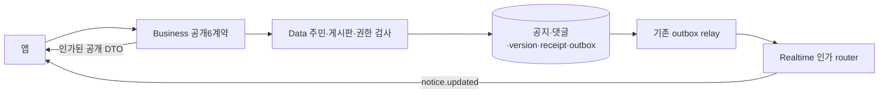
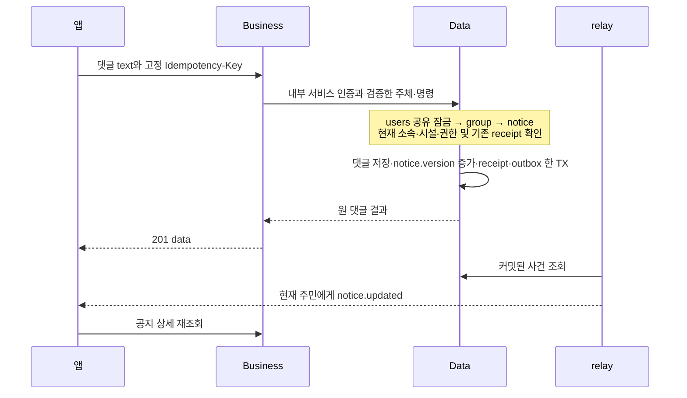

# 게시판 — HLD

[정책](policy.md) · [상세 설계](low-level-design.md)

공지와 댓글은 Data의 한 장부에 적는다. Business는 신분과 요청 형식을 확인하는 입구다. 실시간 알림은 내용을 따로 보관하는 두 번째 장부가 아니라 “바뀌었으니 다시 읽어 달라”는 신호다.

legacy 공지는 OWNER/ALLOW가 타인 공지도 수정·삭제한다. 새 권한 정책과 다르다는 이유로 기존 controller를 소급 변경하지 않는다. 기존 목록 전체 조회/PUT는 유지하고 새로운 cursor/상세/댓글은 별도 어댑터로 연결한다. 공지/댓글 입력·출력의 이름은 body/text이며 저장 content와 명시 매핑한다.

상세 본문·댓글 첫 페이지·version은 한 Data 읽기 snapshot에서 만들고 Business가 여러 독립 결과를 같은 snapshot이라고 부르지 않는다. 새 댓글의 파기 정책은 미결이다. 정책 없이 먼저 개인정보를 저장한 뒤 나중에 정리하겠다고 출시하지 않는다.

구현 순서: 권한/댓글 파기 결정 → 저장·동시성/receipt → 신규 공개6계약 → outbox/인가된 event·재조회 → 실패 경합/legacy 회귀 → 화면 BFF. event 재조회 실패는 dirty 상태를 유지하고 다음 갱신으로 복구한다.
