# 전체 아키텍처

상태: 제안. 이 문서의 신규 화살표는 [현재 아키텍처](../../../architecture/README.md)의 승인된 호출 표를 자동 변경하지 않는다.

## 1. 현행과 목표

| 영역 | 현재 코드 | 목표 |
| --- | --- | --- |
| 앱 좌표·탐색 | [village-world.ts](../../../../app/app-dev/src/utils/village-world.ts), [map.json](../../../../app/app-dev/src/assets/village-world/map.json): 1536×1024 픽셀, 통행 96×64·길 비용 48×32 | 공통 좌표·서버 통행 산출물을 읽는 예측 A* |
| 화면 | [WorldMap.tsx](../../../../app/app-dev/src/screens/island/WorldMap.tsx), [VillageScenery.tsx](../../../../app/app-dev/src/screens/island/VillageScenery.tsx): 로컬 캐릭터·Wanderer 연출 | 내 actor 예측과 실제 원격 actor 렌더링 분리 |
| 실시간 | [islandRealtime.ts](../../../../app/app-dev/src/services/islandRealtime.ts), [realtime 서버](../../../../server/realtime/README.md): STOMP 이벤트 | 기존 도메인 이벤트 유지. 이동 좌표는 별도 연결 |
| 데이터 | Business 유스케이스, Data의 섬·주민·완공 시설 | 코어 정본 유지, 이동 서비스에는 필요한 버전 스냅샷을 push |
| 이동 서버 | 없음 | 맵 합성·방·A*·20Hz 시뮬레이션·팬아웃을 담당하는 신규 서비스 |

## 2. 논리 구조

[Mermaid 원본](diagrams/01-architecture.mmd)

| 구성 요소 | 책임 | 제외하는 책임 |
| --- | --- | --- |
| Business API | 기존 인증·현재 섬 검사, 입장 티켓, 권한 lease·배치 스냅샷 push, 소유자 배정 조정 | 매 틱 좌표 계산 |
| Data API | 소속·현재 섬·시설 배치 정본, 변경 트랜잭션과 재전달 가능한 변경 기록 | 위치 틱 쓰기 |
| 맵 배포 저장소/CDN | content hash로 식별되는 원본·통행 산출물 배포 | 권한 판정·클라이언트 업로드 신뢰 |
| Movement 제어 어댑터 | Business로부터 권한·배치 수신, 방 주소·상태 응답, 멱등·버전 검사 | 코어 DB 접근 |
| Movement worker | 방 단일 작성자, 인증된 입력, A*, 위치·도착, 암호화 연결 | 재화·시설·집중 유스케이스 실행 |
| 소유권 저장소 | 방→worker 주소·만료·단조 증가 epoch의 선형화 가능한 lease/CAS | 틱별 위치 저장 |
| 앱 | 입력, 맵 캐시, A*, 네이티브 QUIC, 시간 동기화, 보간·보정·렌더링 | 서버 위치·권한의 정본 |

## 3. 호출·신뢰 경계

| 호출자 → 수신자 | 통로 | 허용 데이터 / 시점 |
| --- | --- | --- |
| 앱 → Business | 기존 HTTPS 인증 | 입장·재입장 티켓 요청, 기존 도메인 동작 |
| Business → Data | 기존 내부 API | 입장 권한·배치 조회, 기존 쓰기 유스케이스 |
| Business → Movement 제어 어댑터 | 내부 HTTPS + 서비스 인증 | 입장 준비, 권한 갱신/취소, layoutRevision 스냅샷. 틱과 독립 |
| Business → 소유권 저장소 | 내부 인증 연결 | 방 배정·주소 조회. 위치 쓰기 없음 |
| worker → 소유권 저장소 | 내부 인증 연결 | 배정된 방의 lease 갱신·해제 |
| 앱 ↔ Movement | **신규 공개 QUIC/UDP, Java/Netty 후보** | scope가 해당 방인 티켓, 목적지·경로·좌표. Kafka를 좌표 전달 경로에 넣지 않음 |
| 앱·worker → 맵 저장소 | HTTPS, worker 쓰기는 서비스 자격 | 승인 manifest의 hash가 일치하는 산출물만 사용 |
| 도메인 이벤트 → 기존 Realtime → 앱 | 현행 경로 | 집중·휴식·감정·재생 등 기존 이벤트. 위치 팬아웃 아님 |

Movement→Business/Data 동기 조회와 코어 DB 직접 접근은 두지 않는다. 가입 시 필요한 사실을 Business가 먼저 push하고, worker가 준비 상태를 응답한 뒤 티켓을 발급한다. 갱신은 Business가 방별로 묶어 push한다. 매 갱신에는 최신 로그인/계정·현재 섬·소속 상태를 확인한 근거가 필요하며, 확인에 실패한 캐시 값을 새 기한으로 연장하지 않는다. 만료 시각은 권한 확인 시점에서 계산한다. 알 수 없는 권한 버전·배치 누락은 재시도 가능한 거부로 처리한다.

**권한 취소·배치 변경은 Redis Pub/Sub 단독 전달에 의존하지 않는다.** 해당 유스케이스가 커밋한 변경을 재전달 가능한 기록으로 남기고 Business 제어 어댑터가 ack까지 재시도한다. 이벤트 봉투는 [서비스 아키텍처](../../../architecture/service-architecture.md) §4 정본을 사용한다. `eventId` 중복 거부와 해당 subject의 `version` 순서 검사를 적용하며, 버전 공백에는 전체 스냅샷으로 수렴한다. 이 제어 어댑터·변경 기록 연결도 신규 구현 범위다.

## 4. 데이터 소유

| 데이터 | 정본·쓰기 소유 | 수명 / 복구 |
| --- | --- | --- |
| 소속·현재 섬·완공 시설 | Data | 기존 DB·트랜잭션 |
| 원본 지형·충돌 재료 | 승인된 맵 빌드 파이프라인 | 불변 버전 파일, 배포 manifest |
| 합성 통행 맵 | Movement 맵 컴파일러 | 지형+배치+rulesVersion+반경의 hash, 다시 생성 가능 |
| actor 위치·경로·속도 | 해당 방 worker 메모리 | epoch 동안만. 장애 후 입구 복귀 제안 |
| 권한 투영·세션·사용한 jti | 해당 방 worker 메모리 | 현재 epoch·유효기간. 새 epoch는 옛 티켓을 거부 |
| room lease·epoch | 소유권 저장소 | 다중 노드 장애에서도 유일한 소유권 보장 |
| 로그·지표 | 관측 시스템 | 운영 보존 정책. 위치 전체 이력은 기본 저장 안 함 |

코어 RDS에 매초 20번 위치를 쓰지 않는다. 1차 범위에서는 위치용 RDB도 만들지 않는다. 소유권 저장소는 기존 Redis 단일 키 락만으로 확정하지 않고, **[etcd](https://etcd.io/docs/v3.6/learning/api_guarantees/) lease/CAS 같은 선형화 가능한 후보**를 POC에서 검증한다. 사용 시 전용 prefix `/movement/{gameId}/rooms/`와 쓰기 주체를 등록한다. 메모리 state의 roomEpoch는 소유권 저장소가 제공하는 단조 증가 64비트 토큰으로 할당하며, 저장소 재구축 시 기존 epoch가 재사용되지 않도록 모든 세션을 폐기하고 새 namespace 세대로 전환한다.

## 5. 배포·확장

[Mermaid 원본](diagrams/02-deployment.mmd)

- 방 하나는 worker 하나가 소유하고, worker 하나는 여러 방을 처리한다. 같은 방의 A* 결과 적용·틱 갱신은 직렬화한다.
- 최초 배정은 `gameId/roomId` 기준 해시+부하를 후보 선택에 사용한다. 실제 권한은 lease/CAS로 확정한다. 살아 있는 방을 단순 해시 변경으로 다른 worker에 동시에 배정하지 않는다.
- 티켓은 roomEpoch와 해당 shard의 공개 endpoint를 포함한다. UDP ingress는 연결을 동일 worker로 전달해야 한다. 일반 HTTP nginx 설정만으로 QUIC 전달이 된다고 가정하지 않는다.
- 1차 배포는 shard별 UDP endpoint를 사용한다. 향후 L4 로드밸런서를 쓰면 QUIC connection ID 또는 세션 affinity와 연결 이동을 검증한다. 네트워크 전환으로 기존 경로가 유지되지 않으면 새 티켓으로 재접속한다.
- worker는 소유 lease의 보수적 로컬 만료 전에 틱·송신을 중단한다. 새 소유자는 이전 lease 만료 뒤 새 epoch로 시작한다. 단절된 이전 프로세스가 복귀해도 재획득 없이 재개할 수 없다.
- 축소·배포는 신규 방 배정 중단→유예→재접속 안내→lease 해제로 drain한다. 1차에는 무중단 live room migration을 구현하지 않는다.
- 방 내 최대 15 actor의 부하 시나리오는 전체 팬아웃으로 시작한다. 일반 엔진은 가시 영역 구독을 확장 지점으로 둔다. `방 인원²`로 커지는 송신량을 CPU와 별도로 측정한다.

### 자원·네트워크 등록 초안

| 항목 | 제안 |
| --- | --- |
| 구현/레포 | Java 코어 + Netty QUIC 어댑터. A17의 JVM 대상 레포 `oneorthree/server` 내 `services/movement/` 후보로 등록하고 기존 서버 이관 계획과 맞춘다. 이 PR은 레포·서비스를 생성하지 않음 |
| 공개 포트 | shard endpoint UDP 443 후보, 기존 HTTPS 호스트와 충돌하지 않도록 별도 주소 |
| 내부 포트 | 제어 HTTPS 8443·관측 9090 후보, 외부 차단 |
| 프로세스 예산 | 초기 부하 측정은 worker 4 vCPU / 8GiB. 운영 인스턴스·복제 수는 실측 후 자원표에 반영 |
| 시크릿 | TLS 키/인증서, Business 티켓 공개 검증키, 내부 서비스 자격, 저장소 권한. 앱에 공유 비밀을 넣지 않음 |
| CI | Java 코어·패킷 fuzz·TS/Java 공통 fixture·상호 운용·모바일 네이티브 빌드; 맵 산출물 hash 검증 |
| 관측 | `DD_SERVICE=movement-server` 후보. room/actor 고유 ID를 메트릭 태그로 무제한 사용하지 않음 |

## 6. 아키텍처 변경 절차

[새 서비스 8단계](../../../architecture/README.md)에 따라 구현 PR 착수 전에 다음을 정식 문서에 반영한다.

1. Java 서비스 모듈 위치와 독립 빌드·배포 단위 확정.
2. 위 호출 표를 정식 service-architecture 허용 표와 대조·등록.
3. 맵·메모리·lease 저장소의 소유와 namespace 등록.
4. 제어 이벤트의 정본 봉투·재시도·취소 계약 등록.
5. 시스템 자원·시크릿·CI 필터·관측 비용 등록.
6. 앱 직접 UDP 공개 면과 인증 예외 승인.
7. 정식 서비스·배포 그림과 SVG 동시 갱신.
8. 기존 규칙 변경의 A 결정 번호 기록.

이번 PR은 위 변경을 검토할 입력 문서다. 승인되지 않은 예외를 기존 규칙의 확정 사실로 기록하지 않는다.

## 7. Java · Kafka · Realtime 선택 검토

용어와 비교 기준이 낯설다면 [그림으로 이해하는 이동 서버 설계](learning-guide.md)를 먼저 읽는다. 같은 JVM 통합·gateway 중계·직접 연결을 각각 독립된 그림으로 설명하고, Kafka·손실·큐·소유권의 기초를 연결한다.

**2026-09-23 Plannotator 피드백:** Java로 좌표를 계산하고 Kafka를 앱이 소비할지, 직접 통신과 C++ 분리가 필요한지, 이미 연결된 Realtime에 합칠지 비교해 달라는 질문이다.

**추천을 Java 이동 서비스 + 앱 직접 연결로 수정한다.** 최초 초안의 Go/quic-go 출발안은 기존 JVM 운영 기반을 우선한 Java/Netty 후보로 대체한다. 아직 기술 POC나 사용자 최종 승인을 마친 결정은 아니다.

### 7.1 언어·연결·서비스 분리는 각각 선택한다

- Java로 A*·틱·위치를 계산하면서 QUIC/UDP 연결을 직접 받을 수 있다. Java용 [Netty QUIC API](https://netty.io/4.2/api/io/netty/handler/codec/quic/package-summary.html)와 [DATAGRAM 설정](https://netty.io/4.2/api/io/netty/handler/codec/quic/QuicCodecBuilder.html)이 있다. 서버 언어와 전송 프로토콜을 함께 바꿀 필요는 없다.
- 여기서 직접 연결은 **클라이언트 세션 하나가 방 소유 worker에 연결**된다는 의미다. 사용자마다 프로세스·서버 한 대를 만드는 방식이 아니다. worker 하나가 여러 연결과 여러 방을 관리한다.
- 별도 프로세스는 이동의 CPU·GC·큐·배포 장애를 채팅에서 격리하고 게임별 재사용을 쉽게 하기 위한 선택이다. 별도 언어나 별도 레포가 필수인 것은 아니다. Java 서비스는 기존 JVM 저장소 규칙에 맞춰 배치한다.
- Java의 20Hz 처리 가능 용량은 아직 측정하지 않았다. A* 실행 시간·할당률·GC pause·틱 p99·송신 큐를 먼저 측정한다. 자원 조정과 병목 개선 후에도 목표를 못 맞추는 구체 근거가 생기면 해당 모듈의 네이티브화 또는 언어 변경을 비교한다.

### 7.2 Kafka의 소비자는 서버에 둔다

Kafka는 도메인 사건의 서버 간 전달·재처리에 사용할 수 있다. 앱의 위치 표시용 20Hz 스냅샷은 worker가 연결된 앱에 직접 보낸다. 위치는 오래된 데이터를 빨리 버리고 최신 상태로 수렴해야 하므로, 각 틱을 로그에 적재한 후 broker→consumer→gateway로 되읽는 경로를 기본으로 채택하지 않는다. 이는 Kafka가 저지연을 지원하지 못한다는 주장이 아니라, 이 기능에 필요한 전달 성질과 운영 비용에 따른 선택이다.

Kafka의 일반 consumer group은 레코드를 그룹 내 소비자 중 하나에 분배한다. 같은 그룹에 앱을 넣는 것만으로 모든 주민에게 방송되는 구조가 되지 않는다. 그룹·offset·재접속·브로커 접근 제어까지 모바일 세션에 노출하는 설계는 채택하지 않는다. 서버가 소비하고 앱 수신 권한을 검사해 소켓으로 전달한다. [KafkaConsumer 공식 문서](https://kafka.apache.org/42/javadoc/org/apache/kafka/clients/consumer/KafkaConsumer.html)

현재 코드에도 서버 소비 경로가 있다. [KafkaEventInbound](../../../../server/realtime/src/main/java/com/oneorthree/realtime/event/KafkaEventInbound.java)는 설정으로 켜는 Kafka 입구이며, [RealtimeEventDelivery](../../../../server/realtime/src/main/java/com/oneorthree/realtime/event/RealtimeEventDelivery.java)와 [Redis 수신기](../../../../server/realtime/src/main/java/com/oneorthree/realtime/event/RealtimeEventFanoutSubscriber.java)가 로컬·다른 인스턴스의 STOMP 구독자에게 전달한다. 코드 존재와 운영 활성화는 별개다. README의 `DisabledRealtimeDelivery` 설명은 현재 구현과 달라 이 비교는 구현 파일을 기준으로 했다.

권한 취소·시설 변경처럼 다시 처리해야 하는 제어 정보의 신뢰성은 §3을 따른다. 실제 도메인에 이미 연결된 HTTP/outbox·Kafka 전달 경로를 확인해 재사용한다. 이동 기능을 위해 20Hz 좌표 토픽이나 새 Kafka 클러스터를 만드는 계획은 없다.

[Mermaid 원본](diagrams/07-transport-boundaries.mmd)

### 7.3 기존 Realtime 연결에 합칠 수는 있는가?

가능하지만 두 방식을 구분해야 한다. **같은 JVM에 이동 엔진까지 넣기**와 **Realtime이 소켓 gateway만 맡고 별도 worker로 중계하기**는 다른 구조다.

| 선택지 | 이점 | 추가 비용·제약 | 이번 추천 |
| --- | --- | --- | --- |
| Realtime JVM에 Java 이동 엔진·STOMP 채널 추가 | 기존 앱 연결과 배포를 재사용, 초기 연결 작업 적음 | 채팅과 A*·틱의 CPU/GC/장애 공유, 방 소유·20Hz 큐 정책 신규 구현, 기존 WebSocket은 UDP 요구 미충족 | 소규모 기능 검증 대안. 최종 UDP/서버 분리 요구 충족으로 표시하지 않음 |
| Realtime은 gateway, Java Movement는 별도 worker | 앱 연결 하나 유지 가능, 이동 계산은 격리 | 앱→gateway→owner 추가 홉, owner 라우팅·구독·권한 취소·backpressure를 두 서비스에 구현. 기존 STOMP 연결의 전송 성질 유지 | 단일 앱 연결이 더 중요한 요구로 확정되면 재비교 |
| **Java Movement + 앱 직접 QUIC** | UDP 요구 충족, 위치 경로가 짧고 채팅과 연산·송신 장애 분리 | 모바일 네이티브 어댑터·추가 연결·공개 UDP endpoint·망 차단 대응 필요 | **추천**, 모바일·부하 POC 통과 조건 |
| C++ Movement + 앱 직접 연결 | 향후 측정된 CPU/메모리 병목을 더 세밀하게 제어할 여지 | 별도 언어·빌드·디버깅·운영 비용, 모바일 전송 문제는 여전히 검증 필요 | 측정 근거가 생길 때 재검토 |

[현재 앱 연결](../../../../app/app-dev/src/services/islandRealtime.ts)은 `startIslandRealtime`에서 열고 `dispose()`에서 닫는다. 앱 전역에 단 하나의 영구 소켓이 항상 있다는 전제로 설계하지 않는다. 같은 연결을 재사용할 때도 섬 구독·배경 전환·재접속의 수명을 확인해야 한다.

직접 연결 추천안에서는 기존 Realtime은 채팅·도메인 이벤트를 맡고, Movement 연결은 섬에서 실제 이동을 표시하는 동안 유지한다. 추가 연결의 배터리·재접속 비용은 iOS/Android 실기기로 측정한다. 개발용 WebSocket/mock 어댑터로 Java 코어를 먼저 검증할 수 있지만, 해당 결과는 QUIC/UDP 수용 시험을 대신하지 않는다.
