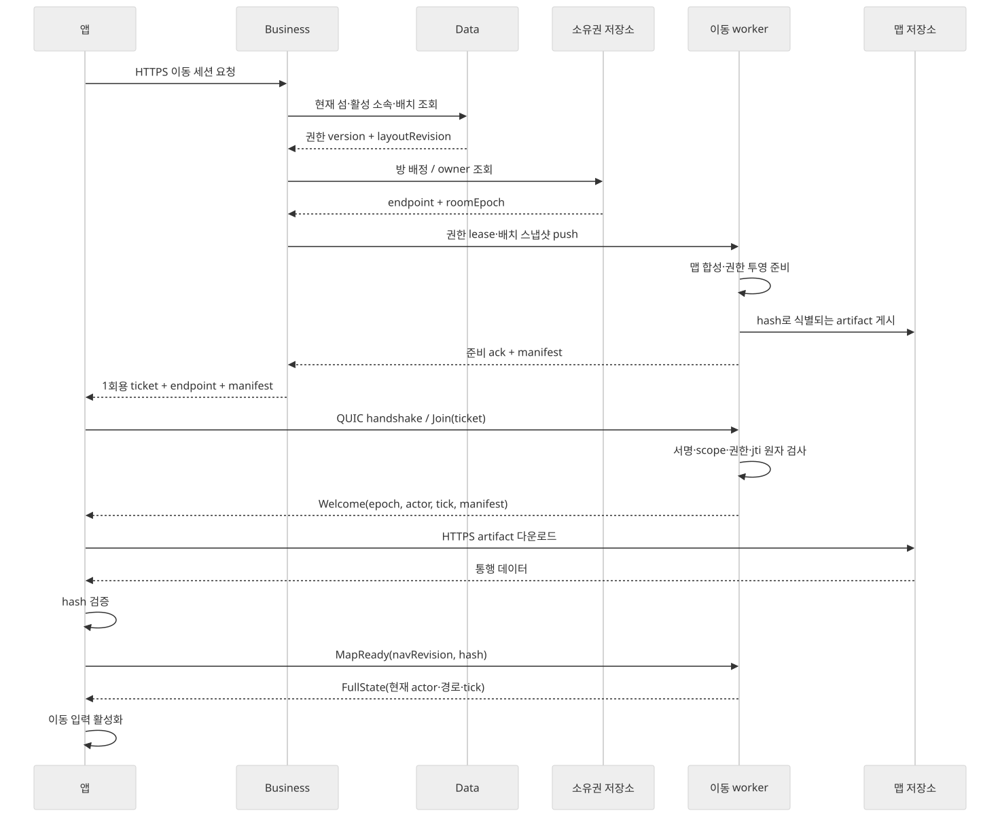
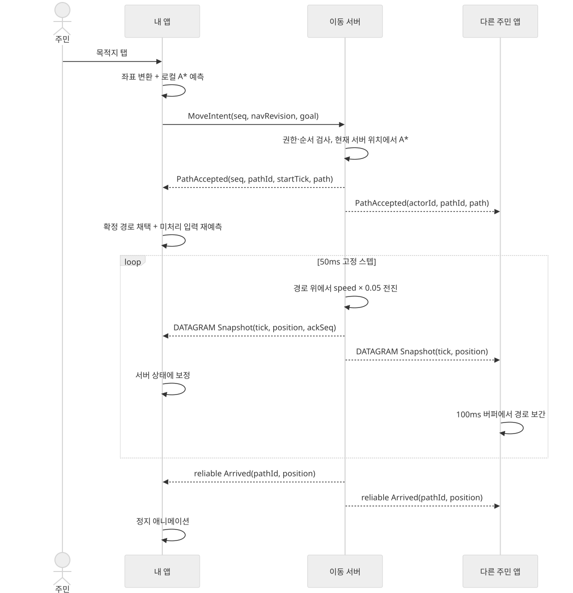
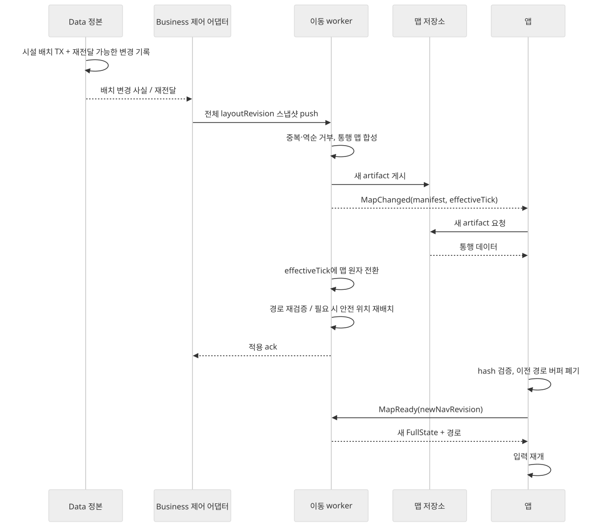
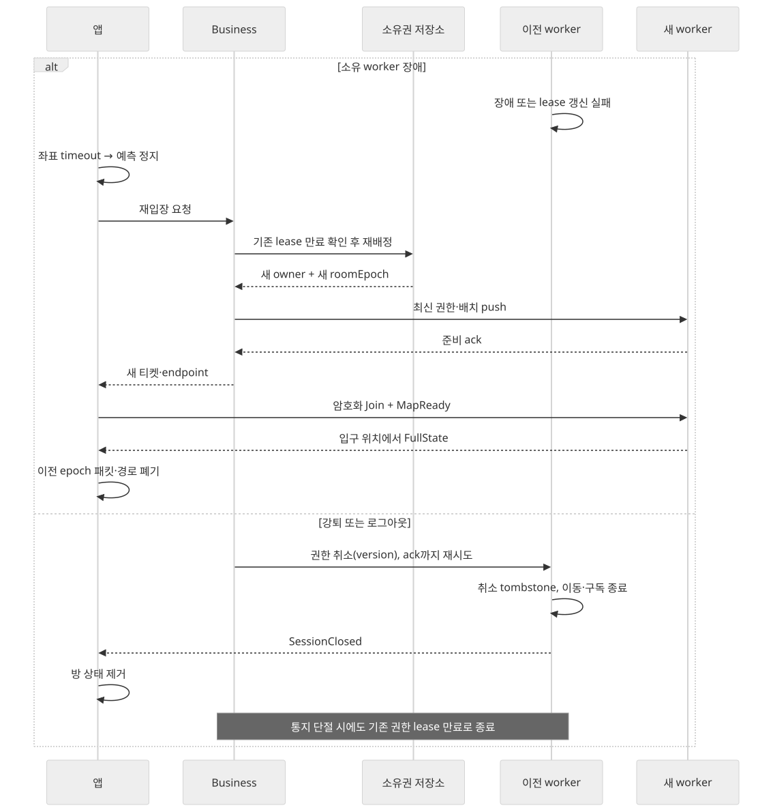

# 데이터 흐름

모든 메시지는 [전송 계약](protocol.md)의 제안 이름이다. 실선/점선의 의미는 각 도식의 화살표 라벨을 우선한다.

## 1. 입장과 맵 준비

[Mermaid 원본](diagrams/04-join.mmd)

1. Business가 현재 섬·활성 소속을 Data 정본으로 검사한다. 클라이언트가 보낸 userId로 다른 주민을 선택하지 않는다.
2. Business가 방 소유자·epoch를 확보하고, 최신 권한·배치를 worker에 push한다. worker 준비 ack 전에는 사용 가능한 티켓을 응답하지 않는다.
3. 앱은 암호화 연결을 연 뒤 티켓을 제출한다. worker는 jti를 원자 소비하고 현재 권한 버전을 재검사한다.
4. manifest의 hash로 통행 파일을 검증한 뒤 MapReady를 보낸다. 전체 상태·경로·시간 기준이 준비되면 입력을 연다.
5. 입장 준비 이후 강퇴되는 경합은 권한 version/취소 tombstone이 우선한다. 뒤늦은 낮은 버전 push와 그 티켓은 다시 활성화시키지 못한다.

## 2. 탭부터 도착까지

[Mermaid 원본](diagrams/03-movement.mmd)

앱이 보내는 좌표는 목적지다. 서버에 자신의 실제 위치라고 주장하는 값은 반영하지 않는다. 서버는 현재 확정 위치에서 A*를 수행하고, PathAccepted 후 경로를 따라 시뮬레이션한다. 앱의 `s → s1` 계산은 렌더 보간·예측이며 서버의 이동 결과를 대체하지 않는다.

경로 메시지와 snapshot은 서로 다른 채널이므로 도착 순서가 뒤바뀔 수 있다. PathAccepted를 받기 전 해당 pathId의 좌표는 보간에 사용하지 않는다. 도착은 reliable Arrived로 전달하며, 유실된 좌표 때문에 영구 이동 상태가 되지 않도록 FullState도 현재 정지 상태를 포함한다.

## 3. 시설 배치 변경

[Mermaid 원본](diagrams/05-map-change.mmd)

변경 데이터의 정본은 Data, 통행 결과의 정본은 Movement다. layoutRevision이 감소하는 이벤트는 버리고, 누락된 중간 이벤트 대신 최신 전체 배치로 수렴할 수 있다. 재전달 가능한 변경 기록의 ack는 worker가 해당 버전을 적용했거나 더 최신 전체 스냅샷으로 대체했음을 확인한 뒤 완료한다.

새 맵이 준비되지 않은 클라이언트는 새 revision의 입력을 보낼 수 없다. 지도 파일 다운로드 중에도 건물·권한 UI는 기존 API 상태를 따른다. 새 충돌 배치와 옛 이동 맵을 혼합해 이동시키지 않는다.

## 4. 연결 상실·소유자 장애·권한 취소

[Mermaid 원본](diagrams/06-recovery.mmd)

| 상황 | 서버 처리 | 앱 처리 |
| --- | --- | --- |
| 짧은 패킷 손실 | 다음 최신 snapshot 전송. 오래된 좌표 재전송 안 함 | 경로 위 한정 외삽 후 정지 |
| Wi-Fi↔셀룰러 전환 | 검증된 QUIC migration이면 유지, 실패면 liveness 만료 | 기존 연결 복구 시도 후 새 티켓·전체 동기화 |
| 배경 전환·강제 종료 | Leave 또는 3초 liveness 만료 시 정지·퇴장 | 복귀 시 새 세션. 오래된 명령 재전송 안 함 |
| 같은 방 재접속 | 같은 사용자 기존 actor를 퇴장시키고 새 actorId/generation | 기존 예측·패킷·경로 캐시 폐기 |
| worker 장애 | lease 만료 후 다른 worker에 새 epoch. 영속 위치 복구 없음 | 새 티켓·맵 확인 후 입구로 복귀 |
| 소유권 저장소 단절 | lease 연장 불가면 만료 전에 틱·송신 중단 | 정지하고 재입장 대기 |
| Business 제어 경로 단절 | 현재 권한 lease까지만 유지. 이후 위치 송수신·이동 종료 | 연결 상태 표시, 권한 재확인 후 입장 |
| 강퇴·로그아웃 | 취소 version tombstone 적용, 세션 종료·구독 해제 | 해당 섬 상태 제거, 기존 앱의 권한 상실 UX 적용 |

새 worker는 옛 epoch의 티켓·명령을 받지 않는다. 이전 worker가 늦게 보내는 패킷도 앱에서 폐기한다. 새로운 owner가 존재하는데 이전 owner도 계속 권한을 행사하는 상황을 lease 만료·fencing으로 막는다. 이 보장은 단순히 Redis에 `SET NX` 한 번 하는 것으로 대체하지 않는다.

## 5. 데이터 보장 요약

| 데이터 | 전달 성질 | 멱등·순서 기준 | 보존 |
| --- | --- | --- | --- |
| 입장 티켓 | HTTPS 응답, 암호화 stream 사용 | jti 단일 소비·roomEpoch·권한 version | 유효 기간까지 worker 메모리 |
| 제어 변경 | 재전달·ack, 전체 스냅샷 수렴 | eventId + subject version | 기존 도메인 정본과 신규 제어 재전달 기록 |
| 목적지 명령 | reliable stream, 연결 종료 시 불확실 | session/generation + commandSeq | 제한된 결과 캐시 |
| 경로·도착 | reliable actor stream | epoch/navRevision/actorId/pathId | 현재 활성 경로 |
| 위치 | unreliable DATAGRAM | actor별 tick/packetSeq | 짧은 표시 버퍼 |
| 맵 파일 | HTTPS 불변 artifact | 인증 manifest의 contentHash | 버전 캐시 |

QUIC 연결 안의 reliable은 애플리케이션의 영구 보관을 뜻하지 않는다. 연결이 끊어지면 명령을 무조건 재실행하지 않고 새 세션 전체 상태로 확인한다.
