# 그림으로 이해하는 이동 서버 설계

**대상:** Java·Kafka·Realtime이라는 이름은 알지만, 왜 합치거나 나누는지 판단하기 어려운 독자.

이 문서는 [아키텍처 비교안](architecture.md)을 읽기 위한 기초 설명이다. 구현 사양은 [HLD](high-level-design.md)와 [전송 계약](protocol.md)을 따른다. 아래 그림의 배치는 이해를 위한 예이며 운영 배포 완료를 뜻하지 않는다. 성능 수치는 측정 목표 또는 산술 예제로 구분한다.

## 읽는 길

| 궁금한 점 | 읽을 부분 |
| --- | --- |
| 서버를 나누면 C++이 필요한가? | 1. 서로 다른 네 가지 선택 |
| 1대1 연결이면 사람마다 서버가 필요한가? | 2. 연결과 방 소유자 |
| A*와 20Hz와 화면 프레임은 무엇이 다른가? | 3. 세 가지 시간 |
| WebSocket과 UDP·QUIC는 어떻게 다른가? | 4~5. 전송과 손실 |
| Kafka를 앱이 소비하면 안 되는가? | 6. 이벤트와 상태 |
| Realtime에 넣기와 중계하기는 어떻게 다른가? | 7~9. 세 가지 배치 방식 |
| 왜 큐·권한·소유권까지 설계해야 하는가? | 10~12. 느린 수신자와 장애·인증 |
| 그래서 지금 무엇을 고르면 되는가? | 13. 선택 기준과 검증 순서 |

## 1. 언어·프로세스·연결·프로토콜을 따로 생각하기

“Java로 만든다”, “서버를 분리한다”, “앱과 직접 연결한다”, “UDP로 보낸다”는 각각 다른 선택이다.

| 말 | 쉬운 뜻 | 이 프로젝트의 예 |
| --- | --- | --- |
| 구현 언어 | 계산 규칙을 어떤 언어로 작성하는가 | Java로 A*와 위치 계산 |
| 프로세스 | 실행 중인 프로그램의 경계. JVM은 Java 프로그램의 실행 환경 | Realtime JVM과 Movement JVM을 따로 실행 |
| 서비스 | 어떤 업무를 책임지는가 | 채팅 서비스, 이동 서비스 |
| 연결 | 앱과 서버 사이에 유지하는 통신 세션 | 주민 A의 이동 연결, 주민 B의 이동 연결 |
| 프로토콜 | 데이터를 보내고 해석하는 약속 | STOMP/WebSocket, QUIC stream/DATAGRAM |
| 머신·컨테이너 | 프로세스를 어디서 실행하고 자원을 배정하는가 | 한 머신에서 두 프로세스 실행, 또는 서로 다른 머신 |


[그림 원본](diagrams/learning/01-choices.mmd)

**같은 Java를 쓰면서 프로세스만 분리할 수 있다.** 같은 저장소에서 두 서비스를 각각 빌드·배포할 수도 있다. 별도 프로세스는 각자의 메모리와 실행 수명을 갖지만, 같은 머신의 CPU·네트워크까지 자동으로 분리되는 것은 아니다. 운영에서 자원 제한·배치를 함께 정해야 한다.

Java에도 QUIC용 네트워크 API가 있다. 따라서 직접 연결 때문에 C++ 서버를 새로 작성할 필요는 없다. 언어 변경은 측정된 병목과 팀의 운영 비용을 보고 판단한다. [Netty QUIC 공식 API](https://netty.io/4.2/api/io/netty/handler/codec/quic/package-summary.html)

> 이 그림에서 가져갈 것: **언어가 같아도 서버를 나눌 수 있고, 서버를 나눠도 언어를 바꿀 필요는 없다.**

## 2. 직접 연결 하나와 서버 한 대는 다르다

우리 문서의 “직접 연결”은 **앱이 자기 방을 담당하는 이동 worker와 통신한다**는 뜻이다. worker는 이동 서버의 실행 프로세스다. 사용자마다 worker를 하나씩 만드는 설계가 아니다.


[그림 원본](diagrams/learning/02-connections.mmd)

예를 들어 worker A는 숲 섬과 바다 섬을 함께 맡을 수 있다. 숲 섬의 두 주민은 각각 자기 연결로 목적지를 보내고, A가 계산한 같은 섬 상태를 받는다. 다른 섬의 주민에게 숲 섬 좌표를 보내지는 않는다.

**방 소유자(owner)**는 그 방의 현재 위치를 최종 결정하는 worker다. 네트워크 연결이 있는 서버와 방 소유자는 직접 연결 구조에서는 같지만, gateway 구조에서는 다를 수 있다. gateway는 앱 연결을 받아 실제 담당 서버로 중계하는 입구다.

> 이 그림에서 가져갈 것: **연결은 사용자별로 여러 개여도, 한 프로세스가 여러 연결과 방을 처리한다.**

## 3. A*·서버 틱·화면 프레임은 서로 다른 시간에 움직인다

| 작업 | 하는 일 | 실행 계기 |
| --- | --- | --- |
| A* | 현재 위치에서 목적지까지 갈 길을 찾는다 | 목적지 또는 통행 맵 변경 |
| 서버 틱(tick) | 이미 찾은 길을 따라 실제 위치를 조금 전진시킨다 | 이 설계에서는 50ms마다 |
| 좌표 방송 | 수신자에게 최신 위치를 보낼 기회를 만든다 | 최대 20Hz. 혼잡 시 생략 가능 |
| 화면 프레임 | 지금 화면에 그릴 위치·스프라이트를 정한다 | 기기의 렌더 주기. 60fps라면 약 16.7ms마다 |


[그림 원본](diagrams/learning/03-clocks.mmd)

20Hz는 `1초 ÷ 20 = 50ms`다. 캐릭터 속도가 **예제값** 4 world unit/s라면 서버는 정상 틱마다 `4 × 0.05 = 0.2`만큼 경로를 따라 전진시킨다. 틱이 늦었다고 A*를 20번 새로 실행하거나 클라이언트가 임의 속도로 도착시키지 않는다.

화면이 60fps여도 좌표 패킷을 60번 받을 필요는 없다. 패킷 사이의 표시 위치는 앱이 계산한다.

- **예측(prediction):** 내 입력을 먼저 적용해 바로 걷기 시작한다.
- **보간(interpolation):** 받은 두 시점 사이에서 어디에 보여 줄지 계산한다. 다른 주민은 조금 과거의 상태를 버퍼에 두고 표시한다.
- **보정(reconciliation):** 서버가 알려 준 실제 상태와 내 예측이 다르면 서버 상태에 맞춘다.
- **외삽(extrapolation):** 다음 좌표가 없을 때 짧은 시간 동안 기존 경로로 진행을 추정한다. 계속 추정하면 벽·도착점을 넘을 수 있어 한도를 둔다.

100ms 보간 버퍼는 데이터가 이어질 여유를 주는 대신 표시를 그만큼 늦춘다. 그림의 부드러움과 입력 반응을 별도로 평가하는 이유다. 구체 기준은 [HLD의 앱 표시](high-level-design.md)와 [정책 파라미터](policy.md)에 있다.

## 4. WebSocket·STOMP·UDP·QUIC는 같은 층의 이름이 아니다

데이터를 보낼 때 여러 약속이 겹쳐 사용된다. 채팅 메시지 형식과 인터넷에서 패킷을 보내는 방법은 서로 다른 층에 있다. 메시지는 앱이 다루는 데이터 단위이고, 패킷은 네트워크의 전송 단위다. 둘이 항상 하나씩 대응하지는 않는다. 아래의 네트워크 프레임은 화면의 한 장을 뜻하는 렌더 프레임과도 다른 말이다.


[그림 원본](diagrams/learning/04-protocol-layers.mmd)

| 이름 | 역할 | 이번 설계에서 알아둘 성질 |
| --- | --- | --- |
| TCP | 순서 있는 바이트 흐름 전송 | 유실 데이터를 복구하며 같은 흐름의 순서를 맞춘다. 그 자체로 암호화하지 않음 |
| TLS | 암호화·무결성·상대 인증을 위한 보호 | WSS에 사용하는 보호. QUIC도 TLS를 이용하지만 단순히 TCP 위 TLS와 같은 배치는 아님 |
| WebSocket | 연결을 유지하며 메시지를 주고받는 프레임 규칙 | 기존 Realtime의 RFC 6455 기반 TCP 연결. 텍스트·바이너리 모두 가능하며 UDP로 자동 전환되지 않음 |
| STOMP | SEND·SUBSCRIBE·destination 같은 메시징 명령 | WebSocket 위에서 “어느 채널에 보내고 구독할지” 정함 |
| UDP | 데이터그램 단위 전송 | 그 자체로 도착·순서·재전송·암호화를 보장하지 않음 |
| QUIC | UDP 위에서 연결·보호·흐름·혼잡 제어를 제공 | 하나의 연결에 여러 stream을 두고, 확장 협상 후 DATAGRAM 사용 |
| QUIC stream | 연결 안의 신뢰성 있는 순서 바이트 흐름 | 명령·경로 전달 후보. 서로 다른 stream 전체에 단일 순서를 만들지는 않음 |
| QUIC DATAGRAM | QUIC 연결 안의 재전송하지 않는 메시지 | 최신 좌표 전달 후보. 암호화되며 혼잡 제어도 따름 |

근거: [TCP RFC 9293](https://www.rfc-editor.org/rfc/rfc9293.html), [UDP RFC 768](https://www.rfc-editor.org/rfc/rfc768.html), [WebSocket RFC 6455](https://www.rfc-editor.org/rfc/rfc6455.html), [STOMP 1.2](https://stomp.github.io/stomp-specification-1.2.html), [QUIC RFC 9000](https://www.rfc-editor.org/rfc/rfc9000.html), [DATAGRAM RFC 9221](https://www.rfc-editor.org/rfc/rfc9221.html).

UDP는 아래층에서 연결을 제공하지 않지만, **그 위의 QUIC는 연결 상태를 관리한다.** 그래서 “UDP니까 로그인·연결 관리가 없다”는 결론이 나오지 않는다. 직접 QUIC 방식에서도 handshake, 인증, 재접속, 세션 만료를 구현해야 한다.

또한 UDP·바이너리·압축·암호화는 별개다. 바이너리는 표현 방식, 양자화는 정밀도를 정해 크기를 줄이는 방식, 암호화는 내용을 보호하는 방식이다. 현재 초안은 정수 바이너리와 QUIC 보호를 사용하며, gzip이나 delta 압축은 측정 후 검토한다.

## 5. 패킷이 하나 빠졌을 때 달라지는 일

아래는 개념 설명용 사례다. 같은 경로의 위치 세 개를 보내다 가운데 데이터가 유실됐다고 생각하자. TCP 쪽의 데이터 1·2·3은 바이트 구간을 단순화한 표시이며, 메시지 하나가 패킷 하나라는 가정은 아니다.

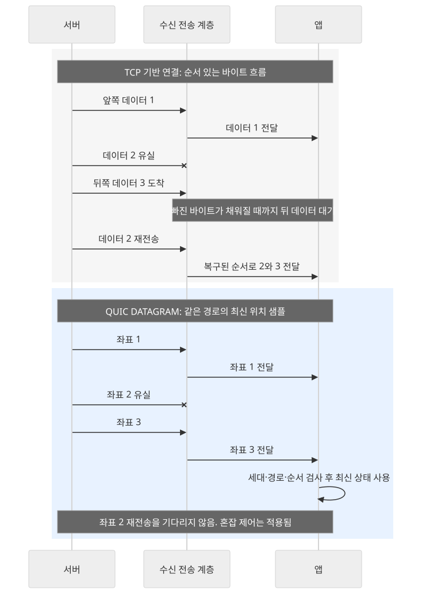

[그림 원본](diagrams/learning/05-loss.mmd)

TCP 기반 연결은 빠진 바이트를 복구해 순서를 맞춘 뒤 뒤쪽 데이터를 넘긴다. 뒤 데이터가 이미 도착했어도 앱에 넘기는 것이 지연될 수 있다. 이를 **앞선 데이터 때문에 뒤가 기다리는 현상(head-of-line blocking)**이라고 한다. [TCP RFC 9293](https://www.rfc-editor.org/rfc/rfc9293.html)

QUIC DATAGRAM 좌표는 앞 좌표의 재전송을 기다리지 않고 최신 유효 좌표를 사용할 수 있다. 대신 앱이 중복·역순·손실을 처리해야 한다. 그림은 같은 roomEpoch·navRevision·알려진 pathId인 경우다. 새 경로가 아직 없으면 먼저 받은 좌표만 보고 벽을 가로질러 보간하지 않는다. [DATAGRAM RFC 9221](https://www.rfc-editor.org/rfc/rfc9221.html)

QUIC의 **같은 stream 안에서는** 여전히 순서 복구를 기다린다. 서로 다른 stream 사이의 순서 의존을 줄일 수 있지만, 연결의 네트워크 용량·혼잡 제어까지 각자 독립되는 것은 아니다. 따라서 “QUIC이면 지연이 없다”, “UDP이면 무조건 빠르다”는 보장은 없다. [QUIC RFC 9000](https://www.rfc-editor.org/rfc/rfc9000.html)

## 6. Kafka가 잘하는 일과 앱 방송은 나눠 보기

두 종류의 정보를 생각하면 선택이 쉬워진다.

| 정보 | 필요한 처리 | 이 설계의 경로 |
| --- | --- | --- |
| “사용자가 섬에서 강퇴됐다” | 빠뜨리지 않고 권한에 반영, 중복 처리 방지, 실패 시 재처리 | 도메인 변경 기록 + 서버 제어 전달 |
| “100ms 시점의 좌표가 여기였다” | 150ms의 최신 유효 상태가 있으면 옛 샘플을 건너뛰어도 됨 | 이동 worker → 앱 DATAGRAM |
| “이번 탭의 경로를 확정했다” | 해당 명령 결과와 경로를 전달·대조 | 이동 worker → 앱 reliable stream |

Kafka는 기록된 이벤트를 서버 소비자가 읽고 처리하게 하는 도구다. 최신 위치만 필요한 화면에까지 매 틱의 기록·소비·offset 관리를 반드시 도입해야 하는 것은 아니다. 어떤 이벤트를 남길지는 도메인의 재처리 요구로 정한다.


[그림 원본](diagrams/learning/06-kafka-fanout.mmd)

- **consumer(소비자):** Kafka에서 기록을 읽는 프로그램.
- **consumer group:** 같은 그룹의 소비자들이 파티션을 나눠 읽는 단위. 같은 레코드를 모든 그룹 멤버에게 방송하는 기능은 아니다.
- **partition:** 토픽 안에서 순서가 유지되는 로그의 한 갈래. Kafka의 처리 분배 단위다.
- **offset:** 해당 파티션에서 어디까지 읽고 처리했는지 다루는 위치 값.
- **fanout:** 받은 사건 하나를 실제 수신자 여러 명에게 전달하는 작업.

이 그림은 Kafka의 일반 consumer group을 기준으로 한다. 별도 그룹이나 다른 소비 모델을 선택하면 전달 형태도 달라진다. [KafkaConsumer 공식 문서](https://kafka.apache.org/42/javadoc/org/apache/kafka/clients/consumer/KafkaConsumer.html)

현재 Realtime 코드의 같은 그룹에서는 한 인스턴스가 사건을 받고, 로컬 전달 및 Redis 전파로 다른 인스턴스의 앱 구독자에게도 보낸다. Kafka는 설정으로 켜는 입구이고 HTTP 입구도 존재한다. **앱이 Kafka를 직접 소비하는 구조는 아니다.** 코드는 [자료 노트](learning-sources.md)에 연결했다.

Kafka를 모바일에 직접 연결하면 사용자 접속·종료와 소비 그룹 관리, broker 접근 제어, 섬 수신 권한까지 함께 풀어야 한다. “Kafka를 쓰면 앱으로 방송하는 서버가 필요 없어지는가?”라는 질문에는, 이 설계에서는 앱 전달 서버가 여전히 필요하다고 답한다. Kafka의 성능 한계라고 단정해서 제외한 것은 아니다.

## 7. 대안 A — Realtime JVM 안에 이동 엔진도 넣기

앱이 이미 연결한 Realtime 프로세스에 이동 모듈을 추가한다. 목적지는 STOMP 메시지로 받고 그 JVM 안에서 A*와 틱을 실행한다.


[그림 원본](diagrams/learning/07-option-a.mmd)

**한 번의 탭 경로:** `앱 → Realtime 소켓 → JVM 내부 이동 모듈 → 같은 소켓 → 앱`.

추가 서버 사이의 통신 없이 기능을 빠르게 검증할 수 있다. 그러나 채팅과 이동이 같은 프로세스의 메모리·CPU 예산·재시작에 영향을 받는다. Java의 GC는 불필요해진 객체의 메모리를 회수하는 작업이다. 틱 지연을 볼 때는 계산 시간뿐 아니라 할당률·GC pause도 함께 측정한다. 구체 영향은 사용하는 수집기와 부하에 따라 달라진다. [Java GC 공식 가이드](https://docs.oracle.com/en/java/javase/17/gctuning/introduction-garbage-collection-tuning.html)

이동용 스레드 풀을 따로 두면 작업을 나눌 수 있지만, 같은 JVM의 장애와 메모리까지 격리되지는 않는다. Realtime 인스턴스가 여러 개면 “같은 방 계산을 누가 맡는가”도 여전히 필요하다. 소켓을 재사용해도 방 소유권·입력 순서·맵·큐 한도는 새로 구현해야 한다.

**적합한 상황:** 작은 범위의 기능 검증, 추가 공개 연결을 줄이는 것이 우선이고 기존 WebSocket 전송을 허용한 단계.

**현재 요구와의 차이:** 기존 STOMP/WebSocket을 그대로 쓰면 UDP 좌표 전송을 충족하지 않는다. UDP를 나중으로 미루려면 단계 목표를 명시적으로 바꿔야 한다.

## 8. 대안 B — Realtime은 입구, 계산은 별도 Movement

앱 연결은 Realtime이 유지하고, Realtime이 목적지를 실제 방 소유 worker로 전달한다. 계산 결과도 Realtime을 통해 앱으로 돌아온다.


[그림 원본](diagrams/learning/08-option-b.mmd)

**한 번의 탭 경로:** `앱 → Realtime → 담당 Movement → Realtime → 앱`.

이 방식은 앱 연결 수를 유지하면서 이동 계산을 별도 프로세스로 분리할 수 있다. 그 대신 **추가 홉(hop)**, 즉 서버 사이의 전달 단계가 생긴다. 얼마가 느려지는지는 네트워크·큐·직렬화·부하를 측정해야 하며, 문서만 보고 일정한 ms를 붙일 수 없다.

새로 필요한 작업은 다음과 같다.

1. Realtime이 `roomId → 담당 worker`를 알아내고 장애 시 다시 찾는다.
2. worker의 상태를 그 방 앱이 연결된 여러 Realtime 인스턴스로 돌려보낸다.
3. 앱 소켓 권한과 worker 입장 권한을 함께 검증하고 취소를 전파한다.
4. worker→gateway 큐와 gateway→앱 큐를 모두 제한한다.
5. gateway나 worker 한쪽이 재시작해도 오래된 세션·경로를 버리고 복구한다.

내부 worker 연결을 UDP로 바꾸더라도 **앱까지의 마지막 구간이 기존 WebSocket이면** 앱 UDP 요구는 달성되지 않는다. gateway 방식 자체가 UDP를 못 쓰는 것은 아니다. 앱-facing QUIC gateway로 새로 설계할 수 있지만, 그것은 현재 STOMP 연결의 단순 재사용과 다른 작업이다.

**적합한 상황:** 앱 연결을 하나로 유지하는 가치가 크고, 중계·라우팅·양쪽 큐 관리 비용을 감수할 때.

## 9. 대안 C — 앱이 Java Movement에 직접 연결하기

Realtime 연결은 채팅·도메인 사건에 쓰고, 이동 화면에서는 별도 이동 연결을 연다. Movement가 경로를 계산하고 좌표를 직접 보낸다.


[그림 원본](diagrams/learning/09-option-c.mmd)

**한 번의 탭 경로:** `앱 → 담당 Java Movement → 앱`.

이동 계산과 위치 송신이 같은 worker에 있으므로 Realtime을 경유하는 중계 계약이 줄어든다. 채팅 프로세스와 별도로 용량·배포를 관리할 수 있다. 같은 방의 다른 주민에게도 해당 worker가 수신 권한을 검사하고 좌표를 보낸다.

POC는 기술이 가능한지 작게 구현해 확인하는 실험이다. 추가 연결의 비용은 실제로 존재한다. 모바일 네이티브 QUIC 어댑터, 서버 공개 UDP endpoint, 인증서·티켓, 앱 복귀·망 전환·차단된 네트워크 처리, 배터리를 검증해야 한다. 직접 연결이라고 인증·주소 배정까지 생략하지 않는다. Business에서 받은 티켓으로 해당 방에 입장한다.

**적합한 상황:** 이번처럼 별도 이동 서버와 UDP 좌표 전송이 요구사항이고, 모바일 전송 POC를 수행할 수 있을 때.

**현재 추천:** C를 출발안으로 검증한다. Java가 충분한지는 부하 측정으로 판단하고, C++은 측정된 병목이 있을 때 비교한다. 최종 기술 승인을 뜻하지 않는다.

## 10. 연결이 살아 있어도 화면은 계속 늦어질 수 있다

서버가 초당 20개를 만들고 어떤 수신 경로가 초당 10개만 처리하면, 모든 항목을 보관하는 큐는 매초 10개씩 늘어난다. 이것은 **산술 예제**다. 연결 끊김이 없어도 사용자는 점점 과거의 상태를 보게 된다.


[그림 원본](diagrams/learning/10-backpressure.mmd)

그림의 FIFO는 먼저 들어온 것을 먼저 꺼내는 큐 방식이다.

**역압(backpressure)**은 뒤쪽이 못 따라올 때 앞쪽에 그 상태를 알리고 생산·전달량을 제한하는 제어다. 단순히 큐 용량을 크게 하는 해결책과 구분한다. 실제 정책은 데이터별로 달라진다.

| 데이터 | 느린 수신자에게 적용할 정책 |
| --- | --- |
| 아직 전송하지 않은 전체 위치 스냅샷 | 같은 맵·대상 집합의 최신 상태로 교체. 독립 actor 부분 패킷이면 actor별 최신 상태를 유지 |
| 확정 경로·명령 결과 | 필요한 결과를 임의로 잃지 않게 전달. 큐 한도 초과가 지속되면 명시적 종료·전체 재동기화 |
| 사용자의 연속 탭 | 아직 계산하지 않은 목적지는 최신 하나로 합칠 수 있지만 commandSeq의 대체·거절 결과를 정의 |
| 강퇴·시설 변경 | 정본 기록·재시도·멱등 적용. 위치 샘플처럼 버리지 않음 |

큐에서 교체한다는 말은 이미 전송된 TCP 바이트나 네트워크 패킷을 회수한다는 뜻이 아니다. **송신 전에 보유한 애플리케이션 상태**를 다루는 정책이다. QUIC DATAGRAM도 혼잡 제어를 따르므로 20Hz 전송 기회가 항상 20Hz 수신으로 이어지지 않는다. [RFC 9221](https://www.rfc-editor.org/rfc/rfc9221.html)

B 구조는 worker→gateway와 gateway→앱 두 구간에 이 문제를 풀어야 한다. C도 모바일 수신자가 느려질 수 있으므로 큐 관리가 필요하다.

## 11. 서버를 늘릴 때 같은 방의 정답은 누가 만드는가?

worker를 두 개로 늘린 뒤 둘 다 같은 주민의 실제 위치를 갱신하면 경로·도착 판정이 서로 달라질 수 있다. 부하 분산기는 네트워크 요청을 나눠 줄 수 있지만, 게임 상태의 정답을 자동으로 하나로 만들지는 않는다.

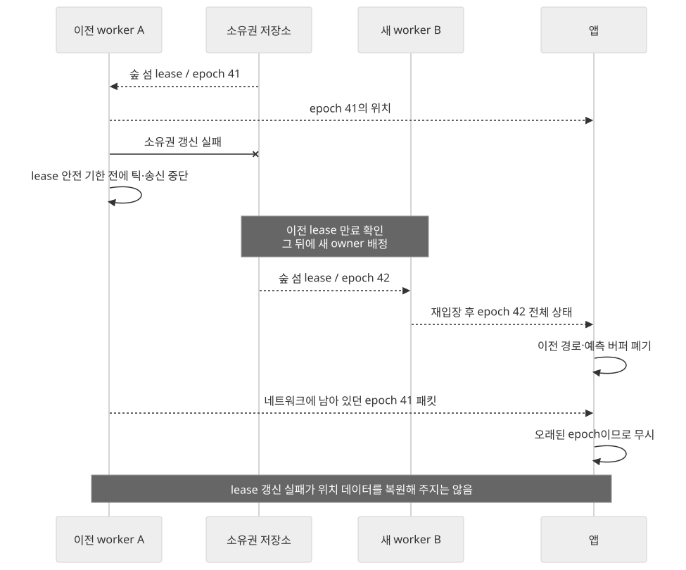

[그림 원본](diagrams/learning/11-ownership.mmd)

- **lease:** 정해진 시간까지만 유효한 방 소유권. 갱신하지 못한 worker는 계속 틱을 실행하면 안 된다.
- **epoch:** 소유자가 바뀔 때 달라지는 세대 번호. 늦게 도착한 이전 서버의 패킷을 구분한다.
- **fencing:** 오래된 권한으로 들어오는 작업을 세대 번호 등으로 거부하는 장치.

“잠깐 연결이 끊겼다가 옛 서버가 살아 돌아옴”까지 생각해야 한다. 새 worker가 시작했는데 옛 worker도 계속 좌표를 보내면 사용자마다 서로 다른 서버를 믿을 수 있다. 그래서 이전 owner의 정지 조건, 새 owner의 획득 조건, 클라이언트의 이전 epoch 거부가 함께 필요하다.

현재 제안은 마지막 위치를 영속 저장하지 않으므로 worker 장애 후에는 새 세대의 입구 위치로 재입장한다. 원래 위치를 반드시 복원하려면 별도의 저장·체크포인트 계약이 필요하다. **lease와 epoch만으로 위치 데이터가 복구되는 것은 아니다.** 자세한 장애 흐름은 [데이터 흐름](data-flow.md)에 있다.

## 12. 암호화된 연결과 이동 권한은 별도로 검사한다

암호화는 전송 중 내용을 보호한다. 그러나 유효한 계정의 수정된 앱이 불가능한 목적지나 과도한 명령을 보내는 것까지 자동으로 막지는 않는다.

[그림 원본](diagrams/04-join.mmd)

| 단계 | 검사하는 내용 |
| --- | --- |
| TLS/QUIC 보호 | 서버 인증서 검사, 전송 기밀성·무결성. 주민 자격은 별도 티켓으로 확인 |
| Business 입장 허가 | 로그인, 현재 섬, 활성 소속 |
| worker 티켓 확인 | 해당 사용자·방·epoch·만료·단일 사용 |
| 이동 명령 검증 | 목적지 범위, 맵 버전, 순서, 빈도 |
| 서버 이동 | 서버 속도·충돌·경로로 실제 위치 계산 |
| 취소·만료 | 강퇴·로그아웃·연결 상실 이후 더 이상 이동·구독하지 못하게 종료 |

보호 프로토콜의 근거는 [RFC 9001](https://www.rfc-editor.org/rfc/rfc9001.html), 나머지는 이 프로젝트가 추가하는 애플리케이션 계약이다. “서버가 맵을 갖고 실제 좌표를 계산한다”는 요구가 중요한 이유가 여기에 있다.

## 13. 세 대안을 같은 기준으로 고르기


[그림 원본](diagrams/learning/12-decision.mmd)

아래의 연결 수는 실시간으로 유지하는 연결을 비교한 것이다. 로그인·입장 티켓을 위한 HTTPS 요청은 별도로 존재한다.

| 비교 축 | A: Realtime JVM 통합 | B: Realtime gateway | C: 직접 Java Movement |
| --- | --- | --- | --- |
| 앱 연결 | 기존 연결 활용 | 기존 연결 활용 | 이동 연결 추가 |
| 이동 계산 프로세스 | 채팅과 같음 | 분리 | 분리 |
| 탭의 서버 처리 경로 | Realtime 내부 호출 | Realtime↔worker 중계 | worker 직접 |
| 기존 STOMP만으로 앱 UDP 충족 | 아니오 | 아니오 | QUIC 어댑터 검증 후 가능 |
| 주요 구현 부담 | 같은 JVM의 틱·소유권·큐 | 라우팅·두 구간 큐·취소 전파 | 네이티브 QUIC·공개 면·망 전환 |
| 장애 영향 | 한 프로세스 장애가 둘에 영향 | gateway는 양쪽 앱 통신에 영향 | 이동 프로세스 장애를 별도로 다룰 수 있음 |
| 용량 판단 | JVM·채팅·이동을 함께 측정 | gateway와 worker를 각각 측정 | 이동 worker와 모바일 연결을 측정 |

추가 홉·연결 수·언어 중 하나만으로 성능 우열을 확정할 수 없다. 다음 순서로 증거를 만든다.

1. **요구 확인:** UDP를 이번 단계에서 충족할지, 앱 연결 하나가 필수인지 확인한다. 둘 다 필수라면 현행 STOMP 유지안만으로 결정하지 않는다.
2. **작은 전송 POC:** Java/Netty와 실제 iOS·Android 사이에서 stream·DATAGRAM·망 전환을 검증한다.
3. **같은 부하로 측정:** A* 시간, 틱 지연, GC pause, 큐 길이, 실제 송신량, 배터리를 기록한다.
4. **실패 지점에 대응:** A*가 느리면 탐색을, 큐가 쌓이면 전달을, 네이티브 호환이 안 되면 전송 후보를 수정한다. 병목 근거 없이 언어부터 교체하지 않는다.

### 설계 문서로 돌아가기

- 큰 구조와 추천 이유: [architecture.md](architecture.md)
- 좌표·경로·틱의 실제 계약: [high-level-design.md](high-level-design.md)
- 패킷·암호화·순서 처리: [protocol.md](protocol.md)
- 요구사항과 구현 검증: [prd.md](prd.md), [validation.md](validation.md)
- 공식 자료·현재 코드·오해 점검: [learning-sources.md](learning-sources.md)

이 학습 문서는 선택을 이해하기 위한 설명이다. 100×100의 의미, 라이브러리 호환, 성능 수치, 직접 공개 면의 승인과 제품 정책은 기존 문서의 미확정 항목으로 유지한다.
