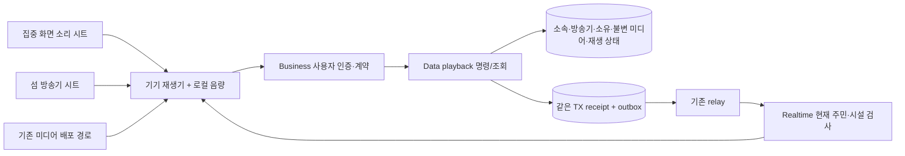
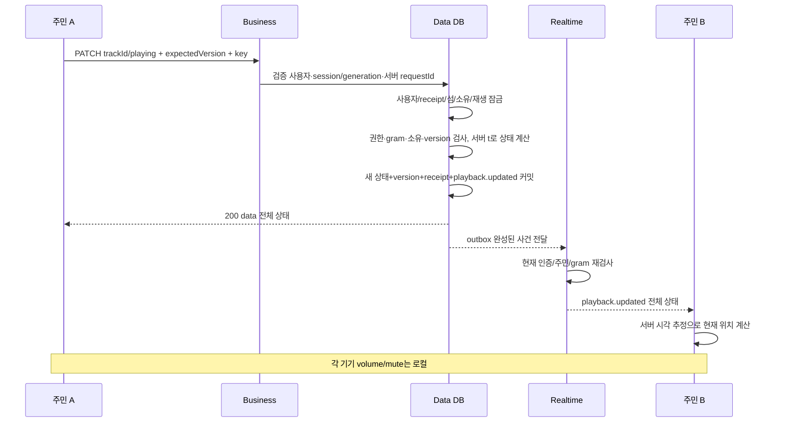

# 공용 음악 아키텍처와 흐름

방송기는 음악 파일을 실시간으로 중계하는 서버가 아니라 “어떤 곡을 몇 초부터 재생할지” 적어 둔 공용 메모다. 앱들은 같은 메모와 서버 시계를 보고 각자 재생한다. 내 휴대폰 음량을 줄여도 공용 메모는 바뀌지 않는다.

미디어 배포 URL·CDN 신설은 이 두 계약에서 정하지 않는다. 입력의 trackId는 기존 상점 자산과 연결한 서버 ID이며 클라이언트가 전송한 임의 파일 링크가 아니다. 오디오 바이트가 STOMP를 통과하지 않는다.

동시에 다른 주민이 이전 버전으로 바꾸면409를 받는다. 앱은 새 상태를 보여주고 사용자가 여전히 바꾸려 할 때 새 버전·새 키로 명령을 보낸다. 서버가 충돌한 명령을 최신 버전으로 자동 덮어쓰지 않는다.

입장 시 먼저 구독·버퍼링하고 GET 스냅샷을 받아 그 버전보다 큰 사건만 적용한다. 소켓 재연결·버전 공백·지원하지 않는 schemaVersion이면 GET으로 정본을 복구한다. GET 자체는 알림을 만들지 않는다.

공인 `/islands/**` 노출은 [건설 HLD의 공인 경로 선행 조건](../island-construction/high-level-design.md#공인-경로와-활성화-선행-조건)을 공유한다. PR744 nginx/인증 통합과 실제 공인 GET/PATCH 검증 전1779를 활성화하지 않는다.
