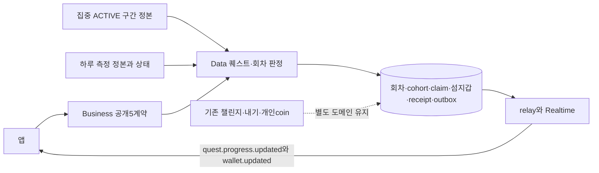
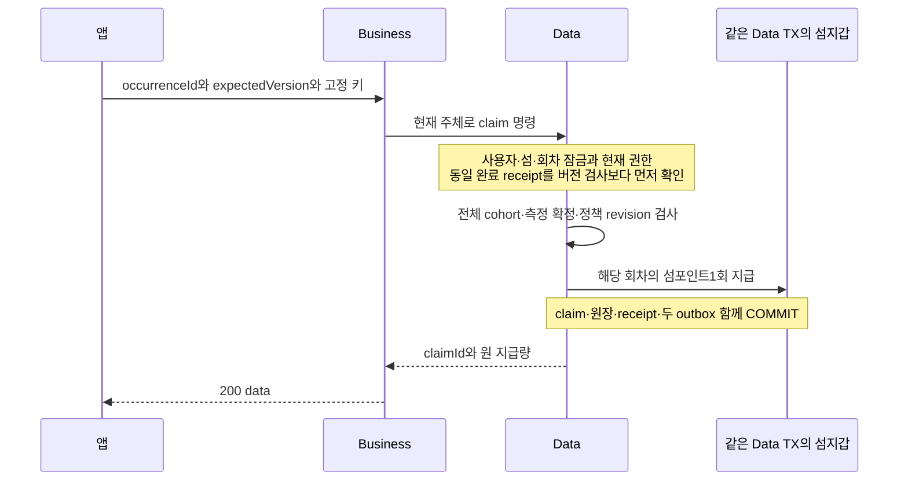

# 섬 퀘스트 — HLD

[정책](policy.md) · [상세 설계](low-level-design.md)

퀘스트는 섬 주민들이 함께 채우는 목표표다. 누가 대상인지와 어느 날의 목표인지를 먼저 고정해야 모두 달성했는지 판단할 수 있다. 보상을 받는 버튼은 판단 결과를 전달할 뿐이고, Data가 장부를 잠근 뒤 섬 지갑에 한 번만 더한다.

점선은 테이블/정산 공유가 아니라 구분해야 할 기존 도메인을 뜻한다. 새 퀘스트가 내기 stake/payout이나 결과 모달 claimDisplay를 호출하는 흐름은 없다.

오전의 screen 사용량이 작아도 하루 목표 달성은 확정되지 않는다. 진행률 표시와 지급 가능 여부는 서로 다른 계산이다. 모든 주민 목록을 한 번에 앱으로 보내지 않아도 Data는 전체 cohort를 판단해야 한다. 화면 첫 페이지에 보이는 주민만으로 결론내리지 않는다.

집중의 pause는 누적 ACTIVE 초를 멈춘다. 기존 start/end 차이나 화면 timer를 퀘스트 원장에 다시 쓰지 않는다. 같은 집중 완료를 재수신해도 이미 반영한 source ID/version으로 중복을 제거하고 개인 coin/통계 완료 함수를 재호출하지 않는다.

구현 순서: cohort·반복/수정·측정/마감·권한·보상 결정 → 집중/하루 측정 정본 → 회차 snapshot/판정 → 섬지갑 원자 claim → 내구 이벤트 →5개API/경합 검증. 정책 미답인 현재는 이 흐름을 운영 활성화하지 않는다.
