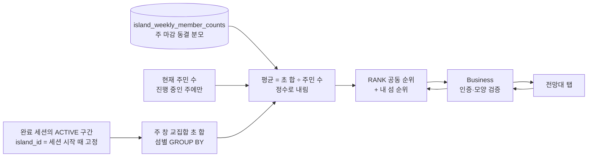
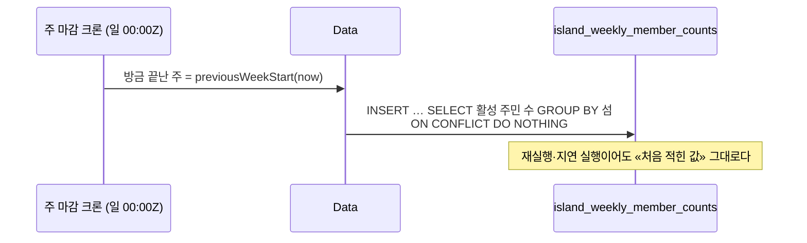

# 주간 랭킹 아키텍처·데이터 흐름

섬 간 주간 랭킹은 **한 관측 시점에서 분자와 분모를 함께 읽어** 순위를 만든다. 분자(그 섬에서 집중한 시간)는
집중 정본에서 그때그때 집계하고, 분모(그 섬 전체 주민 수)는 **주가 끝난 시점에 동결한 값**을 읽는다.

## 왜 분모만 동결하나

분자의 정본은 `focus_session_details`·`focus_session_intervals` 이고 그 표는 주가 지나도 사라지지 않는다 —
언제든 같은 창으로 다시 합칠 수 있다. 복제하면 오히려 정본과 어긋날 자리를 만든다.

분모는 반대다. `group_members` 는 (user, group) **한 행**이고 `left_at` 이 없어서 「그 주에 몇 명이었나」가
어디에도 남지 않는다. 동결하지 않으면 **주민을 내보내는 것만으로 지난 주 평균이 오른다** — 강퇴로 순위를
조작할 수 있다. 그래서 주 마감 배치가 그 시점 인원을 한 번 적고(`island_weekly_member_counts`, migration V85),
그 뒤 누가 나가든 지난 주 순위는 움직이지 않는다.

동결 행이 없는 끝난 주는 그 섬이 랭킹에서 **빠진다**. 「없으면 지금 인원으로」 라는 대체 경로를 두면 동결이
막으려던 조작이 그대로 살아나므로, 조용히 틀린 순위 대신 비어 있는 순위를 택한다.

## 왜 snapshot 저장소가 없나

종전 설계는 불변 snapshot·사용자 역색인·중앙 탈퇴와의 공통 lifecycle 잠금을 요구했다. 그 장치는 전부
**「표에 복사된 타인의 개인정보」**를 지키려는 것이었다. 섬 간 랭킹 응답에는 섬 이름과 평균 초밖에 없다 —
사용자 이름도, catColor 도, 개인 점수도 없다. 2026-09-19 결정 RC-P12-적용이 회관 기록에서 같은 판단을 내렸다:
「복사본이 없으면 필요 없다」.

대신 **페이지를 만들지 않는다**. 움직이는 집계에 keyset 을 붙이면 페이지 사이에 행이 빠지거나 겹치는데,
상위 N 개만 한 번에 주고 그 아래는 `myRank` 로 알려 주면 그 문제 자체가 없다. 분자·분모는 한 REPEATABLE READ
트랜잭션에서 함께 읽으므로 「목록의 1위와 내 순위가 서로 다른 시점」도 생기지 않는다.

## 주 경계

주는 **UTC 일요일 00:00Z 포함 ~ 다음 일요일 00:00Z 제외**다. 요일은 기획 정본(「주간 랭킹은 매주 일요일 00시에
초기화한다」), 존은 결정 D8 의 UTC 축에서 온다 — 섬 퀘스트 Q-6·회관 기록 RC-축·집중 적립 D5-적립이 모두 같은
선택을 했다. 1.x 리그의 KST 월요일 축(`LeagueWeek`)은 살아 있는 정산 축이라 건드리지 않고, 신규 축만
`RankingWeek` 에 둔다.

주 식별자는 ISO `YYYY-Www` 가 **아니다**. ISO 주차는 월요일 시작이 정의의 일부라, 시작 요일만 일요일로 바꾸고
이름을 그대로 두면 같은 문자열이 다른 7일을 뜻하게 된다. 주 시작일(`YYYY-MM-DD` 인 UTC 일요일)은 자기 자신이
경계를 말한다.

랭킹 GET 은 읽기 응답 외의 경제 효과가 0이다 — 지갑·보상 원장을 호출하지 않고 새 실시간 사건도 만들지 않는다.
