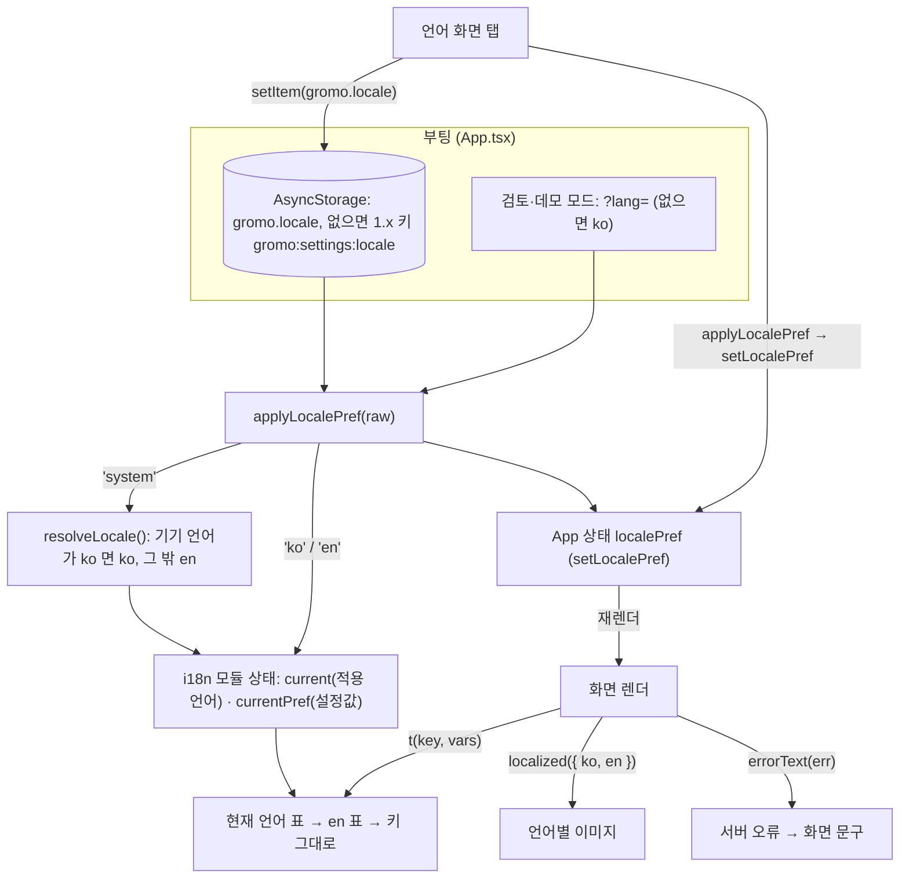
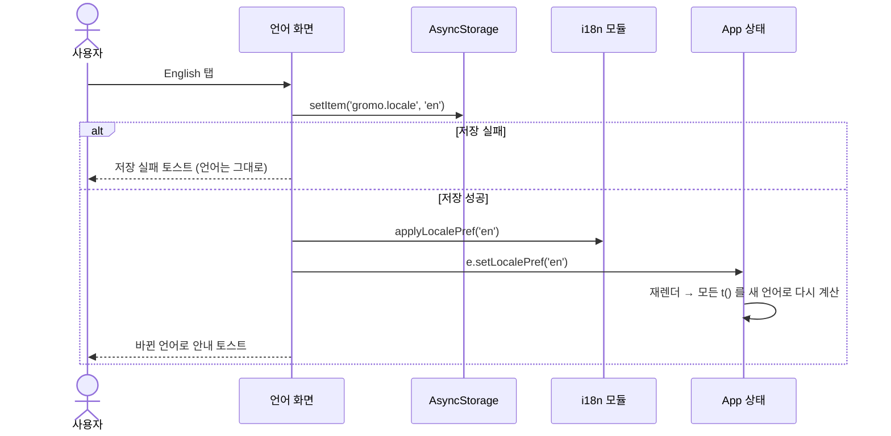

# 다국어(i18n·l10n) — 고수준 설계

> 대상: `app/app-dev`(활성 2.0 앱) · 에픽 GROMO-2235 · 기준 2026-10-09
>
> 문구·이미지를 **추가하는 규칙**의 정본은 [`app/app-dev/README.md` 「문구·이미지 추가 규칙」](../../../../app/app-dev/README.md)이다.
> 이 문서는 시스템이 **왜 이렇게 생겼고 어떻게 이어져 있는지**를 설명한다.

## 1. 용어 — i18n 과 l10n

| 용어 | 뜻 | 이 앱에서 |
| --- | --- | --- |
| **i18n** (internationalization, 국제화) | 앱이 여러 언어를 **받아들일 수 있게 만드는 공학**. 문구를 코드 밖 키로 빼고, 기기 언어를 판정하고, 복수형·숫자·날짜·이미지를 언어별로 고르는 장치를 둔다. | `src/i18n/`, 앱 설정의 언어 화면, 서버 오류 문구 변환, 언어별 이미지 장치, 테스트, README 규칙 |
| **l10n** (localization, 현지화) | 그 장치 위에 **특정 언어의 내용물을 채우고 맞추는 작업**. 번역, 그 언어용 이미지, 길어진 문장의 레이아웃 점검. | `en.json` 의 값, 영문 «READY» 도장, 영어가 길어져 잘리는 자리 점검 |

한 줄로: **i18n 은 그릇, l10n 은 내용물.** 목표는 언어를 하나 더 붙일 때 코드 구조는 그대로 두고 로케일 JSON(과 언어별 이미지)만 늘리면 되는 상태다.
(이름은 첫 글자와 끝 글자 사이 글자 수다 — i + 18글자 + n, l + 10글자 + n.)

## 2. 현재 범위

- **언어**: `ko`(원문·정본)와 `en`(기계 번역, 사람 검수 없음). 기기 언어가 한국어면 ko, 그 밖(일본어·중국어, 판정 불가 포함)은 en.
- **영어가 적용된 화면**
  - 앱 설치 → 섬 도착까지의 온보딩 전체: 로그인, 캐릭터, 첫 섬 선택, 초대 코드, 섬 만들기·참여·승인 대기, 첫 항해, 몽돌 첫 안내
  - 몽돌 튜토리얼이 지나가는 집중 흐름 전체: 집중 준비·할 일 입력·집중·휴식·종료 확인·결과
  - 홈 랜딩, 계정(내 뗏목·프로필·탈퇴·게스트 전환·차단 목록), 앱 설정(언어 화면 포함)
- **아직 한국어인 화면**(GROMO-1840): 건물 내부, 펠리컨·강아지 안내, 일반 집중 결과 뒤 퀘스트 보상 모달, 방문·관전, 스크린타임 권한 시트, 소셜, 네이티브 문자열.

## 3. 구성 요소

| 위치 | 역할 |
| --- | --- |
| `src/i18n/index.ts` | 언어 상태(적용 언어·설정값), `t()`, 언어 판정·적용, 서버 오류 문구 변환, 언어별 값 선택 |
| `src/i18n/format.ts` | 시간·숫자·날짜 서식(`localeTag`·`formatDuration`·`formatNumber`·`formatDate`) |
| `src/i18n/locales/ko.json`·`en.json` | 문구 표. 네임스페이스: `common` `errors` `time` `settings` `login` `account` `character` `onboarding` `app` `building` `color` `track` `focus` `home` `focusFlow` |
| `src/App.tsx` | 부팅 때 저장된 언어를 적용하고, `localePref` 상태를 화면에 넘긴다(`e.localePref`·`e.setLocalePref`) |
| `src/screens/island/Screens.tsx` 의 `route === 'language'` | 앱 설정 → 언어 화면(기기 언어 따름 / 한국어 / English) |
| `src/assets/ota/**` | 언어별 이미지(`<이름>.ko.png`·`<이름>.en.png`) — OTA 업데이트에 실리는 경로 |
| `scripts/gen-localized-stamp.py` | 영문 «READY» 도장 생성기(`npm run gen:localized-stamp`, 검사는 `:check`) |
| `jest.setup.js` | `expo-localization` 을 ko-KR 로 모킹(기존 한국어 단언 테스트의 기준) |
| `app.config.js` | `expo-localization` 플러그인, iOS `CFBundleLocalizations: ['ko', 'en']` |

`src/i18n/index.ts` 의 공개 API:
`SUPPORTED_LOCALES` · `LocalePref`(`'system' | 'ko' | 'en'`) · `LOCALE_NAMES` · `LOCALE_KEY`(`'gromo.locale'`) · `LEGACY_LOCALE_KEY`(`'gromo:settings:locale'`) ·
`resolveLocale` · `isDeviceLocaleSupported` · `getLocale` · `getLocalePref` · `applyLocalePref` · `t` · `errorText` · `errorTextOr` · `localized`.

## 4. 배선

### 4.1 한눈에

### 4.2 부팅

- 모듈을 import 할 때 적용 언어는 `resolveLocale()`(기기 언어)로 시작한다. 저장값을 읽기 전의 첫 프레임은 기기 언어다.
- `App.tsx` 의 부팅 `Promise.all` 이 세션·앱 상태와 함께 `gromo.locale`(없으면 1.x 키)을 읽고, `.then` 첫 줄에서 `setLocalePref(applyLocalePref(raw))` 로 첫 화면 전에 적용한다.
- 웹 검토·데모 모드(`?review=1`·`?demo=1`)는 저장값을 읽지 않고 `?lang=` 값(없으면 ko)으로 고정한다 — 캡처·검증이 브라우저에 남은 값에 따라 달라지지 않게.
- `applyLocalePref` 는 지원 밖 값·`null` 을 `'system'` 으로 정규화한다. `'system'` 은 **호출 시점의 기기 언어를 한 번만** 읽는다 — 앱 실행 중 기기 언어를 바꾸면 콜드 스타트 전까지 반영되지 않는다(iOS 는 언어를 바꾸면 앱이 종료된다. Android 는 남은 일).
- `resolveLocale()` 은 네이티브 호출이 예외를 던지면 ko 를 돌려준다 — `expo-localization` 이 없던 구 빌드가 OTA 로 이 JS 를 받는 경우의 방어선이다.

### 4.3 문구 조회 `t(key, vars)`

- 점 표기 키(예: `'onboarding.chooseIsland.title'`). 현재 언어 표에서 찾고, 없으면 en 표, 둘 다 없으면 **키 문자열**을 돌려준다(빈 화면보다 찾기 쉽다).
- `{{name}}` 치환. 넘기지 않은 변수는 빈 문자열.
- 복수형: 값이 `{ "one": …, "other": … }` 객체면 `vars.count === 1` 일 때 `one`, 아니면 `other`. ko 는 보통 문자열 하나이고 en 만 복수 객체여도 된다. Hermes 에 `Intl.PluralRules` 가 없어 이 단순 규칙을 쓴다.
- 외부 라이브러리(`i18n-js` 등) 없이 수십 줄이다 — ko·en 두 언어의 복수형은 one/other 로 충분하다.

### 4.4 언어 전환 — 리마운트 없이 재렌더

- 같은 값을 다시 누르거나 저장 중에 겹쳐 누르면 무시한다.
- **왜 `key` 리마운트가 아닌가**: 화면 트리(`CurrentScreens`)에 ref 30여 개, STOMP 구독, 입력 중인 초안 상태가 있어 리마운트하면 전부 날아간다. App 이 매 렌더 새 `e` 객체를 넘기고 화면에 `React.memo` 가 없어서, 재렌더만으로 모든 `t()` 가 다시 불린다.
- 그래서 번역 문자열을 `React.memo`·`useMemo` 로 감싸면 언어를 바꿔도 옛 언어가 남는다(`WorldMap.tsx` 의 `doors` 계산 위에 메모이즈 금지 주석이 있다).

### 4.5 서버 오류 문구

서버(business-api·realtime)는 한국어 문구만 준다. 앱이 직접 부르는 서버는 이 둘뿐이고 data-api 는 `/internal` 전용이다.

- `errorText(err)`
  - **ko**: 서버 문구에 한글이 있으면 그대로 쓴다. 한글이 하나도 없는 문구(Spring 기본 «Not Found», Bean Validation 기본 메시지)는 폴백 문구로 바꾼다.
  - **en**: `errors.<code>` 번역을 쓴다(`errors` 에 business-api `ApiErrorCode` 전 코드가 있다). 없으면 다음 분기, 마지막은 `errors.GENERIC`. **서버의 한국어 문구를 영어 사용자에게 보여주지 않는다.**
  - 특수 코드: `CLIENT_STALE_SESSION` 은 빈 문자열(문구 없음). `SLUG_NOT_FOUND`·`INVITATION_EXPIRED`·`STATE_CONFLICT`(`VERSION_CONFLICT` 겸용)·`REQUEST_IN_PROGRESS` 는 앱 문구. `CLIENT_PROVIDER_UNAVAILABLE` 은 앱이 던질 때 `t()` 로 만든 문구를 언어와 무관하게 그대로 쓴다.
- `errorTextOr(err, fallbackKey)` 는 화면마다 폴백 키가 다른 자리용이다. ko 는 서버 원문(한글이 있을 때), en 은 `errorText`, 둘 다 비면 폴백 키.

### 4.6 언어별 이미지

- `<이름>.ko.png`·`<이름>.en.png` 를 **정적 `require` 쌍**으로 두고 렌더할 때 `localized({ ko: require(…), en: require(…) })` 로 고른다(Metro 는 동적 경로 `require` 를 못 한다).
- 새 이미지는 **`src/assets/ota/` 아래**에 둔다. `app.config.js` 의 `updates.assetPatternsToBeBundled: ['src/assets/ota/**/*']` 가 이 경로의 에셋만 OTA 업데이트에 싣는다 — 밖에 두면 OTA 로 JS 만 받은 구 바이너리(같은 `runtimeVersion`)에서 이미지를 못 찾는다.
- 의미 있는 이미지는 접근성 라벨도 `t()` 로(예: `common.readyStampA11y`).
- 현재 적용은 건물 내부 «준비 완료» 도장 1건이다. 영문 «READY» 는 스크립트가 결정적으로 생성하고, `--check` 는 디코드한 픽셀로 비교한다(글꼴이 없으면 exit 2 — CI 에는 붙이지 않는 로컬 검사).

### 4.7 서식

- `formatDuration(seconds)`: ko «H시간 M분 / N분», en «Hh Mm / Nm».
- `formatNumber`·`formatDate`: `localeTag()`(`ko-KR`·`en-US`)로 `toLocaleString`·`toLocaleDateString`.

### 4.8 저장 수명

- `gromo.locale` 은 **기기 전역** 설정이다. 로그아웃·탈퇴·계정 전환의 로컬 정리(`removeItem`)에 넣지 않는다(세 경로 모두 테스트로 고정).
- 1.x 키 `gromo:settings:locale` 을 읽기 폴백으로 둔다 — Android 는 1.x 와 2.0 이 같은 패키지라 1.x 에서 고른 언어가 남아 있다. 되써 주지는 않는다.

## 5. 규칙과 함정 — 실제로 겪은 것

1. **모듈 최상위 `t()` 금지.** import 시점 언어로 값이 굳는다. 모듈 상수 표는 읽을 때마다 계산하는 **게터**로 만든다(`buildingNames`·`trackNames`·`legacyDoors`·`constructionPhaseLabels`·딸기 테마 상품).
2. **게터 + 모듈 최상위 스프레드 = 굳음.** `{ ...coords, get label() { … } }` 를 모듈 최상위에서 만들면 Babel `_objectSpread` 가 게터를 import 시점 값으로 복사한다(main 동기화 때 en 테스트 2건이 잡았다 → 좌표를 필드로 적는 헬퍼로 바꿈). 렌더 중의 스프레드는 그 시점 값이라 괜찮다.
3. **함수 기본 인자의 `t()` 는 괜찮지만, 호출부가 리터럴을 넘기면 덮인다**(방문 중 관전 화면의 뗏목 라벨 사례).
4. **`useState` 초기값에 번역 라벨을 넣으면 그 순간 언어로 굳는다**(정원 휠 `capacityPick` — 라우트가 바뀔 때마다 현재 언어로 다시 채워 버틴다. 숫자 상태로 바꾸는 정리는 GROMO-2254).
5. **`App.tsx` 의 `titles` 는 번역하지 않는다.** Datadog RUM 뷰 이름이라 번역하면 대시보드가 언어별로 갈라진다.
6. **화면 파일은 실제 렌더 지점으로 판단한다.** App 은 `CurrentScreens` 를 쓰고 `CurrentScreensContent` 가 arrival·travel·focusSetup·focus·rest·focusResult 등을 먼저 가로챈다. 그래서 `Screens.tsx` 의 같은 이름 분기, `IslandHome.tsx`, `WorldViews.tsx` 의 `RestWorld`·`SceneHero`·`Welcome` 은 렌더되지 않는다 — 번역하지 않았고, `CurrentScreens.routing.test.tsx` 가 가로채기를 고정한다(삭제는 GROMO-2254).
7. **ko 값은 기존 리터럴과 글자까지 같게.** 기존 한국어 단언 테스트가 수정 없이 통과하는 것이 그 증거다.
8. **확인 팁**: iOS 는 로그인 세션이 키체인에 남아 앱을 지우고 다시 깔아도 온보딩이 다시 나오지 않는다 → 로그아웃 후 «게스트로 시작». 웹은 `?review=1&lang=en`.

## 6. 늘리는 법

- **새 문구**: README 「문구·이미지 추가 규칙」을 따른다. 요약하면 ko.json·en.json 에 같은 키(네임스페이스·`{{var}}`·복수형), ko 는 원문 그대로, 화면당 en 스모크 테스트.
- **새 언어**(예: 일본어)
  1. `SUPPORTED_LOCALES`·`LOCALE_NAMES` 에 추가하고 `locales/ja.json` 을 만들어 `tables` 에 등록한다.
  2. `resolveLocale` 의 «ko 가 아니면 en» 을 «지원 목록에 있으면 그 언어, 아니면 en» 으로 바꾼다.
  3. `app.config.js` 의 `CFBundleLocalizations` 에 추가한다(네이티브 빌드 필요).
  4. 언어 화면에 행을 더하고, 키 동치 테스트·로케일 건전성 테스트에 새 언어를 넣고, `errors` 를 번역한다.
  5. `localized()` 의 인자 타입(`Record<SupportedLocale, T>`)이 새 언어 값을 요구하므로, 타입 오류가 언어별 이미지 호출부를 알려 준다.
  6. `localeTag`·`formatDuration` 에 새 언어 분기를 더한다.

## 7. 테스트와 안전망

- `src/i18n/index.test.ts`: ko·en 리프 키와 `{{var}}` 집합 동치, 로케일 파일 건전성(빈 값·복수형 one/other·en 값에 한글 없음·줄바꿈 개수), business-api `ApiErrorCode` 전 코드가 `errors` 에 있는지, `resolveLocale`·`applyLocalePref`·`t`·`errorText` 규칙.
- `src/App.sessionCommands.test.tsx`: 부팅 때 언어 적용(2.0 키 우선·1.x 폴백·읽기 실패는 기기 언어), 로그아웃·탈퇴·계정 전환이 `gromo.locale` 을 지우지 않음.
- 화면별 en 스모크(로그인·언어 화면·홈·온보딩·튜토리얼 대사·할 일 입력 등)와 `CurrentScreens.routing.test.tsx`.
- 서버 `ApiErrorCode` 가 늘면 앱 테스트가 깨진다(의도된 안전장치). 다만 `app-lint.yml` 경로 필터 때문에 서버만 바뀐 PR 에서는 돌지 않는다(GROMO-2253).

## 8. 남은 일

- GROMO-1840: 남은 화면(건물 내부·펠리컨/강아지 안내·퀘스트 보상 모달·방문·스크린타임 권한·소셜)과 네이티브 문자열.
- GROMO-2253: 언어 전환 재렌더·마을 장면 라벨·`?lang=` 부팅 테스트와 CI 경로 필터.
- GROMO-2254: 렌더되지 않는 코드 삭제, 정원 휠 숫자 상태.
- Android 실행 중 기기 언어 변경 반영(`AppState` 복귀 때 다시 적용) — 아직 정하지 않았다.
