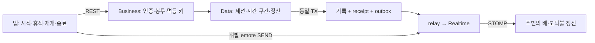

# 집중·휴식 세션 설계 — GROMO-1763

낚시하는 동안만 집중 시간이 늘고 모닥불에서는 멈춘다. 서버는 시작·휴식·재개의 시각을 적어 두었다가
종료할 때 순수 집중 시간을 계산한다. 같은 종료 버튼이 두 번 도착해도 기록과 보상은 한 번만 확정한다.
옆 사람의 배와 모닥불 자리는 처음 한 번 조회하고 이후 실시간 사건으로 갱신한다.

**상태: 구현용 설계 초안. 보상·기여 배분·휴식 채팅 등 제품 결정 대기.** 보상 정책까지 확정됐다는
Jira 완료 주장이나 9개 API 구현 완료 주장이 아니다. 소스 수정·배포·빌드는 포함하지 않는다.
출시에는 기존 live 랭킹/표시와 완료 목록·앱 재계산의 ACTIVE 구간 인식, 완료 reader의 최소 호환 앱/접근 경계
또는 검증된 조회 projection, **신규 비활성 호환본 선행 배포 → rollback 최소 호환
baseline 제한·구 이미지 차단 검증 → 신규 활성화**가 필수다. [LLD §5](low-level-design.md#5-legacy-공존과-전환-gate)에
실제 기존 쿼리·마커 writer·rollback workflow 근거와 전환 순서를 명시한다.
문서 경로는 배치 조정자가 지정한 `docs/prd/focus-rest-session/`다. 티켓 본문의 초기 제안 경로
`docs/prd/focus-session/`과 다르며 동일 GROMO-1763 산출물을 가리킨다.

| 읽을 문서 | 내용 |
| --- | --- |
| [PRD](prd.md) | 목적·9계약 범위·완료 조건·사용자 경험 |
| [정책](policy.md) | 확정 규칙과 미결 결정·출시 조건 |
| [HLD](high-level-design.md) | 아키텍처·수명주기·정산/전달 흐름·기존 구현 비교 |
| [LLD](low-level-design.md) | DTO·원본 예시·DB/잠금·시간 계산·이벤트·검증 |
| [원본 계약](source-contracts.json) | 정본 coverage에서 선택한 9개 항목, 요청·응답 예시 보존 |

근거는 GROMO-1739 첨부 `GROMO-화면별-API-스펙.html`의 v0.3-proposed와 배치
`contract-coverage.json`, `tickets.json`, `decisions.md`다. 원본의 `/v1` 접두어 제거와 emote의
REST→STOMP 변경은 사용자 승인 사항이다. 원본 예시의 `soda`, `focus-1`, 300초/물고기 등의 값은
실제 UUID·운영 가격 정책을 확정하지 않는다.

기준 checkout은 main `529a396`이다. [공통 계약 PR #738](https://github.com/OneOrThree/phone/pull/738),
[이벤트 설계 PR #737](https://github.com/OneOrThree/phone/pull/737),
[Realtime 골격 PR #739](https://github.com/OneOrThree/phone/pull/739)는 별도 선행 작업이며
이 main checkout에 통합됐다고 계산하지 않는다. 해당 PR의 로컬 문서와 1751~1753 구현 작업본을 읽어
계약을 대조했다. 존재하지 않는 main 상대 경로를 만들어 선행 문서가 이미 있다고 표시하지 않는다.

9계약의 구현 분할은 **1764 REST 6종 + 1765 REST 스냅샷 2종·STOMP emote SEND 1종**이다.
SUBSCRIBE 토픽과 내부 제어 계약은 이 9개와 별개이며 원본 66계약의 분모를 늘리지 않는다.

## 문서 검증 기록 (2026-09-12)

원본 HTML SHA-256: `2b56a4553d75863f1c1db50fd1c1f7123dd21ecf99bac4d38959ad945e9f9c30`.
9개 method/path 유일성, coverage 항목 전체 일치, HTML 요청/응답18개 일치를 확인했다.
문서 JSON 코드블록19개를 파싱했고 상대 링크 누락0건·코드 fence 균형·Mermaid5개 블록의 정적 구조를 확인했다.
Mermaid 이미지 렌더링, 애플리케이션 빌드/테스트와 DB migration 실행은 하지 않았다.
