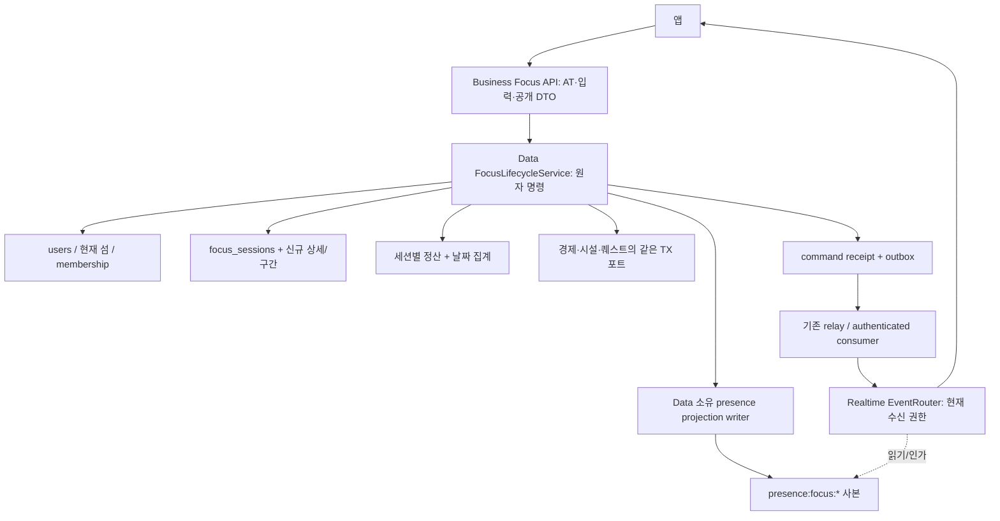
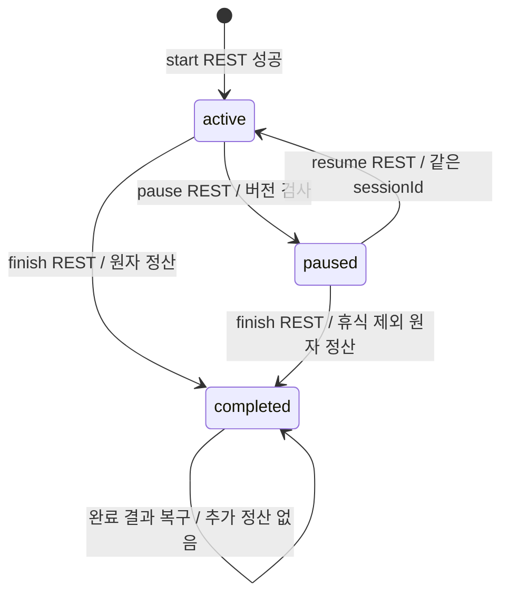
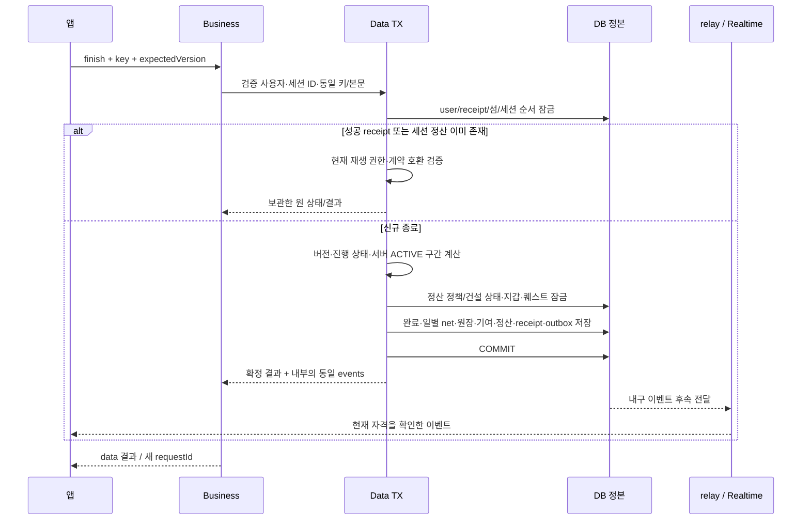

# 집중·휴식 구성 설계

> [PRD](prd.md) · [정책](policy.md) · [상세 계약](low-level-design.md)

## 기존 코드에서 이어받는 것

기준은 main `529a396`의 코드다. 아래 줄 번호는 이 기준점이며 구현 완료 여부를 추정하지 않는다.

| 근거 | 현재 동작 | 새 계약에서의 처리 |
| --- | --- | --- |
| `server/data-api/.../focus/service/FocusService.java:882` | start가 users FOR UPDATE, 클라 시각 순서 검사, 기존 마커 자동 종료 후 새 마커 생성 | 사용자 잠금 재사용. 새 start는 기존 진행을 자동 종료하지 않고409 |
| 같은 파일 `:969` | 조건부 endedAt 갱신 성공자만 통계/코인 지급, 중복은409 | 조건부 전이 재사용, 새 finish는 보관한 정산 결과를 재생 |
| 같은 파일 `:617`, `:1222` | KST 자정 분할, 날짜별 순수 초 저장/일 집계 | 날짜 축·총합 보존 재사용. 신규는 서버 ACTIVE 구간으로 정확히 분할 |
| 같은 파일 `:107`, `:523`, `:565` | 60초당 코인·12h 보상 캡·focus:{id}:reward 원장키 | 기존 정책 사실. fish300초 정책으로 간주하거나 지급 helper 그대로 호출하지 않음 |
| `focus/repository/domain/FocusSession.java` | user/태그/startedAt/endedAt/net 날짜분포. islandId·목표·sessionVersion·PAUSED 구간 없음 | 새 sidecar를 추가하고 기존 PK/통계 원본 식별자를 공유 |
| `focus/repository/domain/FocusSessionStatus.java` | ACTIVE/COMPLETED/CANCELED/AUTO_CLOSED, 종료 기록 필터에 역사적 호환 있음 | enum 일괄 개명 금지. 새 lifecycle을 별도 상세 행에서 해석 |
| `V47__focus_sessions_single_live_marker.sql:75` | 열린 마커 인덱스는 **비고유**, 롤백 호환 때문에 UNIQUE 연기 | 새/구 writer의 user 배타 잠금이 필수. UNIQUE가 이미 있다는 전제로 설계하지 않음 |
| `common/port/RedisFocusPresence.java:83`, `:178`, `:258` | Data가 presence:focus:*를 commit 뒤 쓰고 세션 토큰으로 해제 | Data 단일 소유 유지. 새 상태와 내구 갱신/복구를 통합 |
| `FocusPresenceReconciler`, `FocusSessionOrphanScheduler` | 기존 열린 마커 복구와12h 고아 정리 | v0.3 행을 기존 자동정리로 잃지 않도록 protocol 분기 필수 |

기존 통계는 저장한 net 분포에서 방해를 다시 빼지 않는다. 새 휴식을 `totalDistractionSeconds`로 다시
차감하거나 종료일 하나로 몰면 시간과 통계가 어긋난다. legacy 오프라인 업로드 계약도 서버 시각 REST와 다르다.

## 책임과 저장 구조

`FocusLifecycleService` 등의 신규 명칭은 구현 설계이며 현재 존재하는 클래스라는 뜻이 아니다.
도메인 정본은 Data다. Business가 Redis 시간으로 정산하거나 별도 DB에 receipt를 저장하지 않는다.
Realtime은 상태를 쓰지 않고 emote의 휘발 전송과 현재 수신 권한 검사를 담당한다.

새 `focus_session_details`는 기존 focus_sessions의 PK를 참조하는 1:1 상세다. 섬 귀속, subject,
targetMinutes, active/paused/completed, 낙관 version, 정책 revision을 소유한다.
`focus_session_intervals`는 ACTIVE/REST의 실제 서버 시간 구간이고 `focus_settlements`는 세션당 한 결과다.
기본 행은 진행 중 endedAt=null/ACTIVE, 완료 시 COMPLETED로 유지한다. 상세의 paused를 기존 ACTIVE enum과
동일한 '실제 집중 중'으로 해석하지 않는다. 기존 테이블의 clientStartedAt/업로드 방해 초는 새 입력의 정본이 아니다.

이 구조를 활성화하기 전 legacy start/save/end/cancel/orphan와 조회가 새 상세 행을 인지해야 한다.
새 시작은 기존 legacy 진행 마커가 있으면409, legacy 시작은 v0.3 진행 세션을 회전시키지 않고409다.
legacy 오프라인 완료 업로드가 v0.3 구간과 겹쳐 시간을/재화를 재계상하는 문제는 LLD의 전환 gate에서 막는다.

## 수명주기

목표 시간 도달, WebSocket 끊김, 모닥불 관람, 화면 종료는 상태 전이가 아니다.
FR-D03/06의 강퇴·orphan 전이는 아직 위 그림에 운영 규칙으로 넣지 않았다.
active·paused는 모두 현재 섬 전환과 두 번째 세션 시작을 막는다.

## 종료와 보상 흐름

Business가 HTTP 성공 뒤 시간을 새로 계산해 사건을 만들지 않는다. 같은 명령이 focus/rest/wallet/quest/시설
사건을 만들면 각각 별도 eventId의 완성 봉투를 같은 TX에 보관한다. events는 내부 결과이며 공개 finish DTO에
추가하지 않는다. 다중 지갑을 원격 호출로 순서대로 갱신하면 부분 지급이 생기므로 같은 Data TX 포트를 사용한다.

## 실시간과 호환 경계

PR737의 7필드 봉투, PR739의 `/ws/realtime`·기존 `/ws/chat` 호환 및 목적지 guard 골격을 선행한다.
기준 main에는 `server/chat`이 있고 새14종 producer가 모두 동작하지 않는다.
1755 골격의 신규 SUBSCRIBE/SEND/outbound 비활성 거절을 1765에서 단계별로 해제한다.
스냅샷·세부 payload 검증·수신 권한 철회가 준비되기 전 이름만 등록해서 허용하지 않는다.

focus/rest의 상태는 snapshot+사용자×섬 지속 watermark로 복구한다. emote는 DB/outbox/히스토리 없이
현재 active 자격과 만료만 검증한다. Redis Pub/Sub를 내구 메시지 스트림으로 설명하지 않는다.
소속 상실은 실제 구독 해지 또는 소켓 종료로 반영하고 각 프레임 송신 직전에 다시 인가한다.
이미 TCP에 내보낸 프레임까지 회수한다고 약속하지 않는다.

관측은 requestId/commandId/eventId, 전이 결과, 시간 계산·정산 단계, 충돌/재생, DB 대기, outbox 지연,
presence 복구와 snapshot 재조회 이유를 남긴다. subject/이름·토큰·원문 emote payload를 일반 로그에 복사하지 않는다.
