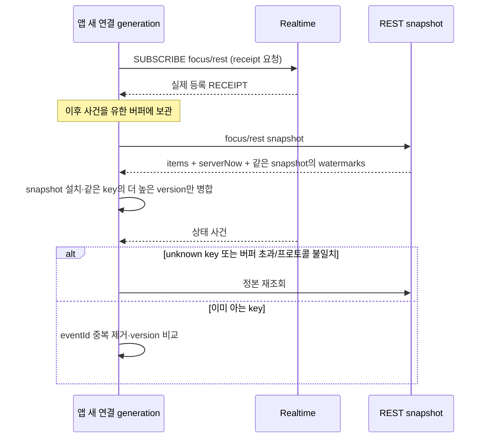

# 집중·휴식 상세 계약

> GROMO-1763 · [정책](policy.md) · [구성](high-level-design.md) · [원본9계약](source-contracts.json)
> 아래 테이블/필드는 후속 구현 설계다. 현재 DB·API에 이미 있다는 뜻이 아니다.

## 1. 공통 타입과 공개 범위

`Id`는 UUID 문자열이다. 원본 `soda`, `focus-1`, `minji`는 설명용 ID라 요청 validator 예제로 쓰지 않는다.
`Instant`는 UTC ISO-8601, `Version`은 0~9007199254740991 정수(발행 세션은1부터), `Seconds`는
0 이상의 안전 정수다. `targetMinutes`, expectedVersion은 JSON 정수 타입을 변환 전에 검사한다.
소수/문자열을 Long으로 강제 변환해 통과시키지 않는다. 버전 누락/타입 오류400, 음수/초과422다.

| DTO | 공개 필드 |
| --- | --- |
| `FocusSessionView` | id:Id, islandId:Id, subject:string, targetMinutes:integer, status:active\|paused, activeSeconds:Seconds, serverNow:Instant, startedAt:Instant, restStartedAt:Instant?, version:Version |
| `FocusFinishView` | recordId:Id, islandId:Id, subject:string, targetMinutes:integer, activeSeconds:Seconds, goalAchieved:boolean, earnedFish:integer, allocation:{personalFishAdded:integer,constructionFishAdded:integer}, completedAt:Instant, questProgress:[{id:Id,myRate:number}] |
| `FocusMember` | userId:Id, name:string, catColor:catalogKey, appearance:{clothes:catalogKey?,decor:catalogKey?,hull:catalogKey,position:front\|back}, sessionId:Id, subject:string, activeSeconds:Seconds, status:active\|paused |
| `RestMember` | userId:Id, name:string, catColor:catalogKey, restSeat:integer, restStartedAt:Instant |
| `FocusSummary` | date:KST date, completedSeconds:Seconds, currentSessionSecondsToday:Seconds, totalSeconds:Seconds, serverNow:Instant |

카탈로그 값은 외양 설계의 정본을 참조하고 여기서 새 항목을 지급하거나 임의 enum을 확정하지 않는다.

nullable 필드는 키를 유지한다. 현재 세션이 없으면 data=null, 목록은 items=[]다.
FocusFinishView의 myRate 범위·퀘스트 포함 기준은 1772/1773의 승인 계약을 사용한다. 원본83을 고정값으로
반환하거나 계산 불가를 무조건0으로 바꾸지 않는다. subject 원문/이름/외양 이외의 계정정보·토큰·타인 지갑은
공개 DTO에 없다. 완료 기록의 통계 태그와 subject는 다른 개념이며 subject 문자열로 기존 태그를 자동 생성하지 않는다.

## 2. 9계약의 동작

### start — POST /focus-sessions, 201

입력은 `{islandId, subject, targetMinutes}`. Idempotency-Key 필수, expectedVersion 없음.
Data 사용자 잠금 아래 계정 활성, 현재 섬 일치, 활성 membership, 미종료 세션 부재를 검증한다.
같은 키의 성공 재생은 원201/같은 id·startedAt·serverNow·version을 유지한다. 새로운 키로 이미 진행 중이면
409 STATE_CONFLICT다. 사전 GET가 null이었다고 새 세션을 무조건 만들지 않는다.
상세/ACTIVE 구간·세션 version1·주민 투영·outbox를 한 TX에 만든다. 보상/기여는 아직 지급하지 않는다.
subject/목표 허용 범위는 FR-D06, reward policy revision은 FR-D01 확정 설정을 시작 시 고정한다.
정책 없는 세션을 시작시켰다가 finish에서 영구 막는 배포를 하지 않는다.

### session — GET /focus-sessions/current, 200

입력 없음, 본인만 조회한다. 단일 DB snapshot의 현재 세션과 상세·구간을 읽고 serverNow 시점 순수 초를 반환한다.
paused이면 restStartedAt 유지/activeSeconds 고정, active이면 restStartedAt=null.
completed를 current로 반환하지 않고 data=null이다. 다기기에서 같은 세션으로 복구한다.
FR-D03이 미결인 소속 상실 중간 상태를 정상으로 만들지 않는다. 정책 확정 후 소속 상실 복구 DTO는 별도 개정한다.

### pause — POST /focus-sessions/{sessionId}/pause, 200

입력 `{expectedVersion}`와 키 필수. 본인·소속·active·version을 검사한다. ACTIVE 열린 구간을 서버 시각 t에서
닫고 REST 구간을 열며, paused/restStartedAt=t와 sessionVersion+1을 저장한다.
restSeat는 섬의 허용 주민 수에 맞는 서버 자리1..capacity 중 빈 최소 번호를 같은 섬 잠금 아래 배정하는
기술 선택이다. paused 동안 유지하며 같은 섬의 두 paused 사용자에게 같은 자리를 주지 않는다.
자리 배치는 로컬 연출이고 자리 선택/예약 API를 추가하지 않는다. 같은 키는 원 결과, 다른 키의 paused 재요청은409다.

### resume — POST /focus-sessions/{sessionId}/resume, 200

입력 `{expectedVersion}`와 키 필수. 본인·소속·paused·version을 검사한다. REST 구간을 t에서 닫고 같은
sessionId의 ACTIVE 구간을 열며 restStartedAt/restSeat를 null로 지운다. sessionVersion+1.
REST 시간은 activeSeconds에 더하지 않는다. completed/active에 대한 신규 resume는409다.

### finish — POST /focus-sessions/{sessionId}/finish, 200

입력 `{expectedVersion}`와 키 필수. active/paused에서 가능하다. 새 종료만 version을 검사하고 열린 구간을
닫은 뒤 정산한다. endedAt/completedAt, 순수초·날짜분포·goalAchieved·정산 정책 revision·allocation·
원래 questProgress와 내부 events를 세션별 정산에 고정한다.

같은 키/같은 본문은 공통 receipt를 재생한다. **이미 완료된 같은 세션을 새 키로 finish해도**, 계정 활성·본인·
현재 결과 열람 권한을 검사한 후 세션별 정산의 같은 결과를 반환하는 도메인 복구 계약을 채택한다.
이때 과거 expectedVersion을 현재와 비교해 원 성공을 실패로 바꾸지 않고 새 원장·통계·이벤트를 만들지 않는다.
공통 receipt에 같은 키의 다른 본문이 있으면 이 도메인 복구보다 먼저409다. 정산이 없는데 completed인 새 행은
자동 재지급하지 않고 정합성 오류로 운영 복구한다. legacy 완료행은 새 finish 대상이 아니며 결과를 추정하지 않는다.

receipt·정산의 원 결과 전체는 현재 섬 데이터 열람 권한이 있을 때만 공개한다. 소속 상실 뒤 같은 키라는
이유로 questProgress/섬 정보가 든 결과를 그대로 재생하지 않는다. 본인 완료 증거가 필요한 FR-D03은 관리 정책과
공개 축소 DTO를 먼저 확정한다. 비활성 계정은404, 타인 세션은403, 없는 세션은404다.

### home-summary — GET /me/focus-summary, 200

query `{date?,timezone?}`. [KST 규약](policy.md)을 적용한다. completedSeconds는 해당 KST 날짜의 완료 net,
currentSessionSecondsToday는 진행 세션 ACTIVE 구간과 요청 날짜의 교집합이다. totalSeconds는 둘의 합이다.
종료 TX와 겹친 GET가 '완료 집계 갱신 후 + 아직 진행 중'을 동시에 읽어 이중 계산하지 않도록
완료 집계·진행 상태·구간을 같은 읽기 snapshot(단일 SELECT 또는 read-only REPEATABLE READ)에서 읽는다.
캐시된 완료 값과 실시간 진행 값을 따로 더하지 않는다. 소속에 관계없는 본인 개인 요약이며 과거 기록은
기존 KST net 집계와 연결하되 새 종료의 가산은 정확히 한 번만 수행한다.

### focus-group / rest-members — GET /islands/{islandId}/focus-members, /rest-members, 200

활성 주민만 조회하며 비소속은403이다. 방문자 공개 DTO에 이 목록을 넣지 않는다. focus 목록은 진행 세션
active/paused를 포함하고 completed는 제거한다. rest 목록은 paused만 포함한다. 과목·이름·외양을 batch로
읽어 N+1을 피한다. activeSeconds는 snapshot의 같은 serverNow anchor로 계산한다.

원본 `{items,serverNow}`에 PR737의 **watermarks**를 추가한다. 각 focus row에는 표시 외양/과목에 필요한
현재 공개 DTO가 있지만 이벤트는 이 전체 프로필을 모두 포함하지 않으므로 미지의 사용자를 이벤트만으로 생성하지 않는다.
watermark `{projection:"focus.member"|"rest.member",islandId,aggregateId:userId,version}`는 해당 상태와
같은 DB snapshot에서 읽는다. 종료/비휴식 tombstone도 version을 보존하되 무한 과거 사용자 목록을 공개하지 않는다.
미지 key는 정본 재조회 규칙으로 복구한다. 원본 RestMember의 sessionId 필드를 몰래 추가하지 않으며
휴식 시간 표시는 restStartedAt와 serverNow를 사용한다.

### emote — STOMP SEND /app/islands/{islandId}/focus/emotes

SEND body는 원본 `{sessionId,type}`다. type은 hello/cheer/sleepy/laugh/hearts만 허용한다.
서버가 principal의 활성·소속·해당 섬 **본인 active sessionId**를 검증한다. userId·expiresAt·destination은
클라이언트가 지정할 수 없다. paused/완료/다른 사용자 세션/다른 섬이면 전송하지 않는다.

Realtime가 서버 eventId·occurredAt·expiresAt을 만들고 `/topic/islands/{islandId}/emotes`로 방송한다.
HTTP 응답이 아니므로 원본의 `{data:{eventId,...}}`200을 별도 REST 성공으로 구현하지 않는다.
아래 부록에 원본 JSON을 보존하고, 채택 wire는 §6의 7필드 focus.emote 봉투로 명시 변경한다.
STOMP RECEIPT는 프로토콜 수신 확인이며 모든 사용자에게 표시됐다는 보증이 아니다.
실패는 기존 발신 세션용 `/user/queue/errors` adapter로 보고한다. 잘못된 type422 의미·집중 아님409·
과다429를 구분하되 HTTP response가 아니라 typed 오류 의미다. 신규 타입 검증·오류 adapter는1765 구현 범위다.

emote는 영속 Idempotency-Key/receipt 대상이 아니고 DB/outbox에 저장하지 않는다. eventId는 내부 fanout 중복에
대해서만 dedup한다. 앱이 SEND를 두 번 보내면 별도 사건일 수 있으므로 자동 재전송하지 않는다.
표시 TTL/빈도는 FR-D05가 결정되기 전 비활성이고 목업3초를 기본값으로 넣지 않는다.

## 3. 저장·잠금·정산

| 논리 저장 | 데이터/제약 | 역할 |
| --- | --- | --- |
| 기존 focus_sessions | PK·user·startedAt·endedAt·COMPLETED·focus_seconds_by_date | legacy와 통계 식별자 공유. 상세가 있는 행은 v0.3 프로토콜 |
| 신규 focus_session_details | PK/FK session_id, user_id, island_id, membership_epoch_at_start, subject, target_minutes, lifecycle, version, last_transition_at, policy_revision | 소속 귀속 불변. user당 active/paused 부분 UNIQUE, 휴식 자리의 활성 범위 UNIQUE |
| 신규 focus_session_intervals | session_id, ordinal, kind ACTIVE/REST, started_at, ended_at nullable | ordinal 유일, 열린 구간 최대1, 역전/겹침 금지. 명령 idempotency와 같은 TX |
| 신규 focus_settlements | session_id UNIQUE, contract_version, policy_revision, HTTP 결과·원 events·총시간·원장 근거 | 다른 key의 완료 복구·중복 지급 방어. 개인정보 파기 정책 적용 |
| 신규 주민 projection | (projection,island_id,user_id) UNIQUE, version, 현재 session_id/상태 | 세션 교체·재가입에도 version 초기화 금지, focus/rest 별도 축 |
| 기존 command_idempotency | PublicCommandService의 사용자/operation/key scope, fingerprint, contractVersion 있는 결과 | TTL 자동 삭제 없음. 미지원 버전409 STATE_CONFLICT, 재실행 금지 |
| 기존 일별 net + 경제/시설/퀘스트 정본 | 세션별 반영 유일성, 지갑 owner/currency 잠금, 건설 cap 조건부 갱신 | 정산과 함께 커밋. 수동 구매 권한과 자동 집중 기여 정책 분리 |

물리 컬럼명·Flyway 번호·DBML은 구현 조정자가 최종 할당한다. 제약은 행이 없는 경합의 마지막 방어이며
그 제약 오류를 catch한 같은 JPA TX에서 재조회를 계속하지 않는다. 기존 V47은 부분 UNIQUE가 아니다.

잠금 순서는 참여 writer 전체에서 합의한 한 순서로 고정한다: 영향 사용자 UUID 정렬 배타 잠금 → 공통 receipt
선점 → 섬/현재 membership·context → focus 상세/구간 → 관련 회차·시설 정산 자원 → 지갑(owner/type/id/currency
정렬) → 일 집계 → projection/outbox 버전. 기존 내기 정산의 **회차→지갑** 순서를 뒤집지 않는다.
계정 탈퇴·가입/현재 섬 변경·host 강퇴가 여러 사용자를 다루면 처음부터 정렬한 사용자를 잠그고
group를 잡은 뒤 상대 user를 역순으로 잡지 않는다. 늦게 영향 사용자가 발견되면 TX를 다시 시작한다.

이 순서는 새로운 외부 서비스 락이 아니다. 하나의 Data TX에서 유지하며 Business는 DB 락을 잡지 않는다.
강퇴의 승인 정책은 미결이어도 강퇴↔finish, start↔switch, pause↔finish가 같은 사용자·세션 경계에 참여해야 한다.
강퇴가 먼저 승리한 경우와 finish가 먼저 승리한 경우의 지급/기여는 FR-D03 결정표로 검증한다.
단순히 membership을 삭제한 뒤 진행 세션과 outbox를 따로 처리하지 않는다.

정산 정책은 시작 시 revision을 고정해 운영 설정 변경이 진행 세션의 지급률을 바꾸지 않게 하는 기술 선택이다.
시설 완료 instant/상태는 FR-D02 선택에 따라 해석하지만 같은 TX에서 잠금·정책 revision을 확인한다.
산식 결과 earnedFish=E, 개인 반영=P, 초기건설 기여=C라면 **E=P+C**가 기본 보존식이다.
잔량을 이월/보류하는 제품 결정을 채택하면 별도 원장 항목·응답 스키마 개정으로 그 값까지 식에 포함한다.
숨어 있는 버림값을 두거나 `min(cap,E)` 뒤 초과분을 기록 없이 없애지 않는다.
초기 기여는 건설 진행량이며 `ownerType=island,currency=fish`라는 지갑을 만들지 않는다.
동시 종료가 같은 마지막 건설량을 사용하면 cap과 완성 사건은 시설 행 잠금/유일성으로 한 번만 반영한다.

## 4. 서버 시간과 자정 계산

새 REST 입력에 startedAt/endedAt/activeSeconds/보상량을 받지 않는다. 상태 전이에 필요한 잠금을 잡은 뒤
서버 clock에서 한 번 읽은 t를 저장/응답/사건의 anchor로 사용한다. TX 시작 전에 읽은 시각으로 잠금 대기 시간을
잘라 버리지 않는다. 서버 시계 역행은 `max(now,lastTransitionAt)`로 역전 구간을 막고 별도 경고/계측한다.
지속 구간을 단말 시간이나 Redis 리스 시작 시각으로 정산하지 않는다.

구간은 `[start,end)`이며 paused는 REST 구간이다. 저장 정밀도에 맞춘 정수 마이크로초로 ACTIVE 길이를 합한 뒤
마지막에 초로 내린다. pause마다 초 단위로 잘라 반복 pause로 시간이 유실되지 않게 한다.
active 조회는 열린 ACTIVE의 end를 조회 anchor로 임시 닫아 계산하고 DB에 매초 UPDATE하지 않는다.

일별 분포는 ACTIVE 구간들을 KST 자정과 교차시킨 뒤 날짜 순서의 누적 순수 시간으로 분배한다.
기존 splitByLocalDay의 '경계 올림·전체 합 상한·마지막 잔여' 원칙을 따라, 총 초 T=floor(totalMicros/1e6),
날짜 d까지의 누적 micros C(d)에 대해 누적 배정 `min(ceil(C(d)/1e6),T)`의 전일 대비 차를 사용한다.
따라서 날짜 합은 항상 T이고 날짜별 휴식 시간을 다시 빼지 않는다. 소수초 경계는 최대1초의 결정적 배분이며
legacy의 날짜 배분 함수를 새 구간마다 따로 호출해 총합을 줄이지 않는다.

| KST 실제 구간 | 순수 집중 배분 |
| --- | --- |
| ACTIVE 09-11 23:50~23:55, REST 23:55~09-12 00:05, ACTIVE 00:05~00:10 | 09-11 300초, 09-12 300초, 총600초 |
| ACTIVE 09-11 23:59~09-12 00:00에 정확 종료 | 09-11 60초, 09-12 가산0 |
| 23:59:59.800~00:00:00.800 ACTIVE | 총1초를 경계 규약대로 전일1/당일0, 총합 보존 |
| ACTIVE 누적0.6초 → REST → ACTIVE0.6초 | 총1초. 각각0으로 버리지 않음 |

23:55 KST는 같은 날14:55Z, 다음날00:05 KST는 전날15:05Z다. UTC 날짜로 groupBy하면 첫 예시의 다음날
집중이 전날에 붙으므로 `ZonePolicy.KST`/[날짜 축 규약](../../conventions/date-axis.md)을 사용한다.
`focus_seconds_by_date`에 net을 저장한 새 행은 읽을 때 totalDistractionSeconds로 다시 차감하지 않는다.
일반 시간창 퀘스트도 신규 interval을 정확히 자르는 조회 포트를 쓰며 legacy 구간 비율 근사와 구분한다.
기존 recordCompletion/creditSessionReward를 그대로 호출해 코인 보너스를 중복 지급하지 않도록 순수 집계와
보상 부수효과를 분리한 도메인 포트를 연결한다. 기존 일일 목표 코인·내기 연계의 새 세션 적용은 자산/정책 결정과
회귀 검증이 필요한 출시 의존이다.

## 5. legacy 공존과 전환 gate

새 상세 FK로 protocol을 판별한다. 기존 `/api/v1/focus-session` save/end/cancel, start의 마커 회전,
계정 파기, orphan 스윕, presence 복구 모두 상세 존재를 확인한다. 새 상세 행은 legacy 변경으로 마감하지 않는다.
legacy body.sessionId로 새 세션 PK를 제출한 경우409로 거절하고 POST fallback이 우회하지 못하게 한다.

신규 start가 기존 열린 마커를 발견하면409로 종료/동기화를 안내한다. 구 start가 새 진행 세션을 발견해도409다.
새 사용자 잠금과 부분 UNIQUE는 서로 다른 프로토콜의 진행 충돌도 보호해야 한다.
legacy 완료 업로드가 새 서버 구간과 중복되는지 user 잠금 아래 검사하고 겹침이 있으면 새 도메인 시간으로
덮어쓰기/재지급하지 않는다. 기존 비중복 오프라인 업로드는 유지한다. 겹침 거절의 legacy 오류/클라이언트
fallback 처리를 구현하고 다기기 혼용 회귀 검증을 통과하기 전 새 경로를 활성화하지 않는다.

v0.3 상세는 기존 orphan 스윕의12h AUTO_CLOSED 대상에서 제외한다. FR-D06의 새 종료/복구 정책과 동작하는
정리 주체가 준비되지 않으면 새 세션을 운영에서 시작시키지 않는다. 새 정책 없이 미종료가 영구 남는 것도
출시 성공이 아니다. 계정 탈퇴는 상세 subject·구간·정산 개인정보 파기를 기존 세션 익명화와 같은 TX에 포함하고
receipt 재생으로 제거한 개인정보를 되살리지 않는다.

### 5.1 기존 live reader도 출시 전환 대상이다

main의 `LeagueRankingQueryRepository.LIVE_SESSIONS`(`:91~99`)는 상세 lifecycle을 읽지 않고
`ended_at IS NULL`인 마커를 고른다. `LIVE_SECONDS`(`:124~128`)는 세션 최초 시작부터 현재까지를 더한다.
v0.3 paused 상세도 기본 마커는 ACTIVE/endedAt=null이므로, 현재 쿼리를 유지하면 휴식 시간이 랭킹에
포함된다. `FocusLiveInfoLookup`과 이를 사용하는 legacy live DTO/화면 표시도 같은 전환 조사 대상이다.

신규 상세가 **없는** legacy 세션은 기존 읽기 계약을 유지한다. 상세가 **있는** 세션은 요청의 같은 `now`와
KST 주간 범위에 걸친 ACTIVE interval의 합을 읽는다. 이미 닫힌 ACTIVE 구간의 합에, lifecycle이 active인
경우에만 현재 열린 ACTIVE 구간의 현재까지 몫을 더한다. paused에서는 값이 고정되고 REST 구간은 항상 0이다.
paused 행을 통째로 빼서 이전 집중분을 0으로 만들거나, resume 시 최초 startedAt부터 다시 세지 않는다.
완료된 상세는 같은 snapshot에서 진행분 대상에서 빠지고 확정 일 집계에 한 번만 들어간다.

랭킹 정렬과 응답/앱의 live 표시도 함께 맞춘다. 기존 응답의 `totalFocusSeconds`는 확정값이고 앱은
`focusStartedAt` 이후 경과를 더한다는 전제(`LeagueRankingQueryRepository.java:67~79`)가 있으므로,
서버 정렬만 고치거나 최초 시작 앵커를 그대로 반환하면 화면은 여전히 휴식을 더한다. 상세 lifecycle·
누적 ACTIVE 초·현재 ACTIVE 앵커를 이해하는 reader/응답 어댑터와 배포된 클라이언트의 호환 동작을
확정·검증하기 전 신규 세션을 열지 않는다. 기존 필드의 의미를 설명 없이 바꾸거나 진행분을 양쪽에 더하지 않는다.
주간 정산과 알림용 keyset 페이지는 기존 확정값 정렬 계약을 유지하며 live 보정을 무조건 확대하지 않는다.

출시 회귀는 `start → ACTIVE 누적 → pause → 시간 경과 → resume → finish` 전체에서 순위 비교와 화면
표시를 같은 관측 시각으로 대조한다. pause 동안 불변, resume 뒤 추가 ACTIVE만 증가, finish 전후 동일한
순수 누적량, 자정/주 경계 clipping, legacy 혼합 사용자, 전이 동시 조회의 완료+진행 이중 계상 0을 단정한다.
이 검증은 finish 정산 테스트만으로 대신할 수 없다.

### 5.2 호환 baseline을 먼저 배포하고 신규 API를 나중에 연다

현재 `.github/workflows/prod-rollback.yml`의 `image_sha` 입력은 commit/tag를 받고, `:50~60`의 검사는
ECR 이미지 존재 여부뿐이다. `:62~69`는 해당 이미지를 SSM 배포에 넘긴다. focus 상세 호환 여부를 검사하는
현재 guard는 없다. DB를 되돌리지 않아도 옛 `FocusService.startFocusSession`의
`autoCloseOpenMarkersOf` 호출(`:918`)과 `FocusSessionRepository.java:387~394`의 bulk update,
`FocusService.sweepOrphanSessions`(`:1105~1113`)가 새 상세를 모른 채 기본 마커를 마감할 수 있다.
따라서 “스키마 expand라 구 이미지로 언제든 롤백 가능”은 이 설계에서 성립하지 않는다.

| 단계 | 반드시 완료할 작업 | 활성화/롤백 조건 |
| --- | --- | --- |
| 1. 호환본 선행 배포 | 새 API·새 상세 생성은 비활성. 스키마 expand 후 모든 legacy start/save/end/cancel·orphan·presence writer와 §5.1 reader가 상세를 인식하는 호환 이미지를 전량 배포 | 구/신 인스턴스 혼재가 끝날 때까지 새 세션 생성 금지. 기존 legacy 요청 회귀 유지 |
| 1. 롤백 baseline 이동 | 호환 이미지의 정확한 digest/프로토콜 지원을 릴리스 증거에 기록하고 rollback workflow·실제 SSM 배포 등 이미지 교체 진입점에서 그보다 비호환인 이미지의 실행을 거절하도록 구현 | 이미지 존재 확인만으로 통과 금지. 임의 구 SHA/tag를 지정해도 배포 호출 전에 거절되는 실제 검증 필요 |
| 2. 새 API 활성화 | reader/writer 회귀, 정책 FR-D01~06의 해당 결정, 최소 호환 baseline의 전량 적용 및 구 이미지 차단 검증을 모두 확인 | 그 다음에만 신규 start/pause/resume/finish와 해당 구독 기능을 단계적으로 개방 |
| 활성화 후 장애 | 새 세션 생성의 활성화 flag를 닫고 상세를 이해하는 호환 이미지로만 rollback/roll-forward | 이미 존재하는 active/paused 상세·구간·정산을 보존하고 승인된 재개/종료 경로 유지. 비호환 구 이미지로 복귀 금지 |

최소 호환 baseline은 단순 tag 문자열의 사전순 비교가 아니라 검증된 이미지/프로토콜 호환 증거로 판단한다.
DB에 신규 상세 행이 남아 있는 동안 flag를 껐다는 이유로 baseline 제한을 해제하지 않는다. 배포·롤백
guard 구현과 실제 거절/복구 검증은 후속 구현의 release gate이며, 이 문서 PR이 workflow를 수정하거나
운영 배포를 실행한 것은 아니다. 안전한 baseline이 없으면 신규 API를 계속 비활성으로 둔다.

검증 환경에서 active와 paused 상세를 각각 만든 뒤 비호환 구 이미지 롤백을 요청해 **실행 전에 차단**되는지,
호환 baseline으로 롤백한 뒤 legacy start/orphan/presence 작업이 해당 기본 마커·상세·구간을 훼손하지 않는지
확인한다. 신규 생성 gate와 기존 상세 복구 경로를 구분해, 생성을 닫아도 기존 상세의 재개/종료·완료 receipt 재생이
보존되는지 함께 확인한다.

## 6. 이벤트·스냅샷·presence

공통 봉투는 `{schemaVersion,eventId,type,islandId,aggregateVersion,occurredAt,payload}` **7필드**,
schemaVersion=1이다. 버전 없는 emote만 aggregateVersion=null. 나머지는 양의 안전 정수다.

| 사건 | payload 필수 필드 | 비교 축 / 수신 |
| --- | --- | --- |
| focus.member.updated | userId,sessionId,status(active/paused/completed),subject,activeSeconds,serverNow,sessionVersion | (focus.member,islandId,userId) / 해당 섬 주민 focus 토픽 |
| rest.member.updated | userId,sessionId,status,restStartedAt,restSeat,serverNow,sessionVersion | (rest.member,islandId,userId) / 해당 섬 주민 rest 토픽 |
| focus.emote | userId,sessionId,type,expiresAt | version 없음, eventId+만료 / 같은 섬 active 세션 주민 emotes 토픽 |
| wallet.updated | ownerType,ownerId,currency,version | 개인(user,id,fish)은 islandId=null / 본인 user queue. 공동 포인트가 실제 바뀐 경우만 island scope |
| quest.progress.updated | questId,occurrenceId,version | (quest.progress,islandId,questId,occurrenceId) / 섬 events 토픽, 관련 진행이 실제 바뀔 때 |
| island.updated | islandId,version | (island,islandId) / 초기 건설 진행·완성이 실제 바뀔 때 |

새14종에 위 사건을 추가로 세지 않는다. 나머지8종은1754의 다른 producer 소유다.
wallet/quest/island의 payload.version은 aggregateVersion과 같고, focus/rest의 sessionVersion은 별개다.
start는 focus 사건과 현재 active를 나타내는 rest 투영을, pause/resume/finish는 focus/rest 각각을 내구화한다.
rest가 paused일 때 restSeat/restStartedAt 필수, active/completed는 null로 행 제거를 나타낸다.
focus 완료는 목록에서 제거하고 watermark를 유지한다. 여러 세션을 거쳐도 주민 투영 버전은 초기화하지 않는다.
신규 wallet 사건에 잔액이나 개인 보상량을 섬으로 방송하지 않는다.

스냅샷 확장 예시는 아래와 같다. 원본 응답 예시와 구분한다.

```json
{"data":{"items":[],"serverNow":"2026-09-12T00:00:00Z","watermarks":[{"projection":"focus.member","islandId":"019f16a0-0000-7000-8000-000000000002","aggregateId":"019f16a0-0000-7000-8000-000000000003","version":5}]}}
```



새 generation 이전 응답/이벤트는 버린다. unknown key는 오래된 완료자일 수 있어 바로 행을 만들지 않는다.
프로필/외양이 부족한 focus 입장 사건도 스냅샷을 다시 읽는다. schemaVersion 누락/미지원은 payload 적용과
watermark 갱신을 모두 중지하고 지원하는 정본을 조회한다. emote는 초기화 버퍼/재접속에서 재생하지 않고
초기화 완료 후 받은 expiresAt 미래 사건만 표시한다.

Redis Pub/Sub 단일 유실은 지속 version 숫자 차이만으로 모두 알 수 없다. foreground·화면 재진입·재연결에
스냅샷을 갱신하고 활성 화면에 유한 주기 정합성 조회 또는 서버 gap 제어를 구현한다. 이 간격/버퍼 상한은
1765의 설정/부하 검증 항목이며 주민별 고빈도 폴링을 다시 만드는 방식은 피한다.

membership 상실 시 구독을 실제 해지하며 broker 해지가 검증되지 않으면 해당 소켓을 닫는다.
SUBSCRIBE와 최종 outbound에서 현재 계정/소속을 재검사하고 emote는 수신자의 현재 active까지 검사한다.
권한 원천 장애는 fail-closed다. paused 채팅 정책은 FR-D04 미결이며, active 채팅 차단을 focus/rest/emote의
CONNECT 자체에 적용하지 않는다. JWT 만료는 기존 PR739의 명시 세션 종료/재인증 흐름을 따른다.

`presence:focus:*`는 A19대로 **Data만 쓴다**. Realtime/Business에 별도 writer나 쓰기 ACL을 추가하지 않는다.
기존 RedisFocusPresence와 새 도메인 producer가 각각 직접 쓰는 이중 배선을 두지 않고 하나의 Data projection
포트로 통합한다. 상태 TX의 내구 제어자료를 소비해 commit 뒤 갱신하고 실패는 리컨실한다.
기존 세션 토큰 기반 삭제만으로 같은 세션 active→paused→active의 역순을 구분할 수 없으므로,
새 v0.3 투영은 사용자별 지속 controlVersion과 절대 상태를 CAS하는 설계를 필수로 한다.
기존 Redis 값/키를 무단 변경하지 않고, reader 호환·tombstone/TTL·허용 namespace/ACL 개정과 전환 검증을
공통 기반 담당과 합류한다. FR-D04 결정에 따라 active/paused를 채팅 차단 투영으로 매핑한다.
이 사본을 신규 emote의 최종 인가 증거로 단독 사용하지 않는다. 현재 Data 상태/인가 revision을 확인한다.

## 7. 검증과 관측

| 검증 | 실패 시 막는 문제 |
| --- | --- |
| 새/구 혼합2기기 동시 start·switch·join의 사용자 락 | 진행세션2개·집중 중 섬 이동 |
| pause/resume/finish 두 요청의 같은/다른 version·키 | 시간 구간 중복/역전·이중 정산 |
| finish 성공 응답 유실·동일키·다른키 복구·receipt 미래 버전 | 중복 보상·원 결과 변경·미지원 결과 재실행 |
| 정산·원장·일 집계·receipt/outbox 각 단계 장애 후 rollback | 부분 지급·기록만 완료·나중 재시도 이중 지급 |
| KST 자정 정확 종료·휴식 자정·소수초 반복 pause·비KST 기기 | 날짜/초 총합 불일치·휴식 이중 차감 |
| finish와 focus-summary의 동시 읽기 | completed+current 이중 합산 |
| 초기 건설 마지막 잔량에 동시 finish2개 | cap 초과·완성2회·초과 물고기 유실 |
| 계정 탈퇴·강퇴·재가입과 finish/outbox/재생 | 제거된 권한/개인정보 재노출·귀속 변경 |
| 등록 RECEIPT 전후 snapshot race·역순·unknown key·재연결 | 종료자 부활·최신 상태 덮어쓰기 |
| active→pause→active의 지연 presence 갱신·Redis 재시작 | 같은 sessionId의 오래된 상태가 채팅 가드 덮음 |
| emote paused/타인session/다른섬/만료/속도제한·소속철회 | 부적격 송수신·무한 재생 |
| 기존 오프라인 업로드·orphan·일 목표/내기/코인 회귀 | 기존 계약 파손·신규 fish와 이중 지급 |
| pause/resume/finish 전후 legacy live 랭킹 정렬·앱 표시·KST 주 경계·동시 조회 | 휴식 시간 가산·pause 시 누적 소실·완료와 진행분 이중 계상 |
| 신규 비활성 호환본 전량 배포 → rollback baseline 제한 → 신규 활성화 | 혼재/구 이미지의 마커 자동 종료·orphan 처리로 신규 상세 파손 |
| active/paused 상세를 가진 상태의 구 이미지 롤백 거절·호환 이미지 롤백 | flag 해제로 호환 제한 우회·재개/종료 및 receipt 복구 불가 |

운영 로그는 서버 requestId, commandId, sessionId, eventId, policyRevision, 이전/다음 상태·version,
active 구간 수, 계산 초, 충돌/재생/정산 결과 코드, TX 시간·lock 대기·outbox 지연을 기록한다.
subject·이름·JWT·멱등키 원문·원장 개인 응답 전체는 남기지 않는다. 세션 ID는 로그 상관키로만 쓰고
고카디널리티 메트릭 label로 만들지 않는다. emote 로그는 허용/거절 이유와 집계량 중심이며 히스토리가 아니다.

## 8. 원본 요청·응답 예시 보존

아래9개 예시는 GROMO-1739 HTML의 api-{id}에서 추출한 JSON과 동일하다. 설명용 숫자/ID/시각의
일관성을 고쳐 운영값처럼 만들지 않았다. 경로 접두어·emote 전송 변경, watermarks 추가, timezone 오류 개정은
위 채택 계약을 따른다. emote 원본200 응답은 STOMP HTTP응답 계약으로 사용하지 않는다.

### 원본 start

원본 `POST /v1/focus-sessions`, 채택 `POST /focus-sessions`.

요청 예시

```json
{
  "islandId": "soda",
  "subject": "수학 문제 풀기",
  "targetMinutes": 25
}
```

응답 예시

```json
{
  "data": {
    "id": "focus-1",
    "islandId": "soda",
    "subject": "수학 문제 풀기",
    "targetMinutes": 25,
    "status": "active",
    "activeSeconds": 0,
    "serverNow": "2026-09-11T09:10:00Z",
    "startedAt": "2026-09-11T09:10:00Z",
    "restStartedAt": null,
    "version": 1
  }
}
```


### 원본 session

원본 `GET /v1/focus-sessions/current`, 채택 `GET /focus-sessions/current`.

요청 예시

```json
{}
```

응답 예시

```json
{
  "data": {
    "id": "focus-1",
    "islandId": "soda",
    "subject": "수학 문제 풀기",
    "targetMinutes": 25,
    "status": "active",
    "activeSeconds": 600,
    "serverNow": "2026-09-11T09:10:00Z",
    "startedAt": "2026-09-11T09:00:00Z",
    "restStartedAt": null,
    "version": 1
  }
}
```


### 원본 pause

원본 `POST /v1/focus-sessions/{sessionId}/pause`, 채택 `POST /focus-sessions/{sessionId}/pause`.

요청 예시

```json
{
  "expectedVersion": 1
}
```

응답 예시

```json
{
  "data": {
    "id": "focus-1",
    "islandId": "soda",
    "subject": "수학 문제 풀기",
    "targetMinutes": 25,
    "status": "paused",
    "activeSeconds": 600,
    "serverNow": "2026-09-11T09:10:00Z",
    "startedAt": "2026-09-11T09:00:00Z",
    "restStartedAt": "2026-09-11T09:10:00Z",
    "version": 2
  }
}
```


### 원본 resume

원본 `POST /v1/focus-sessions/{sessionId}/resume`, 채택 `POST /focus-sessions/{sessionId}/resume`.

요청 예시

```json
{
  "expectedVersion": 2
}
```

응답 예시

```json
{
  "data": {
    "id": "focus-1",
    "islandId": "soda",
    "subject": "수학 문제 풀기",
    "targetMinutes": 25,
    "status": "active",
    "activeSeconds": 600,
    "serverNow": "2026-09-11T09:10:00Z",
    "startedAt": "2026-09-11T09:00:00Z",
    "restStartedAt": null,
    "version": 3
  }
}
```


### 원본 finish

원본 `POST /v1/focus-sessions/{sessionId}/finish`, 채택 `POST /focus-sessions/{sessionId}/finish`.

요청 예시

```json
{
  "expectedVersion": 3
}
```

응답 예시

```json
{
  "data": {
    "recordId": "focus-1",
    "islandId": "soda",
    "subject": "수학 문제 풀기",
    "targetMinutes": 25,
    "activeSeconds": 1500,
    "goalAchieved": true,
    "earnedFish": 5,
    "allocation": {
      "personalFishAdded": 5,
      "constructionFishAdded": 0
    },
    "completedAt": "2026-09-11T09:10:00Z",
    "questProgress": [
      {
        "id": "q-focus",
        "myRate": 83
      }
    ]
  }
}
```


### 원본 focus-group

원본 `GET /v1/islands/{islandId}/focus-members`, 채택 `GET /islands/{islandId}/focus-members`.

요청 예시

```json
{}
```

응답 예시

```json
{
  "data": {
    "items": [
      {
        "userId": "minji",
        "name": "민지",
        "catColor": "ginger",
        "appearance": {
          "clothes": "scarf",
          "decor": "flag",
          "hull": "sailboat",
          "position": "front"
        },
        "sessionId": "focus-minji",
        "subject": "영어 단어",
        "activeSeconds": 1320,
        "status": "active"
      }
    ],
    "serverNow": "2026-09-11T09:10:00Z"
  }
}
```


### 원본 emote

원본 `POST /v1/islands/{islandId}/emotes`, 채택 `STOMP SEND /app/islands/{islandId}/focus/emotes`.

요청 예시

```json
{
  "sessionId": "focus-1",
  "type": "hello"
}
```

응답 예시

```json
{
  "data": {
    "eventId": "emote-1",
    "userId": "me",
    "type": "hello",
    "expiresAt": "2026-09-11T09:10:03Z"
  }
}
```


### 원본 rest-members

원본 `GET /v1/islands/{islandId}/rest-members`, 채택 `GET /islands/{islandId}/rest-members`.

요청 예시

```json
{}
```

응답 예시

```json
{
  "data": {
    "items": [
      {
        "userId": "sua",
        "name": "수아",
        "catColor": "gray",
        "restSeat": 1,
        "restStartedAt": "2026-09-11T09:07:00Z"
      }
    ],
    "serverNow": "2026-09-11T09:10:00Z"
  }
}
```


### 원본 home-summary

원본 `GET /v1/me/focus-summary`, 채택 `GET /me/focus-summary`.

요청 예시

```json
{
  "date": "2026-09-11",
  "timezone": "Asia/Seoul"
}
```

응답 예시

```json
{
  "data": {
    "date": "2026-09-11",
    "completedSeconds": 3600,
    "currentSessionSecondsToday": 600,
    "totalSeconds": 4200,
    "serverNow": "2026-09-11T09:10:00Z"
  }
}
```

