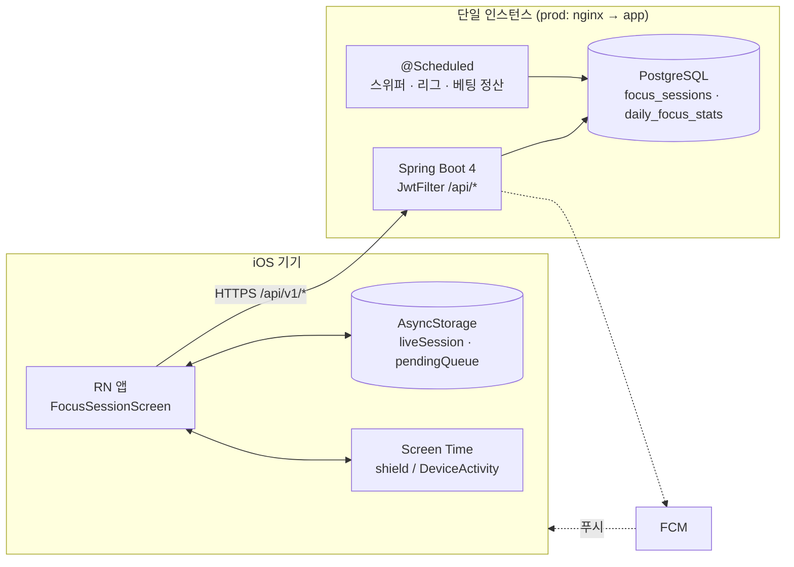
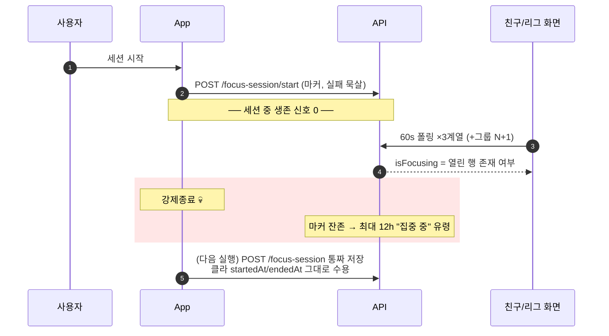
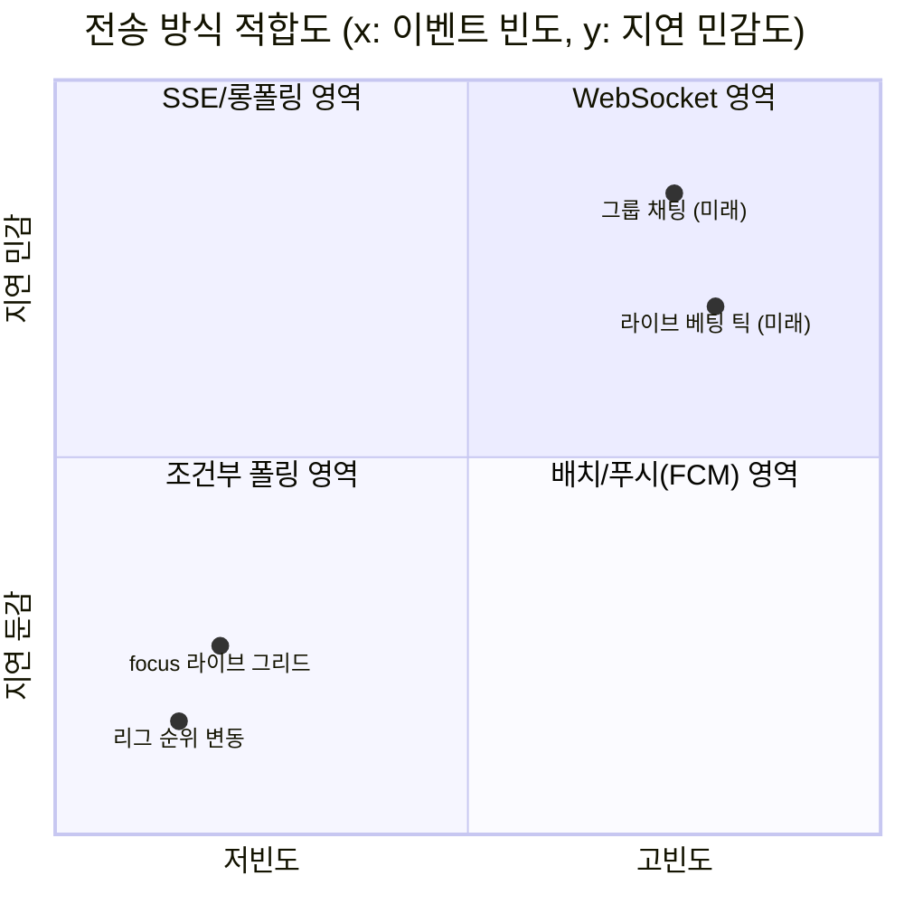
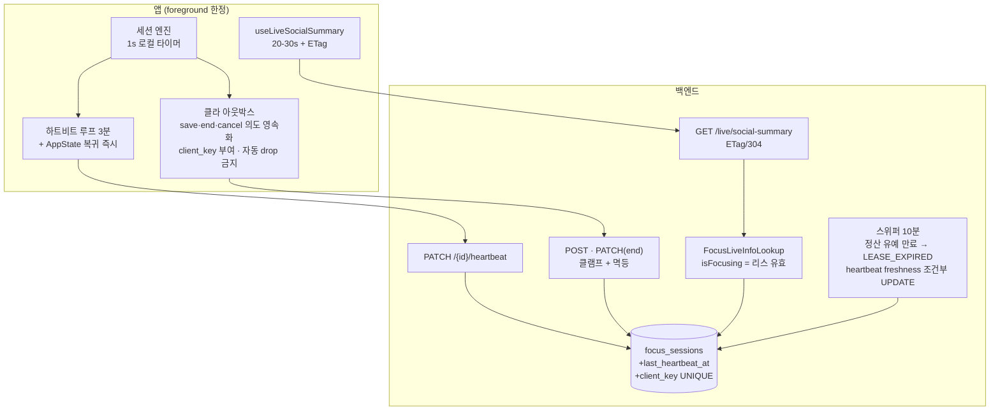
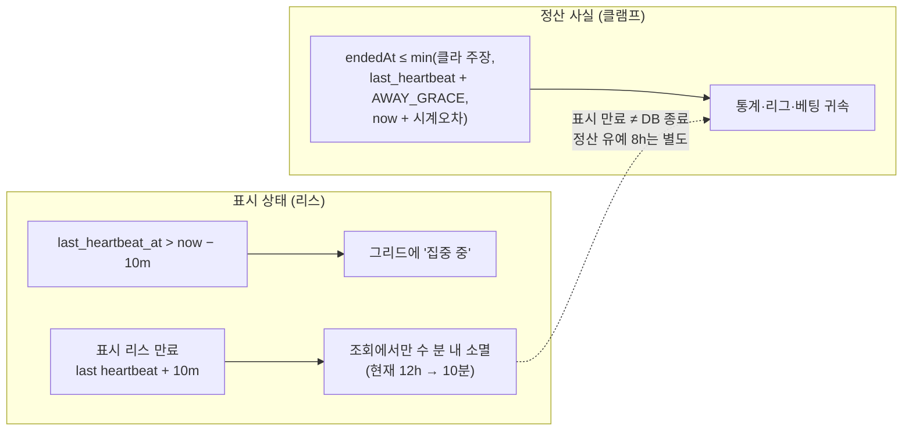
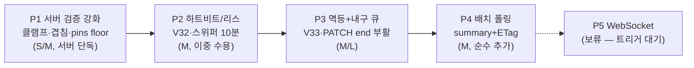
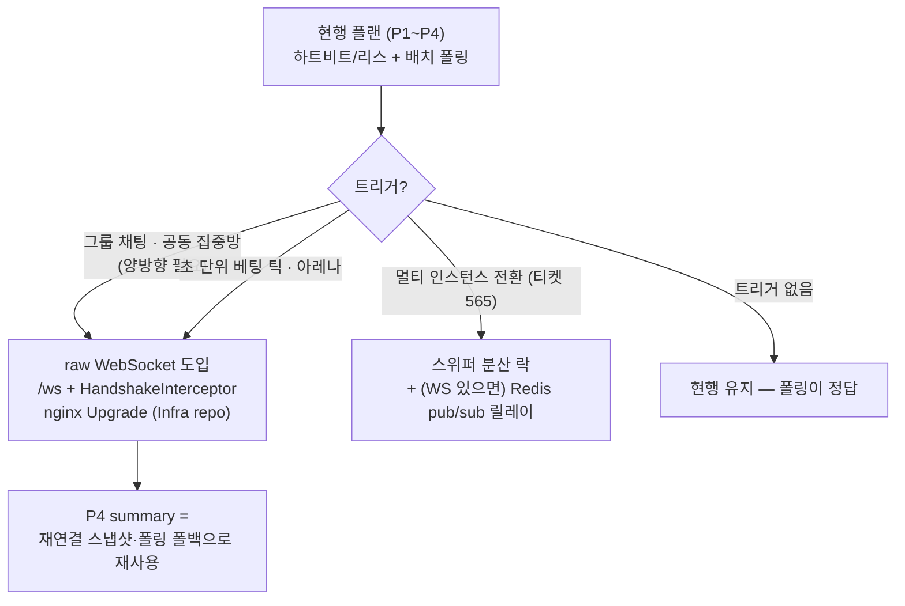

# High-Level Design — focus-session 통신 신뢰성 개편

> 작성 2026-08-08 · 세트: [prd](prd.md) · **hld** · [low-level-design](low-level-design.md) · [information-architecture](information-architecture.md)

## 1. 시스템 컨텍스트

- Screen Time 데이터는 **별도 파이프라인** (`POST /screen-time`) — 이번 개편 범위 밖.
- WS/SSE 채널 없음 — 판정상 도입하지 않음 (§3).

## 2. AS-IS: 무엇이 끊어져 있나

구조적 결함: **마커(표시)와 POST(진실)가 서로를 검증하지 않고**, 그 사이에 생존 증거가 없다.

## 3. 전송 방식 판정 — 왜 WebSocket이 아닌가

판정 축 3개: **이벤트 빈도 × 지연 허용치 × 클라 생존 패턴**.

| 근거 | 내용 |
|---|---|
| 역상관 | iOS는 백그라운드에서 소켓을 끊는다. "폰 내려놓고 집중"이 정상 시나리오(away-credit 8h)인 앱에서 **WS 연결 생존 ≠ 세션 생존** — WS 단절을 이탈로 해석하면 역방향 오류 |
| 무결성은 채널 무관 | 클라가 시간을 통째 주장하는 한 WS로 보내도 신뢰성 0 — 고칠 것은 검증·상태 모델 |
| 푸시는 폴링 위에 얹힌다 | 재연결→재구독→스냅샷 재동기화 코드가 결국 "폴링 1회"와 동일 |
| 비용 비대칭 | WS = `/api/*` 밖 인증 신설 + Infra nginx Upgrade + RN 재연결 상태기계 / SSE = 폴리필 + AsyncConfig 선행 배선 / **폴링 개선 = 컨트롤러 1 + 훅 1** |
| 진짜 낭비는 팬아웃 | 분당 4-5+N 요청의 원인은 주기가 아니라 3계열 중복 + 그룹 N+1 |

## 4. TO-BE 아키텍처

### 핵심 설계 원칙: 표시 상태와 정산 사실의 분리

표시 리스 만료는 **조회 결과만** 끈다. DB 자동 종료는 별도 정산 유예(`AWAY_GRACE=8h`, v1)가 끝난 뒤 수행한다. 유예 안에 앱이 복귀하면 heartbeat/PATCH end로 정상 완료할 수 있고, 유예 뒤 이미 자동 종료됐다면 내구 큐의 END가 원본 마커를 가리키는 `sourceSessionId` 포함 bounded POST 저장으로 폴백한다. 이 분리가 "모바일에서 생존 증명 불가" 제약과 제품 요구를 양립시킨다.

## 5. 단계별 롤아웃

각 Phase는 독립 배포 가능. P2의 `last_heartbeat_at IS NULL → 기존 12h 규칙` 분기가 구버전 이중 수용 창.

## 6. 앞으로 변할 방향

- WS 도입 시 선행 과제: JwtFilter 로직(soft-delete 체크·last_active_at)의 공유 컴포넌트 추출, Infra 레포 nginx `Upgrade`/`Connection` + `proxy_read_timeout`, RN 지수 백오프+지터.
- SSE는 미래에도 비권장 — 양방향 불가 + RN 폴리필 + AsyncConfig(MVC async executor 밀림) 선행 배선 필요.

## 7. 트레이드오프 및 한계

| 결정 | 트레이드오프 | 한계 (수용) |
|---|---|---|
| 폴링 유지 (WS 미도입) | 즉시성 포기 ↔ 인증·인프라·재연결 비용 0 | 표시 갱신 최대 20-30s 지연. 트리거 충족 시 WS 재검토 명문화로 보완 |
| 리스 TTL 10분 / 하트비트 3분 | 유령 신속 제거 ↔ 일시 오프라인 오탐 | N=2~3회 유실 허용 설계로 완화하나, 장시간 터널 등에선 표시 깜빡임 가능. 표시 만료와 8h 정산 유예는 별도 시계 |
| bounding (완전 서버 권위 아님) | away-credit 양립 ↔ 잔여 조작 여지 | shield 부재 구간(최대 8h)은 여전히 클라 신뢰. 근본 해결은 Screen Time 데이터의 서버 검증인데 iOS가 원천 제공하지 않음 — **구조적 한계** |
| 단일 인스턴스 전제 | 스위퍼·ETag 단순 ↔ 스케일아웃 시 재작업 | 분산 락(ShedLock류)·ETag 캐시 일관성은 멀티 인스턴스 전환 시 함께 해결 (티켓 565 계열) |
| 이중 수용 창 | 무중단 배포 ↔ 구버전 유령 잔존 | 창 닫기(하트비트 필수화)는 강제 업데이트 정책과 함께 별도 결정 |
| ETag = 응답 해시 | 구현 단순 ↔ 쿼리는 매 요청 수행 | 304는 전송만 아끼고 DB 비용은 남음 — 병목 시 버전 컬럼/캐시로 진화 여지 |
