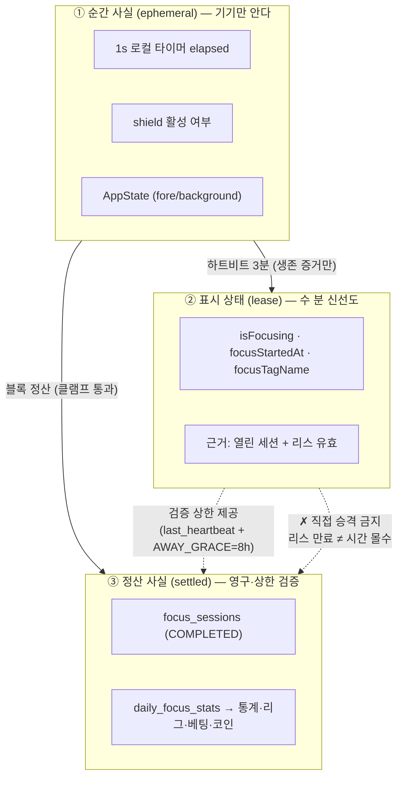
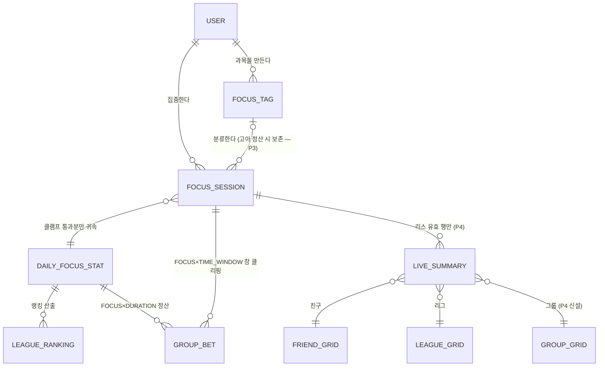
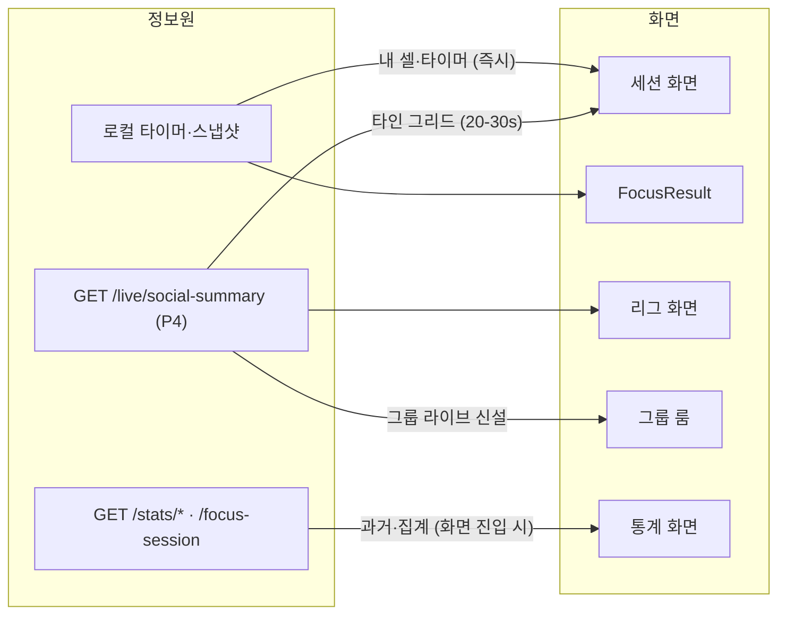
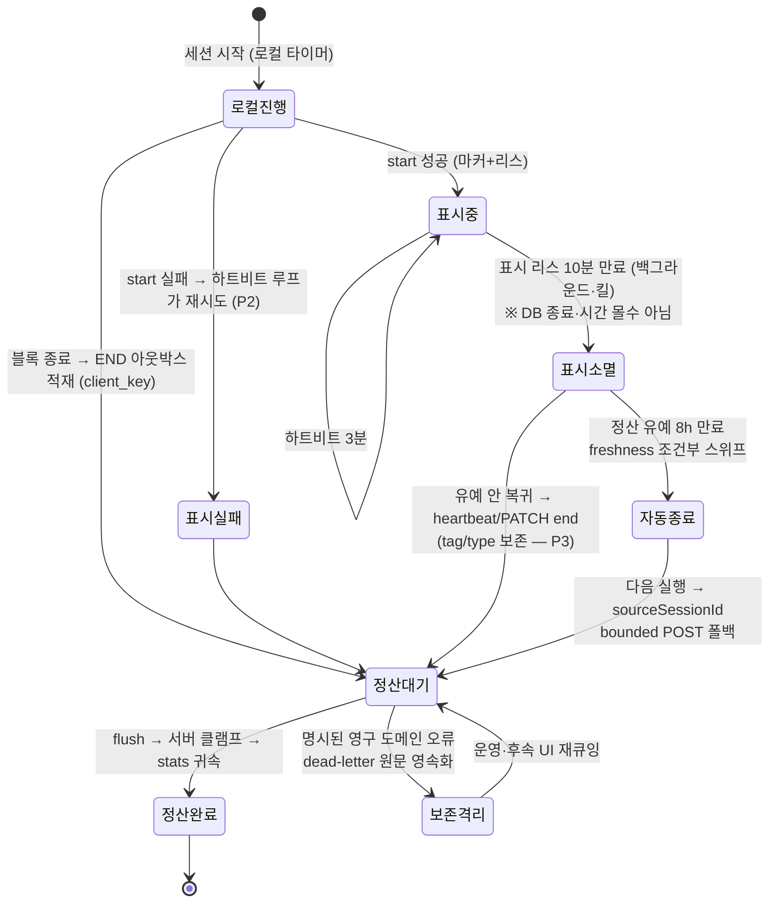

# Information Architecture — focus-session 정보 구조

> 작성 2026-08-08 · 세트: [prd](prd.md) · [high-level-design](high-level-design.md) · [low-level-design](low-level-design.md) · **ia**
> 이 문서는 "집중"이라는 정보가 **어디서 태어나 어떤 신뢰 등급으로 어디에 소비되는가**를 정의한다.

## 1. 정보의 세 층위 — 같은 "집중"이지만 다른 진실

**개편의 본질은 이 세 층위를 명시적으로 분리하는 것.** AS-IS는 ②와 ③이 서로를 모르는 두 갈래(마커 vs 통짜 POST)였고, TO-BE는 ②가 ③의 **상한 근거**가 되되 동일시되지는 않는다.

## 2. 데이터 소유권과 신뢰 등급

| 정보 | 원천(SoT) | 신뢰 등급 | 소비처 |
|---|---|---|---|
| elapsed(진행 중 시간) | 앱 로컬 타이머 | 클라 전용 (서버 미신뢰) | 세션 화면, 내 그리드 셀 |
| liveSession 스냅샷 | AsyncStorage (5s) | 복구용 — tag/type/clientKey 포함(P3) | OrphanFocusSettler |
| isFocusing | **서버** focus_sessions 열린 행+리스 | 서버 파생 (수 분 신선) | 친구/리그/그룹 그리드 |
| started_at | 클라 제출, 서버 기록 | 클라 신뢰 (start 시점이라 낮은 리스크) | 정산·표시 공용 |
| last_heartbeat_at | **서버 시계** (now) | **서버 권위** — 유일한 생존 증거 | 리스 판정·클램프 상한 |
| ended_at | 클라 제출 → **서버 클램프**(P3) | bounded 신뢰 | daily_focus_stats 귀속 |
| client_key | 클라 생성 UUID | 무결성 키 (중복 방어) | 멱등 저장 |
| total_focus_seconds | 서버 집계 | 서버 파생 (입력이 bounded) | 통계·리그 랭킹·FOCUS 베팅 |
| away-credit 구간 | 클라 주장 (v1은 shield 여부 미기록) | **잔여 클라 신뢰 — 구조적 한계** | 정산 유예 `AWAY_GRACE=8h` |

## 3. 엔티티 관계 — 집중 정보의 그래프

## 4. 화면 ↔ 정보 매핑 (소비 지도)

- **신선도 계약**: 내 정보 = 즉시(로컬) / 타인 라이브 = 20-30s / 집계 = 화면 진입 시. 화면마다 다른 신선도를 섞지 않는다 — AS-IS의 "내 셀은 로컬, 친구가 보는 나는 마커"라는 불일치는 리스 도입으로 격차가 12h→수 분으로 줄지만 **0이 되지는 않는다** (아래 §6).

## 5. 정보 수명주기 — 태어나서 정산까지

## 6. 앞으로 변할 방향

- **P4 이후**: LIVE_SUMMARY가 라이브 정보의 **단일 소비 창구**가 된다. 신규 라이브 표면(위젯, 홈 카드)은 전부 이 엔드포인트를 재사용 — 정보 구조상 "라이브 조회 경로 추가 금지"가 규칙이 된다 (`/pins` 우회 같은 분기 재발 방지).
- **P5 (WS 도입 시)**: 정보 구조는 그대로, **전달 방식만** 바뀐다 — summary의 스냅샷이 초기 상태, WS 이벤트가 델타, 재연결 시 summary로 재동기화. 층위 ①②③의 분리는 WS에서도 동일하게 유효하다(연결 생존 ≠ 세션 생존이므로).
- **신뢰 등급 상향 경로**: away-credit 구간의 잔여 클라 신뢰는 shield 여부를 세션에 기록(중기) → Screen Time 사용 증적의 서버 대사(장기, iOS 제약으로 불완전)로 점진 상향.
- **distraction 필드**: 현재 정보 그래프에서 고아(항상 0). 실측 배선하면 ①층(이탈 감지)에서 ③층으로 새 간선이 생기고, 폐기하면 그래프에서 제거 — 어느 쪽이든 "죽은 간선 방치"만은 해소해야 한다.

## 7. 트레이드오프 및 한계

| 정보 구조 결정 | 트레이드오프 | 한계 |
|---|---|---|
| 표시(②)와 정산(③)의 분리 | 유령 제거와 시간 보존 양립 | "그리드에선 사라졌는데 시간은 적립"이라는 순간적 인지 부조화 가능 — UX 문구로 보완 필요 |
| 내 셀=로컬, 타인=서버 파생 | 내 화면 즉시성 확보 | 내가 보는 나와 남이 보는 나의 격차 최대 리스 TTL(10분)+폴링 주기 — 완전 일치는 WS로도 불가(전파 지연) |
| 서버가 아는 생존 증거를 하트비트 하나로 단일화 | 판정식 단순·감사 가능 | 하트비트 유실(일시 오프라인)과 실제 이탈을 서버가 구분 못 함 — TTL은 이 모호함의 타협점 |
| away-credit을 정산 층에서만 처리 | 표시 층 단순 유지 | shield 8h 부재 사용자는 표시상 "미집중" — PRD 오픈 결정 1의 수용 대상 |
| dead-letter 원문 영속화, 자동 재시도 중단 | 무한 재시도 방지와 무유실 양립 | v1은 사용자 복구 UI 없음 — 운영 재큐잉 후 발생률에 따라 UI 후속 |
