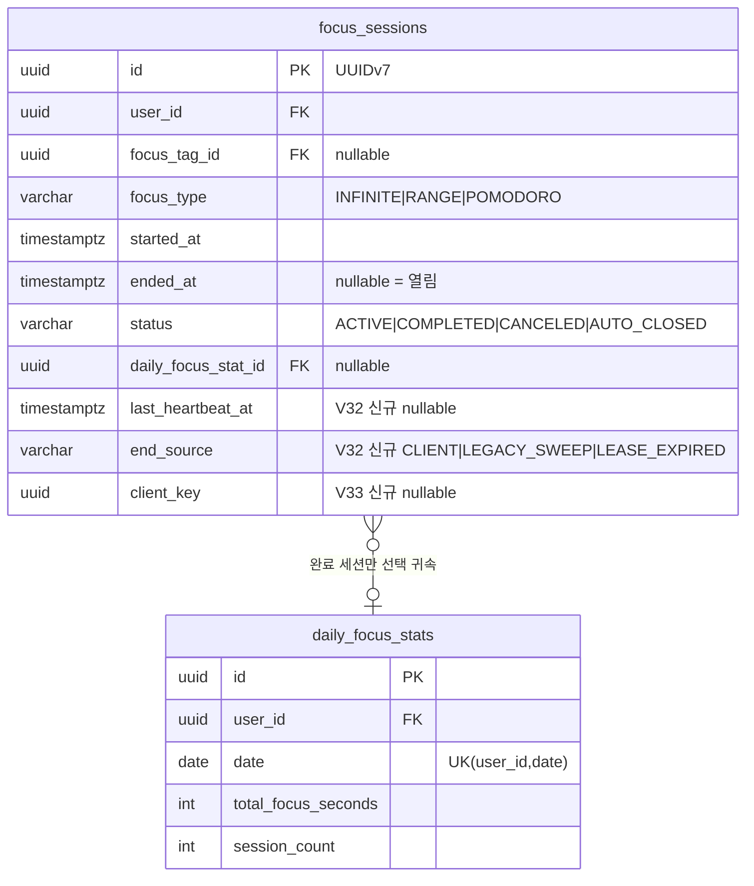
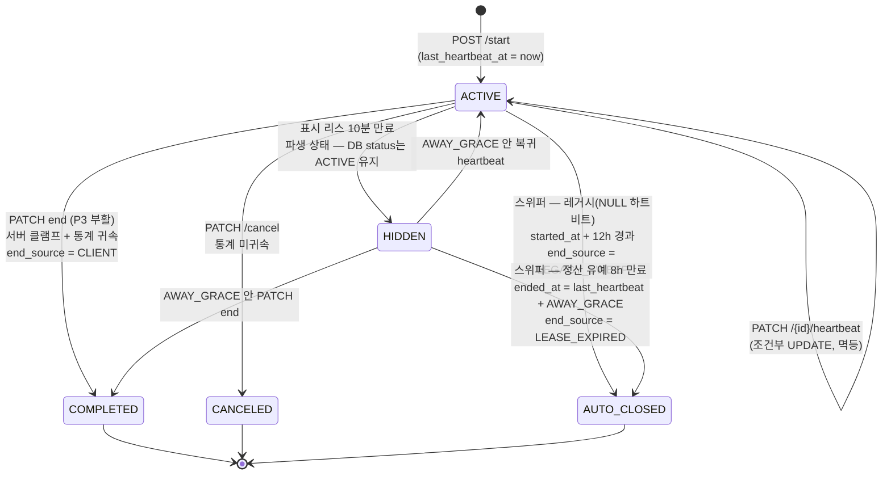
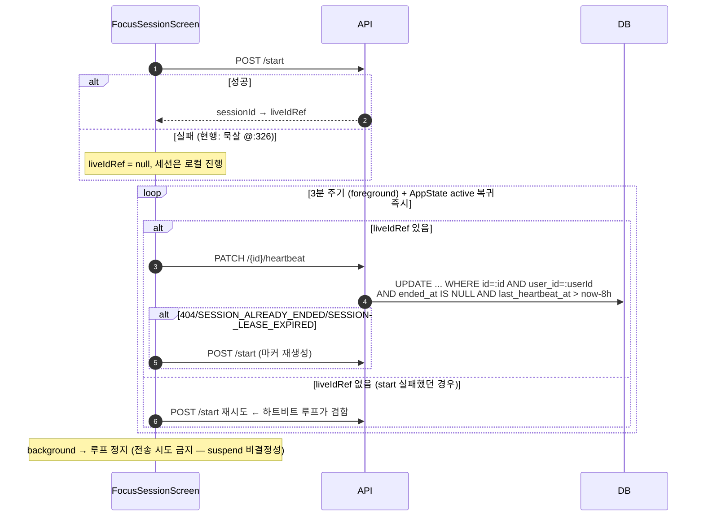
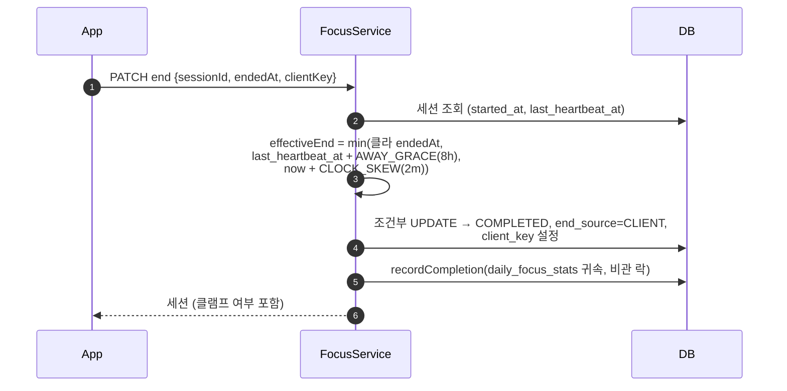
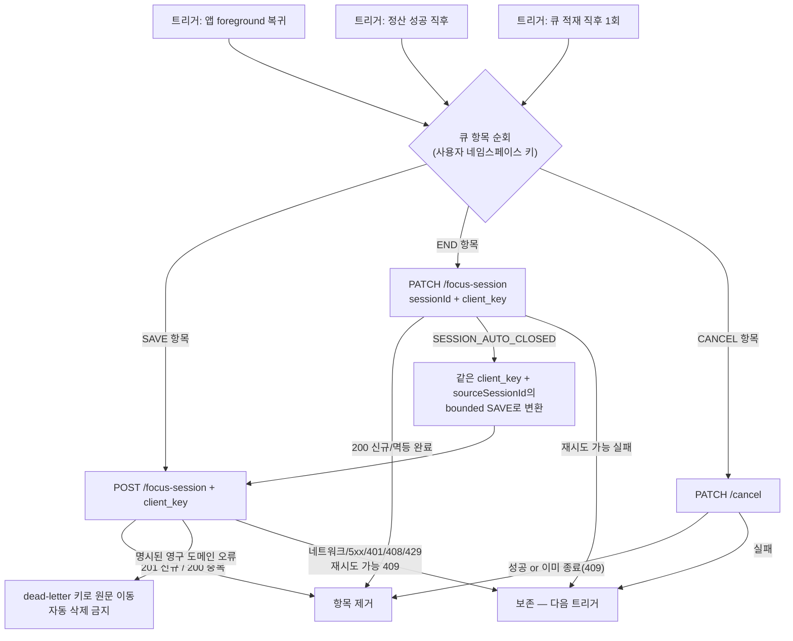
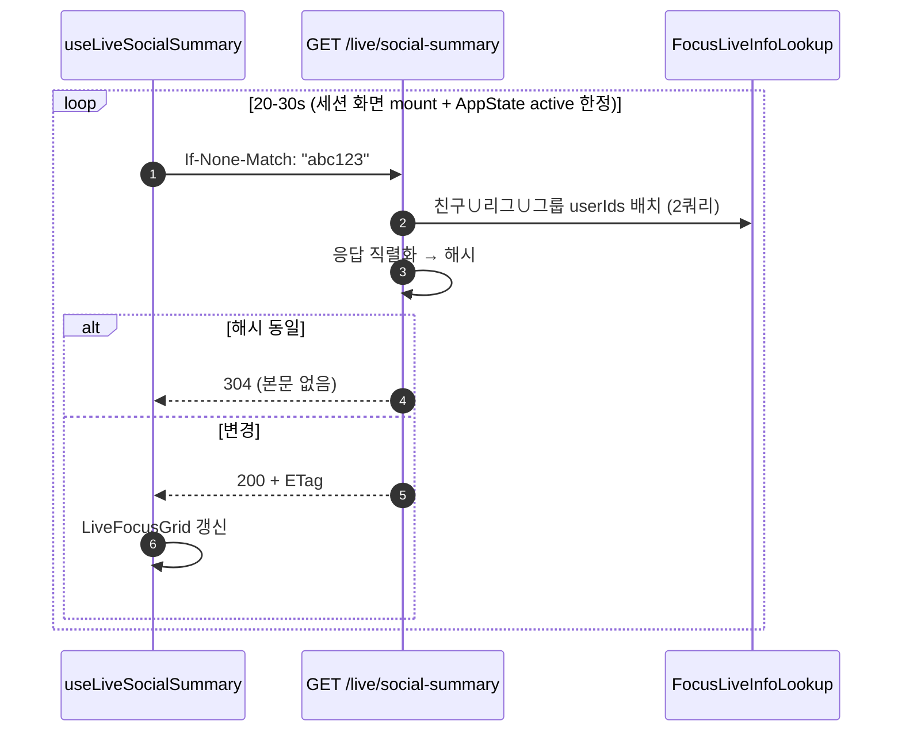

# Low-Level Design — focus-session 통신 신뢰성 개편

> 작성 2026-08-08 · 세트: [prd](prd.md) · [high-level-design](high-level-design.md) · **lld** · [information-architecture](information-architecture.md)
> v1 고정 파라미터: 하트비트 3분 · 표시 리스 TTL 10분 · 스위퍼 10분 · 시계오차 허용 2분 · AWAY_GRACE 8시간

## 1. 스키마 변경



```sql
-- V32__focus_session_heartbeat.sql
-- 현재 저장소의 V31은 V31__backfill_ownerless_group_owner.sql이 이미 사용한다.
ALTER TABLE focus_sessions
    ADD COLUMN last_heartbeat_at timestamptz,
    ADD COLUMN end_source varchar(20);
ALTER TABLE focus_sessions
    ADD CONSTRAINT focus_sessions_end_source_check
    CHECK (end_source IN ('CLIENT', 'LEGACY_SWEEP', 'LEASE_EXPIRED'));
CREATE INDEX idx_focus_sessions_active_hb
    ON focus_sessions (user_id, last_heartbeat_at) WHERE ended_at IS NULL;
CREATE INDEX idx_focus_sessions_sweep_hb
    ON focus_sessions (last_heartbeat_at) WHERE ended_at IS NULL;

-- V33__focus_session_client_key.sql
ALTER TABLE focus_sessions ADD COLUMN client_key uuid;
CREATE UNIQUE INDEX uq_focus_sessions_user_client_key
    ON focus_sessions (user_id, client_key) WHERE client_key IS NOT NULL;
```

- partial unique: 구버전(NULL) 공존 — NULL은 기존 exact-interval 휴리스틱(`FocusService.java:278`)으로 폴백. 신규 INSERT는 네이티브 `INSERT ... ON CONFLICT DO NOTHING RETURNING id`로 성공 여부를 먼저 확정하고, **삽입에 성공한 요청만** 통계·코인 부수효과를 수행한다. 충돌 요청은 기존 행과 현재 집계만 조회해 200으로 반환한다(제약 예외를 같은 트랜잭션에서 catch해 계속 진행하지 않음).
- `end_source`로 종료 경위 감사 가능 (스위퍼 vs 클라 vs 리스 만료).

## 2. 세션 상태 머신



- `HIDDEN`은 저장 enum이 아니라 조회 시각에 계산되는 표시 상태다. 표시 TTL이 끝났다는 이유만으로 행을 닫지 않는다.
- end/cancel 전이는 기존 관례대로 `WHERE ended_at IS NULL` 조건부 원자 UPDATE를 쓴다.
- **스위퍼-하트비트 경합은 `ended_at IS NULL`만으로 닫히지 않는다.** 스위퍼 UPDATE는 `last_heartbeat_at = :observedHeartbeat AND last_heartbeat_at <= :settlementCutoff`까지 재검증한다. 하트비트가 조회와 UPDATE 사이에 갱신됐다면 0행으로 스킵한다.
- heartbeat UPDATE는 `WHERE id=:id AND user_id=:userId AND ended_at IS NULL AND last_heartbeat_at > now-AWAY_GRACE`를 사용한다. 표시 TTL만 지난 세션은 부활할 수 있지만 정산 유예까지 지난 세션은 409 `SESSION_LEASE_EXPIRED`로 새 마커 생성 신호를 준다.
- 상태 enum은 유지하고 `end_source`로 구분 (enum 추가는 마이그레이션·역호환 비용 대비 이득 없음).

## 3. API 명세 (변경분)

| 메서드/경로 | 신규? | 요청 | 응답 | 비고 |
|---|---|---|---|---|
| `PATCH /api/v1/focus-session/{id}/heartbeat` | ✅ P2 | 본문 없음 | 204 | 소유자+freshness 조건부 갱신. 타인/없음=404, 이미 종료=409 `SESSION_ALREADY_ENDED`, 정산 유예 만료=409 `SESSION_LEASE_EXPIRED` |
| `PATCH /api/v1/focus-session` (end) | 부활 P3 | `{sessionId, endedAt, clientKey, focusTagId, focusType}` | 세션 | 클램프 후 통계 귀속. 동일 `sessionId+clientKey`로 이미 COMPLETED면 200 기존 결과 |
| `POST /api/v1/focus-session` | 확장 P3 | + `{clientKey, sourceSessionId?}` | 200 기존 or 201 신규 | `sourceSessionId`가 있으면 소유 마커의 heartbeat로 bounded 검증. `ON CONFLICT DO NOTHING RETURNING`; 삽입 성공 때만 부수효과 |
| `GET /api/v1/live/social-summary` | ✅ P4 | `If-None-Match` | `{friends[], league[], groups[]}` + `ETag` | 변화 없으면 304 |

### isFocusing 판정식 (FocusLiveInfoLookup)

```
isFocusing(session) =
  ended_at IS NULL
  AND ( last_heartbeat_at > now − LEASE_TTL(10m)          -- 신버전
        OR (last_heartbeat_at IS NULL                      -- 구버전 이중 수용 창
            AND started_at > now − 12h) )
```

`/pins` 경로(`FriendService.java:281`)도 P1에서 이 판정식으로 통일 (현재 floor 없음).

알림 서비스의 직접 조회(`findUserIdsWithLiveSession`)도 같은 `FocusLivePresencePolicy`로 통합한다. 화면만 10분 리스이고 알림 억제는 12시간인 이중 기준을 허용하지 않는다.

### P1 시간 검증 결정표

| 입력/경계 | v1 처리 | 오류/응답 |
|---|---|---|
| `startedAt`/`endedAt` 누락 | 거부 | 400 `INVALID_DATE_RANGE` |
| `endedAt > now + 2m` | `now + 2m`으로 클램프 | 200/201에 `effectiveEndedAt`, `clamped=true` |
| 클램프 후 `startedAt > endedAt` | 거부 | 400 `INVALID_DATE_RANGE` |
| 길이 `> 12h` | `endedAt = startedAt + 12h`로 클램프 | `clamped=true` |
| 이미 정산된 세션과 겹침 | 거부. `CANCELED`·`AUTO_CLOSED` 표시 마커는 겹침 검사에서 제외 | 409 `SESSION_OVERLAP` |
| `totalDistractionSeconds < 0` 또는 유효 구간보다 큼 | 거부 | 400 `INVALID_DISTRACTION_SECONDS` |

P3부터 위 결과에 `last_heartbeat_at + AWAY_GRACE(8h)` 상한을 추가한다. 통계·스트릭·코인·응답은 모두 클램프된 동일 구간을 사용한다.

## 4. 핵심 시퀀스

### 4-1. 하트비트 + start 실패 복구 (P2)



### 4-2. 종료 클램프 (P3)



- `AWAY_GRACE`: v1은 shield 여부를 서버가 검증할 수 없으므로 전 세션 8시간으로 고정한다. shield 없이 자리 비운 구간도 최대 8시간 인정되는 한계를 명시적으로 수용하고, shield 여부를 세션에 기록할 수 있을 때 정책을 분기한다.
- PATCH 응답 유실 후 동일 `sessionId+clientKey` 재요청은 이미 COMPLETED인 행을 읽어 200으로 반환한다. 이미 `AUTO_CLOSED`라면 409 `SESSION_AUTO_CLOSED`를 반환하고 클라는 같은 END 항목을 `sourceSessionId=sessionId`인 bounded POST SAVE로 변환한다. 서버는 자동 종료된 원본 마커의 heartbeat를 조회해 같은 8시간 상한을 적용한다.

### 4-3. 클라 아웃박스 flush (P3)



- 큐 키: `gromo:focus:outbox:{userId}`, 격리 키: `gromo:focus:dead-letter:{userId}` — 계정 전환 시 **폐기 대신 보존**, 해당 userId 재로그인 때 flush.
- 항목 스키마: `{kind: 'save'|'end'|'cancel', clientKey, sessionId?, sourceSessionId?, body, enqueuedAt, attempts, lastErrorCode?}`. END body는 AUTO_CLOSED 시 `sourceSessionId=sessionId`인 POST로 폴백할 수 있도록 전체 구간·tag/type을 포함한다.
- **하드 cap과 oldest-drop을 제거한다.** 50건은 관측 경고 임계값일 뿐 삭제 기준이 아니다. AsyncStorage 쓰기가 실패하면 liveSession 원본을 지우지 않는다.
- 기존 단일 `focusPendingUploads` 키는 최초 읽기 때 항목의 `userId`별 namespace로 원자 마이그레이션한다. 소유자를 판별할 수 없는 레거시 항목은 삭제하지 않고 별도 `unknown-owner` dead-letter에 보존한다.
- 게스트→소셜 계정 전환 성공 시 guest namespace를 새 userId namespace로 명시적으로 re-key한다.
- liveSession 5초 스냅샷에 `focusTagId`·`focusType`·`clientKey` 추가 → `OrphanFocusSettler`가 태그 보존 END/SAVE와 cancel 의도를 아웃박스에 등록.

### 4-4. 스위퍼 조건부 종료

```sql
UPDATE focus_sessions
SET status = 'AUTO_CLOSED',
    ended_at = last_heartbeat_at + INTERVAL '8 hours',
    end_source = 'LEASE_EXPIRED'
WHERE id = :id
  AND ended_at IS NULL
  AND last_heartbeat_at = :observed_heartbeat
  AND last_heartbeat_at <= :now - INTERVAL '8 hours';
```

스위퍼가 후보를 읽은 뒤 heartbeat가 성공했다면 `last_heartbeat_at = :observed_heartbeat`가 깨져 0행이 된다. 레거시 NULL 행은 별도 UPDATE에서 `started_at <= now-12h AND last_heartbeat_at IS NULL`을 재검증한다.

### 4-5. 배치 폴링 (P4)



## 5. 파일별 변경 지도

| Phase | 파일 | 변경 |
|---|---|---|
| P1 | `back/.../focus/dto/FocusSessionRequest.java` | Bean Validation 부여 |
| P1 | `back/.../focus/service/FocusService.java` | 클램프·겹침 검증 (`:261-267` 확장) |
| P1 | `back/.../friend/service/FriendService.java:281` | pins → LiveInfoLookup 판정식 통일 |
| P2 | `back/.../db/migration/V32__*.sql` | heartbeat/end_source 스키마·live/sweep 인덱스 |
| P2 | `back/.../focus/api/FocusController.java` | heartbeat 엔드포인트 |
| P2 | `back/.../focus/service/FocusLiveInfoLookup.java` | 리스 판정식 + NULL 분기 |
| P2 | `back/.../focus/scheduler/FocusSessionOrphanScheduler.java` | cron 10분·리스 만료 처리 |
| P2 | `back/.../notification/service/RankOvertakeNotificationService.java` · `LeagueReengagementNotificationService.java` | 직접 12h 라이브 판정을 공용 리스 정책으로 교체 |
| P2 | `app/src/services/focusApi.ts` · `screens/focus/FocusSessionScreen.tsx` | 하트비트 루프·start 재시도 |
| P3 | `back/.../db/migration/V33__*.sql` + `FocusService` | client_key·ON CONFLICT 멱등 저장·PATCH end 클램프 |
| P3 | `app/src/screens/focus/pendingFocusUploads.ts` → 아웃박스 개편 | kind·clientKey·네임스페이스 |
| P3 | `app/src/screens/focus/OrphanFocusSettler.tsx` · `types.ts` | 스냅샷 tag/type/clientKey·END/SAVE/cancel 등록 |
| P4 | `back/.../live/` 신규 컨트롤러 + `app/src/hooks/useLiveSocialSummary.ts` 신규 | summary+ETag / 폴링 통합 |
| P4 | `back/build.gradle:51` · `back/CLAUDE.md` | 팬텀 websocket 의존성·STOMP 서술 제거 |

## 6. 검증 계획

- **Testcontainers**: 결정표의 클램프/거부 경계, 표시 TTL vs 정산 유예 분리, NULL 레거시 분기, `sweeper SELECT → heartbeat UPDATE → sweeper UPDATE=0` 강제 인터리빙, client_key 동시 POST 중 부수효과 정확히 1회, PATCH 응답 유실 재시도 200, AUTO_CLOSED→POST 폴백, pins·알림 판정 회귀.
- **maestro**: 세션 시작→강제종료→(리스 경과)→친구 계정 그리드 소멸 / 킬→재실행→태그 보존 정산.
- **k6**: heartbeat 쓰기 부하(최고빈도 신규 경로 — focus_sessions 인덱스 병목 이력 주의), summary 304 비율.
- **수동**: 구버전 앱(하트비트 미전송) 병행 동작 — 12h 규칙 유지 확인.
- **앱 단위 테스트**: 401·429·재시도 가능 409는 큐 유지, 영구 도메인 오류는 원문 dead-letter 이동, 50건 초과 자동 삭제 없음, 레거시 키·guest namespace re-key, END→AUTO_CLOSED→sourceSessionId POST 변환.

## 7. 앞으로 변할 방향·트레이드오프·한계 (LLD 관점)

- **하트비트가 UPDATE 폭이 됨**: 사용자 N × 3분당 1회. 현 규모 무해하나, 성장 시 hot row·WAL 증가 — 그때 Redis TTL presence로 이관하는 진화 경로가 자연스럽다(채팅 topic의 presence 설계와 수렴). 지금 안 하는 이유: Redis가 스택에 없고, DB 한 곳이 진실이라 정합 논증이 단순.
- **ETag=응답 해시는 DB 비용을 안 줄인다**: 304여도 배치 2쿼리는 돈다. 병목 시 `max(updated_at)` 버전 컬럼 선체크 또는 캐시로 진화. 멀티 인스턴스가 되면 해시 일관성은 자동 성립(무상태)하나 캐시 도입 시엔 공유 캐시 필요.
- **exactly-once는 불가**: client_key는 "중복 적립 불가"를 보장할 뿐 "정확히 한 번 전송"은 아니다. 영구 도메인 오류 항목은 원문 그대로 dead-letter 키에 남고 자동 적립되지는 않는다 — v1 운영 재큐잉은 가능하지만 사용자 복구 UI는 범위 외.
- **AWAY_GRACE=8h 전 세션 동일(v1)의 부작용**: shield 없이 자리 비운 사용자도 최대 8시간 인정된다. shield 여부의 세션 기록(신뢰 등급 상향)은 후속 — 그때도 iOS가 Screen Time 원본을 서버에 주지 않는 구조적 한계는 남는다.
- **스위퍼 10분 cron은 단일 인스턴스 전제**: 멀티 전환(티켓 565) 시 ShedLock류 분산 락과 함께 재검토.
