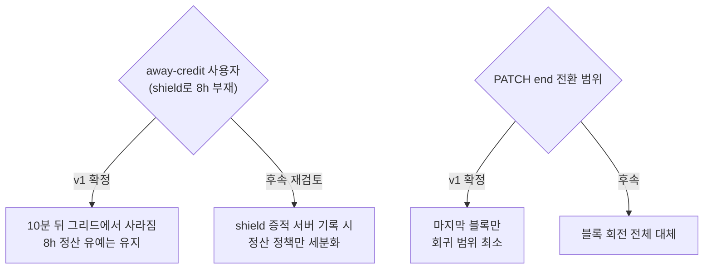

# PRD — focus-session 통신 신뢰성 개편

> 작성 2026-08-08 · 상위 판정 문서: `docs/etc/focus-session-reliability-plan.md`
> 문서 세트: [prd](prd.md) · [high-level-design](high-level-design.md) · [low-level-design](low-level-design.md) · [information-architecture](information-architecture.md)

## 1. 배경 — 사용자가 겪는 문제

집중 세션의 서버 통신이 "시작 마커"와 "시간 저장"으로 분리되어 있고 그 사이를 잇는 생존 신호가 없다. 그 결과 사용자 관점에서 다음이 발생한다:

| 증상 (사용자 언어) | 원인 (기술) | 빈도/심각도 |
|---|---|---|
| "쟤 12시간째 집중 중이라는데?" — 친구·리그 그리드의 유령 | 강제종료 시 마커 미취소, 서버 스위퍼는 12h 임계 | 강제종료마다 발생 · **심각** (소셜 신뢰 훼손) |
| "어제 집중한 시간이 사라졌어요" | 킬 시 최대 5초+ 유실, 업로드 큐 50개 캡·계정전환 폐기 | 저빈도 · **심각** (핵심 가치 훼손) |
| "카테고리별 통계가 안 맞아요" | 고아 정산 시 focusTagId/focusType 소실 | 킬 후 복구마다 · 중간 |
| (표면화 안 됨) 리그·베팅이 조작 가능 | 시간이 전면 클라 신뢰 — 통계·랭킹·베팅 정산 근거 | 상시 노출 · **심각** (경쟁 기능 무결성) |
| (비용) 세션 중 분당 4-5+N 요청 | 60s 폴링 3계열 + 그룹 N+1 | 상시 · 낮음(현 규모) |
| "그룹에선 누가 집중 중인지 안 보여요" | 그룹 DTO에 라이브 필드 부재 (항상 false) | 상시 · 중간 (기능 부재) |

## 2. 목표 / 비목표

### 목표 (성공 기준 포함)

1. **유령 제거**: 앱이 죽으면 서버의 "집중 중" 판정은 **10분 내**, 30초 폴링 UI는 **10분 30초 내** 사라진다 (현재 최대 12시간).
2. **시간 무유실**: 강제종료·오프라인·계정전환 어떤 경로에서도 집중 시간·태그·타입이 자동 폐기되지 않는다 (재시도 큐·dead-letter 영속화 + 멱등 재전송). 큐 상한 초과나 HTTP 상태 계열만으로 항목을 삭제하지 않는다.
3. **부정 상한**: 클라가 주장할 수 있는 집중 시간에 서버가 검증 가능한 상한을 건다 — `하트비트 증거 + away-credit 유예`를 넘는 시간은 클램프.
4. **그룹 라이브 표시 신설** + 세션 화면 네트워크를 단일 엔드포인트의 분당 2~3회 요청(대부분 304)으로 통합.

### 비목표 (이번에 하지 않음)

- WebSocket/SSE 도입 — 판정 결과 현 요구에 부적합 (근거: HLD §3). 트리거 조건 충족 시 재검토.
- distraction 필드(항상 0) 실측 배선 — 별도 티켓 후보.
- 백그라운드에서의 하트비트 전송 — iOS suspend상 불가능하며, 불가능을 전제로 설계한다.
- 완전한 서버 권위 시간 — away-credit(부재 8h 크레딧)과 양립 불가. **bounding**이 목표다.

## 3. 유저 스토리

- **집중하는 사용자**: 폰을 내려놓고 8시간 공부해도(shield away-credit) 내 시간은 온전히 적립되고, 앱이 죽어도 다음 실행 때 태그까지 보존된 채 복구된다.
- **친구/리그 경쟁자**: 그리드의 "집중 중"은 실제로 지금 집중하는 사람이다 — 몇 분 이상 낡은 유령이 아니다.
- **그룹원**: 그룹 화면에서도 누가 지금 집중 중인지 보인다.
- **베팅 참가자**: FOCUS 베팅의 정산 근거(집중 시간)는 서버가 상한 검증한 값이다.

## 4. 요구사항

### 기능 요구사항

| ID | 요구사항 | Phase |
|---|---|---|
| F1 | 세션 시간 요청의 서버측 검증: 미래시각·12h 초과는 명시 규칙으로 클램프, 이미 정산된 세션과의 겹침은 거부 | P1 |
| F2 | `/pins` 라이브 조회에도 12h floor 적용 (우회 경로 봉합) | P1 |
| F3 | 3분 주기 하트비트로 리스(TTL 10분) 갱신, isFocusing은 리스 유효 시에만 | P2 |
| F4 | 스위퍼 10분 주기. 표시 리스 만료는 조회에서만 숨기고, 정산 유예(`AWAY_GRACE=8h`, v1)가 끝난 세션만 `last_heartbeat + AWAY_GRACE`로 자동 종료 | P2 |
| F5 | start 실패 재시도 (하트비트 루프 편승) | P2 |
| F6 | client_key 멱등 저장 (DB unique) — 재전송 중복 적립 불가 | P3 |
| F7 | save·end·cancel 의도를 담는 내구 큐, 계정 네임스페이스·레거시 키 마이그레이션, flush 트리거 확대. 자동 drop 금지 | P3 |
| F8 | 고아 정산 시 focusTagId/focusType 보존 | P3 |
| F9 | 정식 종료 `PATCH /focus-session` 부활 — 서버 클램프 후 통계 귀속. 동일 `sessionId+clientKey` 재요청은 200 멱등 성공, 자동 종료된 마커는 `sourceSessionId`를 포함한 bounded POST 저장으로 안전하게 폴백 | P3 |
| F10 | `GET /live/social-summary` 단일 배치 + ETag/304, 그룹 라이브 포함 | P4 |

### 비기능 요구사항

- **호환성**: 구버전 앱이 하트비트 없이 동작해도 기존(12h) 규칙으로 동작 — 이중 수용 창. 강제 업데이트 없이 배포 가능해야 한다.
- **부하**: 하트비트는 사용자당 3분에 1회 UPDATE — k6로 회귀 확인. summary는 304 비율 80%+ 목표.
- **단일 인스턴스 전제**: 스케줄러·스위퍼는 현행 관례(분산 락 TODO 티켓 565) 유지.
- **내구성**: 네트워크·5xx·401·408·429와 재시도 가능한 도메인 409는 큐에 남긴다. 영구 실패는 명시된 도메인 오류 코드만 별도 dead-letter 저장소로 이동하며 원문을 삭제하지 않는다.

## 5. v1 제품 결정 (확정)

1. **away-credit × 표시 리스**: shield 부재 중 10분 뒤 그리드에서 사라지는 것을 수용한다. DB 행과 최대 8시간 정산 유예는 유지한다.
2. **PATCH end 전환 범위**: v1은 마지막 블록만 전환한다.

## 6. 성공 지표

| 지표 | 현재 | 목표 |
|---|---|---|
| 유령 "집중 중" 최대 지속 | 12h | 서버 판정 ≤10분, 폴링 UI ≤10분 30초 (P2) |
| 킬 후 복구 시 태그 보존율 | 0% | 100% (P3) |
| 재전송 중복 적립 | 레이스 가능 | 0 (DB 보장, P3) |
| 큐 cap/상태코드 오분류에 의한 자동 유실 | 가능 | 0 (P3) |
| 세션 화면 요청 수 | 4-5+N/분 | ≤ 3/분, 304 80%+ (P4) |
| 그룹 라이브 표시 | 불가 | 제공 (P4) |

## 7. 앞으로 변할 방향

- **P5 (보류) — WebSocket**: 그룹 채팅 / 실시간 공동 집중방 / 초 단위 베팅 틱이 로드맵에 확정되면 raw WS 도입 (SSE 아님 — RN 내장·양방향). 이때 P4의 summary 엔드포인트가 재연결 스냅샷·폴링 폴백으로 재사용된다.
- **멀티 인스턴스 전환** (티켓 565 계열): 스위퍼 분산 락 + (WS 도입돼 있다면) Redis pub/sub 릴레이.
- **distraction 실측**: 이탈 감지는 이미 있으므로(leaveNotifications) 필드 배선 또는 폐기 결정.

## 8. 트레이드오프 및 한계

| 선택 | 얻는 것 | 잃는 것 / 한계 |
|---|---|---|
| WS 대신 하트비트+폴링 | 인증·인프라·재연결 상태기계 비용 0, 오프라인 내성 | "즉시성"은 포기 — 표시 갱신 최대 20-30s 지연 (제품상 무해) |
| 리스 TTL 10분 | 유령 12h→10분 | 일시 오프라인(터널 등) 사용자가 잠깐 그리드에서 사라질 수 있음 |
| bounding (완전 검증 아님) | away-credit과 양립 | shield 부재 구간은 여전히 클라 신뢰 — 조작 여지가 **줄지만 0은 아님** |
| 이중 수용 창 (NULL 하트비트) | 강제 업데이트 불필요 | 구버전 사용자는 유령 12h가 잔존 — 창 닫기 별도 티켓 필요 |
| 마지막 블록만 PATCH end | 회귀 최소 | 마커-진실 분리가 부분 존속 — 완전 통합은 후속 |
